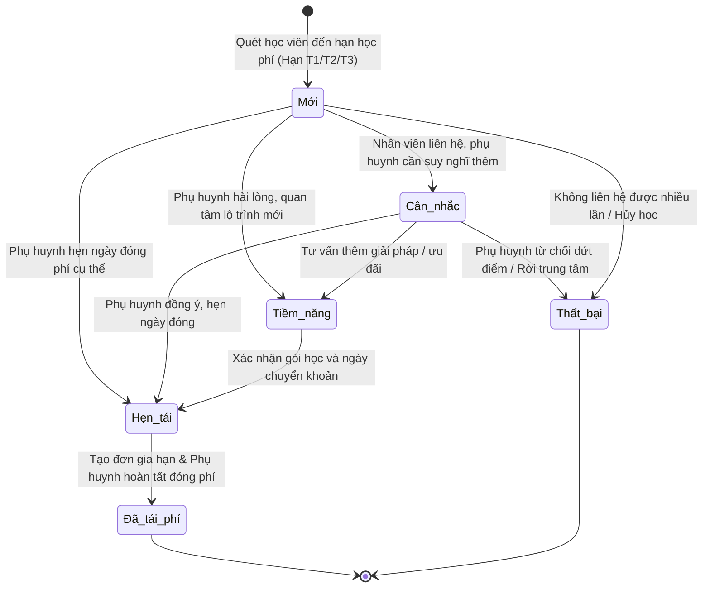

# BF-CARE-02: Nghiệp vụ Quản lý & Chăm sóc Tái phí Học viên (Tuition Renewal & Retention Care)

> **Capability:** CAP-CARE (Nghiệp vụ Chăm sóc Học viên & Giữ chân Khách hàng)  
> **Parent BR:** BR-001 (Tăng tỷ lệ tái phí và doanh thu định kỳ từ học viên đang học)  
> **Persona:** SR-CSM-002 (Nhân viên Chăm sóc Khách hàng & Quản lý cơ sở)  
> **Giai đoạn:** 2 - Vận hành hàng ngày & Giữ chân học viên  
> **Nhóm chức năng:** Vận hành và chăm sóc  
> **Mã màn hình:** `renewal` (Menu chính: Vận hành và chăm sóc → Menu phụ: Tái phí học viên)

---

## Lịch sử cập nhật tài liệu (Changelog)

| Ngày cập nhật | Nội dung cập nhật | Lý do cập nhật |
|---|---|---|
| 14/08/2026 | Phát hành tài liệu phân hệ BF-CARE-02 | Chuẩn hóa quy trình nghiệp vụ chăm sóc tái phí, liên thông tạo đơn đơn hàng gia hạn CRM và dòng thời gian chăm sóc |

---

## 1. Bối cảnh & Vấn đề hiện tại (Context & Problem Statement)

* **Bối cảnh:** Trong hoạt động vận hành của chuỗi trung tâm đào tạo, việc duy trì vòng đời học tập liên tục của học viên thông qua tái phí (Renewal / Retention) là yếu tố quyết định tới doanh thu định kỳ và sự gắn kết của phụ huynh. Phân hệ Chăm sóc Tái phí (`/app/renewal`) đóng vai trò là trung tâm tác nghiệp chuyên biệt giúp đội ngũ Chăm sóc khách hàng (CSM) và Quản lý cơ sở (BM) chủ động rà soát hạn học phí dự kiến, phân loại tiềm năng tái phí, thực hiện tương tác tư vấn lộ trình học tiếp theo, tạo đơn nháp gia hạn liên thông sang hệ thống quản trị khách hàng (CRM) và quản lý chuyển đổi thành công.
* **Vấn đề thực tế:**
  * *Thiếu công cụ phân nhóm hạn học phí tập trung:* Trước đây nhân viên phải tra cứu thủ công từng hợp đồng để tìm ngày kết thúc gói học, dẫn đến việc liên hệ phụ huynh quá muộn (sát ngày hoặc sau khi học viên đã kết thúc khóa), làm tỷ lệ rời bỏ khóa học (churn rate) tăng cao.
  * *Không có bức tranh 360 độ về học tập trước khi tư vấn tái phí:* Khi liên hệ phụ huynh, nhân viên CSKH thiếu thông tin tổng hợp về chuyên cần, điểm thi, sự tiến bộ của học viên, dẫn đến cuộc gọi mang tính chất giục phí thuần túy thay vì tư vấn lộ trình học nâng cao, giảm thuyết phục đối với phụ huynh.
  * *Rời rạc giữa tác nghiệp chăm sóc và tạo đơn báo giá:* Tác nghiệp ghi nhận phản hồi và tạo đơn hàng gia hạn diễn ra trên các giao diện tách biệt, không lưu vết liên kết giữa gói học cũ và đơn nháp mới, gây khó khăn cho việc đối soát và phân tích tỷ lệ chuyển đổi.

---

## 2. Mục tiêu, Giá trị mang lại & Chỉ số đo lường (Objectives, Value & KPIs)

* **Mục tiêu:**
  * Cung cấp trung tâm tác nghiệp tái phí tập trung với bộ lọc thông minh theo các nhóm hạn học phí (Hạn T1 $\le 1$ tháng, Hạn T2 từ 1 - 2 tháng, Hạn T3 từ 2 - 3 tháng) và khối thẻ thống kê trực quan theo tiến trình tái phí (Mới, Cân nhắc, Tiềm năng, Hẹn tái, Đã tái phí).
  * Chuẩn hóa bảng dữ liệu 8 cột thông tin, bảo mật thông tin liên hệ chống sao chép hàng loạt, hỗ trợ xem nhanh lịch sử đổi lớp, chuyển gói học và lịch sử chăm sóc.
  * Tích hợp trang chi tiết học viên 2 cột: Cột trái tra cứu học thuật & Tab Đơn hàng (với nút Tạo đơn liên thông gọi sang hệ thống CRM và hành động Tạo đơn tái phí từ gói học nguồn); Cột phải là Dòng thời gian ghi nhận tương tác tái phí chuyên biệt (kênh liên hệ, lịch hẹn gọi lại, cập nhật phân loại tái phí).
* **Giá trị mang lại:**
  * Giúp nhân viên CSKH tiếp cận phụ huynh trước $30 - 60$ ngày theo lộ trình chuẩn hóa, nâng cao trải nghiệm phụ huynh và tỷ lệ tái phí thành công.
  * Đảm bảo tính liên tục của dữ liệu giữa quá trình học tập tại cơ sở (Station) và quy trình bán hàng / báo giá (CRM).
* **Mục tiêu đo lường hiệu quả (KPI target):**

| Chỉ số đo lường (KPI) | Hiện trạng (Baseline) | Mục tiêu (Target) | Phương pháp đo lường |
| :--- | :--- | :--- | :--- |
| `KPI-001` Tỷ lệ Tái phí (Renewal Rate) | 52% | $\ge 70\%$ | Tỷ lệ học viên đến hạn tiếp tục đóng phí học kỳ mới trên tổng số học viên đến hạn trong tháng |
| `KPI-002` Tỷ lệ Tiếp cận Đúng hạn SLA Tái phí | 60% | $\ge 95\%$ | Tỷ lệ học viên nhóm Hạn T1 ($\le 1$ tháng) được ghi nhận tương tác tối thiểu 1 lần trước 20 ngày |
| `KPI-003` Tỷ lệ Chuyển đổi Đơn nháp Gia hạn | 45% | $\ge 65\%$ | Tỷ lệ đơn nháp gia hạn được phụ huynh xác nhận thanh toán thành công |

---

## 3. Hiểu người dùng (Target Users & Personas)

* **Nhân viên Chăm sóc Khách hàng (CSM):**
  * *Bối cảnh sử dụng:* Hằng ngày truy cập màn hình `/app/renewal` để kiểm tra danh sách học viên sắp đến hạn đóng phí, lọc theo cơ sở và phân môn phụ trách để lên kế hoạch gọi điện / nhắn tin tư vấn lộ trình.
  * *Khó khăn hiện tại:* Phải mở nhiều màn hình để vừa xem điểm số của học viên, vừa gọi điện, vừa tạo báo giá gửi phụ huynh.
  * *Nhu cầu thực tế:* Xem nhanh hạn học phí, số buổi còn lại, điểm kiểm tra trung bình; nhập nhanh ghi chú tương tác và lịch hẹn gọi lại; bấm nút tạo đơn gia hạn kế thừa trực tiếp thông tin gói học cũ để gửi đường link báo giá cho phụ huynh.
  * *Tình huống sử dụng chính:* Mở danh sách tái phí $\rightarrow$ Lọc Hạn T1 $\rightarrow$ Mở trang chi tiết học viên $\rightarrow$ Xem tab Học tập $\rightarrow$ Thực hiện cuộc gọi $\rightarrow$ Ghi nhận tương tác và chuyển trạng thái sang "Hẹn tái" $\rightarrow$ Bấm Tạo đơn tái phí từ gói hiện tại $\rightarrow$ Gửi link báo giá cho phụ huynh.
* **Quản lý Cơ sở (Branch Manager - BM):**
  * *Bối cảnh sử dụng:* Theo dõi tổng thể số lượng học viên đến hạn tại cơ sở mỗi tuần/tháng, phân bổ danh sách phụ trách và giám sát tiến độ xử lý của nhân viên CSM.
  * *Khó khăn hiện tại:* Khó kiểm soát danh sách học viên bị trôi hạn mà chưa được nhân viên liên hệ; thiếu báo cáo tỷ lệ chuyển đổi theo từng mức tiềm năng.
  * *Nhu cầu thực tế:* Khối thẻ trạng thái cập nhật động theo thời gian thực; lọc nhanh học viên "Chưa chăm sóc" hoặc "Cân nhắc" để đôn đốc nhân viên xử lý; xem bảng thống kê trực quan.
  * *Tình huống sử dụng chính:* Chọn cơ sở phụ trách $\rightarrow$ Kiểm tra số lượng học viên trên các thẻ Trạng thái $\rightarrow$ Lọc nhóm "Cân nhắc" và "Hạn T1" $\rightarrow$ Trao đổi với nhân viên CSM để có phương án ưu đãi phù hợp.
* **Giáo viên Bộ môn (Teacher):**
  * *Bối cảnh sử dụng:* Phối hợp với CSM cung cấp nhận xét học thuật chi tiết hoặc tham gia các buổi tư vấn chuyên sâu về lộ trình học cho phụ huynh chuẩn bị tái phí.
  * *Khó khăn hiện tại:* Không nắm được thời điểm học viên hết hạn gói học để chủ động chuẩn bị báo cáo tổng kết.
  * *Nhu cầu thực tế:* Tra cứu nhanh danh sách học viên lớp mình phụ trách đang ở giai đoạn tái phí để bổ sung đánh giá kết quả học tập.

---

## 4. Ranh giới Nghiệp vụ & Phân loại Risk / Standard (Scope & Classification)

### Có bao gồm (In Scope)
- `US-CARE-02-01`: Màn hình Danh sách Tái phí học viên (Thanh công cụ lọc cơ sở, môn học, trạng thái liên hệ; bộ lọc nhanh Hạn T1/T2/T3; khối thẻ trạng thái tái phí; bảng danh sách 8 cột; bảng lọc nâng cao 8 nhóm; xuất dữ liệu).
- `US-CARE-02-02`: Màn hình Chi tiết Chăm sóc Tái phí - Cột trái & Tab Đơn hàng (Cụm hồ sơ học viên, tab Học tập, tab Đơn hàng quản lý Gói hiện tại, Gói đã mua, Lịch sử chuyển phí, checkbox Xem đơn các con khác, nút Tạo đơn liên thông gọi sang hệ thống CRM, hành động Tạo đơn tái phí kế thừa gói học cũ, gia hạn số buổi học).
- `US-CARE-02-03`: Biểu mẫu & Dòng thời gian Nhật ký Chăm sóc Tái phí - Cột phải & Bảng nổi (Biểu mẫu ghi nhận tương tác tái phí qua Zalo/Điện thoại/Trực tiếp, cập nhật phân loại tái phí, lịch hẹn gọi lại, dòng thời gian nhật ký tương tác CSTP, bảng nổi xem nhanh lịch sử chăm sóc tại dòng).
- `FLOW-CARE-02`: Quy trình Chăm sóc Tái phí, Tạo đơn CRM & Gia hạn Khóa học Toàn trình (Từ quét hạn học phí $\rightarrow$ Phân loại tiềm năng $\rightarrow$ Tác nghiệp tư vấn $\rightarrow$ Tạo đơn gia hạn CRM $\rightarrow$ Đóng ca tái phí).

### Không bao gồm (Out of Scope)
- Nghiệp vụ chăm sóc vận hành thường nhật (xử lý cảnh báo nghỉ học, chưa nộp bài tập, điểm kiểm tra sụt giảm đột xuất, sự cố lớp học) $\rightarrow$ Đã được xử lý riêng tại phân hệ *Care - Chăm sóc học viên* (`BF-CARE-01`).
- Nghiệp vụ thu tiền kế toán, phát hành hóa đơn giá trị gia tăng, đối soát tài chính ngân hàng $\rightarrow$ Thuộc phân hệ *Tài chính / Kế toán*.
- Nghiệp vụ tạo mới sản phẩm khóa học, bảng giá gốc $\rightarrow$ Thuộc phân hệ *Sản phẩm & Bảng giá*.

### Đánh giá & Phân loại Risk / Standard (Quality Gate 1)

| Tiêu chí | Nội dung đánh giá thực tế | Điểm (0 / 1) |
|---|---|---|
| **A. Ảnh hưởng hệ thống** | Thuộc 1 module Chăm sóc tái phí trên Station, kế thừa kiến trúc cơ sở dữ liệu hiện tại, liên thông gọi nghiệp vụ đơn hàng CRM sẵn có. | 0 |
| **B. Tác động tài chính** | Tạo đơn nháp báo giá, không can thiệp trực tiếp vào việc khấu trừ tài khoản hay ghi nhận sổ sách kế toán. | 0 |
| **C1. Loại thay đổi** | Chuẩn hóa và hoàn thiện giao diện tác nghiệp chuyên biệt cho đội ngũ Station trên hệ thống hiện có. | 0 |
| **C2. Độ mới nghiệp vụ** | Nghiệp vụ tái phí và giữ chân học viên đã được vận hành thực tế và chuẩn hóa quy trình. | 0 |
| **D. Phụ thuộc bên ngoài** | Không phụ thuộc đối tác bên thứ ba mới ngoài hệ thống CRM/ERP nội bộ dùng chung cơ sở dữ liệu. | 0 |

* **Tổng điểm:** 0
* **Kết luận phân loại:** 🟢 **Standard** (Đạt chuẩn yêu cầu nghiệp vụ thông thường)
* **Luồng phê duyệt Gate 1:** Tự động thông qua Gate 1, sẵn sàng chuyển sang giai đoạn phát triển và kiểm thử.

---

## 5. Mô hình Dữ liệu Nghiệp vụ (Data Entities)

| Tên Thực thể | Trường định danh | Thuộc tính quan trọng | Ràng buộc quan hệ | Diễn giải nghiệp vụ |
|---|---|---|---|---|
| **Hồ sơ Tái phí Học viên (Tuition Renewal Record)** | Mã học viên + Mã gói | Mã học viên, Mã gói học, Mã lớp, Hạn học phí dự kiến, Số buổi còn lại, Trạng thái phân loại tái phí, Trạng thái liên hệ, Mã nhân viên CS phụ trách, Mã giáo viên phụ trách | Liên kết với Cơ sở dữ liệu Học viên, Cơ sở dữ liệu Gói học và Cơ sở dữ liệu Lớp học | Đại diện cho một đối tượng cần chăm sóc tái phí theo từng gói học cụ thể. Học viên có nhiều gói học đến hạn sẽ có các bản ghi riêng biệt. |
| **Nhật ký Tương tác Tái phí (Renewal Interaction Log)** | Mã nhật ký tái phí | Mã học viên, Mã gói học, Họ tên người thực hiện, Vai trò (CSM / Teacher), Kênh liên lạc (Điện thoại / Zalo / Trực tiếp), Thời lượng cuộc gọi, Phân loại tái phí mới, Lịch hẹn gọi lại, Ghi chú trao đổi, Ý kiến phản hồi phụ huynh, Thẻ CSTP | Thuộc về một Hồ sơ Tái phí Học viên. Lưu trữ trong Cơ sở dữ liệu Chăm sóc Học viên. | Ghi nhận chi tiết từng lần nhân viên liên hệ trao đổi với phụ huynh về việc gia hạn khóa học và phản hồi của phụ huynh. |
| **Đơn hàng Tái phí / Gia hạn (Renewal Draft Order)** | Mã đơn hàng nháp (`OD-DRAFT-xxx`) | Mã học viên, Mã đơn hàng nguồn, Tên gói học nguồn, Tên gói học gia hạn, Loại đơn hàng (Gia hạn), Đơn giá, Khuyến mại / Voucher, Thành tiền, Phương thức thanh toán dự kiến, Trạng thái đơn hàng (Nháp / Chờ duyệt / Đã thanh toán / Đã hủy), Đường link báo giá trực tuyến | Gọi liên thông tới Cơ sở dữ liệu Đơn hàng CRM. Kế thừa thông tin từ gói học cũ. | Bản ghi đơn hàng nháp gia hạn được tạo từ Station hoặc CRM, liên kết chặt chẽ với gói học nguồn để phục vụ theo dõi tỷ lệ tái phí. |
| **Lịch sử Chuyển phí (Fee Transfer History)** | Mã giao dịch chuyển phí | Mã học viên, Mã gói nguồn, Mã gói đích, Số buổi chuyển, Ngày thực hiện, Người thao tác, Lý do chuyển phí | Thuộc về Cơ sở dữ liệu Học viên và Cơ sở dữ liệu Đơn hàng | Lưu vết các giao dịch điều chuyển số buổi học giữa các môn học hoặc các khóa học khác nhau của học viên. |

---

### 5.1. Vòng đời Trạng thái Tái phí (Renewal Status Lifecycle)

**Bảng quy tắc chuyển đổi trạng thái tái phí:**

| Từ trạng thái | Sang trạng thái | Điều kiện bắt buộc | Vai trò được phép |
|---|---|---|---|
| Mới | Cân nhắc / Tiềm năng / Hẹn tái | Nhân viên thực hiện cuộc gọi / gửi tin Zalo, chọn phân loại tương ứng và nhập ghi chú trao đổi $\rightarrow$ bấm **Lưu** | CSM, BM, Admin |
| Cân nhắc / Tiềm năng | Hẹn tái | Phụ huynh chốt lịch đóng tiền, nhân viên chọn ngày giờ trong trường thông tin Lịch hẹn gọi lại $\rightarrow$ bấm **Lưu** | CSM, BM, Admin |
| Hẹn tái / Tiềm năng / Mới | Đã tái phí | Đơn hàng gia hạn được thanh toán (hoặc đặt cọc thành công), nhân viên chọn phân loại Đã tái phí $\rightarrow$ bấm **Lưu & Hoàn thành** | CSM, BM, Admin |
| Bất kỳ | Thất bại | Phụ huynh xác nhận dừng học do chuyển nhà / không phù hợp, nhân viên nhập lý do $\rightarrow$ bấm **Lưu** | CSM, BM, Admin |

---

### 5.2. Ví dụ Dữ liệu mẫu

| Tình huống nghiệp vụ | Dữ liệu đầu vào ví dụ | Kết quả xử lý mong đợi |
|---|---|---|
| Học viên vào danh sách Hạn T1 | Học viên: "Nguyễn Hà Phương", Gói: "Tiếng Anh Level 5", Hạn: "28/12/2026", Số buổi còn: 4 | Hệ thống tự động phân loại vào nhóm **Hạn T1**, trạng thái ban đầu là **Mới**, hiển thị trên bảng danh sách và đếm vào khối thẻ Mới. |
| Lưu tương tác hẹn phụ huynh chuyển khoản | Kênh: Cuộc gọi điện thoại, Phân loại: "Hẹn tái", Lịch hẹn: "20/07/2026 14:00", Ghi chú: "Mẹ hẹn cuối tuần chuyển khoản đóng phí gói 1 năm" $\rightarrow$ Bấm Lưu | Bản ghi chuyển sang trạng thái **Hẹn tái** (màu tím), hiển thị lịch hẹn gọi lại trên bảng danh sách, lưu 1 bản ghi vào Dòng thời gian nhật ký tái phí. |
| Tạo đơn tái phí từ gói học hiện tại | Bấm nút [Tạo đơn tái phí] tại dòng gói "Tiếng Anh Level 5" (Mã đơn cũ: `OD800436`) | Hệ thống mở bảng biểu tạo đơn nháp, tự động điền sản phẩm gia hạn, gắn mã đơn nguồn `OD800436`, sinh mã đơn nháp `OD-DRAFT-9238` và tạo link báo giá `/quote/OD-DRAFT-9238`. |

---

## 6. Quy tắc Nghiệp vụ Tổng thể (Business Rules)

1. **[RULE-CARE-02-01] Quản lý Tái phí theo Gói học (Package-Centric Renewal):** Một học viên đang học đồng thời nhiều môn (ví dụ: Tiếng Anh và Toán tư duy) sẽ có các dòng theo dõi tái phí độc lập theo từng gói học, gắn đúng nhân viên CSM và giáo viên chuyên trách môn đó.
2. **[RULE-CARE-02-02] Che ẩn số điện thoại bảo mật thông tin (Privacy Phone Masking):** Trên bảng danh sách chính, số điện thoại phụ huynh bắt buộc phải che ẩn ở giữa dạng `091****111` để tránh sao chép dữ liệu hàng loạt. Chỉ hiển thị đầy đủ trong bảng danh sách liên hệ gia đình khi người dùng có thẩm quyền mở xem chi tiết (tuân thủ `[POLICY-DS-04]`).
3. **[RULE-CARE-02-03] Thẻ trạng thái đi theo bộ lọc động (Dynamic Status Tiles Counter):** Số lượng đếm trên các khối thẻ trạng thái tái phí (Tất cả, Mới, Cân nhắc, Tiềm năng, Hẹn tái, Đã tái phí) phải tự động cập nhật và tính toán lại 100% theo toàn bộ các bộ lọc đang áp dụng trên màn hình (Cơ sở, Môn học, Trạng thái liên hệ, Từ khóa tìm kiếm, Bộ lọc nâng cao).
4. **[RULE-CARE-02-04] Ưu tiên sắp xếp danh sách theo ngày hết hạn gần nhất:** Bảng danh sách mặc định tự động sắp xếp học viên có ngày hết hạn học phí dự kiến gần nhất lên trên cùng (tăng dần theo thời gian), tiếp theo là ưu tiên học viên có số buổi học còn lại ít nhất.
5. **[RULE-CARE-02-05] Phân nhóm Hạn học phí chuẩn (Fee Due Grouping):**
   - *Hạn T1 ($\le 1$ tháng):* Học viên có hạn kết thúc học phí trong vòng 30 ngày tới (mức độ khẩn cấp, cần ưu tiên xử lý trước).
   - *Hạn T2 (1 - 2 tháng):* Học viên có hạn kết thúc học phí trong vòng từ 31 đến 60 ngày tới (giai đoạn nuôi dưỡng và tư vấn lộ trình).
   - *Hạn T3 (2 - 3 tháng):* Học viên có hạn kết thúc học phí từ 61 đến 90 ngày tới (giai đoạn chuẩn bị đánh giá giữa kỳ).
6. **[RULE-CARE-02-06] Kế thừa mã gói nguồn khi Tạo đơn tái phí (Source Package Inheritance):** Khi người dùng kích hoạt hành động "Tạo đơn tái phí" từ một gói học hiện tại, hệ thống bắt buộc phải tự động kế thừa Mã đơn hàng cũ (`sourceOrderNo`) và Tên gói học cũ (`sourcePackageName`) vào đơn nháp mới để phục vụ liên kết và đo lường tỷ lệ giữ chân học viên.
7. **[RULE-CARE-02-07] Liên thông Tạo đơn gọi sang Hệ thống CRM:** Thao tác tạo đơn hàng tại Station chỉ thực hiện nhiệm vụ khởi tạo đơn nháp / gói sản phẩm gia hạn và gọi đến Nghiệp vụ Đơn hàng CRM. Không tự xử lý phân bổ tài khoản kế toán hay hạch toán dòng tiền tại giao diện này.
8. **[RULE-CARE-02-08] Bảo toàn Lịch sử Tương tác Chăm sóc (Continuity of Renewal History):** Mỗi lần nhân viên bấm "Lưu" hoặc "Lưu & Hoàn thành", toàn bộ thông tin tương tác (người thực hiện, kênh liên lạc, ngày giờ, nội dung trao đổi, ý kiến phụ huynh, trạng thái phân loại) phải được lưu vết vĩnh viễn vào cơ sở dữ liệu và hiển thị tức thì trên dòng thời gian nhật ký tái phí.
9. **[RULE-CARE-02-09] Cơ chế Xem đơn hàng các con khác trong gia đình:** Khi phụ huynh có từ 2 con trở lên cùng học tại trung tâm, giao diện Tab Đơn hàng cung cấp ô chọn "Xem đơn các con khác" để nhân viên CSM có cái nhìn toàn diện về lịch sử đóng học phí của cả gia đình, hỗ trợ tư vấn các gói combo gia đình hoặc học bổng anh em.

---

### 6.1. Thông số & Định mức cấp Phân hệ (Global Metrics & Thresholds)

* **[GLOBAL-METRIC-01] Phân trang mặc định:** Số lượng bản ghi mặc định trên một trang bảng danh sách là 20 dòng. Cho phép tùy chọn 50 dòng hoặc 100 dòng một trang.
* **[GLOBAL-METRIC-02] Thời gian phản hồi tìm kiếm (Debounce Search):** Ô tìm kiếm thông minh tự động kích hoạt lọc dữ liệu sau 300 miligiây dừng gõ.
* **[GLOBAL-METRIC-03] Thời hạn cam kết tiếp cận tái phí:** Nhóm Hạn T1 phải được tiếp cận lần đầu tối thiểu trước 20 ngày so với ngày hết hạn dự kiến.
* **[GLOBAL-METRIC-04] Thời gian tải dữ liệu giao diện:** Thời gian tải danh sách chính và hiển thị trang chi tiết $\le 1.5$ giây.

---

## 7. Danh sách Yêu cầu Người dùng (User Stories)

| Mã Yêu cầu | Tên Yêu cầu (Loại màn hình) | Phân loại nhãn |
|---|---|---|
| `US-CARE-02-01` | [Màn hình Danh sách Tái phí học viên (Danh sách chính)](file:///c:/Users/Jacky%20Tran/Documents/Rinov5/docs/00-business/US-CARE-02-01-danh-sach-tai-phi-hoc-vien.md) | 🟢 Standard |
| `US-CARE-02-02` | [Màn hình Chi tiết Chăm sóc Tái phí & Tab Đơn hàng - Liên thông Tạo đơn CRM & Gia hạn Khóa học](file:///c:/Users/Jacky%20Tran/Documents/Rinov5/docs/00-business/US-CARE-02-02-chi-tiet-tai-phi-don-hang-crm.md) | 🟢 Standard |
| `US-CARE-02-03` | [Biểu mẫu & Dòng thời gian Nhật ký Chăm sóc Tái phí (Biểu mẫu & Dòng thời gian)](file:///c:/Users/Jacky%20Tran/Documents/Rinov5/docs/00-business/US-CARE-02-03-feed-nhat-ky-cham-soc-tai-phi.md) | 🟢 Standard |
| `FLOW-CARE-02` | [Quy trình Chăm sóc Tái phí, Tạo đơn CRM & Gia hạn Khóa học Toàn trình (Luồng toàn trình)](file:///c:/Users/Jacky%20Tran/Documents/Rinov5/docs/00-business/FLOW-CARE-02-quy-trinh-cham-soc-tai-phi-toan-trinh.md) | 🟢 Standard |

---

## Phụ lục: Tự đánh giá Quality Gate 1 (Checklist A)

*PO tự rà soát Checklist A trước khi trình duyệt:*
- [x] **1. Vì sao phải làm?** Mục 1 đã nêu rõ bối cảnh, vấn đề quản lý tái phí thủ công, tỷ lệ rời bỏ khóa học cao và thiếu sự liên thông giữa kết quả học tập và tạo đơn gia hạn. Mục 2 xác định cụ thể chỉ số KPI (Renewal Rate $\ge 70\%$).
- [x] **2. Làm cho ai?** Persona Nhân viên CSKH (CSM), Quản lý cơ sở (BM), Giáo viên (Teacher) được định nghĩa chi tiết ở Mục 3.
- [x] **3. Người dùng sử dụng thế nào?** Luồng sử dụng chi tiết được mô tả ở Mục 3 và Mục 7 (gắn kết với 3 User Stories và FLOW-CARE-02).
- [x] **4. Business Rules?** 9 quy tắc nghiệp vụ tổng thể và 4 thông số định mức cấp phân hệ được định nghĩa cụ thể ở Mục 6.
- [x] **5. Feature Scope?** Danh sách Yêu cầu Người dùng ở Mục 7 phân định rõ ràng ranh giới In Scope và Out of Scope.
- [x] **6. Thiết kế giao diện dễ dùng?** Đạt 6 tiêu chuẩn thiết kế: ưu tiên thông tin hết hạn và số buổi còn lại, che ẩn số điện thoại bảo mật, tối giản các bước tạo đơn nháp gia hạn kế thừa gói cũ trong 1 cú nhấp chuột.
- [x] **7. KPI đo lường?** Xác định cụ thể 3 chỉ số đo lường hiệu quả (`KPI-001`, `KPI-002`, `KPI-003`) tại Mục 2.
