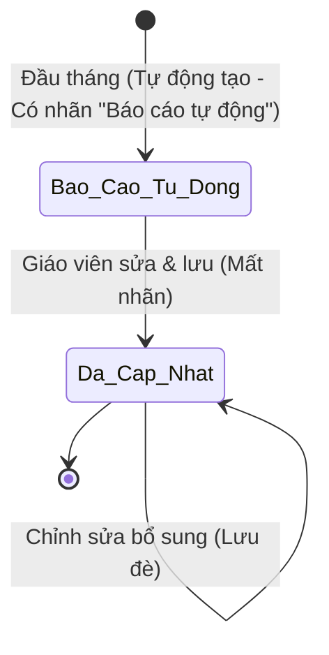

# BF-CARE-03: Cơ chế Báo cáo Học tập Tháng & Kế hoạch Phát triển Học viên

> **Capability:** CAP-CARE (Chăm sóc & Duy trì Học viên)  
> **Giai đoạn:** Vận hành Chăm sóc & Tái phí  
> **Nhóm chức năng:** Chăm sóc học viên & Tái phí  
> **Mã màn hình:** `student_operations_alert`, `renewal`, `report`  

---

## Lịch sử cập nhật tài liệu (Changelog)

| Ngày cập nhật | Nội dung cập nhật | Lý do cập nhật |
|---|---|---|
| 30/09/2026 | Tinh giản và chuẩn hóa toàn diện tài liệu phân hệ BF-CARE-03 | Quản lý báo cáo theo từng Gói học (Môn - Lộ trình - Loại GV - Quy mô lớp), xử lý học đa lớp trong gói, gom ảnh/video theo buổi học thực tế, bỏ tự động khóa, bỏ in ấn và tinh gọn 01 quyền chỉnh sửa duy nhất |

---

## 1. Bối cảnh & Vấn đề hiện tại (Context & Problem Statement)

* **Bối cảnh:** Báo cáo học tập định kỳ hàng tháng là điểm chạm cốt lõi giúp trung tâm minh chứng chất lượng đào tạo, ghi nhận sự tiến bộ của học viên với phụ huynh theo từng gói học cụ thể và tạo tiền đề vững chắc cho việc tư vấn tái phí.
* **Vấn đề thực tế:**
  1. Học viên theo học nhiều gói học (như Toán tư duy và Tiếng Anh) trước đây bị gộp chung hoặc phân mảnh dữ liệu, khiến việc theo dõi từng lộ trình chuyên môn bị chồng chéo.
  2. Dữ liệu các buổi học (điểm danh, bài tập, hình ảnh thực hành từ lớp chính khóa, lớp cũ chuyển đổi hoặc buổi học bù) tốn nhiều thời gian tổng hợp thủ công.
  3. Kế hoạch học tập tháng tới thường viết chung chung, thiếu sự liên kết trực tiếp với Khung chương trình thực tế của lớp học viên đang tham gia.

---

## 2. Mục tiêu, Giá trị mang lại & Chỉ số đo lường (Objectives, Value & KPIs)

* **Mục tiêu:**
  1. Tự động tổng hợp chỉ số học tập định kỳ hàng tháng độc lập theo từng Gói học mà học viên đang tham gia.
  2. Gom toàn bộ chỉ số và tư liệu hình ảnh, video thực hành từ tất cả các buổi học thực tế của học viên thuộc Gói học trong tháng (bao gồm lớp chính, lớp cũ trước khi chuyển lớp, và buổi học bù).
  3. Chuẩn hóa quy trình sư phạm: Chọn khoảng bài học theo Khung chương trình lớp hiện tại $\rightarrow$ Tự động tổng hợp kế hoạch học tập tháng tới.
  4. Phát hành trang đích báo cáo trực tuyến tương tác dành cho phụ huynh, cho phép xem video thuyết trình, ảnh chất lượng cao và chuyển đổi linh hoạt giữa các gói học của con.
* **Giá trị mang lại:** Nâng cao niềm tin của phụ huynh, gia tăng tỷ lệ tái phí và giảm 70% thời gian soạn thảo báo cáo cho giáo viên.
* **Mục tiêu đo lường hiệu quả (Đề xuất chỉ số tương lai):**

| Chỉ số đo lường (KPI) | Mục tiêu đề xuất (Target) | Phương pháp đo lường |
| :--- | :--- | :--- |
| **[KPI-001] Tỷ lệ hoàn thành báo cáo đúng hạn** | $\ge 95\%$ học viên có báo cáo trước ngày 05 hàng tháng | Thống kê số lượng báo cáo hoàn tất trên tổng số học viên đang theo học các gói |
| **[KPI-002] Tỷ lệ phụ huynh mở xem trang đích** | $\ge 80\%$ lượt truy cập trong 7 ngày sau khi gửi | Đếm số lượt truy cập trang đích từ liên kết chia sẻ của từng gói học |

---

## 3. Hiểu người dùng (Target Users & Personas)

* **Giáo viên phụ trách gói học (`PERSONA-TEACHER`):**
  * *Bối cảnh sử dụng:* Đầu tháng mới, mở hộp thoại báo cáo của học viên trong gói phụ trách để rà soát nhận xét và xây dựng kế hoạch tháng tới.
  * *Nhu cầu thực tế:* Chọn nhanh bài học từ Khung chương trình của lớp đang dạy, chọn ảnh thực hành tiêu biểu từ các buổi học trong tháng mà không phải nhập lại từ đầu.
* **Nhân viên Chăm sóc Khách hàng (`PERSONA-CSM`):**
  * *Bối cảnh sử dụng:* Theo dõi hàng ngày tại màn hình Chăm sóc và Tái phí.
  * *Nhu cầu thực tế:* Xem nhanh thẻ tóm tắt theo từng gói học, nắm tình hình tiến độ và sao chép liên kết trang đích gửi phụ huynh qua tin nhắn trong 5 giây.
* **Phụ huynh học viên (`PERSONA-PARENT`):**
  * *Bối cảnh sử dụng:* Nhận liên kết qua tin nhắn, xem trên điện thoại hoặc máy tính bảng.
  * *Nhu cầu thực tế:* Giao diện trực quan, thấy rõ tiến bộ từng môn/gói học của con, xem ảnh và video thuyết trình thực tế, dễ dàng chuyển đổi xem giữa các gói học khác nhau.

---

## 4. Ranh giới Nghiệp vụ & Phân loại Risk / Standard (Scope & Classification)

### Có bao gồm (In Scope)
- Quản lý phát hành Báo cáo học tập định kỳ hàng tháng độc lập theo từng Gói học (`Môn học - Lộ trình - Loại giáo viên - Quy mô lớp`) mà học viên đang kích hoạt.
- Thẻ tóm tắt báo cáo tháng gắn theo ngữ cảnh Thẻ Gói học đang chọn tại hồ sơ chăm sóc học viên (`US-CARE-03-01`).
- Hộp thoại chi tiết xem và chỉnh sửa báo cáo: Vinh danh thành tích, 3 cụm chỉ số, nhận xét sư phạm, kế hoạch tháng tới theo Khung chương trình và thư viện khoảnh khắc (`US-CARE-03-02`).
- Cơ chế tự động gom toàn bộ chỉ số và ảnh/video từ các buổi học thực tế của học viên thuộc Gói học trong tháng (bao gồm lớp chính, lớp cũ trước khi chuyển lớp trong gói, và các buổi học bù).
- Trang đích trực tuyến tương tác dành cho phụ huynh có bộ chuyển đổi giữa các Gói học của học viên (`US-CARE-03-03`).

### Không bao gồm (Out of Scope)
- Điểm danh và chấm bài tập từng buổi $\rightarrow$ Đã xử lý tại `BF-CLS-05`.
- Thu tiền học phí và xử lý thanh toán gói học $\rightarrow$ Đã xử lý tại `BF-SAL-01`.
- In ấn giấy hoặc xuất file tài liệu cố định $\rightarrow$ Phân hệ định vị báo cáo là trang đích số tương tác trực tuyến cho phụ huynh.
- Cơ chế tự động khóa cưỡng bức sau ngày 05 $\rightarrow$ Báo cáo luôn duy trì trạng thái mở cho phép nhân sự có thẩm quyền tinh chỉnh khi phát sinh yêu cầu chăm sóc.

### Đánh giá & Phân loại Risk / Standard (Quality Gate 1)

| Tiêu chí | Nội dung đánh giá thực tế | Điểm (0 / 1) |
|---|---|---|
| **A. Ảnh hưởng hệ thống** | Tích hợp dữ liệu giữa Gói học, Lớp học, Khung chương trình, Điểm danh và Chăm sóc | 1 |
| **B. Tác động tài chính** | Không can thiệp trực tiếp vào tính toán số tiền hay cổng thanh toán | 0 |
| **C1. Loại thay đổi** | Cải tiến và chuẩn hóa tính năng trên phân hệ Chăm sóc đã vận hành | 0 |
| **C2. Độ mới nghiệp vụ** | Chuẩn hóa cơ chế báo cáo theo Gói học và thư viện ảnh theo buổi học | 0 |
| **D. Phụ thuộc bên ngoài** | Sử dụng toàn bộ hệ thống cơ sở dữ liệu nội bộ dùng chung | 0 |

* **Tổng điểm:** 1 điểm  
* **Kết luận phân loại:** 🔴 **Risk** (Do phối hợp dữ liệu giữa nhiều phân hệ học thuật, quản lý lớp và vận hành chăm sóc)

---

## 5. Mô hình Dữ liệu Nghiệp vụ & Phân Quyền Năng Lực (Data Entities & Permissions)

| Tên Thực thể | Trường định danh | Thuộc tính quan trọng | Ràng buộc quan hệ | Diễn giải |
|---|---|---|---|---|
| **Báo cáo tháng (`MonthlyReport`)** | `id` | `studentId`, `packageId`, `packageName`, `program`, `roadmap`, `teacherType`, `classType`, `classId`, `className`, `monthKey`, `awardBadge`, `teacherName` | Trỏ về Học viên, Gói học (`Package`), Lớp học | Lưu trữ toàn bộ nội dung đánh giá kỳ báo cáo của **từng Gói học**. Khóa định danh logic: `(studentId, packageId, monthKey)` |
| **Chỉ số học tập (`MonthlyMetrics`)** | `id` | `reportId`, `attendanceRatio`, `lateCount`, `homeworkRatio`, `homeworkAvg`, `testScore` | Trỏ về Báo cáo tháng | Lưu trữ các thước đo định lượng: chuyên cần, bài tập về nhà, điểm thi |
| **Kế hoạch bài học (`ReportImprovementPlan`)** | `id` | `reportId`, `startLesson`, `endLesson`, `sectionB1Content`, `weeklyPlans` | Trỏ về Báo cáo tháng, Khung chương trình | Lưu trữ nội dung bài học tháng tới và các tuần rèn luyện bổ trợ |
| **Khoảnh khắc học tập (`StudentMediaItem`)** | `id` | `packageId`, `sessionId`, `sessionNumber`, `sessionTitle`, `sessionDate`, `studentId`, `mediaType`, `url`, `thumbnailUrl`, `caption`, `isClassWide` | Trỏ về Gói học, Buổi học (`Session`), Học viên | Lưu trữ hình ảnh và video thực tế thu thập từ các buổi học mà học viên tham gia trong tháng |

### 5.1. Vòng đời Trạng thái (Status Lifecycle)

### 5.2. Danh mục Quyền hạn & Năng lực Nghiệp vụ Động (Atomic Permissions / Capabilities)

> [!IMPORTANT]
> **Nguyên tắc Phân quyền Động Tinh gọn (Lean Dynamic Capability Gating):**  
> Hệ thống **tuyệt đối KHÔNG gán cứng quyền theo bất kỳ Vai trò cố định nào**. 
> - **Quyền Xem & Chia sẻ liên kết:** Mặc định kế thừa cho mọi nhân sự có quyền truy cập hồ sơ chăm sóc học viên (`care.student.view`). Nhân sự được xem tóm tắt, mở xem hộp thoại ở chế độ chỉ đọc và sao chép liên kết gửi phụ huynh.
> - **Quyền Chỉnh sửa:** Kiểm soát tập trung qua **01 mã quyền nguyên tử duy nhất** dưới đây:

| Mã Quyền Hạn (Permission Key) | Tên Quyền Hạn (Tiếng Việt) | Loại Quyền | Phạm Vi Áp Dụng (Scope) | Diễn Giải Nghiệp Vụ |
| :--- | :--- | :---: | :--- | :--- |
| `care.monthly_report.edit` | Chỉnh sửa Báo cáo Tháng theo Gói | Ghi | Hộp thoại Báo cáo Tháng | Cho phép kích hoạt chế độ chỉnh sửa, nạp bài học từ Khung chương trình, chọn ảnh/video từ kho buổi học và lưu cập nhật nội dung báo cáo |

---

## 6. Quy tắc Nghiệp vụ Tổng thể (Bóc tách trực tiếp từ Giao diện & Dữ liệu Thực tế)

1. **Chu kỳ đánh giá & Nguyên tắc phát hành theo Gói học:**
   - Mỗi kỳ báo cáo đại diện chính xác cho 1 tháng dương lịch (ví dụ: `Tháng 4/2026`). Tự động khởi tạo lúc 00:00 ngày đầu tháng tiếp theo.
   - **Định danh Gói học:** Gói học được cấu thành từ 4 yếu tố: Môn học (Chương trình) - Lộ trình đào tạo - Loại giáo viên - Loại/Quy mô lớp (1:10, 1:6, 1:1...).
   - **Phát hành theo Gói:** Báo cáo tháng phát hành độc lập theo từng Gói học đang kích hoạt của học viên. Học viên học bao nhiêu Gói học thì có bấy nhiêu Báo cáo tháng tương ứng trong kỳ.
   - Báo cáo không áp dụng cơ chế tự động khóa cưỡng bức, luôn duy trì trạng thái sẵn sàng để nhân sự có quyền chỉnh sửa cập nhật khi cần hoàn thiện thông tin.

2. **Quy tắc xử lý đa lớp trong cùng 1 Gói học (Chuyển lớp & Học bù):**
   - **Chuyển lớp trong gói:** Khi học viên đổi giờ hoặc đổi ca từ lớp cũ sang lớp mới trong tháng (cùng một Gói học), hệ thống phát hành duy nhất 01 bản báo cáo tháng cho Gói học đó gắn theo Lớp học mới hiện tại. Toàn bộ chỉ số định lượng (chuyên cần, bài tập về nhà, điểm thi) và nhận xét buổi học từ lớp cũ được tự động cộng dồn sang lớp mới. Giáo viên lớp mới chịu trách nhiệm hoàn thiện và nạp kế hoạch tháng tới theo Khung chương trình của lớp mới.
   - **Buổi học bù (Makeup session) trong gói:** Kết quả điểm danh, nhận xét và media của học viên tại buổi học bù ở lớp khác (cùng chương trình) được tự động gom về báo cáo tháng của Gói học tương ứng.

3. **Thu thập và chọn lọc Ảnh/Video khoảnh khắc theo Buổi học thực tế của Gói:**
   - Thư viện ảnh/video của Báo cáo tháng được hệ thống tự động gom từ tất cả các buổi học thực tế mà học viên tham gia thuộc Gói học đó trong tháng (buổi ở lớp chính, buổi ở lớp cũ trước khi chuyển, buổi học bù).
   - Tư liệu được nhóm theo từng buổi học (kèm số thứ tự buổi, tiêu đề bài học, ngày học, cờ phân loại ảnh riêng con vs ảnh cả lớp).
   - Giáo viên phụ trách Gói học rà soát và chọn lọc tối đa 6 khoảnh khắc tiêu biểu nhất để hiển thị nổi bật trên trang đích báo cáo phụ huynh.

4. **Nạp bài học từ Khung chương trình theo Lớp học hiện tại của Gói (Mục B1):**
   - Hệ thống tự động nhận diện Khung chương trình theo lớp học hiện tại của Gói học:
     - Gói Toán tư duy nhận diện Khung chương trình Toán Archimedes / Columbus.
     - Gói Tiếng Anh Station nhận diện Khung chương trình Tiếng Anh Cambridge / Kindie.
   - **Quy trình 2 bước sư phạm:**
     - *Bước 1 (Chọn bài):* Chọn Buổi bắt đầu và Buổi kết thúc (ràng buộc Buổi bắt đầu $\le$ Buổi kết thúc).
     - *Bước 2 (Nạp mẫu & Tinh chỉnh):* Bấm nút nạp bài học mẫu, hệ thống tự động trích xuất nội dung kiến thức trọng tâm nạp vào ô soạn thảo để giáo viên tinh chỉnh câu từ trước khi lưu.

5. **Danh mục danh hiệu vinh danh theo Gói học:**
   - Gói Toán tư duy: Cung cấp 6 danh hiệu chuẩn hóa (`Siêu sao toán học`, `Ngôi sao bứt phá`, `Ngôi sao chăm chỉ`, `Cao thủ giải toán`, `Nhà khám phá toán học`, `Thám tử toán học`) kèm giải thích tiêu chí.
   - Gói Tiếng Anh: Cho phép giáo viên nhập linh hoạt danh hiệu phù hợp năng lực học thuật ngôn ngữ.

6. **Bảo mật & Trải nghiệm tương tác trang đích phụ huynh:**
   - Mở qua đường dẫn chứa mã định danh bảo mật của học viên và tham số kỳ báo cáo (ví dụ: `/report/[id]?month=4_5_2026`).
   - Trang hoạt động ở chế độ tương tác chỉ đọc, hỗ trợ xem ảnh chất lượng cao và phát video thuyết trình trực tiếp.
   - Khi học viên theo học từ 2 Gói học trở lên, thanh điều hướng cung cấp bộ chọn Gói học hiển thị chuẩn: `Môn học • Lộ trình (Quy mô lớp - Loại GV)` để phụ huynh chuyển đổi mượt mà giữa các gói của con.

---

## 7. Danh sách Yêu cầu Người dùng (User Stories)

| Tên Yêu cầu (Màn hình / Hộp thoại) | Phân loại | Mã Quyền Yêu Cầu (Required Capability) |
| :--- | :---: | :--- |
| **Section Báo cáo Tháng của Học viên** (Màn hình Chăm sóc & Tái phí) | 🟢 Standard | `care.monthly_report.edit` *(Chỉ kiểm soát nút Xem & sửa)* |
| **Bảng nổi chi tiết Báo cáo tháng học viên** (Hộp thoại Xem & Sửa) | 🔴 Risk | `care.monthly_report.edit` |
| **Landing Page Báo cáo Tháng học viên** (Trang đích công khai phụ huynh) | 🟢 Standard | Mở công khai chỉ đọc qua liên kết định danh |

---

## Phụ lục: Tự đánh giá Quality Gate 1 (Checklist A)

- [x] **1. Vì sao phải làm?** Bối cảnh và mục tiêu được nêu cô đọng tại Mục 1 & 2.
- [x] **2. Làm cho ai?** Persona được xác định rõ ràng tại Mục 3.
- [x] **3. Người dùng sử dụng thế nào?** Vòng đời trạng thái mô hình hóa bằng sơ đồ Mermaid tại Mục 5.1.
- [x] **4. Phân quyền động?** Danh mục quyền hạn nguyên tử tinh gọn duy nhất không gán cứng vai trò tại Mục 5.2.
- [x] **5. Feature Scope?** Danh sách User Stories con phân rã tại Mục 7 kèm mã quyền tương ứng.
