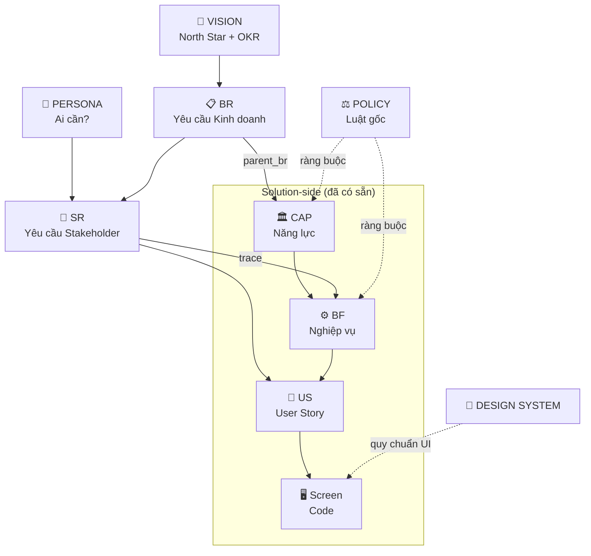
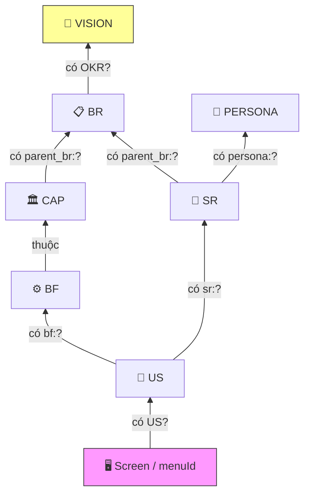

# Kiến trúc Hệ thống Tài liệu Rinov5

> **Mục đích:** Sơ đồ tổng quan toàn bộ hệ thống tài liệu từ Vision → Code, giúp onboarding nhanh và hiểu vị trí từng file.
> **Cập nhật lần cuối:** 2026-05-20

---

## 1. Sơ đồ Treeview — 5 Tầng + Tooling

```
🏢 RinoEdu Rinov5 — Hệ thống Tài liệu
│
├── 📌 TIER 0 — VÌ SAO? (Problem-side)
│   │
│   ├── 🎯 VISION.md
│   │   └── North Star Metric + OKR-01, OKR-02
│   │
│   ├── 👥 STAKEHOLDERS.md
│   │   ├── RACI Matrix (11 CAP × 5 Persona)
│   │   └── Sơ đồ tương tác (mermaid)
│   │
│   ├── 🧑 PERSONAS/ (5 file)
│   │   ├── PERSONA-OWNER         → dùng CAP-RPT, CAP-FIN
│   │   ├── PERSONA-BRANCH_MANAGER → dùng CAP-OPS, CAP-CARE, CAP-HR
│   │   ├── PERSONA-SALE          → dùng CAP-ADM, CAP-COM
│   │   ├── PERSONA-CSM           → dùng CAP-CARE, CAP-OPS
│   │   └── PERSONA-TEACHER       → dùng CAP-OPS, CAP-ACD
│   │
│   ├── 📋 BR/ (4 file) — Yêu cầu Kinh doanh
│   │   ├── BR-001 Tăng tỷ lệ tái phí        → CAP-CARE
│   │   ├── BR-002 Vận hành lớp không gián đoạn → CAP-OPS
│   │   ├── BR-003 Một HV = Một bản ghi       → CAP-MDM
│   │   └── BR-004 Lead → HV liền mạch        → CAP-ADM
│   │
│   ├── 📝 SR/ (3 file) — Yêu cầu Stakeholder
│   │   ├── SR-CSM-001 Inbox Hôm nay          → BF-CARE-01
│   │   ├── SR-CSM-002 Pipeline tái phí       → BF-CARE-02
│   │   └── SR-BM-001 Cảnh báo at-risk cơ sở  → CAP-RPT
│   │
│   └── 📊 Quản lý & Đối soát
│       ├── BACKLOG.md (9 Epic, 35 Work Item)
│       ├── AUDIT-GROUP-CARE.md
│       ├── TRACEABILITY-VIEWS.md (Dataview)
│       └── DOCUMENTATION-ARCHITECTURE.md (file này)
│
│   ─ ─ ─ ─ ─ ─ ─ ─ ─ ─ ─ ─ ─ ─ ─ ─ ─ ─ ─ ─ ─ ─ ─ ─ ─ ─
│   ↕ TRACE (frontmatter: parent_br / persona / sr / bf)
│   ─ ─ ─ ─ ─ ─ ─ ─ ─ ─ ─ ─ ─ ─ ─ ─ ─ ─ ─ ─ ─ ─ ─ ─ ─ ─
│
├── ⚖️ TIER 1 — LUẬT GỐC (Enterprise Standards)
│   └── ENTERPRISE_STANDARDS.md
│       ├── [POLICY-MDM-01..04] Quản trị dữ liệu
│       ├── [POLICY-IAM-01..04] Phân quyền
│       ├── [POLICY-ORG-01] Data Scope
│       └── [POLICY-DS-01..05] Design System
│
├── 🏛️ TIER 2 — NĂNG LỰC (11 Capabilities)
│   ├── CAP-ADM  Tuyển sinh         ← parent_br: BR-004
│   ├── CAP-COM  Thương mại         ← parent_br: TBD-NEEDS-BR
│   ├── CAP-OPS  Vận hành Lớp       ← parent_br: BR-002
│   ├── CAP-ACD  Học thuật          ← parent_br: TBD-NEEDS-BR
│   ├── CAP-CARE Chăm sóc           ← parent_br: BR-001
│   ├── CAP-FIN  Tài chính          ← parent_br: TBD-NEEDS-BR
│   ├── CAP-HR   Nhân sự            ← parent_br: TBD-NEEDS-BR
│   ├── CAP-FCM  Cơ sở vật chất     ← parent_br: TBD-NEEDS-BR
│   ├── CAP-SYS  Hệ thống           ← parent_br: TBD-NEEDS-BR
│   ├── CAP-MDM  Dữ liệu Gốc       ← parent_br: BR-003
│   └── CAP-RPT  Báo cáo            ← parent_br: TBD-NEEDS-BR
│
├── ⚙️ TIER 3 — NGHIỆP VỤ (42 Business Functions)
│   ├── BF-CARE-01..02  Chăm sóc
│   ├── BF-CLS-01..06   Lớp học
│   ├── BF-OPS-02..03   Lịch & Buổi học
│   ├── BF-ENR-01..03   Tuyển sinh
│   ├── BF-CRM-01..02   CRM
│   ├── BF-MDM-01..03   Dữ liệu Gốc
│   ├── BF-SYS-01..05   Hệ thống
│   ├── BF-HR-01..02    Nhân sự
│   ├── BF-ORG-01..02   Tổ chức
│   ├── BF-ACD-01..07   Học thuật
│   ├── BF-PRD-01       Sản phẩm
│   ├── BF-SAL-01..03   Bán hàng
│   ├── BF-FIN-01       Tài chính
│   └── BF-QA-01..02    Chất lượng
│
├── 📄 TIER 4 — USER STORIES (107 US)
│   ├── US-CLS01..06-*  (bf: BF-CLS-*)
│   ├── US-OPS02..03-*  (bf: BF-OPS-*)
│   ├── US-BT01..05     (bf: BF-ENR-01)
│   ├── US-ENR02-01..05 (bf: BF-ENR-02)
│   ├── US-SYS-01..05-* (bf: BF-SYS-*)
│   ├── US-MDM-01..03-* (bf: BF-MDM-*)
│   ├── US-HR-01..02-*  (bf: BF-HR-*)
│   ├── US-ORG-01..02-* (bf: BF-ORG-*)
│   └── US-ACD-07-*     (bf: BF-ACD-07)
│
├── 🖥️ CODE (src/)
│   ├── config/navigation.ts  (67 menuId)
│   ├── config/screens.ts     (26 entry)
│   ├── components/screens/   (14 screen thật)
│   ├── mocks/                (13 entity files)
│   ├── lib/statusColors.ts   (status → color mapping)
│   └── stores/               (auth + UI state)
│
├── 🎨 DESIGN SYSTEM
│   ├── DESIGN_SYSTEM.md      (hiến pháp giao diện)
│   └── DESIGN_SYSTEM_STANDARD.md (tiêu chuẩn thẩm định)
│
└── 🛠️ TOOLING
    ├── scripts/check-traceability.mjs     (5 rule: V1-V5)
    ├── scripts/audit-navigation.mjs       (menuId ↔ US ↔ Code)
    ├── scripts/backfill-us-frontmatter.mjs
    ├── scripts/backfill-cap-frontmatter.mjs
    ├── .github/workflows/traceability.yml (CI guard)
    └── docs/templates/ (10 template: 4 mới + 6 cũ)
```

---

## 2. Luồng Trace Xuôi (Top-Down: Vì sao → Làm gì → Code)



---

## 3. Luồng Trace Ngược (Bottom-Up: Reverse Validation)



**5 câu hỏi Reverse Validation:**

| # | Câu hỏi | Nếu KHÔNG → |
|---|---------|-------------|
| 1 | BR có CAP triển khai? | Gap nghiệp vụ |
| 2 | US có trace về SR? | Scope creep |
| 3 | Persona có SR nào? | Persona giả tưởng |
| 4 | menuId có US? | Code đi nhanh hơn doc |
| 5 | CAP có 2 bản sao theo role? | Vi phạm Decoupling |

---

## 4. Số liệu Hiện trạng (snapshot 2026-05-20)

| Tầng | Số lượng | Trace status |
|------|----------|-------------|
| Vision | 1 | — |
| Persona | 5 | 2/5 có SR (3 chờ workshop) |
| BR | 4 | 4/4 có CAP mapping |
| SR | 3 | 3/3 có parent_br + persona |
| CAP | 11 | 4/11 có BR thật, 7 TBD |
| BF | 42 | 42/42 có CAP |
| US | 107 | 107/107 có bf: |
| Screen code | 14 | 14/67 menuId |
| Errors | 0 | CI PASS |

---

## 5. Nguyên tắc Kiến trúc Cốt lõi

### 5.1. Capability–Persona Decoupling

> Năng lực hệ thống là danh từ; Vai trò là người sử dụng danh từ đó.
> Cùng 1 CAP phục vụ nhiều Persona — khác biệt qua RBAC + Data Scope, KHÔNG tạo bản sao.

### 5.2. Document-Driven Development

> AI KHÔNG viết code mà không có US (Tier 4).
> US KHÔNG được tạo mà không trace về SR (Tier 0) hoặc BF (Tier 3).

### 5.3. Gap Visibility over Gap Hiding

> Khi chưa có BR cho 1 CAP → ghi `TBD-NEEDS-BR` (hiển thị gap).
> KHÔNG để trống hoặc bịa BR giả.

### 5.4. Markdown + Git = Source of Truth

> Mọi tool (Obsidian, CI, MkDocs) chỉ ĐỌC từ Markdown.
> Không có database riêng, không có lock-in.

---

## 6. Công cụ Hỗ trợ

| Tool | Vai trò | Cách dùng |
|------|---------|-----------|
| `check-traceability.mjs` | Kiểm tra 5 rule trace | `node scripts/check-traceability.mjs` |
| `audit-navigation.mjs` | Đối soát menuId ↔ US ↔ Code | `node scripts/audit-navigation.mjs` |
| `backfill-us-frontmatter.mjs` | Bổ sung bf: cho US mới | `node scripts/backfill-us-frontmatter.mjs --apply` |
| `backfill-cap-frontmatter.mjs` | Bổ sung id + parent_br cho CAP | `node scripts/backfill-cap-frontmatter.mjs --apply` |
| GitHub Action | CI guard trên PR | Tự động khi push |
| Obsidian + Dataview | Graph view + bảng trace live | Mở vault `docs/` |

---

## 7. Tham chiếu

- `README.md` (00-business) — Hướng dẫn chi tiết framework Tier 0.
- `BACKLOG.md` — Lộ trình và trạng thái Work Item.
- `DOCUMENTATION_GUIDELINES.md` — Quy ước 4-Tier gốc (Tier 1-4).
- `ENTERPRISE_STANDARDS.md` — Đạo luật nền tảng.
- `DESIGN_SYSTEM.md` — Hiến pháp giao diện.
