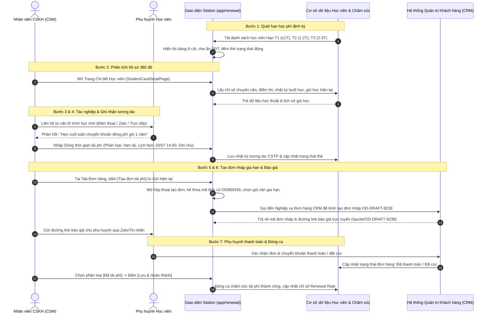

# [FLOW-CARE-02] Quy trình Chăm sóc Tái phí, Tạo đơn CRM & Gia hạn Khóa học Toàn trình (End-to-End Renewal Flow)

> **Capability:** CAP-CARE (Nghiệp vụ Chăm sóc Học viên & Giữ chân Khách hàng)  
> **Parent BF:** `BF-CARE-02` (Nghiệp vụ Quản lý & Chăm sóc Tái phí Học viên)  
> **User Stories liên quan:** `US-CARE-02-01`, `US-CARE-02-02`, `US-CARE-02-03`  
> **Giai đoạn:** Vận hành hàng ngày & Giữ chân học viên

---

## Lịch sử cập nhật tài liệu (Changelog)

| Ngày cập nhật | Nội dung cập nhật | Lý do cập nhật |
|---|---|---|
| 14/08/2026 | Phát hành tài liệu luồng FLOW-CARE-02 | Định nghĩa toàn trình luồng quét hạn học phí, tư vấn tái phí, tạo đơn CRM và gia hạn số buổi học |

---

## 1. Bối cảnh Nghiệp vụ (Context & Problem Statement)

* **Bối cảnh:** Quy trình toàn trình kết nối giữa việc tự động quét hạn kết thúc học phí của học viên tại cơ sở, phân loại mức độ tiềm năng tái phí, hỗ trợ nhân viên CSM nắm bắt kết quả học tập để tư vấn thuyết phục, khởi tạo đơn hàng nháp gia hạn liên thông sang hệ thống CRM và theo dõi phụ huynh thanh toán đóng phí học kỳ mới.
* **Mục tiêu luồng:** Chuẩn hóa 7 bước tác nghiệp liền mạch, giảm thiểu tối đa thời gian thao tác thủ công, kế thừa 100% dữ liệu gói học cũ sang đơn gia hạn mới, loại bỏ nguy cơ bỏ sót học viên sắp hết hạn học phí.

---

## 2. Ma trận Trách nhiệm (RACI Matrix)

| Bước quy trình | Nhân viên CSKH (CSM) | Quản lý Cơ sở (BM) | Giáo viên (Teacher) | Hệ thống (Station / CRM) |
|---|---|---|---|---|
| **1. Quét & Phân nhóm Hạn học phí** | I (Theo dõi) | I (Theo dõi) | I | **R / A (Tự động thực hiện)** |
| **2. Rà soát Hồ sơ & Thành tích học tập** | **R / A (Thực hiện chính)** | I | C (Cung cấp nhận xét) | S (Cung cấp dữ liệu 360 độ) |
| **3. Tác nghiệp Liên hệ & Tư vấn Tái phí** | **R / A (Thực hiện chính)** | C (Hỗ trợ ca khó) | C | S (Tích hợp kênh liên lạc) |
| **4. Ghi nhận Tương tác & Lịch hẹn** | **R / A (Nhập liệu)** | I (Giám sát) | I | S (Lưu trữ lịch sử) |
| **5. Khởi tạo Đơn hàng Nháp CRM** | **R / A (Khởi tạo)** | C (Duyệt chiết khấu) | I | **S (Đồng bộ sang CRM)** |
| **6. Gửi Báo giá & Theo dõi Đóng phí** | **R / A (Gửi link PH)** | I | I | S (Sinh trang báo giá) |
| **7. Xác nhận Thanh toán & Đóng ca** | **R (Cập nhật)** | A (Duyệt xác nhận) | I | **S (Chuyển trạng thái Đã tái phí)** |

*(R: Responsible - Thực hiện; A: Accountable - Chịu trách nhiệm; C: Consulted - Tham vấn; I: Informed - Nhận thông tin; S: System - Hệ thống hỗ trợ)*

---

## 3. Sơ đồ Luồng Toàn trình (Mermaid Diagram)

---

## 4. Chi tiết Từng Bước Thực Hiện

| Bước | Tác nhân | Giao diện | Hành động | Dữ liệu đầu vào | Kết quả mong đợi |
|---|---|---|---|---|---|
| **1. Quét & Phân nhóm Hạn học phí** | Hệ thống | Màn hình Danh sách Tái phí (`/app/renewal`) | Hệ thống tự động quét hạn kết thúc học phí dự kiến của tất cả gói học đang hoạt động, phân bổ vào các nhóm Hạn T1, T2, T3 | Ngày hiện tại, Hạn kết thúc học phí dự kiến, Số buổi còn lại | Hiển thị danh sách học viên theo thứ tự ngày hết hạn gần nhất lên đầu, đếm số lượng trên các khối thẻ trạng thái |
| **2. Rà soát Hồ sơ & Thành tích** | CSM | Trang Chi tiết Chăm sóc Tái phí (Cột trái) | Nhấp vào tên học viên để mở trang chi tiết, chuyển đổi giữa Tab Học tập và Tab Đơn hàng để nắm thành tích | Mã học viên, Mã gói học | Hiển thị đầy đủ chuyên cần, điểm kiểm tra, bài tập, lịch sử chuyển lớp và danh sách các gói học đã mua |
| **3. Tác nghiệp Liên hệ & Tư vấn** | CSM | Trang Chi tiết Chăm sóc Tái phí (Cột phải) | Nhấp nút Gọi điện hoặc mở kênh Zalo trao đổi với phụ huynh về sự tiến bộ của con và đề xuất lộ trình khóa học mới | Số điện thoại phụ huynh, Kịch bản tư vấn tái phí | Phụ huynh tiếp nhận thông tin tư vấn và phản hồi nguyện vọng (đồng ý, cần cân nhắc hoặc hẹn ngày đóng phí) |
| **4. Ghi nhận Tương tác & Lịch hẹn** | CSM | Dòng thời gian Nhật ký Tái phí (`RenewalChatFeed`) | Chọn kênh liên lạc, chọn phân loại tái phí (Cân nhắc / Tiềm năng / Hẹn tái), chọn ngày giờ hẹn gọi lại, nhập ghi chú trao đổi và ý kiến phụ huynh $\rightarrow$ Bấm **Lưu** | Kênh liên lạc, Trạng thái tái phí mới, Lịch hẹn, Nội dung ghi chú, Ý kiến phụ huynh | Lưu 1 bản ghi vào dòng thời gian nhật ký tái phí, cập nhật huy hiệu trạng thái trên bảng danh sách, hiển thị lịch nhắc hẹn màu tím |
| **5. Khởi tạo Đơn hàng Nháp CRM** | CSM | Tab Đơn hàng (`StudentOrdersTab`) | Bấm nút **[Tạo đơn tái phí]** tại dòng gói học hiện tại (hoặc nút **[Tạo đơn]** trên cùng) $\rightarrow$ Điền thông tin sản phẩm gia hạn, số buổi, voucher ưu đãi $\rightarrow$ Bấm Lưu đơn nháp | Mã gói nguồn, Mã đơn cũ, Gói sản phẩm gia hạn, Đơn giá, Voucher chiết khấu | Hệ thống gọi đến Nghiệp vụ Đơn hàng CRM, khởi tạo đơn hàng nháp `OD-DRAFT-xxx`, liên kết với gói học nguồn |
| **6. Gửi Báo giá Trực tuyến** | CSM | Tab Đơn hàng & Landing Page Báo giá | Nhấp biểu tượng sao chép đường link báo giá `/quote/OD-DRAFT-xxx` $\rightarrow$ Gửi qua Zalo/tin nhắn cho phụ huynh | Đường dẫn báo giá trực tuyến | Phụ huynh mở xem chi tiết đơn hàng, lịch học dự kiến, số tiền cần thanh toán và các chính sách ưu đãi |
| **7. Xác nhận Đóng phí & Đóng ca** | CSM / BM | Dòng thời gian Nhật ký Tái phí | Phụ huynh chuyển khoản thanh toán thành công $\rightarrow$ CSM chọn phân loại **Đã tái phí** $\rightarrow$ Bấm **Lưu & Hoàn thành** | Biên lai chuyển khoản / Xác nhận thanh toán từ CRM | Cập nhật trạng thái ca thành **Đã tái phí**, hiển thị huy hiệu xanh lá, cộng vào chỉ số Renewal Rate của cơ sở |

---

## 5. Luồng Ngoại lệ & Xử lý Rủi ro (Exceptions & Risk Mitigation)

| Tình huống ngoại lệ | Rủi ro phát sinh | Cơ chế xử lý của Hệ thống & Người dùng |
|---|---|---|
| **Phụ huynh không nghe máy (KNM) nhiều lần** | Bỏ trôi ca tái phí, học viên kết thúc khóa học mà không có thông tin | Hệ thống cho phép chọn trạng thái liên hệ "KNM", ghi nhận lần gọi nhỡ, đặt lịch hẹn gọi lại lần 2 sau 24h - 48h. Nếu quá 3 lần không liên lạc được, chuyển giao cho Quản lý cơ sở (BM) hỗ trợ. |
| **Phụ huynh đổi ý từ chối gia hạn do chuyển nơi ở / kinh tế** | Ghi nhận sai tỷ lệ tiềm năng, gây mất thời gian chăm sóc lặp lại | CSM chọn phân loại **Thất bại**, nhập rõ lý do cụ thể vào trường ý kiến phụ huynh $\rightarrow$ Bấm Lưu. Hệ thống chuyển thẻ sang trạng thái Thất bại và đưa ra khỏi danh sách lọc tác nghiệp hàng ngày. |
| **Phụ huynh muốn chuyển số buổi còn lại sang cho con thứ 2** | Sai lệch số buổi học giữa các hợp đồng của các con trong gia đình | CSM vào Tab Đơn hàng $\rightarrow$ Sử dụng tính năng Chuyển phí giữa các gói học $\rightarrow$ Hệ thống ghi nhận 1 bản ghi trong phần Lịch sử chuyển phí và tự động cập nhật số buổi còn lại của từng gói. |
| **Lỗi mạng khi gọi liên thông sang CRM tạo đơn nháp** | Đơn hàng nháp không được lưu, mất dữ liệu nhập liệu của nhân viên | Giao diện hiển thị thông báo lỗi thân thiện: "Không thể kết nối đến hệ thống đơn hàng, vui lòng thử lại sau vài giây". Dữ liệu form được giữ nguyên trên giao diện để nhân viên bấm gửi lại mà không phải nhập lại từ đầu. |

---

## 6. Ràng buộc Chuyển tiếp & Điểm Chạm Hệ thống (System Touchpoints)

1. **Điểm chạm Cơ sở dữ liệu Học viên & Lớp học:** Đọc thông tin học viên, môn học, trình độ, mã lớp, giáo viên phụ trách, số buổi còn lại và ngày hết hạn dự kiến.
2. **Điểm chạm Cơ sở dữ liệu Chăm sóc Học viên:** Ghi nhận và truy xuất dòng thời gian tương tác tái phí (thẻ `CSTP`), phân loại tái phí và lịch hẹn gọi lại.
3. **Điểm chạm Hệ thống CRM (Nghiệp vụ Đơn hàng & Báo giá):** Nhận yêu cầu khởi tạo đơn nháp gia hạn từ Station, quản lý vòng đời đơn hàng (`OD-DRAFT-xxx`), sinh trang báo giá trực tuyến `/quote/` và phản hồi trạng thái thanh toán về Station.

---

## 7. Ma trận Phân quyền (Permission Matrix)

| Vai trò | Xem Danh sách Tái phí | Xem Trang Chi tiết Học thuật & Đơn hàng | Ghi nhận Tương tác Tái phí | Tạo Đơn Nháp Gia hạn CRM | Xóa Đơn Nháp Gia hạn | Đóng ca Đã Tái Phí |
|---|---|---|---|---|---|---|
| **CSM (Nhân viên CSKH)** | ✅ (Cơ sở phụ trách) | ✅ | ✅ | ✅ | ✅ (Đơn do mình tạo) | ✅ |
| **BM (Quản lý Cơ sở)** | ✅ (Toàn cơ sở) | ✅ | ✅ | ✅ | ✅ (Toàn cơ sở) | ✅ |
| **Teacher (Giáo viên)** | ✅ (Lớp mình dạy) | ✅ (Chỉ đọc) | ❌ | ❌ | ❌ | ❌ |
| **Admin (Quản trị viên)** | ✅ (Toàn hệ thống) | ✅ | ✅ | ✅ | ✅ | ✅ |

---

## 8. Tiêu chí Nghiệm thu Luồng (Flow Acceptance Criteria)

- **AC-FLOW-01 (Happy Path):** Giả sử học viên có gói học thuộc nhóm Hạn T1. Khi nhân viên CSM mở trang chi tiết, rà soát kết quả học tập, gọi điện tư vấn, cập nhật trạng thái "Hẹn tái" và bấm "Tạo đơn tái phí" từ gói học hiện tại, thì hệ thống khởi tạo thành công đơn nháp `OD-DRAFT-xxx` kế thừa chính xác mã đơn cũ, lưu nhật ký tương tác và sinh link báo giá hợp lệ.
- **AC-FLOW-02 (Liên thông CRM & Chuyển đổi thành công):** Giả sử đơn hàng nháp đã được tạo. Khi phụ huynh hoàn tất thanh toán và nhân viên chọn phân loại "Đã tái phí" rồi bấm "Lưu & Hoàn thành", thì hệ thống cập nhật trạng thái đơn hàng sang Đã thanh toán, đóng ca chăm sóc và tăng chỉ số Renewal Rate của cơ sở.
- **AC-FLOW-03 (Bảo toàn Lịch sử):** Giả sử nhân viên thực hiện nhiều lần tương tác qua các kênh khác nhau (Zalo, Gọi điện, Gặp trực tiếp). Khi mỗi lần lưu thông tin, thì toàn bộ các lần tương tác đều được lưu vết đầy đủ theo thứ tự thời gian giảm dần trên dòng thời gian nhật ký tái phí.
