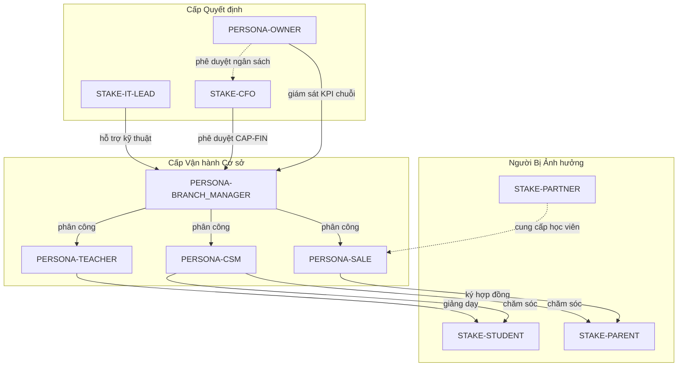

# Bản đồ Stakeholder — Rinov5 Station ERP

> **Vị trí:** Tier 0 — đứng cùng `VISION.md`, `BR/`, `SR/`.
> **Vai trò:** Liệt kê tất cả nhóm người liên quan tới Rinov5, mức độ tham gia, và mã định danh dùng xuyên suốt tài liệu.
> **Cập nhật:** Mỗi khi thay đổi cơ cấu tổ chức RinoEdu hoặc phát hiện nhóm Stakeholder mới chưa được đại diện.

---

## 1. Phạm vi

Tài liệu này bao gồm các nhóm:

- **Người dùng trong sản phẩm** (User trong `useAuthStore`).
- **Người ảnh hưởng** dù không phải user (VD: Học viên, Phụ huynh, Đối tác).
- **Người ra quyết định** ở cấp tổ chức (VD: Founder, CFO, IT Lead).

KHÔNG bao gồm: nhân vật giả tưởng, persona "nice to have" chưa có dữ liệu.

---

## 2. Phân loại Stakeholder

### 2.1. User trong Sản phẩm (5 Persona cốt lõi)

| Mã Persona | Vai trò | Vị trí trong tổ chức | Tham chiếu |
|------------|---------|----------------------|------------|
| `PERSONA-OWNER` | Chủ doanh nghiệp / Founder | Toàn chuỗi, đa cơ sở | [PERSONAS/PERSONA-OWNER.md](./PERSONAS/PERSONA-OWNER.md) |
| `PERSONA-BRANCH_MANAGER` | Quản lý cơ sở | 1 chi nhánh | [PERSONAS/PERSONA-BRANCH-MANAGER.md](./PERSONAS/PERSONA-BRANCH-MANAGER.md) |
| `PERSONA-SALE` | Tư vấn tuyển sinh | Cấp cơ sở | [PERSONAS/PERSONA-SALE.md](./PERSONAS/PERSONA-SALE.md) |
| `PERSONA-CSM` | Chăm sóc học viên | Cấp cơ sở | [PERSONAS/PERSONA-CSM.md](./PERSONAS/PERSONA-CSM.md) |
| `PERSONA-TEACHER` | Giáo viên đứng lớp | Cấp cơ sở | [PERSONAS/PERSONA-TEACHER.md](./PERSONAS/PERSONA-TEACHER.md) |

### 2.2. Người ảnh hưởng (Không phải user)

| Mã | Vai trò | Quan hệ với Rinov5 |
|----|---------|---------------------|
| `STAKE-STUDENT` | Học viên | Đối tượng phục vụ cuối, dữ liệu trung tâm |
| `STAKE-PARENT` | Phụ huynh | Người trả tiền + quyết định mua, không dùng app |
| `STAKE-PARTNER` | Đối tác B2B (trường liên kết) | Cung cấp học viên qua kênh hợp tác |

### 2.3. Người ra quyết định cấp tổ chức (không xuất hiện hằng ngày)

| Mã | Vai trò | Liên quan tới Rinov5 ở điểm |
|----|---------|------------------------------|
| `STAKE-CFO` | Giám đốc Tài chính | Phê duyệt CAP-FIN, KPI doanh thu |
| `STAKE-IT-LEAD` | Trưởng IT / DevOps | Phê duyệt kiến trúc, tích hợp LMS |
| `STAKE-LEGAL` | Pháp chế / Tuân thủ | PII, lưu trữ dữ liệu cá nhân |

---

## 3. Sơ đồ Tương tác

---

## 4. RACI cấp Capability

> **R**esponsible · **A**ccountable · **C**onsulted · **I**nformed
> Đây là RACI tổng. RACI chi tiết theo Business Rule sẽ ghi trong từng BF.

| Capability | OWNER | BRANCH MGR | SALE | CSM | TEACHER | Bên ngoài |
|------------|:-----:|:----------:|:----:|:---:|:-------:|:---------:|
| **CAP-ADM** Tuyển sinh | I | A | R | C | I | PARTNER (C) |
| **CAP-COM** Thương mại | I | A | R | C | I | — |
| **CAP-OPS** Vận hành Lớp | I | A | I | C | R | STUDENT (I) |
| **CAP-ACD** Học thuật | C | C | I | I | R | — |
| **CAP-CARE** Chăm sóc | I | A | C | R | C | PARENT (I) |
| **CAP-FIN** Tài chính | A | C | I | I | I | CFO (R) |
| **CAP-HR** Nhân sự | A | R | I | I | I | — |
| **CAP-FCM** CSVC | I | A | — | — | C | — |
| **CAP-SYS** Hệ thống | A | C | I | I | I | IT-LEAD (R) |
| **CAP-MDM** Dữ liệu Gốc | A | C | C | C | I | LEGAL (C) |
| **CAP-RPT** Báo cáo | R | A | I | I | I | CFO (C) |

---

## 5. Bản đồ Persona ↔ Capability ưu tiên

> Persona này dùng Capability nào nhiều nhất trong ngày làm việc?

| Persona | Capability ưu tiên cao | Capability ưu tiên trung | Hiếm khi dùng |
|---------|-------------------------|---------------------------|----------------|
| OWNER | CAP-RPT, CAP-FIN | CAP-OPS, CAP-HR | CAP-ACD, CAP-FCM |
| BRANCH MGR | CAP-OPS, CAP-CARE, CAP-HR | CAP-ADM, CAP-COM, CAP-FIN | CAP-MDM |
| SALE | CAP-ADM, CAP-COM | CAP-MDM (Person/Family) | CAP-OPS |
| CSM | CAP-CARE, CAP-OPS | CAP-MDM, CAP-COM | CAP-ACD |
| TEACHER | CAP-OPS (Lớp/Buổi/Điểm danh), CAP-ACD | CAP-CARE | CAP-COM, CAP-FIN |

> Bảng này chính là **chứng cứ chống Capability–Persona Decoupling violation**: cùng `CAP-OPS` được nhiều Persona dùng → 1 năng lực duy nhất, khác biệt qua RBAC + Data Scope, không tạo bản sao theo role.

---

## 6. Quy tắc Cập nhật

- **Thêm Persona mới** chỉ khi có dữ liệu phỏng vấn / quan sát thật.
- **Mỗi lần thay đổi RACI ở mục 4** phải kèm Approval Log từ OWNER hoặc BRANCH MANAGER.
- **Không xóa Stakeholder** đã từng được tham chiếu trong BR/SR — đánh dấu deprecated thay vì xóa.

---

## 7. Tham chiếu Tài liệu Liên quan

- `VISION.md` — Tầm nhìn + OKR (chưa tạo).
- `BR/*.md` — Yêu cầu kinh doanh.
- `SR/*.md` — Yêu cầu Stakeholder cụ thể.
- `PERSONAS/*.md` — Hồ sơ chi tiết 5 Persona.
- `ENTERPRISE_STANDARDS.md` `[POLICY-IAM-03]` — RBAC + ABAC (lý do nhiều Persona dùng chung 1 CAP).
