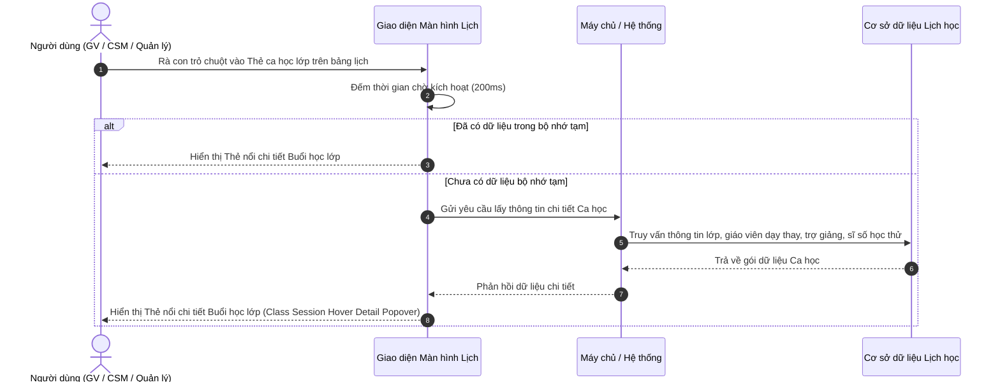

# US-CAL-02-04: Thẻ nổi chi tiết khi di chuột vào buổi học lớp (Class Session Hover Detail Popover)

> **Tham chiếu:** BF-CAL-02 · SR-CSM-001 · Giao diện Mẫu §4.3 (Hộp thoại chi tiết & Thẻ thông tin nổi xem nhanh)
> **Đường dẫn màn hình & Trạng thái liên quan:**
> - `Lịch học (/app/calendar_class_schedule)` -> Thẻ nổi kích hoạt khi di chuột
> - `Lịch của tôi (/app/my_schedule)` -> Thẻ nổi kích hoạt khi di chuột

---

## 1. NHẬT KÝ THAY ĐỔI & BỐI CẢNH (CHANGELOG & CONTEXT)

### Lịch sử cập nhật tài liệu (Changelog)

| Ngày cập nhật | Nội dung cập nhật | Lý do cập nhật |
|---|---|---|
| 27/07/2026 | Biên tập tài liệu đặc tả thẻ nổi xem nhanh chi tiết buổi học lớp | Chuẩn hóa đặc tả giao diện xem nhanh ca học theo chuẩn Enterprise |
| 27/07/2026 | Tinh chỉnh giao diện: Căn phải tên GV & TG, gỡ nhãn Dạy thay ở dải đầu thẻ & tên GV, chuyển Icon Học viên mới lên cùng hàng thời gian ở dải đầu thẻ với nét Cam đậm và tạm thời ẩn nhãn 'Chính thức' | Cập nhật theo phản hồi giao diện thực tế mới |

### Bối cảnh & Vấn đề nghiệp vụ (Context & Problem)
* **Bối cảnh:** Trong các màn hình lịch tổng quan, các ca học lớp chính thức hiển thị dưới dạng khối thẻ màu xanh lá / xanh dương. Thẻ gốc chỉ chứa thông tin rút gọn (Mã lớp, Tên bài học, Giáo viên, Phòng học).
* **Vấn đề hiện tại:** Giáo viên (Teacher), Nhân viên CSKH/Giáo vụ (CSM) và Quản lý chi nhánh cần kiểm tra nhanh danh sách giáo viên dạy chính / dạy thay, trợ giảng, sĩ số học sinh, sự hiện diện của học viên học thử / học viên mới và vị trí phòng học.
* **Mục tiêu & Giá trị mang lại:** Cung cấp thẻ nổi chi tiết xem nhanh ngay khi rà chuột (Class Session Hover Detail Popover) lên ca học lớp. Giúp nhân sự nắm bắt 100% hồ sơ buổi học, theo dõi giáo viên dạy thay / trợ giảng căn phải và nhận biết tức thì icon Học viên mới màu Cam đậm ở góc phải dải thời gian.

### Hiểu người dùng & Tình huống sử dụng (User Needs & Use Cases)
* **Người dùng chính (Persona):** Giáo viên (PERSONA-TEACHER), Nhân viên CSKH/Giáo vụ (PERSONA-CSM), Quản lý chi nhánh (PERSONA-BRANCH-MANAGER).
* **Khó khăn lớn nhất (Pain-points):** Phải nhấp mở từng cửa sổ chi tiết buổi học để kiểm tra thông tin giáo viên dạy thay hoặc phát hiện học sinh mới học thử trong buổi.
* **Nhu cầu thực tế (Needs):** Rà chuột vào thẻ buổi học là thấy ngay: Khung giờ & Icon Học viên mới màu Cam đậm ở dải đầu thẻ (nếu có học thử), Mã lớp & Tên lớp, Trình độ môn học, Địa điểm phòng học, Đội ngũ giảng dạy căn phải (GV chính / GV dạy thay, TG trợ giảng) và Sĩ số lớp học (`14 học viên`).
* **Câu phát biểu nghiệp vụ:** **Là một** Giáo viên hoặc Nhân viên vận hành trung tâm, **tôi muốn** xem nhanh thẻ nổi chi tiết khi di chuột vào ca học lớp, **để** xem đội ngũ giảng dạy căn phải và nhận biết icon Học viên mới màu Cam đậm cùng hàng thời gian mà không cần mở hộp thoại lớn.

### Phạm vi kiểm soát (Scope)
* **Phạm vi hiển thị:** Thẻ thông tin nổi (Popover Card) xem nhanh buổi học lớp chính thức trên tất cả màn hình lịch.
* **Ràng buộc nghiệp vụ toàn cục (Global Rules):**
  - **[RULE-CLASS-01] Nguồn dữ liệu hợp nhất:** Dữ liệu hiển thị trên thẻ nổi được đồng bộ trực tiếp từ cơ sở dữ liệu lịch học (Class Schedule DB) và tự động cập nhật theo trạng thái thời thực.
  - **[RULE-CLASS-02] Độ trễ kích hoạt (Hover Intent):** Thẻ nổi chỉ xuất hiện sau khi con trỏ chuột dừng trên thẻ buổi học từ 200ms đến 300ms.
  - **[RULE-CLASS-03] Định vị thông minh (Smart Positioning):** Thẻ nổi tự động tính toán không gian màn hình để đặt vị trí sao cho không bị tràn ra ngoài viền quan sát.
  - **[RULE-CLASS-04] Chống trùng lặp tên Cơ sở / Địa điểm (Branch Deduplication):** Nếu tên phòng học đã bao gồm tên cơ sở (ví dụ `Phòng 2 • RinoEdu Nguyễn Tuân`), giao diện hiển thị chuẩn một lần duy nhất.
  - **[RULE-CLASS-05] Căn phải Đội ngũ giảng dạy & Trợ giảng:**
    - Dòng GV: Nhãn `GV:` bên trái, `[Avatar] [Tên Giáo viên / Dạy thay]` căn lề bên phải (gỡ bỏ các nhãn `DẠY THAY` phụ).
    - Dòng TG: Nhãn `TG:` bên trái, `[Avatar] [Tên Trợ giảng]` căn lề bên phải.
  - **[RULE-CLASS-06] Icon Học viên mới (Màu Cam đậm đậm nét, Cùng hàng thời gian):**
    - **Thẻ nổi Popover:** Khi ca học có học sinh học thử/mới (`trialStudents > 0`), hiển thị biểu tượng `UserPlus` màu Cam đậm nét (`text-amber-700`, `stroke-[2.8]`) ở góc phải dải đầu thẻ cùng hàng với thời gian (`17:45 - 19:15`).
    - **Thẻ lịch gốc ngoài màn hình:** Đồng bộ hiển thị biểu tượng `UserPlus` màu Cam đậm (`bg-amber-100 text-amber-700 border-amber-300`) nổi bật.
  - **[RULE-CLASS-07] Tạm ẩn nhãn 'Chính thức':** Tạm thời không hiển thị nhãn `Chính thức` trên dải header ribbon của các ca học lớp thông thường để giữ giao diện thoáng và sạch.
  - **[GLOBAL-METRIC-01] Định mức thời gian phản hồi:** Dữ liệu thẻ nổi hiển thị tức thì trong dưới 150ms từ bộ nhớ tạm (cache) hoặc không quá 300ms từ máy chủ hệ thống.

---

## 2. LUỒNG XỬ LÝ CHÍNH (MAIN FLOW - HAPPY PATH)

---

## 3. GIAO DIỆN & TRẠNG THÁI TĨNH (DATA & UI STATE)

### 3.1. Cấu trúc các vùng giao diện & Bảng mô tả chi tiết

Bố cục Thẻ nổi chi tiết Buổi học lớp gồm các khối thông tin xếp chồng theo chiều dọc từ trên xuống dưới theo thứ tự ưu tiên thị giác:

| Thành phần giao diện | Loại hiển thị | Dữ liệu & Quy tắc | Diễn giải quy tắc | Co giãn giao diện (Mobile) |
|---|---|---|---|---|
| Dải đầu thẻ (Header Strip) kèm Icon Học viên mới | Thanh tiêu đề màu nhạt | Khung giờ (`17:45 - 19:15`) + Icon đồng hồ + Icon `UserPlus` Cam đậm (cạnh phải) + Badge loại hình | Màu nền dải đầu thẻ viền xanh lá nhạt (hoặc xanh dương khi có dạy thay, đỏ khi khai giảng). Icon `UserPlus` màu Cam đậm nét xuất hiện cùng hàng thời gian ở góc phải khi có học sinh học thử. Nhãn `Chính thức` tạm thời ẩn. | Co giãn theo chiều rộng thẻ nổi |
| Khối Tên buổi học (Nổi bật & In đậm) | Hộp nổi bật (Highlight Box) | Tên buổi học (`Phonics lab: Nguyên âm ngắn`) + Số thứ tự buổi (`Buổi 4`) | Được đưa lên vị trí đầu tiên của nội dung thẻ, đóng khung màu cam nhạt, chữ in đậm kích thước lớn để người dùng nhận diện ngay trọng tâm bài học. | Tự động xuống dòng nếu tiêu đề dài |
| Khối Mã lớp & Tên lớp | Dòng thông tin cơ bản | Mã lớp (`SA1_TA_001`) dạng huy hiệu font mono + Tên lớp | Nằm ngay bên dưới tên buổi học. | Tự động ngắt dòng khi cần |
| Khối Khung chương trình (KCT) & Địa điểm | Dòng thông tin kèm biểu tượng | `KCT: [Tên Khung chương trình]` + Icon Vị trí & Phòng học | Hiển thị tên khung chương trình đào tạo thực tế và phòng học của cơ sở. | Hiển thị rõ ràng tên KCT |
| Khối Đội ngũ giảng dạy & Quản lý | Dòng thông tin nhân sự căn phải | Tiêu đề `ĐỘI NGŨ GIẢNG DẠY & QUẢN LÝ:` + Dòng GV (`GV:` bên trái, `[Avatar] [Tên GV]` căn phải) + Dòng TG (`TG:` bên trái, `[Avatar] [Tên TG]` căn phải) | **Ràng buộc:** Tên GV và TG đều được đưa sang góc bên phải dòng. Gỡ bỏ tất cả nhãn `DẠY THAY` và `TA` trùng lặp. | Hiển thị tên cá nhân giảng dạy căn phải |
| Khối Sĩ số & Điểm danh | Dòng thông tin sĩ số | Icon Học viên + Text `Sĩ số: [X] học viên` + Icon `UserPlus` Cam đậm `([Y] học thử)` + Badge `Đã điểm danh` | Hiển thị tổng số học sinh và số học sinh học thử kèm icon cam đậm. | Hiển thị rõ ràng |
| Khối Nội dung bài học (Dưới sĩ số) | Khối thông tin chi tiết bài học | `Nội dung buổi học` + Số buổi + Danh sách mục kiến thức (`Words`, `Sentences`, `Phonics`, v.v.) | Đặt ngay bên dưới khối sĩ số, hiển thị chi tiết từ vựng, mẫu câu, phát âm hoặc nội dung cốt lõi của buổi học tương ứng. | Tràn dòng tự nhiên theo chiều dọc |
| Thanh chân thẻ (Footer Tip) | Thanh hướng dẫn màu xám | Icon Thông tin ở đầu dòng + Text `Nhấp vào thẻ để mở chi tiết & thao tác` | Thanh chỉ dẫn giúp người dùng biết thẻ có thể tương tác nhấp chuột để mở màn hình chi tiết buổi học. | Luôn ghim ở đáy thẻ nổi |

### 3.2. Ma trận phân quyền (Permission Matrix)

| Vai trò người dùng | Xem thẻ nổi Buổi học | Xem GV / TG căn phải | Xem Icon Học viên mới | Nhấp mở Hộp thoại chi tiết |
|---|:---:|:---:|:---:|:---:|
| **Quản trị viên (Admin)** | ✅ | ✅ | ✅ | ✅ |
| **Quản lý chi nhánh (Branch Manager)** | ✅ | ✅ | ✅ | ✅ |
| **Nhân viên CSKH / Giáo vụ (CSM)** | ✅ | ✅ | ✅ | ✅ |
| **Giáo viên (Teacher)** | ✅ | ✅ | ✅ | ✅ |

---

## 4. KHỐI CHỨC NĂNG CHI TIẾT (ACTIONS & EVENTS)

### Action 1.1: Xem thông tin đội ngũ giảng dạy & Nội dung bài học
* **Luồng kích hoạt:** Khi người dùng di chuột vào thẻ ca học:
  - Tên buổi học được đưa lên trên cùng của thân thẻ nổi, in đậm và làm nổi bật trong khung màu cam.
  - Mã lớp và Tên lớp hiển thị ngay bên dưới tên buổi học.
  - Dòng `KCT: [Tên Khung chương trình]` hiển thị bên dưới Mã lớp và Tên lớp.
  - Đội ngũ giảng dạy: Tên Giáo viên (`GV:`) và Trợ giảng (`TG:`) hiển thị căn lề bên phải dòng.
  - Sĩ số: Hiển thị số lượng học viên chính thức và học thử.
  - Nội dung bài học: Khối thông tin chi tiết bài học (Words, Sentences, Phonics hoặc các nội dung chuyên đề) xuất hiện ngay bên dưới dòng Sĩ số.
* **Tiêu chí nghiệm thu (Acceptance Criteria):**
  - **AC-1 (Happy Path - Thứ tự hiển thị thông tin thẻ nổi):**
    - **Giả sử:** Người dùng rà chuột vào ca học bất kỳ trên bảng lịch.
    - **Khi:** Thẻ nổi mở ra.
    - **Thì:** Tên buổi học nằm ở hàng đầu tiên (in đậm và nổi bật), theo sau là Mã & Tên lớp, Khung chương trình (KCT), Đội ngũ giảng dạy, Sĩ số và Nội dung bài học ở dưới cùng.
  - **AC-2 (Happy Path - Căn phải Đội ngũ giảng dạy & Trợ giảng):**
    - **Giả sử:** Ca học có Giáo viên dạy thay và Trợ giảng.
    - **Khi:** Thẻ nổi hiển thị.
    - **Thì:** Tên Giáo viên và Trợ giảng được nằm ở mép bên phải dòng, không xuất hiện các nhãn `DẠY THAY` hay `TA` trùng lặp.
  - **AC-3 (Happy Path - Hiển thị Nội dung bài học bên dưới sĩ số):**
    - **Giả sử:** Ca học có dữ liệu nội dung bài học.
    - **Khi:** Người dùng quan sát bên dưới dòng Sĩ số.
    - **Thì:** Khối Nội dung buổi học hiển thị rõ số buổi cùng các mục chi tiết như Words, Sentences, Phonics.

---

## 5. CÁC TRƯỜNG HỢP GÓC CẠNH (CORNER CASES)

* **5.1. Ca học nằm sát mép trên hoặc mép phải màn hình:** Thẻ nổi tự động đảo hướng hiển thị xuống dưới hoặc sang trái.
* **5.2. Thao tác trên màn hình cảm ứng (Mobile/Tablet):** Chạm 1 lần để xem Thẻ nổi, chạm lần thứ 2 để mở Chi tiết buổi học.
* **5.3. Ca học không có Trợ giảng (TG):** Dòng `TG:` tự động ẩn, chỉ hiển thị thông tin Giáo viên.
* **5.4. Lớp học chưa đến giờ điểm danh:** Khối sĩ số chỉ hiển thị số lượng học sinh đăng ký, ẩn badge `Đã điểm danh`.
* **5.5. Ca học không có học sinh học thử:** Biểu tượng `UserPlus` màu cam đậm tự động ẩn.
* **5.6. Buổi học chưa có nội dung chi tiết bài học:** Khối nội dung bài học tự động ẩn và giữ kích thước thẻ nổi gọn gàng.
