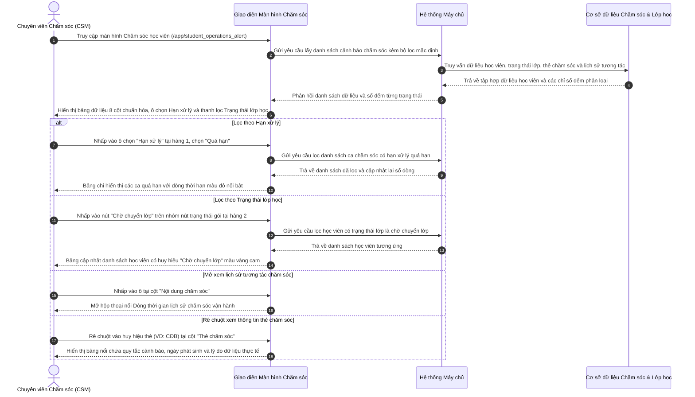

# US-CARE-01-01: Màn hình Danh sách Chăm sóc Học viên - Cập nhật Giao diện & Cấu trúc Bảng mới

> **Tham chiếu:** `BF-CARE-01` · `PERSONA-CSM` · `PERSONA-BRANCH-MANAGER`  
> **Đường dẫn màn hình & Trạng thái liên quan:**  
> - `/app/student_operations_alert` -> Trạng thái chăm sóc: `Chưa chăm sóc`, `Đang xử lý`, `Hoàn thành` | Trạng thái lớp học: `Đang học`, `Chờ chuyển lớp`, `Chờ xếp lớp`, `Bảo lưu`, `Hết buổi`

---

## 1. NHẬT KÝ THAY ĐỔI & BỐI CẢNH (CHANGELOG & CONTEXT)

### Lịch sử cập nhật tài liệu (Changelog)

| Ngày cập nhật | Nội dung cập nhật | Lý do cập nhật |
|---|---|---|
| 23/09/2026 | Phát hành tài liệu đặc tả cập nhật giao diện màn hình Chăm sóc học viên (/app/student_operations_alert) | Đối chiếu và chuẩn hóa từ giao diện hiện tại sang giao diện mới: Tái cấu trúc các cột dữ liệu, chuyển đổi bộ chọn Hạn xử lý, bổ sung thanh lọc Trạng thái lớp học. |

### Bối cảnh & Vấn đề nghiệp vụ (Context & Problem)
* **Bối cảnh:** Màn hình Chăm sóc học viên là công cụ làm việc trung tâm hàng ngày của đội ngũ Chăm sóc khách hàng (Chuyên viên chăm sóc - CSM) và Quản lý cơ sở để theo dõi, phát hiện sớm các nguy cơ học tập (học lực giảm, vắng học, thiếu bài tập) và thực hiện các đợt tương tác hỗ trợ học viên kịp thời.
* **Vấn đề trên giao diện hiện tại:**
  1. *Cột dữ liệu dàn trải và thiếu an toàn:* Cột "Gói sản phẩm" chiếm diện tích lớn nhưng ít có giá trị phân loại nhanh tại bảng chính; số điện thoại hiển thị công khai hoặc che sơ sài kèm nút gọi/sao chép trần trụi, tiềm ẩn nguy cơ rò rỉ dữ liệu hoặc nhân viên sao chép thông tin hàng loạt; các thẻ cảnh báo chăm sóc bị dồn chung dạng văn bản thô sơ thiếu quy chuẩn thị giác và hạn xử lý nghiệp vụ.
  2. *Dải nút Hạn xử lý chiếm dụng không gian:* Bộ chọn hạn xử lý (Quá hạn, Đến hạn, Hẹn gọi lại) đang hiển thị dạng hàng nút bấm phẳng nằm tại hàng thứ hai, chiếm diện tích hàng ngang và dễ gây xung đột bố cục trên các màn hình có độ phân giải vừa hoặc nhỏ.
  3. *Thiếu khả năng phân loại nhanh theo Trạng thái lớp học:* Nhân viên chăm sóc không có công cụ lọc nhanh học viên theo tình trạng lớp học (Đang học, Chờ chuyển lớp, Chờ xếp lớp, Bảo lưu, Hết buổi) trực tiếp trên thanh công cụ chính, buộc phải dò thủ công từng dòng.
* **Mục tiêu thay đổi:**
  - Tái cấu trúc toàn diện 8 cột dữ liệu của bảng chính: che số điện thoại chống sao chép hàng loạt, tách riêng cột "Thẻ chăm sóc" với nhãn quy chuẩn và thời hạn cam kết xử lý, tối ưu cột "Nội dung chăm sóc" với thời gian tương đối và lịch hẹn gọi lại, đưa cột "Lớp học" về cuối bảng.
  - Gom dải nút Hạn xử lý thành một ô chọn thả xuống gọn gàng tại hàng đầu tiên của thanh công cụ.
  - Bổ sung nhóm nút chuyển đổi nhanh Trạng thái lớp học tại hàng thứ hai, hỗ trợ tự động co giãn linh hoạt trên mọi kích thước màn hình.
  *(Phạm vi tài liệu này không bao gồm khối thẻ chỉ số thống kê tổng hợp).*

### Hiểu người dùng & Tình huống sử dụng (User Needs & Use Cases)
* **Người dùng chính (Persona):** Chuyên viên chăm sóc khách hàng (`PERSONA-CSM`) và Quản lý cơ sở (`PERSONA-BRANCH-MANAGER`).
* **Nhu cầu thực tế:** Cần một bảng làm việc trực quan, thông tin cô đọng, dễ dàng nhận diện ngay ca cần chăm sóc gấp (quá hạn, đến hạn) và trạng thái lớp học của học viên mà không bị phân tâm bởi các cột phụ không cần thiết.
* **Câu phát biểu nghiệp vụ:** **Là một** Chuyên viên chăm sóc khách hàng, **tôi muốn** có bộ chọn hạn xử lý tinh gọn, thanh lọc nhanh trạng thái lớp học và các cột dữ liệu được chuẩn hóa rõ ràng, **để** tôi nhanh chóng nắm bắt ca học viên cần chăm sóc ưu tiên và thực hiện tương tác an toàn, chính xác.

### Bảng đối chiếu tổng quan Thay đổi (So sánh Hệ thống Hiện tại vs. Giao diện Mới)

| Hạng mục đối chiếu | Màn hình Hiện tại (Hệ thống cũ) | Giao diện Mới (Hệ thống cập nhật) | Giá trị mang lại cho người dùng |
|---|---|---|---|
| **Bộ chọn Hạn xử lý** | Dạng dải nút bấm phẳng (Pill buttons) nằm ở hàng thứ hai bên phải, chiếm không gian cố định. | Chuyển thành ô chọn thả xuống tinh gọn tại hàng đầu tiên, gắn chấm màu nhận diện và số đếm động. | Tiết kiệm diện tích hiển thị, quy hoạch toàn bộ các bộ chọn phân loại chính lên hàng trên cùng. |
| **Trạng thái lớp học trên thanh công cụ** | Không có bộ lọc nhanh trạng thái lớp học trên thanh công cụ; chỉ hiển thị chữ trong dòng bảng. | Gắn nhóm nút chuyển đổi nhanh (Chip Group) ở hàng thứ hai bên phải, tự động co lại thành ô thả xuống trên màn hình nhỏ. | Cho phép chuyên viên lọc tức thì học viên theo trạng thái: Đang học, Chờ chuyển lớp, Chờ xếp lớp, Bảo lưu, Hết buổi. |
| **Cột Thông tin liên hệ** | Hiển thị tên phụ huynh, số điện thoại có thể lộ đầy đủ kèm biểu tượng gọi và sao chép trực tiếp trên dòng. | Bắt buộc che số điện thoại ở giữa dạng `091****111`, ẩn biểu tượng gọi ngoài bảng chính; chỉ xem số đầy đủ trong hồ sơ chi tiết. | Bảo mật thông tin khách hàng, chống nhân viên sao chép dữ liệu hàng loạt ra ngoài hệ thống. |
| **Cột Phụ trách nhân sự** | Tên cột là "Phụ trách", hiển thị tên nhân sự CS và GV liền nhau dạng danh sách chấm tròn. | Đổi tên thành "Người chăm sóc", phân tầng rõ ràng 2 dòng: dòng trên là CS, dòng dưới là GV kèm bảng nổi tra cứu thông tin nhân sự. | Phân định rạch ròi trách nhiệm nghiệp vụ giữa nhân sự chăm sóc và giáo viên giảng dạy. |
| **Cột Gói sản phẩm** | Chiếm 1 cột riêng biệt hiển thị tên gói và ngày hết hạn. | Lược bỏ cột riêng biệt; thông tin môn học và cấp độ chuyển lên dưới tên học viên; ngày hạn hiển thị tinh gọn tại cột Lớp học. | Giảm tải thị giác, dành độ rộng hiển thị cho các nghiệp vụ chăm sóc trọng tâm. |
| **Cột Cảnh báo / Hạng mục chăm sóc** | Nằm chung trong cột nội dung, hiển thị dạng chấm đỏ thô sơ (`• CĐB - CS`). | Tách thành cột riêng **"Thẻ chăm sóc"** chuẩn hóa nhãn mã thẻ, màu sắc phân loại, bảng nổi chi tiết quy tắc và nút xem thêm thẻ. | Trực quan hóa toàn diện nguyên nhân cảnh báo (học lực, chuyên cần, bài tập) và cam kết thời gian xử lý. |
| **Cột Lịch sử chăm sóc** | Văn bản thuần túy tóm tắt cuộc gọi, không có mốc thời gian tương đối hay lịch hẹn tiếp theo. | Đổi tên thành **"Nội dung chăm sóc"**, hiển thị nội dung gần nhất theo thời gian tương đối (VD: *3 ngày trước*), hiển thị lịch hẹn gọi lại, bấm vào mở bảng dòng thời gian tương tác. | Nắm bắt nhanh tiến độ chăm sóc gần nhất và không bao giờ bỏ quên lịch hẹn gọi lại phụ huynh. |
| **Cột Trạng thái CS** | Hiển thị chữ trạng thái đơn giản và dòng hạn xử lý màu đỏ. | Chuẩn hóa tên thành **"Trạng thái"**, phân tầng 2 lớp: lớp trên là huy hiệu trạng thái vòng đời chuẩn màu sắc, lớp dưới là thời hạn có phân cấp mức độ khẩn cấp. | Dễ dàng nhận biết học viên đã hoàn thành, đang xử lý hay chưa chăm sóc và mức độ cấp bách của thời hạn. |
| **Cột Lớp học** | Nằm ở vị trí giữa bảng (cột 5). | Chuyển về vị trí **cột cuối cùng** của bảng, hiển thị mã lớp kèm bảng nổi chi tiết lớp học, huy hiệu trạng thái lớp và ngày hạn kết thúc. | Tối ưu luồng đọc từ trái sang phải: từ nhận diện học sinh -> người phụ trách -> vấn đề chăm sóc -> hành động -> lớp học. |

### Quy tắc nghiệp vụ cốt lõi (Business Rules)
1. **[RULE-OA-01] Nguyên tắc che số điện thoại chống sao chép:** Toàn bộ số điện thoại hiển thị trên bảng danh sách chính bắt buộc phải che 4 chữ số ở giữa dạng `091****111`. Tuyệt đối không để lộ số điện thoại trần hoặc cung cấp nút sao chép nhanh trên từng dòng bảng danh sách.
2. **[RULE-OA-02] Nguyên tắc tính toán số đếm động:** Số lượng đếm hiển thị trong ô chọn Hạn xử lý (Quá hạn, Đến hạn, Hẹn gọi lại) và nhóm nút Trạng thái lớp học phải tự động tính toán lại theo phạm vi bộ lọc Cơ sở, Môn học và Tiêu chí chăm sóc đặc biệt (CSĐB) đang được áp dụng.
3. **[RULE-OA-03] Nguyên tắc phân tầng Trạng thái và Hạn xử lý:** Cột Trạng thái phân định rõ ràng hai tầng thông tin độc lập: Tầng 1 là Trạng thái vòng đời chăm sóc (`Chưa chăm sóc`, `Đang xử lý`, `Hoàn thành`); Tầng 2 là Thời hạn cam kết xử lý với màu sắc cảnh báo khẩn cấp (Quá hạn màu đỏ, Đến hạn màu cam).
4. **[RULE-OA-04] Nguyên tắc hiển thị thẻ chăm sóc ưu tiên:** Mỗi dòng chỉ hiển thị tối đa 2 thẻ chăm sóc quan trọng nhất (ưu tiên thẻ chăm sóc đặc biệt `CĐB`). Các thẻ vượt quá giới hạn được gom vào nút bấm `+N` để mở hộp thoại xem danh sách chi tiết.
5. **[RULE-OA-05] Nguyên tắc trạng thái lớp học:** Cột Lớp học luôn phản ánh chính xác tình trạng phân bổ lớp của học viên (`Đang học`, `Chờ chuyển lớp`, `Chờ xếp lớp`, `Bảo lưu`, `Hết buổi`). Trường hợp học viên bảo lưu nhưng chưa thoát lớp phải hiển thị nhãn rõ ràng là `Bảo lưu (Giữ lớp)`.

---

## 2. LUỒNG XỬ LÝ CHÍNH (MAIN FLOW - HAPPY PATH)

---

## 3. GIAO DIỆN, PHÂN QUYỀN & RÀNG BUỘC KIỂM TRA DỮ LIỆU (UI, PERMISSIONS & VALIDATIONS)

### 3.1. Cấu trúc các vùng giao diện & Phân quyền (Capability Gating)

Màn hình áp dụng cơ chế kiểm soát hiển thị theo **Mã Quyền Động (Atomic Permissions)**:

| Vùng Giao diện / Nút Thao Tác | Loại Hiển Thị | Mã Quyền Yêu Cầu (Required Capability) | Xử Lý Khi Không Đủ Quyền |
| :--- | :--- | :--- | :--- |
| **Truy cập Màn hình `/app/student_operations_alert`** | Toàn bộ giao diện | `care.operations_alert.view` | Chặn truy cập, chuyển hướng về trang báo lỗi không có quyền |
| **Thanh công cụ lọc (Cơ sở, Môn học, CSĐB, Hạn xử lý)** | Ô chọn thả xuống | `care.operations_alert.filter` | Vô hiệu hóa hoặc ẩn các bộ chọn lọc |
| **Nhóm nút lọc Trạng thái lớp học** | Nhóm thẻ chuyển đổi | `care.operations_alert.filter_class_status` | Ẩn nhóm nút lọc trạng thái lớp học |
| **Nhấp dòng xem Hồ sơ chi tiết học viên** | Toàn bộ dòng bảng | `care.operations_alert.view_detail` | Vô hiệu hóa nhấp chuột mở chi tiết |
| **Xem số điện thoại đầy đủ & Gọi điện** | Hộp thoại chi tiết | `care.operations_alert.view_phone` | Số điện thoại tiếp tục bị che trong hồ sơ chi tiết |
| **Nút Xuất dữ liệu sang bảng tính** | Nút trên thanh công cụ | `care.operations_alert.export` | Ẩn nút xuất dữ liệu |

### 3.2. Cấu trúc bảng danh sách chính (8 Cột Dữ liệu Chuẩn hóa)

| Cột thông tin | Kiểu hiển thị | Nguồn dữ liệu | Quy tắc thị giác (Visual Mapping) |
|---|---|---|---|
| **1. Học viên** | Tên học viên in đậm + Tên tiếng Anh trong ngoặc + Ảnh đại diện ký tự viết tắt + Dòng phụ: Môn học và cấp độ | Dữ liệu học viên | Ảnh đại diện hình tròn màu sắc tự động theo mã học viên; chữ in đậm có gạch chân nhẹ khi di chuột, nhấp vào mở hồ sơ chi tiết |
| **2. Liên hệ** | Tên người liên hệ kèm vai trò thân nhân (Bố/Mẹ) + Số điện thoại che ở giữa | Dữ liệu người liên hệ | Số điện thoại bắt buộc hiển thị dạng `091****111`, ẩn hoàn toàn biểu tượng cuộc gọi và biểu tượng sao chép trần ngoài bảng |
| **3. Người chăm sóc** | Khối 2 dòng phân tầng: Dòng trên nhãn CS + Tên chuyên viên chăm sóc; Dòng dưới nhãn GV + Tên giáo viên | Dữ liệu phân công nhân sự | Chữ viết tắt CS/GV màu xám nhạt, tên nhân sự màu đậm; rê chuột vào hiển thị bảng nổi thông tin liên hệ nội bộ |
| **4. Thẻ chăm sóc** | Danh sách huy hiệu dạng viên nang (tối đa 2 thẻ hiển thị) + Nút `+N` xem thêm thẻ | Dữ liệu thẻ cảnh báo vận hành | Huy hiệu bo góc nhẹ có viền mỏng; màu sắc theo loại thẻ (Đỏ: CĐB, Tím: CĐK, Vàng: CBH, Xanh lá: CGH); rê chuột hiển thị bảng nổi giải thích quy tắc |
| **5. Nội dung chăm sóc** | Khối 2 dòng: Dòng 1 hiển thị nội dung gần nhất kèm thời gian tương đối; Dòng 2 hiển thị lịch hẹn gọi lại (nếu có) | Dữ liệu lịch sử nhật ký tương tác | Dòng 1 in đậm thời gian tương đối (VD: *3 ngày trước:*), nội dung thu gọn tối đa 2 dòng; Dòng 2 chữ màu tím kèm biểu tượng lịch; nhấp ô mở hộp thoại dòng thời gian |
| **6. Trạng thái** | Khối 2 dòng: Dòng 1 huy hiệu trạng thái vòng đời; Dòng 2 văn bản ngày hạn cam kết xử lý kèm màu cảnh báo mức độ khẩn cấp | Dữ liệu tiến độ chăm sóc và thời hạn | Huy hiệu bo góc nhẹ chuẩn màu: Xanh dương nhạt (Chưa chăm sóc), Vàng cam (Đang xử lý), Xanh lá (Hoàn thành); Ngày hạn: Quá hạn màu đỏ, Đến hạn màu cam, Còn hạn màu xám |
| **7. Lớp học** | Khối 2 dòng: Dòng 1 mã lớp học kèm bảng nổi chi tiết lớp + Huy hiệu trạng thái lớp học; Dòng 2 ngày hạn kết thúc lớp | Dữ liệu lớp học và gói học | Mã lớp kiểu chữ đơn khoảng cách; Huy hiệu trạng thái lớp chuẩn màu (Xanh lá: Đang học, Vàng: Chờ chuyển lớp, Tím: Bảo lưu, Xanh trời: Chờ xếp lớp); rê chuột vào mã lớp xem chi tiết lớp |

### 3.3. Bảng mô tả chi tiết các thành phần giao diện tĩnh (UI Structure Table)

| Thành phần giao diện | Loại control | Giá trị mặc định / Giới hạn | Mô tả chi tiết & Trạng thái | Quy tắc vận hành & Thao tác |
|---|---|---|---|---|
| **Bộ chọn Cơ sở** | Ô chọn thả xuống | `Tất cả Cơ sở` | Đặt tại góc trái hàng 1; hiển thị danh sách cơ sở người dùng được phân quyền | Chọn cơ sở để lọc toàn bộ bảng và cập nhật lại số đếm các trạng thái |
| **Bộ chọn Môn học** | Ô chọn thả xuống | `Tất cả môn học` | Đặt cạnh bộ chọn cơ sở; gồm Tiếng Anh, Toán tư duy | Lọc danh sách theo môn học được chọn |
| **Bộ chọn Loại thẻ CS** | Ô chọn thả xuống | `Tất cả Loại thẻ CS` | Đặt cạnh bộ chọn môn học; gồm Học lực, Bài tập về nhà, Chuyên cần | Lọc học viên đang bị gắn cờ chăm sóc đặc biệt theo từng tiêu chí |
| **Ô chọn Hạn xử lý** | Ô chọn thả xuống | `Tất cả hạn xử lý` | Đặt tại hàng 1; gồm Tất cả, Quá hạn (chấm đỏ), Đến hạn (chấm cam), Hẹn gọi lại (chấm tím) | Lọc học viên theo thời hạn cam kết xử lý |
| **Thanh lọc Trạng thái chăm sóc** | Nhóm thẻ trạng thái chính | `Tất cả` | Đặt tại bên trái hàng 2; gồm Tất cả, Chưa chăm sóc, Đang xử lý, Đã chăm sóc | Nhấp thẻ để chuyển đổi trạng thái vòng đời chăm sóc; thẻ được chọn nổi bật |
| **Nhóm nút Trạng thái lớp học** | Nhóm thẻ chuyển đổi nhanh | `Tất cả gói` | Đặt tại bên phải hàng 2; gồm Tất cả gói, Đang học, Chờ chuyển lớp, Chờ xếp lớp, Bảo lưu, Hết buổi; hiển thị màu chữ theo trạng thái khi chưa chọn và đổ màu nền khi chọn | Nhấp để lọc học viên theo tình trạng lớp học; tự động thu thành ô thả xuống trên màn hình nhỏ |
| **Ô tìm kiếm từ khóa** | Ô nhập văn bản mở rộng | Rỗng / Tối đa 100 ký tự | Nằm ở góc phải hàng 1 kèm biểu tượng kính lúp | Tìm kiếm theo tên học viên, mã học viên, số điện thoại phụ huynh hoặc mã lớp |
| **Nút Xuất dữ liệu** | Nút bấm thao tác | Nhãn `Xuất dữ liệu` kèm biểu tượng tải xuống | Nằm ở góc phải hàng 1 cạnh ô tìm kiếm | Bấm mở hộp thoại cấu hình các cột thông tin cần xuất ra bảng tính |
| **Bảng nổi thông tin nhân sự** | Khung thông tin nổi khi rê chuột | Tự động đóng khi rời chuột | Xuất hiện khi rê chuột vào tên CS hoặc GV tại cột Người chăm sóc | Hiển thị họ tên đầy đủ, chức danh, số điện thoại công vụ và hòm thư điện tử |
| **Bảng nổi thông tin thẻ chăm sóc** | Khung thông tin nổi khi rê chuột | Tự động đóng khi rời chuột | Xuất hiện khi rê chuột vào từng thẻ tại cột Thẻ chăm sóc | Hiển thị tên đầy đủ của thẻ, quy tắc cảnh báo, ngày phát sinh và lý do thực tế |
| **Bảng nổi thông tin lớp học** | Khung thông tin nổi khi rê chuột | Tự động đóng khi rời chuột | Xuất hiện khi rê chuột vào mã lớp tại cột Lớp học | Hiển thị môn học, cấp độ chi tiết, giáo viên giảng dạy và lịch học trong tuần |

### 3.4. Ràng buộc kiểm tra dữ liệu (Validation Rules)
1. **Quy tắc định dạng số điện thoại hiển thị:** Số điện thoại trên bảng danh sách bắt buộc phải tuân thủ mẫu hiển thị `xxxxxxxNNN` hoặc `091****111` với đúng 3 đến 4 chữ số cuối cùng được hiển thị, toàn bộ các chữ số ở giữa được thay thế bằng ký tự dấu sao `*`.
2. **Ràng buộc lựa chọn Hạn xử lý:** Ô chọn Hạn xử lý chỉ chấp nhận 1 giá trị duy nhất trong tập hợp: `all` (Tất cả), `overdue` (Quá hạn), `today` (Đến hạn), `rescheduled` (Hẹn gọi lại). Không hỗ trợ chọn đa giá trị cùng lúc.
3. **Ràng buộc nhóm nút Trạng thái lớp học:** Nhóm nút chỉ chấp nhận 1 giá trị duy nhất trong tập hợp: `all` (Tất cả gói), `active` (Đang học), `pending_transfer` (Chờ chuyển lớp), `wait_for_assignment` (Chờ xếp lớp), `reserve` (Bảo lưu), `session_ended` (Hết buổi).

---

## 4. KHỐI CHỨC NĂNG CHI TIẾT: ACTION & LUỒNG KÍCH HOẠT (ACTIONS & EVENTS)

### Khối chức năng 1: Lọc theo Hạn xử lý (Due Date Filter)

#### Action 1.1: Chọn hạn xử lý từ ô thả xuống
* **Luồng kích hoạt:** Người dùng nhấp vào ô chọn "Hạn xử lý" tại hàng 1 của thanh công cụ và chọn một trong các tùy chọn.
* **Tiêu chí nghiệm thu (Acceptance Criteria):**
  - **AC-1 (Happy Path - Lọc ca quá hạn):**
    - **Giả sử:** Danh sách đang hiển thị tổng hợp các ca chăm sóc và có 208 ca bị quá hạn xử lý.
    - **Khi:** Người dùng mở ô chọn Hạn xử lý và chọn mục "Quá hạn".
    - **Thì:** Bảng danh sách lập tức lọc và chỉ hiển thị các ca có hạn xử lý nhỏ hơn ngày hiện tại; dòng thời hạn tại cột Trạng thái chuyển sang chữ màu đỏ kèm tiền tố `Quá hạn: [Ngày/Tháng/Năm]`; số trang được đặt lại về trang 1.
  - **AC-2 (Happy Path - Lọc ca có lịch hẹn gọi lại):**
    - **Giả sử:** Người dùng muốn theo dõi các ca phụ huynh yêu cầu gọi lại vào khung giờ hẹn trước.
    - **Khi:** Người dùng chọn mục "Hẹn gọi lại" từ ô thả xuống.
    - **Thì:** Bảng danh sách chỉ hiển thị các ca có thông tin lịch hẹn gọi lại; cột Nội dung chăm sóc hiển thị rõ biểu tượng lịch và dòng chữ màu tím `Hẹn gọi lại: [Ngày] [Giờ]`.
  - **AC-3 (Alternate Path - Xem lại tất cả hạn xử lý):**
    - **Giả sử:** Người dùng đang lọc theo một hạn xử lý cụ thể.
    - **Khi:** Người dùng chọn lại mục "Tất cả hạn xử lý".
    - **Thì:** Bộ lọc hạn xử lý được xóa bỏ, bảng hiển thị lại toàn bộ học viên theo các điều kiện lọc cơ sở và môn học còn lại.

---

### Khối chức năng 2: Lọc theo Trạng thái lớp học (Class Status Filter)

#### Action 2.1: Chuyển đổi trạng thái lớp học qua nhóm nút nhanh
* **Luồng kích hoạt:** Người dùng nhấp chuột vào một nút trên nhóm thẻ trạng thái lớp học tại hàng 2 của thanh công cụ.
* **Tiêu chí nghiệm thu:**
  - **AC-1 (Happy Path - Lọc học viên đang học):**
    - **Giả sử:** Người dùng đang ở màn hình danh sách với nhóm nút trạng thái lớp học đang ở vị trí "Tất cả gói".
    - **Khi:** Người dùng nhấp vào nút "Đang học".
    - **Thì:** Nút "Đang học" chuyển sang trạng thái được chọn với nền xanh ngọc viền mỏng; bảng danh sách chỉ hiển thị học viên đang có lớp hoạt động bình thường; toàn bộ dòng hiển thị huy hiệu "Đang học" màu xanh lá tại cột Lớp học.
  - **AC-2 (Happy Path - Lọc học viên chờ xếp lớp hoặc bảo lưu):**
    - **Giả sử:** Chuyên viên chăm sóc cần rà soát các học viên đã đóng phí nhưng chưa có lớp để đôn đốc xếp lớp.
    - **Khi:** Người dùng nhấp vào nút "Chờ xếp lớp".
    - **Thì:** Bảng danh sách chỉ hiển thị các học viên chưa được ghép lớp chính thức; cột Lớp học hiển thị chữ in nghiêng màu mờ *"Chưa có lớp"* kèm huy hiệu "Chờ xếp lớp" màu xanh da trời.
  - **AC-3 (Alternate Path - Hiển thị co giãn trên màn hình độ phân giải nhỏ):**
    - **Giả sử:** Người dùng thu nhỏ cửa sổ trình duyệt hoặc làm việc trên máy tính bảng có độ rộng màn hình dưới 1280 điểm ảnh.
    - **Khi:** Giao diện nhận diện kích thước màn hình nhỏ.
    - **Thì:** Nhóm nút trạng thái lớp học tự động chuyển đổi thành một ô chọn thả xuống gọn gàng; người dùng mở ô thả xuống vẫn thấy đầy đủ 6 tùy chọn kèm số lượng học viên tương ứng.

---

### Khối chức năng 3: Tương tác trên Cột Bảng dữ liệu Chuẩn hóa

#### Action 3.1: Rê chuột xem thông tin mở rộng (Hover Cards)
* **Luồng kích hoạt:** Người dùng di chuyển con trỏ chuột vào tên nhân sự, huy hiệu thẻ chăm sóc hoặc mã lớp học.
* **Tiêu chí nghiệm thu:**
  - **AC-1 (Happy Path - Xem chi tiết thẻ chăm sóc):**
    - **Giả sử:** Cột Thẻ chăm sóc hiển thị huy hiệu `CĐB`.
    - **Khi:** Người dùng rê chuột vào huy hiệu `CĐB`.
    - **Thì:** Một bảng nổi xuất hiện ngay cạnh con trỏ chuột hiển thị: Tên đầy đủ "CĐB - Chăm sóc đặc biệt", quy tắc kích hoạt cảnh báo, ngày hệ thống phát hiện cảnh báo, thời hạn cam kết xử lý và lý do dữ liệu thực tế (VD: *Nghỉ học liên tiếp 2 buổi không phép*).
  - **AC-2 (Happy Path - Xem thông tin nhân sự phụ trách):**
    - **Giả sử:** Cột Người chăm sóc hiển thị tên chuyên viên chăm sóc hoặc giáo viên.
    - **Khi:** Người dùng rê chuột vào tên nhân sự.
    - **Thì:** Bảng nổi hiển thị chức danh cụ thể, số điện thoại nội bộ và địa chỉ thư điện tử để liên hệ trao đổi công việc nội bộ.

#### Action 3.2: Mở hộp thoại Dòng thời gian lịch sử chăm sóc
* **Luồng kích hoạt:** Người dùng nhấp chuột vào ô tại cột "Nội dung chăm sóc" trên một dòng học viên.
* **Tiêu chí nghiệm thu:**
  - **AC-1 (Happy Path):**
    - **Giả sử:** Học viên đã phát sinh các lượt tương tác cuộc gọi hoặc nhắn tin chăm sóc trước đó.
    - **Khi:** Người dùng nhấp chuột vào vùng nội dung tương tác gần nhất tại cột Nội dung chăm sóc.
    - **Thì:** Hệ thống mở hộp thoại nổi Dòng thời gian lịch sử chăm sóc vận hành; tự động nạp toàn bộ nhật ký tương tác theo thứ tự thời gian từ mới nhất đến cũ nhất, hiển thị rõ người thực hiện, thời lượng cuộc gọi, ghi chú chi tiết và các mốc lịch hẹn.

---

## 5. CÁC TRƯỜNG HỢP GÓC CẠNH & LUỒNG NGOẠI LỆ (CORNER CASES & EXCEPTION FLOWS)

- **[CASE-01] Học viên chưa được xếp vào lớp học chính thức (Chờ xếp lớp):**
  - *Tình huống:* Học viên mới hoàn tất thủ tục nhập học nhưng chưa được ghép vào lớp nào (`classCode` mang giá trị rỗng hoặc dấu gạch ngang).
  - *Cách xử lý:* Cột Lớp học hiển thị chữ in nghiêng màu xám *"Chưa có lớp"*, không kích hoạt bảng nổi chi tiết lớp, đi kèm huy hiệu trạng thái "Chờ xếp lớp" màu xanh da trời.
- **[CASE-02] Học viên bảo lưu nhưng vẫn giữ chỗ trên danh sách lớp:**
  - *Tình huống:* Học viên xin bảo lưu một thời gian ngắn và cơ sở vẫn giữ nguyên vị trí trong lớp học hiện tại (`placementStatus` là `reserve` nhưng vẫn có mã lớp và chưa kích hoạt thoát lớp).
  - *Cách xử lý:* Hệ thống hiển thị mã lớp bình thường kèm huy hiệu trạng thái đặc thù `Bảo lưu (Giữ lớp)` để chuyên viên phân biệt với học viên bảo lưu đã rút khỏi lớp.
- **[CASE-03] Học viên có nhiều hơn 2 thẻ cảnh báo chăm sóc đồng thời:**
  - *Tình huống:* Học viên vừa yếu học lực, vừa vắng học nhiều buổi và sắp đến hạn gia hạn, phát sinh từ 3 thẻ chăm sóc trở lên.
  - *Cách xử lý:* Cột Thẻ chăm sóc ưu tiên hiển thị tối đa 2 thẻ có mức độ ưu tiên cao nhất (ưu tiên thẻ Chăm sóc đặc biệt `CĐB` lên đầu); phần còn lại được thu gọn thành nút bấm `+N` (VD: `+2`); khi nhấp vào nút `+N`, hệ thống mở hộp thoại danh mục hiển thị đầy đủ tất cả các thẻ của học viên.
- **[CASE-04] Người dùng cố tình sao chép hoặc kiểm tra mã nguồn để lấy số điện thoại phụ huynh:**
  - *Tình huống:* Nhân viên bôi đen vùng số điện thoại trên bảng chính hoặc mở công cụ kiểm tra để sao chép số điện thoại.
  - *Cách xử lý:* Dữ liệu phản hồi từ máy chủ tới bảng danh sách chính đã được che sẵn từ nguồn dưới dạng `091****111`; toàn bộ giao diện bảng không chứa số điện thoại trần; chỉ khi người dùng có thẩm quyền mở hồ sơ chi tiết của từng học viên thì máy chủ mới xác thực quyền và cung cấp số điện thoại đầy đủ.
- **[CASE-05] Ca chăm sóc có lịch hẹn gọi lại nhưng đã quá giờ hẹn:**
  - *Tình huống:* Chuyên viên đặt lịch hẹn gọi lại lúc 09:00 sáng nhưng đến 11:00 trưa vẫn chưa thực hiện tương tác.
  - *Cách xử lý:* Dòng hẹn gọi lại tại cột Nội dung chăm sóc chuyển sang màu đỏ cảnh báo; đồng thời ca này được tự động tính vào số lượng đếm của nhóm "Quá hạn" trên ô chọn Hạn xử lý.
- **[CASE-06] Thay đổi bộ lọc Cơ sở hoặc Môn học dẫn đến không có dữ liệu thỏa mãn:**
  - *Tình huống:* Người dùng đang chọn lọc trạng thái lớp là "Chờ chuyển lớp", sau đó đổi Cơ sở sang một cơ sở không có học viên nào chờ chuyển lớp.
  - *Cách xử lý:* Bảng danh sách ẩn dòng phân trang, hiển thị giao diện trạng thái trống (Empty State) với hình minh họa nhẹ nhàng và thông báo: *"Không tìm thấy dữ liệu. Điều chỉnh tìm kiếm hoặc bộ lọc để hiển thị kết quả"*, đồng thời số đếm trên nhóm nút tự động nhảy về 0.

---

## 6. YÊU CẦU PHI CHỨC NĂNG & GIAO THỨC KẾT NỐI

### 6.1. Yêu cầu Phi chức năng (Non-Functional Requirements)
- **Tốc độ phản hồi giao diện:** Thao tác chuyển đổi ô chọn Hạn xử lý hoặc nhóm nút Trạng thái lớp học phải hoàn tất hiển thị dưới 200 mili-giây đối với dữ liệu lưu tạm trên máy người dùng.
- **Tính thích ứng giao diện (Responsive):** Bảng dữ liệu 8 cột phải hiển thị vừa vặn trên màn hình máy tính có độ phân giải từ 1366x768 trở lên; hỗ trợ thanh cuộn ngang mềm mại trên các màn hình nhỏ hơn mà không làm vỡ bố cục các ô dữ liệu.
- **An toàn và bảo mật dữ liệu:** Tuyệt đối không gửi số điện thoại đầy đủ của danh sách học viên trong gói dữ liệu tải bảng tổng quát; cơ chế che số phải được áp dụng ngay tại máy chủ trước khi truyền đến giao diện người dùng.

### 6.2. Giao thức Kết nối & Dữ liệu Trao đổi
- Giao diện gọi đến cơ sở dữ liệu học viên và cơ sở dữ liệu chăm sóc để lấy danh sách các ca cảnh báo theo các tham số: mã cơ sở, môn học, tiêu chí CSĐB, trạng thái chăm sóc, hạn xử lý và trạng thái lớp học.
- Dữ liệu phản hồi cho mỗi dòng học viên gồm: mã học viên, họ tên, tên tiếng Anh, môn học, cấp độ, thông tin người liên hệ đại diện (tên, quan hệ, số điện thoại đã che `091****111`), nhân sự CS, giáo viên giảng dạy, danh sách thẻ chăm sóc (mã thẻ, nhãn, quy tắc, hạn xử lý, cờ quá hạn), nhật ký tương tác gần nhất (nội dung tóm tắt, thời gian, lịch hẹn gọi lại), trạng thái chăm sóc, mã lớp, trạng thái lớp và ngày hạn kết thúc gói.
- Khi người dùng cập nhật một lượt chăm sóc mới trong hộp thoại nổi, giao diện phát tín hiệu nội bộ để cập nhật tức thì dòng tương ứng và tính toán lại các số đếm trên thanh công cụ mà không cần tải lại toàn bộ trang.
