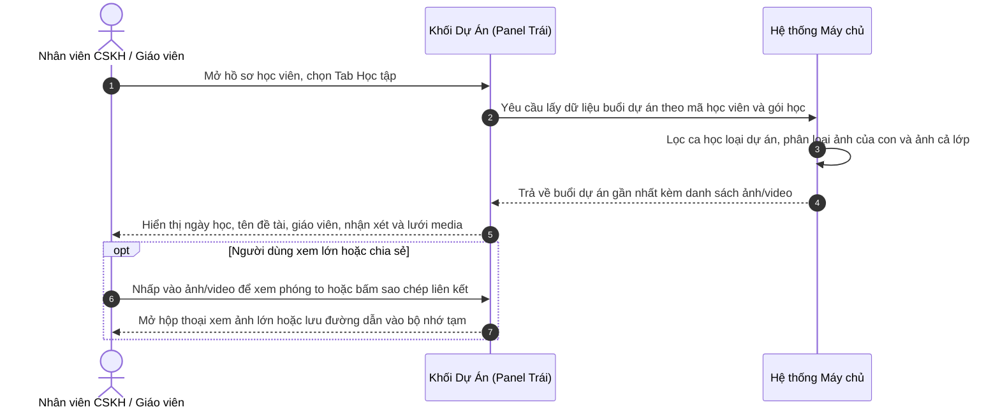

# US-CARE-01-03: Chi tiết học tập: Lấy dữ liệu hình ảnh từ buổi dự án cho mỗi học viên

> **Nghiệp vụ:** Chăm sóc học viên & Tái phí học viên  
> **Vị trí hiển thị:** Màn hình Chi tiết chăm sóc học viên và Màn hình Chi tiết tái phí học viên -> Panel trái (chiếm 50% độ rộng màn hình), Tab Học tập -> Khối "Dự án" (Buổi học dự án & Media)

---

## 1. BỐI CẢNH & PHẠM VI (CONTEXT & SCOPE)

### 1.1. Bối cảnh & Mục tiêu nghiệp vụ (Context & Objectives)
* **Vấn đề trước đây:** Khối "Dự án" tại panel trái của màn hình Chi tiết chăm sóc học viên và Chi tiết tái phí học viên trước đây chỉ hiển thị dữ liệu tĩnh mẫu, chưa liên kết với các ca học thực tế. Nhân viên chăm sóc và giáo viên khi cần gửi hình ảnh sản phẩm dự án cho phụ huynh phải tìm kiếm thủ công qua từng buổi học trong lịch lớp.
* **Mục tiêu:** Tự động truy xuất toàn bộ dữ liệu buổi học dự án (tên đề tài, ngày học, giáo viên phụ trách, nhận xét đánh giá) và kho hình ảnh, video tương ứng của học viên theo gói học đang chọn, phục vụ tư vấn chăm sóc và thúc đẩy tái phí nhanh chóng.
* **Đối tượng sử dụng (Persona):** Nhân viên chăm sóc học viên (`PERSONA-CSM`) và Giáo viên (`PERSONA-TEACHER`).
* **Chỉ số đo lường (KPI Target):**
  - Thời gian lấy tư liệu ảnh dự án gửi phụ huynh: Giảm xuống dưới 30 giây / học viên.
  - Tỷ lệ đợt chăm sóc có minh chứng dự án: Đạt trên 80%.

### 1.2. Phạm vi yêu cầu chức năng (Feature Scope)
| Mã yêu cầu | Hạng mục | Mức độ ưu tiên | Mô tả chi tiết |
|---|---|---|---|
| REQ-01 | Lọc ca học dự án | Bắt buộc (Must) | Tự động lọc các buổi học có loại ca là buổi dự án (`project`) của lớp học đang chọn |
| REQ-02 | Truy xuất & Phân loại media | Bắt buộc (Must) | Lấy ảnh/video có gắn thẻ học viên hoặc ảnh chung cả lớp; loại bỏ ảnh của học sinh khác |
| REQ-03 | Xem trước & Phóng to | Bắt buộc (Must) | Hiển thị lưới ảnh thu nhỏ tỷ lệ 16:9; nhấp để mở hộp thoại xem ảnh lớn hoặc phát video |
| REQ-04 | Sao chép liên kết chia sẻ | Bắt buộc (Must) | Nút thao tác nhanh sao chép đường dẫn hình ảnh gửi phụ huynh qua tin nhắn |
| REQ-05 | Lịch sử dự án cũ | Bắt buộc (Must) | Mặc định hiển thị 1 dự án gần nhất; cho phép mở rộng xem các dự án cũ hơn |

### 1.3. Quy tắc nghiệp vụ cốt lõi (Business Rules)
1. **[RULE-PROJ-01] Nguồn dữ liệu ca dự án:** Hệ thống chỉ lấy thông tin từ các ca học được đánh dấu là buổi dự án (`project`) trong kế hoạch học tập của lớp.
2. **[RULE-PROJ-02] Phân định tư liệu theo học viên:**
   - *Ảnh của con:* Tệp hình ảnh/video có gắn thẻ đích danh mã học viên hiện tại. Hiển thị nhãn `Ảnh của con` kèm viền xanh ngọc nổi bật quanh ô thẻ.
   - *Ảnh cả lớp:* Tệp tải lên trong ca dự án nhưng để chế độ chung cho cả lớp (không gắn thẻ học sinh cụ thể). Hiển thị nhãn `Cả lớp` với lớp phủ tối mờ và viền xám trung tính.
   - *Bảo mật dữ liệu:* Tuyệt đối không hiển thị các tệp gắn thẻ riêng cho học sinh khác trong cùng ca học.
3. **[RULE-PROJ-03] Hiển thị dòng thời gian:** Mặc định hiển thị **1 buổi dự án gần nhất**. Khi có nhiều hơn 1 buổi dự án, cung cấp nút `Xem thêm lịch sử dự án khác (X dự án cũ hơn)` để mở rộng hoặc thu gọn.
4. **[RULE-PROJ-04] Rút gọn nhận xét giáo viên:** Đoạn nhận xét đánh giá của giáo viên hiển thị tối đa 2 dòng; nếu dài hơn sẽ cung cấp nút `Xem thêm nhận xét` / `Thu gọn`.
5. **[RULE-PROJ-05] Tối ưu hiển thị:** Ảnh trong danh sách sử dụng ảnh thu nhỏ nén sẵn để bảo đảm tải nhanh dưới 300ms. Chỉ tải ảnh gốc chất lượng cao khi người dùng mở xem phóng to.

---

## 2. LUỒNG NGHIỆP VỤ (USER FLOW)

---

## 3. GIAO DIỆN, PHÂN QUYỀN & RÀNG BUỘC (UI, PERMISSION & VALIDATION RULES)

### 3.1. Mô tả chi tiết Section "Dự án" (Panel Trái Tab Học tập)
| Thành phần giao diện | Loại control | Mô tả hiển thị & Trạng thái | Quy tắc vận hành & Thao tác |
|---|---|---|---|
| **Tiêu đề & Khung dự án** | Thẻ khối chứa tiêu đề | Tiêu đề `Buổi Học Dự Án & Media Thực Hành` tại panel trái (50% màn hình), Tab Học tập | Khung bao bọc tổng hợp hình ảnh, video và sản phẩm thực hành thực tế của học viên từ buổi dự án; tự động co giãn theo danh sách ca học dự án |
| **Thông tin Dự án bài học** | Dòng tiêu đề & Mô tả dự án | - Ngày học (VD: `T6, 10/07` màu xanh da trời) - Tên dự án (VD: `Dự án Thuyết trình: My Dream City & Environmental Future`) - Giáo viên phụ trách (VD: `Teacher Mark & Ms.Chloe`) - Mô tả/Nhận xét: Lời đánh giá rút gọn 2 dòng kèm nút bấm | - Ghi nhận thông tin tổng quan về đề tài dự án mà học viên thực hiện. - Rê chuột vào tên GV: Mở bảng nổi thông tin liên hệ (ảnh đại diện, vai trò, số điện thoại che bảo mật, email). - Bấm `Xem thêm nhận xét` / `Thu gọn` để mở rộng hoặc xếp gọn lời đánh giá dài |
| **Danh sách Ảnh / Video sản phẩm** | Danh sách hình ảnh & video (Lưới tỷ lệ 16:9) | Lưới media gồm: - Thẻ `Ảnh của con`: Viền xanh ngọc nổi bật khi gắn thẻ riêng học viên - Thẻ `Cả lớp`: Viền xám trung tính cho ảnh tập thể - Video thuyết trình: Kèm nút phát màu xanh ở giữa và thời lượng phát (VD: `02:15`) - Nút chia sẻ: Nút biểu tượng chia sẻ ở góc trên bên phải khi rê chuột | - Bấm vào ảnh/video bất kỳ để xem phóng to toàn màn hình độ phân giải cao. - Bấm nút chia sẻ trên ô thẻ: Tự động sao chép liên kết ảnh/video vào bộ nhớ tạm để gửi phụ huynh. - Hệ thống tự động lọc bỏ hoàn toàn tệp gắn riêng cho học sinh khác trong lớp |
| **Nút mở rộng / Thu gọn dự án cũ** | Nút bấm mở rộng | - Khi có dự án cũ: Nút `Xem thêm lịch sử dự án khác (1 dự án cũ hơn)` kèm mũi tên xuống - Khi đã mở rộng: Nút đổi thành `Thu gọn lịch sử dự án` kèm mũi tên lên | - Mặc định chỉ hiển thị 1 dự án gần nhất. - Bấm để mở rộng xem thêm các dự án thực hành của những giai đoạn học trước đó trong cùng gói học |

### 3.2. Mô tả Hộp thoại xem phóng to Ảnh / Video (Bản xem lớn từng ảnh)
| Thành phần giao diện | Loại control | Mô tả hiển thị & Trạng thái | Quy tắc vận hành & Thao tác |
|---|---|---|---|
| **Khung hộp thoại xem lớn** | Hộp thoại nổi (Modal Dialog) | Khung lớn 860px x 520px căn giữa màn hình, nền đen tuyền bo góc mềm mại, phủ mờ toàn bộ giao diện phía sau | Ngăn cuộn trang phía dưới; bấm phím `Esc` hoặc bấm ra ngoài khoảng tối để đóng hộp thoại |
| **Thanh tiêu đề tệp sản phẩm** | Thanh tiêu đề nổi (Header Overlay) | Nằm ở cạnh trên cùng hộp thoại, hiển thị tiêu đề tệp in đậm chữ trắng lớn (VD: `Ảnh Minh Vy nhận chứng nhận xuất sắc...`) | Định danh chính xác tệp sản phẩm đang xem; tự động cắt ngắn có dấu ba chấm nếu tên quá dài |
| **Nút `Chia sẻ link`** | Nút bấm hành động | Nút chữ nhật bo góc nền mờ trong suốt, viền mỏng, biểu tượng chia sẻ màu xanh da trời, đặt ở góc trên bên phải | Bấm để sao chép đường dẫn trực tiếp của tệp vào bộ nhớ tạm, hiển thị thông báo nổi: *"Đã sao chép liên kết tệp [Tên tệp]!"* để gửi phụ huynh |
| **Nút `Tải về tệp`** | Nút bấm tải xuống (Download) | Nút chữ nhật bo góc màu xanh da trời nổi bật có biểu tượng mũi tên tải xuống, đặt cạnh nút chia sẻ | Bấm để tải tệp hình ảnh/video gốc độ phân giải cao về máy tính cá nhân; hiển thị thông báo: *"Đang tải về: [Tên tệp]"* |
| **Nút Đóng `X`** | Nút bấm biểu tượng đóng | Nút tròn nền mờ viền mỏng ở góc trên cùng bên phải ngoài cùng, biểu tượng chữ `X` màu trắng nét đậm tương phản cao | Bấm để đóng ngay hộp thoại xem lớn và quay về đúng vị trí hồ sơ học viên trên màn hình chi tiết |
| **Vùng hiển thị Ảnh gốc chất lượng cao** | Khung hiển thị hình ảnh phóng to | Chiếm trọn không gian trung tâm khi tệp đang xem là hình ảnh; nạp bản ảnh gốc sắc nét độ phân giải cao | Cho phép quan sát rõ từng chi tiết tranh vẽ, mô hình của học sinh; có hiệu ứng phóng nhẹ khi rê chuột |
| **Trình phát Video trực tiếp** | Trình phát video đa phương tiện | Chiếm trọn không gian trung tâm khi tệp là video báo cáo; cung cấp khung phát video sắc nét cùng thanh công cụ | Cho phép nghe và xem học sinh thuyết trình; hỗ trợ nút phát/tạm dừng, thanh tua thời lượng, âm lượng và mở rộng toàn màn hình |
| **Dải học sinh được gắn thẻ** | Thanh danh sách thẻ học sinh (Tagged Students) | Nằm ở góc dưới cùng bên phải hộp thoại trên nền chuyển màu tối, gồm các thẻ viên nang nhỏ có ảnh đại diện (Avatar) và họ tên học sinh (VD: `Bé Nguyễn Hoàng Vũ`, `Bé Bảo Ngọc`) | Thể hiện rõ các học sinh cùng tham gia hoàn thiện sản phẩm dự án; hỗ trợ cuộn ngang nhẹ nhàng nếu có nhiều bạn |

### 3.3. Ràng buộc kiểm tra dữ liệu (Validation Rules)
* **Không áp dụng (N/A):** Đây là chức năng thuần túy chỉ đọc (read-only) và tự động truy xuất hiển thị dữ liệu từ kho tư liệu buổi học dự án; không có biểu mẫu nhập liệu, không có trường dữ liệu sửa đổi từ phía người dùng nên không áp dụng các ràng buộc kiểm tra biểu mẫu (Validation Rules).

---

## 4. KHỐI CHỨC NĂNG & TIÊU CHÍ NGHIỆM THU (ACTIONS & ACCEPTANCE CRITERIA)

### AC-01 (Happy Path - Hiển thị buổi dự án gần nhất và phân loại media)
* **Giả sử:** Học viên đã hoàn thành buổi học dự án gần nhất; giáo viên đã cập nhật nhận xét và kho ảnh/video lên hệ thống.
* **Khi:** Người dùng mở panel bên trái xem khối Dự án tại Tab Học tập.
* **Thì:**
  1. Hiển thị thông tin buổi dự án: ngày học (`T6, 10/07`), tên đề tài và giáo viên phụ trách (`GV: Teacher Mark & Ms.Chloe`).
  2. Khung nhận xét của giáo viên hiển thị rút gọn tối đa 2 dòng kèm nút bấm chuyển đổi `Xem thêm nhận xét v` / `Thu gọn ^`.
  3. Lưới media hiển thị ảnh/video với phân loại rõ ràng:
     - **`Ảnh của con`:** Viền xanh ngọc nổi bật quanh ô thẻ, mang huy hiệu xanh lục (áp dụng cho tệp gắn thẻ riêng học viên).
     - **`Cả lớp`:** Viền xám trung tính, mang huy hiệu nền đen mờ (áp dụng cho ảnh hoạt động chung).
  4. Hệ thống tự động lọc bỏ hoàn toàn các tệp riêng của học sinh khác trong lớp.

### AC-02 (Interactive Path - Mở hộp thoại xem phóng to ảnh gốc & học sinh được gắn thẻ)
* **Giả sử:** Lưới media đang hiển thị các hình ảnh sản phẩm dự án của học viên.
* **Khi:** Người dùng nhấp chuột vào một ô thẻ ảnh bất kỳ.
* **Thì:**
  1. Mở hộp thoại nổi phóng to (860px x 520px) ở giữa màn hình trên nền tối mờ.
  2. Hiển thị bản ảnh gốc chất lượng cao sắc nét toàn khung, giữ nguyên tỷ lệ thực của tác phẩm.
  3. Thanh tiêu đề phía trên hiển thị tên tệp sản phẩm và bộ 3 nút điều khiển: `Chia sẻ link`, `Tải về tệp` và nút đóng `X`.
  4. Góc dưới bên phải hiển thị dải thẻ học sinh được gắn thẻ trong ảnh gồm ảnh đại diện (Avatar) và họ tên.

### AC-03 (Interactive Path - Phát Video thuyết trình báo cáo trong hộp thoại phóng to)
* **Giả sử:** Ô thẻ video trong lưới hiển thị biểu tượng nút Play màu xanh da trời và nhãn thời lượng phát (ví dụ: `02:15`, `01:45`).
* **Khi:** Người dùng nhấp chuột vào ô thẻ video đó.
* **Thì:**
  1. Hộp thoại phóng to mở ra và trang bị sẵn trình phát video trực tiếp tại vùng trung tâm.
  2. Video sẵn sàng phát với đầy đủ âm thanh và hình ảnh học sinh đang thuyết trình sản phẩm.
  3. Cung cấp đầy đủ thanh điều khiển: nút phát/tạm dừng, thanh trượt tua thời gian, tăng giảm âm lượng và nút phóng to toàn màn hình.

### AC-04 (Action Path - Thao tác sao chép link chia sẻ và tải tệp về máy)
* **Giả sử:** Người dùng muốn gửi hình ảnh sản phẩm cho phụ huynh hoặc lưu tệp về máy tính.
* **Khi:** Người dùng thực hiện thao tác chia sẻ hoặc tải về:
  - Nhấp nút chia sẻ ở góc trên ô thẻ ngoài danh sách (hoặc nút `Chia sẻ link` trong hộp thoại xem lớn).
  - Hoặc nhấp nút `Tải về tệp` trong hộp thoại xem lớn.
* **Thì:**
  1. **Khi bấm chia sẻ:** Hệ thống sao chép ngay đường dẫn tệp vào bộ nhớ tạm kèm thông báo nổi: *"Đã sao chép liên kết hình ảnh / video!"* để gửi qua tin nhắn.
  2. **Khi bấm tải về:** Kích hoạt tải tệp gốc chất lượng cao về thiết bị máy tính kèm thông báo: *"Đang tải về: [Tên tệp]"*.

### AC-05 (Alternate Path - Mở rộng và Thu gọn lịch sử các dự án cũ hơn)
* **Giả sử:** Học viên đã hoàn thành từ 2 buổi học dự án trở lên trong cùng gói học.
* **Khi:** Người dùng thao tác với nút điều khiển dòng thời gian ở chân khối dự án:
  - Nhấp nút `Xem thêm lịch sử dự án khác (X dự án cũ hơn) v`.
  - Hoặc nhấp nút `Thu gọn lịch sử dự án ^`.
* **Thì:**
  1. **Khi bấm Xem thêm:** Danh sách mở rộng nạp tiếp các buổi dự án cũ trước đó phía dưới (gồm ngày học, đề tài, nhận xét và lưới media riêng của từng buổi).
  2. **Khi bấm Thu gọn:** Xếp gọn danh sách trở lại, chỉ hiển thị duy nhất 1 buổi dự án gần nhất.

---

## 5. CÁC TRƯỜNG HỢP GÓC CẠNH & LUỒNG NGOẠI LỆ (CORNER CASES & EXCEPTION FLOWS)

- **[CASE-01] Học viên vắng mặt buổi dự án:** Thẻ đề tài vẫn hiển thị trong danh mục dự án kèm nhãn Vắng mặt và ghi chú học viên vắng buổi này. Nếu học viên có đi học bù ca dự án ở lớp khác, hệ thống tự động liên kết lấy hình ảnh từ ca học bù sang.
- **[CASE-02] Buổi dự án chỉ có ảnh chung cả lớp:** Tất cả hình ảnh tải lên ở chế độ cả lớp đều được hiển thị với nhãn `Cả lớp` nền tối và viền xám trung tính, giúp phụ huynh và nhân viên vẫn nắm bắt được không khí thực hành của lớp học.
- **[CASE-03] Ca dự án đã diễn ra nhưng giáo viên chưa tải ảnh lên:** Khối vẫn hiển thị đầy đủ ngày học, tên đề tài và giáo viên, khu vực lưới hiển thị thông báo nhẹ: "Chưa có hình ảnh sản phẩm được tải lên cho buổi học này", không làm vỡ bố cục giao diện.
- **[CASE-04] Video đang xử lý chuyển đổi định dạng:** Thẻ video hiển thị biểu tượng đồng hồ cát kèm thông báo "Video đang xử lý hiển thị", khi máy chủ xử lý xong sẽ tự động chuyển sang trạng thái sẵn sàng phát kèm thời lượng.
- **[CASE-05] Giáo viên gỡ gắn thẻ hoặc xóa tệp:** Do dùng chung cơ sở dữ liệu thời gian thực, tệp bị gỡ sẽ lập tức không còn xuất hiện trong khối dự án của học viên ngay khi tải lại màn hình, đảm bảo tính chuẩn xác và bảo mật.
- **[CASE-06] Lỗi mạng khi tải tệp lẻ trong lưới:** Ô media bị lỗi mạng hiển thị biểu tượng tải lại cục bộ kèm nút "Thử lại", không làm vỡ bố cục hay ảnh hưởng đến việc xem các ảnh khác trong lưới.
- **[CASE-07] Học sinh chuyển lớp trong cùng môn học:** Hệ thống tự động tổng hợp toàn bộ các ca dự án học viên đã tham gia ở cả lớp cũ và lớp mới theo dòng thời gian hoàn thành.
- **[CASE-08] Người dùng không đủ quyền chia sẻ:** Hệ thống tự động ẩn nút sao chép liên kết chia sẻ trên cả ô thẻ ngoài danh sách và trong hộp thoại xem lớn, người dùng chỉ được phép xem nội bộ theo quyền hạn được cấp.

---

## 6. KẾT NỐI DỮ LIỆU VÀ YÊU CẦU PHI CHỨC NĂNG (SERVICE & NON-FUNCTIONAL REQUIREMENTS)

### 6.1. Yêu cầu phi chức năng (Non-functional Requirements)
* **Hiệu năng:** Thời gian tải và nạp khối dự án dưới 300ms với ảnh thu nhỏ nén sẵn; chỉ tải ảnh gốc khi người dùng mở xem phóng to.
* **Bảo mật:** Số điện thoại giáo viên trên bảng nổi luôn được che ẩn ở giữa dạng `091****111`. Kiểm soát phân quyền nguyên tử chặt chẽ (`care.student_project.view`, `care.student_project.share`).
* **Tính thích ứng:** Lưới hình ảnh co giãn linh hoạt 2 đến 4 cột tùy kích thước khung hiển thị của màn hình làm việc.

### 6.2. Kết nối dữ liệu hệ thống (Service Data Contract)
* **Truy vấn ca học dự án:** Gọi đến cơ sở dữ liệu lớp học và cơ sở dữ liệu lịch trình buổi học theo mã gói học của học viên, lọc các ca có loại buổi học là `project`.
* **Truy vấn tệp media:** Gọi đến cơ sở dữ liệu tư liệu buổi học, lọc các tệp hình ảnh và video có mã học viên trong danh sách gắn thẻ hoặc để trống (ảnh cả lớp).
* **Tạo liên kết chia sẻ:** Gọi đến dịch vụ tạo đường dẫn chia sẻ có thời hạn hợp lệ từ cơ sở dữ liệu máy chủ để gửi cho phụ huynh.