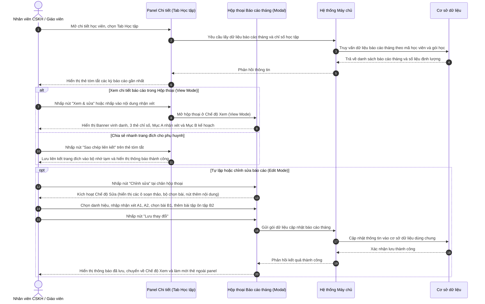

# US-CARE-01-04: Chi tiết học tập: Báo cáo tháng học viên

> **Nghiệp vụ:** Chăm sóc học viên & Tái phí học viên  
> **Vị trí hiển thị:** Màn hình Chi tiết chăm sóc học viên và Màn hình Chi tiết tái phí học viên -> Panel trái (chiếm 50% độ rộng màn hình), Tab Học tập -> Khối "Báo cáo Tháng của Học viên" (`MonthlyCommentsSection`) và Hộp thoại Xem & Chỉnh sửa Báo cáo Tháng (`StudentMonthlyReportDialog`).  
> **Tài liệu trực tuyến:** [Confluence: 2wBPCQ](https://rinoeduai.atlassian.net/wiki/x/2wBPCQ)  
> **Phiên bản hệ thống:** `v2026.09.17.01.station`  
> **Lưu ý nghiệp vụ:** Biểu mẫu báo cáo chuẩn hóa để người dùng (giáo viên, nhân viên chăm sóc) tự lập, tự đánh giá và biên tập thủ công; chưa áp dụng tính năng trí tuệ nhân tạo.

---

## 1. BỐI CẢNH & PHẠM VI (CONTEXT & SCOPE)

### 1.1. Bối cảnh & Mục tiêu nghiệp vụ (Context & Objectives)
* **Vấn đề trước đây:** Báo cáo định kỳ hàng tháng của học viên trước đây thường được giáo viên ghi nhận thủ công rời rạc trên sổ sách hoặc gửi qua các kênh trao đổi cá nhân, thiếu nơi lưu trữ tập trung và trực quan trong hồ sơ học viên. Nhân viên chăm sóc (`PERSONA-CSM`) và giáo viên (`PERSONA-TEACHER`) khi cần theo dõi tiến trình học tập, đối chiếu các chỉ số chuyên cần, bài tập về nhà và điểm kiểm tra để tư vấn cho phụ huynh phải mở nhiều màn hình tra cứu mất thời gian.
* **Mục tiêu:** Cung cấp giải pháp chuẩn hóa cho phép người dùng tự lập, xem lại, chỉnh sửa và quản lý báo cáo học tập định kỳ hàng tháng của học viên ngay tại hồ sơ chăm sóc; trực quan hóa 3 nhóm chỉ số học tập cốt lõi (chuyên cần, bài tập về nhà, kiểm tra); thiết lập kế hoạch học tập tháng tới kèm danh sách nội dung ôn tập bổ trợ và phiếu học đính kèm để chia sẻ cho phụ huynh nhanh chóng.
* **Nguyên tắc nghiệp vụ (Chưa áp dụng tính năng trí tuệ nhân tạo):** Hệ thống cung cấp biểu mẫu chuẩn hóa để người dùng tự tay nhập liệu, tự đánh giá nhận xét năng lực, chủ động chọn danh hiệu vinh danh và xây dựng kế hoạch ôn tập; **hoàn toàn chưa áp dụng tính năng trí tuệ nhân tạo** tự động sinh nội dung trong phạm vi hiện tại.
* **Đối tượng sử dụng (Persona):**
  - Nhân viên chăm sóc học viên (`PERSONA-CSM`).
  - Giáo viên và trợ giảng phụ trách lớp (`PERSONA-TEACHER`).
  - Quản lý cơ sở và Trưởng bộ phận chuyên môn (`PERSONA-BRANCH-MANAGER`).
* **Chỉ số đo lường (KPI Target):**
  - Tỷ lệ học viên đang theo học có đầy đủ báo cáo tháng trước ngày 05 hàng tháng: Đạt trên 95%.
  - Thời gian tra cứu và gửi báo cáo tháng cho phụ huynh: Dưới 15 giây / học viên.

### 1.2. Phạm vi yêu cầu chức năng (Feature Scope)

| Mã yêu cầu | Hạng mục | Mức độ ưu tiên | Mô tả chi tiết |
|---|---|---|---|
| REQ-01 | Khối tóm tắt báo cáo tháng | Bắt buộc (Must) | Hiển thị thẻ tóm tắt các kỳ báo cáo gần nhất tại panel trái tab Học tập; gồm tên kỳ, danh hiệu, giáo viên và trích dẫn nhận xét |
| REQ-02 | Xem báo cáo tháng chuyên sâu | Bắt buộc (Must) | Mở hộp thoại modal xem chi tiết báo cáo: Banner vinh danh, 3 thẻ chỉ số học tập, Nhận xét chuyên sâu (Mục A) và Kế hoạch cải thiện (Mục B) |
| REQ-03 | Biểu mẫu tự lập & chỉnh sửa | Bắt buộc (Must) | Chế độ sửa cho phép người dùng tự chọn danh hiệu, nhập tên giáo viên, viết nhận xét chung A1, đánh giá kết quả A2 và lập kế hoạch B1, B2 |
| REQ-04 | Chọn khung bài học tháng tới | Bắt buộc (Must) | Tiện ích chọn phạm vi bài học (từ bài... đến bài...) để hỗ trợ tự động điền khung kiến thức gợi ý cho giáo viên biên tập |
| REQ-05 | Nội dung ôn tập riêng linh hoạt | Bắt buộc (Must) | Cho phép tạo thêm nhiều mục ôn tập bổ trợ không giới hạn, hỗ trợ tải lên ảnh phiếu bài tập hoặc dán liên kết tài liệu trực tuyến |
| REQ-06 | Chia sẻ trang đích cho phụ huynh | Bắt buộc (Must) | Nút thao tác sao chép liên kết trang đích (Landing Page) báo cáo tháng hoặc mở trực tiếp trên tab mới để gửi cho phụ huynh |
| REQ-07 | Chuyển đổi kỳ & Mở rộng lịch sử | Bắt buộc (Must) | Cho phép chọn xem các kỳ tháng khác qua danh sách xổ xuống; hỗ trợ mở rộng xem toàn bộ lịch sử các tháng cũ hơn |

### 1.3. Quy tắc nghiệp vụ cốt lõi (Business Rules)
1. **[RULE-MR-01] Nguồn dữ liệu & Tính gắn kết theo học viên:** Dữ liệu báo cáo tháng gắn liền theo từng học viên và gói học cụ thể. Khối Báo cáo tháng chỉ hiển thị khi lớp học đã bắt đầu diễn ra; nếu học viên thuộc lớp đang chờ khai giảng hoặc chương trình chưa kích hoạt thì giao diện hiển thị trạng thái chờ, không hiển thị khối báo cáo tháng.
2. **[RULE-MR-02] Tự lập báo cáo thủ công bởi người dùng:** Toàn bộ nội dung nhận xét và kế hoạch học tập do chính giáo viên hoặc nhân viên chăm sóc phụ trách tự biên tập và lưu trữ. Hệ thống không sử dụng trí tuệ nhân tạo để tự động viết văn bản. Các nhãn gợi ý cấu trúc (như `Điểm nổi bật: ...`, `Điểm cần lưu ý: ...`, `Từ vựng & Phonics: ...`) đóng vai trò là khung hướng dẫn sư phạm giúp người dùng trình bày mạch lạc.
3. **[RULE-MR-03] Thẻ chỉ số học tập định lượng (Stats Cards):** Hệ thống tự động truy xuất và tổng hợp số liệu học tập phát sinh trong tháng của học viên từ cơ sở dữ liệu:
   - *Chuyên cần:* Tỷ lệ số ca có mặt trên tổng số ca học trong tháng (VD: `5/7`), số ca đi muộn (VD: `Muộn: 1`).
   - *Bài tập về nhà (BTVN):* Tỷ lệ buổi nộp bài tập (VD: `7/7`), điểm trung bình bài tập về nhà (VD: `Trung bình: 7.5`).
   - *Kiểm tra:* Điểm bài kiểm tra định kỳ gần nhất (VD: `8.0`), điểm bài kiểm tra đợt trước để tiện đối chiếu mức độ tiến bộ (VD: `Trước: 5.5`). Kèm nút liên kết cuộn trang nhanh đến phần nhận xét chi tiết.
4. **[RULE-MR-04] Lựa chọn Danh hiệu vinh danh tháng (Award Badges):** Người dùng chủ động lựa chọn một danh hiệu vinh danh phù hợp nhất cho học viên từ danh mục: `CHIẾN BINH BỨT PHÁ`, `HỌC VIÊN XUẤT SẮC`, `NGÔI SAO CHĂM NGOAN`, `CHIẾN BINH TIẾN BỘ`, `NGÔI SAO SÁNG TẠO`, `ĐẠI SỨ GIAO TIẾP`. Danh hiệu được hiển thị nổi bật trên thẻ tóm tắt và trong banner hộp thoại.
5. **[RULE-MR-05] Chọn phạm vi bài học tháng tới (Mục B1):** Khi lập kế hoạch học tập tháng tới, người dùng có thể chọn phạm vi bài học (từ Bài bắt đầu đến Bài kết thúc theo khung phân phối chương trình) để hệ thống tự động điền danh mục kiến thức tương ứng vào ô soạn thảo, sau đó người dùng tự do chỉnh sửa bổ sung.
6. **[RULE-MR-06] Quản lý nội dung ôn tập bổ trợ (Mục B2):** Không áp đặt cố định theo tuần; người dùng được tự do thêm mới không giới hạn số lượng mục ôn tập (#1, #2...). Mỗi mục hỗ trợ tải lên tệp ảnh phiếu học (cho phép mở xem ảnh lớn toàn màn hình qua hộp thoại xem ảnh) hoặc dán đường link tài liệu học tập trực tuyến (Google Drive, liên kết web học liệu).
7. **[RULE-MR-07] Hiển thị lịch sử phân tầng:** Ngoài panel chi tiết chỉ hiển thị tối đa 2 kỳ báo cáo gần nhất để giữ giao diện gọn gàng. Khi học viên có từ 3 kỳ báo cáo trở lên, hệ thống cung cấp nút `Xem thêm lịch sử các tháng trước (X tháng cũ hơn)` / `Thu gọn lịch sử báo cáo các tháng trước`.

---

## 2. LUỒNG NGHIỆP VỤ (USER FLOW)

---

## 3. GIAO DIỆN, PHÂN QUYỀN & RÀNG BUỘC (UI, PERMISSION & VALIDATION RULES)

### 3.1. Mô tả chi tiết Section "Báo cáo Tháng của Học viên" (Panel Trái Tab Học tập)

| Thành phần giao diện | Loại control | Mô tả hiển thị & Trạng thái | Quy tắc vận hành & Thao tác |
|---|---|---|---|
| **Tiêu đề & Khung khối báo cáo** | Thẻ khối chứa tiêu đề | Khung bo tròn viền xám mềm mại tại panel trái; tiêu đề `Báo cáo Tháng của Học viên`, mô tả `Xem báo cáo gửi phụ huynh & chỉnh sửa báo cáo chuyên sâu qua cửa sổ modal` | Khung bao bọc danh sách các kỳ báo cáo; góc trên bên phải có huy hiệu hiển thị số lượng kỳ báo cáo (VD: `2 kỳ báo cáo`) |
| **Tên kỳ báo cáo & Liên kết trang đích** | Nút bấm liên kết | Tên kỳ báo cáo màu xanh da trời in đậm kèm biểu tượng liên kết (VD: `Tháng 4/2026`) | Nhấp chuột để mở trực tiếp trang đích (Landing Page) báo cáo tháng của con trên tab trình duyệt mới |
| **Huy hiệu Kỳ hiện tại** | Huy hiệu trạng thái | Viên nang nhỏ bo tròn, nền màu tích cực, chữ in đậm `Hiện tại` | Tự động hiển thị tại kỳ báo cáo của tháng đang diễn ra |
| **Huy hiệu Danh hiệu vinh danh** | Huy hiệu vinh danh | Viên nang màu vàng hổ phách nổi bật kèm biểu tượng cúp vàng (VD: `🏆 CHIẾN BINH BỨT PHÁ`) | Phản ánh danh hiệu được giáo viên bình chọn cho học viên trong kỳ đó; tự động ẩn nếu kỳ chưa gán danh hiệu |
| **Thông tin Giáo viên phụ trách** | Dòng văn bản thông tin | Nhãn xám `GV: ` kèm tên giáo viên in đậm (VD: `GV: Ms.Chloe`) | Định danh giáo viên trực tiếp giảng dạy và thực hiện đánh giá cho kỳ học |
| **Nút `Xem & sửa`** | Nút bấm hành động | Nút hình chữ nhật bo góc nhỏ, chữ xanh lam có biểu tượng bút chì | Nhấp để mở Hộp thoại Báo cáo tháng chuyên sâu (`StudentMonthlyReportDialog`) ở đúng kỳ báo cáo tương ứng |
| **Nút `Sao chép liên kết`** | Nút bấm biểu tượng | Nút vuông nhỏ chứa biểu tượng sao chép tài liệu đặt cạnh nút xem sửa | Nhấp để sao chép nhanh đường dẫn trang đích của báo cáo tháng vào bộ nhớ tạm để gửi cho phụ huynh |
| **Đoạn trích nhận xét tóm tắt** | Đoạn văn bản có thể nhấp | Đoạn văn bản chữ nghiêng màu xám đậm rút gọn tối đa 2 dòng đặt trong ngoặc kép `“...”` | Trích xuất câu nổi bật từ phần nhận xét chung; nhấp chuột trực tiếp vào dòng này để mở hộp thoại báo cáo chi tiết |
| **Nút mở rộng / Thu gọn lịch sử cũ** | Nút bấm điều khiển | Nút nằm ở chân khối: `Xem thêm lịch sử các tháng trước (X tháng cũ hơn)` kèm mũi tên xuống hoặc `Thu gọn...` kèm mũi tên lên | Chỉ hiển thị khi có từ 3 kỳ báo cáo trở lên; nhấp để mở rộng hoặc thu gọn danh sách hiển thị |

### 3.2. Mô tả Hộp thoại Xem & Chỉnh sửa Báo cáo Tháng (Modal Dialog)

| Thành phần giao diện | Loại control | Mô tả hiển thị & Trạng thái | Quy tắc vận hành & Thao tác |
|---|---|---|---|
| **Khung hộp thoại modal** | Cửa sổ nổi (Modal Dialog) | Hộp thoại kích thước 860px căn giữa màn hình, chiều cao tối đa 92% màn hình, nền trắng bo góc lớn, phủ mờ toàn bộ giao diện nền | Ngăn cuộn trang nền; hỗ trợ thanh cuộn độc lập bên trong; bấm phím Esc hoặc nút đóng để thoát |
| **Thanh tiêu đề hộp thoại** | Thanh tiêu đề chính | Nằm ở cạnh trên cùng: Tiêu đề in hoa `BÁO CÁO HỌC TẬP CHUYÊN SÂU & KẾ HOẠCH HỌC TẬP` | Định danh mục tiêu của hộp thoại; giữ cố định khi cuộn nội dung phía dưới |
| **Bộ chọn Kỳ báo cáo** | Hộp chọn thả xuống (Select) | Nhãn `Kỳ báo cáo:` kèm ô chọn hiển thị kỳ tháng (VD: `Báo cáo Tháng 4 & Kế hoạch Tháng 5/2026`) | Cho phép chuyển đổi nhanh giữa các kỳ tháng; khi chọn kỳ mới, toàn bộ dữ liệu báo cáo của tháng đó được nạp lên biểu mẫu |
| **Banner vinh danh & Thời gian học** | Khung thông báo vinh danh | Khung nền vàng hổ phách nhạt; hiển thị khoảng thời gian kỳ học (VD: `01/04/2026 đến 30/04/2026`) | Thể hiện khung thời gian phát sinh kết quả học tập của kỳ báo cáo |
| **Chọn / Hiển thị Danh hiệu vinh danh** | Huy hiệu / Dropdown | Chế độ xem: Huy hiệu vàng `🏆 [Tên danh hiệu]`. Chế độ sửa: Ô chọn danh hiệu từ danh mục chuẩn | Người dùng tự chọn danh hiệu khích lệ con: `CHIẾN BINH BỨT PHÁ`, `HỌC VIÊN XUẤT SẮC`, `NGÔI SAO CHĂM NGOAN`... |
| **Lời nhắn gửi từ Giáo viên** | Đoạn văn bản / Ô nhập văn bản | Lời chúc mừng gửi đến học viên kèm tên giáo viên phụ trách | Chế độ xem: Hiển thị dòng văn bản hoàn chỉnh. Chế độ sửa: Có ô nhập văn bản để người dùng điều chỉnh tên giáo viên |
| **Thẻ 3 chỉ số học tập định lượng** | Bộ 3 thẻ thống kê (Cards) | 3 thẻ bo góc: Chuyên cần (tỷ lệ & đi muộn), Bài tập về nhà (tỷ lệ & điểm TB), Điểm kiểm tra (điểm gần nhất & đợt trước) | Trực quan hóa kết quả học tập định lượng; cạnh ô Kiểm tra có nút `Nhận xét` giúp cuộn nhanh xuống mục A |
| **Mục A1 - Nhận xét chung** | Khối văn bản / Ô soạn thảo | Nhãn mục chấm tròn xanh lam `1. Nhận xét chung`; dòng gợi ý: `Điểm nổi bật: ...` và `Điểm cần lưu ý: ...` | Chế độ xem: Hiển thị văn bản đánh giá thái độ, nề nếp. Chế độ sửa: Ô soạn thảo văn bản 6 dòng cho phép tự nhập liệu |
| **Mục A2 - Nhận xét kết quả học tập** | Khối văn bản / Ô soạn thảo | Nhãn mục chấm tròn xanh lục `2. Nhận xét về kết quả học tập`; dòng gợi ý: `Từ vựng & Phonics`, `Cấu trúc & Mẫu câu` | Chế độ xem: Hiển thị đánh giá mức độ tiếp thu kiến thức. Chế độ sửa: Ô soạn thảo văn bản 5 dòng cho phép tự nhập liệu |
| **Mục B1 - Nội dung bài học tháng tới** | Khối văn bản / Ô soạn thảo | Nhãn mục có chấm tròn; thể hiện danh mục các bài học, chủ đề, cấu trúc dự kiến học trong tháng kế tiếp | Chế độ xem: Hiển thị lộ trình bài học. Chế độ sửa: Ô soạn thảo 8 dòng kèm tiện ích chọn phạm vi bài học |
| **Tiện ích Chọn phạm vi bài học (B1)** | Bộ chọn bài (Start → End Lesson) | Hai ô chọn `Bài bắt đầu` và `Bài kết thúc` (VD: Bài 8 → Bài 10) chỉ hiển thị khi ở chế độ sửa | Khi người dùng thay đổi khoảng bài, hệ thống hỗ trợ điền gợi ý tóm tắt bài học tương ứng vào ô soạn thảo để tham khảo |
| **Mục B2 - Danh sách nội dung ôn tập riêng** | Danh sách các mục ôn tập | Tiêu đề `2. NỘI DUNG ÔN TẬP RIÊNG`; kèm nút `+ Thêm nội dung` (khi sửa); danh sách các mục ôn tập (#1, #2...) | Mỗi mục gồm tiêu đề bài tập, nút xóa, ô nhập chi tiết yêu cầu luyện tập và khung tài liệu đính kèm |
| **Khung tệp tài liệu / Ảnh đính kèm (B2)** | Vùng đính kèm đa phương tiện | Khung đính kèm hỗ trợ tải ảnh phiếu bài tập từ máy tính hoặc dán link tài liệu trực tuyến (Google Drive, web) | Hiển thị ảnh thu nhỏ; khi rê chuột có nút `Xem ảnh lớn` (mở Lightbox), nút `Mở link file` và nút `Gỡ đính kèm` |
| **Huy hiệu trạng thái chân modal** | Huy hiệu thông tin góc trái | Chế độ xem: Viên nang xanh lá `Báo cáo định kỳ hàng tháng`. Chế độ sửa: Viên nang màu cam `Chế độ chỉnh sửa báo cáo` | Giúp người dùng nhận biết rõ ràng trạng thái hoạt động hiện tại của hộp thoại |
| **Nút `Xem Landing Page`** | Nút bấm liên kết ngoài | Nút viền mỏng màu xanh da trời có biểu tượng mở trang ngoài (ở Chế độ Xem) | Mở toàn màn hình giao diện trang đích báo cáo tháng trên tab trình duyệt mới |
| **Nút `Gửi phụ huynh`** | Nút bấm hành động | Nút viền mỏng màu chủ đạo có biểu tượng gửi tin (ở Chế độ Xem) | Sao chép liên kết trang đích vào bộ nhớ tạm để gửi phụ huynh kèm thông báo nổi xác nhận |
| **Nút `Đóng`** | Nút bấm phụ | Nút viền xám tiêu chuẩn ở góc phải chân trang (ở Chế độ Xem) | Đóng ngay hộp thoại và quay trở về màn hình hồ sơ học viên |
| **Nút `Chỉnh sửa`** | Nút bấm chính | Nút màu chủ đạo nổi bật có biểu tượng bút chì (ở Chế độ Xem) | Chuyển hộp thoại từ Chế độ Xem sang Chế độ Chỉnh sửa |
| **Nút `Hủy`** | Nút bấm phụ | Nút viền xám tiêu chuẩn (ở Chế độ Sửa) | Hủy toàn bộ thay đổi vừa nhập, khôi phục lại dữ liệu ban đầu và chuyển về Chế độ Xem kèm thông báo |
| **Nút `Lưu thay đổi`** | Nút bấm chính | Nút màu chủ đạo nổi bật có biểu tượng dấu tích chữ V (ở Chế độ Sửa) | Lưu toàn bộ nội dung báo cáo vào cơ sở dữ liệu dùng chung, cập nhật thẻ tóm tắt ngoài panel và chuyển về Chế độ Xem |

### 3.3. Ràng buộc kiểm tra dữ liệu & Phân quyền động (Validation & Capability Gating)

#### Phân quyền động theo năng lực nguyên tử (Capability Gating)
Hệ thống không gán cứng vai trò trong tài liệu mà kiểm soát quyền hạn thông qua các mã quyền nguyên tử:
* `care.monthly_report.view`: Quyền xem khối tóm tắt báo cáo tháng và mở hộp thoại xem chi tiết báo cáo tháng.
* `care.monthly_report.edit`: Quyền kích hoạt Chế độ Sửa, điều chỉnh nội dung nhận xét, kế hoạch và lưu báo cáo tháng.
* `care.monthly_report.send_parent`: Quyền sao chép liên kết trang đích báo cáo tháng để gửi cho phụ huynh.

#### Xử lý khi không đủ quyền hạn
* Nếu người dùng không có quyền `care.monthly_report.edit`: Nút `Xem & sửa` trên thẻ tóm tắt ngoài panel đổi thành `Xem chi tiết`; nút `Chỉnh sửa` ở chân hộp thoại bị ẩn hoàn toàn, toàn bộ biểu mẫu cố định ở chế độ chỉ đọc.
* Nếu người dùng không có quyền `care.monthly_report.send_parent`: Nút `Sao chép liên kết` ngoài thẻ tóm tắt và nút `Gửi phụ huynh` trong hộp thoại bị ẩn hoặc vô hiệu hóa.

#### Ràng buộc kiểm tra dữ liệu nhập liệu (Validation Rules)
* **[VAL-MR-01] Tên giáo viên phụ trách:** Không được để trống; độ dài tối đa 50 ký tự.
* **[VAL-MR-02] Phạm vi bài học tháng tới:** Bài bắt đầu phải nhỏ hơn hoặc bằng Bài kết thúc; giá trị nằm trong khoảng từ 1 đến tổng số bài của giáo trình.
* **[VAL-MR-03] Định dạng tệp đính kèm ôn tập:** Tệp tải lên chấp nhận các định dạng hình ảnh (jpg, png, webp) hoặc tệp văn bản tài liệu (pdf, doc, docx); dung lượng tối đa 15MB cho mỗi tệp.
* **[VAL-MR-04] Đường dẫn liên kết tài liệu:** Nếu người dùng dán liên kết tài liệu trực tuyến, chuỗi ký tự phải bắt đầu bằng giao thức hợp lệ (`http://` hoặc `https://`).

---

## 4. KHỐI CHỨC NĂNG & TIÊU CHÍ NGHIỆM THU (ACTIONS & ACCEPTANCE CRITERIA)

### AC-01 (Happy Path - Hiển thị khối tóm tắt báo cáo tháng tại hồ sơ học viên)
* **Giả sử:** Học viên đang theo học gói học đã kích hoạt; giáo viên đã hoàn thành lập báo cáo cho các kỳ tháng trước đó.
* **Khi:** Người dùng truy cập màn hình Chi tiết chăm sóc học viên và chọn Tab Học tập tại panel bên trái.
* **Thì:**
  - Hệ thống gọi đến cơ sở dữ liệu báo cáo tháng học viên để truy xuất danh sách báo cáo.
  - Hiển thị khối `Báo cáo Tháng của Học viên` với tối đa 2 thẻ tóm tắt kỳ gần nhất.
  - Mỗi thẻ tóm tắt hiển thị đầy đủ: tên kỳ tháng (kèm biểu tượng liên kết), huy hiệu `Hiện tại` (nếu là tháng đang học), huy hiệu danh hiệu vinh danh `🏆 [Tên danh hiệu]`, tên giáo viên phụ trách, nút `Xem & sửa`, nút `Sao chép liên kết` và đoạn trích dẫn nhận xét rút gọn 2 dòng.
  - Nếu học viên có từ 3 kỳ báo cáo trở lên, hiển thị nút `Xem thêm lịch sử các tháng trước (X tháng cũ hơn)`.

### AC-02 (Interactive Path - Mở hộp thoại xem chi tiết báo cáo tháng ở Chế độ Xem)
* **Giả sử:** Khối tóm tắt báo cáo tháng đang hiển thị trên panel chi tiết học viên.
* **Khi:** Người dùng nhấp vào nút `Xem & sửa` hoặc nhấp vào đoạn văn bản trích dẫn nhận xét trên thẻ tóm tắt.
* **Thì:**
  - Mở Hộp thoại Báo cáo tháng (`StudentMonthlyReportDialog`) ở Chế độ Xem (View Mode).
  - Thanh tiêu đề hiển thị đúng tên kỳ báo cáo đã chọn tại ô chọn `Kỳ báo cáo:`.
  - Banner hiển thị khoảng thời gian học tập, huy hiệu danh hiệu vinh danh dạng viên nang màu vàng và lời chúc mừng từ giáo viên phụ trách.
  - Bộ 3 thẻ chỉ số hiển thị chính xác tỷ lệ Chuyên cần (kèm số ca muộn), Bài tập về nhà (kèm điểm trung bình) và Điểm kiểm tra định kỳ gần nhất (kèm điểm đợt trước).
  - Mục A hiển thị đầy đủ nội dung Nhận xét chung (A1) và Nhận xét kết quả học tập (A2).
  - Mục B hiển thị đầy đủ Nội dung bài học tháng tới (B1) và Danh sách các nội dung ôn tập riêng kèm hình ảnh/tài liệu đính kèm (B2).
  - Chân hộp thoại hiển thị huy hiệu xanh `Báo cáo định kỳ hàng tháng` cùng bộ nút: `Xem Landing Page`, `Gửi phụ huynh`, `Đóng` và `Chỉnh sửa`.

### AC-03 (Interactive Path - Chuyển sang Chế độ Sửa và tự biên tập báo cáo tháng)
* **Giả sử:** Hộp thoại báo cáo tháng đang mở ở Chế độ Xem và người dùng có mã quyền `care.monthly_report.edit`.
* **Khi:** Người dùng nhấp nút `Chỉnh sửa` ở góc phải chân hộp thoại.
* **Thì:**
  - Hộp thoại chuyển sang Chế độ Chỉnh sửa (Edit Mode); huy hiệu chân trang đổi thành màu cam `Chế độ chỉnh sửa báo cáo`.
  - Huy hiệu danh hiệu trên banner chuyển thành hộp chọn thả xuống (Select) cho phép chọn danh hiệu vinh danh mới.
  - Dòng lời nhắn giáo viên hiển thị ô nhập để chỉnh sửa họ tên giáo viên phụ trách.
  - Các mục nhận xét A1, A2 và nội dung bài học B1 chuyển thành các ô soạn thảo văn bản nhiều dòng cho phép người dùng tự do gõ nội dung hoặc điều chỉnh câu chữ.
  - Mục B1 xuất hiện bộ chọn bài `Bài bắt đầu` và `Bài kết thúc`.
  - Mục B2 xuất hiện nút `+ Thêm nội dung`, cho phép nhập tiêu đề, mô tả bài tập và tải ảnh phiếu bài tập hoặc dán link tài liệu cho từng mục.
  - Nhóm nút chân trang chuyển thành bộ đôi nút: `Hủy` và `Lưu thay đổi`.

### AC-04 (Action Path - Lưu thay đổi báo cáo tháng và đồng bộ cơ sở dữ liệu)
* **Giả sử:** Người dùng đang ở Chế độ Sửa và đã hoàn tất việc chỉnh sửa các thông tin nhận xét, danh hiệu và kế hoạch ôn tập.
* **Khi:** Người dùng nhấp nút `Lưu thay đổi` tại chân hộp thoại.
* **Thì:**
  - Hệ thống kiểm tra các ràng buộc dữ liệu (họ tên giáo viên không rỗng, khoảng bài học hợp lệ, liên kết đúng định dạng).
  - Gọi đến cơ sở dữ liệu báo cáo tháng học viên để cập nhật toàn bộ bản ghi báo cáo.
  - Hiển thị thông báo nổi xác nhận: *"Đã lưu báo cáo chuyên sâu & kế hoạch học tập cho học viên [Tên học viên]!"*.
  - Hộp thoại tự động chuyển trở lại Chế độ Xem với các dữ liệu vừa được cập nhật mới nhất.
  - Thẻ tóm tắt của kỳ báo cáo tương ứng ngoài panel chi tiết học viên tự động làm mới nội dung (cập nhật danh hiệu, tên giáo viên và câu trích dẫn mới).

### AC-05 (Action Path - Hủy bỏ các chỉnh sửa chưa lưu)
* **Giả sử:** Người dùng đang ở Chế độ Sửa và đã thay đổi một số câu chữ trên biểu mẫu nhưng không muốn áp dụng.
* **Khi:** Người dùng nhấp nút `Hủy` tại chân hộp thoại.
* **Thì:**
  - Hệ thống hủy bỏ toàn bộ các giá trị vừa nhập trên các ô soạn thảo.
  - Khôi phục lại trạng thái dữ liệu nguyên bản trước khi bấm nút chỉnh sửa.
  - Hiển thị thông báo nổi: *"Đã hủy các chỉnh sửa chưa lưu."*.
  - Hộp thoại chuyển về Chế độ Xem an toàn.

### AC-06 (Action Path - Chia sẻ trang đích báo cáo cho phụ huynh)
* **Giả sử:** Hộp thoại báo cáo tháng đang mở hoặc người dùng đang xem thẻ tóm tắt ngoài panel.
* **Khi:** Người dùng nhấp nút `Sao chép liên kết` trên thẻ tóm tắt (hoặc nút `Gửi phụ huynh` trong hộp thoại).
* **Thì:**
  - Hệ thống tạo đường dẫn liên kết trang đích chuẩn xác theo định dạng: `[Tên miền]/report/[Mã học viên]?month=[Mã kỳ báo cáo]`.
  - Tự động lưu chuỗi liên kết vào bộ nhớ tạm của thiết bị người dùng.
  - Hiển thị thông báo nổi thông báo thành công: *"Đã sao chép liên kết Landing Page báo cáo [Kỳ tháng] gửi phụ huynh học viên [Tên học viên]!"*.

### AC-07 (Alternate Path - Chuyển đổi kỳ báo cáo và mở rộng lịch sử)
* **Giả sử:** Học viên đã theo học nhiều tháng và có từ 3 kỳ báo cáo trở lên được lưu trong cơ sở dữ liệu.
* **Khi:** Người dùng thực hiện thao tác chuyển đổi kỳ hoặc mở rộng:
  - Chọn một kỳ tháng khác từ danh sách xổ xuống `Kỳ báo cáo:` trong hộp thoại.
  - Hoặc nhấp nút `Xem thêm lịch sử các tháng trước` tại chân khối tóm tắt ngoài panel.
* **Thì:**
  - Khi đổi kỳ trong hộp thoại: Hệ thống nạp lại toàn bộ dữ liệu báo cáo, chỉ số học tập, danh hiệu và bài tập ôn tập của đúng kỳ tháng vừa chọn.
  - Khi bấm xem thêm ngoài panel: Khối mở rộng danh sách nạp đầy đủ các thẻ tóm tắt của toàn bộ các kỳ học cũ hơn trong quá khứ; nút chuyển thành `Thu gọn lịch sử báo cáo các tháng trước`.

---

## 5. CÁC TRƯỜNG HỢP GÓC CẠNH & LUỒNG NGOẠI LỆ (CORNER CASES & EXCEPTION FLOWS)

* **[CASE-01] Học viên chưa có báo cáo tháng nào:** Khi mở hồ sơ của học viên mới bắt đầu học chưa có báo cáo tháng nào được lưu, khối ngoài panel hiển thị dòng thông báo nhẹ: "Chưa có báo cáo tháng nào được lưu cho học viên này". Khi người dùng nhấn nút tạo báo cáo, hộp thoại mở ra với biểu mẫu trắng sạch sẽ, các ô nhận xét và kế hoạch trống để người dùng chủ động nhập liệu từ đầu.
* **[CASE-02] Học viên mới nhập học giữa tháng (chưa đủ cả tháng):** Các thẻ chỉ số chuyên cần và bài tập về nhà tự động tính toán theo số buổi thực tế học viên có tham gia kể từ ngày vào lớp (ví dụ: `2/2` buổi). Người dùng ghi chú rõ tình trạng học sinh mới vào giữa tháng trong phần nhận xét chung để phụ huynh nắm bắt.
* **[CASE-03] Chương trình học chưa bắt đầu hoặc lớp chờ khai giảng:** Nếu trạng thái xếp lớp của học viên là `awaiting_opening` (Chờ khai giảng) hoặc gói học chưa được kích hoạt, hệ thống ẩn hoàn toàn khối Báo cáo tháng và hiển thị thông báo "Chương trình học chờ kích hoạt. Hiện chưa có lịch sử học tập", không gây hiểu lầm cho người dùng.
* **[CASE-04] Người dùng đang chỉnh sửa dở mà vô tình bấm đóng hộp thoại hoặc phím Esc:** Hệ thống giữ lại dữ liệu đang nhập tạm thời trên biểu mẫu và hiển thị thông báo nhắc nhở; dữ liệu chỉ thực sự bị hủy khi người dùng nhấn rõ ràng vào nút `Hủy` hoặc xác nhận tải lại trang.
* **[CASE-05] Đính kèm tệp không đúng định dạng hoặc vượt quá dung lượng:** Nếu người dùng tải lên tệp không thuộc định dạng cho phép (ví dụ tệp thực thi .exe) hoặc dung lượng tệp vượt quá 15MB, hệ thống hiển thị thông báo lỗi màu đỏ từ chối nhận tệp và hướng dẫn người dùng chỉ chọn tệp hình ảnh (.jpg, .png) hoặc tài liệu (.pdf, .docx).
* **[CASE-06] Người dùng không có quyền chỉnh sửa báo cáo (`care.monthly_report.edit`):** Biểu mẫu hộp thoại cố định hoàn toàn ở Chế độ Xem, nút `Chỉnh sửa` bị ẩn đi, các nút xóa bài tập và nút tải ảnh bị vô hiệu hóa; người dùng chỉ được phép đọc nội dung và sao chép liên kết gửi phụ huynh nếu có quyền chia sẻ.
* **[CASE-07] Mất kết nối mạng trong lúc nhấn Lưu thay đổi:** Hệ thống hiển thị thông báo lỗi: "Không thể lưu báo cáo do sự cố kết nối máy chủ. Vui lòng kiểm tra lại đường truyền và thử lại". Toàn bộ nội dung người dùng vừa nhập trên biểu mẫu được bảo toàn nguyên vẹn trên màn hình, không bị xóa mất dữ liệu.
* **[CASE-08] Học viên chuyển lớp giữa kỳ báo cáo:** Hệ thống gọi đến cơ sở dữ liệu học tập để tổng hợp chuyên cần và bài tập về nhà của học viên từ cả hai lớp học trong tháng đó; người dùng khi lập báo cáo tháng có thể ghi chú quá trình chuyển đổi lớp của con trong phần nhận xét chung để phụ huynh yên tâm đồng hành.
