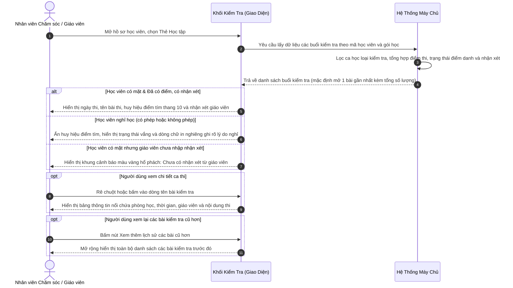

# US-CARE-01-04: Chi tiết học tập: Lấy dữ liệu từ các buổi kiểm tra cho mỗi học viên

> **Nghiệp vụ:** Chăm sóc học viên & Tái phí học viên  
> **Vị trí hiển thị:** Màn hình Chi tiết chăm sóc học viên và Màn hình Chi tiết tái phí học viên -> Bảng bên trái (chiếm một nửa độ rộng màn hình), Thẻ Học tập -> Khối Kiểm tra  

---

## 1. BỐI CẢNH & PHẠM VI (CONTEXT & SCOPE)

### 1.1. Bối cảnh & Mục tiêu nghiệp vụ (Context & Objectives)
* **Vấn đề trước đây:** Các kết quả bài kiểm tra đánh giá năng lực định kỳ (giữa kỳ, cuối kỳ, kiểm tra phân lớp đầu vào) của học viên trước đây thường được ghi nhận phân tán trên sổ sách giảng dạy hoặc lưu trữ ở các biểu mẫu điểm rời rạc. Nhân viên chăm sóc (`PERSONA-CSM`) và giáo viên (`PERSONA-TEACHER`) khi cần theo dõi tiến độ, trao đổi sự tiến bộ học tập với phụ huynh hoặc tư vấn tái phí phải mất nhiều thời gian tra cứu thủ công qua từng buổi trong sổ điểm danh.
* **Mục tiêu:** Tự động truy xuất toàn bộ dữ liệu các buổi kiểm tra của học viên từ kế hoạch đào tạo của lớp theo gói học đang chọn; trực quan hóa ngày thi, tên bài kiểm tra, trạng thái điểm danh, điểm số đạt được theo thang điểm 10 chuẩn mực và lời nhận xét sư phạm chi tiết của giáo viên; xử lý tinh tế các trường hợp học viên nghỉ thi, chưa có điểm số hoặc giáo viên chưa kịp nhập nhận xét; đồng thời cho phép mở rộng xem lại toàn bộ lịch sử các bài kiểm tra đã hoàn thành trong suốt quá trình theo học.
* **Đối tượng sử dụng (Persona):** Nhân viên chăm sóc học viên (`PERSONA-CSM`) và Giáo viên (`PERSONA-TEACHER`).
* **Chỉ số đo lường (KPI Target):**
  - Thời gian tra cứu kết quả và lịch sử bài kiểm tra của học viên: Giảm xuống dưới 10 giây / học viên.
  - Tỷ lệ đợt tư vấn chăm sóc học thuật có dữ liệu điểm kiểm tra minh chứng: Đạt trên 90%.

### 1.2. Phạm vi yêu cầu chức năng (Feature Scope)

| Mã yêu cầu | Hạng mục | Mức độ ưu tiên | Mô tả chi tiết |
|---|---|---|---|
| REQ-01 | Tự động lọc ca kiểm tra | Bắt buộc (Must) | Tự động lọc và kết xuất các buổi học có loại ca là bài kiểm tra thuộc lớp học và gói học đang chọn |
| REQ-02 | Trực quan hóa điểm số | Bắt buộc (Must) | Hiển thị điểm số bài kiểm tra nổi bật theo thang điểm chuẩn trên 10 kèm huy hiệu màu tím; tự động ẩn khi chưa có điểm |
| REQ-03 | Điểm danh & Nghỉ phép | Bắt buộc (Must) | Thể hiện trạng thái điểm danh thực tế (Đã đến, Vắng, Đến muộn) và liên kết mở đơn xin nghỉ phép nếu có |
| REQ-04 | Bảng thông tin nổi ca thi | Bắt buộc (Must) | Rê chuột hoặc nhấp vào tiêu đề bài thi để xem chi tiết phòng học, thời gian, giáo viên và nội dung kiểm tra |
| REQ-05 | Lời nhận xét & Cảnh báo thiếu | Bắt buộc (Must) | Hiển thị nhận xét sư phạm; hiển thị lý do nghỉ khi vắng hoặc khung cảnh báo màu vàng khi giáo viên chưa nhập nhận xét |
| REQ-06 | Lịch sử bài kiểm tra phân tầng | Bắt buộc (Must) | Mặc định hiển thị 1 bài kiểm tra gần nhất; cung cấp nút bấm mở rộng hoặc thu gọn danh sách các bài thi cũ hơn |

### 1.3. Quy tắc nghiệp vụ cốt lõi (Business Rules)
1. **[RULE-TEST-01] Nguồn dữ liệu ca kiểm tra:** Hệ thống chỉ truy xuất thông tin từ các buổi học được định nghĩa là buổi kiểm tra trong phân phối chương trình của lớp học thuộc gói học hiện tại của học viên.
2. **[RULE-TEST-02] Ẩn khối khi chưa phát sinh bài kiểm tra:** Nếu lớp học hoặc gói học của học viên chưa có buổi kiểm tra nào trong kế hoạch, toàn bộ khối Kiểm tra sẽ tự động ẩn khỏi giao diện để giữ màn hình tinh gọn.
3. **[RULE-TEST-03] Cơ chế hiển thị Điểm số & Xử lý khi chưa có điểm:**
   - Khi đã có điểm: Điểm kiểm tra hiển thị dưới dạng số thực theo thang điểm 10 (ví dụ: `8.5/10`, `9.0/10`), đặt trong huy hiệu màu tím tương phản cao.
   - Khi chưa có điểm (hoặc học viên nghỉ thi): Tự động ẩn hoàn toàn khung huy hiệu điểm số màu tím, không hiển thị khoảng trống, dấu gạch ngang rỗng hay lỗi dữ liệu.
4. **[RULE-TEST-04] Cơ chế hiển thị Nhận xét & 3 trạng thái xử lý:**
   - *Trạng thái 1 - Học viên nghỉ thi (Vắng hoặc Nghỉ phép):* Không hiển thị khung cảnh báo màu vàng để tránh báo động giả. Thay vào đó, vùng nhận xét hiển thị dòng chữ in nghiêng màu xám: `"Học viên nghỉ có phép ([Lý do nghỉ nếu có])"` hoặc `"Học viên nghỉ học không phép."`
   - *Trạng thái 2 - Học viên đi học nhưng Chưa có nhận xét:* Hệ thống hiển thị khung cảnh báo màu vàng hổ phách bo góc mềm kèm biểu tượng cảnh báo: In đậm dòng `"Chưa có nhận xét từ giáo viên:"` kèm giải thích `"Giáo viên chưa cập nhật đánh giá học viên cho ca học này."`
   - *Trạng thái 3 - Đã có nhận xét:* Hiển thị trọn vẹn văn bản đánh giá kèm biểu tượng bia mục tiêu. Giới hạn hiển thị 3 dòng đầu; nếu dài hơn sẽ cung cấp nút `... xem thêm` và `... Thu gọn`.
5. **[RULE-TEST-05] Độc lập giữa điểm danh và đơn xin nghỉ phép:** Trạng thái chuyên cần của buổi thi (Đã đến, Vắng, Đến muộn, Chưa điểm danh) được hiển thị tách biệt với nhãn Nghỉ phép (V). Khi học viên có đơn xin nghỉ phép hợp lệ, nhãn này cho phép người dùng nhấp vào để mở xem chi tiết đơn.
6. **[RULE-TEST-06] Hiển thị lịch sử phân tầng:** Mặc định hệ thống chỉ hiển thị **1 bài kiểm tra gần nhất** để tối ưu diện tích quan sát. Khi học viên có từ 2 bài kiểm tra trở lên, hệ thống cung cấp nút `Xem thêm lịch sử (X bài cũ hơn)` để người dùng mở rộng theo nhu cầu.
7. **[RULE-TEST-07] Liên kết bài tập về nhà đính kèm:** Nếu buổi kiểm tra có gắn mã bài tập về nhà (ví dụ: `BT-04`), trường hợp học viên đã làm thì mã hiển thị màu xanh kèm đường dẫn mở sang trang làm bài trong thẻ trình duyệt mới; trường hợp chưa làm thì hiển thị chữ xám mờ.

---

## 2. LUỒNG NGHIỆP VỤ (USER FLOW)

---

## 3. CẤU TRÚC GIAO DIỆN, PHÂN QUYỀN & RÀNG BUỘC (UI, PERMISSION & VALIDATION RULES)

### 3.1. Mô tả chi tiết Khối "Kiểm tra" (Bảng bên trái Thẻ Học tập)

| Thành phần giao diện | Loại control | Mô tả hiển thị & Trạng thái | Quy tắc vận hành & Thao tác |
|---|---|---|---|
| **Tiêu đề Khối & Bộ đếm bài thi** | Thẻ thanh tiêu đề tích hợp | Dòng tiêu đề chữ đậm `Kiểm tra` ở bên trái; bên phải hiển thị số lượng: `Hiển thị X/Y bài kiểm tra` | Định danh khu vực thông tin bài kiểm tra; tự động đếm chính xác số bài đang hiển thị trên tổng số bài kiểm tra đã có của gói học |
| **Cụm Ngày thi & Tên bài kiểm tra** | Cụm văn bản tương tác | - Ngày tháng viết tắt (VD: `T4, 15/07`) in đậm màu nhấn - Tên bài thi (VD: `Kiểm tra Giữa kỳ (Midterm Assessment)`) | Bấm hoặc rê chuột vào cụm văn bản: Kích hoạt hiển thị bảng thông tin nổi chi tiết về ca học kiểm tra |
| **Huy hiệu Điểm danh** | Huy hiệu trạng thái viên nang | Các trạng thái trực quan: - `Đã đến`: Nền xanh lá cây nhạt - `Vắng`: Nền đỏ cam - `Đến muộn`: Nền vàng cam - `Chưa điểm danh`: Nền xám trung tính | Phản ánh chính xác kết quả điểm danh của buổi thi từ sổ ghi nhận chuyên cần của lớp |
| **Nút Nghỉ phép (V)** | Nút bấm huy hiệu liên kết | Hiển thị nhãn `Nghỉ phép (V)` màu hổ phách kèm biểu tượng liên kết khi học viên có đơn xin nghỉ phép được phê duyệt | Bấm vào nút: Mở hộp thoại xem nội dung chi tiết đơn xin nghỉ phép của buổi kiểm tra tương ứng |
| **Mã Bài tập về nhà (BTVN)** | Nhãn liên kết thông tin | Mã bài tập dạng `BT-04`, `BT-10` đặt cạnh trạng thái điểm danh | - Đã nộp: Chữ màu xanh da trời, bấm vào để mở xem chi tiết bài làm trong thẻ mới. - Chưa nộp: Chữ màu xám mờ không có liên kết |
| **Huy hiệu Điểm số bài kiểm tra** | Thẻ điểm số nổi bật | - Khi đã có điểm: Điểm số theo thang điểm 10 (VD: `8.5/10`, `9/10`), viền và chữ màu tím trên nền tím nhạt. - Khi chưa có điểm / vắng: Tự động ẩn hoàn toàn | Thể hiện kết quả học lực đạt được; tự động ẩn khi bài thi chưa có điểm số để giữ giao diện sạch đẹp |
| **Lời nhận xét của Giáo viên** | Vùng văn bản mở rộng | - Khi có nhận xét: Đoạn văn bản đánh giá kèm biểu tượng bia mục tiêu (VD: `🎯 Kết quả kiểm tra...`). - Khi học viên nghỉ: Dòng chữ in nghiêng màu xám thể hiện tình trạng nghỉ có phép/không phép. - Khi chưa có nhận xét: Khung cảnh báo màu vàng hổ phách nhắc nhở | - Có nhận xét: Rút gọn tối đa 3 dòng kèm nút `... xem thêm` / `... Thu gọn`. - Nghỉ: Không hiển thị cảnh báo vàng. - Chưa có nhận xét: Khung vàng nổi bật nhắc nhở chuyên viên thúc đẩy giáo viên cập nhật |
| **Nút Mở rộng / Thu gọn lịch sử** | Nút bấm chuyển đổi | - Chưa mở rộng: `Xem thêm lịch sử (X bài cũ hơn)` kèm biểu tượng mũi tên xuống - Đã mở rộng: `Thu gọn lịch sử` kèm biểu tượng mũi tên lên | Bấm để mở rộng xem thêm tất cả các bài kiểm tra cũ của học viên hoặc xếp gọn lại chỉ xem 1 bài gần nhất |

### 3.2. Mô tả Bảng thông tin nổi chi tiết ca thi (Bảng thông tin nổi khi rê chuột)

| Thành phần giao diện | Loại control | Mô tả hiển thị & Trạng thái | Quy tắc vận hành & Thao tác |
|---|---|---|---|
| **Khung bảng thông tin nổi** | Bảng nổi (Hover Card) | Bảng nổi bóng mờ tự động căn chỉnh vị trí phía dưới hoặc phía trên dòng bài kiểm tra | Tự động xuất hiện sau 150 mili-giây khi rê chuột vào cụm ngày và tên bài kiểm tra; tự động ẩn khi rời chuột ra ngoài |
| **Tiêu đề ca thi & Phân loại** | Thanh tiêu đề nhỏ | Hiển thị tên bài kiểm tra in đậm kèm nhãn phân loại `Buổi kiểm tra` màu tím | Giúp định danh nhanh ca kiểm tra đang xem xét |
| **Thông tin Lớp học & Cơ sở** | Cụm trường thông tin | Mã lớp, tên lớp học, môn học, cấp độ đào tạo, phòng học và tên chi nhánh cơ sở | Cung cấp đầy đủ bối cảnh học thuật của bài kiểm tra thuộc lớp học nào |
| **Thời gian & Giáo viên phụ trách** | Dòng thông tin ca học | Khung giờ diễn ra ca thi (VD: `15:30 - 17:30`), tên giáo viên chính và trợ giảng | Xác định chính xác nhân sự chịu trách nhiệm khảo thí và giảng dạy trong ca kiểm tra |
| **Nội dung bài kiểm tra** | Khối văn bản mô tả | Tiêu đề phụ bài kiểm tra và các cấu phần kỹ năng (VD: từ vựng, đọc hiểu, bài tập thực hành logic) | Cho phép chuyên viên nắm bắt trọng tâm kiến thức của đề thi để trao đổi sâu với phụ huynh |

### 3.3. Phân quyền động theo năng lực nguyên tử (Atomic Capability Gating)
* Giao diện liên kết các thao tác và hiển thị trực tiếp với các mã quyền nguyên tử, không gán cố định theo vai trò người dùng:
  - `care.assessment.view`: Quyền truy cập và xem danh sách, điểm số các bài kiểm tra của học viên.
  - `care.attendance.view`: Quyền xem trạng thái điểm danh buổi kiểm tra.
  - `care.homework.view`: Quyền truy cập liên kết mở bài tập về nhà đính kèm.
  - `care.leave_request.view`: Quyền mở xem nội dung chi tiết đơn xin nghỉ phép trong buổi thi.

### 3.4. Ràng buộc kiểm tra dữ liệu (Validation Rules)
* **Không áp dụng (N/A):** Đây là chức năng thuần túy kết xuất và hiển thị dữ liệu chỉ đọc từ cơ sở dữ liệu các ca kiểm tra; người dùng không trực tiếp nhập liệu hoặc sửa đổi điểm số tại màn hình này nên không áp dụng các quy tắc kiểm tra biểu mẫu.

---

## 4. KHỐI CHỨC NĂNG & TIÊU CHÍ NGHIỆM THU (ACTIONS & ACCEPTANCE CRITERIA)

### AC-01 (Happy Path - Hiển thị bài kiểm tra gần nhất và điểm số đạt được)
* **Giả sử:** Học viên đã hoàn thành bài kiểm tra gần nhất, giáo viên đã chấm điểm thang 10 và nhập đầy đủ lời nhận xét lên hệ thống.
* **Khi:** Người dùng mở bảng bên trái xem Khối Kiểm tra tại Thẻ Học tập của hồ sơ học viên.
* **Thì:**
  - Hệ thống hiển thị bài kiểm tra gần nhất: Thứ ngày tháng viết tắt, tên bài kiểm tra, điểm số thang 10 nổi bật màu tím (ví dụ: `8.5/10`).
  - Hiển thị chính xác trạng thái điểm danh (ví dụ: `Đã đến` màu xanh lá) và mã bài tập về nhà đính kèm nếu có (ví dụ: `BT-04`).
  - Lời nhận xét sư phạm của giáo viên hiển thị rõ ràng, hỗ trợ mở rộng nếu dài hơn 3 dòng.
  - Thanh tiêu đề hiển thị chính xác bộ đếm: `Hiển thị 1/X bài kiểm tra`.

### AC-02 (Interactive Path - Xem thông tin chi tiết ca thi qua bảng thông tin nổi)
* **Giả sử:** Người dùng đang quan sát một bài kiểm tra trên danh sách của Khối Kiểm tra.
* **Khi:** Người dùng rê chuột hoặc bấm chọn vào cụm ngày và tên bài kiểm tra đó.
* **Thì:**
  - Bảng thông tin nổi xuất hiện mượt mà ngay cạnh vị trí con trỏ chuột.
  - Hiển thị đầy đủ thông tin ca thi: Tên môn học, mã lớp, phòng học, chi nhánh cơ sở, khung giờ học, họ tên giáo viên chính và trợ giảng.
  - Hiển thị cấu phần nội dung trọng tâm bài thi để người dùng nắm rõ phạm vi kiến thức đánh giá.
  - Bảng tự động đóng lại khi người dùng rê chuột ra ngoài vùng tương tác.

### AC-03 (Interactive Path - Mở bài tập về nhà đính kèm và đơn xin nghỉ phép)
* **Giả sử:** Buổi kiểm tra có phát sinh bài tập về nhà và học viên có đơn xin nghỉ phép hợp lệ.
* **Khi:** Người dùng thực hiện thao tác nhấp chuột vào các thành phần liên kết:
  - Nhấp vào mã bài tập về nhà màu xanh (ví dụ: `BT-04`).
  - Hoặc nhấp vào nút `Nghỉ phép (V)` màu hổ phách.
* **Thì:**
  - Khi nhấp mã bài tập: Hệ thống mở trang chi tiết bài tập của học viên trong thẻ trình duyệt mới để đối chiếu kết quả.
  - Khi nhấp nút nghỉ phép: Hệ thống kích hoạt hiển thị hộp thoại xem chi tiết đơn xin nghỉ phép kèm lý do vắng thi của phụ huynh.

### AC-04 (Alternate Path - Mở rộng và thu gọn lịch sử các bài kiểm tra cũ hơn)
* **Giả sử:** Học viên đã hoàn thành từ 2 bài kiểm tra trở lên trong cùng một gói học.
* **Khi:** Người dùng thao tác với nút điều khiển lịch sử ở chân khối:
  - Nhấp chọn `Xem thêm lịch sử (X bài cũ hơn)`.
  - Hoặc sau khi đã mở rộng, nhấp chọn `Thu gọn lịch sử`.
* **Thì:**
  - Khi bấm Xem thêm: Danh sách bung mở nạp tiếp toàn bộ các bài kiểm tra cũ trước đó theo thứ tự thời gian giảm dần, bộ đếm trên tiêu đề đổi thành `Hiển thị X/X bài kiểm tra`.
  - Khi bấm Thu gọn: Danh sách xếp gọn trở lại, chỉ giữ lại duy nhất 1 bài kiểm tra gần nhất, bộ đếm đổi lại thành `Hiển thị 1/X bài kiểm tra`.

### AC-05 (Edge Path - Học viên nghỉ thi có phép hoặc không phép, không có điểm số)
* **Giả sử:** Học viên không tham gia buổi kiểm tra do nghỉ học (có đơn xin nghỉ phép được duyệt hoặc vắng không phép), chưa phát sinh điểm thi.
* **Khi:** Người dùng mở xem Khối Kiểm tra tại Thẻ Học tập.
* **Thì:**
  - Huy hiệu Điểm số màu tím tự động ẩn hoàn toàn khỏi dòng ca thi.
  - Trạng thái điểm danh thể hiện huy hiệu `Vắng` màu đỏ, nếu có đơn sẽ kèm nút bấm `Nghỉ phép (V)` màu hổ phách.
  - Vùng nhận xét bên dưới tự động hiển thị dòng chữ in nghiêng màu xám mờ:
    + Nếu có đơn nghỉ phép: `"Học viên nghỉ có phép ([Lý do nghỉ phép])."` (hoặc `"Học viên nghỉ học có phép."`)
    + Nếu vắng không phép: `"Học viên nghỉ học không phép."`
  - Tuyệt đối không hiển thị khung cảnh báo màu vàng để tránh gây nhầm lẫn là giáo viên quên nhập nhận xét.

### AC-06 (Edge Path - Học viên có đi học nhưng giáo viên chưa nhập nhận xét đánh giá)
* **Giả sử:** Học viên có mặt trong buổi kiểm tra (trạng thái `Đã đến` hoặc `Đến muộn`), tuy nhiên giáo viên bộ môn chưa cập nhật nhận xét đánh giá vào hệ thống.
* **Khi:** Người dùng mở xem Khối Kiểm tra tại Thẻ Học tập.
* **Thì:**
  - Nếu giáo viên đã chấm điểm: Huy hiệu điểm số tím vẫn hiển thị bình thường; nếu chưa chấm điểm: huy hiệu điểm tím tự động ẩn.
  - Vùng nhận xét hiển thị khung cảnh báo màu vàng hổ phách bo góc mềm với biểu tượng dấu chấm than tròn màu cam:
    + Dòng in đậm chữ cam: `"Chưa có nhận xét từ giáo viên:"`
    + Dòng giải thích: `"Giáo viên chưa cập nhật đánh giá học viên cho ca học này."`
  - Giúp nhân viên chăm sóc nhận biết ngay để kịp thời liên hệ nhắc nhở giáo viên bộ môn hoàn thiện đánh giá trước hạn gửi phụ huynh.

---

## 5. CÁC TRƯỜNG HỢP GÓC CẠNH VÀ LUỒNG NGOẠI LỆ (CORNER CASES & EXCEPTION FLOWS)

- **[CASE-01] Gói học chưa có buổi kiểm tra nào:** Nếu kế hoạch học tập của lớp không có ca kiểm tra nào hoặc gói học mới bắt đầu chưa tới đợt kiểm tra, toàn bộ Khối Kiểm tra sẽ tự động ẩn khỏi giao diện để tránh chiếm chỗ hiển thị.
- **[CASE-02] Học viên vắng thi có phép và được sắp xếp thi bù:** Buổi thi chính thức ghi nhận trạng thái Vắng kèm nhãn Nghỉ phép (V) và dòng chữ in nghiêng ghi nhận lý do vắng. Khi học viên tham gia ca thi bù tại lớp khác, hệ thống tự động liên kết kết quả điểm thi từ ca thi bù sang dòng thời gian kiểm tra của học viên.
- **[CASE-03] Buổi kiểm tra đã hoàn thành nhưng giáo viên chưa chấm điểm:** Thẻ bài thi vẫn hiển thị ngày tháng, tên bài kiểm tra và trạng thái điểm danh; khu vực điểm số tự động ẩn huy hiệu điểm màu tím, vùng nhận xét hiển thị khung cảnh báo màu vàng hổ phách nhắc nhở giáo viên chưa cập nhật đánh giá.
- **[CASE-04] Nhận xét đánh giá dài vượt quá quy chuẩn hiển thị:** Văn bản đánh giá dài nhiều đoạn được tự động giới hạn ở 3 dòng đầu kèm dấu ba chấm; nút `... xem thêm` và `... Thu gọn` giúp người dùng chủ động đọc trọn vẹn mà không làm vỡ cấu trúc thẻ.
- **[CASE-05] Học viên chuyển lớp trong cùng gói học:** Hệ thống tự động truy xuất và tổng hợp liên tục toàn bộ các bài kiểm tra mà học viên đã thực hiện ở cả lớp học cũ và lớp học mới theo trục thời gian chuẩn xác.
- **[CASE-06] Bài kiểm tra đạt điểm dưới trung bình:** Khi điểm số bài kiểm tra đạt mức cảnh báo (nhỏ hơn hoặc bằng 6.0 điểm), điểm số vẫn hiển thị màu tím theo thang điểm chuẩn trên thẻ, đồng thời kích hoạt cờ cảnh báo học thuật tại bảng điều khiển chăm sóc để chuyên viên ưu tiên liên hệ phụ huynh.
- **[CASE-07] Lỗi đường truyền khi truy xuất dữ liệu ca thi:** Khi mất kết nối đến máy chủ lưu trữ, khối hiển thị thông báo nhẹ yêu cầu người dùng bấm nút thử lại cục bộ, không gây ảnh hưởng đến các khối thông tin khác trên màn hình chi tiết chăm sóc.
