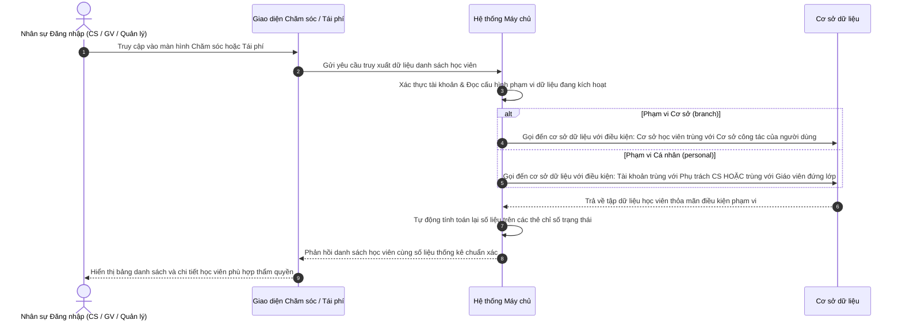

# US-CARE-01-04: Phân quyền theo Phạm vi Dữ liệu Cơ sở và Cá nhân trong Chăm sóc Học viên

> **Tham chiếu:** `BF-CARE-01` · `SR-CSM-002` · `US-SYS-04-06` · Giao diện Mẫu §4.3 (Thẻ Chi tiết Lớp học & Cụm Nhân sự Phụ trách)  
> **Đường dẫn màn hình & Trạng thái liên quan:**  
> - `/app/student_care` $\rightarrow$ Màn hình Chi tiết Chăm sóc Học viên  
> - `/app/renewal` $\rightarrow$ Màn hình Quản lý Tái phí Học viên  
> - `/app/system_config` $\rightarrow$ Màn hình Cấu hình Phạm vi Dữ liệu Hệ thống  
> - **Tài liệu trực tuyến:** [Confluence: rwBPCQ](https://rinoeduai.atlassian.net/wiki/x/rwBPCQ)  
> - **Phiên bản hệ thống:** `v2026.09.17.01.station`

---

## 1. NHẬT KÝ THAY ĐỔI & BỐI CẢNH (CHANGELOG & CONTEXT)

### Lịch sử cập nhật tài liệu (Changelog)

| Ngày cập nhật | Nội dung cập nhật | Lý do cập nhật |
|---|---|---|
| 17/09/2026 | Khởi tạo tài liệu đặc tả chi tiết Tiêu chí nghiệm thu và Các trường hợp góc cạnh cho cơ chế phân quyền theo phạm vi | Đồng bộ với tài liệu phân tích nghiệp vụ trên hệ thống Confluence |
| 17/09/2026 | Chuẩn hóa ma trận đối chiếu 3 trường dữ liệu (Cơ sở, Phụ trách CS, Phụ trách GV) và điều kiện lọc ngầm tại máy chủ | Bảo đảm tính nhất quán giữa dữ liệu tác nghiệp thực tế và kiểm soát truy cập |

### Bối cảnh & Vấn đề nghiệp vụ (Context & Problem)
* **Bối cảnh:** Thẻ thông tin lớp học của học viên tại phân hệ Chăm sóc hiển thị đồng thời 3 thông tin nhân sự và địa bàn gồm: **Cơ sở** (nơi mở lớp/gói học), **Phụ trách CS** (chuyên viên trực tiếp theo dõi chăm sóc) và **Phụ trách Giáo viên** (giáo viên chủ nhiệm và trợ giảng đứng lớp).
* **Vấn đề hiện tại:** Cần làm rõ quy tắc sàng lọc ngầm khi người dùng lựa chọn một trong hai cấp độ phạm vi dữ liệu: **Cá nhân** (`personal`) hoặc **Cơ sở** (`branch`), để đội ngũ phát triển và kiểm thử có căn cứ kiểm chứng chính xác dữ liệu được phép tải lên giao diện.
* **Mục tiêu & Giá trị mang lại:** Thiết lập bộ Tiêu chí nghiệm thu chuẩn xác và liệt kê đầy đủ 8 trường hợp góc cạnh phát sinh trong thực tế vận hành (học viên học 2 môn, học 2 cơ sở, chuyển lớp, đổi giáo viên, điều chuyển CS phụ trách).

---

## 2. LUỒNG XỬ LÝ CHÍNH (MAIN FLOW - HAPPY PATH)

---

## 3. GIAO DIỆN & CẤU TRÚC ĐỐI CHIẾU PHẠM VI (UI & MATCHING MATRIX)

### 3.1. Bảng Tiêu chí Khớp Dữ liệu (Matching Rules) theo Phạm vi

| Lựa chọn Phạm vi | Điều kiện Bản ghi thuộc Tầm nhìn của Người dùng | Các trường dữ liệu dùng để Đối chiếu |
|---|---|---|
| **Cơ sở** *(Branch Scope)* | Bản ghi được truy xuất khi **Cơ sở** của gói học/lớp học trùng khớp với **Cơ sở công tác** của tài khoản đăng nhập (`RinoEdu Nguyễn Tuân`). *Không phụ thuộc vào việc ai đang là CS hay Giáo viên phụ trách.* | • **Cơ sở** *(Bỏ qua Phụ trách CS và Phụ trách Giáo viên)* |
| **Cá nhân** *(Personal Scope)* | Bản ghi được truy xuất khi tài khoản đăng nhập **trùng khớp** với một trong hai vai trò nhân sự được gán trên gói học: 1. Trùng với **Phụ trách CS** (`Trần Thảo Anh 20`) **HOẶC** 2. Nằm trong cụm **Phụ trách Giáo viên** đứng lớp (`Hoàng Thị Mai` hoặc `Hoàng Anh`) | • **Phụ trách CS** • **Phụ trách Giáo viên** *(Được xem xét sau khi đã thỏa mãn cùng cơ sở)* |

### 3.2. Ma trận Đối chiếu Phạm vi khi Truy vấn Dữ liệu

| Tình huống Người dùng Đăng nhập | Thuộc Phạm vi Cơ sở? | Thuộc Phạm vi Cá nhân? |
|---|:---:|:---:|
| **Nhân sự là CS phụ trách** (`Trần Thảo Anh 20`) tại cơ sở Nguyễn Tuân | **CÓ** *(Cùng cơ sở Nguyễn Tuân)* | **CÓ** *(Trùng khớp Phụ trách CS)* |
| **Giáo viên đứng lớp** (`Hoàng Thị Mai`) tại cơ sở Nguyễn Tuân | **CÓ** *(Cùng cơ sở Nguyễn Tuân)* | **CÓ** *(Trùng khớp Phụ trách GV)* |
| **Nhân viên CS khác** thuộc cơ sở Nguyễn Tuân (không phụ trách học viên này) | **CÓ** *(Cùng cơ sở Nguyễn Tuân)* | ❌ **KHÔNG** |
| **Giáo viên khác** thuộc cơ sở Nguyễn Tuân (không dạy lớp này) | **CÓ** *(Cùng cơ sở Nguyễn Tuân)* | ❌ **KHÔNG** |
| **Quản lý / Giám đốc** cơ sở Nguyễn Tuân | **CÓ** *(Cùng cơ sở Nguyễn Tuân)* | ❌ **KHÔNG** *(trừ khi kiêm nhiệm CS/GV)* |
| **Bất kỳ nhân sự nào** thuộc cơ sở khác (Linh Đàm, Cầu Giấy) | ❌ **KHÔNG** | ❌ **KHÔNG** |

---

## 4. KHỐI CHỨC NĂNG CHI TIẾT: ACTION & TIÊU CHÍ NGHIỆM THU (ACTIONS & ACCEPTANCE CRITERIA)

### Khối chức năng 1: Truy cập với Phạm vi "Cơ sở" (Branch Scope)

#### Action 1.1: Quản lý hoặc nhân sự thuộc cơ sở truy cập dữ liệu
* **Luồng kích hoạt:** Người dùng có tài khoản công tác tại cơ sở `RinoEdu Nguyễn Tuân` truy cập hệ thống khi phiên làm việc áp dụng phạm vi Cơ sở.
* **Tiêu chí nghiệm thu:**
  - **AC-1 (Happy Path - Hiển thị toàn bộ học viên thuộc cơ sở):**
    - **Giả sử:** Tài khoản đăng nhập thuộc cơ sở `RinoEdu Nguyễn Tuân` và hệ thống kích hoạt cấu hình phạm vi "Cơ sở".
    - **Khi:** Người dùng truy cập màn hình Chăm sóc học viên (`/app/student_care`) hoặc màn hình Tái phí (`/app/renewal`).
    - **Thì:** Giao diện hiển thị toàn bộ học viên có gói học mở tại cơ sở `RinoEdu Nguyễn Tuân` (bao gồm học viên đang gán cho CS `Trần Thảo Anh 20` và các lớp của giáo viên `Hoàng Thị Mai`, `Hoàng Anh`).
  - **AC-2 (Happy Path - Quyền điều chuyển chuyên viên CS phụ trách):**
    - **Giả sử:** Người dùng có thẩm quyền quản lý cơ sở tại `RinoEdu Nguyễn Tuân`.
    - **Khi:** Người dùng nhấp vào biểu tượng điều chuyển `⇄` cạnh tên `Trần Thảo Anh 20` trên thẻ chi tiết lớp học.
    - **Thì:** Hộp thoại điều chuyển chuyên viên CS hiển thị danh sách tất cả các nhân viên CS đang công tác tại cơ sở Nguyễn Tuân để quản lý lựa chọn phân công lại.
  - **AC-3 (Happy Path - Đồng bộ thẻ thống kê số liệu cơ sở):**
    - **Giả sử:** Phiên làm việc đang ở phạm vi Cơ sở.
    - **Khi:** Người dùng quan sát các thẻ chỉ số trạng thái (học viên đang học, tái phí, bảo lưu, cảnh báo nghiệp vụ).
    - **Thì:** Toàn bộ số lượng đếm trên các thẻ chỉ số phản ánh tổng thể dữ liệu của toàn bộ cơ sở `RinoEdu Nguyễn Tuân`.

### Khối chức năng 2: Truy cập với Phạm vi "Cá nhân" (Personal Scope)

#### Action 2.1: Chuyên viên CS phụ trách truy cập dữ liệu cá nhân
* **Luồng kích hoạt:** Người dùng là chuyên viên CS `Trần Thảo Anh 20` truy cập hệ thống với phạm vi Cá nhân.
* **Tiêu chí nghiệm thu:**
  - **AC-4 (Happy Path - Lọc chính xác học viên do CS phụ trách):**
    - **Giả sử:** Tài khoản đăng nhập là chuyên viên CS `Trần Thảo Anh 20` và hệ thống kích hoạt cấu hình phạm vi "Cá nhân".
    - **Khi:** Người dùng truy cập danh sách học viên chăm sóc hoặc màn hình tái phí.
    - **Thì:** Bảng danh sách chỉ hiển thị các học viên mà tài khoản đang được gán là Phụ trách CS; số liệu trên các thẻ chỉ số tự động co lại đúng bằng số lượng học viên cá nhân được phân công; người dùng xem được đầy đủ số điện thoại và thực hiện các thao tác chăm sóc.

#### Action 2.2: Giáo viên hoặc trợ giảng đứng lớp truy cập dữ liệu cá nhân
* **Luồng kích hoạt:** Người dùng là giáo viên `Hoàng Thị Mai` hoặc trợ giảng `Hoàng Anh` truy cập hệ thống với phạm vi Cá nhân.
* **Tiêu chí nghiệm thu:**
  - **AC-5 (Happy Path - Lọc học viên theo lớp đang giảng dạy):**
    - **Giả sử:** Tài khoản đăng nhập là giáo viên `Hoàng Thị Mai` (hoặc trợ giảng `Hoàng Anh`) phụ trách lớp `LD_TOAN_00032` với phạm vi "Cá nhân".
    - **Khi:** Người dùng truy cập màn hình Chăm sóc học viên hoặc danh sách lớp học.
    - **Thì:** Hệ thống tự động lọc và hiển thị học viên này (do học viên đang học tại lớp mà người dùng đứng lớp); người dùng được xem nhật ký buổi học, ghi nhận xét và điểm danh; trường Phụ trách CS hiển thị ở chế độ chỉ đọc và không có nút điều chuyển `⇄`.

#### Action 2.3: Nhân sự khác trong cơ sở không phụ trách truy cập dữ liệu
* **Luồng kích hoạt:** Nhân viên CS khác hoặc giáo viên dạy lớp khác trong cơ sở Nguyễn Tuân truy cập với phạm vi Cá nhân.
* **Tiêu chí nghiệm thu:**
  - **AC-6 (Negative Path - Chặn truy cập học viên không thuộc quyền phụ trách):**
    - **Giả sử:** Tài khoản đăng nhập là nhân viên CS khác hoặc giáo viên dạy lớp khác tại `RinoEdu Nguyễn Tuân` (không phải CS phụ trách và không dạy lớp của học viên này) với phạm vi "Cá nhân".
    - **Khi:** Người dùng tìm kiếm tên học viên trên thanh tìm kiếm hoặc cố tình truy cập bằng đường dẫn liên kết hồ sơ học viên.
    - **Thì:** Hệ thống không hiển thị bản ghi của học viên này trong danh sách kết quả; máy chủ tự động chặn và phản hồi thông báo không có quyền truy cập dữ liệu.

### Khối chức năng 3: Kiểm soát Biên giới Liên cơ sở (Cross-Branch Isolation)

#### Action 3.1: Người dùng cơ sở khác truy cập dữ liệu
* **Luồng kích hoạt:** Tài khoản thuộc cơ sở khác (Linh Đàm, Cầu Giấy) cố gắng truy cập dữ liệu học viên của cơ sở Nguyễn Tuân.
* **Tiêu chí nghiệm thu:**
  - **AC-7 (Negative Path - Cách ly dữ liệu giữa các cơ sở):**
    - **Giả sử:** Tài khoản đăng nhập thuộc cơ sở `RinoEdu Linh Đàm`.
    - **Khi:** Người dùng tìm kiếm học viên hoặc mở đường dẫn hồ sơ học viên thuộc cơ sở `RinoEdu Nguyễn Tuân`.
    - **Thì:** Hệ thống máy chủ chặn truy vấn từ cơ sở dữ liệu và phản hồi thông báo không tìm thấy bản ghi hoặc không có quyền truy cập cơ sở này.

---

## 5. CÁC TRƯỜNG HỢP GÓC CẠNH (CORNER CASES)

- **Trường hợp 1 (Học viên học đồng thời 2 môn tại cùng 1 cơ sở):** Học viên có gói Toán do CS A phụ trách (GV Hoàng Thị Mai dạy) và gói Tiếng Anh do CS B phụ trách (GV Sarah Smith dạy) tại cơ sở Nguyễn Tuân. Khi CS A đăng nhập phạm vi Cá nhân, chỉ xem và tác nghiệp trên gói Toán; khi CS B đăng nhập, chỉ xem và tác nghiệp trên gói Tiếng Anh; Quản lý cơ sở với phạm vi Cơ sở sẽ xem được đầy đủ cả 2 gói học.
- **Trường hợp 2 (Học viên học tại 2 cơ sở khác nhau trong chuỗi):** Học viên học môn Toán tại cơ sở Nguyễn Tuân và học môn Tiếng Anh tại cơ sở Linh Đàm. Nhân sự cơ sở Nguyễn Tuân (dù phạm vi Cá nhân hay Cơ sở) chỉ nhìn thấy gói học môn Toán mở tại Nguyễn Tuân; không thể xem hay tìm kiếm thấy gói Tiếng Anh tại Linh Đàm.
- **Trường hợp 3 (Học viên chờ khai giảng chưa xếp giáo viên chính thức):** Gói học đã được gán Phụ trách CS `Trần Thảo Anh 20` nhưng trường Phụ trách GV đang ở trạng thái `Chờ phân công GV`. Khi áp dụng phạm vi Cá nhân, chuyên viên CS vẫn theo dõi và chăm sóc bình thường; chưa có giáo viên nào tiếp cận được hồ sơ này cho đến khi học viên được xếp lớp chính thức.
- **Trường hợp 4 (Học viên chuyển lớp học trong cùng cơ sở):** Khi học vụ thực hiện chuyển lớp cho học viên từ lớp cũ sang lớp mới, trường Phụ trách CS giữ nguyên không đổi (`Trần Thảo Anh 20`); trường Phụ trách GV tự động cập nhật sang giáo viên của lớp mới. Giáo viên lớp cũ lập tức mất quyền truy cập cá nhân đối với học viên này; giáo viên lớp mới nhận quyền truy cập; lịch sử nhận xét của giáo viên cũ được bảo toàn bất biến.
- **Trường hợp 5 (Điều chuyển Chuyên viên CS phụ trách bằng nút `⇄`):** Quản lý cơ sở bấm nút `⇄` để chuyển giao học viên từ CS `Trần Thảo Anh 20` sang CS mới. Ngay sau khi bấm xác nhận lưu điều chuyển, tài khoản CS cũ lập tức mất quyền xem học viên trong phạm vi Cá nhân; tài khoản CS mới ngay lập tức nhìn thấy học viên trong danh sách chăm sóc cá nhân của mình.
- **Trường hợp 6 (Nhân sự kiêm nhiệm nhiều vai trò - Vừa CS vừa Giáo viên):** Nhân sự vừa được phân công làm CS cho một số học viên, vừa đứng lớp giảng dạy một số lớp học. Khi nhân sự này chọn phạm vi Cá nhân, hệ thống tự động gộp tập dữ liệu bao gồm: Toàn bộ học viên do mình làm CS phụ trách VÀ toàn bộ học viên thuộc các lớp mà mình đang đứng lớp giảng dạy.
- **Trường hợp 7 (Giáo viên dạy thay tạm thời một vài buổi):** Khi lớp học có giáo viên dạy thay tạm thời trong 1 - 2 ca học đơn lẻ, trường Phụ trách Giáo viên trên gói học vẫn giữ nguyên là giáo viên chủ nhiệm chính thức; giáo viên dạy thay chỉ có quyền điểm danh ca học đó và không được mở rộng quyền truy cập vào danh mục chăm sóc cá nhân của lớp.
- **Trường hợp 8 (Nhân sự được phân công làm việc tại nhiều cơ sở):** Nhân sự được giao quyền tại cả 2 cơ sở Nguyễn Tuân và Linh Đàm. Trên thanh tiêu đề giao diện có ô chọn cơ sở làm việc hiện tại: Khi chọn Nguyễn Tuân, phạm vi Cơ sở áp dụng cho dữ liệu của Nguyễn Tuân; khi đổi sang Linh Đàm, hệ thống tự động tải lại dữ liệu thuộc phạm vi cơ sở Linh Đàm.

---

## 6. LUỒNG NGOẠI LỆ & XỬ LÝ SỰ CỐ (EXCEPTION FLOW)

- **Ngoại lệ 1 (Mất kết nối máy chủ khi truy vấn dữ liệu phạm vi):** Khi xảy ra gián đoạn mạng trong lúc tải danh sách học viên, giao diện hiển thị thông báo lỗi kèm nút bấm thử lại để người dùng tải lại dữ liệu.
- **Ngoại lệ 2 (Phiên đăng nhập hết hạn khi đang tác nghiệp):** Khi phiên đăng nhập hết hạn, hệ thống yêu cầu xác thực lại tài khoản trước khi tiếp tục truy xuất dữ liệu theo phạm vi.
- **Ngoại lệ 3 (Tài khoản chưa được phân bổ cơ sở công tác):** Nếu tài khoản người dùng chưa được cấu hình cơ sở công tác hợp lệ, hệ thống mặc định áp dụng phạm vi Cá nhân và chỉ hiển thị các bản ghi được gán trực tiếp.

---

## 7. QUY TẮC KIỂM SOÁT & RÀNG BUỘC DỮ LIỆU (VALIDATION RULES)

- **Ràng buộc 1 (Lọc ngầm tại máy chủ):** Toàn bộ việc sàng lọc theo phạm vi dữ liệu (Cơ sở hoặc Cá nhân) phải được thực hiện trực tiếp tại tầng máy chủ khi gửi lệnh gọi đến cơ sở dữ liệu học viên, không tải danh sách toàn bộ xuống máy khách rồi mới lọc.
- **Ràng buộc 2 (Bảo toàn Chuyên viên CS khi đổi lớp):** Biến động chuyển lớp chỉ thay đổi Phụ trách Giáo viên; Phụ trách CS được giữ nguyên để bảo đảm tính liên tục trong chăm sóc phụ huynh.
- **Ràng buộc 3 (Thống nhất thẻ chỉ số và xuất dữ liệu):** Các thẻ đếm trạng thái và tệp xuất dữ liệu bảng tính bắt buộc phải tuân thủ nghiêm ngặt theo đúng phạm vi dữ liệu đang kích hoạt của phiên làm việc.
