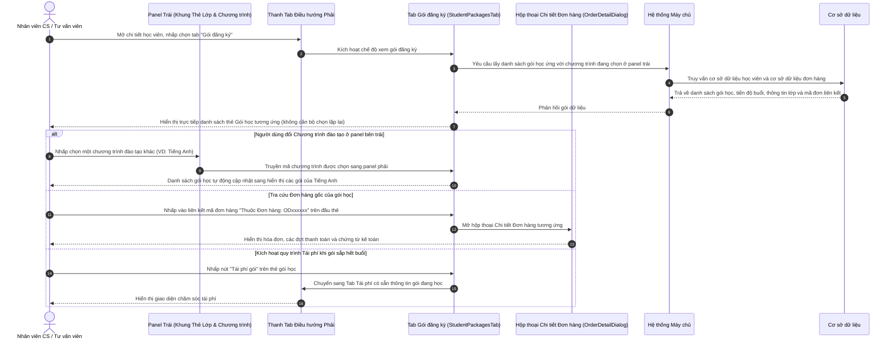

# US-CARE-01-05: Chi tiết chăm sóc: Tab Gói đăng ký học viên

> **Nghiệp vụ:** Chăm sóc học viên & Chăm sóc Tái phí  
> **Vị trí hiển thị:** Màn hình Chi tiết chăm sóc học viên (mở từ `/app/renewal` hoặc `/app/student_operations_alert`) -> Cột phải giao diện, Thanh điều hướng chế độ chăm sóc (`StudentCareFormCard`) -> Tab thứ 4: **Gói đăng ký** (`StudentPackagesTab`).  
> **Phiên bản hệ thống:** `v2026.09.18.03.station`  
> **Mối quan hệ dữ liệu:** Mỗi Gói đăng ký đại diện cho một sản phẩm/khóa học mà học viên đã mua và liên kết trực tiếp tới một Đơn hàng gốc cụ thể trong hệ thống. Dữ liệu gói học hiển thị động và đồng bộ theo Chương trình đào tạo đang chọn ở panel bên trái.  

---

## 1. BỐI CẢNH & PHẠM VI (CONTEXT & SCOPE)

### 1.1. Bối cảnh & Mục tiêu nghiệp vụ (Context & Objectives)
* **Vấn đề trước đây:** Trong màn hình Chi tiết chăm sóc học viên, hệ thống đã cung cấp tab *Chăm sóc* (ghi nhận tương tác định kỳ), tab *Tái phí* (theo dõi chỉ số tái ký) và tab *Đơn hàng* (tra cứu hóa đơn thương mại, đợt thu tiền, phiếu thu). Tuy nhiên, tab *Đơn hàng* chỉ phản ánh góc nhìn kế toán và giao dịch tài chính. Nhân viên chăm sóc (`PERSONA-CSM`) và chuyên viên tư vấn (`PERSONA-SALE`) khi trao đổi tiến độ học tập với phụ huynh thường gặp khó khăn vì không có một không gian hiển thị tập trung danh sách **Gói đăng ký học viên (Enrolled Course Packages)**. Người dùng không thể nắm bắt nhanh: học viên đã mua những gói nào, mỗi gói đang học được bao nhiêu buổi, còn lại bao nhiêu buổi, đang ghép vào lớp nào, giáo viên nào phụ trách và quan trọng nhất là **gói học đó thuộc Đơn hàng nào** để đối chiếu khi phụ huynh thắc mắc về học phí và chính sách ưu đãi.
* **Mục tiêu:** Bổ sung Tab **Gói đăng ký** ngay bên cạnh tab Đơn hàng trên thanh điều hướng. Do người dùng đã chọn Chương trình đào tạo ở panel bên trái (khung thẻ lớp học & chương trình), nên tại Tab Gói đăng ký ở panel bên phải không cần lặp lại cụm nút chọn chương trình. Thay vào đó, panel bên phải tập trung toàn bộ không gian để **hiển thị trực tiếp danh sách các gói học ứng với chương trình đang chọn ở panel bên trái** (ví dụ: Tiếng Anh, Toán tư duy, Lịch sử gói cũ). Khi người dùng đổi chương trình đang chọn ở panel trái, danh sách gói học tương ứng lập tức được chuyển đổi đồng bộ. Mỗi thẻ gói hiển thị trực quan tiến độ số buổi, thông tin lớp học, giáo viên và **dòng liên kết định danh về Đơn hàng gốc** trên phần đầu thẻ.
* **Nguyên tắc bảo toàn nghiệp vụ:**
  - Hệ thống tại giao diện chăm sóc chỉ đóng vai trò tra cứu, hiển thị trạng thái và chuyển hướng thao tác. Toàn bộ nghiệp vụ trừ buổi, xếp lớp và tính toán dòng tiền đều do hệ thống máy chủ và cơ sở dữ liệu dùng chung xử lý.
  - **Không gắn trạng thái thanh toán vào Gói đăng ký:** Do việc thanh toán được quản lý theo Đơn hàng (một đơn hàng có thể có nhiều đợt thanh toán cho nhiều sản phẩm), nên trên thẻ Gói đăng ký tuyệt đối không hiển thị trạng thái thanh toán riêng để tránh nhầm lẫn nghiệp vụ. Mọi thông tin dòng tiền được tra cứu qua Đơn hàng gốc liên kết.
  - **Không trùng lặp nút thao tác đơn hàng:** Đã có dòng liên kết đơn hàng ở đầu thẻ gói, chân thẻ không đặt thêm nút bấm trùng lặp.
  - **Loại bỏ bộ chọn chương trình trùng lặp ở panel phải:** Người dùng đã có cụm chuyển đổi chương trình đào tạo ở panel bên trái, panel bên phải chỉ hiển thị danh sách gói học tương ứng nhằm tối ưu hóa diện tích hiển thị và giảm thao tác thừa.
* **Đối tượng sử dụng (Persona):**
  - Chuyên viên chăm sóc học viên (`PERSONA-CSM`).
  - Chuyên viên tư vấn và tuyển sinh (`PERSONA-SALE`).
  - Quản lý cơ sở và Trưởng bộ phận vận hành (`PERSONA-BRANCH-MANAGER`).

### 1.2. Phạm vi yêu cầu chức năng (Feature Scope)

| Mã yêu cầu | Hạng mục | Mức độ ưu tiên | Mô tả chi tiết |
|---|---|---|---|
| REQ-01 | Tab điều hướng Gói đăng ký | Bắt buộc (Must) | Bổ sung nút tab thứ 4 `Gói đăng ký` vào thanh điều hướng trên cùng, kèm huy hiệu hiển thị số lượng gói đang có hiệu lực |
| REQ-02 | Hiển thị danh sách gói theo chương trình chọn ở panel trái | Bắt buộc (Must) | Tab Gói đăng ký ở panel phải trực tiếp hiển thị danh sách gói học tương ứng với chương trình được chọn ở panel trái, loại bỏ hoàn toàn bộ chọn chương trình trùng lặp |
| REQ-03 | Liên kết Đơn hàng gốc ở đầu thẻ | Bắt buộc (Must) | Hiển thị mã đơn hàng liên kết ở đầu thẻ kèm nút mở trực tiếp hộp thoại chi tiết đơn hàng để tra cứu hóa đơn và thanh toán |
| REQ-04 | Thanh trực quan tiến độ buổi | Bắt buộc (Must) | Thanh tiến độ hai màu thể hiện rõ: Tổng số buổi, Số buổi đã học, Số buổi còn lại và cảnh báo khi số buổi còn ít (≤ 8 buổi) |
| REQ-05 | Cụm thông tin lớp & giáo viên | Bắt buộc (Must) | Hiển thị mã lớp, tên lớp, lịch học trong tuần, giáo viên chính, trợ giảng và cơ sở đào tạo của gói học |
| REQ-06 | Thao tác nghiệp vụ tinh gọn | Bắt buộc (Must) | Nút Chi tiết học tập (đồng bộ sang panel nhật ký học tập), Nút Tái phí gói (khi sắp hết buổi) và Nút Tạo đơn bảo lưu |

---

## 2. LUỒNG NGHIỆP VỤ (USER FLOW)

---

## 3. GIAO DIỆN, PHÂN QUYỀN & RÀNG BUỘC (UI, PERMISSION & VALIDATION RULES)

### 3.1. Cấu trúc Thanh Tab Điều hướng và Thẻ Gói đăng ký

| Thành phần giao diện | Loại điều khiển | Mô tả hiển thị & Trạng thái | Quy tắc vận hành & Thao tác |
|---|---|---|---|
| **Nút Tab `Gói đăng ký`** | Nút chuyển tab điều hướng | Nằm cạnh nút `Đơn hàng` trên thanh công cụ; hiển thị nhãn `Gói đăng ký` kèm huy hiệu số đếm màu xanh ngọc lam (VD: `2`) | Nhấp chuột để chuyển chế độ hiển thị sang Tab Gói đăng ký; làm ẩn khối nhập liệu tương tác nhanh để nhường toàn bộ diện tích cho danh sách gói |
| **Thẻ Gói đăng ký (`StudentPackageCardItem`)** | Khung thẻ chứa thông tin | Khung thẻ bo góc lớn, viền mỏng mềm mại, có bóng đổ nhẹ; nền sáng hoặc tối theo chế độ giao diện | Khung bao bọc trọn vẹn thông tin từng gói học ứng với chương trình đang chọn ở panel trái |
| **Tên Gói học & Mã SKU** | Văn bản tiêu đề thẻ | Chữ in đậm màu sắc nét, cỡ chữ vừa vặn (VD: `[IE_TUTOR] Ielts Intermediate PLUS 5.0_40 buổi`) | Định danh chính xác chương trình và tên gói dịch vụ đào tạo mà học viên đã đăng ký |
| **Huy hiệu Trạng thái Gói** | Huy hiệu trạng thái | Viên nang nhỏ bo tròn: `Đang học` (xanh lục), `Chờ xếp lớp` (vàng hổ phách), `Đang bảo lưu` (xanh dương), `Hết buổi` (xám) | Phản ánh trạng thái vận hành hiện thời của gói học theo chuẩn màu của hệ thống thiết kế |
| **Dòng liên kết Đơn hàng gốc** | Nút bấm liên kết | Dòng thông tin phụ có biểu tượng liên kết: `Thuộc Đơn hàng: OD800436` màu xanh da trời in đậm kèm ngày mua và nhân viên tư vấn | Nhấp chuột để mở ngay hộp thoại Chi tiết Đơn hàng tương ứng để đối chiếu hóa đơn và dòng tiền |
| **Thanh tiến độ buổi học** | Thanh trực quan hai màu | Thanh tiến độ ngang thể hiện tỷ lệ số buổi đã học trên tổng số buổi; nhãn văn bản: `Đã học: X / Y buổi • Còn lại: Z buổi` | Tự động đổi màu cảnh báo (màu cam hoặc đỏ) khi số buổi còn lại nhỏ hơn hoặc bằng 8 buổi |
| **Khối thông tin Lớp học & Giáo viên** | Lưới thông tin 3 cột | Cột 1: Mã lớp và lịch học; Cột 2: Giáo viên chính và trợ giảng; Cột 3: Thời hạn bắt đầu và kết thúc dự kiến | Cung cấp cái nhìn toàn diện về lịch trình và nhân sự phụ trách giảng dạy của gói học |
| **Nút `Chi tiết học tập`** | Nút bấm hành động | Nút viền mỏng có biểu tượng sách vở tại góc trái chân thẻ | Đồng bộ góc nhìn sang tab Học tập ở panel bên trái để xem nhật ký buổi học và tiến độ chi tiết |
| **Nút `Tái phí gói`** | Nút bấm hành động | Nút nền màu xanh lá nhấn, chữ trắng nổi bật (chỉ hiển thị khi số buổi còn lại ≤ 15 buổi) | Kích hoạt chuyển nhanh sang Tab Tái phí để bắt đầu quy trình chăm sóc gia hạn khóa học |

---

## 4. TIÊU CHÍ NGHIỆM THU (ACCEPTANCE CRITERIA)

### AC-01: Chuyển đổi và hiển thị Tab Gói đăng ký theo chương trình đang chọn
* **Giả sử:** Người dùng đang mở màn hình Chi tiết chăm sóc học viên tại đường dẫn `/app/renewal`.
* **Khi:** Người dùng nhấp chuột vào nút tab `Gói đăng ký` trên thanh điều hướng.
* **Thì:**
  1. Tab `Gói đăng ký` chuyển sang trạng thái kích hoạt (nền trắng nổi, chữ in đậm).
  2. Khối biểu mẫu tương tác nhanh phía dưới được ẩn đi để tối ưu diện tích quan sát.
  3. Hệ thống hiển thị trực tiếp danh sách thẻ gói học ứng đúng với chương trình đang chọn ở panel bên trái mà không hiển thị bộ chọn chương trình lặp lại ở panel phải.

### AC-02: Tự động đổi danh sách gói khi thay đổi chương trình đào tạo ở panel trái
* **Giả sử:** Học viên đang theo học đồng thời 2 chương trình (Tiếng Anh và Toán tư duy).
* **Khi:** Người dùng nhấp chọn một chương trình đào tạo khác tại cụm chọn chương trình ở panel bên trái.
* **Thì:**
  1. Panel bên trái cập nhật thông tin lớp học và nhật ký học tập của chương trình mới.
  2. Danh sách gói học tại Tab Gói đăng ký ở panel bên phải lập tức tự động làm mới và hiển thị danh sách gói học của chương trình mới.
  3. Không yêu cầu người dùng phải thực hiện thêm bất kỳ thao tác chọn lọc lại nào ở panel bên phải.

### AC-03: Mở hộp thoại Chi tiết Đơn hàng từ dòng liên kết trên thẻ gói
* **Giả sử:** Thẻ gói học đang hiển thị liên kết Đơn hàng gốc với mã đơn hợp lệ (VD: `OD800436`).
* **Khi:** Người dùng nhấp vào dòng liên kết mã đơn hàng `Thuộc Đơn hàng: OD800436`.
* **Thì:**
  1. Hệ thống lập tức mở hộp thoại Chi tiết Đơn hàng (`OrderDetailDialog`) đè lên màn hình hiện tại.
  2. Toàn bộ thông tin hóa đơn, các đợt thanh toán, phương thức thanh toán và chuyên viên tư vấn của đơn hàng đó được hiển thị đầy đủ.
  3. Khi người dùng đóng hộp thoại, giao diện vẫn giữ nguyên trạng thái đang xem tại Tab Gói đăng ký.

### AC-04: Cảnh báo số buổi còn lại và kích hoạt Tái phí
* **Giả sử:** Gói học của chương trình đang chọn có số buổi còn lại nhỏ hơn hoặc bằng 8 buổi.
* **Khi:** Người dùng quan sát thẻ gói học tại Tab Gói đăng ký.
* **Thì:**
  1. Thanh tiến độ buổi học và số buổi còn lại tự động hiển thị với màu cam hoặc đỏ cảnh báo kèm biểu tượng cảnh báo.
  2. Nút hành động `Tái phí gói` hiển thị nổi bật trên chân thẻ gói.
  3. Khi người dùng bấm nút này, hệ thống chuyển sang Tab Tái phí để bắt đầu quy trình chăm sóc gia hạn khóa học.

---

## 5. CÁC TRƯỜNG HỢP GÓC CẠNH (CORNER CASES)

* **Trường hợp 1 (Học viên chỉ theo học duy nhất 1 chương trình):** Nếu học viên chỉ có 1 chương trình đào tạo đang hoạt động, thanh chọn chương trình vẫn hiển thị rõ ràng chương trình đó kèm tùy chọn xem gói cũ nếu có, thẻ gói học nạp ngay gói chính mà không yêu cầu thêm thao tác bấm chọn.
* **Trường hợp 2 (Gói học không thuộc đơn hàng nào do chuyển đổi hệ thống cũ):** Đối với các gói học được tiếp nhận từ đợt chuyển giao hệ thống cũ hoặc gói học bổng không có mã đơn hàng, hệ thống hiển thị dòng chữ *"Gói chuyển giao"* màu ghi xám, không gắn liên kết nhấp chuột và không gây lỗi giao diện.
* **Trường hợp 3 (Gói học chưa được ghép vào lớp):** Khi gói học đã đăng ký thành công nhưng học viên đang ở trạng thái Chờ ghép lớp, khu vực thông tin lớp hiển thị nhãn *"Chưa ghép lớp"* với màu vàng nhạt, không hiển thị lịch học và giáo viên phụ trách.
* **Trường hợp 4 (Gói học đang trong thời gian bảo lưu):** Khi học viên có đơn bảo lưu đang có hiệu lực, huy hiệu trạng thái gói hiển thị `Đang bảo lưu`, thanh tiến độ tạm đóng băng số buổi và hiển thị ngày dự kiến quay lại học tập.
* **Trường hợp 5 (Gói học đã kết thúc toàn bộ số buổi):** Khi người dùng chọn xem mục `Lịch sử gói cũ`, thẻ gói hiển thị trạng thái `Hết buổi`, thanh tiến độ hiển thị 100% đã học với màu xám nhã nhặn, ẩn nút tái phí gói.
* **Trường hợp 6 (Gói học đã hết hạn thời gian nhưng vẫn còn buổi học):** Nếu thời hạn sử dụng gói đã qua nhưng số buổi còn lại lớn hơn 0, hệ thống hiển thị cảnh báo *"Quá hạn thời gian sử dụng"* để nhân viên chăm sóc kịp thời tư vấn gia hạn thời gian theo chính sách của trung tâm.
