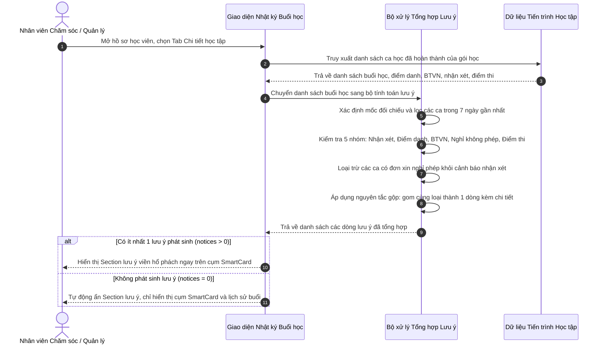

# US-CARE-01-06: Chi tiết học tập - Section thông tin lưu ý & Nguyên tắc gộp cảnh báo

> **Nghiệp vụ:** Chăm sóc học viên & Duy trì học viên (Station Care & Renewal)  
> **Vị trí hiển thị:** Màn hình Chi tiết chăm sóc học viên (`/app/student_operations_alert`) -> Khung nội dung chi tiết -> Thẻ "Chi tiết học tập" -> Khối "Nhật ký Buổi học" -> Section Thông tin lưu ý phát sinh (Hiển thị ngay phía trên cụm thẻ chỉ số thông minh).  
> **Tham chiếu nghiệp vụ:** `BF-CARE-01` (Kiến trúc vận hành Chăm sóc học viên), `AC-CARE-SESSION-TIMELINE`.

---

## 1. BỐI CẢNH & PHẠM VI (CONTEXT & SCOPE)

### 1.1. Bối cảnh & Mục tiêu nghiệp vụ (Context & Objectives)
* **Vấn đề thực tế:** Trong quá trình học tập của học viên, các biến cố phát sinh hàng ngày (như giáo viên quên nhập nhận xét, quên chốt chuyên cần, học viên chưa nộp bài tập về nhà, vắng học không phép hoặc điểm kiểm tra định kỳ không đạt) thường phân tán rải rác ở từng ca học đơn lẻ. Nhân viên chăm sóc học viên và quản lý cơ sở phải cuộn qua từng buổi học trong lịch sử để phát hiện vấn đề, dẫn đến nguy cơ bỏ sót các tình huống cần can thiệp khẩn cấp.
* **Mục tiêu giải pháp:** Xây dựng **Section thông tin lưu ý phát sinh** đặt ở vị trí trọng tâm ngay trên đầu khối Nhật ký buổi học. Hệ thống tự động quét, tổng hợp và phân loại toàn bộ sự kiện cần chú ý trong vòng 7 ngày gần nhất, áp dụng **nguyên tắc gộp cùng loại** để cô đọng thông tin thành các dòng khuyến nghị hành động súc tích, trực quan và dễ tiếp nhận.
* **Đối tượng sử dụng (Persona):**
  - Chuyên viên chăm sóc học viên (`PERSONA-CSM`): Nắm bắt nhanh các điểm nóng cần trao đổi với phụ huynh hoặc đôn đốc giáo viên.
  - Quản lý cơ sở (`PERSONA-BRANCH-MANAGER`): Giám sát chất lượng vận hành lớp học và tính kịp thời của đội ngũ giáo viên.
  - Giáo viên chủ nhiệm & Giáo viên bộ môn (`PERSONA-TEACHER`): Rà soát các nghĩa vụ học thuật còn tồn đọng (nhận xét, điểm danh, kế hoạch phụ đạo).
* **Chỉ số đo lường hiệu quả (KPI Target):**
  - Thời gian phát hiện vấn đề học tập phát sinh: Giảm từ 3 phút xuống dưới 5 giây ngay khi mở hồ sơ học viên.
  - Tỷ lệ tồn đọng buổi học chưa nhận xét quá 48 giờ: Giảm trên 75%.
  - Tỷ lệ học viên nợ bài tập về nhà được đôn đốc nộp bù kịp thời: Đạt trên 85%.

### 1.2. Phạm vi yêu cầu chức năng (Feature Scope)
| Mã yêu cầu | Hạng mục | Mức độ ưu tiên | Mô tả chi tiết |
|---|---|---|---|
| REQ-NOTE-01 | Cửa sổ quét 7 ngày gần nhất | Bắt buộc (Must) | Chỉ quét và hiển thị các sự kiện phát sinh trong phạm vi 7 ngày gần nhất so với mốc đối chiếu tiến trình học tập |
| REQ-NOTE-02 | Bảng danh mục 5 nhóm lưu ý | Bắt buộc (Must) | Phân loại chuẩn hóa thành 5 nhóm: Chưa nhận xét, Chưa điểm danh, Chưa làm bài tập, Nghỉ không phép, Học lực cần hỗ trợ |
| REQ-NOTE-03 | Cơ chế gộp cùng loại | Bắt buộc (Must) | Tự động gom nhiều buổi học cùng loại thành 1 dòng duy nhất, liệt kê danh sách buổi cụ thể trong ngoặc đơn |
| REQ-NOTE-04 | Loại trừ nghỉ có phép | Bắt buộc (Must) | Tuyệt đối không tạo cảnh báo chưa nhận xét đối với các ca học mà học viên đã có đơn xin nghỉ phép hợp lệ |
| REQ-NOTE-05 | Khuyến nghị hành động đi kèm | Bắt buộc (Must) | Mỗi dòng lưu ý gồm 2 phần rõ rệt: mô tả vấn đề in đậm và hành động hướng dẫn xử lý tiếp theo |
| REQ-NOTE-06 | Tự động ẩn khi không có lưu ý | Bắt buộc (Must) | Tự động ẩn hoàn toàn khung section khi không có bất kỳ sự kiện lưu ý nào phát sinh trong 7 ngày gần nhất |

---

### 1.3. Bảng danh sách lưu ý chi tiết (Notice Catalog Table)

Dưới đây là bảng đặc tả toàn bộ 5 loại lưu ý phát sinh được hệ thống nhận diện và hiển thị trong Section thông tin lưu ý:

| Mã loại lưu ý | Tên loại lưu ý | Điều kiện dữ liệu kích hoạt | Mẫu câu thông báo khi phát sinh 1 buổi | Mẫu câu thông báo khi phát sinh từ 2 buổi trở lên | Hành động khuyến nghị đi kèm | Ý nghĩa nghiệp vụ & Mục tiêu |
|---|---|---|---|---|---|---|
| `uncommented` | **Chưa có nhận xét** | Ca học đã hoàn thành trong vòng 7 ngày gần nhất, nội dung nhận xét để trống hoặc chỉ có khoảng trắng, **đồng thời học viên không có đơn xin nghỉ phép** | `Buổi [X] ([dd/mm]) chưa có nhận xét.` | `[N] buổi chưa có nhận xét (Buổi [X] ([dd/mm]), Buổi [Y] ([dd/mm])).` | `Đôn đốc GV hoàn thiện.` | Nhắc nhở nhân sự chăm sóc liên hệ giáo viên hoàn tất đánh giá chất lượng buổi học, đảm bảo tiến độ báo cáo cho phụ huynh. |
| `unmarked` | **Chưa điểm danh** | Ca học đã hoàn thành trong vòng 7 ngày gần nhất nhưng trạng thái chuyên cần chưa được chốt (`unmarked` hoặc để trống) | `Buổi [X] ([dd/mm]) chưa chốt điểm danh.` | `[N] buổi chưa chốt điểm danh (Buổi [X] ([dd/mm]), Buổi [Y] ([dd/mm])).` | `Xác minh GV cập nhật chuyên cần.` | Báo hiệu ca học đã diễn ra nhưng giáo viên/trợ giảng chưa chốt sổ điểm danh, cần xác minh để chuẩn hóa dữ liệu chuyên cần. |
| `homework` | **Chưa làm bài tập** | Ca học đã diễn ra trong vòng 7 ngày gần nhất có giao bài tập nhưng học viên chưa nộp bài | `Chưa hoàn thành BTVN Buổi [X] ([Mã BT]).` *(Ví dụ: `Chưa hoàn thành BTVN Buổi 18 (BT-01).`)* | `Chưa hoàn thành [N] BTVN gần nhất (Buổi [X] ([Mã BT]), Buổi [Y] ([Mã BT])).` | `Đôn đốc PH hỗ trợ con nộp bù.` | Hỗ trợ nhân viên chăm sóc kịp thời thông tin cho gia đình để phụ huynh phối hợp đôn đốc học sinh làm và nộp bù bài tập. |
| `absent` | **Nghỉ không phép** | Ca học trong vòng 7 ngày gần nhất học viên vắng mặt nhưng **không có đơn xin nghỉ phép hợp lệ** | `Vắng không phép Buổi [X] ([dd/mm]) chưa có lịch học bù.` | `Nghỉ không phép liên tiếp [N] buổi (Buổi [X] ([dd/mm]), Buổi [Y] ([dd/mm])) chưa có lịch học bù.` | • 1 buổi: `Liên hệ PH xác minh lý do và xếp lịch học bù.` • $\ge 2$ buổi: `Liên hệ PH xác minh lý do và xếp lịch học bù sớm.` | Cảnh báo nguy cơ học viên bỏ học hoặc hổng kiến thức, đôn đốc nhân viên liên hệ ngay với phụ huynh để nắm tình hình và xếp lịch học bù. |
| `special_care` | **Học lực cần hỗ trợ** | Ca học loại kiểm tra định kỳ trong vòng 7 ngày gần nhất có điểm số dưới chuẩn đạt ($\le 6.0$ điểm thang 10) | `Điểm kiểm tra Buổi [X] ([dd/mm]: [Điểm]/10) dưới chuẩn 6.0.` | `[N] bài kiểm tra gần nhất dưới chuẩn 6.0 (Buổi [X] ([dd/mm]: [Điểm]/10), Buổi [Y] ([dd/mm]: [Điểm]/10)).` | `GV lên kế hoạch phụ đạo và củng cố kiến thức.` | Nhận diện học sinh bị sa sút hoặc chưa nắm vững kiến thức trọng tâm, yêu cầu giáo viên lập kế hoạch phụ đạo tăng cường. |

---

### 1.4. Quy tắc nghiệp vụ & Nguyên tắc gộp cảnh báo (Business Rules & Grouping Principles)

Hệ thống tuân thủ nghiêm ngặt 5 quy tắc nghiệp vụ cốt lõi sau đây khi tính toán và kết xuất các dòng lưu ý:

1. **[RULE-NOTE-01] Mốc thời gian đối chiếu (Anchor Date) & Cửa sổ 7 ngày gần nhất:**
   - Mốc thời gian đối chiếu được xác định tự động: neo vào thời điểm kết thúc của ngày kế tiếp sau ca học đã hoàn thành gần nhất của học viên (vào lúc 23:59:59).
   - Hệ thống chỉ quét các sự kiện phát sinh có khoảng cách thời gian nằm trong phạm vi từ **0 đến 7 ngày** tính từ mốc đối chiếu ngược về trước. Các sự kiện cũ hơn 7 ngày sẽ tự động hết hạn hiển thị trong section này để tránh gây quá tải thông tin.
   - Chỉ áp dụng đối với các ca học chính khóa hoặc ca kiểm tra định kỳ đã diễn ra.

2. **[RULE-NOTE-02] Cùng loại gom thành một dòng duy nhất (Grouping by Notice Category):**
   - Trong cùng cửa sổ 7 ngày, nếu phát sinh nhiều sự kiện thuộc cùng một loại (ví dụ học sinh có 2 buổi chưa làm bài tập về nhà, hoặc giáo viên chưa nhập nhận xét cho 3 buổi), hệ thống **tuyệt đối không hiển thị tách thành nhiều dòng rời rạc**.
   - Toàn bộ các buổi cùng loại được gom lại thành **duy nhất 1 dòng cảnh báo đại diện**.

3. **[RULE-NOTE-03] Phân biệt câu đơn (1 sự kiện) và câu tổng hợp (từ 2 sự kiện trở lên):**
   - **Khi chỉ có 1 buổi phát sinh:** Câu thông báo chỉ đích danh ca học đó. Ví dụ: `Buổi 18 (22/07) chưa có nhận xét.`
   - **Khi có từ 2 buổi trở lên:** Câu thông báo nêu bật tổng số lượng buổi phát sinh trước, sau đó liệt kê chi tiết các buổi và ngày tháng diễn ra trong dấu ngoặc đơn. Ví dụ: `2 buổi chưa có nhận xét (Buổi 17 (19/07), Buổi 18 (22/07)).`

4. **[RULE-NOTE-04] Ngoại lệ loại trừ đối với học viên có đơn xin nghỉ phép hợp lệ:**
   - Đối với nhóm lưu ý *Chưa có nhận xét* (`uncommented`): Nếu ca học được ghi nhận học viên nghỉ có phép (có đơn xin nghỉ phép đã duyệt, chuyên cần là nghỉ phép, hoặc có lý do nghỉ được ghi nhận), giáo viên không phát sinh nghĩa vụ đánh giá buổi học đó.
   - Do đó, hệ thống **tự động loại trừ hoàn toàn các buổi nghỉ có phép** ra khỏi danh sách tính toán cảnh báo chưa nhận xét, không đôn đốc giáo viên nhận xét cho học viên vắng mặt hợp lệ.

5. **[RULE-NOTE-05] Cấu trúc nội dung 2 vế (Vấn đề phát sinh + Hành động khuyến nghị):**
   - Mỗi dòng lưu ý luôn kết hợp chặt chẽ giữa:
     - **Vế 1 (Vấn đề - Issue):** Nêu rõ tình trạng tồn đọng và đối tượng ca học cụ thể, được định dạng chữ in đậm.
     - **Vế 2 (Hành động - Action):** Câu khuyến nghị xử lý ngắn gọn, dứt khoát dành cho nhân sự chăm sóc hoặc giáo viên, được định dạng chữ thường.
   - Dòng văn bản hoàn chỉnh giúp người dùng chỉ cần lướt mắt qua là hiểu ngay cần phải làm gì mà không cần mở xem sâu từng buổi.

---

## 2. LUỒNG NGHIỆP VỤ (USER FLOW)

---

## 3. GIAO DIỆN, PHÂN QUYỀN & RÀNG BUỘC (UI, PERMISSION & VALIDATION RULES)

### 3.1. Cấu trúc Section Thông tin lưu ý (Bảng mô tả thành phần trực quan)

| Thành phần giao diện | Loại thành phần | Mô tả hiển thị & Màu sắc | Quy tắc vận hành & Tương tác |
|---|---|---|---|
| **Khung bao Section lưu ý** | Khung chứa thông tin | Khung hình chữ nhật bo góc nhẹ, viền màu vàng hổ phách nhạt, nền màu vàng dịu nhẹ, đặt ngay trên cụm thẻ chỉ số SmartCards | Tự động xuất hiện khi có ít nhất 1 lưu ý phát sinh trong 7 ngày gần nhất; tự động ẩn hoàn toàn khi không có lưu ý hoặc khi lớp học ở diện ẩn nhật ký |
| **Biểu tượng cảnh báo** | Biểu tượng trực quan | Biểu tượng hình tròn có dấu chấm than (`AlertCircle`) màu cam hổ phách đậm ở đầu mỗi dòng | Giúp người dùng nhận diện ngay đây là các cảnh báo nghiệp vụ cần quan tâm xử lý |
| **Văn bản Vấn đề phát sinh** | Dòng chữ in đậm | Chữ màu nâu đậm, thể hiện số lượng buổi, mã buổi và tên sự kiện tồn đọng (VD: `2 buổi chưa chốt điểm danh (Buổi 17 (19/07), Buổi 18 (22/07)).`) | Trực quan hóa vấn đề trọng tâm; rê chuột vào dòng sẽ hiển thị bảng chữ nổi thể hiện toàn bộ nội dung cảnh báo |
| **Văn bản Hành động khuyến nghị** | Dòng chữ thường | Chữ màu nâu hổ phách thường, nối tiếp ngay sau vế vấn đề (VD: `Xác minh GV cập nhật chuyên cần.`) | Đưa ra chỉ dẫn cụ thể cho nhân viên chăm sóc mà không tạo cảm giác áp lực hay hoang mang |

### 3.2. Ma trận phân quyền nguyên tử (Atomic Permission Matrix)

Hệ thống áp dụng cơ chế phân quyền nguyên tử linh hoạt (Capability Gating), không gắn cố định vai trò:

| Mã quyền nguyên tử | Tên quyền thao tác | Hành vi trên giao diện |
|---|---|---|
| `care.student_detail.view` | Quyền xem chi tiết hồ sơ chăm sóc học viên | Cho phép truy cập vào màn hình chi tiết chăm sóc và xem Section thông tin lưu ý |
| `care.session_diary.view` | Quyền xem nhật ký tiến trình buổi học | Cho phép đọc các dòng lưu ý phát sinh và danh sách buổi học trong quá khứ |
| `care.student_alert.action` | Quyền xử lý và đôn đốc cảnh báo học tập | Cho phép nhân sự thực hiện các tác vụ liên hệ phụ huynh hoặc nhắc nhở giáo viên dựa trên lưu ý |

### 3.3. Ràng buộc kiểm tra dữ liệu (Validation Rules)
* **Không áp dụng (N/A):** Section thông tin lưu ý là khu vực hiển thị trạng thái và khuyến nghị nghiệp vụ thuần túy chỉ đọc (Read-only), không tiếp nhận dữ liệu nhập liệu từ người dùng, do đó không áp dụng các ràng buộc biểu mẫu nhập liệu.

---

## 4. KHỐI CHỨC NĂNG & TIÊU CHÍ NGHIỆM THU (ACTIONS & ACCEPTANCE CRITERIA)

### AC-01: Tiêu chí nghiệm thu Điều kiện kích hoạt và hiển thị Section thông tin lưu ý
* **Giả sử:** Nhân viên chăm sóc học viên mở màn hình Chi tiết chăm sóc học viên và chọn thẻ Chi tiết học tập.
* **Khi:** Hệ thống tải dữ liệu học tập của học viên có ca học diễn ra trong vòng 7 ngày gần nhất.
* **Thì:**
  1. Nếu phát sinh ít nhất 1 sự kiện thuộc 5 nhóm cảnh báo (Chưa nhận xét, Chưa điểm danh, Chưa làm BTVN, Nghỉ không phép, Điểm thi dưới chuẩn): Hệ thống hiển thị khung Section thông tin lưu ý viền hổ phách ngay phía trên cụm thẻ SmartCards.
  2. Mỗi nhóm lưu ý phát sinh được hiển thị thành một hàng riêng biệt, có icon dấu chấm than tròn ở đầu dòng.
  3. Nếu học viên thuộc các diện chưa vào học chính khóa (Học thử, Chờ xếp lớp, Chờ hoàn tất hồ sơ): Hệ thống ẩn hoàn toàn khối Nhật ký buổi học và Section thông tin lưu ý này.

### AC-02: Tiêu chí nghiệm thu Cơ chế gộp và hiển thị nhóm Chưa có nhận xét
* **Giả sử:** Ca học của học viên đã diễn ra trong vòng 7 ngày gần nhất nhưng giáo viên chưa nhập nhận xét.
* **Khi:** Hệ thống kiểm tra điều kiện nghỉ phép của học viên tại ca học đó.
* **Thì:**
  1. **Nếu học viên CÓ đơn xin nghỉ phép hợp lệ:** Hệ thống tuyệt đối KHÔNG tạo cảnh báo chưa nhận xét, không tính ca học này vào danh sách cần đôn đốc giáo viên.
  2. **Nếu học viên KHÔNG có đơn xin nghỉ phép:**
     - Nếu chỉ có 1 buổi chưa nhận xét: Hiển thị dòng chữ: `Buổi [X] ([dd/mm]) chưa có nhận xét. Đôn đốc GV hoàn thiện.`
     - Nếu có từ 2 buổi trở lên chưa nhận xét: Gom lại thành 1 dòng duy nhất dạng: `[N] buổi chưa có nhận xét (Buổi [X] ([dd/mm]), Buổi [Y] ([dd/mm])). Đôn đốc GV hoàn thiện.`

### AC-03: Tiêu chí nghiệm thu Cơ chế gộp và hiển thị nhóm Chưa điểm danh
* **Giả sử:** Ca học của học viên đã diễn ra trong vòng 7 ngày gần nhất nhưng giáo viên hoặc trợ giảng chưa hoàn tất thao tác chốt điểm danh.
* **Khi:** Hệ thống quét trạng thái chuyên cần của các buổi học.
* **Thì:**
  1. Nếu có 1 buổi chưa điểm danh: Hiển thị dòng chữ: `Buổi [X] ([dd/mm]) chưa chốt điểm danh. Xác minh GV cập nhật chuyên cần.`
  2. Nếu có từ 2 buổi trở lên chưa điểm danh: Gom lại thành 1 dòng duy nhất dạng: `[N] buổi chưa chốt điểm danh (Buổi [X] ([dd/mm]), Buổi [Y] ([dd/mm])). Xác minh GV cập nhật chuyên cần.`

### AC-04: Tiêu chí nghiệm thu Cơ chế gộp và hiển thị nhóm Chưa làm bài tập về nhà
* **Giả sử:** Học viên có buổi học được giao bài tập về nhà trong vòng 7 ngày gần nhất nhưng trạng thái nộp bài được ghi nhận là chưa hoàn thành.
* **Khi:** Hệ thống kiểm tra tình trạng nộp bài tập về nhà.
* **Thì:**
  1. Nếu có 1 buổi chưa làm BTVN: Hiển thị dòng chữ: `Chưa hoàn thành BTVN Buổi [X] ([Mã BT]). Đôn đốc PH hỗ trợ con nộp bù.`
  2. Nếu có từ 2 buổi trở lên chưa làm BTVN: Gom lại thành 1 dòng duy nhất dạng: `Chưa hoàn thành [N] BTVN gần nhất (Buổi [X] ([Mã BT]), Buổi [Y] ([Mã BT])). Đôn đốc PH hỗ trợ con nộp bù.`

### AC-05: Tiêu chí nghiệm thu Cơ chế gộp và hiển thị nhóm Nghỉ học không phép (Chuyên cần)
* **Giả sử:** Học viên vắng mặt tại buổi học diễn ra trong 7 ngày gần nhất và không có đơn xin nghỉ phép hợp lệ.
* **Khi:** Hệ thống kiểm tra dữ liệu chuyên cần và đơn từ của học viên.
* **Thì:**
  1. Nếu chỉ vắng không phép 1 buổi: Hiển thị dòng chữ: `Vắng không phép Buổi [X] ([dd/mm]) chưa có lịch học bù. Liên hệ PH xác minh lý do và xếp lịch học bù.`
  2. Nếu vắng không phép từ 2 buổi trở lên: Hiển thị dòng chữ: `Nghỉ không phép liên tiếp [N] buổi (Buổi [X] ([dd/mm]), Buổi [Y] ([dd/mm])) chưa có lịch học bù. Liên hệ PH xác minh lý do và xếp lịch học bù sớm.`

### AC-06: Tiêu chí nghiệm thu Cơ chế gộp và hiển thị nhóm Học lực cần hỗ trợ (Điểm kiểm tra dưới chuẩn)
* **Giả sử:** Học viên tham gia bài kiểm tra định kỳ trong vòng 7 ngày gần nhất và có kết quả điểm số $\le 6.0$ điểm thang 10.
* **Khi:** Hệ thống đối chiếu điểm kiểm tra với ngưỡng chuẩn năng lực.
* **Thì:**
  1. Nếu có 1 bài kiểm tra dưới chuẩn: Hiển thị dòng chữ: `Điểm kiểm tra Buổi [X] ([dd/mm]: [Điểm]/10) dưới chuẩn 6.0. GV lên kế hoạch phụ đạo và củng cố kiến thức.`
  2. Nếu có từ 2 bài kiểm tra trở lên dưới chuẩn: Gom lại thành 1 dòng duy nhất dạng: `[N] bài kiểm tra gần nhất dưới chuẩn 6.0 (Buổi [X] ([dd/mm]: [Điểm]/10), Buổi [Y] ([dd/mm]: [Điểm]/10)). GV lên kế hoạch phụ đạo và củng cố kiến thức.`

### AC-07: Tiêu chí nghiệm thu Ẩn hoàn toàn Section khi không phát sinh lưu ý
* **Giả sử:** Học viên đã hoàn thành đầy đủ các buổi học, điểm danh đủ, nộp đủ bài tập, đã có nhận xét đầy đủ và không có bài kiểm tra dưới chuẩn trong 7 ngày gần nhất.
* **Khi:** Hệ thống tính toán danh sách lưu ý và trả về kết quả rỗng (số lượng = 0).
* **Thì:**
  1. Hệ thống ẩn hoàn toàn Section thông tin lưu ý, không để lại khoảng trống thừa hay khung nền rỗng.
  2. Cụm thẻ SmartCards thống kê được đẩy lên vị trí đầu tiên của khối Nhật ký Buổi học.

---

## 5. CÁC TRƯỜNG HỢP GÓC CẠNH & LUỒNG NGOẠI LỆ (CORNER CASES & EXCEPTION FLOWS)

- **[CASE-01] Học viên vừa vắng mặt vừa có đơn xin nghỉ phép hợp lệ:** Hệ thống ghi nhận trạng thái nghỉ có phép, tuyệt đối không kích hoạt dòng lưu ý *Chưa có nhận xét* và cũng không kích hoạt dòng lưu ý *Vắng không phép*, bảo đảm không đánh giá sai nỗ lực của giáo viên và học sinh.
- **[CASE-02] Buổi học vừa kết thúc chưa chốt điểm danh và đồng thời chưa có nhận xét:** Hệ thống tách bạch thành 2 dòng lưu ý độc lập: 1 dòng thuộc nhóm *Chưa điểm danh* và 1 dòng thuộc nhóm *Chưa có nhận xét* để phân định rõ trách nhiệm của các bên phụ trách.
- **[CASE-03] Ca học phát sinh ngoài cửa sổ 7 ngày gần nhất:** Các buổi học diễn ra cách đây hơn 7 ngày dù chưa có nhận xét hay chưa làm BTVN cũng không được tính vào Section thông tin lưu ý này (nhưng vẫn được cảnh báo cục bộ trên chính thẻ buổi học cũ đó), giúp nhân viên chăm sóc tập trung tối đa vào các biến cố mới phát sinh.
- **[CASE-04] Học viên có 1 buổi vắng không phép và 1 buổi nghỉ có phép:** Chỉ có duy nhất 1 buổi vắng không phép được đưa vào cảnh báo chuyên cần với câu thông báo dạng đơn (`Vắng không phép Buổi X...`), không bị gộp sai thành `Nghỉ không phép liên tiếp 2 buổi`.
- **[CASE-05] Lớp học đang ở trạng thái bảo lưu:** Nếu trước ngày bảo lưu có các buổi học hoàn thành trong vòng 7 ngày gần nhất và phát sinh vấn đề (như thiếu điểm thi hoặc thiếu nhận xét), hệ thống vẫn hiển thị đầy đủ Section thông tin lưu ý ngay dưới biểu ngữ thông báo bảo lưu để nhân sự kịp thời tất toán hồ sơ học thuật.
- **[CASE-06] Học viên chưa từng làm bài tập về nhà nào do mới học buổi đầu tiên:** Nếu ca học đầu tiên chưa đến hạn nộp bài tập hoặc không giao bài tập, hệ thống không tạo cảnh báo chưa làm BTVN.
- **[CASE-07] Mất kết nối mạng khi tải danh sách buổi học:** Hệ thống hiển thị thông báo lỗi nạp dữ liệu cục bộ kèm nút "Tải lại", không làm treo giao diện chi tiết chăm sóc.

---

## 6. KẾT NỐI DỮ LIỆU VÀ YÊU CẦU PHI CHỨC NĂNG (NON-FUNCTIONAL & SERVICE REQUIREMENTS)

### 6.1. Yêu cầu phi chức năng (Non-functional Requirements)
* **Thời gian tính toán và hiển thị:** Quá trình quét và tổng hợp 5 nhóm lưu ý trong 7 ngày diễn ra tức thời ngay tại thiết bị người dùng với thời gian thực thi dưới 20 mili-giây, không làm chậm quá trình hiển thị hồ sơ học viên.
* **Độ chính xác dữ liệu:** Toàn bộ thông tin số buổi, ngày học và mã bài tập phải khớp hoàn toàn với dữ liệu thực tế của các ca học trong cơ sở dữ liệu.
* **Bảo mật và an toàn thông tin:** Dữ liệu nhận xét và chuyên cần chỉ hiển thị trong phạm vi phân quyền cơ sở phụ trách.

### 6.2. Kết nối dữ liệu hệ thống (Service Integration & Connection)
* **Không áp dụng (N/A):** Kế thừa nguồn dữ liệu trực tiếp từ khối Nhật ký Buổi học (`CareSessionTimelineList`), không phát sinh kết nối độc lập mới.
* **Nguồn dữ liệu đầu vào:** Toàn bộ thông tin đầu vào lấy từ danh sách ca học đã hoàn thành của gói học hiện tại, bao gồm: ngày học, loại ca học, trạng thái chuyên cần, thông tin bài tập về nhà, điểm số kiểm tra và nội dung nhận xét của giáo viên.
