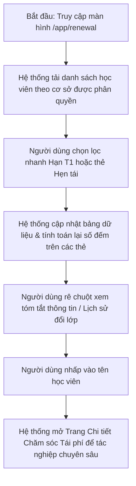

# US-CARE-02-01: Màn hình Danh sách Tái phí học viên (Renewal List Screen)

> **Tham chiếu:** `BF-CARE-02` · `SR-CSM-002` · `[DS-P1]` · `[DS-P4]` · `[POLICY-DS-04]` · `[POLICY-DS-05]`  
> **Vị trí màn hình:** Menu chính: Vận hành và chăm sóc → Menu phụ: Tái phí học viên (`/app/renewal`)

---

## 1. NHẬT KÝ THAY ĐỔI & BỐI CẢNH (CHANGELOG & CONTEXT)

### Lịch sử cập nhật tài liệu (Changelog)

| Ngày cập nhật | Nội dung cập nhật | Lý do cập nhật |
|---|---|---|
| 14/08/2026 | Phát hành tài liệu US-CARE-02-01 | Đặc tả chi tiết màn hình danh sách tái phí học viên, thanh công cụ lọc hạn T1/T2/T3, khối thẻ trạng thái và bảng dữ liệu 8 cột |

### 1.1. Bối cảnh nghiệp vụ (Business Context)
Màn hình Danh sách Tái phí học viên (`/app/renewal`) là trung tâm tác nghiệp hàng ngày của nhân viên Chăm sóc Khách hàng (CSM) và Quản lý cơ sở (BM) nhằm theo dõi, sàng lọc và tiếp cận kịp thời các học viên có gói học sắp kết thúc để tư vấn tái ký khóa học mới.

### 1.2. Vấn đề nghiệp vụ (Problem Statement)
- Nhân viên khó phát hiện các học viên cận hạn học phí nếu không có bộ lọc phân nhóm thời gian chuẩn (Hạn $\le 1$ tháng, 1-2 tháng, 2-3 tháng).
- Số điện thoại phụ huynh dễ bị sao chép hàng loạt nếu hiển thị công khai trên danh sách.
- Số lượng đếm trên các thẻ trạng thái không khớp với danh sách hiển thị khi áp dụng các bộ lọc cơ sở hoặc môn học.

### 1.3. Mục tiêu (Key Objectives)
- Cung cấp bộ lọc Hạn học phí nhanh (Hạn T1 $\le 1$ tháng, Hạn T2 từ 1-2 tháng, Hạn T3 từ 2-3 tháng) kết hợp khối thẻ trạng thái tái phí (Tất cả, Mới, Cân nhắc, Tiềm năng, Hẹn tái, Đã tái phí) có khả năng tính toán lại số lượng theo thời gian thực.
- Hiển thị bảng danh sách chuẩn 8 cột thông tin, bảo mật thông tin liên hệ bằng cách che ẩn số điện thoại dạng `091****111`.
- Hỗ trợ xem nhanh lịch sử đổi lớp, lịch sử chuyển gói học và liên kết trực tiếp tới trang chi tiết học viên.

### 1.4. Giá trị mang lại (Business Value & Impact)
- Tăng 40% năng suất làm việc của nhân viên CSM nhờ giảm thời gian tra cứu và tìm kiếm thông tin học viên cận hạn.
- Đảm bảo 100% học viên đến hạn được tiếp cận đúng quy trình, góp phần nâng tỷ lệ tái phí toàn cơ sở lên $\ge 70\%$.

### 1.5. Phạm vi chức năng tổng quan (Functional Scope Overview)
1. **Thanh công cụ & Bộ lọc nhanh:** Bộ chọn Cơ sở, Bộ chọn Môn học, Bộ chọn Trạng thái liên hệ, Ô tìm kiếm thông minh và Bộ lọc nhanh Hạn học phí (Tất cả / Hạn T1 / Hạn T2 / Hạn T3).
2. **Khối thẻ trạng thái (Status Tiles):** 6 thẻ trạng thái chuẩn đếm động 100% theo các bộ lọc đang chọn.
3. **Bảng dữ liệu chính (8 cột):** Học viên, Liên hệ bảo mật, Phụ trách kép (CS/GV), Lớp học, Gói sản phẩm, Lịch sử chăm sóc, Trạng thái tái phí, Đơn hàng.
4. **Bảng lọc nâng cao (Filter Sheet Panel):** 8 nhóm lọc chuyên sâu trượt từ bên phải.
5. **Xuất dữ liệu Excel & Phân trang chuẩn:** Tùy chọn xuất trường dữ liệu và phân trang 20/50/100 bản ghi.

### 1.6. Ma trận danh sách chức năng (Feature Scope Matrix)

| Mã chức năng | Tên chức năng | Mô tả ngắn | Mức ưu tiên | Nhãn |
|---|---|---|---|---|
| `FEAT-RNW-01` | Thanh công cụ & Bộ lọc Hạn học phí | Lọc theo Cơ sở, Môn học, Trạng thái liên hệ, Hạn T1/T2/T3 và Ô tìm kiếm đa tiêu chí | Must | Bắt buộc |
| `FEAT-RNW-02` | Khối thẻ Trạng thái Tái phí động | Đếm và lọc nhanh theo 6 trạng thái: Tất cả, Mới, Cân nhắc, Tiềm năng, Hẹn tái, Đã tái phí | Must | Bắt buộc |
| `FEAT-RNW-03` | Bảng danh sách Tái phí 8 cột & Che SĐT | Hiển thị 8 cột thông tin, che ẩn số điện thoại `091****111`, xem bảng nổi lịch sử đổi lớp/chuyển gói | Must | Bắt buộc |
| `FEAT-RNW-04` | Bảng lọc nâng cao 8 nhóm & Phân trang | Bảng trượt 8 nhóm tiêu chí lọc và thanh phân trang chuẩn 20/50/100 | Must | Bắt buộc |

---

## 2. LUỒNG XỬ LÝ CHÍNH (MAIN FLOW - HAPPY PATH)

* **Bước 1:** Người dùng truy cập đường dẫn `/app/renewal`. Hệ thống nạp danh sách học viên thuộc các cơ sở được phân quyền.
* **Bước 2:** Người dùng chọn cơ sở, chọn môn học và bấm lọc nhanh nhóm "Hạn T1 ($\le 1$ tháng)" hoặc chọn thẻ trạng thái "Hẹn tái".
* **Bước 3:** Hệ thống cập nhật bảng danh sách hiển thị các học viên thỏa mãn điều kiện, tự động sắp xếp học viên có ngày hết hạn gần nhất lên trên cùng.
* **Bước 4:** Người dùng kiểm tra thông tin liên hệ, lịch sử chăm sóc gần nhất và nhấp vào Tên học viên để mở Trang Chi tiết Chăm sóc Tái phí.

---

## 3. GIAO DIỆN & TRẠNG THÁI TĨNH (DATA & UI STATE)

### 3.1. Thiết kế trực quan
* **Giao diện tham chiếu:** Phân hệ Tái phí học viên Station (`/app/renewal`).

### 3.2. RÀNG BUỘC VÀ QUY TẮC KIỂM TRA DỮ LIỆU (VALIDATION RULES)

#### A. Thanh công cụ & Bộ lọc nhanh

| Thành phần giao diện | Kiểu hiển thị | Nguồn dữ liệu | Các tùy chọn chọn lựa | Logic xử lý & Ràng buộc hiển thị |
|---|---|---|---|---|
| **Bộ chọn Cơ sở** | Ô chọn thả xuống | Nạp động từ cơ sở dữ liệu danh mục Cơ sở | Tất cả cơ sở (Mặc định nếu quản lý nhiều cơ sở) / Tên từng cơ sở cụ thể | Lọc danh sách học viên theo cơ sở được chọn. Tự động khóa nếu tài khoản chỉ được phân quyền 1 cơ sở duy nhất. |
| **Bộ chọn Môn học** | Ô chọn thả xuống | Nạp động từ cơ sở dữ liệu danh mục Môn học | Tất cả môn học (Mặc định), Tiếng Anh, Toán tư duy | Lọc học viên theo môn học của gói đăng ký hiện tại. |
| **Bộ chọn Trạng thái HV / Liên hệ** | Ô chọn thả xuống | Hệ thống | Chọn trạng thái liên hệ: Tất cả, Chưa liên hệ, Đã gọi điện, Không nghe máy (KNM), Đã nhắn Zalo, Đã nhắn Facebook, Đã gặp trực tiếp | Lọc danh sách học viên theo hình thức và kết quả liên hệ gần nhất của nhân viên CSKH. |
| **Ô Tìm kiếm thông minh** | Ô nhập chữ | Người dùng nhập | Nhập văn bản tự do: Tên học viên, Tên tiếng Anh, Mã học viên, Mã khách hàng, Mã lớp, SĐT | Tự động kích hoạt lọc sau 300 miligiây dừng gõ. Tự động cắt khoảng trắng thừa hai đầu. |
| **Bộ lọc nhanh Hạn học phí** | Cụm nút chọn dạng tròn | Hệ thống | 1. **Tất cả (Mặc định)** 2. **Hạn T1 ($\le 1$ tháng)** - Viền đỏ 3. **Hạn T2 (1 - 2 tháng)** - Viền cam 4. **Hạn T3 (2 - 3 tháng)** - Viền xanh lá | Nằm ở góc trên bên phải thanh công cụ. Khi chọn một mốc hạn, bảng danh sách và khối thẻ trạng thái tự động lọc theo khoảng ngày hết hạn tương ứng. |
| **Nút Mở bảng lọc nâng cao** | Nút bấm biểu tượng phễu lọc | Hệ thống | Hiển thị số lượng bộ lọc đang kích hoạt | Nhấp vào mở Bảng lọc nâng cao trượt từ cạnh phải màn hình. |
| **Nút Xuất dữ liệu** | Nút bấm biểu tượng tải xuống | Hệ thống | Chọn các trường thông tin cần xuất, chọn tháng hoặc khoảng ngày | Cho phép xuất danh sách học viên ra tệp bảng tính Excel theo các trường đã chọn. |

#### B. Khối Thẻ Trạng thái Nhanh (Status Tiles)

| Tên Thẻ Trạng thái | Nhóm màu thị giác | Điều kiện lọc dữ liệu chi tiết | Diễn giải nghiệp vụ |
|---|---|---|---|
| **Tất cả** | Màu xám trung tính | Không lọc theo trạng thái tái phí | Hiển thị tổng số lượng bản ghi tái phí thỏa mãn các bộ lọc trên thanh công cụ. |
| **Mới** | Màu xám nhạt | Phân loại tái phí là `moi` | Học viên mới đến hạn trong danh sách, chưa có tương tác tư vấn tái phí nào hoặc chưa thay đổi trạng thái. |
| **Cân nhắc** | Màu vàng cam | Phân loại tái phí là `can_nhac` | Học viên đã được liên hệ nhưng phụ huynh đang đắn đo, cần suy nghĩ thêm về học phí hoặc thời gian học. |
| **Tiềm năng** | Màu xanh dương | Phân loại tái phí là `tiem_nang` | Phụ huynh hài lòng với kết quả học tập, có nhu cầu tiếp tục cho con học khóa tiếp theo. |
| **Hẹn tái** | Màu tím | Phân loại tái phí là `hen_tai` | Phụ huynh đã đồng ý đăng ký và có lịch hẹn cụ thể về ngày chuyển khoản đóng phí. |
| **Đã tái phí** | Màu xanh lá | Phân loại tái phí là `tai_phi` | Học viên đã hoàn tất thủ tục thanh toán học phí hoặc đặt cọc giữ chỗ cho khóa học mới. |

#### C. Bảng Dữ liệu Tái phí Học viên (8 Cột Chuẩn)

| Cột thông tin | Kiểu hiển thị | Nguồn dữ liệu | Quy tắc thị giác & Hiển thị chi tiết | Tương tác Rê chuột & Nhấp chuột |
|---|---|---|---|---|
| **1. Học viên** | Ảnh đại diện + Tên in đậm + Môn & Trình độ | Cơ sở dữ liệu học viên | Dòng 1: Ảnh đại diện/chữ viết tắt + Họ tên học viên in đậm. Dòng 2: Môn học và Cấp độ (VD: Tiếng Anh - Level 5). Icon sao chép link báo cáo học tập. | - **Nhấp Tên học viên:** Mở Trang Chi tiết Chăm sóc Tái phí. - **Nhấp Icon sao chép:** Sao chép đường link báo cáo kết quả học tập trực tuyến vào bộ nhớ đệm. |
| **2. Liên hệ** | Văn bản che ẩn bảo mật | Cơ sở dữ liệu học viên | - Dòng 1: Đại diện liên hệ (VD: `GĐ PHƯƠNG`). - Dòng 2: Số điện thoại che ẩn ở giữa dạng `091****111` kèm icon điện thoại và sao chép. - Icon nhóm người nếu có nhiều người liên hệ. | - **Nhấp Icon nhóm người:** Mở bảng nhỏ hiển thị danh sách người liên hệ gia đình (Bố, Mẹ, Người giám hộ) kèm số điện thoại đầy đủ (đối với tài khoản có thẩm quyền). |
| **3. Phụ trách** | Khối dòng đôi nhãn phân loại | Danh mục nhân sự lớp/gói | - Dòng 1: Nhãn `CS` (xanh lá) + Tên chuyên viên CS phụ trách. - Dòng 2: Nhãn `GV` (tím) + Tên giáo viên giảng dạy. | - **Rê chuột Tên nhân sự:** Hiển thị thẻ thông tin liên hệ nội bộ (Số máy lẻ, Email, Phòng ban) của nhân viên CS / Giáo viên. |
| **4. Lớp học** | Văn bản dòng đôi + Huy hiệu trạng thái | Cơ sở dữ liệu lớp học | - Dòng 1: Tên lớp (hoặc text `Đang chuyển lớp`, `Chưa có lớp`). - Dòng 2: Mã lớp + Huy hiệu trạng thái (`ĐANG HỌC`, `CHỜ GHÉP LỚP MỚI`, `BẢO LƯU`, `HẾT PHÍ`). - Icon đổi lớp nếu có lịch sử. | - **Nhấp Icon đổi lớp:** Mở bảng nổi xem Lịch sử chuyển lớp và ghép lớp. - **Rê chuột Mã lớp:** Xem thông tin phòng học, ca học và lịch học tuần. |
| **5. Gói sản phẩm** | Văn bản dòng đôi + Icon chuyển gói | Cơ sở dữ liệu gói học | - Dòng 1: Tên gói sản phẩm / Level (VD: `Level 5`). - Dòng 2: `Hết hạn: dd/mm/yyyy`. - Icon chuyển đổi gói nếu có lịch sử. | - **Nhấp Icon chuyển đổi gói:** Mở bảng nổi xem Lịch sử chuyển đổi các gói sản phẩm của học viên. |
| **6. Lịch sử chăm sóc** | Khối văn bản nhiều dòng | Cơ sở dữ liệu chăm sóc học viên | - Dòng 1: Nhãn `Chăm sóc (n)` màu xanh (hoặc `Chưa chăm sóc` màu xám) + Lịch hẹn gọi lại màu tím (nếu có). - Dòng 2: Ngày thực hiện + Nội dung tóm tắt tương tác. - Dòng 3: Trích dẫn ý kiến phản hồi của phụ huynh. | - **Nhấp / Rê chuột Cột Lịch sử:** Mở Hộp thoại Lịch sử Chăm sóc Tái phí xem toàn bộ chi tiết các lần trao đổi và thông tin cuộc gọi. |
| **7. Trạng thái tái phí** | Huy hiệu màu phân loại chuẩn | Cơ sở dữ liệu chăm sóc học viên | Hiển thị huy hiệu phân loại tái phí viết hoa: `MỚI` (xám), `CÂN NHẮC` (vàng), `TIỀM NĂNG` (xanh dương), `HẸN TÁI` (tím), `ĐÃ TÁI PHÍ` (xanh lá), `THẤT BẠI` (đỏ). | Hiển thị trạng thái phân loại tái phí hiện tại của học viên theo gói. |
| **8. Đơn hàng** | Khối văn bản liên kết đơn nháp | Cơ sở dữ liệu đơn hàng CRM | - Nếu có đơn: Dòng 1: Tên gói + Giá tiền dẫn link `/quote/OD-DRAFT-xxx`; Dòng 2: Mã đơn `OD-DRAFT-xxx` • Trạng thái cọc / thanh toán. - Nếu chưa có đơn: Hiển thị chữ nghiêng `Chưa có đơn hàng`. | - **Nhấp Link Đơn hàng / Mã đơn:** Mở trang Landing Page Báo giá & Chi tiết đơn hàng trực tuyến. |

---

## 4. KHỐI CHỨC NĂNG & TIÊU CHÍ CHẤP NHẬN (ACCEPTANCE CRITERIA)

### Action 1.1: Thanh công cụ & Bộ lọc Hạn học phí
* **Tiêu chí nghiệm thu (Acceptance Criteria):**
  - **AC-1 (Happy Path - Lọc Hạn T1):**
    - **Giả sử:** Người dùng đang ở màn hình Danh sách Tái phí.
    - **Khi:** Nhấp vào nút "Hạn T1 ($\le 1$ tháng)".
    - **Thì:** Hệ thống chỉ hiển thị các học viên có ngày hết hạn học phí dự kiến trong vòng 30 ngày tới, đồng thời số lượng đếm trên 6 thẻ trạng thái được tính toán lại theo danh sách Hạn T1.
  - **AC-2 (Happy Path - Tìm kiếm thông minh):**
    - **Giả sử:** Người dùng nhập tên "Hà Phương" vào ô tìm kiếm.
    - **Khi:** Hệ thống dừng gõ 300 miligiây.
    - **Thì:** Bảng danh sách hiển thị các học viên có tên chứa "Hà Phương", khớp chính xác với bộ lọc cơ sở và môn học đang chọn.
  - **AC-3 (Exception Path - Không có kết quả tìm kiếm):**
    - **Giả sử:** Người dùng nhập từ khóa không tồn tại.
    - **Khi:** Hệ thống lọc xong.
    - **Thì:** Bảng hiển thị hình ảnh trạng thái rỗng kèm thông báo "Không tìm thấy học viên phù hợp với bộ lọc".

### Action 1.2: Khối thẻ Trạng thái Tái phí Động
* **Tiêu chí nghiệm thu (Acceptance Criteria):**
  - **AC-4 (Happy Path - Lọc theo Thẻ trạng thái):**
    - **Giả sử:** Người dùng nhấp vào thẻ "Hẹn tái (6)".
    - **Khi:** Chọn thẻ này.
    - **Thì:** Bảng danh sách chỉ hiển thị 6 học viên đang ở trạng thái Hẹn tái và có lịch hẹn gọi lại.
  - **AC-5 (Happy Path - Cập nhật số đếm thời gian thực):**
    - **Giả sử:** Người dùng thay đổi bộ chọn Cơ sở từ "Tất cả cơ sở" sang "RinoEdu Nguyễn Tuân".
    - **Khi:** Cơ sở thay đổi.
    - **Thì:** Tất cả số lượng đếm trên 6 thẻ trạng thái tự động cập nhật lại đúng theo dữ liệu riêng của cơ sở Nguyễn Tuân.

### Action 1.3: Bảng danh sách Tái phí 8 cột & Che SĐT Bảo mật
* **Tiêu chí nghiệm thu (Acceptance Criteria):**
  - **AC-6 (Happy Path - Che ẩn SĐT chống sao chép):**
    - **Giả sử:** Bảng danh sách đang tải dữ liệu.
    - **Khi:** Hiển thị cột Liên hệ.
    - **Thì:** Số điện thoại phụ huynh bắt buộc phải hiển thị dạng `091****111`, không cho phép người dùng bôi đen sao chép toàn bộ 10 chữ số từ màn hình danh sách chính.
  - **AC-7 (Happy Path - Mở trang chi tiết học viên):**
    - **Giả sử:** Người dùng nhấp vào tên học viên "Nguyễn Hà Phương".
    - **Khi:** Nhấp chuột vào dòng hoặc tên.
    - **Thì:** Hệ thống điều hướng vào Trang Chi tiết Chăm sóc Tái phí của học viên đó với tab Đơn hàng được mở sẵn.
  - **AC-8 (Happy Path - Mở link Báo giá đơn hàng):**
    - **Giả sử:** Dòng học viên có đơn nháp `OD-DRAFT-9238`.
    - **Khi:** Người dùng nhấp vào mã đơn.
    - **Thì:** Hệ thống mở tab mới dẫn tới trang báo giá trực tuyến `/quote/OD-DRAFT-9238`.

### Action 1.4: Phân trang & Xuất dữ liệu Excel
* **Tiêu chí nghiệm thu (Acceptance Criteria):**
  - **AC-9 (Happy Path - Chuyển kích thước trang):**
    - **Giả sử:** Danh sách có 45 bản ghi.
    - **Khi:** Người dùng chọn kích thước trang là "50 dòng".
    - **Thì:** Toàn bộ 45 bản ghi được hiển thị trên 1 trang duy nhất mà không cần chuyển trang.
  - **AC-10 (Happy Path - Xuất tệp Excel thành công):**
    - **Giả sử:** Người dùng bấm nút Xuất dữ liệu, chọn tháng 8 và chọn 8 trường thông tin.
    - **Khi:** Bấm "Xác nhận xuất".
    - **Thì:** Hệ thống xuất tệp bảng tính chứa chính xác các bản ghi đang được lọc và hiển thị thông báo thành công.

---

## 5. CÁC TRƯỜNG HỢP GÓC CẠNH (CORNER CASES)

* **5.1. Học viên có 2 gói học cùng đến hạn trong tháng:** Hệ thống tách thành 2 dòng bản ghi riêng biệt trên bảng danh sách, mỗi dòng gắn với môn học, giáo viên và mã lớp tương ứng để tránh nhầm lẫn tác nghiệp.
* **5.2. Học viên đang ở trạng thái Chờ chuyển lớp hoặc Bảo lưu:** Cột Lớp học hiển thị nhãn trạng thái màu cam `Chờ ghép lớp mới` hoặc `Bảo lưu`, cho phép CSM nắm tình trạng trước khi tư vấn tái phí.
* **5.3. Mất kết nối mạng khi chuyển trang dữ liệu:** Giao diện hiển thị thông báo lỗi kèm nút "Thử lại", giữ nguyên trạng thái các bộ lọc người dùng đã chọn trước đó.
* **5.4. Học viên chưa từng được ghi nhận chăm sóc:** Cột Lịch sử chăm sóc hiển thị nhãn `Chưa chăm sóc` màu xám kèm dòng chữ nghiêng màu cam `Cần liên hệ trao đổi với phụ huynh ngay` để cảnh báo nhân viên.
* **5.5. Học viên có số điện thoại quốc tế hoặc không hợp lệ:** Cột Liên hệ hiển thị dấu gạch ngang `-` và icon cảnh báo nhẹ, hỗ trợ bấm mở danh sách người liên hệ khác trong gia đình.

---

## 6. YÊU CẦU PHI CHỨC NĂNG & PHÂN QUYỀN

* **Thời gian phản hồi:** Tải dữ liệu danh sách $\le 1.2$ giây; phản hồi lọc thẻ trạng thái $\le 200$ miligiây.
* **Phân quyền truy cập:**
  * Nhân viên CSM: Chỉ xem và thao tác trên danh sách học viên thuộc cơ sở và lớp mình được phân công phụ trách.
  * Quản lý cơ sở (BM): Xem và quản lý toàn bộ học viên thuộc cơ sở.
  * Admin: Xem toàn bộ danh sách trên tất cả các cơ sở trong hệ thống.

---

## 7. PHỤ LỤC: KIỂM TRA CHẤT LƯỢNG (Checklist B)

- [x] **Acceptance Criteria (AC):** Đầy đủ 4 nhóm chức năng chính, định dạng Giả sử - Khi - Thì, bao phủ cả luồng thành công và ngoại lệ.
- [x] **Ngôn ngữ tự nhiên 100%:** Không chứa từ cấm kỹ thuật (đã thay thế toàn bộ bằng thuật ngữ nghiệp vụ tự nhiên).
- [x] **Bảng mô tả giao diện 5 cột:** Mục 3.2 tuân thủ nghiêm ngặt định dạng 5 cột chuẩn.
- [x] **Corner Cases $\ge 5$:** Định nghĩa đầy đủ 5 trường hợp góc tại Mục 5.
- [x] **Quy tắc bảo mật:** Tuân thủ quy định che ẩn số điện thoại `[RULE-CARE-02-02]`.
