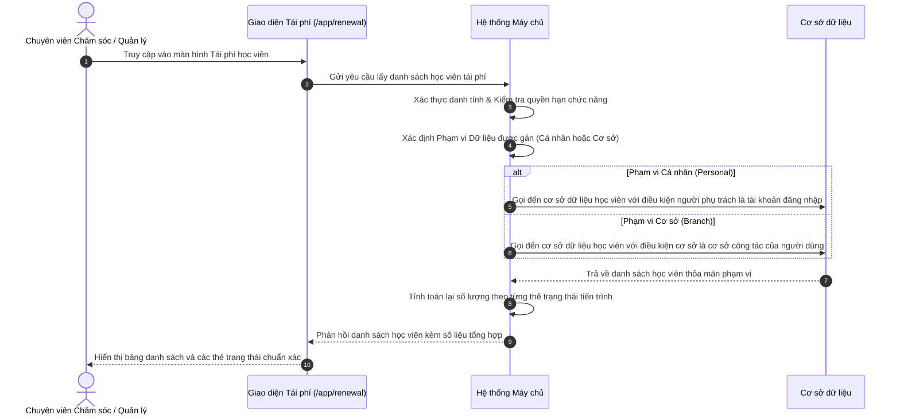

# US-CARE-02-01: Phân quyền & Phân định Phạm vi Dữ liệu Màn hình Tái phí Học viên

> **Tham chiếu:** `BF-CARE-02` · `SR-CSM-002` · `US-SYS-04-04` · Giao diện Mẫu §4.2 (Màn hình Danh sách & Thẻ Thống kê)  
> **Đường dẫn màn hình & Trạng thái liên quan:**  
> - `/app/renewal` $\rightarrow$ Màn hình Tái phí Học viên  
> - `/app/system_config` $\rightarrow$ Màn hình Cấu hình Hệ thống (Bàn điều khiển thử nghiệm phân quyền)  
> - **Phiên bản hệ thống:** `v2026.09.15.01.station`

---

## 1. NHẬT KÝ THAY ĐỔI & BỐI CẢNH (CHANGELOG & CONTEXT)

### Lịch sử cập nhật tài liệu (Changelog)

| Ngày cập nhật | Nội dung cập nhật | Lý do cập nhật |
|---|---|---|
| 15/09/2026 | Khởi tạo tài liệu đặc tả phân quyền và phân định phạm vi dữ liệu cho màn hình Tái phí | Tách biệt quyền thao tác chức năng và biên giới phạm vi dữ liệu, loại bỏ thanh thông báo phạm vi thừa trên giao diện nghiệp vụ |
| 15/09/2026 | Bổ sung quy trình và kịch bản thử nghiệm dành cho đội ngũ phát triển và kiểm thử thông qua màn hình Cấu hình hệ thống | Cung cấp công cụ giả lập vai trò và phạm vi linh hoạt trên môi trường phát triển |

### Bối cảnh & Vấn đề nghiệp vụ (Context & Problem)
* **Bối cảnh:** Màn hình Tái phí học viên (`/app/renewal`) là trung tâm theo dõi các học viên sắp hết hạn gói học hoặc sắp kết thúc số buổi học để đội ngũ chăm sóc khách hàng chủ động liên hệ tư vấn gia hạn. Trước đây, hệ thống đã có sẵn cơ chế phân quyền chức năng kế thừa từ phân hệ quản lý quan hệ khách hàng (quyền truy cập màn hình, xem chi tiết, cập nhật nhật ký, xuất danh sách).
* **Vấn đề hiện tại:** Màn hình trước đây chỉ tải và hiển thị danh sách phẳng toàn bộ học viên hoặc phải dựa vào việc nhân viên tự tay chọn bộ lọc cơ sở/người phụ trách. Chưa có cơ chế máy chủ tự động gọt dữ liệu ngầm theo biên giới phân quyền (phạm vi dữ liệu cá nhân hay cơ sở). Điều này dẫn đến nguy cơ nhân viên nhìn thấy dữ liệu của đồng nghiệp hoặc cơ sở khác, gây quá tải danh sách và vi phạm quy định bảo mật thông tin học viên.
* **Mục tiêu & Giá trị mang lại:** Thiết lập cơ chế kiểm soát biên giới phạm vi dữ liệu tự động gắn liền với tài khoản đăng nhập. Nhân sự chỉ thấy đúng tập học viên thuộc trách nhiệm quản lý của mình (Cá nhân hoặc Toàn cơ sở). Dữ liệu thẻ thống kê, bộ lọc và danh sách bảng tự động đồng bộ theo phạm vi mà không cần hiển thị các thanh cảnh báo làm xao nhãng giao diện.

### Hiểu người dùng & Tình huống sử dụng (User Needs & Use Cases)
* **Người dùng chính (Persona):** Chuyên viên Chăm sóc Khách hàng (`PERSONA-CSM`), Quản lý Cơ sở (`PERSONA-BRANCH_MANAGER`).
* **Nhu cầu thực tế (Needs):** Chuyên viên chăm sóc muốn khi mở màn hình Tái phí là thấy ngay danh sách các học viên do chính mình phụ trách để xử lý ngay trong ngày, không phải mất thời gian chọn lọc tên mình trong danh sách dài. Quản lý cơ sở muốn nắm bắt toàn diện bức tranh tái phí của toàn bộ cơ sở để điều phối nhân sự.
* **Câu phát biểu nghiệp vụ:** **Là một** Chuyên viên Chăm sóc Khách hàng, **tôi muốn** khi truy cập màn hình Tái phí, hệ thống tự động lọc danh sách chỉ hiển thị những học viên do tôi phụ trách, **để** tôi tập trung chăm sóc đúng đối tượng và bảo mật thông tin học viên của trung tâm.

### Phạm vi kiểm soát (Scope & Classification)

| Tiêu chí đánh giá | Nội dung đối soát thực tế | Điểm số (0 / 1) |
|---|---|:---:|
| **Tiêu chí A: Phạm vi ảnh hưởng hệ thống** | Tác động trực tiếp đến màn hình Tái phí và cơ chế phân quyền dữ liệu của phân hệ Chăm sóc | 1 |
| **Tiêu chí B: Tác động tài chính** | Ảnh hưởng đến việc bảo vệ dữ liệu doanh thu tái đăng ký và thông tin khách hàng | 1 |
| **Tiêu chí C1: Loại thay đổi nghiệp vụ** | Bổ sung tầng phân định phạm vi dữ liệu (Cá nhân vs Cơ sở) vào phân quyền chức năng có sẵn | 1 |
| **Tiêu chí C2: Độ mới nghiệp vụ** | Cơ chế phân quyền chức năng đã có, điểm mới là phân tầng phạm vi dữ liệu ngầm | 0 |
| **Tiêu chí D: Phụ thuộc bên ngoài** | Vận hành trên máy chủ nội bộ, không liên kết dịch vụ đối tác ngoài | 0 |

* **Tổng điểm đánh giá:** 3/5 điểm $\rightarrow$ 🔴 **Risk** (Yêu cầu Quản lý Sản phẩm và Trưởng nhóm Kiểm thử rà soát trước khi triển khai chính thức).

### Bảng Danh mục Chức năng (Feature Scope Matrix)

| Mã Yêu Cầu | Tên Chức Năng | Mức Độ Ưu Tiên | Phân Loại Rủi Ro | Ghi Chú Nghiệp Vụ |
|---|---|:---:|:---:|---|
| **FEAT-01** | Kiểm soát quyền truy cập màn hình Tái phí (`care.renewal.access`) | Bắt buộc (Must) | 🟢 Standard | Chặn người dùng không có quyền truy cập |
| **FEAT-02** | Phân tầng Phạm vi Dữ liệu Cấp độ Cá nhân (`personal`) | Bắt buộc (Must) | 🔴 Risk | Chỉ hiển thị học viên do chính người dùng phụ trách |
| **FEAT-03** | Phân tầng Phạm vi Dữ liệu Cấp độ Cơ sở (`branch`) | Bắt buộc (Must) | 🔴 Risk | Hiển thị toàn bộ học viên tái phí thuộc cơ sở công tác |
| **FEAT-04** | Đồng bộ tự động các Thẻ chỉ số trạng thái theo Phạm vi Dữ liệu | Bắt buộc (Must) | 🟢 Standard | Số lượng đếm trên thẻ phản ánh đúng tập dữ liệu được phép xem |
| **FEAT-05** | Giữ giao diện nghiệp vụ thuần túy, loại bỏ thanh thông báo phạm vi | Bắt buộc (Must) | 🟢 Standard | Kiểm soát ngầm qua phiên làm việc, không hiện nhãn thừa |
| **FEAT-06** | Cơ chế chuyển đổi phạm vi thử nghiệm trên màn hình Cấu hình hệ thống | Bắt buộc (Must) | 🟢 Standard | Phục vụ đội ngũ phát triển và kiểm thử thao tác nhanh |
| **FEAT-07** | Bảo mật số điện thoại phụ huynh trên bảng danh sách | Bắt buộc (Must) | 🟢 Standard | Che ẩn số ở giữa, chỉ hiện đầy đủ khi mở bảng chi tiết |

### Quy tắc Nghiệp vụ Toàn cục (Business Rules)
Hệ thống tuân thủ nghiêm ngặt các quy tắc nghiệp vụ sau:
1. **Lọc ngầm tại máy chủ:** Toàn bộ quá trình sàng lọc theo phạm vi dữ liệu phải được thực thi tại máy chủ dựa trên thông tin phiên làm việc của người dùng, không phụ thuộc vào tham số gửi từ giao diện.
2. **Nguyên tắc không lộ dữ liệu:** Tài khoản mang phạm vi Cá nhân tuyệt đối không được nhận bất kỳ bản ghi nào của nhân sự khác từ máy chủ.
3. **Thẻ thống kê theo phạm vi:** Toàn bộ số liệu hiển thị trên các thẻ trạng thái (Cần tư vấn ngay, Tiềm năng, Hẹn tái phí, Đã tái phí,...) phải được tính toán dựa trên tập dữ liệu đã qua bộ lọc phạm vi.
4. **Bảo mật số điện thoại chống sao chép:** Trên bảng danh sách chính, mọi số điện thoại liên lạc phải được che định dạng `091****111`. Chỉ tài khoản có quyền xem chi tiết mới được xem số đầy đủ trong bảng thông tin chi tiết.

---

## 2. LUỒNG XỬ LÝ CHÍNH (MAIN FLOW - HAPPY PATH)

---

## 3. GIAO DIỆN & KIỂM SOÁT QUYỀN HẠN (UI & CAPABILITY GATING)

### 3.1. Cấu trúc các vùng giao diện & Ràng buộc Quyền hạn (Capability Gating)

Màn hình áp dụng cơ chế kiểm soát hiển thị theo **Mã Quyền Động (Atomic Capabilities)**:

| Vùng Giao diện / Nút Thao Tác | Loại Hiển Thị | Mã Quyền Yêu Cầu (Capability Key) | Xử Lý Khi Không Đủ Quyền |
| :--- | :--- | :--- | :--- |
| **Truy cập Màn hình `/app/renewal`** | Toàn bộ giao diện | `care.renewal.access` | Chặn truy cập, chuyển hướng đến thông báo không có quyền |
| **Bảng danh sách học viên** | Khung bảng dữ liệu | `care.renewal.access` | Áp dụng gọt dữ liệu theo phạm vi được gán |
| **Thẻ trạng thái tiến trình chăm sóc** | Hàng thẻ chỉ số | `care.renewal.access` | Hiển thị tổng số lượng đếm thuộc phạm vi được cấp |
| **Cột Thao tác: Ghi nhận tư vấn / Cuộc gọi** | Nút hành động trên dòng | `care.renewal.edit` | Vô hiệu hóa hoặc ẩn nút ghi nhận tương tác |
| **Nhấp dòng mở Bảng chi tiết học viên** | Bảng chi tiết toàn màn hình | `care.renewal.view_detail` | Không kích hoạt mở bảng thông tin chi tiết |
| **Nút [Xuất danh sách]** | Nút trên thanh công cụ | `care.renewal.export` | Ẩn nút xuất dữ liệu khỏi thanh công cụ |
| **Bộ lọc Cơ sở trên thanh công cụ** | Ô chọn danh sách | `care.renewal.view_all` | Khóa cứng giá trị cơ sở của người dùng nếu không có quyền xem tất cả |

### 3.2. Ma trận Cấp độ Phạm vi Dữ liệu (Data Scope Matrix)

| Cấp độ Phạm vi | Tên Gọi | Điều kiện Lọc Dữ liệu Nghiệp vụ | Đối tượng Người dùng Áp dụng |
|---|---|---|---|
| **Cấp 1** | **Cá nhân** (`personal`) | Người phụ trách chăm sóc bằng chính tên tài khoản đăng nhập | Chuyên viên chăm sóc khách hàng (CSM), Tư vấn viên |
| **Cấp 2** | **Cơ sở** (`branch`) | Cơ sở học sinh đang theo học bằng chính cơ sở công tác của tài khoản | Quản lý Cơ sở, Trưởng nhóm Chăm sóc khách hàng cơ sở |
| **Cấp 3** | **Toàn chuỗi** (`all`) | Không giới hạn cơ sở, hiển thị toàn bộ học viên toàn hệ thống | Giám đốc Vận hành, Quản trị viên Cấp cao |

### 3.3. Cấu trúc Bảng Danh sách Học viên Tái phí

| Tên Cột Thông Tin | Kiểu Hiển Thị | Nguồn Dữ Liệu | Diễn Giải & Quy Tắc Hiển Thị |
|---|---|---|---|
| **Học viên** | Tên học viên kèm mã định danh mờ | Hồ sơ học viên | Tên in đậm, nhấp để xem chi tiết nếu có quyền |
| **Số điện thoại** | Chữ số che mặt nạ | Thông tin liên hệ phụ huynh | Che bảo mật ở giữa dạng `091****111` |
| **Cơ sở** | Chữ thường | Danh mục cơ sở | Tên cơ sở học viên đang theo học |
| **Gói học & Buổi còn** | Nhãn nổi bật | Dữ liệu khóa học | Số buổi còn lại kèm màu cảnh báo mức độ khẩn |
| **Trạng thái tái phí** | Nhãn trạng thái chuẩn | Tiến trình tư vấn | Màu sắc tương ứng theo tiến trình chăm sóc |
| **Người phụ trách** | Tên chuyên viên | Phân công nhân sự | Tên nhân sự chăm sóc trực tiếp học viên |
| **Thao tác** | Nút biểu tượng | Tác vụ nghiệp vụ | Nút gọi điện, ghi nhận ý kiến phụ huynh |

---

## 4. KHỐI CHỨC NĂNG CHI TIẾT: ACTION & TIÊU CHÍ NGHIỆM THU (ACTIONS & ACCEPTANCE CRITERIA)

### Khối chức năng 1: Lọc dữ liệu ngầm theo Phạm vi Dữ liệu

#### Action 1.1: Truy cập với quyền hạn phạm vi Cá nhân
* **Luồng kích hoạt:** Khi người dùng có phạm vi Cá nhân truy cập vào đường dẫn `/app/renewal`.
* **Tiêu chí nghiệm thu:**
  - **AC-1 (Happy Path - Lọc chính xác học viên của tài khoản):**
    - **Giả sử:** Tài khoản đăng nhập là chuyên viên chăm sóc "Lan Anh" và hệ thống có 50 học viên sắp hết phí (trong đó có 12 học viên do "Lan Anh" phụ trách).
    - **Khi:** Người dùng truy cập màn hình Tái phí học viên.
    - **Thì:** Bảng danh sách hiển thị đúng 12 học viên của "Lan Anh", các thẻ trạng thái phía trên hiển thị tổng số và phân bổ khớp đúng 12 bản ghi này.
  - **AC-2 (Alternate Path - Nhân viên chưa có học viên phụ trách):**
    - **Giả sử:** Tài khoản đăng nhập là nhân viên mới chưa được gán bất kỳ học viên tái phí nào.
    - **Khi:** Người dùng truy cập màn hình Tái phí học viên.
    - **Thì:** Bảng danh sách hiển thị trạng thái danh sách trống với thông báo không có dữ liệu học viên cần chăm sóc.

#### Action 1.2: Truy cập với quyền hạn phạm vi Cơ sở
* **Luồng kích hoạt:** Khi người dùng có phạm vi Cơ sở truy cập vào đường dẫn `/app/renewal`.
* **Tiêu chí nghiệm thu:**
  - **AC-3 (Happy Path - Lọc toàn bộ học viên thuộc cơ sở công tác):**
    - **Giả sử:** Tài khoản đăng nhập công tác tại cơ sở "Cơ sở Cầu Giấy" có 35 học viên tái phí phân bổ cho 3 chuyên viên khác nhau.
    - **Khi:** Người dùng truy cập màn hình Tái phí học viên.
    - **Thì:** Bảng danh sách hiển thị toàn bộ 35 học viên thuộc cơ sở Cầu Giấy, bao gồm học viên của cả 3 chuyên viên trong cơ sở.
  - **AC-4 (Alternate Path - Kết hợp bộ lọc trạng thái tiến trình):**
    - **Giả sử:** Danh sách cơ sở đang hiển thị 35 học viên.
    - **Khi:** Người dùng nhấp vào thẻ trạng thái "Cần tư vấn ngay".
    - **Thì:** Bảng danh sách chỉ hiển thị các học viên có trạng thái "Cần tư vấn ngay" nằm trong phạm vi cơ sở Cầu Giấy.

### Khối chức năng 2: Hướng dẫn Thử nghiệm Kiểm thử trên Môi trường Phát triển (Dev & QA Guide)

#### Action 2.1: Chuyển đổi phạm vi tại màn hình Cấu hình hệ thống
* **Luồng kích hoạt:** Đội ngũ phát triển và kiểm thử viên truy cập `/app/system_config` để đổi vai trò thử nghiệm.
* **Tiêu chí nghiệm thu:**
  - **AC-5 (Happy Path - Đổi sang phạm vi Cá nhân để kiểm thử):**
    - **Giả sử:** Kiểm thử viên đang ở màn hình Cấu hình hệ thống (`/app/system_config`).
    - **Khi:** Kiểm thử viên chọn tùy chọn "Cá nhân" và bấm nút [Lưu cấu hình], sau đó điều hướng sang màn hình `/app/renewal`.
    - **Thì:** Màn hình Tái phí hiển thị danh sách học viên thu hẹp đúng theo chuyên viên mặc định đang giả lập, không hiển thị bất kỳ thanh thông báo cấu hình nào trên trang Tái phí.
  - **AC-6 (Happy Path - Đổi sang phạm vi Cơ sở để kiểm thử):**
    - **Giả sử:** Kiểm thử viên đang ở màn hình Cấu hình hệ thống (`/app/system_config`).
    - **Khi:** Kiểm thử viên chọn tùy chọn "Cơ sở" và bấm nút [Lưu cấu hình], sau đó điều hướng sang màn hình `/app/renewal`.
    - **Thì:** Màn hình Tái phí mở rộng hiển thị toàn bộ danh sách học viên của cơ sở hiện tại, số lượng đếm trên bảng và các thẻ trạng thái tăng tương ứng.

---

## 5. CÁC TRƯỜNG HỢP GÓC CẠNH (CORNER CASES)

- **Trường hợp 1 (Học viên chưa gán người phụ trách):** Đối với các học viên sắp hết phí nhưng chưa được phân công nhân sự chăm sóc, tài khoản mang phạm vi Cá nhân sẽ không nhìn thấy; chỉ tài khoản mang phạm vi Cơ sở hoặc Toàn chuỗi mới nhìn thấy để thực hiện phân công.
- **Trường hợp 2 (Nhân sự luân chuyển cơ sở):** Khi một chuyên viên được điều chuyển sang cơ sở mới, máy chủ ngay lập tức cập nhật lại biên giới dữ liệu của cơ sở mới, không cho phép truy cập tiếp danh sách học viên thuộc cơ sở cũ.
- **Trường hợp 3 (Thay đổi cấu hình phạm vi giữa phiên làm việc):** Nếu quản trị viên điều chỉnh phạm vi quyền của tài khoản khi người dùng đang mở màn hình, ở lần tải dữ liệu tiếp theo, hệ thống tự động áp dụng phạm vi mới mà không gây xung đột dữ liệu.
- **Trường hợp 4 (Nhập từ khóa tìm kiếm học viên ngoài phạm vi):** Khi người dùng mang phạm vi Cá nhân nhập tên một học viên thuộc cơ sở khác vào ô tìm kiếm nhanh, hệ thống phản hồi kết quả trống, đảm bảo dữ liệu không bị lộ qua chức năng tìm kiếm.
- **Trường hợp 5 (Học viên cùng lúc có nhiều gói học):** Khi học viên có nhiều gói học sắp hết hạn, hệ thống gom nhóm theo từng học viên duy nhất trên bảng tái phí để người phụ trách tiện theo dõi tổng thể.
- **Trường hợp 6 (Thao tác trên học viên khi vừa bị chuyển quyền):** Khi nhân viên bấm nút ghi nhận tương tác đối với học viên vừa được quản lý phân bổ cho người khác, máy chủ phản hồi thông báo học viên đã được chuyển giao và tải lại danh sách mới nhất.

---

## 6. LUỒNG NGOẠI LỆ & XỬ LÝ SỰ CỐ (EXCEPTION FLOW)

- **Ngoại lệ 1 (Mất kết nối mạng hoặc máy chủ không phản hồi):** Khi người dùng đang tải danh sách hoặc cập nhật trạng thái mà đường truyền gián đoạn quá 10 giây, giao diện hiển thị thông báo "Không thể kết nối máy chủ, vui lòng kiểm tra đường truyền" và giữ nguyên trạng thái trước đó.
- **Ngoại lệ 2 (Hết hạn phiên làm việc):** Khi phiên đăng nhập hết hiệu lực trong lúc thao tác, hệ thống tự động lưu trạng thái tạm thời và điều hướng người dùng về màn hình đăng nhập an toàn.
- **Ngoại lệ 3 (Tài khoản bị thu hồi quyền truy cập):** Nếu tài khoản bị quản trị viên gỡ bỏ quyền `care.renewal.access`, ngay khi người dùng bấm tải lại hoặc thực hiện thao tác, giao diện hiển thị bảng thông báo "Bạn không có quyền truy cập tính năng này" và chuyển hướng về trang chủ điều hành.

---

## 7. QUY TẮC KIỂM SOÁT & RÀNG BUỘC DỮ LIỆU (VALIDATION RULES)

- **Ràng buộc 1 (Phạm vi dữ liệu bắt buộc):** Mỗi tài khoản người dùng khi được gán nhóm quyền Chăm sóc bắt buộc phải có giá trị phạm vi dữ liệu xác định (mặc định là `personal` nếu không được chọn cụ thể).
- **Ràng buộc 2 (Định dạng số điện thoại):** Dữ liệu số điện thoại trên bảng bắt buộc phải tuân thủ chuẩn che mặt nạ 10 chữ số, chỉ hiển thị 3 chữ số đầu và 3 chữ số cuối.
- **Ràng buộc 3 (Bộ lọc cơ sở hợp lệ):** Người dùng chỉ được phép chọn các cơ sở nằm trong phạm vi quyền hạn được cấp. Nếu người dùng chỉ có phạm vi Cá nhân hoặc Cơ sở đơn lẻ, ô chọn cơ sở bị vô hiệu hóa chọn nhiều.

---

## 8. YÊU CẦU PHI CHỨC NĂNG (NON-FUNCTIONAL REQUIREMENTS)

- **Thời gian phản hồi:** Tốc độ máy chủ xử lý truy vấn danh sách học viên theo phạm vi dữ liệu phải hoàn tất dưới 1 giây đối với tập dữ liệu dưới 10.000 bản ghi.
- **Bảo mật và toàn vẹn dữ liệu:** Toàn bộ quá trình kiểm tra phạm vi phải được thực thi tại máy chủ. Không cho phép vượt qua biên giới dữ liệu thông qua việc can thiệp tham số gửi đi.
- **Khả năng phục hồi:** Khi xảy ra gián đoạn cập nhật nhật ký tư vấn, hệ thống không làm mất nội dung đang soạn thảo của chuyên viên.

---

## 9. KẾT NỐI MÁY CHỦ & DỮ LIỆU PHẢN HỒI (SERVER SPECIFICATION)

- **Yêu cầu lấy danh sách tái phí:** Giao diện gửi yêu cầu lấy danh sách kèm mã định danh phiên làm việc và các tham số lọc trạng thái.
- **Quy trình xử lý tại máy chủ:** Máy chủ trích xuất thông tin người dùng từ phiên làm việc, xác định cấp độ phạm vi dữ liệu (`personal` hoặc `branch`), bổ sung điều kiện truy vấn vào cơ sở dữ liệu và tổng hợp số lượng đếm cho từng trạng thái tiến trình.
- **Dữ liệu máy chủ phản hồi:** Máy chủ trả về gói dữ liệu bao gồm danh sách học viên thỏa mãn phạm vi và bảng số lượng đếm của các thẻ thống kê.
