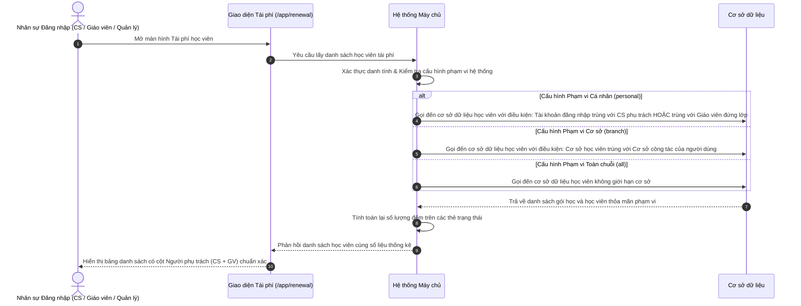

# US-CARE-02-01: Phân quyền & Phân định Phạm vi Dữ liệu Màn hình Tái phí Học viên

> **Tham chiếu:** `BF-CARE-02` · `SR-CSM-002` · `US-SYS-04-04` · `US-SYS-04-06` · Giao diện Mẫu §4.2 (Màn hình Danh sách & Thẻ Thống kê)  
> **Đường dẫn màn hình & Trạng thái liên quan:**  
> - `/app/renewal` $\rightarrow$ Màn hình Tái phí Học viên  
> - `/app/system_config` $\rightarrow$ Màn hình Cấu hình Hệ thống (Bàn điều khiển thử nghiệm phân quyền phạm vi)  
> - **Phiên bản hệ thống:** `v2026.09.15.02.station`

---

## 1. NHẬT KÝ THAY ĐỔI & BỐI CẢNH (CHANGELOG & CONTEXT)

### Lịch sử cập nhật tài liệu (Changelog)

| Ngày cập nhật | Nội dung cập nhật | Lý do cập nhật |
|---|---|---|
| 15/09/2026 | Khởi tạo tài liệu đặc tả phân quyền và phân định phạm vi dữ liệu cho màn hình Tái phí | Tách biệt quyền thao tác chức năng và biên giới phạm vi dữ liệu, loại bỏ thanh thông báo phạm vi thừa trên giao diện nghiệp vụ |
| 15/09/2026 | Bổ sung quy tắc Cụm Người phụ trách (1 - n: Chuyên viên CS và Giáo viên từ lớp) cùng 5 tình huống điều chỉnh khi đổi lớp | Định nghĩa chuẩn xác cơ chế kế thừa và chuyển giao nhân sự phụ trách khi học viên biến động lớp học |
| 15/09/2026 | Tích hợp cơ chế đối soát quyền khi đăng nhập theo cấu hình phạm vi hệ thống và bổ sung kịch bản kiểm thử chi tiết | Đảm bảo tính nhất quán giữa cấu hình phạm vi nền tảng và bộ lọc hiển thị màn hình Tái phí |

### Bối cảnh & Vấn đề nghiệp vụ (Context & Problem)
* **Bối cảnh:** Màn hình Tái phí học viên (`/app/renewal`) là trung tâm theo dõi các gói học sắp kết thúc số buổi hoặc cận ngày hết hạn để đội ngũ chăm sóc khách hàng chủ động liên hệ tư vấn gia hạn. Trước đây, hệ thống đã có sẵn cơ chế phân quyền chức năng kế thừa từ phân hệ quản lý quan hệ khách hàng (quyền truy cập màn hình, xem chi tiết, cập nhật nhật ký, xuất danh sách).
* **Vấn đề hiện tại:** Trước đây màn hình chỉ tải và hiển thị danh sách phẳng toàn bộ học viên hoặc cần người dùng tự tay chọn bộ lọc thủ công. Chưa có cơ chế máy chủ tự động gọt dữ liệu ngầm theo biên giới phân quyền (phạm vi dữ liệu cá nhân hay cơ sở). Đồng thời, cột người phụ trách chưa phản ánh rõ ràng mối liên kết kép giữa chuyên viên chăm sóc dịch vụ và giáo viên đang trực tiếp giảng dạy học sinh tại lớp.
* **Mục tiêu & Giá trị mang lại:** Thiết lập cơ chế kiểm soát biên giới phạm vi dữ liệu tự động gắn liền với tài khoản đăng nhập. Chuẩn hóa định nghĩa Cụm người phụ trách (1 - n) gồm chuyên viên chăm sóc và giáo viên đứng lớp. Khi người dùng đăng nhập, hệ thống tự động đối chiếu cấu hình phạm vi để gọt danh sách và đồng bộ thẻ chỉ số thống kê mà không phô bày các nhãn cảnh báo thừa.

### Hiểu người dùng & Tình huống sử dụng (User Needs & Use Cases)
* **Người dùng chính (Persona):** Chuyên viên Chăm sóc Khách hàng (`PERSONA-CSM`), Giáo viên Giảng dạy (`PERSONA-TEACHER`), Quản lý Cơ sở (`PERSONA-BRANCH_MANAGER`).
* **Nhu cầu thực tế (Needs):** Chuyên viên chăm sóc muốn khi mở màn hình Tái phí là thấy ngay danh sách học viên do mình phụ trách để liên hệ tư vấn; Giáo viên muốn nắm được học sinh nào trong lớp của mình sắp hết hạn để viết nhận xét đánh giá; Quản lý cơ sở muốn nắm bắt toàn bộ học viên tái phí của cơ sở để điều phối chỉ tiêu.
* **Câu phát biểu nghiệp vụ:** **Là một** Chuyên viên Chăm sóc Khách hàng, **tôi muốn** khi truy cập màn hình Tái phí, hệ thống tự động lọc danh sách chỉ hiển thị những học viên do tôi phụ trách hoặc do giáo viên lớp tôi theo dõi, **để** tôi tập trung chăm sóc đúng đối tượng và bảo mật thông tin học viên của trung tâm.

### Phạm vi kiểm soát (Scope & Classification)

| Tiêu chí đánh giá | Nội dung đối soát thực tế | Điểm số (0 / 1) |
|---|---|:---:|
| **Tiêu chí A: Phạm vi ảnh hưởng hệ thống** | Tác động trực tiếp đến màn hình Tái phí và cơ chế phân quyền dữ liệu của phân hệ Chăm sóc | 1 |
| **Tiêu chí B: Tác động tài chính** | Ảnh hưởng đến việc bảo vệ dữ liệu doanh thu tái đăng ký và thông tin khách hàng | 1 |
| **Tiêu chí C1: Loại thay đổi nghiệp vụ** | Bổ sung tầng phân định phạm vi dữ liệu (Cá nhân vs Cơ sở) vào phân quyền chức năng có sẵn | 1 |
| **Tiêu chí C2: Độ mới nghiệp vụ** | Cơ chế phân quyền chức năng đã có, điểm mới là phân tầng phạm vi dữ liệu ngầm | 0 |
| **Tiêu chí D: Liên kết dịch vụ ngoài** | Vận hành trên máy chủ nội bộ, không liên kết dịch vụ đối tác ngoài | 0 |

* **Tổng điểm đánh giá:** 3/5 điểm $\rightarrow$ 🔴 **Risk** (Yêu cầu Quản lý Sản phẩm và Trưởng nhóm Kiểm thử rà soát trước khi triển khai chính thức).

### Bảng Danh mục Chức năng (Feature Scope Matrix)

| Mã Yêu Cầu | Tên Chức Năng | Mức Độ Ưu Tiên | Phân Loại Rủi Ro | Ghi Chú Nghiệp Vụ |
|---|---|:---:|:---:|---|
| **FEAT-01** | Kiểm soát quyền truy cập màn hình Tái phí (`care.renewal.access`) | Bắt buộc (Must) | 🟢 Standard | Chặn người dùng không có quyền truy cập |
| **FEAT-02** | Định nghĩa Cụm Người phụ trách kép (1 - n: Chuyên viên CS và Giáo viên) | Bắt buộc (Must) | 🔴 Risk | Quản lý đồng thời trách nhiệm dịch vụ và học thuật |
| **FEAT-03** | Cơ chế tự động gán và kế thừa Người phụ trách ban đầu | Bắt buộc (Must) | 🟢 Standard | CS kế thừa từ đơn hàng/cơ sở; GV kế thừa từ lớp học |
| **FEAT-04** | Quy tắc tự động điều chỉnh Người phụ trách khi biến động lớp học | Bắt buộc (Must) | 🔴 Risk | 5 tình huống: chuyển lớp, chuyển cơ sở, song song, đệm, bảo lưu |
| **FEAT-05** | Đối soát quyền và lọc dữ liệu ngầm khi đăng nhập theo Cấu hình Hệ thống | Bắt buộc (Must) | 🔴 Risk | Áp dụng cấu hình phạm vi từ màn hình Cấu hình hệ thống |
| **FEAT-06** | Đồng bộ tự động các Thẻ chỉ số trạng thái theo Phạm vi Dữ liệu | Bắt buộc (Must) | 🟢 Standard | Số lượng đếm trên thẻ phản ánh đúng tập dữ liệu được phép xem |
| **FEAT-07** | Bảo mật số điện thoại phụ huynh trên bảng danh sách | Bắt buộc (Must) | 🟢 Standard | Che ẩn số ở giữa dạng 091****111 |

### Quy tắc Nghiệp vụ Toàn cục (Business Rules)
Hệ thống tuân thủ nghiêm ngặt các quy tắc nghiệp vụ sau:
1. **Bản chất thực thể tái phí:** Mỗi dòng bản ghi trên bảng tái phí đại diện cho một gói học sắp hết hạn của học viên, gắn liền với một lớp học cụ thể đang theo học (hoặc trạng thái chờ ghép lớp).
2. **Cụm người phụ trách kép (1 - n):** Mỗi gói học có thể có nhiều người phụ trách thuộc hai tầng: Tầng Dịch vụ (Chuyên viên CS) và Tầng Học thuật (Giáo viên chủ nhiệm lớp học).
3. **Bảo toàn Chuyên viên CS khi đổi lớp:** Khi học viên đổi lớp trong cùng cơ sở, hệ thống chỉ cập nhật lại thông tin giáo viên theo lớp mới; chuyên viên CS phụ trách được giữ nguyên để duy trì tính liền mạch trong tư vấn phụ huynh.
4. **Lọc ngầm tại máy chủ:** Toàn bộ quá trình sàng lọc theo phạm vi dữ liệu phải được thực thi tại máy chủ dựa trên thông tin phiên làm việc của người dùng, không phụ thuộc vào tham số gửi từ giao diện.
5. **Bảo mật số điện thoại chống sao chép:** Trên bảng danh sách chính, mọi số điện thoại liên lạc phải được che định dạng `091****111`. Chỉ tài khoản có quyền xem chi tiết mới được xem số đầy đủ trong bảng thông tin chi tiết.

---

## 2. LUỒNG XỬ LÝ CHÍNH (MAIN FLOW - HAPPY PATH)

---

## 3. GIAO DIỆN & CẤU TRÚC BẢNG DỮ LIỆU (UI & CAPABILITY GATING)

### 3.1. Đặc tả Vòng đời Sự kiện: Người phụ trách từ Lớp học (Dành cho Đội ngũ Phát triển Hệ thống)

> [!IMPORTANT]
> **Quy định phạm vi:** Phần này chuyên sâu đặc tả riêng cho **Người phụ trách học thuật kế thừa từ Lớp học (Giáo viên)**. Người phụ trách dịch vụ (Chuyên viên chăm sóc khách hàng - CS) thuộc luồng nghiệp vụ độc lập và không bị xáo trộn bởi các biến động học thuật.

#### Pha 1: Cơ chế Gán Tự động Lần đầu (Initial Auto-Assignment)
1. **Sự kiện kích hoạt:** Khi gói học của học viên được xếp vào một lớp học cụ thể (thao tác ghép lớp / xếp lớp tại phân hệ Quản lý Lớp học).
2. **Nguồn dữ liệu trích xuất:** Máy chủ tự động đọc thông tin **Giáo viên chủ nhiệm chính thức** của lớp học được ghép để gán vào trường Người phụ trách từ lớp của gói học tái phí.
3. **Trạng thái khi chưa có lớp:** Đối với các gói học mới mua hoặc đang ở trạng thái `Chờ ghép lớp` / `Chưa xếp lớp`, trường Giáo viên mang giá trị rỗng hoặc hiển thị nhãn cảnh báo `Chờ ghép lớp`. Chưa có quyền truy cập học thuật nào được kích hoạt.

#### Pha 2: Danh mục các Sự kiện CÓ KÍCH HOẠT Cập nhật (Trigger Events)
Đội ngũ phát triển cần lắng nghe và xử lý cập nhật trường Giáo viên trên màn Tái phí đối với 5 sự kiện sau:

| Mã Sự Kiện | Tên Sự Kiện Kích Hoạt | Nguồn Phát Sinh | Quy Tắc Xử Lý Cập Nhật Máy Chủ |
|:---:|---|---|---|
| **EVT-01** | **Lớp học đổi Giáo viên chính thức** | Phân hệ Lớp học / Phân công giảng dạy | Quét toàn bộ học viên tái phí đang học tại lớp đó $\rightarrow$ **Tự động đồng bộ sang Giáo viên mới**. |
| **EVT-02** | **Học viên chuyển sang lớp mới** | Phân hệ Xếp lớp / Chuyển lớp | Gỡ Giáo viên của lớp cũ $\rightarrow$ **Gán Giáo viên chủ nhiệm của lớp mới** cho gói học. |
| **EVT-03** | **Lớp học bị Gộp hoặc Giải thể** | Phân hệ Vận hành Lớp học | Chuyển học sinh sang lớp gộp $\rightarrow$ **Tự động gán Giáo viên của lớp gộp mới**. |
| **EVT-04** | **Hết thời gian đệm sau kết thúc lớp (> 30 ngày)** | Tác vụ tự động máy chủ theo mốc thời gian | Sau 30 ngày kể từ buổi học cuối cùng của lớp $\rightarrow$ **Gỡ liên kết Giáo viên**, chỉ còn Chuyên viên CS theo dõi. |
| **EVT-05** | **Học viên xác nhận Bảo lưu gói học** | Phân hệ Bảo lưu & Nghỉ phép | Hoàn tất bảo lưu $\rightarrow$ **Tạm ngắt liên kết Giáo viên** cho đến khi học viên tái nhập học vào lớp mới. |

#### Pha 3: Danh mục các Sự kiện TUYỆT ĐỐI KHÔNG KÍCH HOẠT Cập nhật (Non-trigger Events / Exclusions)
Đội ngũ phát triển cần cấu hình bỏ qua, không kích hoạt cập nhật trường Giáo viên đối với 5 sự kiện sau:

| Mã Bỏ Qua | Tên Sự Kiện Bỏ Qua | Lý Do Nghiệp Vụ Loại Trừ (Rationale) |
|:---:|---|---|
| **IGN-01** | **Giáo viên Dạy thay theo buổi (Cover / Substitute)** | Dạy thay chỉ áp dụng tạm thời cho 1 - 2 ca học đơn lẻ (nghỉ ốm, việc bận). Màn Tái phí chỉ gắn kết với Giáo viên chủ nhiệm chính thức để đánh giá cả lộ trình; không làm lộ hợp đồng tài chính cho giáo viên dạy thay. |
| **IGN-02** | **Học viên đi Học bù tại lớp khác (Makeup Session)** | Học bù là buổi học nhờ tại lớp khác. Biên chế lớp gốc và giáo viên đồng hành của học viên không thay đổi. |
| **IGN-03** | **Lớp học Đổi Ca học, Phòng học hoặc Lịch học** | Chỉ là biến động thuộc tính vận hành không gian/thời gian, không làm thay đổi con người giảng dạy chính thức của lớp. |
| **IGN-04** | **Thay đổi Trợ giảng (TA) của lớp học** | Màn Tái phí chỉ theo dõi Giáo viên giảng dạy chính (người đánh giá năng lực học sinh). Biến động trợ giảng không làm thay đổi cột Giáo viên. |
| **IGN-05** | **Học viên xin Nghỉ học có phép 1 - 2 buổi** | Học viên vẫn duy trì trong danh sách lớp chính thức; không phát sinh thay đổi hợp đồng hay lớp học. |

#### Pha 4: Cơ chế Chuyển giao Quyền hạn & Bảo toàn Dữ liệu (Authority Handover & Immutability)
1. **Cấp quyền cho Giáo viên mới:** Ngay khi sự kiện cập nhật hoàn tất, Giáo viên mới khi đăng nhập với phạm vi *Cá nhân* (`personal`) sẽ lập tức thấy danh sách các học viên tái phí của lớp này để phục vụ viết nhận xét và theo dõi học lực.
2. **Thu hồi quyền của Giáo viên cũ:** Giáo viên cũ tự động bị thu hồi quyền xem danh sách tái phí cá nhân đối với các học viên của lớp này (trừ khi giáo viên đó vẫn đang giảng dạy học viên đó ở một môn học khác).
3. **Bảo toàn lịch sử bất biến (Không ghi đè):** Mọi nhận xét học thuật, đánh giá tiến độ do Giáo viên cũ ghi nhận trước thời điểm chuyển giao được bảo lưu nguyên vẹn trong hồ sơ học viên, hiển thị rõ tên tác giả cũ và mốc thời gian ghi nhận.

### 3.2. Cấu trúc Bảng Danh sách Học viên Tái phí

| Tên Cột Thông Tin | Kiểu Hiển Thị | Nguồn Dữ Liệu | Diễn Giải & Quy Tắc Hiển Thị |
|---|---|---|---|
| **Học viên** | Tên học viên kèm mã định danh mờ | Hồ sơ học viên | Tên in đậm, nhấp để xem chi tiết nếu có quyền |
| **Số điện thoại** | Chữ số che mặt nạ | Thông tin liên hệ phụ huynh | Che bảo mật ở giữa dạng `091****111` |
| **Cơ sở** | Chữ thường | Danh mục cơ sở | Tên cơ sở học viên đang theo học |
| **Gói học & Buổi còn** | Nhãn nổi bật | Dữ liệu khóa học | Số buổi còn lại kèm màu cảnh báo mức độ khẩn |
| **Trạng thái tái phí** | Nhãn trạng thái chuẩn | Tiến trình tư vấn | Màu sắc tương ứng theo tiến trình chăm sóc |
| **Người phụ trách** | Hai dòng thông tin tách biệt (CS + GV) | Phân công nhân sự & Lớp học | Dòng 1: CS [Tên chuyên viên CS]; Dòng 2: GV [Tên giáo viên chủ nhiệm - Tên lớp] |
| **Thao tác** | Nút biểu tượng | Tác vụ nghiệp vụ | Nút gọi điện, ghi nhận ý kiến phụ huynh |

---

## 4. KHỐI CHỨC NĂNG CHI TIẾT: ACTION & TIÊU CHÍ NGHIỆM THU (ACTIONS & ACCEPTANCE CRITERIA)

### Khối chức năng 1: Đối soát Quyền Đăng nhập & Lọc theo Cấu hình Phạm vi

#### Action 1.1: Chuyên viên CS đăng nhập với Phạm vi Cá nhân
* **Luồng kích hoạt:** Người dùng là chuyên viên CS truy cập `/app/renewal` khi hệ thống đang ở cấu hình phạm vi Cá nhân.
* **Tiêu chí nghiệm thu:**
  - **AC-1 (Happy Path - Lọc chính xác học viên CS phụ trách):**
    - **Giả sử:** Tài khoản đăng nhập là chuyên viên chăm sóc "Lan Anh" và hệ thống có 60 học viên tái phí (trong đó có 15 học viên do "Lan Anh" phụ trách).
    - **Khi:** Người dùng truy cập màn hình Tái phí học viên.
    - **Thì:** Bảng danh sách hiển thị đúng 15 học viên của "Lan Anh", các thẻ trạng thái phía trên hiển thị tổng số và phân bổ khớp đúng 15 bản ghi này.

#### Action 1.2: Giáo viên đăng nhập với Phạm vi Cá nhân
* **Luồng kích hoạt:** Người dùng là giáo viên truy cập `/app/renewal` khi hệ thống đang ở cấu hình phạm vi Cá nhân.
* **Tiêu chí nghiệm thu:**
  - **AC-2 (Happy Path - Lọc học viên theo các lớp giáo viên giảng dạy):**
    - **Giả sử:** Tài khoản đăng nhập là giáo viên "Thầy Tuấn", đang đứng lớp 2 lớp học có tổng cộng 8 học viên sắp hết hạn gói học.
    - **Khi:** Giáo viên truy cập màn hình Tái phí học viên.
    - **Thì:** Bảng danh sách hiển thị đúng 8 học viên thuộc 2 lớp mà "Thầy Tuấn" giảng dạy, giúp giáo viên nắm bắt để gửi nhận xét học thuật.

#### Action 1.3: Quản lý Cơ sở đăng nhập với Phạm vi Cơ sở
* **Luồng kích hoạt:** Người dùng là Quản lý cơ sở truy cập `/app/renewal` khi hệ thống đang ở cấu hình phạm vi Cơ sở.
* **Tiêu chí nghiệm thu:**
  - **AC-3 (Happy Path - Hiển thị toàn bộ học viên tái phí trong cơ sở):**
    - **Giả sử:** Tài khoản đăng nhập là Quản lý cơ sở Cầu Giấy, nơi có 45 học viên tái phí phân bổ cho 4 chuyên viên CS và nhiều giáo viên khác nhau.
    - **Khi:** Người dùng truy cập màn hình Tái phí học viên.
    - **Thì:** Bảng danh sách hiển thị toàn bộ 45 học viên thuộc cơ sở Cầu Giấy, đầy đủ thông tin cả CS và GV trên từng dòng bản ghi.

### Khối chức năng 2: Cơ chế Điều chỉnh Người phụ trách khi Đổi Lớp hoặc Đổi Giáo viên Lớp

#### Action 2.1: Chuyển lớp cho học viên trên hệ thống
* **Luồng kích hoạt:** Bộ phận học vụ thực hiện thao tác chuyển lớp cho học viên từ lớp A sang lớp B.
* **Tiêu chí nghiệm thu:**
  - **AC-4 (Happy Path - Tự động cập nhật giáo viên mới, giữ nguyên CS):**
    - **Giả sử:** Học viên "Nguyễn Văn An" đang có chuyên viên CS là "Lan Anh" và giáo viên là "Cô Mai - Lớp Toán 01".
    - **Khi:** Học vụ chuyển học sinh "Nguyễn Văn An" sang "Lớp Toán 02" do "Thầy Hùng" giảng dạy.
    - **Thì:** Tại màn hình Tái phí, dòng Người phụ trách của học viên tự động cập nhật giáo viên thành "Thầy Hùng - Lớp Toán 02", trong khi chuyên viên CS vẫn giữ nguyên là "Lan Anh".

#### Action 2.2: Phân công hoặc Đổi Giáo viên phụ trách của Lớp học đang vận hành
* **Luồng kích hoạt:** Quản lý cơ sở hoặc nhân viên học vụ thực hiện thay đổi Giáo viên chính thức của một lớp học đang có học sinh theo học.
* **Tiêu chí nghiệm thu:**
  - **AC-5 (Happy Path - Lớp đổi giáo viên, màn Tái phí tự động cập nhật đồng loạt):**
    - **Giả sử:** Lớp "Lớp Toán 01" đang có 12 học viên tái phí và giáo viên phụ trách lớp là "Cô Mai".
    - **Khi:** Quản trị viên thực hiện đổi giáo viên phụ trách của "Lớp Toán 01" sang "Thầy Hoàng".
    - **Thì:** Tại màn hình Tái phí, toàn bộ 12 học viên của lớp này tự động cập nhật dòng Giáo viên thành "Thầy Hoàng - Lớp Toán 01", chuyên viên CS vẫn giữ nguyên; khi "Thầy Hoàng" đăng nhập với phạm vi Cá nhân sẽ thấy 12 học viên này, còn "Cô Mai" không còn thấy trong danh sách cá nhân nữa.
  - **AC-6 (Happy Path - Bảo toàn lịch sử nhận xét của giáo viên tiền nhiệm):**
    - **Giả sử:** "Cô Mai" đã ghi nhận các nhận xét đánh giá học thuật cho học viên trước thời điểm chuyển giao lớp.
    - **Khi:** "Thầy Hoàng" tiếp nhận lớp và mở bảng thông tin chi tiết của học viên trên màn Tái phí.
    - **Thì:** Toàn bộ lịch sử nhận xét do "Cô Mai" viết trước đó vẫn được bảo toàn nguyên vẹn, hiển thị rõ tên tác giả "Cô Mai" kèm thời gian ghi nhận và không bị ghi đè.

---

## 5. CÁC TRƯỜNG HỢP GÓC CẠNH (CORNER CASES)

- **Trường hợp 1 (Gói học chưa được ghép lớp):** Với học viên mới đóng phí hoặc đang chờ mở lớp mới, dòng Giáo viên hiển thị trạng thái `Chờ ghép lớp` màu vàng cam; chỉ chuyên viên CS phụ trách xuất hiện trong danh sách.
- **Trường hợp 2 (Giáo viên dạy thay đột xuất):** Khi lớp học có giáo viên dạy thay tạm thời trong 1-2 buổi, hệ thống vẫn giữ nguyên Giáo viên chủ nhiệm chính thức trên cột Người phụ trách của màn Tái phí.
- **Trường hợp 3 (Chuyên viên CS nghỉ việc hoặc chuyển công tác):** Khi tài khoản CS bị khóa, hệ thống kích hoạt thông báo cần phân bổ lại cho các học viên của CS đó để Quản lý cơ sở gán người tiếp nhận mới.
- **Trường hợp 4 (Học viên cùng lúc có 2 gói học tại 2 cơ sở khác nhau):** Hệ thống hiển thị 2 dòng gói học riêng biệt, mỗi dòng tuân thủ đúng cơ sở và cụm người phụ trách của gói đó.
- **Trường hợp 5 (Học viên bảo lưu dài hạn):** Khi học viên bảo lưu, dòng bản ghi ẩn khỏi danh sách cần tư vấn ngay và chuyển vào trạng thái theo dõi định kỳ của chuyên viên CS.
- **Trường hợp 6 (Tìm kiếm học viên của đồng nghiệp khi đang ở phạm vi Cá nhân):** Khi người dùng nhập tên học viên không do mình phụ trách vào ô tìm kiếm nhanh, hệ thống phản hồi kết quả trống nhằm bảo mật dữ liệu tuyệt đối.

---

## 6. LUỒNG NGOẠI LỆ & XỬ LÝ SỰ CỐ (EXCEPTION FLOW)

- **Ngoại lệ 1 (Mất kết nối máy chủ khi đang tải danh sách):** Nếu đường truyền mạng gián đoạn quá 10 giây, giao diện hiển thị thông báo lỗi kết nối và nút bấm thử lại mà không làm mất trạng thái bộ lọc đang chọn.
- **Ngoại lệ 2 (Hết phiên làm việc trong khi đang thao tác):** Khi phiên đăng nhập hết hạn, hệ thống tự động lưu lại bản nháp nội dung tương tác đang soạn thảo và điều hướng an toàn về màn hình đăng nhập.
- **Ngoại lệ 3 (Tài khoản bị thu hồi quyền truy cập màn hình):** Nếu quản trị viên thu hồi quyền `care.renewal.access`, giao diện thông báo tài khoản không đủ quyền và chuyển hướng về màn hình tổng quan.

---

## 7. QUY TẮC KIỂM SOÁT & RÀNG BUỘC DỮ LIỆU (VALIDATION RULES)

- **Ràng buộc 1 (Tính duy nhất của gói học):** Mỗi dòng trên bảng tái phí phải có mã gói học duy nhất để tránh hiển thị trùng lặp khi một học viên có nhiều môn học.
- **Ràng buộc 2 (Định dạng che mặt nạ số điện thoại):** Số điện thoại hiển thị trên bảng bắt buộc phải theo cấu trúc `091****111`, chỉ mở số đầy đủ khi có quyền mở bảng chi tiết.
- **Ràng buộc 3 (Bắt buộc có ít nhất một người phụ trách):** Một gói học khi bước vào giai đoạn tái phí bắt buộc phải có thông tin Chuyên viên CS phụ trách hoặc cờ cảnh báo chưa phân công.

---

## 8. YÊU CẦU PHI CHỨC NĂNG (NON-FUNCTIONAL REQUIREMENTS)

- **Thời gian phản hồi:** Máy chủ xử lý truy vấn danh sách tái phí và tính toán số liệu thẻ trạng thái trong thời gian dưới 1 giây.
- **Bảo mật dữ liệu:** Tuyệt đối không gửi các bản ghi ngoài phạm vi dữ liệu xuống giao diện người dùng.
- **Độ tin cậy:** Cơ chế cập nhật giáo viên khi đổi lớp phải đồng bộ tức thì, không xảy ra hiện tượng hiển thị sai lệch giữa phân hệ lớp học và phân hệ chăm sóc.

---

## 9. KẾT NỐI MÁY CHỦ & DỮ LIỆU PHẢN HỒI (SERVER SPECIFICATION)

- **Yêu cầu lấy dữ liệu tái phí:** Giao diện gửi yêu cầu kèm mã phiên đăng nhập và các tham số lọc trạng thái tiến trình.
- **Quy trình xử lý tại máy chủ:** Máy chủ xác thực người dùng, trích xuất cấu hình phạm vi dữ liệu (`personal`, `branch` hoặc `all`), bổ sung điều kiện truy vấn đối chiếu Cụm người phụ trách và tính toán số lượng đếm trên các thẻ trạng thái.
- **Dữ liệu phản hồi:** Máy chủ trả về gói dữ liệu bao gồm danh sách các gói học thỏa mãn phạm vi cùng bảng số liệu thống kê đã được tính toán đồng bộ.
