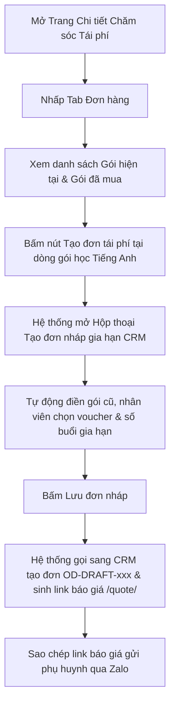

# US-CARE-02-02: Màn hình Chi tiết Chăm sóc Tái phí & Tab Đơn hàng - Liên thông Tạo đơn CRM & Gia hạn Khóa học

> **Tham chiếu:** `BF-CARE-02` · `FLOW-CARE-02` · `SR-CSM-002` · `[DS-P2]` · `[DS-P4]` · `[POLICY-DS-04]` · `[POLICY-DS-05]`  
> **Vị trí màn hình:** Trang Chi tiết Chăm sóc Tái phí (`StudentCareDetailPage` - Cột trái & Tab Đơn hàng)

---

## 1. NHẬT KÝ THAY ĐỔI & BỐI CẢNH (CHANGELOG & CONTEXT)

### Lịch sử cập nhật tài liệu (Changelog)

| Ngày cập nhật | Nội dung cập nhật | Lý do cập nhật |
|---|---|---|
| 14/08/2026 | Phát hành tài liệu US-CARE-02-02 | Đặc tả chi tiết cột trái màn hình chi tiết, Tab Đơn hàng, nút Tạo đơn liên thông CRM và cơ chế tạo đơn nháp gia hạn khóa học |

### 1.1. Bối cảnh nghiệp vụ (Business Context)
Khi nhân viên Chăm sóc Khách hàng (CSM) tiếp cận học viên đến hạn học phí, việc nắm bắt bức tranh toàn cảnh về hồ sơ học viên, lịch sử các gói học đã mua, số buổi đã hoàn thành và khả năng tạo nhanh đơn nháp gia hạn (liên thông sang hệ thống CRM) là điều kiện tiên quyết để thúc đẩy tỷ lệ tái phí thành công.

### 1.2. Vấn đề nghiệp vụ (Problem Statement)
- Nhân viên phải chuyển đổi qua lại giữa nhiều phân hệ để tra cứu hợp đồng cũ và tạo đơn báo giá mới cho phụ huynh.
- Khởi tạo đơn gia hạn thủ công dễ gây nhầm lẫn thông tin gói học gốc, dẫn đến sai lệch dữ liệu đối soát tỷ lệ giữ chân học viên (Retention).
- Chưa có cơ chế xem tổng hợp đơn hàng của các con khác trong cùng một gia đình để tư vấn chính sách ưu đãi combo.

### 1.3. Mục tiêu (Key Objectives)
- Tích hợp cụm thông tin hồ sơ 360 độ của học viên (ảnh đại diện, họ tên, trạng thái, địa chỉ, danh sách liên hệ gia đình, ghi chú dài hạn).
- Xây dựng Tab Đơn hàng trực quan gồm 3 phần: Gói hiện tại (kèm số lượng), Gói đã mua (lịch sử gói đã kết thúc), Lịch sử chuyển phí.
- Cung cấp nút **[Tạo đơn]** trên cùng và hành động **[Tạo đơn tái phí]** trực tiếp trên từng gói học hiện tại để khởi tạo đơn nháp gia hạn gọi sang hệ thống CRM và sinh đường link báo giá trực tuyến `/quote/`.
- Hỗ trợ ô chọn "Xem đơn các con khác" trong gia đình để nắm toàn cảnh lịch sử đóng phí của phụ huynh.

### 1.4. Giá trị mang lại (Business Value & Impact)
- Giảm 70% thời gian tạo đơn gia hạn cho nhân viên nhờ cơ chế tự động kế thừa mã gói và mã đơn cũ.
- Tăng tỷ lệ chốt đơn thành công nhờ cung cấp đường link báo giá trực tuyến chuyên nghiệp cho phụ huynh.

### 1.5. Phạm vi chức năng tổng quan (Functional Scope Overview)
1. **Cụm Header Hồ sơ Học viên:** Hiển thị thông tin cá nhân, liên hệ gia đình có che số bảo mật và ô ghi chú nhanh.
2. **Khối chuyển Tab Cột trái:** Chuyển đổi giữa Tab "Học tập" (tra cứu điểm số, chuyên cần) và Tab "Đơn hàng" (quản lý hợp đồng & tạo đơn nháp).
3. **Tab Đơn hàng - Gói hiện tại:** Hiển thị thẻ gói học đang diễn ra, số buổi còn lại, nút "Tạo đơn tái phí" kế thừa mã đơn cũ.
4. **Tab Đơn hàng - Gói đã mua & Chuyển phí:** Lưu vết lịch sử các đơn hàng đã thanh toán và các giao dịch chuyển số buổi giữa các gói.
5. **Nút Tạo đơn & Hộp thoại Tạo đơn nháp Gia hạn CRM:** Khởi tạo đơn nháp gia hạn, chọn gói cần gia hạn, cấu hình học kỳ/số buổi, áp dụng voucher khuyến mại, chia đợt thanh toán và sinh link báo giá.

### 1.6. Ma trận danh sách chức năng (Feature Scope Matrix)

| Mã chức năng | Tên chức năng | Mô tả ngắn | Mức ưu tiên | Nhãn |
|---|---|---|---|---|
| `FEAT-ORD-01` | Cụm Header Hồ sơ & Điều hướng Tab | Hiển thị hồ sơ học viên 360 độ, ghi chú dài hạn và thanh chuyển tab Học tập / Đơn hàng | Must | Bắt buộc |
| `FEAT-ORD-02` | Danh mục Gói hiện tại & Xem đơn con khác | Thẻ hiển thị gói học đang diễn ra, số buổi còn lại và ô chọn xem đơn của các con khác trong gia đình | Must | Bắt buộc |
| `FEAT-ORD-03` | Nút Tạo đơn & Hành động Tạo đơn tái phí | Khởi tạo đơn nháp gia hạn gọi sang CRM, tự động kế thừa mã gói và mã đơn nguồn cũ | Must | Bắt buộc |
| `FEAT-ORD-04` | Cấu hình Gia hạn, Khuyến mại & Báo giá | Chọn gói cần gia hạn, áp dụng voucher ưu đãi, chia đợt thanh toán (đặt cọc) và sinh đường link báo giá trực tuyến | Must | Bắt buộc |

---

## 2. LUỒNG XỬ LÝ CHÍNH (MAIN FLOW - HAPPY PATH)

* **Bước 1:** Người dùng mở Trang Chi tiết Chăm sóc Tái phí của học viên từ danh sách.
* **Bước 2:** Nhấp chọn Tab **"Đơn hàng"** trên thanh điều hướng cột trái.
* **Bước 3:** Hệ thống hiển thị các gói học hiện tại của học viên. Người dùng có thể tích chọn "Xem đơn các con khác" nếu phụ huynh có nhiều con.
* **Bước 4:** Người dùng nhấp vào nút **[Tạo đơn tái phí]** tại thẻ gói học cần gia hạn (hoặc nút **[Tạo đơn]** ở góc trên bên phải).
* **Bước 5:** Hộp thoại tạo đơn nháp hiển thị với thông tin gói học cũ được điền sẵn; người dùng chọn loại "Gia hạn", chọn gói sản phẩm mới, chọn thời lượng (ví dụ: 40 buổi), áp dụng mã giảm giá và đợt thanh toán.
* **Bước 6:** Người dùng bấm **Lưu đơn nháp**. Hệ thống gửi yêu cầu gọi đến Nghiệp vụ Đơn hàng CRM để lưu bản ghi đơn nháp `OD-DRAFT-xxx` và trả về đường link báo giá trực tuyến `/quote/OD-DRAFT-xxx`.
* **Bước 7:** Người dùng bấm biểu tượng sao chép đường link báo giá để gửi cho phụ huynh.

---

## 3. GIAO DIỆN & TRẠNG THÁI TĨNH (DATA & UI STATE)

### 3.1. Thiết kế trực quan
* **Giao diện tham chiếu:** Cột trái Trang Chi tiết Chăm sóc Học viên & Tab Đơn hàng (`StudentOrdersTab`).

### 3.2. RÀNG BUỘC VÀ QUY TẮC KIỂM TRA DỮ LIỆU (VALIDATION RULES)

#### A. Cụm Header Hồ sơ Học viên (Cột trái trên cùng)

| Thành phần giao diện | Kiểu hiển thị | Nguồn dữ liệu | Các tùy chọn chọn lựa | Logic xử lý & Ràng buộc hiển thị |
|---|---|---|---|---|
| **Nút Quay lại** | Nút bấm biểu tượng mũi tên | Hệ thống | Quay lại danh sách | Nhấp vào đóng trang chi tiết và trở về màn hình danh sách tái phí `/app/renewal`. |
| **Ảnh đại diện Học viên** | Hình tròn ảnh / chữ viết tắt | Cơ sở dữ liệu học viên | Ảnh đại diện theo học viên | Nhấp vào mở hộp thoại hồ sơ học viên đầy đủ. Rê chuột hiển thị thẻ thông tin nhanh. |
| **Họ tên & Trạng thái** | Văn bản in đậm + Huy hiệu trạng thái | Cơ sở dữ liệu học viên | Tên tiếng Việt, Tên tiếng Anh; Huy hiệu: `Đang học`, `Chờ chuyển lớp`, `Bảo lưu` | Hiển thị tên chính thức và tên tiếng Anh (nếu có). Huy hiệu trạng thái đổi màu tương ứng theo chuẩn hệ thống. |
| **Thông tin cá nhân** | Văn bản dòng đơn kèm icon | Cơ sở dữ liệu học viên | Năm sinh, Địa chỉ cư trú | Hiển thị năm sinh và địa chỉ rút gọn của học viên. |
| **Danh sách Phụ huynh** | Khối danh sách liên hệ | Cơ sở dữ liệu học viên | Bố, Mẹ, Người giám hộ | Hiển thị tên và số điện thoại phụ huynh. Cho phép mở rộng / thu gọn danh sách liên hệ. |
| **Ô Ghi chú học viên** | Khối văn bản cho phép chỉnh sửa | Cơ sở dữ liệu học viên | Văn bản tự do | Cho phép nhân viên bấm biểu tượng cây bút để cập nhật ghi chú dài hạn về tính cách/nhu cầu của học viên $\rightarrow$ Bấm Lưu để cập nhật. |

#### B. Tab Đơn hàng - Danh mục Gói học & Tác nghiệp

| Thành phần giao diện | Kiểu hiển thị | Nguồn dữ liệu | Các tùy chọn chọn lựa | Logic xử lý & Ràng buộc hiển thị |
|---|---|---|---|---|
| **Thanh chuyển Tab Cột trái** | Cụm nút chuyển tab ngang | Hệ thống | 1. **Học tập** (Biểu tượng mũ cử nhân) 2. **Đơn hàng (n)** (Biểu tượng hóa đơn kèm số đếm) | Chuyển đổi nội dung hiển thị của cột trái giữa báo cáo học thuật và quản lý đơn hàng. |
| **Ô chọn Xem đơn các con khác** | Hộp kiểm | Hệ thống | Bật (Đã chọn) / Tắt (Bỏ chọn - Mặc định) | Khi phụ huynh có từ 2 con trở lên học tại trung tâm, tích chọn để hiển thị thêm các đơn hàng của các con khác trong cùng gia đình. |
| **Nút Tạo đơn (Góc trên phải)** | Nút bấm màu xanh tím kèm icon cộng | Hệ thống | Mở form tạo đơn mới | Nhấp vào mở Hộp thoại Tạo đơn nháp gia hạn gọi sang CRM để tạo đơn hàng mới cho học viên. |
| **Khối Gói hiện tại** | Danh sách thẻ gói học | Cơ sở dữ liệu gói học & đơn hàng | Gói học đang có hiệu lực | Hiển thị thẻ gói học: Tên sản phẩm, Mã đơn, Số buổi còn lại, Đơn giá, Đợt thanh toán, Nút mở rộng xem lịch sử thanh toán. |
| **Nút Tạo đơn tái phí (Trên từng gói)** | Nút bấm thao tác trên thẻ gói | Hệ thống | Khởi tạo đơn gia hạn từ gói này | Nhấp vào tự động mở hộp thoại tạo đơn với `sourceOrderNo` và `sourcePackageName` được gắn sẵn từ gói học này. |
| **Khối Gói đã mua** | Danh sách thẻ gói học thu gọn | Cơ sở dữ liệu đơn hàng | Các gói học đã hoàn thành | Hiển thị lịch sử các gói học cũ trong quá khứ kèm trạng thái hoàn thành. |
| **Khối Lịch sử chuyển phí** | Danh sách dòng giao dịch | Cơ sở dữ liệu chuyển phí | Các giao dịch điều chuyển số buổi | Hiển thị ngày chuyển, gói nguồn, gói đích, số buổi chuyển và lý do. |

#### C. Hộp thoại Tạo Đơn Nháp Gia hạn CRM (`DraftOrderEditorDialog`)

| Trường thông tin | Kiểu ô chọn / Nhập liệu | Nguồn dữ liệu | Ràng buộc dữ liệu | Logic xử lý nghiệp vụ |
|---|---|---|---|---|
| **Học viên thụ hưởng** | Ô chọn tài khoản con | Cơ sở dữ liệu học viên | Bắt buộc chọn | Mặc định chọn học viên đang mở chi tiết. Nếu có nhiều con, cho phép chọn con khác trong gia đình. |
| **Loại đơn hàng** | Nút chọn radio | Hệ thống | `Mua mới` / `Gia hạn` (Mặc định khi tạo tái phí) | Khi chọn `Gia hạn`, hiển thị thêm ô chọn "Gói cần gia hạn". |
| **Gói cần gia hạn** | Ô chọn thả xuống | Cơ sở dữ liệu gói học của học viên | Bắt buộc khi chọn loại Gia hạn | Nạp danh sách các gói học hiện tại của học viên để liên kết gia hạn. |
| **Sản phẩm khóa học mới** | Ô chọn thả xuống | Danh mục sản phẩm | Bắt buộc chọn | Chọn gói sản phẩm cho khóa học tiếp theo (VD: `[DUO] Gia hạn Tiếng Anh 1 năm`). |
| **Thời lượng / Số buổi** | Ô nhập số / chọn gói | Danh mục sản phẩm | Số nguyên dương $> 0$ | Mặc định theo gói (VD: 40 buổi hoặc 80 buổi). |
| **Đơn giá gốc** | Ô số tiền (VND) | Danh mục sản phẩm | Tự động điền theo sản phẩm | Hiển thị đơn giá niêm yết của khóa học. |
| **Mã ưu đãi / Voucher** | Ô chọn voucher kèm nút tìm | Danh mục khuyến mại CRM | Tùy chọn | Chọn voucher hợp lệ (VD: Giảm 10% tái phí sớm, Giảm 1.000.000đ combo). |
| **Thành tiền thanh toán** | Ô số tiền hiển thị tự động | Hệ thống tính toán | `Thành tiền = Đơn giá - Giảm giá` | Tự động tính toán lại số tiền cuối cùng sau khi áp dụng chiết khấu/voucher. |
| **Hình thức thanh toán** | Ô chọn thả xuống | Hệ thống | Chuyển khoản, Tiền mặt, Cọc giữ chỗ (50%), Trả góp | Thiết lập hình thức thanh toán dự kiến cho đơn nháp. |

---

## 4. KHỐI CHỨC NĂNG & TIÊU CHÍ CHẤP NHẬN (ACCEPTANCE CRITERIA)

### Action 1.1: Cụm Header Hồ sơ & Điều hướng Tab
* **Tiêu chí nghiệm thu (Acceptance Criteria):**
  - **AC-1 (Happy Path - Chuyển sang Tab Đơn hàng):**
    - **Giả sử:** Người dùng mở trang chi tiết học viên.
    - **Khi:** Nhấp vào tab "Đơn hàng (2)".
    - **Thì:** Cột trái chuyển sang hiển thị danh sách hợp đồng và gói học với 2 gói học hiện tại.
  - **AC-2 (Happy Path - Cập nhật Ghi chú dài hạn):**
    - **Giả sử:** Người dùng bấm biểu tượng cây bút tại ô Ghi chú học viên, nhập nội dung "Phụ huynh muốn đổi ca tối thứ 7".
    - **Khi:** Bấm nút Lưu ghi chú.
    - **Thì:** Ghi chú mới được hiển thị ngay lập tức và lưu vào cơ sở dữ liệu học viên.

### Action 1.2: Danh mục Gói hiện tại & Xem đơn con khác
* **Tiêu chí nghiệm thu (Acceptance Criteria):**
  - **AC-3 (Happy Path - Bật xem đơn con khác):**
    - **Giả sử:** Phụ huynh có 2 con (Nguyễn Hà Phương và Nguyễn Hải Đăng).
    - **Khi:** Người dùng tích chọn ô "Xem đơn các con khác".
    - **Thì:** Danh sách hiển thị thêm các gói học của em Nguyễn Hải Đăng với nhãn phân biệt rõ ràng.
  - **AC-4 (Happy Path - Xem lịch sử chuyển phí):**
    - **Giả sử:** Học viên từng chuyển 5 buổi từ môn Tiếng Anh sang Toán.
    - **Khi:** Người dùng cuộn xuống phần Lịch sử chuyển phí.
    - **Thì:** Hệ thống hiển thị chính xác dòng giao dịch với đầy đủ ngày tháng và số buổi đã chuyển.

### Action 1.3: Nút Tạo đơn & Hành động Tạo đơn tái phí từ gói học nguồn
* **Tiêu chí nghiệm thu (Acceptance Criteria):**
  - **AC-5 (Happy Path - Tạo đơn tái phí kế thừa gói cũ):**
    - **Giả sử:** Người dùng bấm nút [Tạo đơn tái phí] tại thẻ gói "Ielts Intermediate 5.0" (mã đơn cũ `OD800436`).
    - **Khi:** Hộp thoại mở ra.
    - **Thì:** Hệ thống tự động điền loại đơn là `Gia hạn`, gắn mã đơn nguồn `OD800436` và chọn gói cần gia hạn là "Ielts Intermediate 5.0".
  - **AC-6 (Happy Path - Tạo đơn nháp liên thông gọi sang CRM):**
    - **Giả sử:** Người dùng hoàn tất thông tin gói mới và bấm [Lưu đơn nháp].
    - **Khi:** Bấm lưu đơn hàng.
    - **Thì:** Hệ thống gọi đến Nghiệp vụ Đơn hàng CRM, khởi tạo mã đơn nháp `OD-DRAFT-xxxx` và hiển thị thẻ đơn hàng nháp màu vàng trên đầu danh sách.

### Action 1.4: Cấu hình Gia hạn, Khuyến mại & Sinh link Báo giá
* **Tiêu chí nghiệm thu (Acceptance Criteria):**
  - **AC-7 (Happy Path - Áp dụng Voucher giảm giá):**
    - **Giả sử:** Gói học có giá 35.000.000đ.
    - **Khi:** Người dùng chọn voucher "RENEWAL10 - Giảm 10%".
    - **Thì:** Hệ thống tự động trừ 3.500.000đ và cập nhật thành tiền là 31.500.000đ.
  - **AC-8 (Happy Path - Sao chép link Báo giá trực tuyến):**
    - **Giả sử:** Đơn nháp `OD-DRAFT-9238` đã được tạo.
    - **Khi:** Người dùng bấm biểu tượng sao chép link báo giá.
    - **Thì:** Hệ thống sao chép đường dẫn `/quote/OD-DRAFT-9238` vào bộ nhớ đệm và hiển thị thông báo "Đã sao chép link báo giá gửi phụ huynh!".

---

## 5. CÁC TRƯỜNG HỢP GÓC CẠNH (CORNER CASES)

* **5.1. Học viên chưa từng mua gói học nào (Học viên mới):** Tab Đơn hàng hiển thị hình ảnh trạng thái rỗng kèm nút [Tạo đơn mới] để khởi tạo hợp đồng đầu tiên cho học viên.
* **5.2. Gói học cũ đã hết hạn quá 90 ngày:** Khi tạo đơn tái phí từ gói học này, hệ thống hiển thị cảnh báo nhẹ: "Gói học đã kết thúc hơn 3 tháng, vui lòng kiểm tra lại trình độ đầu vào của học viên trước khi gia hạn".
* **5.3. Mã giảm giá / Voucher đã hết hạn hoặc không đủ điều kiện:** Hệ thống hiển thị thông báo từ chối áp dụng voucher kèm lý do cụ thể và giữ nguyên giá gốc.
* **5.4. Xóa đơn hàng nháp chưa thanh toán:** Khi người dùng bấm icon thùng rác tại đơn nháp, hệ thống hiển thị hộp thoại xác nhận: "Bạn có chắc chắn muốn xóa đơn nháp gia hạn này?". Khi xác nhận, đơn nháp được xóa và giải phóng liên kết gói nguồn.
* **5.5. Học viên có nhiều đơn hàng nháp cùng lúc:** Hệ thống sắp xếp đơn nháp mới nhất lên trên cùng và gắn nhãn cảnh báo nếu có 2 đơn nháp cùng cho một môn học.

---

## 6. YÊU CẦU PHI CHỨC NĂNG & PHÂN QUYỀN

* **Thời gian xử lý:** Khởi tạo đơn nháp và sinh link báo giá $\le 1.0$ giây.
* **Phân quyền người dùng:**
  * Nhân viên CSM: Được quyền xem danh sách đơn hàng, tạo đơn nháp gia hạn và sao chép link báo giá cho học viên mình phụ trách.
  * Quản lý cơ sở (BM): Có toàn quyền xem, tạo, sửa, xóa đơn nháp và phê duyệt chiết khấu đặc biệt cho toàn cơ sở.
  * Giáo viên: Chỉ xem danh sách gói học và số buổi còn lại ở chế độ chỉ đọc.

---

## 7. PHỤ LỤC: KIỂM TRA CHẤT LƯỢNG (Checklist B)

- [x] **Acceptance Criteria (AC):** Đầy đủ 4 nhóm chức năng chính, định dạng Giả sử - Khi - Thì, bao phủ cả happy path và exception path.
- [x] **Ngôn ngữ tự nhiên 100%:** Tuân thủ tuyệt đối quy tắc `[POLICY-DS-05]`, không chứa dev jargon (sử dụng *gọi đến Nghiệp vụ Đơn hàng CRM*, *giao diện*, *hộp thoại nổi*).
- [x] **Bảng mô tả giao diện 5 cột:** Tuân thủ chuẩn 5 cột tại Mục 3.2.
- [x] **Corner Cases $\ge 5$:** Định nghĩa đầy đủ 5 trường hợp ngoại lệ tại Mục 5.
- [x] **Quy tắc bảo mật:** Tuân thủ `[DS-P4]` xác nhận trước khi xóa đơn nháp gia hạn.
