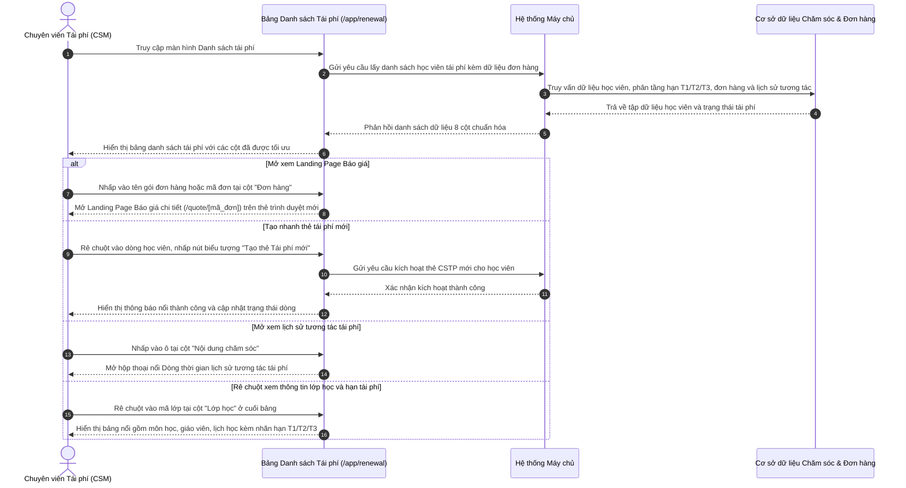

# US-CARE-02-02: Màn hình Danh sách Tái phí - Đặc tả Thay đổi Cấu trúc Các Cột Dữ liệu

> **Tham chiếu:** `BF-CARE-02` · `PERSONA-CSM` · `PERSONA-BRANCH-MANAGER`  
> **Đường dẫn màn hình & Trạng thái liên quan:**  
> - `/app/renewal` -> Trạng thái tái phí: `Mới`, `Tiềm năng`, `Cân nhắc`, `Hẹn tái`, `Đã tái phí`, `Từ chối` | Phân tầng hạn học phí: `Hạn T1 (< 1T)`, `Hạn T2 (1-2T)`, `Hạn T3 (2-3T)`

---

## 1. NHẬT KÝ THAY ĐỔI & BỐI CẢNH (CHANGELOG & CONTEXT)

### Lịch sử cập nhật tài liệu (Changelog)

| Ngày cập nhật | Nội dung cập nhật | Lý do cập nhật |
|---|---|---|
| 23/09/2026 | Phát hành tài liệu đặc tả cập nhật cấu trúc các cột bảng danh sách tái phí (/app/renewal) | Chuẩn hóa bảng dữ liệu từ hệ thống hiện tại sang phiên bản mới: tinh giản cột, bảo mật số điện thoại, nâng cấp tương tác đơn hàng và chuyển vị trí cột lớp học. |

### Bối cảnh & Mục tiêu thay đổi (Context & Objectives)
* **Bối cảnh:** Màn hình Quản lý Tái phí (`/app/renewal`) là không gian nghiệp vụ chuyên sâu của Chuyên viên chăm sóc khách hàng (CSM) và Quản lý cơ sở để theo dõi danh sách học viên sắp đến kỳ đóng phí mới, đôn đốc gia hạn và chốt đơn hàng khóa học tiếp theo.
* **Vấn đề trên giao diện bảng hiện tại:**
  1. *Cột dữ liệu trùng lặp và phân tán sự chú ý:* Cột "Gói sản phẩm" độc lập chiếm nhiều diện tích nhưng lặp lại thông tin môn học; cột "Phụ trách" hiển thị danh sách dài cả giáo viên giảng dạy làm rối mắt chuyên viên tái phí vốn chỉ cần quan tâm đầu mối CS.
  2. *Thiếu an toàn dữ liệu khách hàng:* Số điện thoại hiển thị công khai hoặc che sơ sài, gắn liền với biểu tượng gọi điện và sao chép trực tiếp trên từng dòng, tiềm ẩn rủi ro sao chép danh sách khách hàng hàng loạt.
  3. *Tương tác đơn hàng rời rạc:* Cột "Đơn hàng" hiển thị dưới dạng văn bản tĩnh, không có liên kết mở xem báo giá hay chi tiết gói học, gây mất thời gian tra cứu chéo.
  4. *Thông tin hạn tái phí bị tách rời khỏi lớp học:* Cột "Lớp học" đặt ở giữa bảng (cột 4) thiếu gắn kết với thời hạn kết thúc của gói học và các mốc phân tầng hạn tái phí (T1, T2, T3).
* **Phạm vi trọng tâm thay đổi:** Tài liệu này **chỉ tập trung mô tả các thay đổi về cột dữ liệu** trên bảng chính (không bao gồm khối chỉ số thống kê hay các bộ lọc ngoài phạm vi bảng), bao gồm:
  - Bổ sung thao tác nhanh tạo thẻ tái phí mới khi di chuột tại cột Học viên.
  - Áp dụng nguyên tắc che số điện thoại bảo mật và loại bỏ biểu tượng gọi/sao chép trần tại cột Liên hệ.
  - Đổi tên cột "Phụ trách" thành "Người chăm sóc", chỉ hiển thị duy nhất Chuyên viên CS phụ trách ca tái phí.
  - Tích hợp liên kết mở Landing Page Báo giá trực tiếp tại cột Đơn hàng.
  - Lược bỏ cột "Gói sản phẩm" độc lập; điều chuyển cột "Lớp học" về cuối bảng và gắn liền nhãn phân tầng hạn (T1/T2/T3).
  - Tối ưu cột "Nội dung chăm sóc" với thời gian tương đối và lịch hẹn gọi lại.

### Hiểu người dùng & Tình huống sử dụng (User Needs & Use Cases)
* **Người dùng chính (Persona):** Chuyên viên chăm sóc khách hàng (`PERSONA-CSM`) và Quản lý cơ sở (`PERSONA-BRANCH-MANAGER`).
* **Nhu cầu thực tế:** Cần nhìn thấy rõ ràng chuyên viên chăm sóc phụ trách, thông tin đơn hàng báo giá có liên kết mở nhanh, tiến độ tương tác gần nhất và thời hạn kết thúc lớp học được phân cấp rõ ràng theo mức độ khẩn cấp.
* **Câu phát biểu nghiệp vụ:** **Là một** Chuyên viên chăm sóc khách hàng phụ trách tái phí, **tôi muốn** các cột dữ liệu được tinh gọn, có liên kết mở báo giá đơn hàng và hạn kết thúc được phân tầng rõ rệt, **để** tôi xử lý ca tái phí nhanh chóng, chính xác mà không bị phân tâm bởi các thông tin dư thừa.

### Bảng đối chiếu chi tiết Sự thay đổi các Cột (Before vs. After)

| Cột trên Hệ thống cũ | Cột trên Giao diện Mới (Rinov5) | Bản chất thay đổi & Logic triển khai cho Dev |
|---|---|---|
| **0. Checkbox** | **0. Checkbox** | **Giữ nguyên:** Hỗ trợ chọn từng dòng hoặc chọn toàn bộ để phục vụ các tác vụ gán người chăm sóc hàng loạt. |
| **1. Học viên** | **1. Học viên** | **Bổ sung thao tác nhanh:** Khi rê chuột vào dòng học viên chưa có thẻ tái phí đang hoạt động, hiển thị nút biểu tượng **"Tạo thẻ Tái phí mới"** để kích hoạt ngay thẻ chăm sóc tái phí mới mà không cần mở hồ sơ chi tiết. Bổ sung tên tiếng Anh trong ngoặc và avatar tự động phân biệt màu theo mã học viên. |
| **2. Liên hệ** | **2. Liên hệ** | **Bảo mật & Che số điện thoại:** Bắt buộc che 4 chữ số ở giữa dạng `091****111`. **Loại bỏ hoàn toàn biểu tượng gọi và biểu tượng sao chép trần ngoài bảng** nhằm ngăn chặn hành vi trích xuất dữ liệu khách hàng hàng loạt. |
| **3. Phụ trách** | **3. Người chăm sóc** | **Đổi tên cột & Tinh giản nhân sự:** Đổi tên thành "Người chăm sóc". Màn hình tái phí **chỉ hiển thị duy nhất Chuyên viên CS (CSM)**, lược bỏ danh sách giáo viên phụ trách để tập trung đúng vai trò nghiệp vụ tư vấn gia hạn. Bổ sung bảng nổi tra cứu thông tin nhân sự CS khi rê chuột. |
| **4. Lớp học** *(cũ nằm cột 4)* | *(Chuyển về Cột 7 - Cuối bảng)* | **Di chuyển vị trí:** Chuyển cột Lớp học từ giữa bảng về cột cuối cùng của bảng để tối ưu luồng thị giác từ trái sang phải: Học viên -> Liên hệ -> CS phụ trách -> Nội dung chăm sóc -> Đơn hàng -> Lớp học. |
| **5. Gói sản phẩm** | **LƯỢC BỎ CỘT** | **Bỏ hoàn toàn cột riêng:** Thông tin môn học chuyển lên dưới tên học viên (Cột 1); ngày kết thúc và phân tầng hạn chuyển về cột Lớp học (Cột 7); gói sản phẩm tái phí mới chuyển về cột Đơn hàng (Cột 6). |
| **6. Lịch sử chăm sóc** | **4. Nội dung chăm sóc** | **Đổi tên & Lọc dữ liệu chuyên biệt:** Đổi tên thành "Nội dung chăm sóc". Chỉ hiển thị các nhật ký tương tác liên quan đến tái phí; hiển thị nội dung gần nhất kèm **thời gian tương đối** (VD: *3 ngày trước*); hiển thị lịch hẹn gọi lại; nhấp vào ô mở ngay hộp thoại dòng thời gian chăm sóc tái phí. |
| **7. Trạng thái tái phí** | **5. Trạng thái tái phí** | **Chuẩn hóa thị giác:** Giữ nguyên vị trí; chuẩn hóa hiển thị bằng huy hiệu màu sắc ngữ nghĩa theo Design System: Mới (xanh dương nhạt), Tiềm năng (xanh ngọc), Cân nhắc (vàng cam), Hẹn tái (tím), Đã tái phí (xanh lá), Từ chối (đỏ). |
| **8. Đơn hàng** | **6. Đơn hàng** | **Nâng cấp liên kết mở Báo giá:** Tên gói sản phẩm có gắn biểu tượng liên kết ngoài, nhấp chuột mở trực tiếp **Landing Page Báo giá & Chi tiết đơn hàng (`/quote/[mã_đơn]`)** trên thẻ trình duyệt mới; dòng phụ hiển thị mã đơn và số tiền thanh toán thực tế màu xanh lá nổi bật (VD: `OD013890 • TT: 9,000,000đ`). |
| *(Mới tại vị trí cuối)* | **7. Lớp học** | **Tích hợp thông tin lớp & Phân tầng hạn tái phí:** • Dòng 1: Mã lớp học kèm bảng nổi chi tiết (Môn, Trình độ, GV, Lịch học) + Huy hiệu trạng thái lớp học (`Đang học`, `Chờ chuyển lớp`, `Bảo lưu`, `Chờ xếp lớp`). • Dòng 2: **Nhãn phân tầng hạn tái phí nổi bật** (`Hạn T1 (< 1T)` màu đỏ đậm, `Hạn T2 (1-2T)` màu cam, `Hạn T3 (2-3T)` màu xanh lá) kèm ngày kết thúc cụ thể. |

### Quy tắc nghiệp vụ cốt lõi của các Cột (Business Rules)
1. **[RULE-RW-01] Nguyên tắc bảo mật số điện thoại:** Số điện thoại tại cột Liên hệ bắt buộc phải che 4 chữ số ở giữa dạng `091****111`. Toàn bộ giao diện bảng danh sách không chứa dữ liệu số điện thoại đầy đủ nhằm ngăn chặn việc sao chép dữ liệu trái phép.
2. **[RULE-RW-02] Nguyên tắc khởi tạo nhanh thẻ tái phí:** Tại cột Học viên, nút biểu tượng "Tạo thẻ Tái phí mới" chỉ xuất hiện khi di chuột đối với những học viên hiện không có thẻ chăm sóc tái phí (`CSTP`) đang kích hoạt. Khi bấm nút, hệ thống khởi tạo ngay một lượt chăm sóc tái phí mới mà không bắt buộc người dùng mở hồ sơ chi tiết.
3. **[RULE-RW-03] Nguyên tắc tinh giản nhân sự phụ trách tái phí:** Cột Người chăm sóc trên phân hệ tái phí chỉ hiển thị chuyên viên chăm sóc (CSM) chịu trách nhiệm chốt gia hạn; không hiển thị giáo viên bộ môn tại cột này để tránh làm phân tán nhiệm vụ.
4. **[RULE-RW-04] Nguyên tắc liên kết báo giá đơn hàng:** Mọi đơn hàng đã phát sinh tại cột Đơn hàng phải cung cấp đường dẫn mở trực tiếp Landing Page Báo giá công khai tương ứng (`/quote/[mã_đơn]`), cho phép chuyên viên xem ngay bảng chiết khấu và gửi đường dẫn cho phụ huynh trong 1 thao tác.
5. **[RULE-RW-05] Nguyên tắc phân tầng hạn học phí tại cột Lớp học:** Ngày kết thúc gói học tại cột Lớp học bắt buộc phải gắn kèm nhãn phân tầng hạn học phí theo quy tắc:
   - `Hạn T1 (< 1T)`: Thời gian còn lại dưới 30 ngày hoặc dưới 4 buổi học (chữ màu đỏ đậm).
   - `Hạn T2 (1-2T)`: Thời gian còn lại từ 31 đến 60 ngày (chữ màu cam).
   - `Hạn T3 (2-3T)`: Thời gian còn lại từ 61 đến 90 ngày (chữ màu xanh lá).

---

## 2. LUỒNG XỬ LÝ CHÍNH (MAIN FLOW - HAPPY PATH)

---

## 3. GIAO DIỆN, PHÂN QUYỀN & RÀNG BUỘC KIỂM TRA DỮ LIỆU (UI, PERMISSIONS & VALIDATIONS)

### 3.1. Cấu trúc các vùng giao diện & Phân quyền (Capability Gating)

| Vùng Giao diện / Nút Thao Tác | Loại Hiển Thị | Mã Quyền Yêu Cầu (Required Capability) | Xử Lý Khi Không Đủ Quyền |
| :--- | :--- | :--- | :--- |
| **Truy cập Màn hình `/app/renewal`** | Toàn bộ giao diện | `care.renewal.view` | Chặn truy cập, chuyển hướng về trang báo lỗi không có quyền |
| **Nút Tạo nhanh thẻ tái phí mới** | Nút biểu tượng khi rê chuột | `care.renewal.create_tag` | Ẩn nút tạo nhanh trên dòng bảng |
| **Nhấp mở Landing Page Báo giá** | Liên kết ngoài tại cột Đơn hàng | `care.renewal.view_quote` | Hiển thị mã đơn dạng văn bản thường không có liên kết mở |
| **Nhấp dòng xem Hồ sơ chi tiết học viên** | Toàn bộ dòng bảng | `care.renewal.view_detail` | Vô hiệu hóa nhấp chuột mở chi tiết |
| **Xem số điện thoại đầy đủ** | Hộp thoại chi tiết | `care.renewal.view_phone` | Tiếp tục che số điện thoại trong hồ sơ chi tiết |
| **Nút Xuất dữ liệu danh sách tái phí** | Nút trên thanh công cụ | `care.renewal.export` | Ẩn nút xuất dữ liệu |

### 3.2. Cấu trúc bảng danh sách chính (8 Cột Dữ liệu Sau Thay Đổi)

| Cột thông tin | Kiểu hiển thị | Nguồn dữ liệu | Quy tắc thị giác (Visual Mapping) |
|---|---|---|---|
| **1. Học viên** | Tên học viên in đậm + Tên tiếng Anh trong ngoặc + Ảnh đại diện chữ cái + Dòng phụ: Môn học và cấp độ + Nút tạo thẻ tái phí khi rê chuột | Dữ liệu học viên | Ảnh đại diện hình tròn màu sắc tự động theo mã học viên; khi rê chuột xuất hiện nút biểu tượng làm mới màu xanh lá để kích hoạt thẻ CSTP |
| **2. Liên hệ** | Tên người liên hệ kèm vai trò thân nhân (Bố/Mẹ) + Số điện thoại che ở giữa | Dữ liệu người liên hệ | Số điện thoại bắt buộc hiển thị dạng `091****111`, ẩn hoàn toàn biểu tượng cuộc gọi và biểu tượng sao chép trần ngoài bảng |
| **3. Người chăm sóc** | Chữ viết tắt CS màu xám nhạt + Tên chuyên viên chăm sóc in đậm | Dữ liệu phân công nhân sự | Chỉ hiển thị Chuyên viên CS, không hiển thị GV; rê chuột vào hiển thị bảng nổi thông tin liên hệ nội bộ |
| **4. Nội dung chăm sóc** | Khối 2 dòng: Dòng 1 nội dung tương tác tái phí gần nhất kèm thời gian tương đối; Dòng 2 lịch hẹn gọi lại (nếu có) | Dữ liệu nhật ký tái phí | Dòng 1 in đậm thời gian tương đối (VD: *3 ngày trước:*); Dòng 2 chữ màu tím kèm biểu tượng lịch hẹn; nhấp ô mở hộp thoại dòng thời gian |
| **5. Trạng thái tái phí** | Huy hiệu trạng thái dạng viên nang bo góc nhẹ | Dữ liệu phân loại tái phí | Màu sắc chuẩn hóa theo Design System (Xanh dương: Mới, Xanh ngọc: Tiềm năng, Vàng cam: Cân nhắc, Tím: Hẹn tái, Xanh lá: Đã tái phí) |
| **6. Đơn hàng** | Khối 2 dòng: Dòng 1 tên gói có biểu tượng liên kết ngoài; Dòng 2 mã đơn hàng + Số tiền thanh toán thực tế | Dữ liệu đơn hàng khóa học | Tên gói màu xanh ngọc có gạch chân khi di chuột, nhấp mở Landing Page Báo giá; số tiền thanh toán hiển thị chữ màu xanh lá đậm nổi bật |
| **7. Lớp học** | Khối 2 dòng: Dòng 1 mã lớp kèm bảng nổi chi tiết lớp + Huy hiệu trạng thái lớp; Dòng 2 nhãn phân tầng hạn (T1/T2/T3) kèm ngày hết hạn | Dữ liệu lớp học và gói học | Di dời về cuối bảng; Nhãn hạn: T1 màu đỏ đậm, T2 màu cam, T3 màu xanh lá; rê chuột vào mã lớp xem chi tiết lớp học |

### 3.3. Bảng mô tả chi tiết các thành phần giao diện tĩnh (UI Structure Table)

| Thành phần giao diện | Loại control | Giá trị mặc định / Giới hạn | Mô tả chi tiết & Trạng thái | Quy tắc vận hành & Thao tác |
|---|---|---|---|---|
| **Ô chọn từng dòng** | Hộp kiểm chọn | Chưa chọn | Đặt tại cột đầu tiên của mỗi dòng | Bấm để chọn học viên phục vụ tác vụ gán người chăm sóc hàng loạt |
| **Ô chọn tất cả** | Hộp kiểm chọn | Chưa chọn | Đặt tại tiêu đề cột đầu tiên | Bấm để chọn hoặc bỏ chọn toàn bộ học viên đang hiển thị trên trang |
| **Tên học viên & Khóa học** | Nhãn văn bản liên kết | Tên đầy đủ + Cấp độ | Chữ in đậm màu tối, dòng phụ hiển thị môn học và cấp độ | Nhấp chuột vào tên học viên để mở bảng hồ sơ chi tiết học viên |
| **Nút Tạo nhanh thẻ tái phí** | Nút bấm biểu tượng khi rê chuột | Biểu tượng làm mới màu xanh lá | Nằm ở cạnh phải ô học viên, chỉ hiện khi rê chuột nếu học viên chưa có thẻ CSTP | Nhấp nút để khởi tạo ngay thẻ chăm sóc tái phí mới kèm thông báo nổi |
| **Số điện thoại che** | Nhãn văn bản bảo mật | Định dạng `091****111` | Chữ màu tối, không chứa liên kết hay biểu tượng sao chép | Bảo vệ thông tin liên hệ; chỉ người có thẩm quyền mới xem số đầy đủ trong hồ sơ |
| **Tên chuyên viên chăm sóc** | Nhãn văn bản có bảng nổi | Tiền tố `CS:` + Họ tên | Chữ màu tối, có gạch chân nhẹ khi di chuột | Rê chuột vào để xem chức danh, số điện thoại nội bộ và thư điện tử của CS |
| **Nội dung tương tác gần nhất** | Nhãn văn bản thu gọn | Tối đa 2 dòng văn bản | Bắt đầu bằng thời gian tương đối in đậm (VD: *2 ngày trước:*) | Nhấp chuột vào ô để mở hộp thoại nổi Dòng thời gian lịch sử chăm sóc tái phí |
| **Lịch hẹn gọi lại tiếp theo** | Nhãn văn bản kèm biểu tượng | Biểu tượng lịch + Ngày giờ | Chữ màu tím nổi bật, đặt ở dòng thứ hai của cột Nội dung chăm sóc | Giúp chuyên viên nhận diện ngay các ca hẹn tương tác tiếp theo với phụ huynh |
| **Huy hiệu Trạng thái tái phí** | Thẻ trạng thái màu sắc | Theo tiến độ tư vấn | Thẻ bo góc nhẹ viền mỏng theo bảng màu chuẩn Design System | Thể hiện mức độ tiềm năng chốt tái phí của học viên tại thời điểm hiện tại |
| **Liên kết Báo giá đơn hàng** | Nút liên kết ngoài | Tên gói kèm biểu tượng mở ngoài | Chữ màu xanh ngọc, hiển thị ở dòng trên của cột Đơn hàng | Nhấp chuột để mở trực tiếp Landing Page Báo giá và đơn hàng trên thẻ trình duyệt mới |
| **Mã đơn & Tiền thanh toán** | Nhãn văn bản đơn khoảng cách | Mã đơn + Số tiền thanh toán | Chữ đơn khoảng cách, số tiền thanh toán hiển thị màu xanh lá đậm nổi bật | Hiển thị mã phiếu thu và số tiền phụ huynh đã thanh toán thực tế cho đơn hàng |
| **Mã lớp học & Huy hiệu lớp** | Nhãn văn bản có bảng nổi | Mã lớp + Thẻ trạng thái lớp | Chữ đơn khoảng cách kèm huy hiệu trạng thái (Đang học, Chờ chuyển lớp, Bảo lưu) | Rê chuột vào để xem thông tin giáo viên, cấp độ chi tiết và lịch học trong tuần |
| **Nhãn phân tầng hạn học phí** | Nhãn văn bản nổi bật kèm ngày | `Hạn T1`, `Hạn T2`, `Hạn T3` | Chữ in đậm có màu phân cấp: T1 đỏ đậm, T2 cam, T3 xanh lá | Cảnh báo mức độ khẩn cấp của thời điểm hết hạn học phí để ưu tiên gọi điện |

### 3.4. Ràng buộc kiểm tra dữ liệu (Validation Rules)
1. **Ràng buộc che số điện thoại:** Số điện thoại tại cột Liên hệ bắt buộc phải hiển thị theo định dạng che 4 chữ số ở giữa (`xxxxxxxNNN` hoặc `091****111`). Máy chủ tuyệt đối không trả về số điện thoại trần trong gói dữ liệu tải bảng danh sách.
2. **Ràng buộc liên kết trang báo giá:** Đường dẫn liên kết tại cột Đơn hàng phải tuân thủ đúng cú pháp chuẩn: `/quote/[mã_đơn_hàng]`. Trường hợp học viên chưa có đơn hàng, ô này hiển thị chữ in nghiêng màu xám *"Chưa ghép đơn hàng"* và không có liên kết nhấp chuột.
3. **Ràng buộc phân tầng hạn học phí:** Căn cứ theo ngày kết thúc gói học (`expectedEndDate`) hoặc số buổi học còn lại (`remainingSessions`):
   - Nếu số ngày còn lại $\le 30$ ngày hoặc số buổi $\le 4$ buổi: bắt buộc gắn nhãn `Hạn T1 (< 1T)`.
   - Nếu số ngày còn lại từ 31 đến 60 ngày: bắt buộc gắn nhãn `Hạn T2 (1-2T)`.
   - Nếu số ngày còn lại từ 61 đến 90 ngày: bắt buộc gắn nhãn `Hạn T3 (2-3T)`.

---

## 4. KHỐI CHỨC NĂNG CHI TIẾT: ACTION & LUỒNG KÍCH HOẠT (ACTIONS & EVENTS)

### Khối chức năng 1: Thao tác trên Cột Học viên & Liên hệ

#### Action 1.1: Tạo nhanh thẻ chăm sóc tái phí khi rê chuột
* **Luồng kích hoạt:** Người dùng di chuyển con trỏ chuột vào vùng thông tin học viên trên dòng bảng và nhấp nút biểu tượng "Tạo thẻ Tái phí mới".
* **Tiêu chí nghiệm thu (Acceptance Criteria):**
  - **AC-1 (Happy Path - Kích hoạt thẻ tái phí thành công):**
    - **Giả sử:** Học viên đang theo học và chưa có thẻ chăm sóc tái phí `CSTP` đang hoạt động.
    - **Khi:** Chuyên viên rê chuột vào ô học viên và nhấp vào nút biểu tượng "Tạo thẻ Tái phí mới".
    - **Thì:** Hệ thống tự động tạo một thẻ chăm sóc tái phí mới cho học viên; hiển thị thông báo nổi thông báo thành công: *"Đã tạo thẻ Chăm sóc Tái phí cho [Tên học viên]. Bạn có thể bắt đầu chăm sóc"*; nút biểu tượng làm mới tự động ẩn đi trên dòng đó.
  - **AC-2 (Security Path - Kiểm tra số điện thoại bị che):**
    - **Giả sử:** Người dùng xem danh sách học viên tại màn hình tái phí.
    - **Khi:** Người dùng quan sát hoặc cố tình bôi đen vùng số điện thoại tại cột Liên hệ.
    - **Thì:** Số điện thoại luôn hiển thị ở định dạng che `091****111`; không có nút bấm gọi điện thoại hoặc sao chép nhanh trên dòng bảng để đảm bảo an toàn dữ liệu khách hàng.

---

### Khối chức năng 2: Thao tác trên Cột Đơn hàng & Nội dung chăm sóc

#### Action 2.1: Mở Landing Page Báo giá và chi tiết đơn hàng
* **Luồng kích hoạt:** Người dùng nhấp vào tên gói hoặc mã đơn hàng tại cột Đơn hàng.
* **Tiêu chí nghiệm thu:**
  - **AC-1 (Happy Path - Mở trang báo giá đơn hàng):**
    - **Giả sử:** Học viên đã được tạo đơn hàng tái phí trên hệ thống với mã đơn (VD: `OD013890`).
    - **Khi:** Người dùng nhấp chuột vào liên kết tên gói hoặc mã đơn tại cột Đơn hàng.
    - **Thì:** Trình duyệt tự động mở một thẻ mới trỏ thẳng tới Landing Page Báo giá chi tiết (`/quote/OD013890`); trang hiển thị đầy đủ thông tin khóa học, giá niêm yết, chính sách ưu đãi và số tiền phụ huynh đã thanh toán.
  - **AC-2 (Alternate Path - Học viên chưa có đơn hàng):**
    - **Giả sử:** Học viên mới bước vào chu kỳ tái phí và chưa được lập đơn hàng.
    - **Khi:** Người dùng quan sát cột Đơn hàng của học viên đó.
    - **Thì:** Cột hiển thị chữ in nghiêng màu xám *"Chưa ghép đơn hàng"*; không có liên kết nhấp chuột mở báo giá.

#### Action 2.2: Xem lịch sử tương tác tái phí
* **Luồng kích hoạt:** Người dùng nhấp vào ô tại cột "Nội dung chăm sóc".
* **Tiêu chí nghiệm thu:**
  - **AC-1 (Happy Path - Mở dòng thời gian tái phí):**
    - **Giả sử:** Học viên đã có các lượt gọi điện trao đổi gia hạn trước đó.
    - **Khi:** Người dùng nhấp vào ô tại cột Nội dung chăm sóc.
    - **Thì:** Hệ thống mở hộp thoại nổi Dòng thời gian lịch sử chăm sóc vận hành với tab mặc định là "Tái phí"; tự động hiển thị danh sách nhật ký tương tác trao đổi gia hạn từ mới nhất đến cũ nhất.

---

### Khối chức năng 3: Thao tác trên Cột Lớp học (Ở cuối bảng)

#### Action 3.1: Rê chuột xem thông tin chi tiết lớp học
* **Luồng kích hoạt:** Người dùng di chuyển con trỏ chuột vào mã lớp tại cột Lớp học ở cuối bảng.
* **Tiêu chí nghiệm thu:**
  - **AC-1 (Happy Path - Xem thông tin chi tiết lớp học):**
    - **Giả sử:** Học viên đang theo học tại một lớp thực tế (VD: `CODE_02`).
    - **Khi:** Người dùng rê chuột vào mã lớp `CODE_02`.
    - **Thì:** Một bảng nổi xuất hiện ngay cạnh con trỏ chuột hiển thị: Tên môn học, cấp độ chi tiết, giáo viên phụ trách lớp và lịch học trong tuần.
  - **AC-2 (Happy Path - Nhận diện mức độ khẩn cấp qua nhãn hạn T1/T2/T3):**
    - **Giả sử:** Học viên có ngày kết thúc gói học là 12/10/2026 (dưới 30 ngày so với mốc hiện tại).
    - **Khi:** Người dùng quan sát dòng thứ hai của cột Lớp học.
    - **Thì:** Hệ thống hiển thị nhãn `Hạn T1 (< 1T)` bằng chữ in đậm màu đỏ đậm nổi bật, đi kèm thông tin ngày hết hạn cụ thể: `Hạn: 12/10/2026`.

---

## 5. CÁC TRƯỜNG HỢP GÓC CẠNH & LUỒNG NGOẠI LỆ (CORNER CASES & EXCEPTION FLOWS)

- **[CASE-01] Học viên chưa có lớp học hoặc đã kết thúc khóa nhưng chưa vào lớp mới:**
  - *Tình huống:* Học viên đăng ký gói tái phí nhưng đang chờ ghép lớp mới (`classCode` mang giá trị rỗng hoặc dấu gạch ngang).
  - *Cách xử lý:* Cột Lớp học hiển thị chữ in nghiêng màu xám *"Chưa có lớp"*, đi kèm huy hiệu "Chờ xếp lớp" màu xanh da trời, không kích hoạt bảng nổi chi tiết lớp.
- **[CASE-02] Học viên đang trong tình trạng bảo lưu giữ chỗ trên lớp:**
  - *Tình huống:* Học viên có trạng thái phân bổ lớp là `reserve` nhưng vẫn giữ vị trí trong lớp học hiện tại.
  - *Cách xử lý:* Cột Lớp học hiển thị mã lớp bình thường đi kèm huy hiệu trạng thái đặc thù `Bảo lưu (Giữ lớp)` để chuyên viên tái phí nắm rõ tình trạng giữ chỗ của học viên.
- **[CASE-03] Đơn hàng có nhiều gói sản phẩm hoặc thanh toán một phần:**
  - *Tình huống:* Phụ huynh đăng ký tái phí 2 môn đồng thời hoặc mới đóng trước một phần học phí.
  - *Cách xử lý:* Cột Đơn hàng hiển thị tên các gói thu gọn (VD: `STATION 02, STATION 03...`) kèm biểu tượng liên kết ngoài; dòng phụ hiển thị mã đơn và số tiền đã thanh toán thực tế (VD: `TT: 4,500,000đ`).
- **[CASE-04] Ca tái phí có lịch hẹn gọi lại nhưng đã quá giờ hẹn:**
  - *Tình huống:* Chuyên viên đặt lịch hẹn gọi lại cho phụ huynh lúc 10:00 sáng nhưng đến chiều vẫn chưa thực hiện cuộc gọi.
  - *Cách xử lý:* Dòng hẹn gọi lại màu tím tại cột Nội dung chăm sóc tự động chuyển sang màu đỏ cảnh báo để nhắc nhở chuyên viên liên hệ ngay.
- **[CASE-05] Không tìm thấy đơn hàng do bị hủy hoặc mã đơn không hợp lệ:**
  - *Tình huống:* Đơn hàng gắn với học viên đã bị hủy trên phân hệ thương mại hoặc đường dẫn bị sai lệch.
  - *Cách xử lý:* Khi nhấp vào liên kết báo giá, nếu máy chủ trả về mã lỗi không tìm thấy đơn, giao diện hiển thị thông báo lỗi nhẹ nhàng: *"Không tìm thấy thông tin báo giá của đơn hàng này. Vui lòng liên hệ bộ phận hỗ trợ"*.
- **[CASE-06] Học viên chưa phát sinh bất kỳ lượt tương tác chăm sóc nào:**
  - *Tình huống:* Học viên mới chuyển sang chu kỳ tái phí và chưa được chuyên viên liên hệ lần nào.
  - *Cách xử lý:* Cột Nội dung chăm sóc hiển thị nhãn mờ màu xám *"Chưa chăm sóc"*, không hiển thị lịch hẹn và không kích hoạt bảng dòng thời gian khi nhấp chuột.

---

## 6. YÊU CẦU PHI CHỨC NĂNG & GIAO THỨC KẾT NỐI

### 6.1. Yêu cầu Phi chức năng (Non-Functional Requirements)
- **Tốc độ phản hồi giao diện:** Thao tác nhấp chuột mở hộp thoại dòng thời gian chăm sóc tái phí hoặc mở thẻ mới trang báo giá đơn hàng phải thực hiện tức thì dưới 100 mili-giây.
- **Tính thích ứng giao diện (Responsive):** Toàn bộ 8 cột của bảng danh sách tái phí phải hiển thị vừa vặn trên màn hình có độ phân giải từ 1366x768 trở lên; các cột thông tin dài (Học viên, Nội dung chăm sóc, Đơn hàng) tự động thu gọn văn bản mềm mại kèm bảng giải thích khi rê chuột.
- **Bảo mật thông tin khách hàng:** Tuyệt đối không truyền số điện thoại đầy đủ trong danh sách trả về của bảng danh sách tái phí; số điện thoại bắt buộc phải được che ẩn ngay từ máy chủ trước khi gửi tới giao diện người dùng.

### 6.2. Giao thức Kết nối & Dữ liệu Trao đổi
- Giao diện gọi đến cơ sở dữ liệu học viên, cơ sở dữ liệu chăm sóc và cơ sở dữ liệu đơn hàng để lấy danh sách học viên tái phí theo các tham số: mã cơ sở, môn học, trạng thái học viên, phân tầng hạn tái phí và trạng thái tái phí.
- Dữ liệu phản hồi cho mỗi dòng học viên gồm: mã học viên, họ tên, tên tiếng Anh, môn học, cấp độ, thông tin người liên hệ đại diện (tên, quan hệ, số điện thoại đã che `091****111`), nhân sự CS phụ trách, nhật ký tương tác tái phí gần nhất (nội dung tóm tắt, thời gian, lịch hẹn gọi lại), trạng thái tái phí, thông tin đơn hàng (mã đơn, tên gói sản phẩm, số tiền thanh toán thực tế, cờ có đơn hàng), mã lớp học, trạng thái phân bổ lớp, ngày hết hạn và nhãn phân tầng hạn (`T1`, `T2`, `T3`).
- Khi chuyên viên nhấp nút "Tạo thẻ Tái phí mới" trên một dòng, giao diện gửi tín hiệu đến máy chủ để kích hoạt trạng thái chăm sóc tái phí cho học viên đó; sau khi máy chủ phản hồi thành công, giao diện tự động cập nhật lại dòng đó mà không cần tải lại toàn bộ trang danh sách.
