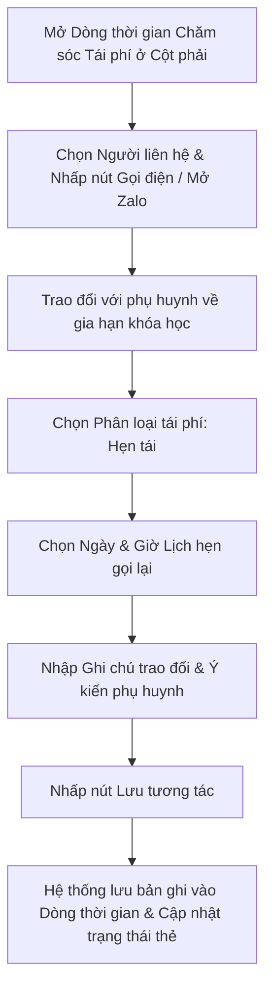

# US-CARE-02-03: Biểu mẫu & Dòng thời gian Nhật ký Chăm sóc Tái phí (Renewal Interaction Feed & Popover)

> **Tham chiếu:** `BF-CARE-02` · `FLOW-CARE-02` · `SR-CSM-002` · `[DS-P3]` · `[POLICY-DS-04]` · `[POLICY-DS-05]`  
> **Vị trí màn hình:** Cột phải Trang Chi tiết Chăm sóc Học viên (`RenewalChatFeed`) & Bảng thông tin nổi tại dòng (`CSTPHistoryPopover`)

---

## 1. NHẬT KÝ THAY ĐỔI & BỐI CẢNH (CHANGELOG & CONTEXT)

### Lịch sử cập nhật tài liệu (Changelog)

| Ngày cập nhật | Nội dung cập nhật | Lý do cập nhật |
|---|---|---|
| 14/08/2026 | Phát hành tài liệu US-CARE-02-03 | Đặc tả chi tiết biểu mẫu ghi nhận tương tác tái phí, dòng thời gian nhật ký tương tác CSTP và bảng nổi xem nhanh tại dòng |

### 1.1. Bối cảnh nghiệp vụ (Business Context)
Quá trình tư vấn tái phí cho học viên thường trải qua nhiều lần liên hệ qua các kênh khác nhau (gọi điện đàm thoại, nhắn tin Zalo, trao đổi trực tiếp tại trung tâm) và kéo dài từ 2 đến 4 tuần trước khi phụ huynh quyết định chuyển khoản. Biểu mẫu và Dòng thời gian Nhật ký Tái phí (`RenewalChatFeed`) đóng vai trò là không gian ghi nhận và tra cứu toàn bộ diễn biến tương tác, giúp bảo toàn mạch chăm sóc liên tục giữa các nhân sự.

### 1.2. Vấn đề nghiệp vụ (Problem Statement)
- Nhân viên quên nội dung trao đổi của lần gọi trước hoặc không nhớ lịch hẹn gọi lại với phụ huynh.
- Khó phân biệt giữa lịch sử chăm sóc vận hành hàng ngày (nghỉ học, bài tập) với lịch sử tư vấn tái phí khóa học.
- Thiếu công cụ xem nhanh lịch sử chăm sóc trực tiếp tại dòng danh sách mà không phải chuyển màn hình.

### 1.3. Mục tiêu (Key Objectives)
- Cung cấp biểu mẫu ghi nhận tương tác tái phí chuyên biệt: chọn kênh (Điện thoại, Zalo, Trực tiếp), cập nhật phân loại tái phí (Mới, Cân nhắc, Tiềm năng, Hẹn tái, Đã tái phí, Thất bại), chọn lịch hẹn gọi lại, nhập ghi chú trao đổi và ý kiến phản hồi của phụ huynh.
- Xây dựng Dòng thời gian (Timeline Feed) lưu vết toàn bộ lịch sử các lần tương tác theo thứ tự thời gian giảm dần, hiển thị thời lượng cuộc gọi, tên nhân sự thực hiện và gắn thẻ `CSTP`.
- Cung cấp Bảng thông tin nổi (`CSTPHistoryPopover`) cho phép rê chuột hoặc nhấp vào cột Lịch sử chăm sóc trên bảng danh sách chính để xem nhanh các lần tương tác gần nhất.

### 1.4. Giá trị mang lại (Business Value & Impact)
- Giúp nhân viên CSM nắm bắt tức thì diễn biến tư vấn trước mỗi cuộc gọi mới, tăng độ chuyên nghiệp và thiện cảm từ phía phụ huynh.
- Đảm bảo tính liên tục của lịch sử tương tác khi có sự điều chuyển nhân sự phụ trách cơ sở.

### 1.5. Phạm vi chức năng tổng quan (Functional Scope Overview)
1. **Khối Đầu trang Tương tác & Chọn Người liên hệ:** Chọn người nhận cuộc gọi (Bố / Mẹ / Giám hộ), nút Gọi điện thoại tích hợp.
2. **Biểu mẫu Ghi nhận Tương tác Tái phí:** Chọn kênh liên lạc, chọn phân loại tái phí, thiết lập lịch hẹn gọi lại, nhập ghi chú trao đổi, nhập ý kiến phụ huynh.
3. **Nút Lưu & Lưu & Hoàn thành:** Nút "Lưu" (chuyển ca sang Đang xử lý / Hẹn tái) và nút "Lưu & Hoàn thành" (chuyển ca sang Đã tái phí).
4. **Dòng thời gian Nhật ký Tương tác (Timeline Feed):** Danh sách thẻ nhật ký các lần liên hệ trước đó, bộ lọc nhân sự thực hiện.
5. **Bảng nổi Xem nhanh tại dòng (Popover):** Bảng nhỏ xem tóm tắt tương tác tái phí khi thao tác tại bảng danh sách chính.

### 1.6. Ma trận danh sách chức năng (Feature Scope Matrix)

| Mã chức năng | Tên chức năng | Mô tả ngắn | Mức ưu tiên | Nhãn |
|---|---|---|---|---|
| `FEAT-FEE-01` | Khối Đầu trang Tương tác & Nút Gọi điện | Chọn người liên hệ gia đình, số điện thoại và nút bấm thực hiện cuộc gọi | Must | Bắt buộc |
| `FEAT-FEE-02` | Biểu mẫu Ghi nhận & Cập nhật Phân loại | Nhập nội dung trao đổi, ý kiến phụ huynh và chọn trạng thái tái phí mới | Must | Bắt buộc |
| `FEAT-FEE-03` | Thiết lập Lịch hẹn gọi lại & Nhắc hẹn | Đặt ngày giờ hẹn liên hệ lại, hiển thị khung nhắc hẹn màu tím nổi bật | Must | Bắt buộc |
| `FEAT-FEE-04` | Dòng thời gian Nhật ký & Bảng nổi Popover | Lưu vết toàn bộ lịch sử tương tác có thẻ CSTP và bảng nổi xem nhanh tại dòng | Must | Bắt buộc |

---

## 2. LUỒNG XỬ LÝ CHÍNH (MAIN FLOW - HAPPY PATH)

* **Bước 1:** Người dùng mở Trang Chi tiết Chăm sóc Học viên, nhìn sang Dòng thời gian Chăm sóc Tái phí ở cột bên phải (`RenewalChatFeed`).
* **Bước 2:** Người dùng chọn người liên hệ (Mẹ Lê Thu Thủy), nhấp nút **Gọi điện** hoặc mở ứng dụng Zalo để trao đổi với phụ huynh.
* **Bước 3:** Sau khi trao đổi xong, người dùng chọn kênh là `Cuộc gọi`, chọn Phân loại tái phí là `Hẹn tái`.
* **Bước 4:** Người dùng chọn thời gian trong ô **Lịch hẹn gọi lại** (ví dụ: `20/07/2026 14:00`).
* **Bước 5:** Người dùng nhập nội dung trao đổi vào ô Ghi chú ("Mẹ khen con tiến bộ nhiều") và nhập ý kiến phụ huynh ("Mẹ hẹn cuối tuần này bố đi công tác về sẽ chuyển khoản đóng phí").
* **Bước 6:** Người dùng nhấp nút **[Lưu]**. Hệ thống lưu 1 bản ghi mới vào dòng thời gian nhật ký tái phí, cập nhật trạng thái học viên thành Hẹn tái và hiển thị khung nhắc hẹn màu tím.

---

## 3. GIAO DIỆN & TRẠNG THÁI TĨNH (DATA & UI STATE)

### 3.1. Thiết kế trực quan
* **Giao diện tham chiếu:** Cột phải Trang Chi tiết Chăm sóc Học viên (`RenewalChatFeed`) & Bảng thông tin nổi (`CSTPHistoryPopover`).

### 3.2. RÀNG BUỘC VÀ QUY TẮC KIỂM TRA DỮ LIỆU (VALIDATION RULES)

#### A. Khối Đầu trang Tương tác (Cột phải trên cùng)

| Thành phần giao diện | Kiểu hiển thị | Nguồn dữ liệu | Các tùy chọn chọn lựa | Logic xử lý & Ràng buộc hiển thị |
|---|---|---|---|---|
| **Bộ chọn Người liên hệ** | Ô chọn thả xuống dạng thẻ | Cơ sở dữ liệu học viên | Danh sách người liên hệ gia đình (Bố / Mẹ / Giám hộ) | Mặc định chọn người liên hệ chính (Primary). Khi đổi người liên hệ, số điện thoại tự động cập nhật theo. |
| **Số điện thoại & Masking** | Văn bản in đậm kèm icon | Cơ sở dữ liệu học viên | Số điện thoại đầy đủ | Tại màn hình chi tiết, hiển thị đầy đủ số điện thoại phụ huynh cho nhân viên có quyền. |
| **Nút Gọi điện thoại** | Nút bấm màu xanh lá kèm icon điện thoại | Hệ thống | Bắt đầu cuộc gọi | Nhấp vào kích hoạt tính năng đàm thoại qua tổng đài hoặc mở ứng dụng gọi điện. |

#### B. Biểu mẫu Ghi nhận Tương tác Tái phí

| Trường thông tin | Kiểu ô chọn / Nhập liệu | Nguồn dữ liệu | Ràng buộc dữ liệu | Logic xử lý nghiệp vụ |
|---|---|---|---|---|
| **Kênh liên lạc** | Nút bấm chuyển kênh | Hệ thống | 1. **Zalo (Mặc định)** 2. **Điện thoại** 3. **Trực tiếp** | Chọn hình thức tương tác vừa thực hiện với phụ huynh. |
| **Phân loại tái phí** | Ô chọn thả xuống | Hệ thống | `Mới`, `Cân nhắc`, `Tiềm năng`, `Hẹn tái`, `Đã tái phí`, `Thất bại` | Cập nhật mức độ tiềm năng tái phí của học viên sau cuộc trao đổi. |
| **Lịch hẹn gọi lại** | Ô chọn ngày & giờ | Người dùng chọn | Ngày giờ trong tương lai $\ge$ thời điểm hiện tại | Bắt buộc khi phân loại là `Hẹn tái`. Tự động hiển thị khung nhắc hẹn màu tím trên bảng danh sách. |
| **Ghi chú trao đổi** | Ô nhập văn bản nhiều dòng | Người dùng nhập | Tối đa 1000 ký tự | Tóm tắt các nội dung chính nhân viên đã tư vấn về lộ trình học, chương trình ưu đãi. |
| **Ý kiến phụ huynh** | Ô nhập văn bản một dòng | Người dùng nhập | Tối đa 500 ký tự | Ghi nhận nguyên văn hoặc tóm tắt phản hồi/yêu cầu của phụ huynh. |
| **Nút Lưu** | Nút bấm màu xanh dương | Hệ thống | Lưu tương tác | Lưu bản ghi mới, chuyển trạng thái ca sang `Đang xử lý` (hoặc `Hẹn tái`). |
| **Nút Lưu & Hoàn thành** | Nút bấm màu xanh lá | Hệ thống | Hoàn tất tái phí | Chỉ dùng khi phụ huynh đã đóng phí thành công $\rightarrow$ Chuyển ca sang `Đã tái phí`. |

#### C. Dòng thời gian Nhật ký Tái phí (Timeline Feed)

| Thành phần hiển thị | Kiểu hiển thị | Nguồn dữ liệu | Quy tắc thị giác & Hiển thị chi tiết |
|---|---|---|---|
| **Khung nhắc hẹn gọi lại** | Khung viền màu tím nhạt ở đầu danh sách | Cơ sở dữ liệu chăm sóc học viên | Hiển thị biểu tượng lịch hẹn, ngày giờ hẹn và nội dung nhắc nhở cần liên hệ lại. Tự động ẩn nếu không có lịch hẹn. |
| **Bộ lọc nhân sự thực hiện** | Ô chọn thả xuống lọc nhân viên | Hệ thống | Lọc hiển thị nhật ký tương tác theo tất cả nhân sự hoặc theo nhân viên CSM / Giáo viên cụ thể. |
| **Thẻ Nhật ký Tương tác** | Khối thẻ bo tròn viền xám | Cơ sở dữ liệu chăm sóc học viên | - Dòng 1: Tên nhân sự (kèm vai trò CSM/GV) + Kênh liên lạc + Thời gian thực hiện. - Dòng 2: Huy hiệu thẻ `CSTP` (màu xanh lá) + Huy hiệu phân loại tái phí. - Dòng 3: Nội dung ghi chú trao đổi. - Dòng 4: Khung trích dẫn màu xanh lá hiển thị Ý kiến phản hồi của phụ huynh. - Dòng 5 (nếu có): Thời lượng cuộc gọi đàm thoại (VD: `2 phút 30 giây`). |

#### D. Bảng thông tin nổi Xem nhanh tại dòng (`CSTPHistoryPopover`)

| Thành phần giao diện | Kiểu hiển thị | Nguồn dữ liệu | Logic xử lý & Ràng buộc hiển thị |
|---|---|---|---|
| **Khung tóm tắt tại dòng** | Bảng nổi hiển thị khi rê chuột hoặc nhấp chuột vào cột Lịch sử chăm sóc | Cơ sở dữ liệu chăm sóc học viên | - Hiển thị số lượng lần chăm sóc: `Chăm sóc (n)`. - Hiển thị khung nhắc hẹn gọi lại màu tím (nếu có). - Hiển thị chi tiết lần tương tác gần nhất (mở sẵn). - Khối danh sách các lần tương tác cũ hơn (cho phép mở rộng / thu gọn). |

---

## 4. KHỐI CHỨC NĂNG & TIÊU CHÍ CHẤP NHẬN (ACCEPTANCE CRITERIA)

### Action 1.1: Khối Đầu trang Tương tác & Nút Gọi điện
* **Tiêu chí nghiệm thu (Acceptance Criteria):**
  - **AC-1 (Happy Path - Chuyển đổi Người liên hệ):**
    - **Giả sử:** Học viên có 2 người liên hệ (Mẹ và Bố).
    - **Khi:** Người dùng chọn "Bố - Nguyễn Văn Hùng".
    - **Thì:** Số điện thoại trên đầu trang tự động chuyển sang số điện thoại của Bố.
  - **AC-2 (Happy Path - Bắt đầu cuộc gọi):**
    - **Giả sử:** Người dùng bấm nút [Gọi điện].
    - **Khi:** Bấm bắt đầu gọi.
    - **Thì:** Hệ thống kích hoạt cuộc gọi tới số điện thoại của người liên hệ đang chọn và hiển thị trạng thái đang kết nối.

### Action 1.2: Biểu mẫu Ghi nhận & Cập nhật Phân loại Tái phí
* **Tiêu chí nghiệm thu (Acceptance Criteria):**
  - **AC-3 (Happy Path - Lưu tương tác Zalo):**
    - **Giả sử:** Người dùng chọn kênh Zalo, chọn phân loại "Tiềm năng", nhập ghi chú "Đã gửi thông tin học phí qua Zalo".
    - **Khi:** Bấm nút Lưu tương tác.
    - **Thì:** 1 bản ghi mới xuất hiện ngay trên đầu Dòng thời gian và phân loại tái phí của học viên được cập nhật thành Tiềm năng.
  - **AC-4 (Happy Path - Lưu & Hoàn thành Đã tái phí):**
    - **Giả sử:** Phụ huynh đã chuyển khoản thành công.
    - **Khi:** Người dùng chọn phân loại "Đã tái phí" và bấm [Lưu & Hoàn thành].
    - **Thì:** Hệ thống cập nhật trạng thái học viên sang Đã tái phí với huy hiệu xanh lá và hiển thị thông báo hoàn thành.
  - **AC-5 (Exception Path - Bỏ trống nội dung ghi chú):**
    - **Giả sử:** Người dùng không nhập ghi chú và không nhập ý kiến phụ huynh.
    - **Khi:** Bấm nút Lưu tương tác.
    - **Thì:** Hệ thống hiển thị thông báo lỗi "Vui lòng nhập nội dung trao đổi hoặc ý kiến phụ huynh trước khi lưu!" và không lưu bản ghi rỗng.

### Action 1.3: Thiết lập Lịch hẹn gọi lại & Nhắc hẹn
* **Tiêu chí nghiệm thu (Acceptance Criteria):**
  - **AC-6 (Happy Path - Đặt lịch hẹn thành công):**
    - **Giả sử:** Người dùng chọn phân loại "Hẹn tái" và chọn lịch hẹn là "22/07/2026 15:30".
    - **Khi:** Bấm nút Lưu tương tác.
    - **Thì:** Khung nhắc hẹn màu tím xuất hiện ở đầu Dòng thời gian với nội dung "Hẹn: 22/07/2026 15:30", đồng thời trên bảng danh sách chính hiển thị lịch hẹn màu tím tương ứng.

### Action 1.4: Dòng thời gian Nhật ký & Bảng nổi Popover
* **Tiêu chí nghiệm thu (Acceptance Criteria):**
  - **AC-7 (Happy Path - Xem nhanh qua Popover tại dòng):**
    - **Giả sử:** Người dùng đang ở bảng danh sách chính `/app/renewal`.
    - **Khi:** Nhấp vào ô "Chăm sóc (3)" tại cột Lịch sử chăm sóc.
    - **Thì:** Bảng nổi Popover hiển thị ngay lập tức với đầy đủ 3 lần tương tác mà không cần chuyển sang trang chi tiết.
  - **AC-8 (Happy Path - Lọc nhật ký theo nhân viên):**
    - **Giả sử:** Dòng thời gian có tương tác của cả CSM và Giáo viên.
    - **Khi:** Người dùng chọn bộ lọc nhân sự là "Giáo viên".
    - **Thì:** Danh sách chỉ hiển thị các bản ghi trao đổi do Giáo viên thực hiện.

---

## 5. CÁC TRƯỜNG HỢP GÓC CẠNH (CORNER CASES)

* **5.1. Cuộc gọi đàm thoại bị ngắt quãng hoặc mất kết nối:** Hệ thống lưu vết cuộc gọi chưa thành công vào phần lịch sử cuộc gọi nhỡ và cho phép nhân viên bấm gọi lại ngay.
* **5.2. Phụ huynh yêu cầu không làm phiền qua điện thoại:** Nhân viên chọn kênh ưu tiên là Zalo hoặc Email và ghi chú rõ vào hồ sơ: "Phụ huynh bận giờ hành chính, chỉ trao đổi qua Zalo".
* **5.3. Đặt lịch hẹn gọi lại vào ngày trong quá khứ:** Hệ thống tự động kiểm tra và khóa không cho chọn các mốc thời gian trước thời điểm hiện tại.
* **5.4. Học viên có hơn 20 lần tương tác trong lịch sử:** Dòng thời gian mặc định hiển thị 5 lần tương tác gần nhất và cung cấp nút "Xem thêm lịch sử cũ" để tối ưu tốc độ hiển thị giao diện.
* **5.5. Cập nhật phân loại sang Thất bại:** Hệ thống bắt buộc người dùng nhập lý do từ chối của phụ huynh vào ô Ý kiến phụ huynh trước khi cho phép lưu.

---

## 6. YÊU CẦU PHI CHỨC NĂNG & PHÂN QUYỀN

* **Thời gian phản hồi:** Lưu bản ghi tương tác và cập nhật giao diện dòng thời gian $\le 300$ miligiây.
* **Phân quyền người dùng:**
  * Nhân viên CSM & BM: Toàn quyền tạo mới, ghi nhận tương tác và cập nhật phân loại tái phí.
  * Giáo viên: Được quyền ghi nhận các tương tác liên quan đến tư vấn học thuật cho học viên lớp mình dạy.

---

## 7. PHỤ LỤC: KIỂM TRA CHẤT LƯỢNG (Checklist B)

- [x] **Acceptance Criteria (AC):** Đầy đủ 4 nhóm chức năng chính, định dạng Giả sử - Khi - Thì, bao phủ cả luồng thành công và ngoại lệ.
- [x] **Ngôn ngữ tự nhiên 100%:** Tuân thủ triệt để quy tắc `[POLICY-DS-05]`, không chứa dev jargon (sử dụng *Dòng thời gian nhật ký tương tác*, *bảng thông tin nổi*, *giao diện*, *cơ sở dữ liệu*).
- [x] **Bảng mô tả giao diện 5 cột:** Tuân thủ nghiêm ngặt định dạng 5 cột tại Mục 3.2.
- [x] **Corner Cases $\ge 5$:** Định nghĩa đầy đủ 5 trường hợp ngoại lệ tại Mục 5.
