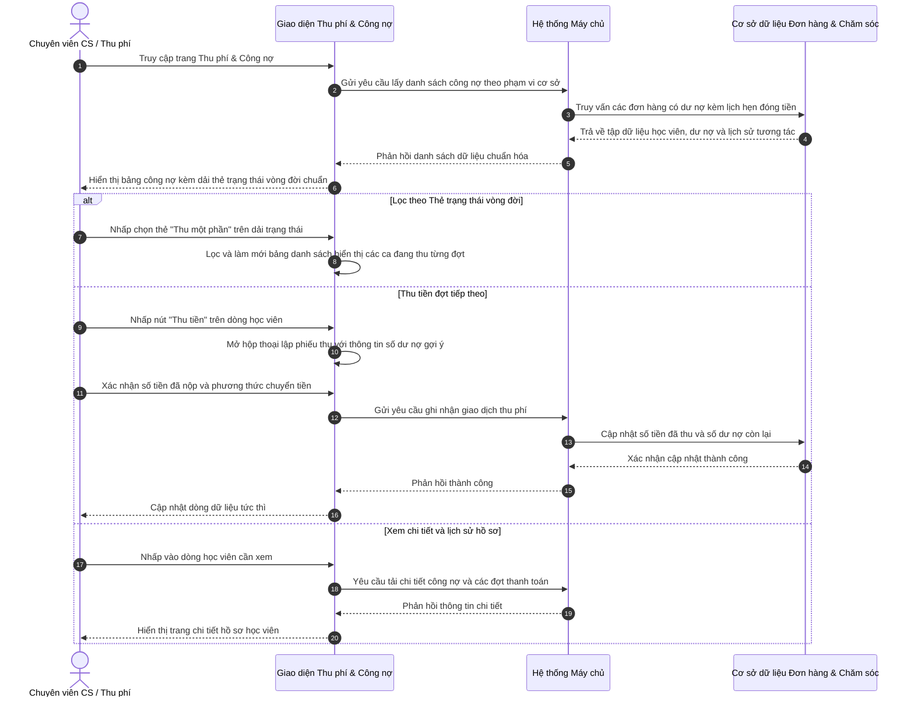

# US-CARE-02-03: Màn hình Thu phí & Quản lý Công nợ Học viên

> **Tham chiếu:** `BF-CARE-02` · `PERSONA-CSM` · `PERSONA-BRANCH-MANAGER`  
> **Đường dẫn màn hình & Trạng thái liên quan:**  
> - `/app/payment_receipts` -> Trạng thái công nợ: `Chờ thu`, `Thu một phần`, `Đã thu đủ`, `Đã hủy / Miễn nợ`  
> - Thời gian hạn thanh toán: Hiển thị ngay dưới nhãn trạng thái theo định dạng `Hạn: xx/xx/xxxx`

---

## 1. NHẬT KÝ THAY ĐỔI & BỐI CẢNH (CHANGELOG & CONTEXT)

### Lịch sử cập nhật tài liệu (Changelog)

| Ngày cập nhật | Nội dung cập nhật | Lý do cập nhật |
|---|---|---|
| 26/09/2026 | Chuẩn hóa vòng đời công nợ thuần túy (Chờ thu, Thu một phần, Đã thu đủ, Đã hủy) | Tách bạch yếu tố thời gian khỏi trạng thái vòng đời theo nguyên tắc phân tích nghiệp vụ toàn cầu. |
| 26/09/2026 | Chuyển hiển thị hạn nộp xuống dưới nhãn trạng thái dạng `Hạn: xx/xx/xxxx` | Tối ưu trải nghiệm thị giác, hiển thị trực quan thời hạn thanh toán mà không làm nhiễu trạng thái. |
| 26/09/2026 | Khởi tạo tài liệu đặc tả màn hình Thu phí & Quản lý Công nợ học viên | Tách biệt nghiệp vụ thu nợ đợt và cọc học luôn khỏi màn hình Tái phí học viên. |

### Bối cảnh & Vấn đề nghiệp vụ (Context & Problem)
* **Bối cảnh:** Tại các cơ sở đào tạo, phụ huynh thường đăng ký các gói học dài hạn nhưng lựa chọn hình thức thanh toán nhiều đợt, đặt cọc vào học trước hoặc trả góp qua ngân hàng. Đội ngũ chuyên viên chăm sóc học viên và quản lý cơ sở cần một không gian vận hành tập trung để theo dõi sát sao tiến độ dòng tiền.
* **Vấn đề hiện tại:**
  1. *Lẫn lộn giữa Tái phí và Thu nợ đợt:* Các đơn hàng chưa thanh toán đủ hoặc đóng thêm tiền đợt tiếp theo của gói học hiện tại đang bị dồn vào màn hình Tái phí, gây hiểu nhầm về tỷ lệ tái tục và làm loãng danh sách học viên sắp hết hạn gói.
  2. *Rủi ro cọc cho học luôn:* Học viên mới chỉ đóng một phần tiền cọc nhưng đã được xếp vào lớp học chính thức. Nếu không có cơ chế cảnh báo chạm trần số buổi học cho phép so với số tiền đã nộp, cơ sở đối mặt với rủi ro thất thoát doanh thu khi học viên nghỉ ngang.
  3. *Nhầm lẫn giữa trạng thái vòng đời và thời gian:* Trước đây đưa yếu tố thời gian (như trong hạn, quá hạn) vào làm trạng thái nghiệp vụ, dẫn đến sự thiếu chính xác trong mô hình hóa vòng đời công nợ.
* **Mục tiêu & Giá trị mang lại:**
  - Thiết lập màn hình vận hành chuyên biệt cho nghiệp vụ công nợ và thu phí nhiều đợt với vòng đời chuẩn 4 bước.
  - Phân tách rạch ròi luồng dữ liệu: Tái phí chỉ theo dõi việc chốt gói học mới; các khoản nợ tiền chưa đóng đủ sẽ được quản lý tập trung tại phân hệ Thu phí & Công nợ.
  - Cung cấp dải thẻ trạng thái trực quan theo vòng đời chuẩn kèm hiển thị hạn thanh toán rõ ràng dưới mỗi trạng thái.

### Hiểu người dùng & Tình huống sử dụng (User Needs & Use Cases)
* **Người dùng chính (Persona):** Chuyên viên chăm sóc khách hàng (`PERSONA-CSM`) và Quản lý cơ sở (`PERSONA-BRANCH-MANAGER`).
* **Nhu cầu thực tế:** Cần nắm bắt danh sách các học viên sắp đến ngày hẹn nộp tiền đợt 2/đợt 3, số tiền còn nợ, số buổi đã học thực tế, lịch sử trao đổi với phụ huynh và nút bấm thu tiền trực tiếp.
* **Câu phát biểu nghiệp vụ:** **Là một** Chuyên viên chăm sóc khách hàng phụ trách thu phí, **tôi muốn** có một màn hình quản lý công nợ chuyên biệt với đầy đủ thông tin số tiền nợ, hạn nộp và cảnh báo quá hạn, **để** tôi chủ động liên hệ nhắc phụ huynh thanh toán đúng hẹn và thu tiền nhanh chóng.

### Phạm vi kiểm soát (Scope)
* **Phạm vi hiển thị:** Toàn bộ các gói học và đơn hàng có phát sinh công nợ thuộc phạm vi cơ sở được phân quyền của người dùng.

---

## 2. LUỒNG XỬ LÝ CHÍNH (MAIN FLOW - HAPPY PATH)

---

## 3. GIAO DIỆN & KIỂM SOÁT QUYỀN HẠN (UI & CAPABILITY GATING)

### 3.1. Cấu trúc các vùng giao diện & Ràng buộc Quyền hạn (Capability Gating)

Màn hình áp dụng cơ chế kiểm soát hiển thị theo Mã quyền động:

| Vùng Giao diện / Nút Thao Tác | Loại Hiển Thị | Mã Quyền Yêu Cầu | Xử Lý Khi Không Đủ Quyền |
| :--- | :--- | :--- | :--- |
| **Truy cập Màn hình `/app/payment_receipts`** | Toàn bộ giao diện | `care.debt.view` | Chặn truy cập, hiển thị màn hình 403 Forbidden |
| **Thanh công cụ Lọc & Tìm kiếm** | Ô thả xuống & Ô tìm kiếm | `care.debt.filter` | Vô hiệu hóa thanh công cụ lọc |
| **Thẻ trạng thái (Status Tiles)** | Dải thẻ đếm số lượng | `care.debt.view` | Không hiển thị số lượng thống kê |
| **Bảng danh sách công nợ** | Bảng dữ liệu chính | `care.debt.view` | Ẩn danh sách |
| **Nút bấm Thu tiền nhanh** | Nút hành động trên dòng | `care.debt.collect` | Ẩn nút bấm thu tiền |
| **Nhấp dòng Xem Chi tiết** | Trang chi tiết hồ sơ | `care.debt.detail` | Vô hiệu hóa thao tác nhấp mở chi tiết |

### 3.2. Cấu trúc dữ liệu bảng chính

| Cột thông tin | Kiểu hiển thị | Nguồn dữ liệu | Quy tắc thị giác |
|---|---|---|---|
| **0. Checkbox** | Hộp kiểm | Danh sách chọn hàng loạt | Hỗ trợ chọn từng dòng hoặc chọn toàn bộ |
| **1. Học viên** | Ảnh đại diện + Tên đậm + Mã học viên | Thông tin học viên | Đi kèm cơ sở đào tạo bên dưới |
| **2. Liên hệ** | Tên phụ huynh + Số điện thoại | Danh bạ gia đình | Bắt buộc che ẩn 4 số giữa dạng `091****111` |
| **3. Người phụ trách** | Ảnh đại diện + Tên nhân viên | Phân công chăm sóc | Chỉ hiển thị chuyên viên CS phụ trách thu khoản nợ |
| **4. Lịch sử nhắc nợ** | Văn bản + Thời gian tương đối | Nhật ký cuộc gọi | Hiển thị nội dung nhắc nợ gần nhất và ngày hẹn nộp |
| **5. Trạng thái công nợ** | Nhãn màu chuẩn + Dòng chữ hạn nộp | Trạng thái nợ & Hạn thu | Hiển thị nhãn trạng thái (Chờ thu, Thu một phần, Đã thu đủ, Đã hủy). Phía dưới nhãn hiển thị ngày hạn nộp dạng `Hạn: xx/xx/xxxx` kèm chỉ báo trễ hạn |
| **6. Đơn hàng & Nợ** | Mã đơn + Nhãn hình thức + Dư nợ đỏ + Nút thu tiền | Dữ liệu đơn hàng | Số tiền nợ hiển thị nổi bật, nút Thu tiền cho phép lập phiếu thu |
| **7. Lớp học & Buổi** | Mã lớp + Số buổi đã học/tổng | Dữ liệu lớp học | Hiển thị số buổi đã học kèm cảnh báo cọc học luôn chạm trần |

---

## 4. KHỐI CHỨC NĂNG CHI TIẾT: ACTION & LUỒNG KÍCH HOẠT (ACTIONS & EVENTS)

### Khối chức năng 1: Lọc và Tìm kiếm nhanh trên Thanh công cụ

#### Action 1.1: Nhập từ khóa tìm kiếm
* **Luồng kích hoạt:** Khi người dùng nhập tên, số điện thoại hoặc mã đơn hàng vào ô tìm kiếm, giao diện tự động lọc danh sách sau 300ms.
* **Tiêu chí nghiệm thu (Acceptance Criteria):**
  - **AC-1 (Happy Path - Tìm thấy kết quả):**
    - **Giả sử:** Bảng công nợ đang có bản ghi học viên "Nguyễn Minh Quân" với mã đơn "ORD-2026-101".
    - **Khi:** Người dùng nhập "ORD-2026-101" vào ô tìm kiếm nhanh.
    - **Thì:** Bảng danh sách tự động cập nhật chỉ hiển thị bản ghi của học viên Nguyễn Minh Quân.
  - **AC-2 (Alternate Path - Không tìm thấy kết quả):**
    - **Giả sử:** Bảng công nợ đang hiển thị danh sách.
    - **Khi:** Người dùng nhập một chuỗi ký tự không tồn tại trong hệ thống.
    - **Thì:** Bảng danh sách hiển thị thông báo trạng thái rỗng và hướng dẫn người dùng thiết lập lại từ khóa.

#### Action 1.2: Chuyển đổi Thẻ trạng thái công nợ vòng đời chuẩn
* **Luồng kích hoạt:** Người dùng nhấp chọn một trong các thẻ trạng thái: "Tất cả nợ", "Chờ thu", "Thu một phần", "Đã thu đủ", "Đã hủy / Miễn nợ".
* **Tiêu chí nghiệm thu:**
  - **AC-1 (Happy Path - Lọc theo Thu một phần):**
    - **Giả sử:** Người dùng đang ở màn hình Thu phí & Công nợ với bộ lọc mặc định là "Tất cả nợ".
    - **Khi:** Người dùng nhấp vào thẻ trạng thái "Thu một phần".
    - **Thì:** Bảng danh sách chỉ hiển thị các ca đã thu đợt trước và còn số dư nợ cần thu tiếp.

### Khối chức năng 2: Thao tác Thu tiền và Xem chi tiết hồ sơ

#### Action 2.1: Nhấp nút Thu tiền trên dòng công nợ
* **Luồng kích hoạt:** Người dùng nhấp nút "Thu tiền" tại cột Đơn hàng & Công nợ của một học viên còn nợ.
* **Tiêu chí nghiệm thu:**
  - **AC-1 (Happy Path - Lập phiếu thu thành công):**
    - **Giả sử:** Học viên đang có dư nợ 9.000.000 đồng.
    - **Khi:** Người dùng bấm "Thu tiền", nhập số tiền thu 9.000.000 đồng và chọn phương thức chuyển khoản ngân hàng rồi bấm xác nhận.
    - **Thì:** Hộp thoại đóng lại, hệ thống cập nhật dư nợ về 0 đồng và tự động chuyển trạng thái công nợ sang "Đã thu đủ".

#### Action 2.2: Nhấp dòng để xem chi tiết hồ sơ công nợ
* **Luồng kích hoạt:** Người dùng nhấp vào khoảng trống của một dòng bất kỳ trên bảng danh sách.
* **Tiêu chí nghiệm thu:**
  - **AC-1 (Happy Path - Mở trang chi tiết):**
    - **Giả sử:** Người dùng đang xem danh sách công nợ.
    - **Khi:** Người dùng nhấp vào dòng của học viên đang có nợ.
    - **Thì:** Giao diện chuyển sang màn hình Chi tiết chăm sóc học viên, hiển thị thông tin học tập, gói đăng ký và lịch sử các đợt thanh toán.

---

## 5. CÁC TRƯỜNG HỢP GÓC CẠNH (CORNER CASES)

- **[CASE-01] Học viên cọc học luôn chạm trần số buổi học:**
  - *Tình huống:* Phụ huynh mới cọc 20% học phí nhưng học sinh đã đi học bằng hoặc vượt quá hạn mức buổi cọc cho phép mà chưa hoàn tất đóng phí.
  - *Cách xử lý:* Cột Lớp học hiển thị nhãn cảnh báo màu đỏ "Chạm trần cọc", hệ thống báo động cho nhân viên cần thu tiền khẩn cấp trước khi cho vào buổi học tiếp theo.
- **[CASE-02] Đơn hàng được thanh toán đủ 100%:**
  - *Tình huống:* Phụ huynh chuyển khoản ngân hàng số tiền còn lại và nhân viên bấm thu nốt phần dư nợ.
  - *Cách xử lý:* Trạng thái công nợ tự động đổi sang "Đã thu đủ", tự động ẩn khỏi chế độ xem mặc định của thẻ "Tất cả nợ" và chỉ xuất hiện khi nhấp thẻ "Đã thu đủ".
- **[CASE-03] Chốt tái phí gói mới với hình thức thanh toán nhiều lần:**
  - *Tình huống:* Ca tái phí tại phân hệ Tái phí được chốt thành công với gói mới nhưng phụ huynh chỉ mới đóng đợt 1.
  - *Cách xử lý:* Phân hệ Tái phí đóng ca thành công ghi nhận chỉ tiêu cho nhân viên; đồng thời hệ thống tự động sinh một ca công nợ mới tại màn hình Thu phí & Công nợ với trạng thái "Thu một phần".
- **[CASE-04] Người dùng không có quyền truy cập cơ sở:**
  - *Tình huống:* Chuyên viên thuộc cơ sở A cố gắng truy cập dữ liệu công nợ của cơ sở B thông qua tham số lọc hoặc đường dẫn.
  - *Cách xử lý:* Hệ thống áp dụng cơ chế lọc phạm vi dữ liệu, chỉ hiển thị dữ liệu thuộc cơ sở A hoặc trả về thông báo lỗi 403 nếu tài khoản không có quyền xem.
- **[CASE-05] Mất kết nối mạng khi đang thực hiện thao tác lọc:**
  - *Tình huống:* Đường truyền mạng bị gián đoạn trong lúc người dùng bấm chuyển đổi thẻ trạng thái hoặc tìm kiếm.
  - *Cách xử lý:* Giao diện giữ nguyên các tham số đã chọn, hiển thị thông báo không tải được dữ liệu kèm nút bấm thử lại.
