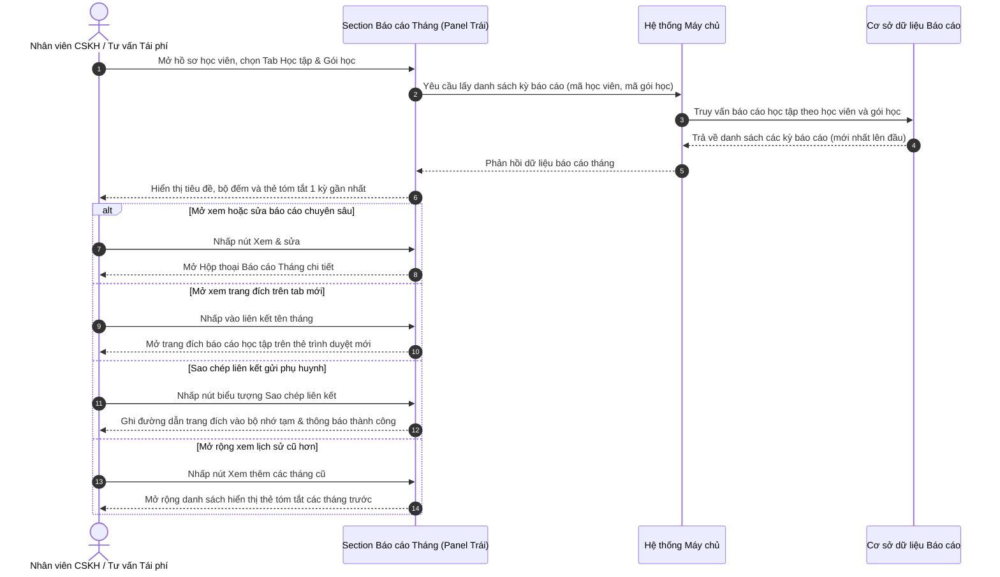

# US-CARE-03-01: Chi tiết học tập: Section Báo cáo Tháng học viên

> **Nghiệp vụ:** Chăm sóc học viên & Tái phí học viên  
> **Vị trí hiển thị:** Màn hình Chi tiết chăm sóc học viên (`/app/student_operations_alert`) và Chi tiết tái phí (`/app/renewal`) -> Panel trái chi tiết học viên (50% độ rộng màn hình), Tab Học tập -> Khối "Báo cáo Tháng của Học viên".  
> **Tài liệu cha:** `BF-CARE-03: Cơ chế Báo cáo Học tập Tháng & Kế hoạch Phát triển Học viên`  
> **Trực quan hóa:** Đối chiếu chính xác theo bản dựng thực tế của hệ thống.  

---

## 1. BỐI CẢNH & PHẠM VI (CONTEXT & SCOPE)

### 1.1. Bối cảnh & Mục tiêu nghiệp vụ (Context & Objectives)
* **Vấn đề trước đây:** Nhân viên chăm sóc khách hàng (`PERSONA-CSM`) và nhân viên tư vấn tái phí khi liên hệ với phụ huynh thường không có sẵn điểm nhìn tổng quan nhanh về tiến độ tháng gần nhất của học viên. Muốn biết học viên vừa hoàn thành kỳ báo cáo nào, đạt danh hiệu gì, giáo viên nào nhận xét thì phải mở nhiều bảng tra cứu riêng biệt, làm chậm tốc độ tư vấn và giảm tính chuyên nghiệp trong cuộc gọi chăm sóc.
* **Mục tiêu:** Cung cấp một khối thẻ tóm tắt tinh gọn (Section Báo cáo Tháng của Học viên) đặt ngay tại panel trái của Tab Học tập trong hồ sơ chăm sóc; hiển thị tức thì kỳ báo cáo 1 tháng gần nhất, danh hiệu vinh danh tháng, tên giáo viên phụ trách, nút mở hộp thoại xem & sửa chuyên sâu và nút sao chép liên kết trang đích gửi phụ huynh trong 1 thao tác bấm chuột.
* **Đối tượng sử dụng (Persona):**
  - Nhân viên chăm sóc học viên (`PERSONA-CSM`).
  - Giáo viên và trợ giảng phụ trách lớp (`PERSONA-TEACHER`).
  - Quản lý cơ sở (`PERSONA-BRANCH-MANAGER`).
* **Chỉ số đo lường (KPI Target):**
  - Thời gian tra cứu và lấy liên kết báo cáo gửi phụ huynh: Dưới 5 giây / học viên.
  - Tỷ lệ đợt gọi tái phí có viện dẫn danh hiệu vinh danh tháng: Đạt trên 85%.

### 1.2. Phạm vi yêu cầu chức năng (Feature Scope)

| Mã yêu cầu | Hạng mục chức năng | Mức ưu tiên | Phạm vi hiển thị | Mô tả chi tiết |
|---|---|:---:|---|---|
| **REQ-01** | Tiêu đề khối & Bộ đếm kỳ | Bắt buộc (Must) | Khung đầu khối | Hiển thị tiêu đề "Báo cáo Tháng của Học viên", chỉ số đếm số kỳ hiển thị trên tổng số kỳ thực tế |
| **REQ-02** | Thẻ tóm tắt kỳ báo cáo 1 dòng | Bắt buộc (Must) | Dòng thẻ tóm tắt | Tên tháng kèm biểu tượng liên kết ngoài, huy hiệu "Hiện tại", huy hiệu Cúp vàng danh hiệu, tên giáo viên |
| **REQ-03** | Mở hộp thoại xem & chỉnh sửa | Bắt buộc (Must) | Nút thao tác | Nút "Xem & sửa" nền nhấn mở trực tiếp hộp thoại báo cáo tháng chuyên sâu |
| **REQ-04** | Sao chép liên kết trang đích | Bắt buộc (Must) | Nút biểu tượng | Nút sao chép đường dẫn trang đích của kỳ báo cáo tương ứng vào bộ nhớ tạm |
| **REQ-05** | Mở rộng & Thu gọn lịch sử cũ | Bắt buộc (Must) | Nút chuyển đổi | Mặc định chỉ hiển thị 1 kỳ gần nhất; cung cấp nút mở rộng xem thêm các tháng cũ hơn khi có từ 2 kỳ trở lên |

### 1.3. Quy tắc nghiệp vụ cốt lõi (Business Rules)
1. **[RULE-MR-01] Phạm vi chuẩn 1 tháng:** Mỗi dòng thẻ đại diện cho đúng 1 kỳ đánh giá 1 tháng dương lịch (ví dụ: `Tháng 4/2026` tương ứng chu kỳ từ ngày 01/04/2026 đến hết ngày 30/04/2026).
2. **[RULE-MR-02] Điều kiện hiển thị khối báo cáo:** Khối chỉ hiển thị khi học viên đã được ghép lớp và lớp học đã bắt đầu diễn ra. Nếu học viên đang ở trạng thái chờ xếp lớp hoặc lớp chưa khai giảng, hệ thống tự động ẩn khối để tránh hiển thị thông tin rỗng.
3. **[RULE-MR-03] Huy hiệu kỳ hiện tại:** Kỳ báo cáo mới nhất thuộc tháng vừa phát sinh được gắn huy hiệu `Hiện tại` màu xanh ngọc nổi bật; các tháng cũ hơn trong lịch sử không hiển thị huy hiệu này.
4. **[RULE-MR-04] Danh hiệu vinh danh tháng (Award Badge):** Hiển thị danh hiệu học thuật được vinh danh trong kỳ (ví dụ: `🏆 CAO THỦ GIẢI TOÁN`, `🌟 SIÊU SAO TOÁN HỌC`) trên nền màu vàng nổi bật kèm biểu tượng cúp vàng. Trường hợp kỳ báo cáo chưa chọn danh hiệu thì bỏ qua vị trí này, không làm xô lệch bố cục.
5. **[RULE-MR-05] Mở trang đích trên tab mới:** Nhấp chuột vào tên tháng (ví dụ: `Tháng 4/2026 ↗`) sẽ mở trực tiếp trang đích công khai của kỳ báo cáo đó trên một thẻ trình duyệt mới.
6. **[RULE-MR-06] Hiển thị lịch sử phân tầng:** Mặc định chỉ hiển thị duy nhất **1 kỳ báo cáo gần nhất**. Khi học viên có từ 2 kỳ báo cáo trở lên, hệ thống hiển thị dòng điều khiển: `Hiển thị 1/X kỳ báo cáo • Xem thêm (X-1 tháng cũ hơn) ⌄` để người dùng chủ động mở rộng hoặc thu gọn.

---

## 2. LUỒNG NGHIỆP VỤ (USER FLOW)

---

## 3. GIAO DIỆN, PHÂN QUYỀN & RÀNG BUỘC (UI, PERMISSION & VALIDATION RULES)

### 3.1. Bảng mô tả chi tiết giao diện tĩnh (UI Structure Table)

| Thành phần giao diện | Loại control | Giá trị mặc định / Giới hạn | Mô tả chi tiết & Trạng thái | Quy tắc vận hành & Thao tác |
|---|---|---|---|---|
| **Tiêu đề khối** | Nhãn văn bản | `Báo cáo Tháng của Học viên` | Văn bản in đậm cỡ nhỏ màu xám đen tại thanh trên cùng của khối | Định danh phân hệ báo cáo tháng trong Tab Học tập |
| **Bộ đếm kỳ hiển thị** | Nhãn trạng thái | `Hiển thị 1/X kỳ báo cáo` | Dòng chữ nhỏ màu xám nhạt nằm ở góc trên bên phải thanh tiêu đề | Thống kê số lượng kỳ đang hiển thị trên tổng số kỳ có sẵn của học viên |
| **Nút mở rộng / thu gọn** | Nút bấm văn bản kèm biểu tượng | `Xem thêm (X tháng cũ hơn)` / `Thu gọn` | Nút liên kết kèm mũi tên trỏ xuống hoặc trỏ lên, chỉ hiện khi tổng số kỳ > 1 | Bấm để mở rộng hiển thị toàn bộ lịch sử các tháng cũ hoặc thu gọn về 1 tháng gần nhất |
| **Liên kết Tên tháng báo cáo** | Nút bấm dạng liên kết ngoài | Định dạng: `Tháng M/YYYY` kèm biểu tượng mở ngoài | Chữ in đậm màu xanh da trời có gạch chân khi di chuột | Nhấp để mở ngay trang đích báo cáo tháng của kỳ đó trên một thẻ trình duyệt mới |
| **Huy hiệu Hiện tại** | Huy hiệu trạng thái | Chữ `Hiện tại` nền xanh ngọc viền mỏng | Huy hiệu bo tròn viên nang kích thước nhỏ gọn | Tự động gắn cho kỳ báo cáo gần nhất trong chu kỳ vận hành hiện tại |
| **Huy hiệu Danh hiệu vinh danh** | Huy hiệu vinh danh | Biểu tượng cúp vàng + Tên danh hiệu | Nền màu vàng cam, chữ vàng đậm, viền mỏng mềm mại | Vinh danh danh hiệu tháng của học viên (VD: `🏆 CAO THỦ GIẢI TOÁN`) |
| **Thông tin Giáo viên phụ trách** | Nhãn văn bản | Tiền tố `GV:` + Tên giáo viên in đậm | Dòng chữ nhỏ màu xám, tên giáo viên màu đậm nổi bật | Ghi nhận giáo viên bộ môn phụ trách lớp đã lập hoặc ký duyệt báo cáo |
| **Nút Xem & sửa** | Nút bấm hành động | Nhãn `Xem & sửa` kèm biểu tượng bút chì | Nút chữ nhật bo góc nhẹ, nền màu nhấn nhạt viền mỏng | Bấm để mở hộp thoại Báo cáo Tháng chuyên sâu ở chế độ xem hoặc chỉnh sửa |
| **Nút Sao chép liên kết** | Nút bấm biểu tượng | Biểu tượng sao chép tài liệu | Nút vuông bo góc nhẹ trong suốt, đổi nền khi di chuột | Bấm để sao chép đường dẫn trang đích của kỳ báo cáo vào bộ nhớ tạm kèm thông báo nổi |

### 3.2. Ràng buộc kiểm tra dữ liệu (Validation Rules)
* Khối tóm tắt hoạt động ở chế độ hiển thị và điều hướng tác vụ; không chứa biểu mẫu nhập liệu trực tiếp tại khối này.
* Dữ liệu liên kết trang đích được hệ thống tạo tự động theo cú pháp chuẩn: `{địa_chỉ_hệ_thống}/report/{mã_học_viên}?month={kỳ_báo_cáo}`.

### 3.3. Ma trận phân quyền năng lực động (Dynamic Capability Gating)

| Mã Quyền Hạn (Permission Key) | Tên Quyền Hạn | Phạm Vi Điều Khiển | Diễn Giải Nghiệp Vụ |
| :--- | :--- | :--- | :--- |
| `care.monthly_report.view` | Xem khối tóm tắt | Khối Báo cáo tháng | Cho phép người dùng nhìn thấy khối tóm tắt tại panel trái |
| `care.monthly_report.view_detail` | Mở hộp thoại xem chi tiết | Nút "Xem & sửa" | Cho phép nhấp nút để mở hộp thoại xem chi tiết báo cáo |
| `care.monthly_report.share` | Sao chép liên kết trang đích | Nút sao chép liên kết | Cho phép sao chép đường dẫn trang đích gửi phụ huynh |

---

## 4. KHỐI CHỨC NĂNG & TIÊU CHÍ NGHIỆM THU (ACTIONS & ACCEPTANCE CRITERIA)

### AC-01 (Happy Path - Hiển thị khối tóm tắt kỳ báo cáo gần nhất)
* **Giả sử:** Học viên đang tham gia một lớp học thực tế và đã có 1 kỳ báo cáo tháng được tạo trên hệ thống.
* **Khi:** Nhân viên chăm sóc mở hồ sơ học viên tại màn hình Chăm sóc học viên hoặc Tái phí và chọn Tab Học tập.
* **Thì:**
  - Khối "Báo cáo Tháng của Học viên" hiển thị rõ ràng tại panel bên trái.
  - Bộ đếm hiển thị: `Hiển thị 1/1 kỳ báo cáo`.
  - Dòng thẻ tóm tắt hiển thị trên 1 dòng duy nhất gồm: tên kỳ có liên kết ngoài (ví dụ: `Tháng 4/2026 ↗`), huy hiệu `Hiện tại`, huy hiệu danh hiệu `🏆 CAO THỦ GIẢI TOÁN`, thông tin `GV: Ms.Chloe`.
  - Nút `Xem & sửa` và nút biểu tượng `Sao chép liên kết` hiển thị sẵn sàng ở phía bên phải dòng thẻ.

### AC-02 (Interactive Path - Mở hộp thoại chi tiết báo cáo tháng)
* **Giả sử:** Thẻ tóm tắt kỳ báo cáo đang hiển thị trên giao diện.
* **Khi:** Người dùng nhấp vào nút `Xem & sửa`.
* **Thì:**
  - Hệ thống mở hộp thoại Báo cáo Tháng chuyên sâu (`StudentMonthlyReportDialog`) ở giữa màn hình.
  - Tự động nạp đúng dữ liệu của kỳ báo cáo tương ứng (khoảng thời gian 1 tháng, danh hiệu, các thẻ chỉ số, nhận xét A1, A2 và kế hoạch bài học B1, B2).

### AC-03 (Interactive Path - Sao chép đường dẫn trang đích gửi phụ huynh)
* **Giả sử:** Thẻ tóm tắt hiển thị nút biểu tượng sao chép liên kết.
* **Khi:** Người dùng nhấp vào nút biểu tượng sao chép.
* **Thì:**
  - Hệ thống sao chép đường dẫn trang đích của kỳ báo cáo đó vào bộ nhớ tạm của thiết bị.
  - Hiển thị thông báo nổi thông báo thành công: *"Đã sao chép liên kết Landing Page báo cáo Tháng 4/2026!"*.

### AC-04 (Alternate Path - Mở rộng và thu gọn danh sách kỳ báo cáo cũ)
* **Giả sử:** Học viên đã theo học nhiều tháng và có từ 2 kỳ báo cáo trở lên trên hệ thống.
* **Khi:** Người dùng nhấp vào nút `Xem thêm (X tháng cũ hơn) ⌄`.
* **Thì:**
  - Khối danh sách mở rộng hiển thị thêm các dòng thẻ tóm tắt của các tháng cũ trước đó theo thứ tự thời gian giảm dần.
  - Dòng điều hướng đổi nhãn thành `Thu gọn ⌃`.
  - Khi người dùng nhấp vào `Thu gọn ⌃`, danh sách thu về trạng thái ban đầu chỉ hiển thị 1 kỳ gần nhất.

### AC-05 (Navigation Path - Mở trực tiếp trang đích trên thẻ trình duyệt mới)
* **Giả sử:** Người dùng muốn kiểm tra giao diện trang đích phụ huynh trước khi gửi đi.
* **Khi:** Người dùng nhấp vào liên kết tên tháng (ví dụ `Tháng 4/2026 ↗`).
* **Thì:**
  - Trình duyệt tự động mở một thẻ mới trỏ thẳng tới đường dẫn trang đích báo cáo tháng của học viên đó.
  - Giao diện trang đích hiển thị đầy đủ thông tin vinh danh, chỉ số học tập, nhận xét và thư viện ảnh của con.

---

## 5. CÁC TRƯỜNG HỢP GÓC CẠNH & LUỒNG NGOẠI LỆ (CORNER CASES & EXCEPTION FLOWS)

* **[CASE-01] Học viên chưa có lớp hoặc lớp chưa khai giảng:** Hệ thống tự động ẩn toàn bộ khối Báo cáo Tháng của Học viên, chỉ hiển thị thông báo trạng thái lớp đang chờ khai giảng để giữ giao diện tinh gọn.
* **[CASE-02] Học viên mới nhập học chưa phát sinh kỳ báo cáo nào:** Khung khối vẫn hiển thị dòng tiêu đề kèm thông báo nhẹ nhàng: "Chưa có dữ liệu kỳ báo cáo tháng cho học viên này", các nút thao tác bị ẩn hoặc làm mờ nhẹ.
* **[CASE-03] Kỳ báo cáo chưa được giáo viên đặt danh hiệu vinh danh:** Thẻ tóm tắt tự động bỏ qua huy hiệu danh hiệu, co giãn khoảng cách tự nhiên giữa tên tháng và tên giáo viên phụ trách mà không để lại khoảng trống thừa.
* **[CASE-04] Lỗi sao chép vào bộ nhớ tạm do trình duyệt chặn quyền:** Nếu trình duyệt từ chối quyền truy cập bộ nhớ tạm, hệ thống hiển thị thông báo cảnh báo lỗi và tự động hiển thị một ô nổi chứa đường link đầy đủ để người dùng bôi đen sao chép thủ công.
* **[CASE-05] Học viên chuyển lớp giữa kỳ báo cáo:** Kỳ báo cáo ghi nhận chính xác tên giáo viên phụ trách tại thời điểm chốt kỳ học; nếu có giáo viên mới tiếp nhận, tên giáo viên mới sẽ được phản ánh từ kỳ tiếp theo.
* **[CASE-06] Người dùng bị thu hồi quyền truy cập báo cáo:** Các nút `Xem & sửa` và nút sao chép liên kết tự động ẩn khỏi giao diện; người dùng chỉ được xem tiêu đề kỳ báo cáo ở chế độ thông tin tĩnh nếu có quyền xem cơ bản.

---

## 6. YÊU CẦU PHI CHỨC NĂNG & GIAO THỨC KẾT NỐI

### 6.1. Yêu cầu Phi chức năng (Non-Functional Requirements)
- **Tốc độ phản hồi giao diện:** Thao tác nhấp mở rộng lịch sử cũ hoặc sao chép liên kết phải hoàn thành dưới 100ms.
- **Tính co giãn trực quan:** Khối thẻ tóm tắt 1 dòng phải hiển thị vừa vặn trong độ rộng 50% màn hình của panel trái, tự động co dòng nhẹ nhàng trên các độ phân giải màn hình máy tính bảng và máy tính xách tay.

### 6.2. Giao thức Kết nối & Dữ liệu Trao đổi
- **Truy vấn danh sách kỳ báo cáo:** Giao diện gọi đến cơ sở dữ liệu học viên để lấy danh sách các kỳ báo cáo đã lưu theo `studentId`. Dữ liệu phản hồi gồm: mã báo cáo, tên kỳ hiển thị, mã tham số kỳ, danh hiệu vinh danh, tên giáo viên phụ trách, cờ đánh dấu kỳ hiện tại.
- **Đồng bộ trạng thái cập nhật:** Khi hộp thoại chỉnh sửa báo cáo lưu thành công dữ liệu mới, hệ thống phát tín hiệu sự kiện nội bộ để khối tóm tắt tự động cập nhật lại danh hiệu và giáo viên mà không cần tải lại toàn bộ trang.
