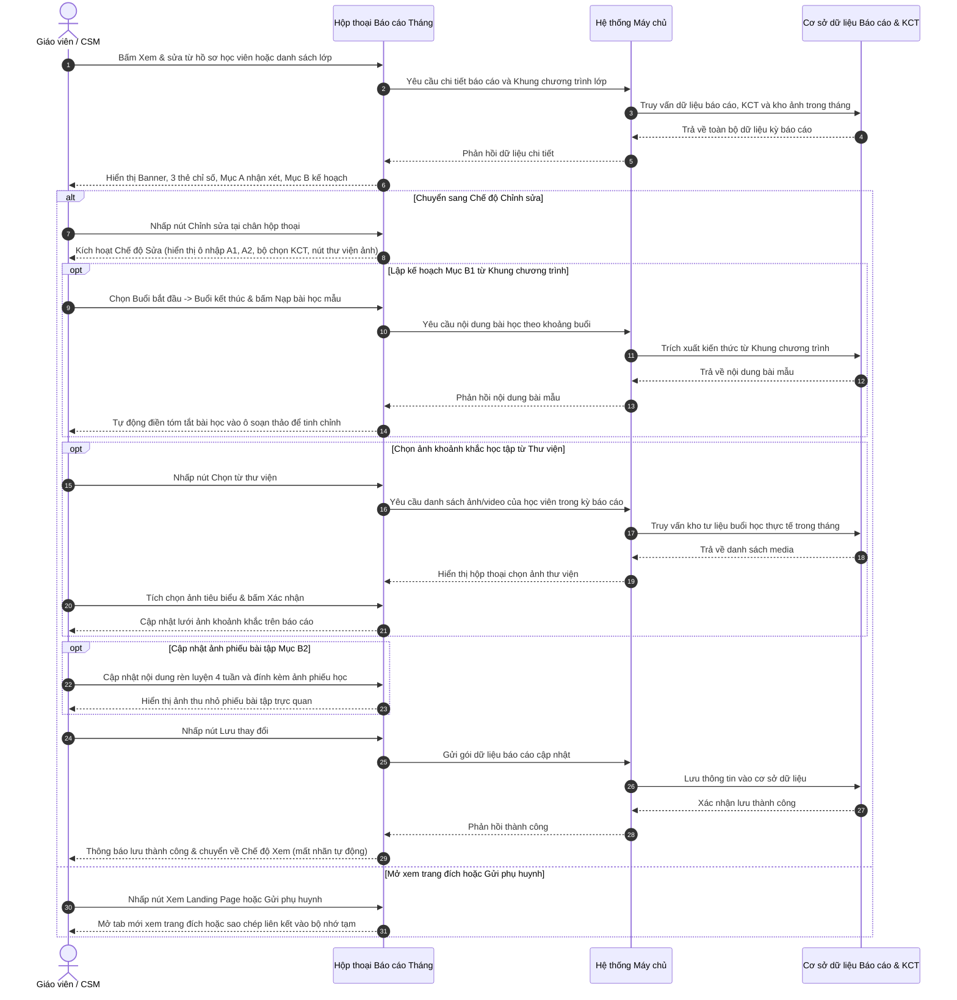

# US-CARE-03-02: Bảng nổi chi tiết Báo cáo tháng học viên

> **Nghiệp vụ:** Chăm sóc học viên & Tái phí học viên  
> **Vị trí hiển thị:** Hộp thoại nổi (Modal Dialog) mở từ Section Báo cáo Tháng (`MonthlyCommentsSection`) tại màn hình Chăm sóc học viên (`/app/student_operations_alert`) hoặc Chăm sóc Tái phí (`/app/renewal`), hoặc từ Danh sách học viên trong lớp học (`ClassesDetailRoster`).  
> **Tài liệu cha:** `BF-CARE-03: Cơ chế Báo cáo Học tập Tháng & Kế hoạch Phát triển Học viên`  
> **Trực quan hóa:** Hộp thoại nổi căn giữa màn hình (`StudentMonthlyReportDialog`).  

---

## 1. BỐI CẢNH & PHẠM VI (CONTEXT & SCOPE)

### 1.1. Bối cảnh & Mục tiêu nghiệp vụ (Context & Objectives)
* **Vấn đề trước đây:** Giáo viên và nhân viên chăm sóc khi soạn thảo báo cáo tháng thường gặp khó khăn trong việc tra cứu danh mục bài học tiếp theo của chương trình. Việc sao chép thủ công giáo trình dễ dẫn đến nhầm lẫn tiến độ bài học của lớp. Ngoài ra, việc gửi kế hoạch bài tập ôn tập tại nhà không kèm hình ảnh trực quan khiến phụ huynh khó hình dung cách hướng dẫn con học bài, và thiếu cơ chế chốt hạn rà soát dẫn đến sửa đổi tùy tiện sau khi đã gửi phụ huynh.
* **Mục tiêu:** Cung cấp hộp thoại chuyên sâu hai chế độ (Xem & Chỉnh sửa) cho phép:
  1. Trực quan hóa 3 nhóm chỉ số định lượng trong tháng (chuyên cần, bài tập về nhà trên ứng dụng, điểm kiểm tra định kỳ).
  2. Biên tập nhận xét sư phạm chi tiết: A1 (Nhận xét chung về thái độ, phản xạ) và A2 (Đánh giá chuyên môn, kết quả học tập).
  3. **Tự động liên kết Khung chương trình học theo Lớp đang ghép hiện tại:** Thực hiện quy trình 2 bước sư phạm (Bước 1: Chọn bài bắt đầu - kết thúc $\rightarrow$ Bước 2: AI Tổng hợp kế hoạch tự nhiên).
  4. Quản lý kế hoạch ôn tập 4 tuần có **đính kèm ảnh phiếu học tập / tranh ảnh bài tập trực quan** và liên kết tài liệu.
  5. Áp dụng quy tắc thời hạn rà soát 05 ngày và tự động khóa đóng băng dữ liệu sau 23:59 ngày thứ 5.
* **Đối tượng sử dụng (Persona):**
  - Giáo viên và trợ giảng (`PERSONA-TEACHER`).
  - Nhân viên chăm sóc học viên (`PERSONA-CSM`).
  - Quản lý cơ sở (`PERSONA-BRANCH-MANAGER`).
* **Chỉ số đo lường (KPI Target):**
  - Tỷ lệ kế hoạch tháng tới lấy chuẩn xác theo Khung chương trình lớp ghép: Đạt 100%.
  - Thời gian hoàn thiện biên tập 1 báo cáo: Dưới 3 phút / học viên.

### 1.2. Phạm vi yêu cầu chức năng (Feature Scope)

| Mã yêu cầu | Hạng mục chức năng | Mức ưu tiên | Vùng giao diện | Mô tả chi tiết |
|---|---|:---:|---|---|
| **REQ-01** | Thanh tiêu đề & Chọn kỳ | Bắt buộc (Must) | Thanh trên hộp thoại | Tiêu đề "BÁO CÁO HỌC TẬP", danh sách chọn kỳ báo cáo 1 tháng (VD: Tháng 4 & Tháng 5/2026) |
| **REQ-02** | Banner vinh danh & Lời chúc | Bắt buộc (Must) | Khung banner trên | Thời gian chu kỳ 1 tháng, danh hiệu vinh danh tháng, lời chúc mừng từ giáo viên phụ trách |
| **REQ-03** | Thẻ chỉ số học tập định lượng | Bắt buộc (Must) | Cụm 3 thẻ chỉ số | Chuyên cần (tỷ lệ có mặt, ca muộn), BTVN (tỷ lệ nộp, điểm trung bình), Kiểm tra (điểm thi, đợt trước) |
| **REQ-04** | Mục A: Đánh giá quá trình 1 tháng | Bắt buộc (Must) | Khung nhận xét A | Tách biệt A1 (Nhận xét chung) và A2 (Kết quả học tập), có hỗ trợ tổng hợp từ các buổi học |
| **REQ-05** | Quy trình 2 bước Khung chương trình | Bắt buộc (Must) | Mục B1 kế hoạch | Bước 1: Chọn bài từ Khung chương trình lớp ghép; Bước 2: Bấm AI Tổng hợp kế hoạch tháng tới |
| **REQ-06** | Ôn tập 4 tuần đính kèm ảnh | Bắt buộc (Must) | Mục B2 ôn tập | 4 tuần ôn tập tại nhà, có ảnh phiếu bài tập thu nhỏ, mở xem ảnh lớn và liên kết tài liệu trực tuyến |
| **REQ-07** | Cơ chế tự động khóa 05 ngày | Bắt buộc (Must) | Trạng thái chân trang | Tự động chuyển chỉ đọc sau 23:59 ngày 05; hiển thị nhãn cảnh báo thời hạn chỉnh sửa |
| **REQ-08** | Điều hướng & Chia sẻ trang đích | Bắt buộc (Must) | Thanh hành động | Nút "Xem Landing Page" mở tab mới, nút "Gửi phụ huynh" sao chép liên kết, nút "Chỉnh sửa" |

### 1.3. Quy tắc nghiệp vụ cốt lõi (Business Rules)
1. **[RULE-MR-01] Chu kỳ đánh giá chuẩn 1 tháng:** Mỗi báo cáo ghi nhận chính xác kết quả học tập trong 1 tháng dương lịch (ví dụ: `01/04/2026 đến 30/04/2026`), kết hợp xây dựng kế hoạch cho chu kỳ 1 tháng tiếp theo (tháng 5/2026).
2. **[RULE-MR-02] Quy tắc truy xuất Khung chương trình học theo Lớp đang ghép hiện tại:**
   - Khi học viên đang theo học một lớp học cụ thể, hệ thống tự động nhận diện Khung chương trình học (Syllabus) được cấu hình cho lớp đó.
   - Danh sách bài học tại bộ chọn Bước 1 (Buổi bắt đầu $\rightarrow$ Buổi kết thúc) được nạp trực tiếp từ danh mục bài học của Khung chương trình lớp ghép (ví dụ: Môn Toán lấy danh mục bài Level 400; Môn Tiếng Anh lấy danh mục bài Kindie A).
   - Tuyệt đối không lấy bài học từ các chương trình hoặc lớp học khác mà học viên không tham gia.
3. **[RULE-MR-03] Quy trình 2 bước sư phạm lập kế hoạch tháng tới (Mục B1):**
   - *Bước 1 (Chọn bài):* Giáo viên chọn Buổi bắt đầu và Buổi kết thúc (ví dụ: Buổi 8 đến Buổi 10) từ Khung chương trình của lớp.
   - *Bước 2 (Nạp mẫu & Tinh chỉnh):* Giáo viên nhấp nút `Nạp bài học mẫu`. Hệ thống tự động trích xuất nội dung kiến thức trọng tâm nạp vào ô soạn thảo để giáo viên tinh chỉnh câu từ phù hợp thực tế trước khi lưu.
4. **[RULE-MR-04] Đính kèm hình ảnh phiếu bài tập ôn luyện (Mục B2):**
   - Kế hoạch ôn tập 4 tuần tại nhà gồm 4 thẻ tuần tương ứng.
   - Mỗi tuần cho phép đính kèm ảnh phiếu bài tập / tranh học tập trực quan. Khi nhấp vào ảnh thu nhỏ, hệ thống mở hộp thoại xem ảnh lớn sắc nét để giáo viên và phụ huynh đối chiếu.
5. **[RULE-MR-05] Cơ chế chỉnh sửa mở linh hoạt (Không khóa cưỡng bức):**
   - Báo cáo không áp dụng cơ chế tự động khóa cưỡng bức sau ngày 05, luôn duy trì trạng thái sẵn sàng để nhân sự có quyền cập nhật bổ sung khi cần.
   - Quyền chỉnh sửa được kiểm soát tập trung qua mã quyền nguyên tử `care.monthly_report.edit`.

---

## 2. LUỒNG NGHIỆP VỤ (USER FLOW)

---

## 3. GIAO DIỆN, PHÂN QUYỀN & RÀNG BUỘC (UI, PERMISSION & VALIDATION RULES)

### 3.1. Bảng mô tả chi tiết giao diện tĩnh (UI Structure Table)

| Thành phần giao diện | Loại control | Giá trị mặc định / Giới hạn | Mô tả chi tiết & Trạng thái | Quy tắc vận hành & Thao tác |
|---|---|---|---|---|
| **Bộ chọn Kỳ báo cáo** | Hộp chọn thả xuống | `Báo cáo Tháng 4 & Kế hoạch Tháng 5/2026` | Đặt tại thanh đầu hộp thoại, chữ in đậm cỡ nhỏ | Chuyển đổi giữa các kỳ báo cáo 1 tháng khác nhau của học viên |
| **Huy hiệu Danh hiệu vinh danh** | Hộp chọn / Nhãn vinh danh | Danh mục 6 danh hiệu chuẩn | Chế độ xem: Huy hiệu vàng nổi bật; Chế độ sửa: Danh sách chọn chuẩn hóa | Vinh danh thành tích học tập trong tháng của học viên |
| **Ô nhập tên Giáo viên phụ trách** | Ô nhập văn bản | Tên giáo viên bộ môn | Chế độ sửa: Ô nhập có gạch chân; Chế độ xem: Chữ in đậm màu nhấn | Ghi nhận giáo viên chịu trách nhiệm nội dung đánh giá |
| **Cụm 3 Thẻ chỉ số học tập** | Thẻ thông tin định lượng | Số liệu thực tế trong tháng | 3 thẻ nổi hiển thị Chuyên cần, BTVN và Điểm kiểm tra kèm nút cuộn nhanh | Bấm nút mũi tên để cuộn nhanh xuống phần nhận xét chi tiết |
| **Ô soạn thảo Nhận xét chung (A1)** | Khung văn bản nhiều dòng | Tối đa 2.000 ký tự | Khung văn bản bo góc nhẹ, có nhãn hỗ trợ từ các buổi học trong tháng | Nhập điểm nổi bật về thái độ và điểm cần lưu ý cải thiện |
| **Ô soạn thảo Kết quả học tập (A2)** | Khung văn bản nhiều dòng | Tối đa 2.000 ký tự | Khung văn bản bo góc nhẹ, có nhãn hỗ trợ từ bài tập về nhà | Đánh giá kiến thức chuyên môn (từ vựng, tư duy toán học) |
| **Bộ chọn Buổi học Khung chương trình (B1)** | Bộ đôi hộp chọn thả xuống | Nạp theo Khung chương trình lớp ghép | Hộp chọn Buổi bắt đầu và Buổi kết thúc nằm cạnh nhau | Chọn phạm vi bài học tháng tới theo đúng Khung chương trình lớp |
| **Nút AI Tổng hợp bài học (B1)** | Nút bấm hành động kèm icon | Nền màu nhấn, icon ngôi sao lấp lánh | Nút bấm nhỏ gọn đặt ngay cạnh bộ chọn bài học | Bấm để tự động biên tập ngôn ngữ tự nhiên kế hoạch tháng tới |
| **Ô soạn thảo Kế hoạch tháng tới (B1)** | Khung văn bản nhiều dòng | Tối đa 3.000 ký tự | Khung văn bản rộng rãi nạp văn bản sau khi tổng hợp | Cho phép giáo viên tinh chỉnh lại câu chữ trước khi lưu |
| **Danh sách 4 tuần ôn tập kèm ảnh (B2)** | Danh sách thẻ tuần | 4 tuần ôn tập bổ trợ | Mỗi thẻ tuần có tiêu đề, ô nhập hướng dẫn và ô ảnh phiếu học | Nhấp vào ảnh phiếu học để mở hộp thoại xem ảnh lớn toàn màn hình |
| **Nút Lưu thay đổi** | Nút bấm chính | Chữ trắng nền màu nhấn | Nút nổi bật tại chân hộp thoại ở chế độ sửa | Lưu toàn bộ nội dung báo cáo vào cơ sở dữ liệu dùng chung |
| **Nút Hủy chỉnh sửa** | Nút bấm phụ | Viền mỏng nền trong suốt | Nút phụ bên cạnh nút Lưu | Hủy bỏ các thay đổi chưa lưu và khôi phục dữ liệu ban đầu |
| **Nút Xem Landing Page** | Nút bấm liên kết ngoài | Viền mỏng, icon mở tab mới | Nút màu xanh da trời tại chân hộp thoại ở chế độ xem | Mở toàn màn hình dạng trang đích công khai trên một thẻ mới |

### 3.2. Ràng buộc kiểm tra dữ liệu (Validation Rules)
* **Kỳ báo cáo bắt buộc:** Mỗi báo cáo phải gắn liền với một kỳ tháng hợp lệ theo danh mục hệ thống.
* **Giới hạn số buổi bài học:** Buổi bắt đầu phải nhỏ hơn hoặc bằng Buổi kết thúc; phạm vi buổi học phải nằm trong tổng số buổi của Khung chương trình lớp ghép.
* **Thời hạn chỉnh sửa:** Hệ thống kiểm tra thời gian thực; nếu vượt quá 23:59 ngày thứ 5 kể từ ngày phát hành, hệ thống từ chối các thao tác gửi cập nhật dữ liệu trừ khi có cờ mở khóa đặc biệt.

### 3.3. Ma trận phân quyền năng lực động (Dynamic Capability Gating)

| Mã Quyền Hạn (Permission Key) | Tên Quyền Hạn | Phạm Vi Điều Khiển | Diễn Giải Nghiệp Vụ |
| :--- | :--- | :--- | :--- |
| `care.monthly_report.view_detail` | Xem chi tiết báo cáo | Hộp thoại báo cáo | Cho phép mở xem chi tiết các mục chỉ số, nhận xét và kế hoạch |
| `care.monthly_report.edit` | Chỉnh sửa báo cáo | Nút "Chỉnh sửa" & các ô nhập | Cho phép kích hoạt chế độ sửa và lưu dữ liệu trong thời hạn 5 ngày |
| `care.monthly_report.ai_synthesize` | Sử dụng công nghệ tổng hợp | Nút "AI Tổng hợp" | Cho phép kích hoạt chức năng tổng hợp bài học tự động |
| `care.monthly_report.unlock_request` | Mở khóa báo cáo quá hạn | Chức năng mở khóa | Cho phép Quản lý cơ sở phê duyệt mở khóa báo cáo sau hạn |

---

## 4. KHỐI CHỨC NĂNG & TIÊU CHÍ NGHIỆM THU (ACTIONS & ACCEPTANCE CRITERIA)

### AC-01 (Happy Path - Xem chi tiết báo cáo tháng ở chế độ chỉ đọc)
* **Giả sử:** Báo cáo tháng của học viên đã được lưu trên hệ thống.
* **Khi:** Người dùng nhấp "Xem & sửa" từ hồ sơ học viên.
* **Thì:**
  - Hộp thoại nổi mở ra ở giữa màn hình ở Chế độ Xem (View Mode).
  - Banner vinh danh hiển thị chính xác chu kỳ 1 tháng (ví dụ: `01/04/2026 đến 30/04/2026`), danh hiệu vinh danh và lời chúc từ giáo viên phụ trách.
  - Cụm 3 thẻ chỉ số định lượng hiển thị đầy đủ Chuyên cần, BTVN và Điểm kiểm tra.
  - Mục A hiển thị nhận xét chung A1 và kết quả học tập A2.
  - Mục B hiển thị kế hoạch bài học tháng tới B1 và 4 thẻ tuần ôn tập bổ trợ B2 kèm ảnh phiếu học tập.
  - Chân hộp thoại hiển thị nhãn xanh: `Báo cáo tự động hàng tháng` cùng bộ ba nút: `Xem Landing Page`, `Gửi phụ huynh` và `Chỉnh sửa`.

### AC-02 (Action Path - Quy trình 2 bước lập kế hoạch Mục B1 theo Khung chương trình lớp ghép)
* **Giả sử:** Hộp thoại đang mở ở Chế độ Chỉnh sửa (Edit Mode).
* **Khi:** Giáo viên thực hiện quy trình 2 bước tại Mục B1:
  - Bước 1: Chọn Buổi bắt đầu (ví dụ: `Buổi 8`) và Buổi kết thúc (ví dụ: `Buổi 10`) từ danh mục bài học của Khung chương trình lớp đang ghép.
  - Bước 2: Nhấp vào nút `AI Tổng hợp`.
* **Thì:**
  - Danh mục bài học hiển thị chính xác tên bài và chuyên đề theo Khung chương trình của lớp học viên đang học.
  - Sau khi nhấp nút tổng hợp, hệ thống tự động sinh đoạn văn kế hoạch học tập tháng tới đầy đủ mục tiêu sư phạm vào ô soạn thảo.
  - Hiển thị thông báo nổi: *"✨ AI đã tổng hợp thành công nội dung bài học tháng tới (Buổi 8 đến Buổi 10)!"*.

### AC-03 (Interactive Path - Đính kèm và xem ảnh phiếu bài tập ôn luyện 4 tuần Mục B2)
* **Giả sử:** Giáo viên muốn gửi phiếu bài tập ôn tập tại nhà cho học viên.
* **Khi:** Giáo viên rà soát các thẻ tuần tại Mục B2 và nhấp vào ảnh thu nhỏ của phiếu học tập.
* **Thì:**
  - Hệ thống mở hộp thoại xem ảnh lớn sắc nét toàn màn hình hiển thị trọn vẹn phiếu học tập hoặc tranh bài tập của tuần đó.
  - Hỗ trợ nút đóng để quay lại hộp thoại báo cáo mà không làm mất dữ liệu đang soạn thảo.

### AC-04 (Action Path - Lưu thay đổi báo cáo học tập thành công)
* **Giả sử:** Giáo viên đã hoàn thành việc cá nhân hóa nhận xét A1, A2, kế hoạch B1 và nội dung B2.
* **Khi:** Giáo viên nhấp nút `Lưu thay đổi` tại chân hộp thoại.
* **Thì:**
  - Hệ thống gửi dữ liệu cập nhật đến cơ sở dữ liệu dùng chung.
  - Hiển thị thông báo nổi thông báo thành công: *"Đã lưu báo cáo học tập & kế hoạch học tập cho học viên [Tên học viên]!"*.
  - Hộp thoại tự động chuyển về Chế độ Xem (View Mode) với dữ liệu mới vừa cập nhật.
  - Thẻ tóm tắt ngoài hồ sơ chăm sóc và trang đích công khai được đồng bộ dữ liệu ngay lập tức.

### AC-05 (Alternate Path - Hủy các chỉnh sửa chưa lưu)
* **Giả sử:** Giáo viên đã chỉnh sửa một số nội dung nhưng muốn khôi phục lại dữ liệu ban đầu.
* **Khi:** Giáo viên nhấp nút `Hủy` tại chân hộp thoại.
* **Thì:**
  - Hệ thống hủy bỏ toàn bộ các thay đổi tạm thời, khôi phục lại dữ liệu đã lưu gần nhất từ cơ sở dữ liệu.
  - Chuyển giao diện về Chế độ Xem và hiển thị thông báo: *"Đã hủy các chỉnh sửa chưa lưu."*.

### AC-06 (Exception Path - Cơ chế tự động khóa sau thời hạn 05 ngày)
* **Giả sử:** Kỳ báo cáo đã quá thời hạn 05 ngày kể từ ngày phát hành (sau 23:59 ngày thứ 5).
* **Khi:** Người dùng mở hộp thoại báo cáo của kỳ học đó.
* **Thì:**
  - Chân hộp thoại hiển thị nhãn trạng thái xám: `Đã khóa chỉnh sửa`.
  - Nút `Chỉnh sửa` bị ẩn hoặc chuyển sang trạng thái vô hiệu hóa.
  - Hệ thống hiển thị thông báo giải thích: *"Báo cáo đã khóa sau 5 ngày kể từ ngày phát hành để bảo toàn dữ liệu đã gửi phụ huynh."*.

---

## 5. CÁC TRƯỜNG HỢP GÓC CẠNH & LUỒNG NGOẠI LỆ (CORNER CASES & EXCEPTION FLOWS)

* **[CASE-01] Học viên chưa được ghép vào lớp học nào:** Bộ chọn bài học hiển thị thông báo: "Học viên chưa có lớp học hoạt động để lấy Khung chương trình", cho phép giáo viên nhập nội dung kế hoạch tự do bằng tay.
* **[CASE-02] Học viên mới chuyển lớp giữa tháng:** Hệ thống tự động ưu tiên lấy Khung chương trình theo lớp học mới nhất mà học viên đang tham gia để lập kế hoạch cho tháng tới.
* **[CASE-03] Khung chương trình môn học là Toán tư duy vs Tiếng Anh:** Nếu là môn Toán, danh hiệu vinh danh hiển thị danh mục chuẩn môn Toán (6 danh hiệu cúp vàng) và bài học lấy theo phân phối chương trình Toán Columbus; nếu là Tiếng Anh, hệ thống hỗ trợ nhập danh hiệu linh hoạt và bài học theo chương trình Tiếng Anh.
* **[CASE-04] Lỗi mạng khi đang bấm Lưu thay đổi:** Giao diện hiển thị thông báo lỗi nổi: "Lỗi kết nối máy chủ, chưa thể lưu báo cáo. Vui lòng thử lại!", giữ nguyên toàn bộ nội dung giáo viên vừa nhập trên biểu mẫu để không bị mất dữ liệu.
* **[CASE-05] Ảnh phiếu học tập bị hỏng liên kết tải:** Khung ảnh hiển thị biểu tượng tài liệu kèm tên file và liên kết văn bản thay thế, không làm vỡ bố cục thẻ tuần ôn tập.
* **[CASE-06] Người dùng cố tình can thiệp mở sửa báo cáo đã khóa:** Hệ thống máy chủ kiểm tra mốc thời gian phát hành; nếu đã quá hạn 5 ngày mà không có mã xác thực mở khóa của Quản lý cơ sở, máy chủ từ chối gói cập nhật và thông báo quyền bị khóa.

---

## 6. YÊU CẦU PHI CHỨC NĂNG & GIAO THỨC KẾT NỐI

### 6.1. Yêu cầu Phi chức năng (Non-Functional Requirements)
- **Tốc độ xử lý tổng hợp:** Chức năng tổng hợp kế hoạch bài học từ Khung chương trình phải trả kết quả trong vòng dưới 600ms.
- **Tính khả dụng trên nhiều màn hình:** Hộp thoại tự động tương thích với màn hình độ phân giải từ 1024px trở lên, thanh cuộn nội dung mượt mà, cố định thanh tiêu đề và thanh chân trang.

### 6.2. Giao thức Kết nối & Dữ liệu Trao đổi
- **Truy xuất Khung chương trình lớp ghép:** Giao diện gọi đến cơ sở dữ liệu quản lý lớp học theo `classId` để lấy danh sách bài học thuộc `syllabusId` tương ứng. Gói dữ liệu trả về gồm: số thứ tự buổi, tiêu đề bài học, từ vựng trọng tâm, kỹ năng tư duy và hoạt động thực hành.
- **Ghi nhận báo cáo học tập:** Khi bấm lưu, giao diện gửi gói dữ liệu cập nhật đến cơ sở dữ liệu báo cáo gồm: mã học viên, kỳ báo cáo, khoảng thời gian, danh hiệu, tên giáo viên, nhận xét A1, nhận xét A2, buổi bắt đầu B1, buổi kết thúc B1, văn bản B1, danh sách 4 tuần B2 (kèm ảnh và liên kết).
