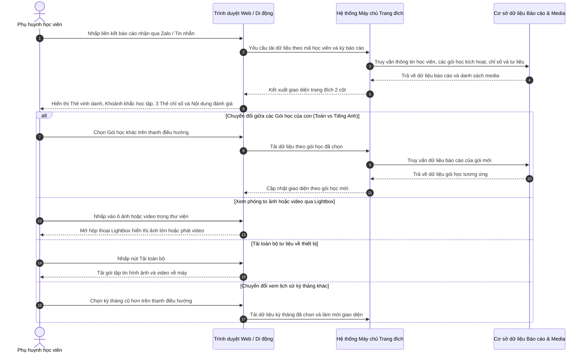

# US-CARE-03-03: Landing Page Báo cáo Tháng học viên

> **Nghiệp vụ:** Chăm sóc học viên & Tái phí học viên  
> **Vị trí hiển thị:** Trang đích công khai trực tuyến dành cho phụ huynh tại đường dẫn `/report/[id]?month=[month_value]`.  
> **Tài liệu cha:** `BF-CARE-03: Cơ chế Báo cáo Học tập Tháng & Kế hoạch Phát triển Học viên`  
> **Trực quan hóa:** Giao diện trang đích 2 cột hiện đại (`MonthlyReportLandingScreen`), tối ưu cho cả máy tính và thiết bị di động.  

---

## 1. BỐI CẢNH & PHẠM VI (CONTEXT & SCOPE)

### 1.1. Bối cảnh & Mục tiêu nghiệp vụ (Context & Objectives)
* **Vấn đề trước đây:** Báo cáo gửi phụ huynh trước đây thường ở dạng tệp hình ảnh đơn lẻ gửi qua tin nhắn Zalo hoặc tệp văn bản in giấy. Phụ huynh khó lưu trữ, không thể xem lại lịch sử các tháng cũ, không xem được các đoạn video con thuyết trình hay tải về hình ảnh chất lượng cao. Điều này làm giảm sự gắn kết và tính trang trọng của điểm chạm chăm sóc định kỳ, ảnh hưởng đến quyết định tái phí của phụ huynh.
* **Mục tiêu:** Cung cấp trang đích trực tuyến (Landing Page) độc lập, bảo mật và trang nhã dành cho phụ huynh:
  1. Trực quan hóa kết quả học tập trong **phạm vi chuẩn 1 tháng** (thời gian, chuyên cần, bài tập về nhà trên ứng dụng, điểm kiểm tra định kỳ).
  2. Vinh danh thành tích với danh hiệu tháng và lời nhận xét sư phạm chi tiết từ giáo viên bộ môn.
  3. Trình bày kế hoạch học tập tháng tới lấy từ Khung chương trình học của lớp đang ghép kèm hướng dẫn ôn tập 4 tuần và ảnh phiếu bài tập.
  4. **Tích hợp khoảnh khắc học tập trực quan:** Thư viện ảnh và video thực hành của học viên với hộp thoại xem lớn toàn màn hình (Lightbox) và nút tải toàn bộ về máy tính.
  5. Hỗ trợ tính năng in ấn chuẩn định dạng tài liệu lưu trữ (PDF) và nút sao chép liên kết chia sẻ nhanh.
* **Đối tượng sử dụng (Persona):**
  - Phụ huynh học viên (`PERSONA-PARENT`).
  - Nhân viên chăm sóc khách hàng (`PERSONA-CSM`).
  - Giáo viên bộ môn (`PERSONA-TEACHER`).
* **Chỉ số đo lường (KPI Target):**
  - Tỷ lệ phụ huynh mở xem trang đích báo cáo: Đạt trên 80% trong vòng 7 ngày kể từ khi gửi.
  - Tỷ lệ phụ huynh tải ảnh khoảnh khắc của con về máy: Đạt trên 50%.

### 1.2. Phạm vi yêu cầu chức năng (Feature Scope)

| Mã yêu cầu | Hạng mục chức năng | Mức ưu tiên | Vùng hiển thị | Mô tả chi tiết |
|---|---|:---:|---|---|
| **REQ-01** | Thanh điều hướng thương hiệu | Bắt buộc (Must) | Thanh trên cùng | Logo RinoEdu, bộ chọn kỳ báo cáo 1 tháng, nút in báo cáo và nút chia sẻ liên kết |
| **REQ-02** | Thẻ vinh danh học viên cố định | Bắt buộc (Must) | Cột trái (Sticky) | Avatar chữ cái, cúp vinh danh, tên học viên, thời gian 1 tháng, danh hiệu tháng, lời chúc giáo viên |
| **REQ-03** | Thư viện khoảnh khắc học tập | Bắt buộc (Must) | Cột trái (dưới thẻ con) | Lưới 6 ảnh/video thu nhỏ, đếm số ảnh còn lại, huy hiệu ẢNH/VIDEO, nút tải toàn bộ |
| **REQ-04** | Hộp thoại xem ảnh lớn (Lightbox) | Bắt buộc (Must) | Hộp thoại toàn màn hình | Xem ảnh gốc sắc nét, phát video trực tiếp, duyệt ảnh bằng phím mũi tên, tải lẻ từng tệp |
| **REQ-05** | Thẻ chỉ số học tập định lượng | Bắt buộc (Must) | Cột phải (trên cùng) | 3 thẻ nổi hiển thị Chuyên cần, Bài tập về nhà, Điểm kiểm tra kèm nút cuộn nhanh xuống nhận xét |
| **REQ-06** | Mục A: Đánh giá quá trình 1 tháng | Bắt buộc (Must) | Cột phải (khung giữa) | Trình bày rõ ràng Nhận xét chung A1 và Nhận xét kết quả học tập A2 |
| **REQ-07** | Mục B: Kế hoạch tháng tới & Ôn tập | Bắt buộc (Must) | Cột phải (khung dưới) | B1 kế hoạch lấy từ Khung chương trình lớp ghép, B2 ôn tập 4 tuần có ảnh phiếu bài tập đính kèm |
| **REQ-08** | In báo cáo & Xuất file lưu trữ | Bắt buộc (Must) | Nút hành động | Tự động kích hoạt hộp thoại in của trình duyệt, căn chỉnh bố cục trang nhã khi in hoặc lưu file |

### 1.3. Quy tắc nghiệp vụ cốt lõi (Business Rules)
1. **[RULE-MR-01] Phạm vi báo cáo chuẩn 1 tháng:** Trang đích phản ánh chính xác kết quả học tập và rèn luyện trong 1 chu kỳ dương lịch 1 tháng (ví dụ: `01/04/2026 đến 30/04/2026`). Phụ huynh có thể sử dụng bộ chọn kỳ báo cáo trên thanh điều hướng để xem lại các tháng trước đó.
2. **[RULE-MR-02] Bảo mật liên kết truy cập trang đích:** Trang đích được mở qua đường dẫn có mã định danh học viên (ví dụ: `/report/std-101?month=4_5_2026`). Hệ thống chỉ hiển thị đúng thông tin của học viên tương ứng, không hiển thị dữ liệu hay danh sách của các học viên khác trong lớp.
3. **[RULE-MR-03] Khoảnh khắc học tập trực quan (Photo & Video Gallery):**
   - Hiển thị tối đa 6 ô thu nhỏ gồm hình ảnh hoạt động trên lớp và video học sinh thuyết trình.
   - Các tệp video có huy hiệu `VIDEO` và biểu tượng nút phát; tệp hình ảnh có huy hiệu `ẢNH`.
   - Nếu tổng số tư liệu $> 6$, ô thứ 6 hiển thị lớp phủ mờ với bộ đếm: `+X khoảnh khắc`.
   - Bấm vào bất kỳ ô nào sẽ mở hộp thoại xem ảnh lớn toàn màn hình (Lightbox) với độ phân giải cao nhất.
4. **[RULE-MR-04] Tải về tư liệu học tập:** Cung cấp nút `Tải toàn bộ` để phụ huynh có thể tải trọn bộ hình ảnh và video của con trong tháng về máy tính hoặc điện thoại chỉ với 1 lần bấm. Trong hộp thoại xem ảnh lớn cũng cung cấp nút tải lẻ cho từng bức ảnh.
5. **[RULE-MR-05] Kế hoạch bài học lấy từ Khung chương trình của Lớp đang ghép:**
   - Nội dung bài học tháng tới (Mục B1) phản ánh chính xác các chủ đề bài học thuộc Khung chương trình mà lớp học viên đang học sẽ triển khai trong tháng tiếp theo.
   - Kế hoạch ôn tập 4 tuần (Mục B2) hiển thị đầy đủ nội dung bài tập rèn luyện tại nhà, kèm ảnh phiếu học tập và liên kết tài liệu để phụ huynh dễ dàng in ra hoặc mở cùng con luyện tập.
6. **[RULE-MR-06] In ấn chuẩn định dạng tài liệu lưu trữ (Print / PDF):**
   - Khi phụ huynh bấm `In báo cáo`, hệ thống ẩn thanh điều hướng, ẩn nút bấm và các chi tiết thừa, tự động căn chỉnh bố cục 2 cột sang định dạng trang in thanh lịch, cho phép in ra giấy hoặc lưu thành file PDF làm kỷ niệm.

---

## 2. LUỒNG NGHIỆP VỤ (USER FLOW)

---

## 3. GIAO DIỆN, PHÂN QUYỀN & RÀNG BUỘC (UI, PERMISSION & VALIDATION RULES)

### 3.1. Bảng mô tả chi tiết giao diện tĩnh (UI Structure Table)

| Thành phần giao diện | Loại control | Giá trị mặc định / Giới hạn | Mô tả chi tiết & Trạng thái | Quy tắc vận hành & Thao tác |
|---|---|---|---|---|
| **Thanh điều hướng cố định** | Khung thanh trên cùng | Chiều cao 56px, nền mờ | Chứa logo RinoEdu, bộ chọn kỳ, nút in và nút chia sẻ | Luôn ghim ở đầu màn hình khi người dùng cuộn xem nội dung |
| **Bộ chọn Kỳ báo cáo trên thanh** | Hộp chọn thả xuống | `Báo cáo Tháng 4 & Kế hoạch Tháng 5/2026` | Chữ in đậm cỡ nhỏ, bo góc mềm mại | Cho phép phụ huynh xem lại báo cáo các tháng trước đó |
| **Nút In báo cáo** | Nút bấm kèm biểu tượng | Biểu tượng máy in + Chữ "In báo cáo" | Nút viền mỏng bo góc nhẹ, chỉ hiển thị trên màn hình máy tính | Nhấp để mở hộp thoại in của trình duyệt hoặc lưu file PDF |
| **Nút Chia sẻ** | Nút bấm chính | Biểu tượng chia sẻ + Chữ "Chia sẻ" | Nền màu nhấn nổi bật, đổi trạng thái sang "Đã sao chép!" khi bấm | Nhấp để sao chép đường dẫn trang đích vào bộ nhớ tạm |
| **Thẻ học viên vinh danh** | Khung thẻ nổi cao cấp | Chiều rộng chiếm trọn cột trái | Nền chuyển màu vàng cam nhẹ nhàng, viền mỏng thanh lịch | Cố định ở cột trái trên máy tính, hiển thị đầu tiên trên điện thoại |
| **Avatar chữ cái & Cúp vinh danh** | Khối hình ảnh đại diện | Chữ cái đầu tên con + Cúp vàng | Khung chữ nhật bo tròn lớn kèm biểu tượng cúp vàng ở góc | Nhận diện học viên trực quan, tạo cảm giác được tôn vinh |
| **Danh hiệu vinh danh tháng** | Khung nhãn danh hiệu lớn | Biểu tượng cúp + Tên danh hiệu | Nền vàng cam rực rỡ, chữ in hoa đậm nét (VD: `🏆 CAO THỦ GIẢI TOÁN`) | Vinh danh danh hiệu xuất sắc con đạt được trong tháng |
| **Lời chúc từ Giáo viên** | Đoạn văn bản trang nhã | Lời chúc mừng và ghi nhận | Chữ xám đậm dễ đọc, in đậm tên con và tên giáo viên bộ môn | Tạo cầu nối tình cảm ấm áp giữa giáo viên và gia đình |
| **Lưới 6 ô Khoảnh khắc học tập** | Lưới ảnh thu nhỏ | Tối đa 6 ô tỉ lệ vuông | Hiển thị các bức ảnh và video của con trong tháng kèm nhãn ẢNH / VIDEO | Bấm vào ô bất kỳ để mở hộp thoại xem ảnh lớn toàn màn hình |
| **Nút Tải toàn bộ ảnh** | Nút bấm phụ | Biểu tượng tải xuống + Chữ "Tải toàn bộ" | Đặt ở thanh đầu của khối khoảnh khắc học tập | Bấm để tải toàn bộ hình ảnh và video của con về máy tính |
| **Hộp thoại xem ảnh lớn (Lightbox)** | Hộp thoại toàn màn hình | Kích thước 96vw x 90vh | Nền đen tuyền mờ ảo, hiển thị ảnh gốc sắc nét hoặc trình phát video | Hỗ trợ duyệt ảnh bằng phím mũi tên hoặc nút chuyển tiếp |
| **Cụm 3 Thẻ chỉ số học tập** | Thẻ thông tin định lượng | Số liệu tháng: Chuyên cần, BTVN, Điểm thi | 3 thẻ bo góc mềm mại đặt ở đầu cột phải kèm nút cuộn nhanh | Bấm nút cuộn để di chuyển nhanh xuống phần nhận xét tương ứng |
| **Khung nhận xét A1 và A2** | Khung nội dung văn bản | Định dạng phân đoạn sư phạm | Phân tách rõ ràng Điểm nổi bật, Điểm cần lưu ý, Từ vựng, Ngữ pháp | Trình bày mạch lạc, dễ đọc trên cả màn hình nhỏ |
| **Khung kế hoạch B1 và B2** | Khung kế hoạch học tập | Kế hoạch bài học + 4 thẻ tuần ôn tập | Trình bày bài học Khung chương trình lớp ghép và 4 tuần ôn tập có ảnh phiếu học | Phụ huynh nắm rõ lộ trình tháng tới và có tài liệu đồng hành |
| **Chân trang thương hiệu** | Khung chân trang | Thông tin hệ thống giáo dục RinoEdu | Chữ nhỏ trang nhã ở cuối trang, tự động ẩn khi in ấn | Thể hiện tính chuyên nghiệp và bản quyền hệ thống |

### 3.2. Ràng buộc kiểm tra dữ liệu (Validation Rules)
* **Chỉ đọc toàn diện:** Toàn bộ trang đích hoạt động ở chế độ chỉ đọc (Read-only); không có bất kỳ biểu mẫu nhập liệu hay nút bấm chỉnh sửa nào từ phía phụ huynh.
* **Xác thực mã học viên:** Hệ thống kiểm tra tính hợp lệ của mã học viên trên đường dẫn; nếu mã không tồn tại, hiển thị thông báo lỗi thân thiện: "Không tìm thấy hồ sơ báo cáo học tập của học viên".

### 3.3. Ma trận phân quyền năng lực động (Dynamic Capability Gating)

| Mã Quyền Hạn (Permission Key) | Tên Quyền Hạn | Phạm Vi Điều Khiển | Diễn Giải Nghiệp Vụ |
| :--- | :--- | :--- | :--- |
| `care.monthly_report.view_detail` | Xem trang đích báo cáo | Toàn bộ trang đích | Cho phép phụ huynh mở xem toàn bộ nội dung báo cáo qua đường link |
| `care.monthly_report.share` | Sao chép liên kết chia sẻ | Nút chia sẻ | Cho phép sao chép liên kết trang đích để gửi qua tin nhắn |
| `care.monthly_report.print` | In ấn và xuất tài liệu lưu trữ | Nút in báo cáo | Cho phép kích hoạt chức năng in ấn chuẩn định dạng trang in |

---

## 4. KHỐI CHỨC NĂNG & TIÊU CHÍ NGHIỆM THU (ACTIONS & ACCEPTANCE CRITERIA)

### AC-01 (Happy Path - Xem trang đích báo cáo tháng đầy đủ thông tin)
* **Giả sử:** Phụ huynh nhận được đường dẫn xem báo cáo tháng của con qua tin nhắn Zalo.
* **Khi:** Phụ huynh nhấp vào đường dẫn và mở trên trình duyệt.
* **Thì:**
  - Trang đích tải mượt mà với bố cục 2 cột trang nhã.
  - Cột trái hiển thị thẻ học viên với avatar chữ cái, cúp vinh danh, tên con, chu kỳ 1 tháng (ví dụ: `01/04/2026 đến 30/04/2026`), huy hiệu danh hiệu vinh danh tháng và lời chúc từ giáo viên.
  - Khối khoảnh khắc học tập hiển thị các ô ảnh và video con thực hành trong tháng.
  - Cột phải hiển thị 3 thẻ chỉ số định lượng (Chuyên cần, BTVN, Điểm thi), Mục A nhận xét quá trình và Mục B kế hoạch học tập tháng tới.

### AC-02 (Interactive Path - Xem ảnh phóng to toàn màn hình qua Lightbox)
* **Giả sử:** Thư viện khoảnh khắc học tập đang hiển thị các ô ảnh thu nhỏ.
* **Khi:** Phụ huynh nhấp vào một ô hình ảnh bất kỳ.
* **Thì:**
  - Hệ thống mở hộp thoại xem ảnh lớn (Lightbox) toàn màn hình trên nền tối mờ ảo.
  - Hiển thị bản ảnh gốc độ phân giải cao sắc nét, giữ nguyên tỷ lệ thực của tác phẩm.
  - Thanh trên hiển thị tiêu đề ảnh, ngày học và số thứ tự ảnh (ví dụ: `Ảnh 1 / 6`).
  - Phụ huynh có thể nhấp phím mũi tên Trái/Phải hoặc nút chuyển tiếp để xem các ảnh tiếp theo, hoặc bấm phím `Esc` để đóng.

### AC-03 (Interactive Path - Phát video con thuyết trình trực tiếp trong Lightbox)
* **Giả sử:** Thư viện khoảnh khắc có ô video mang huy hiệu `VIDEO` và biểu tượng nút phát.
* **Khi:** Phụ huynh nhấp vào ô video đó.
* **Thì:**
  - Hộp thoại Lightbox mở ra và trang bị sẵn trình phát video đa phương tiện ở vị trí trung tâm.
  - Video sẵn sàng phát với âm thanh và hình ảnh rõ nét ghi lại khoảnh khắc học sinh thuyết trình.
  - Cung cấp đầy đủ thanh điều khiển: phát/tạm dừng, thanh trượt thời gian, âm lượng và nút phóng to toàn màn hình.

### AC-04 (Action Path - Tải toàn bộ hình ảnh và video của con về máy)
* **Giả sử:** Phụ huynh muốn lưu toàn bộ kỷ niệm học tập của con trong tháng về điện thoại hoặc máy tính.
* **Khi:** Phụ huynh nhấp nút `Tải toàn bộ` ở đầu khối khoảnh khắc.
* **Thì:**
  - Hệ thống tự động kích hoạt tải gói hình ảnh và video của con về thiết bị.
  - Hiển thị thông báo nổi: *"Đang tải toàn bộ ảnh & video của con..."*.

### AC-05 (Action Path - In báo cáo hoặc xuất file lưu trữ PDF)
* **Giả sử:** Phụ huynh hoặc trung tâm muốn in bản báo cáo ra giấy để lưu hồ sơ học tập.
* **Khi:** Người dùng nhấp nút `In báo cáo` trên thanh điều hướng.
* **Thì:**
  - Trình duyệt tự động mở hộp thoại in ấn tiêu chuẩn.
  - Bố cục trang in được tối ưu: ẩn thanh điều hướng, ẩn nút bấm và các chi tiết thừa, căn chỉnh nội dung 2 cột trang nhã vừa vặn trang giấy.
  - Người dùng có thể in trực tiếp ra máy in hoặc chọn mục "Lưu dưới dạng PDF" để lưu vào máy.

### AC-06 (Alternate Path - Chuyển đổi xem các kỳ báo cáo tháng khác)
* **Giả sử:** Học viên đã học nhiều tháng và có dữ liệu của các kỳ trước đó.
* **Khi:** Phụ huynh nhấp vào hộp chọn kỳ báo cáo trên thanh điều hướng và chọn kỳ tháng cũ hơn (ví dụ: `Báo cáo Tháng 3 & Kế hoạch Tháng 4/2026`).
* **Thì:**
  - Toàn bộ giao diện trang đích tự động làm mới và cập nhật đúng số liệu, nhận xét, kế hoạch và thư viện ảnh của kỳ tháng được chọn.

---

## 5. CÁC TRƯỜNG HỢP GÓC CẠNH & LUỒNG NGOẠI LỆ (CORNER CASES & EXCEPTION FLOWS)

* **[CASE-01] Đường dẫn báo cáo không hợp lệ hoặc học sinh bị xóa:** Giao diện hiển thị trang thông báo lỗi trang nhã: "Không tìm thấy hồ sơ báo cáo học tập. Vui lòng liên hệ trung tâm để được hỗ trợ!", có nút quay lại trang chủ.
* **[CASE-02] Tháng học chưa có hình ảnh khoảnh khắc học tập nào:** Khối khoảnh khắc học tập tự động ẩn khỏi cột bên trái, khung thông tin học viên tự động co giãn vừa vặn, không để lại khoảng trống thừa thãi.
* **[CASE-03] Mạng yếu khi mở xem ảnh chất lượng cao trong Lightbox:** Hộp thoại hiển thị ảnh thu nhỏ có độ phân giải vừa phải trước, kèm biểu tượng xoay tải nhẹ nhàng ở giữa cho đến khi ảnh gốc tải về hoàn tất.
* **[CASE-04] Xem trang đích trên màn hình điện thoại di động có bề ngang hẹp:** Hệ thống tự động chuyển đổi bố cục từ 2 cột sang 1 cột tuần tự: Thẻ vinh danh con hiển thị đầu tiên $\rightarrow$ Khoảnh khắc học tập $\rightarrow$ 3 Thẻ chỉ số $\rightarrow$ Nhận xét Mục A $\rightarrow$ Kế hoạch Mục B.
* **[CASE-05] Phụ huynh bấm sao chép liên kết trên trình duyệt không hỗ trợ:** Hệ thống tự động bôi đen toàn bộ thanh địa chỉ trình duyệt và hiển thị thông báo hướng dẫn phụ huynh bấm phím tắt sao chép thủ công.
* **[CASE-06] Báo cáo tháng đang trong thời gian giáo viên chỉnh sửa (chưa khóa):** Trang đích tự động đồng bộ dữ liệu thời gian thực; ngay khi giáo viên bấm lưu thay đổi từ hệ thống quản trị, bản hiển thị trên trang đích của phụ huynh được cập nhật đồng nhất ngay trong lần tải tiếp theo.

---

## 6. YÊU CẦU PHI CHỨC NĂNG & GIAO THỨC KẾT NỐI

### 6.1. Yêu cầu Phi chức năng (Non-Functional Requirements)
- **Tốc độ tải trang đầu tiên:** Thời gian hiển thị nội dung chính trên thiết bị di động phải dưới 1.2 giây trên mạng 4G thông thường.
- **Tối ưu hình ảnh tự động:** Ảnh tải lên được tự động nén định dạng hiện đại để tiết kiệm dung lượng dữ liệu cho phụ huynh khi xem qua mạng di động.
- **Tính tương thích in ấn:** Định dạng in ấn phải hỗ trợ chuẩn khổ giấy A4 dọc, đảm bảo độ sắc nét của chữ và hình ảnh.

### 6.2. Giao thức Kết nối & Dữ liệu Trao đổi
- **Truy xuất dữ liệu trang đích:** Giao diện gọi đến cơ sở dữ liệu báo cáo học tập theo `studentId` và `monthOptionValue`. Gói dữ liệu phản hồi bao gồm: thông tin học viên (tên, avatar chữ cái), kỳ báo cáo, khoảng thời gian 1 tháng, danh hiệu vinh danh, tên giáo viên, chỉ số chuyên cần/BTVN/kiểm tra, nhận xét A1/A2, kế hoạch bài học B1, danh sách tuần ôn tập B2, và danh sách ảnh/video khoảnh khắc.
- **Lắng nghe sự kiện làm mới:** Giao diện trang đích có cơ chế tự động làm mới khi phát hiện có tín hiệu cập nhật báo cáo từ tài khoản quản trị viên.
