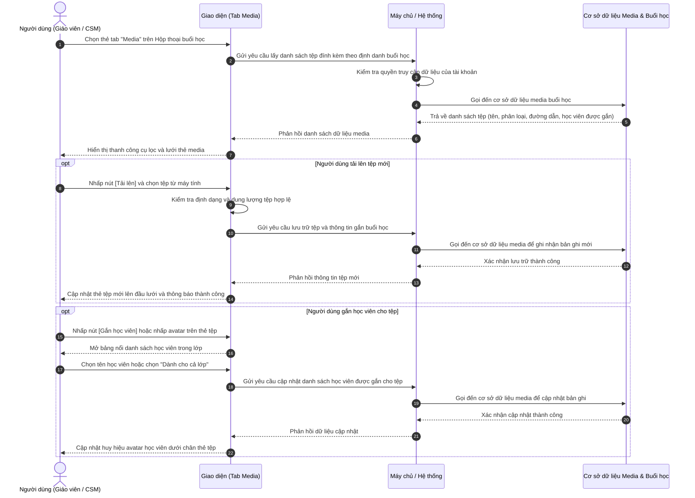

# US-CLS05-07: Quản lý media upload buổi học (Class Session Media Gallery & Upload)

> **Tham chiếu:** `BF-CLS-05` · `SR-CLS-005` · `ENTERPRISE_STANDARDS.md` · Giao diện Mẫu §4.3 (Hộp thoại chi tiết & Danh sách tư liệu đa phương tiện)  
> **Đường dẫn màn hình & Trạng thái liên quan:**  
> - `Lịch học lớp (/app/calendar_class_schedule)` -> Nhấp vào ca học lớp -> Mở Hộp thoại Chi tiết buổi học -> Chuyển sang thẻ tab `Media`  
> - `Danh sách lớp học (/app/classes)` -> Mở Chi tiết lớp học -> Lịch trình buổi học -> Thẻ tab `Media`  

---

## 1. NHẬT KÝ THAY ĐỔI & BỐI CẢNH (CHANGELOG & CONTEXT)

### Lịch sử cập nhật tài liệu (Changelog)

| Ngày cập nhật | Nội dung cập nhật | Lý do cập nhật |
|---|---|---|
| 15/09/2026 | Khởi tạo tài liệu đặc tả nghiệp vụ chi tiết cho tab Media trong hộp thoại Chi tiết buổi học | Chuẩn hóa tài liệu phát triển chức năng quản lý, tải lên, gán học viên và chia sẻ tư liệu học tập buổi học theo chuẩn Enterprise |
| 16/09/2026 | Lược bỏ tính năng lọc thời gian trên thanh công cụ do tư liệu được tải lên theo từng buổi học cụ thể | Chuẩn hóa trải nghiệm người dùng, tinh gọn thanh công cụ theo đúng bản chất nghiệp vụ ca học |
| 16/09/2026 | Làm rõ phạm vi phân hệ chỉ là Media buổi học (không bao gồm học liệu khung chương trình), đổi nút Thêm thành Gắn học viên và chuẩn hóa 12 trường hợp góc cạnh | Tách bạch kiến trúc phân hệ theo đúng chỉ đạo sản phẩm, chuẩn hóa luồng tải lên và bảo vệ dữ liệu |

### Bối cảnh & Vấn đề nghiệp vụ (Context & Problem)
* **Bối cảnh:** Trong mỗi buổi học tại các cơ sở đào tạo, giáo viên và nhân sự vận hành lớp thường xuyên ghi nhận các tư liệu thực tế: hình ảnh bảng từ vựng, hình ảnh hoạt động nhóm, video bài tập thuyết trình hoặc clip thực hành của học viên. Những tư liệu này cần được lưu trữ tập trung theo từng buổi học và phân bổ chính xác cho cả lớp hoặc riêng cho từng học viên.
* **Ranh giới nghiệp vụ (Scope Boundaries):**
  - **Phạm vi quản lý:** Phân hệ này tập trung 100% vào **Media buổi học** (hình ảnh, video hoạt động thực tế, minh chứng bài tập quay chụp tại lớp).
  - **Điểm tách bạch kiến trúc:** Học liệu và giáo trình sư phạm theo Khung chương trình (KCT) như giáo án, bài giảng trình chiếu, bài tập về nhà theo phân phối chương trình, tệp nghe audio được quản lý độc lập tại phân hệ Khung KCT của lớp học và hoàn toàn không thuộc phạm vi của User Story này.
* **Vấn đề hiện tại:** Trước đây, hình ảnh và video buổi học thường được gửi phân tán qua các kênh trao đổi cá nhân, dẫn đến thất lạc tư liệu, phụ huynh không theo dõi được hoạt động thực tế của con, và giáo viên gặp khó khăn khi muốn tìm lại tư liệu của một buổi học cụ thể.
* **Mục tiêu & Giá trị mang lại:** Cung cấp tab chuyên biệt `Media` ngay trong cửa sổ Chi tiết buổi học, cho phép:
  - Xem danh sách hình ảnh, video dưới dạng lưới thẻ trực quan.
  - Lọc nhanh tệp theo học viên được gắn hoặc chọn xem tệp dành cho cả lớp.
  - Tải lên một hoặc nhiều tệp media cùng lúc (hình ảnh, video bài giảng, tệp minh chứng).
  - Gắn nhãn học viên cho từng tệp riêng lẻ hoặc thao tác gắn hàng loạt cho nhiều tệp được chọn.
  - Xóa tệp đơn lẻ hoặc xóa hàng loạt có hộp thoại xác nhận bảo vệ an toàn dữ liệu.
  - Tải tệp về máy tính hoặc sao chép nhanh liên kết chia sẻ tệp cho phụ huynh và học viên.

### Hiểu người dùng & Tình huống sử dụng (User Needs & Use Cases)
* **Người dùng chính (Persona):** Giáo viên trực tiếp giảng dạy (`PERSONA-TEACHER`), Nhân viên chăm sóc học viên / Giáo vụ (`PERSONA-CSM`), Quản lý chi nhánh (`PERSONA-BRANCH-MANAGER`).
* **Nhu cầu thực tế (Needs):**
  - Giáo viên: Sau giờ học, tải nhanh ảnh chụp bài làm của nhóm, video học viên thuyết trình, và gắn tên học viên tương ứng để hệ thống lưu hồ sơ học tập.
  - Nhân viên CSM: Tìm kiếm nhanh các hình ảnh của một học viên cụ thể trong tháng để làm báo cáo học tập hoặc gửi cập nhật cho phụ huynh.
  - Quản lý cơ sở: Kiểm tra việc lưu trữ hình ảnh, video minh chứng buổi học của đội ngũ giảng dạy.
* **Câu phát biểu nghiệp vụ:** **Là một** Giáo viên hoặc Nhân viên vận hành lớp học, **tôi muốn** quản lý toàn bộ hình ảnh và video của buổi học tại một giao diện tập trung, **để** dễ dàng tải lên, gắn đích danh học viên, tải về và chia sẻ tư liệu an toàn, chính xác.

### Phạm vi kiểm soát (Scope)
* **Phạm vi chức năng:** Nằm trọn vẹn trong tab `Media` thuộc hộp thoại Chi tiết buổi học (Session Detail Dialog) trên giao diện Lịch học (`/app/calendar_class_schedule`) và giao diện Chi tiết lớp học (`/app/classes`).
* **Các loại tệp hỗ trợ:**
  - Hình ảnh: `.jpg`, `.jpeg`, `.png`, `.webp`, `.gif`.
  - Video: `.mp4`, `.mov`, `.webm` (kèm biểu tượng phát video và thời lượng nếu có).
  - Tệp tài liệu minh chứng: `.pdf`, `.doc`, `.docx`.
* **Ràng buộc nghiệp vụ toàn cục (Global Rules):**
  - **[RULE-MEDIA-01] Nguồn dữ liệu hợp nhất:** Mọi tệp hình ảnh/video đều gắn liền với định danh buổi học (`sessionId`). Khi người dùng mở chi tiết của một buổi học cụ thể, danh sách tệp mặc định hiển thị toàn bộ tệp thuộc về buổi học đó.
  - **[RULE-MEDIA-02] Chế độ hiển thị:**
    - Khi xem trong hộp thoại Chi tiết buổi học đơn lẻ: Hiển thị lưới thẻ tệp của buổi học hiện tại, không lặp lại tiêu đề buổi học ở từng nhóm.
    - Khi xem trong màn hình toàn bộ lớp học: Tự động gom nhóm tệp theo từng buổi học (Buổi 1, Buổi 2...) kèm thông tin ngày học, giờ học và giáo viên phụ trách.
  - **[RULE-MEDIA-03] Quy tắc gắn học viên mặc định:** Một tệp khi mới tải lên chưa gắn học viên nào sẽ được hệ thống hiểu là `Dành cho cả lớp` (danh sách mã học viên rỗng). Khi gắn một hoặc nhiều học viên, tệp sẽ chuyển sang trạng thái cá nhân hóa theo từng học viên được chọn.
  - **[RULE-MEDIA-04] Giới hạn tải lên:** Mỗi lượt tải lên cho phép tối đa 10 tệp cùng lúc. Dung lượng tối đa cho mỗi tệp hình ảnh/tài liệu là 25MB, tệp video là 100MB.
  - **[RULE-MEDIA-05] Thao tác phá hủy an toàn:** Mọi hành vi xóa tệp (xóa từng tệp hoặc xóa hàng loạt) bắt buộc phải hiển thị Hộp thoại xác nhận (Confirm Dialog) yêu cầu người dùng xác nhận trước khi xóa vĩnh viễn khỏi cơ sở dữ liệu.
  - **[RULE-MEDIA-06] Bảo mật thông tin liên hệ:** Khi hiển thị thông tin thẻ hồ sơ giáo viên tải tệp (nếu có thẻ nổi liên hệ), số điện thoại phải được che ẩn ở giữa dạng `090****567` nhằm tránh sao chép thông tin cá nhân.
* **Chỉ số hiệu quả đo lường (KPIs):**
  - Tỷ lệ tải lên thành công: Đạt $\ge 99\%$ các lượt tải tệp hợp lệ.
  - Thời gian hiển thị danh sách media: Không quá 300ms từ bộ nhớ tạm hoặc không quá 800ms từ cơ sở dữ liệu.
  - Thời gian gắn học viên cho tệp: Hoàn tất trong 1 thao tác bấm chọn trên bảng nổi.

---

## 2. LUỒNG XỬ LÝ CHÍNH (MAIN FLOW - HAPPY PATH)

---

## 3. GIAO DIỆN, QUY TẮC KIỂM SOÁT DỮ LIỆU & PHÂN QUYỀN (UI, VALIDATION RULES & PERMISSION GATING)

### 3.1. Cấu trúc các vùng giao diện & Ràng buộc Quyền hạn (Capability Gating)

Giao diện áp dụng cơ chế kiểm soát hiển thị theo **Mã Quyền Động (Atomic Permissions)**, không gán cứng theo chức danh tài khoản:

| Vùng Giao diện / Nút Thao Tác | Loại Hiển Thị | Mã Quyền Yêu Cầu (Required Capability) | Xử Lý Khi Không Đủ Quyền |
|---|---|---|---|
| **Xem thẻ tab Media** | Thẻ tab điều hướng và lưới nội dung | `class.session_media.view` | Ẩn thẻ tab hoặc chặn truy cập nội dung |
| **Thanh công cụ Lọc học viên** | Hộp thả xuống và bảng nổi chọn học viên | `class.session_media.view` | Cho phép sử dụng nếu có quyền xem |
| **Nút [Tải lên]** | Nút hành động trên thanh công cụ | `class.session_media.upload` | Ẩn nút Tải lên khỏi thanh công cụ |
| **Nút [Gắn HV] & Bảng nổi chọn học viên** | Nút hành động hàng loạt và bảng nổi trên thẻ | `class.session_media.tag_student` | Ẩn nút [Gắn HV] và vô hiệu hóa chức năng chọn học viên |
| **Nút [Xóa] hàng loạt & Xóa thẻ học viên** | Nút hành động trên thanh công cụ và biểu tượng xóa | `class.session_media.delete` | Ẩn nút Xóa hàng loạt và không cho phép xóa tệp |
| **Nút [Tải về] & Nút [Chia sẻ] (Copy link)** | Nút tròn nổi khi di chuột lên thẻ | `class.session_media.download` | Vô hiệu hóa hoặc ẩn các nút tải về/sao chép liên kết |

### 3.2. Cấu trúc thành phần giao diện tab Media

#### Bảng thành phần giao diện chính

| Thành phần giao diện | Vị trí hiển thị | Loại thành phần | Mô tả & Quy tắc hiển thị |
|---|---|---|---|
| **Hộp kiểm Chọn tất cả** | Góc trái thanh công cụ | Ô chọn (Checkbox) | Cho phép chọn nhanh hoặc bỏ chọn toàn bộ các tệp đang hiển thị trên lưới |
| **Nút Lọc theo học viên** | Cạnh hộp kiểm chọn tất cả | Nút mở bảng nổi (Dropdown Button) | Hiển thị nhãn số lượng: "Tất cả tệp (N)", "Dành cho cả lớp" hoặc tên học viên đang được chọn lọc |
| **Bảng nổi Lọc học viên** | Bảng bật lên khi bấm nút Lọc học viên | Bảng thông tin nổi (Popover) | Gồm: Ô tìm kiếm học viên, tùy chọn "Tất cả tệp", tùy chọn "Dành cho cả lớp", và danh sách từng học viên kèm avatar, tên, mã số, số lượng tệp |
| **Nút [Xóa] hàng loạt** | Bên phải thanh công cụ (chỉ hiện khi có chọn tệp) | Nút viền cảnh báo | Chỉ xuất hiện khi có ít nhất 1 tệp được tích chọn. Bấm vào mở Hộp thoại xác nhận xóa |
| **Nút [Gắn HV] hàng loạt** | Bên phải thanh công cụ (chỉ hiện khi có chọn tệp) | Nút viền màu nhấn | Chỉ xuất hiện khi có ít nhất 1 tệp được tích chọn. Bấm vào mở bảng nổi chọn học viên để gắn đồng loạt |
| **Nút [+ Tải lên]** | Góc phải thanh công cụ | Nút bấm kèm biểu tượng mũi tên tải lên | Cho phép kích hoạt hộp thoại chọn tệp từ máy tính |
| **Khung trạng thái rỗng** | Giữa màn hình khi không có tệp | Khung thông báo rỗng (Empty State) | Biểu tượng cuộn phim mờ, tiêu đề "Không tìm thấy media phù hợp", phụ đề hướng dẫn bấm tải lên hoặc đổi bộ lọc |
| **Lưới thẻ Media (Media Grid)** | Thân màn hình | Lưới co giãn 3 cột | Hiển thị danh sách các tệp media dưới dạng các ô thẻ tỉ lệ 16:10 |
| **Thẻ Media: Khung ảnh / video / tệp** | Bên trong mỗi thẻ | Khung hiển thị phương tiện | Ảnh: hiển thị thu nhỏ vừa khung; Video: hiển thị ảnh bìa kèm nút phát video mờ; Tệp tài liệu minh chứng: hiển thị biểu tượng văn bản và tên tệp |
| **Thẻ Media: Dải phủ trên cùng** | Đỉnh của mỗi thẻ media | Dải phủ có bóng mờ | Bên trái: Hộp kiểm chọn thẻ và tên tệp đầy đủ (hiện khi di chuột hoặc khi được chọn); Bên phải: Nhãn phân loại loại tệp ("ẢNH", "VIDEO", "TỆP") |
| **Thẻ Media: Lớp phủ thao tác** | Giữa thẻ khi di chuột vào | Lớp phủ mờ thao tác (Hover Overlay) | Gồm 3 nút: Nút [Chia sẻ] (sao chép liên kết), Nút [Tải về] (download tệp), Nút [Gắn học viên] (mở bảng nổi gắn học viên cho thẻ này) |
| **Thẻ Media: Dải chân thẻ** | Đáy của mỗi thẻ media | Dải phủ mờ chân thẻ | Nếu gắn cho cả lớp: hiển thị chấm tròn màu xanh lục kèm chữ "Dành cho cả lớp"; Nếu gắn cho học viên cụ thể: hiển thị các hình tròn đại diện (avatar) của học viên, di chuột hiện dấu nhân [X] để xóa nhanh |

#### Bảng quy chuẩn trường dữ liệu và ràng buộc kiểm tra dữ liệu (Validation Rules)

| Trường thông tin | Kiểu dữ liệu | Bắt buộc | Nguồn dữ liệu | Quy tắc kiểm tra (Validation) | Quy cách hiển thị |
|---|---|---|---|---|---|
| **Mã định danh tệp (id)** | Chuỗi ký tự | Bắt buộc | Cơ sở dữ liệu | Định danh duy nhất trong toàn hệ thống | Ẩn trên giao diện người dùng |
| **Mã định danh buổi học (sessionId)** | Chuỗi ký tự | Bắt buộc | Cơ sở dữ liệu | Khóa ngoại trỏ về buổi học tương ứng | Dùng để phân nhóm dữ liệu |
| **Tên tệp (name)** | Chuỗi ký tự | Bắt buộc | Người dùng tải lên | Tối đa 255 ký tự, giữ nguyên đuôi tệp gốc | Cắt ngắn kèm dấu ba chấm nếu quá dài |
| **Phân loại tệp (type)** | Giá trị danh mục | Bắt buộc | Hệ thống nhận diện | Một trong 3 giá trị: `image`, `video`, `doc` | Nhãn chữ nổi in hoa: ẢNH / VIDEO / TỆP |
| **Đường dẫn tệp (url)** | Chuỗi đường dẫn | Bắt buộc | Cơ sở dữ liệu | Đường dẫn tệp an toàn trên hệ thống lưu trữ | Dùng để tải về hoặc sao chép liên kết |
| **Dung lượng tệp (size)** | Chuỗi hiển thị | Tùy chọn | Hệ thống tính toán | Định dạng đơn vị đo `MB` hoặc `KB` | Hiển thị trong thông tin tệp |
| **Học viên được gắn (taggedStudentIds)** | Danh sách chuỗi | Không | Người dùng gán | Danh sách mã định danh học viên thuộc lớp học; rỗng biểu thị cho cả lớp | Hiển thị chấm "Dành cho cả lớp" hoặc danh sách avatar |

---

## 4. KHỐI CHỨC NĂNG CHI TIẾT: ACTION & LUỒNG KÍCH HOẠT (ACTIONS & EVENTS)

### Khối chức năng 1: Lọc và Tìm kiếm Media Buổi học

#### Action 1.1: Lọc theo Học viên được gắn
* **Luồng kích hoạt:** Người dùng nhấp vào nút [Lọc theo học viên] trên thanh công cụ, hệ thống mở bảng nổi danh sách lựa chọn. Người dùng có thể tìm kiếm tên học viên và nhấp chọn một đối tượng lọc.
* **Tiêu chí nghiệm thu (Acceptance Criteria):**
  - **AC-1 (Happy Path - Chọn lọc học viên cụ thể):**
    - **Giả sử:** Lưới media đang hiển thị 7 tệp của buổi học, trong đó học viên "Nguyễn Hà Phương" được gắn vào 2 tệp.
    - **Khi:** Người dùng mở bảng nổi, chọn học viên "Nguyễn Hà Phương".
    - **Thì:** Lưới media chỉ hiển thị 2 tệp có gắn học viên "Nguyễn Hà Phương", nút kích hoạt cập nhật nhãn hiển thị thành tên "Nguyễn Hà Phương", và bảng nổi tự động đóng lại.
  - **AC-2 (Happy Path - Chọn lọc Dành cho cả lớp):**
    - **Giả sử:** Bảng nổi lọc học viên đang mở.
    - **Khi:** Người dùng nhấp chọn mục "Dành cho cả lớp (3)".
    - **Thì:** Lưới media cập nhật chỉ hiển thị 3 tệp dành cho cả lớp (không gắn riêng cho bất kỳ học viên nào), nút lọc cập nhật nhãn thành "Dành cho cả lớp".
  - **AC-3 (Happy Path - Chọn Tất cả tệp):**
    - **Giả sử:** Giao diện đang ở trạng thái lọc một học viên riêng lẻ.
    - **Khi:** Người dùng mở bảng nổi và chọn mục "Tất cả tệp (7)".
    - **Thì:** Lưới media khôi phục hiển thị toàn bộ 7 tệp của buổi học, nút lọc cập nhật lại thành "Tất cả tệp (7)".
  - **AC-4 (Alternate Path - Tìm kiếm học viên trong danh sách):**
    - **Giả sử:** Lớp học có 15 học viên, bảng nổi đang hiển thị đầy đủ danh sách.
    - **Khi:** Người dùng nhập chuỗi ký tự "Phương" vào ô "Tìm học viên...".
    - **Thì:** Danh sách học viên tức thì lọc lại chỉ hiển thị các học viên có tên hoặc mã số chứa chuỗi "Phương".
  - **AC-5 (Exception Path - Tìm kiếm không có kết quả):**
    - **Giả sử:** Người dùng đang mở ô tìm kiếm trong bảng nổi học viên.
    - **Khi:** Người dùng nhập chuỗi ký tự không khớp với bất kỳ học viên nào trong lớp.
    - **Thì:** Danh sách hiển thị thông báo "Không tìm thấy học viên".

---

### Khối chức năng 2: Tải lên Media mới

#### Action 2.1: Chọn và Tải tệp từ thiết bị
* **Luồng kích hoạt:** Người dùng nhấp nút [+ Tải lên] trên thanh công cụ, hệ thống kích hoạt cửa sổ chọn tệp của hệ điều hành. Người dùng chọn 1 hoặc nhiều tệp và xác nhận.
* **Tiêu chí nghiệm thu:**
  - **AC-1 (Happy Path - Tải lên thành công nhiều tệp):**
    - **Giả sử:** Người dùng có quyền `class.session_media.upload` và đang ở buổi học số 5.
    - **Khi:** Người dùng chọn 2 tệp ảnh (`.jpg`) và 1 tệp video (`.mp4`) hợp lệ từ máy tính và bấm Mở (Open).
    - **Thì:** Giao diện hiển thị thông báo "Đã tải lên thành công 3 tệp media!", đồng thời tạo 3 thẻ mới gắn với buổi học số 5, hiển thị ngay trên đầu lưới media với trạng thái mặc định "Dành cho cả lớp".
  - **AC-2 (Alternate Path - Người dùng hủy chọn tệp):**
    - **Giả sử:** Cửa sổ chọn tệp của máy tính đang mở.
    - **Khi:** Người dùng bấm nút Hủy (Cancel) hoặc đóng cửa sổ mà không chọn tệp nào.
    - **Thì:** Hệ thống không thực hiện hành động nào, giao diện giữ nguyên hiện trạng.
  - **AC-3 (Exception Path - Tệp vượt quá số lượng tối đa cho phép):**
    - **Giả sử:** Người dùng mở cửa sổ chọn tệp từ máy tính.
    - **Khi:** Người dùng chọn quá 10 tệp trong một lần tải lên (ví dụ chọn 15 tệp).
    - **Thì:** Hệ thống không cho phép tải và hiển thị thông báo lỗi: "Mỗi lượt tải lên cho phép tối đa 10 tệp. Vui lòng chọn lại!".

---

### Khối chức năng 3: Thao tác Chọn và Xử lý Hàng loạt (Bulk Actions)

#### Action 3.1: Tích chọn nhiều thẻ Media
* **Luồng kích hoạt:** Người dùng nhấp vào hộp kiểm trên từng thẻ media hoặc nhấp vào hộp kiểm "Chọn tất cả" trên thanh công cụ.
* **Tiêu chí nghiệm thu:**
  - **AC-1 (Happy Path - Chọn một hoặc nhiều thẻ):**
    - **Giả sử:** Lưới đang có 5 tệp, chưa có tệp nào được chọn.
    - **Khi:** Người dùng tích chọn vào 2 thẻ media bất kỳ.
    - **Thì:** Hai thẻ này hiển thị viền màu nhấn nổi bật, đồng thời trên thanh công cụ lập tức xuất hiện cụm nút hành động hàng loạt gồm nút [Xóa] và nút [Gắn HV].
  - **AC-2 (Happy Path - Chọn tất cả thẻ):**
    - **Giả sử:** Lưới đang có 4 tệp thỏa mãn bộ lọc hiện tại.
    - **Khi:** Người dùng tích chọn vào hộp kiểm "Chọn tất cả" ở góc trái thanh công cụ.
    - **Thì:** Toàn bộ 4 thẻ media đều được tích chọn, viền thẻ đổi màu nhấn, và nút [Gắn HV] hiển thị tiêu đề hỗ trợ cho 4 tệp.
  - **AC-3 (Alternate Path - Bỏ chọn toàn bộ):**
    - **Giả sử:** Đang có 3 tệp được chọn và cụm nút hành động hàng loạt đang hiển thị.
    - **Khi:** Người dùng bỏ tích hộp kiểm "Chọn tất cả" hoặc bỏ tích lần lượt các thẻ đã chọn.
    - **Thì:** Cụm nút hành động hàng loạt (nút Xóa và nút Gắn HV) tự động biến mất khỏi thanh công cụ.

#### Action 3.2: Xóa Hàng loạt Tệp được chọn
* **Luồng kích hoạt:** Người dùng nhấp nút [Xóa] trên thanh công cụ sau khi đã tích chọn các tệp cần xóa.
* **Tiêu chí nghiệm thu:**
  - **AC-1 (Happy Path - Xác nhận xóa thành công):**
    - **Giả sử:** Người dùng đang chọn 3 tệp và nhấp nút [Xóa] trên thanh công cụ.
    - **Khi:** Hộp thoại xác nhận hiển thị với nội dung "Bạn có chắc chắn muốn xóa 3 tệp media đã chọn không? Thao tác này không thể hoàn tác." và người dùng nhấp nút [Xóa tệp].
    - **Thì:** Hệ thống gọi đến cơ sở dữ liệu media buổi học để xóa 3 bản ghi, hiển thị thông báo "Đã xóa thành công 3 tệp media được chọn!", loại bỏ 3 thẻ khỏi lưới hiển thị và đóng hộp thoại xác nhận.
  - **AC-2 (Alternate Path - Hủy bỏ thao tác xóa):**
    - **Giả sử:** Hộp thoại xác nhận xóa đang mở.
    - **Khi:** Người dùng nhấp nút [Hủy] hoặc bấm dấu [X] đóng hộp thoại.
    - **Thì:** Hộp thoại đóng lại, toàn bộ các tệp vẫn được giữ nguyên vẹn trên lưới và vẫn duy trì trạng thái tích chọn.
  - **AC-3 (Exception Path - Lỗi kết nối khi thực hiện xóa):**
    - **Giả sử:** Người dùng bấm xác nhận xóa tệp nhưng kết nối mạng bị gián đoạn.
    - **Khi:** Yêu cầu xóa không thể gửi tới máy chủ.
    - **Thì:** Hệ thống giữ nguyên trạng thái danh sách tệp, hiển thị thông báo lỗi: "Không thể kết nối đến máy chủ. Vui lòng kiểm tra lại đường truyền."

#### Action 3.3: Gắn Học viên Hàng loạt
* **Luồng kích hoạt:** Người dùng nhấp nút [Gắn HV] trên thanh công cụ khi đang chọn từ 1 tệp trở lên, hệ thống mở bảng nổi chọn học viên.
* **Tiêu chí nghiệm thu:**
  - **AC-1 (Happy Path - Gắn học viên cụ thể cho các tệp đã chọn):**
    - **Giả sử:** Người dùng đang chọn 2 tệp ảnh và nhấp nút [Gắn HV].
    - **Khi:** Bảng nổi mở ra với tiêu đề "Gắn học viên cho 2 tệp đã chọn", người dùng nhấp chọn học viên "Phạm Dũng".
    - **Thì:** Cả 2 tệp được chọn đều được bổ sung học viên "Phạm Dũng" vào danh sách gắn nhãn, hiển thị thông báo "Đã gắn Phạm Dũng cho 2 tệp được chọn!", và avatar của học viên xuất hiện tại chân của 2 thẻ này.
  - **AC-2 (Happy Path - Chuyển hàng loạt tệp về Dành cho cả lớp):**
    - **Giả sử:** Các tệp được chọn đang được gắn riêng cho một số học viên cá nhân.
    - **Khi:** Người dùng mở bảng nổi [Gắn HV] và nhấp chọn mục "Dành cho cả lớp".
    - **Thì:** Toàn bộ các học viên gắn riêng trên các tệp này được gỡ bỏ, chân thẻ chuyển về hiển thị chấm tròn xanh "Dành cho cả lớp", và thông báo "Đã gắn Cả lớp cho 2 tệp được chọn!".
  - **AC-3 (Alternate Path - Tìm kiếm học viên trong bảng nổi hàng loạt):**
    - **Giả sử:** Bảng nổi gắn học viên hàng loạt đang mở.
    - **Khi:** Người dùng nhập từ khóa tìm kiếm học viên và chọn kết quả phù hợp.
    - **Thì:** Học viên tương ứng được gắn cho toàn bộ các tệp đã chọn.

---

### Khối chức năng 4: Thao tác Trực tiếp trên từng Thẻ Media

#### Action 4.1: Sao chép Liên kết Chia sẻ (Copy Link)
* **Luồng kích hoạt:** Người dùng di chuột lên thẻ media và nhấp vào biểu tượng nút tròn [Chia sẻ].
* **Tiêu chí nghiệm thu:**
  - **AC-1 (Happy Path - Sao chép liên kết thành công):**
    - **Giả sử:** Người dùng di chuột lên thẻ tệp có tên "Bang_Tu_Vung_Unit4.jpg".
    - **Khi:** Người dùng nhấp nút tròn biểu tượng Chia sẻ.
    - **Thì:** Đường dẫn liên kết của tệp được ghi vào bộ nhớ tạm của máy tính và hiển thị thông báo "Đã sao chép liên kết tệp Bang_Tu_Vung_Unit4.jpg!".
  - **AC-2 (Alternate Path - Nhấp chia sẻ trên thiết bị không có bộ nhớ tạm mở rộng):**
    - **Giả sử:** Trình duyệt hạn chế quyền truy cập bộ nhớ tạm trực tiếp.
    - **Khi:** Người dùng nhấp nút Chia sẻ.
    - **Thì:** Hệ thống sử dụng cơ chế dự phòng và vẫn hiển thị thông báo sao chép thành công.
  - **AC-3 (Exception Path - Đường dẫn tệp bị lỗi hoặc không tồn tại):**
    - **Giả sử:** Bản ghi tệp có đường dẫn bị trống hoặc không hợp lệ.
    - **Khi:** Người dùng nhấp nút Chia sẻ.
    - **Thì:** Hệ thống hiển thị thông báo lỗi: "Không tìm thấy đường dẫn hợp lệ của tệp để chia sẻ."

#### Action 4.2: Tải Tệp về Thiết bị (Download)
* **Luồng kích hoạt:** Người dùng di chuột lên thẻ media và nhấp vào biểu tượng nút tròn [Tải về].
* **Tiêu chí nghiệm thu:**
  - **AC-1 (Happy Path - Tải tệp ảnh/video về máy tính):**
    - **Giả sử:** Thẻ là tệp video "Thuyet_Trinh_Alex.mp4".
    - **Khi:** Người dùng nhấp nút tròn biểu tượng Tải về.
    - **Thì:** Trình duyệt tự động kích hoạt tải tệp về máy tính người dùng và hiển thị thông báo: "Đang tải về tệp: Thuyet_Trinh_Alex.mp4".
  - **AC-2 (Alternate Path - Tệp là dạng liên kết ngoài):**
    - **Giả sử:** Bản ghi tệp là dạng liên kết ngoài (Google Drive, Youtube...).
    - **Khi:** Người dùng nhấp nút Tải về.
    - **Thì:** Hệ thống mở liên kết trong một tab trình duyệt mới và hiển thị thông báo: "Mở liên kết: [Tên liên kết]".
  - **AC-3 (Exception Path - Tệp bị lỗi nguồn tải):**
    - **Giả sử:** Máy chủ lưu trữ tệp gặp sự cố không thể cung cấp luồng tải về.
    - **Khi:** Người dùng nhấp tải về.
    - **Thì:** Hệ thống hiển thị thông báo: "Không thể tải tệp vào lúc này. Vui lòng thử lại sau."

#### Action 4.3: Gắn hoặc Gỡ Học viên cho Từng Tệp đơn lẻ
* **Luồng kích hoạt:** Người dùng di chuột lên thẻ media và nhấp nút [Gắn học viên] ở lớp phủ giữa thẻ, mở bảng nổi "Gắn học viên".
* **Tiêu chí nghiệm thu:**
  - **AC-1 (Happy Path - Gắn thêm học viên vào tệp):**
    - **Giả sử:** Tệp hiện tại đang được gắn cho học viên "Alex".
    - **Khi:** Người dùng nhấp nút [Gắn học viên], bảng nổi mở ra, người dùng nhấp chọn học viên "Phạm Dũng".
    - **Thì:** Học viên "Phạm Dũng" được bổ sung vào danh sách gắn của tệp này, dấu tích xanh xuất hiện cạnh tên học viên trong bảng nổi, và avatar của "Phạm Dũng" xuất hiện thêm ở dải chân thẻ.
  - **AC-2 (Happy Path - Bỏ gắn một học viên đang được chọn):**
    - **Giả sử:** Học viên "Alex" đang có dấu tích chọn trong bảng nổi của tệp.
    - **Khi:** Người dùng nhấp lại vào dòng của học viên "Alex".
    - **Thì:** Dấu tích chọn của "Alex" biến mất, avatar của "Alex" được gỡ khỏi chân thẻ. Nếu không còn học viên nào khác, chân thẻ tự động chuyển về trạng thái "Dành cho cả lớp".
  - **AC-3 (Happy Path - Chọn Dành cho cả lớp):**
    - **Giả sử:** Tệp đang gắn cho 3 học viên cá nhân.
    - **Khi:** Người dùng nhấp chọn tùy chọn "🌐 Dành cho cả lớp" trong bảng nổi.
    - **Thì:** Toàn bộ danh sách học viên riêng lẻ bị xóa khỏi tệp, chân thẻ chuyển thành chấm xanh "Dành cho cả lớp".
  - **AC-4 (Alternate Path - Đóng bảng nổi mà không thay đổi):**
    - **Giả sử:** Bảng nổi gắn học viên đang mở.
    - **Khi:** Người dùng nhấp chuột ra ngoài vùng bảng nổi.
    - **Thì:** Bảng nổi tự động đóng lại, lưu trữ trạng thái lựa chọn gần nhất.

#### Action 4.4: Xóa nhanh Học viên được gắn tại chân thẻ
* **Luồng kích hoạt:** Người dùng di chuột vào hình tròn đại diện (avatar) của học viên ở dải đáy thẻ media và nhấp vào biểu tượng dấu nhân [X].
* **Tiêu chí nghiệm thu:**
  - **AC-1 (Happy Path - Xóa học viên thành công):**
    - **Giả sử:** Chân thẻ đang hiển thị avatar của học viên "Phạm Dũng".
    - **Khi:** Người dùng di chuột vào avatar (avatar chuyển thành biểu tượng [X] màu đỏ) và nhấp chuột.
    - **Thì:** Học viên "Phạm Dũng" lập tức bị gỡ khỏi tệp, hiển thị thông báo "Đã xóa học viên Phạm Dũng", và avatar biến mất khỏi thẻ.
  - **AC-2 (Happy Path - Xóa học viên cuối cùng chuyển về Cả lớp):**
    - **Giả sử:** Tệp chỉ được gắn duy nhất cho học viên "Alex".
    - **Khi:** Người dùng nhấp xóa avatar của "Alex".
    - **Thì:** Hệ thống gỡ "Alex" khỏi tệp, chân thẻ tự động chuyển sang hiển thị chấm xanh "Dành cho cả lớp".
  - **AC-3 (Exception Path - Lỗi cập nhật khi gỡ học viên):**
    - **Giả sử:** Đường truyền mạng bị ngắt khi bấm xóa nhanh học viên.
    - **Khi:** Yêu cầu gỡ học viên thất bại.
    - **Thì:** Avatar học viên vẫn được giữ nguyên trên thẻ và hiển thị thông báo lỗi cập nhật.

---

## 5. CÁC TRƯỜNG HỢP GÓC CẠNH & LUỒNG NGOẠI LỆ (CORNER CASES & EXCEPTION FLOWS)

- **[CASE-UP-01] Tải lên tệp dung lượng lớn (In-flight Uploading):** Giao diện hiển thị ngay thẻ tạm thời chứa thanh tiến trình %, dung lượng đã nạp và biểu tượng chờ; tự động chuyển sang thẻ hoàn tất khi đạt 100%.
- **[CASE-UP-02] Người dùng chủ động hủy tải tệp giữa chừng (Cancel Upload):** Hệ thống dừng ngay tiến trình tải, gỡ bỏ thẻ tạm khỏi danh sách, không lưu tệp vào cơ sở dữ liệu và thông báo "Đã hủy tải lên tệp".
- **[CASE-UP-03] Tệp vượt quá dung lượng tối đa cho phép (File Size Limit):** Hệ thống chặn tệp ngay tại giao diện, từ chối tải và hiển thị cảnh báo nêu rõ giới hạn tối đa (25MB cho ảnh/tài liệu, 100MB cho video).
- **[CASE-UP-04] Chọn vượt quá số lượng tệp tối đa trong một lần (> 10 tệp):** Không cho phép tải, hiển thị thông báo lỗi.
- **[CASE-UP-05] Mất kết nối mạng trong quá trình tải tệp lên (Upload Failure):** Hệ thống hủy tiến trình tải, xóa thẻ tạm khỏi giao diện, bảo toàn các tệp đã có và hiển thị thông báo: "Tải tệp thất bại do mất kết nối mạng. Vui lòng thử lại khi có mạng ổn định."
- **[CASE-UP-06] Người dùng mở cửa sổ chọn tệp nhưng bấm Hủy (Cancel):** Hệ thống không thực hiện bất kỳ hành động nào, giao diện giữ nguyên hiện trạng các tệp đang có.
- **[CASE-UP-07] Tải lên tệp không đúng định dạng hỗ trợ:** Hệ thống từ chối ngay tại khâu kiểm tra đầu vào của giao diện, không gửi dữ liệu và hiển thị cảnh báo: "Định dạng tệp không được hỗ trợ. Vui lòng chỉ tải lên tệp ảnh, video hoặc tài liệu (.pdf, .doc, .docx)."
- **[CASE-UP-08] Tải tệp trùng lặp tên trong cùng một buổi học:** Hệ thống tự động đính kèm mã định danh hoặc mốc thời gian vào tên lưu trữ nội bộ để chống ghi đè dữ liệu cũ, đồng thời giữ nguyên tên hiển thị thân thiện cho người dùng.
- **[CASE-09] Không có tệp nào thỏa mãn điều kiện lọc (Empty State):** Hệ thống ẩn lưới thẻ và hiển thị khung thông báo trạng thái rỗng với biểu tượng cuộn phim mờ kèm phụ đề hướng dẫn "Vui lòng thay đổi bộ lọc học viên."
- **[CASE-10] Thay đổi bộ lọc khi đang tích chọn hàng loạt tệp:** Hệ thống tự động cập nhật danh sách chọn chỉ giữ lại các tệp đang hiển thị thỏa mãn bộ lọc hiện tại, đảm bảo không xóa hoặc gắn nhầm các tệp bị ẩn.
- **[CASE-11] Người dùng bị thu hồi quyền thao tác trong phiên làm việc:** Hệ thống từ chối thực thi yêu cầu, đóng hộp thoại xác nhận và hiển thị thông báo: "Bạn không có quyền thực hiện thao tác này."
- **[CASE-12] Học viên được gắn tệp đã chuyển lớp hoặc thôi học:** Hệ thống vẫn duy trì avatar và tên học viên lịch sử trên thẻ tệp để bảo toàn hồ sơ quá khứ; trong bảng chọn học viên mới sẽ chỉ hiển thị các học viên đang có mặt tại lớp.

---

## 6. KẾT NỐI DỮ LIỆU DỊCH VỤ VÀ YÊU CẦU PHI CHỨC NĂNG (SERVICE CONTRACT & NON-FUNCTIONAL REQUIREMENTS)

### 6.1. Yêu cầu phi chức năng (Non-functional Requirements)
* **Thời gian phản hồi:**
  - Tải danh sách tệp media buổi học hiển thị lên màn hình không quá 300ms từ bộ nhớ tạm và không quá 800ms từ cơ sở dữ liệu.
  - Phản hồi thao tác lọc theo học viên diễn ra tức thì dưới 150ms trên giao diện người dùng.
* **Bảo mật và an toàn dữ liệu:**
  - Mọi đường dẫn tệp tải lên đều được lưu trữ trên hạ tầng lưu trữ đám mây bảo mật có phân quyền truy cập.
  - Thông tin số điện thoại của giáo viên phụ trách hiển thị trong thẻ nổi xem nhanh bắt buộc che giấu ở giữa (dạng `090****567`) nhằm tuân thủ chính sách bảo vệ dữ liệu cá nhân `[POLICY-MDM-01]`.
* **Khả năng chịu tải và dung lượng:**
  - Cho phép tải lên đồng thời tối đa 10 tệp trong một lần chọn.
  - Giới hạn dung lượng: tệp ảnh và tài liệu tối đa 25MB/tệp, tệp video tối đa 100MB/tệp.

### 6.2. Kết nối dữ liệu dịch vụ hệ thống (Service & Data Contract)
* **Luồng truy vấn danh sách tệp:** Gọi đến cơ sở dữ liệu media buổi học theo định danh buổi học (`sessionId`), trả về danh sách tệp kèm các thuộc tính phân loại, tên tệp, dung lượng, đường dẫn và danh sách mã học viên được gắn.
* **Luồng lưu trữ tệp mới:** Gọi đến dịch vụ lưu trữ tệp và cơ sở dữ liệu media để ghi nhận bản ghi tệp đính kèm mới với thuộc tính mặc định dành cho cả lớp (`taggedStudentIds = []`).
* **Luồng cập nhật học viên được gắn:** Gọi đến cơ sở dữ liệu media để cập nhật trường `taggedStudentIds` cho một hoặc nhiều tệp được chỉ định.
* **Luồng xóa tệp:** Gọi đến cơ sở dữ liệu media để đánh dấu xóa hoặc loại bỏ vĩnh viễn các bản ghi tệp đã chọn sau khi người dùng xác nhận trên hộp thoại.
