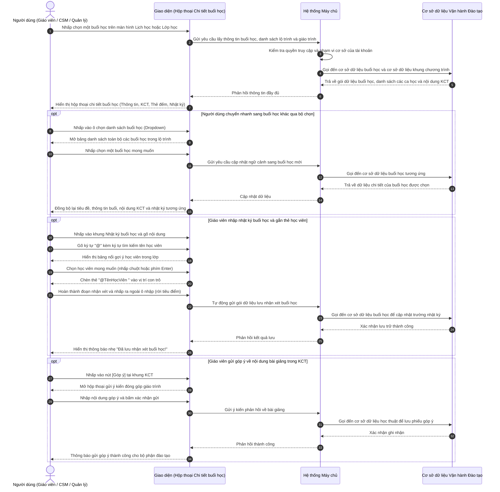

# US-CLS05-08: Chi tiết buổi học: Danh sách buổi học, Thông tin buổi học, Khung chương trình (KCT) & Ghi chú nhật ký

> **Tham chiếu:** `BF-CLS-05` · `SR-CLS-005` · `ENTERPRISE_STANDARDS.md` · Giao diện Mẫu §4.3 (Hộp thoại chi tiết buổi học & Khung điều phối hoạt động giảng dạy)  
> **Đường dẫn màn hình & Trạng thái liên quan:**  
> - `Lịch học lớp (/app/calendar_class_schedule)` -> Nhấp vào ca học lớp bất kỳ trên bảng lịch -> Mở Hộp thoại Chi tiết buổi học  
> - `Danh sách lớp học (/app/classes)` -> Mở Chi tiết lớp học -> Lịch trình buổi học -> Nhấp chọn một buổi học  

---

## 1. NHẬT KÝ THAY ĐỔI & BỐI CẢNH (CHANGELOG & CONTEXT)

### Lịch sử cập nhật tài liệu (Changelog)

| Ngày cập nhật | Nội dung cập nhật | Lý do cập nhật |
|---|---|---|
| 15/09/2026 | Khởi tạo tài liệu đặc tả chi tiết cho giao diện Chi tiết buổi học mới: Bổ sung bộ chọn danh sách buổi học thả xuống, khung thông tin buổi học chuẩn hóa 2 cột, khung chương trình (KCT) có nút góp ý và khung nhật ký buổi học gắn thẻ học viên | Chuẩn hóa trải nghiệm người dùng, thay thế giao diện cũ đơn điệu; nâng cao năng lực kiểm soát học thuật và tối ưu thao tác chuyển buổi học |

### Bối cảnh & Vấn đề nghiệp vụ (Context & Problem)
* **Bối cảnh:** Trong hoạt động quản lý vận hành trung tâm và lớp học, buổi học là đơn vị thực thi cốt lõi nơi diễn ra việc giảng dạy, điểm danh, truyền tải học liệu và tương tác giữa giáo viên và học viên. Khi theo dõi tiến độ một lớp học, giáo viên, nhân viên chăm sóc học viên và quản lý cơ sở liên tục cần tra cứu thông tin chi tiết từng buổi học.
* **Vấn đề trên giao diện cũ:**
  - *Chuyển buổi học bất tiện:* Chỉ có 2 nút "Buổi trước" và "Buổi sau" đơn thuần, người dùng muốn xem buổi số 15 phải bấm liên tục 15 lần; không có danh sách tổng thể để lựa chọn trực tiếp.
  - *Thông tin buổi học thiếu và bị gộp:* Thiếu trường Trợ giảng; Mã lớp không có tên lớp đi kèm; Quy mô và Cấp độ bị gộp chung vào một dòng gây khó đọc; không có cơ chế cảnh báo khi phòng học bị thay đổi so với phòng học mặc định của lớp.
  - *Khung chương trình (KCT) thiếu cấu trúc:* Hiển thị nội dung bài học thành một khối chữ dài, không phân rõ các nhóm từ vựng, câu mẫu, phát âm; không hiển thị số thứ tự buổi tương ứng trong giáo trình; thiếu công cụ để giáo viên gửi ý kiến phản hồi về chất lượng bài giảng cho bộ phận đào tạo.
  - *Thiếu chức năng Nhật ký buổi học:* Chưa có không gian để giáo viên ghi nhận nhận xét tổng quan về tinh thần học tập của cả lớp, cũng như chưa có cơ chế gắn thẻ nhắc đích danh từng học viên có biểu hiện đặc biệt.
* **Mục tiêu & Giá trị mang lại:** Nâng cấp hoàn thiện hộp thoại Chi tiết buổi học nhằm:
  - Cho phép người dùng chuyển nhanh đến bất kỳ buổi học nào trong khóa thông qua bộ chọn danh sách thả xuống trực quan.
  - Hiển thị đầy đủ thông tin vận hành của buổi học (Lịch học, Giờ học, Cơ sở, Phòng học kèm cảnh báo, Tên lớp, Mã lớp, Giáo viên/Dạy thay, Trợ giảng, Quy mô, Trình độ).
  - Tái cấu trúc khung KCT khoa học, hiển thị rõ ràng nội dung bài giảng, tài liệu tham khảo, bài tập bắt buộc và kịch bản phân bổ thời lượng, bổ sung nút gửi góp ý trực tiếp.
  - Cung cấp khung Nhật ký buổi học linh hoạt hỗ trợ gắn thẻ học viên (`@`) và tự động lưu dữ liệu an toàn.

### Hiểu người dùng & Tình huống sử dụng (User Needs & Use Cases)
* **Người dùng chính (Persona):** Giáo viên trực tiếp giảng dạy (`PERSONA-TEACHER`), Nhân sự học vụ / Chăm sóc học viên (`PERSONA-CSM`), Quản lý chi nhánh (`PERSONA-BRANCH-MANAGER`), Chuyên viên phát triển chương trình đào tạo (`PERSONA-ACADEMIC`).
* **Nhu cầu thực tế (Needs):**
  - Giáo viên: Muốn mở nhanh buổi học hôm nay, xem bài giảng KCT cần dạy, kiểm tra phòng học và trợ giảng, sau giờ dạy nhập ngay nhật ký tổng kết và gắn thẻ những học sinh cần chú ý.
  - Nhân sự CSM: Muốn xem nhật ký của giáo viên để nắm tình hình lớp, tra cứu học liệu và bài tập về nhà để gửi phụ huynh, đồng thời kiểm tra tiến độ đánh giá học kỳ (`Semester Eval`).
  - Quản lý cơ sở: Kiểm tra ca học có bị đổi phòng bất thường không, giáo viên nào dạy thay, và kiểm soát sĩ số chuyên cần tức thời.
* **Câu phát biểu nghiệp vụ:** **Là một** Giáo viên hoặc Nhân sự vận hành đào tạo, **tôi muốn** xem đầy đủ thông tin buổi học, tra cứu giáo trình chuẩn hóa, chọn buổi học tức thì và ghi nhật ký lớp học có gắn thẻ học viên, **để** tổ chức giảng dạy hiệu quả, theo dõi sát sao sự tiến bộ của từng học sinh và phối hợp nhịp nhàng giữa các bộ phận.

### Phạm vi kiểm soát (Scope)

| Mã Yêu Cầu | Tên Yêu Cầu Chức Năng | Phân Loại Ưu Tiên | Mức Độ Rủi Ro | Ghi Chú |
|---|---|---|---|---|
| **REQ-S01** | Thanh điều hướng & Tiêu đề buổi học | Bắt buộc (Must) | Tiêu chuẩn (Standard) | Breadcrumb tên lớp, tiêu đề ca học, huy hiệu loại buổi, huy hiệu trạng thái |
| **REQ-S02** | Bộ chọn danh sách các buổi học thả xuống | Bắt buộc (Must) | Tiêu chuẩn (Standard) | Dropdown danh sách toàn bộ các buổi học kèm ngày giờ, chủ đề và trạng thái |
| **REQ-S03** | Khung Ghi chú / Nhật ký buổi học | Bắt buộc (Must) | Tiêu chuẩn (Standard) | Nhập nhận xét, tự động co giãn, tự động lưu khi rời ô nhập |
| **REQ-S04** | Tính năng Gắn thẻ học viên (`@`) trong nhật ký | Bắt buộc (Must) | Tiêu chuẩn (Standard) | Bảng nổi gợi ý học viên theo tên/mã, chọn chèn vào văn bản |
| **REQ-S05** | Khung Thông tin buổi học 2 cột chuẩn hóa | Bắt buộc (Must) | Tiêu chuẩn (Standard) | Hiển thị 5 cặp thông tin vận hành cốt lõi |
| **REQ-S06** | Cơ chế cảnh báo phòng học & Chỉ dẫn dạy thay | Nên có (Should) | Tiêu chuẩn (Standard) | Biểu tượng cảnh báo phòng học, nhãn phòng gốc, gạch ngang tên giáo viên chính |
| **REQ-S07** | Khung Chương trình đào tạo (KCT) có cấu trúc | Bắt buộc (Must) | Tiêu chuẩn (Standard) | Hiển thị từ vựng, câu mẫu, phát âm, bài tập, học liệu kèm số buổi |
| **REQ-S08** | Nút tính năng Góp ý giáo trình KCT | Nên có (Should) | Tiêu chuẩn (Standard) | Mở hộp thoại gửi ý kiến phản hồi về bài học cho bộ phận đào tạo |
| **REQ-S09** | Nút liên kết Đánh giá học kỳ (`Semester Eval`) | Có thể có (Could) | Tiêu chuẩn (Standard) | Huy hiệu tiến độ đánh giá định kỳ của lớp học |

### Quy tắc nghiệp vụ cốt lõi (Business Rules)
* **[RULE-CLS-01] Bảo toàn dữ liệu và phân định quyền hạn:** Hộp thoại Chi tiết buổi học chỉ đọc và cập nhật trạng thái ca học, nhật ký giảng dạy và ghi nhận góp ý giáo trình. Không tự ý thực hiện các nghiệp vụ hệ quả phức tạp tại giao diện người dùng.
* **[RULE-CLS-02] Dữ liệu dùng chung thống nhất:** Phân hệ vận hành lớp học và hệ thống chăm sóc dùng chung một nguồn cơ sở dữ liệu duy nhất, không sử dụng tiến trình đồng bộ trung gian.
* **[RULE-CLS-03] Bảo mật thông tin liên lạc cá nhân:** Trên các bảng chi tiết, số điện thoại của học viên và phụ huynh bắt buộc được che một phần ở giữa (dạng `091****111`) nhằm chống sao chép hàng loạt trái phép.
* **[RULE-CLS-04] Tính toán số liệu chuyên cần theo thời gian thực:** Toàn bộ các thẻ đếm chỉ số trên đầu hộp thoại (Sĩ số, Có mặt, Phép/Vắng, Trễ, Trial) tự động tính toán lại khớp chính xác theo danh sách học viên của buổi học hiện tại.
* **[RULE-CLS-05] Thống nhất mã định danh buổi học và lớp học:** Luôn giữ nguyên mã định danh buổi học và mã lớp học được cấp từ hệ thống cơ sở dữ liệu, không tự ý biến đổi định dạng hiển thị.

### Chỉ số hiệu quả đo lường (KPIs)
* **Chỉ số thời gian phản hồi (Baseline & Target):** Thời gian chuyển đổi giữa 2 buổi học bất kỳ duy trì mức dưới 200ms trên giao diện người dùng.
* **Tỷ lệ lưu nhật ký thành công:** Đạt 100% khi người dùng nhập dữ liệu hợp lệ và kết nối ổn định.
* **Mức độ tương tác của giáo viên:** Đạt trên 70% các buổi học có ghi nhận xét nhật ký và gắn thẻ học viên cần lưu ý.

---

## 2. LUỒNG XỬ LÝ CHÍNH (MAIN FLOW - HAPPY PATH)

---

## 3. GIAO DIỆN, PHÂN QUYỀN & RÀNG BUỘC KIỂM TRA DỮ LIỆU (UI, PERMISSION & VALIDATION RULES)

### 3.1. Cấu trúc các vùng giao diện & Ràng buộc Quyền hạn (Capability Gating)

| Vùng Giao diện / Nút Thao Tác | Vị Trí & Loại Hiển Thị | Mã Quyền Yêu Cầu | Hành Động Khi Đủ Quyền | Xử Lý Khi Không Đủ Quyền |
|---|---|---|---|---|
| **Xem Chi tiết buổi học** | Hộp thoại nổi toàn màn hình | `class.session.view_detail` | Mở hộp thoại, xem thông tin buổi và KCT | Không mở được hộp thoại, hiển thị thông báo lỗi |
| **Bộ chọn danh sách buổi học** | Đỉnh hộp thoại, menu thả xuống | `class.session.view_detail` | Mở danh sách chọn ca học bất kỳ | Vô hiệu hóa tính năng chọn danh sách |
| **Chỉnh sửa Nhật ký buổi học** | Khung nhập văn bản bên dưới tiêu đề | `class.session.edit_note` | Nhập văn bản, gắn thẻ `@`, tự động lưu | Chuyển sang chế độ chỉ đọc (Readonly) |
| **Gắn thẻ học viên trong nhật ký** | Bảng nổi gợi ý danh sách học viên | `class.session.edit_note` | Hiển thị bảng nổi khi gõ `@` và chọn học viên | Không kích hoạt bảng nổi gợi ý |
| **Báo cáo sự cố / Đổi phòng học** | Nút biểu tượng cảnh báo tại ô Phòng học | `class.session.change_room` | Nhấp mở hộp thoại yêu cầu đổi phòng học | Ẩn biểu tượng hoặc chỉ hiển thị cảnh báo tĩnh |
| **Góp ý nội dung giáo trình KCT** | Nút bấm kèm biểu tượng tại khung KCT | `class.session.feedback_syllabus` | Nhấp mở hộp thoại gửi ý kiến cho phòng Đào tạo | Ẩn nút Góp ý khỏi tiêu đề khung KCT |
| **Truy cập Đánh giá học kỳ** | Nút huy hiệu cam `Semester Eval` | `class.evaluation.manage` | Mở hộp thoại đánh giá học kỳ của lớp | Ẩn nút huy hiệu khỏi thanh điều hướng |

### 3.2. Cấu trúc các khối thành phần giao diện

#### Khối 1: Thanh điều hướng đỉnh & Tiêu đề buổi học
1. **Thanh điều hướng đỉnh (Top Navigation Bar):**
   - *Nút quay lại & Phân cấp (Breadcrumb):* Biểu tượng mũi tên trái `<` kèm chuỗi liên kết `[Tên lớp học] / Chi tiết buổi học`. Nhấp vào tên lớp mở thông tin lớp học.
   - *Huy hiệu Đánh giá học kỳ:* Nút hình viên thuốc màu cam nổi bật `Semester Eval (N/M)` (ví dụ: `Semester Eval (6/17)`), nhấp vào mở giao diện đánh giá kỳ.
   - *Cụm điều hướng & Lựa chọn buổi học:*
     - Nút `< Buổi trước`: Chuyển về buổi học trước đó. Mờ đi nếu là buổi 1.
     - Ô chọn danh sách buổi học thả xuống: Hiển thị ngày và giờ học hiện tại (ví dụ: `16/09/2026 (15:30–17:30)` kèm biểu tượng mũi tên xuống). Khi nhấp vào, mở danh sách xổ xuống gồm tất cả các buổi học của lớp. Quy cách hiển thị từng mục trong danh sách tinh gọn, không hiển thị tiền tố số buổi (đã bỏ tiền tố `Buổi X:`), chỉ bao gồm:
       - Dòng trên: Tên buổi học (Chủ đề bài giảng); Huy hiệu `Đang xem` (đối với ca học đang mở trong hộp thoại) và Huy hiệu trạng thái ca học (gồm 4 nhãn chuẩn: `Hôm nay`, `Đã học`, `Hủy`, `Chờ diễn ra`).
       - Dòng dưới: Ngày, giờ học theo định dạng cố định `dd/mm/yyyy (hh:mm–hh:mm)`.
     - Nút `Buổi sau >`: Chuyển đến buổi kế tiếp. Mờ đi nếu là buổi cuối cùng của lớp.
     - Nút đóng `X`: Đóng hộp thoại.
2. **Tiêu đề buổi học & Huy hiệu nhận diện:**
   - *Dòng tiêu đề chính:* Phông chữ đậm, nổi bật (ví dụ: `Kiểm tra định kỳ: Unit 1 Review & Quiz` hoặc `Level: 301_Lesson 2: Trò chơi Quy luật vui vẻ + Sách hoạt động`).
   - *Huy hiệu trạng thái buổi học:* Nhãn màu hiển thị trạng thái vận hành gồm 4 nhãn chuẩn: `Hôm nay` (xanh da trời), `Đã học` (xanh lá cây), `Hủy` (xám nhạt), `Chờ diễn ra` (vàng hổ phách).
   - *Huy hiệu phân loại buổi học:* Nhãn phân loại loại ca học (`Buổi kiểm tra`, `Buổi dự án`, `Buổi thường`, `Buổi bù`).
3. **Thẻ đếm chỉ số nhanh (Status Tiles):** Gồm 5 thẻ đếm nằm ngang nhỏ gọn:
   - Sĩ số: Tổng số học viên chính thức trong lớp.
   - Có mặt: Số học viên có mặt / Tổng sĩ số (màu xanh lá).
   - Phép / Vắng: Số học viên nghỉ có phép · Số học viên nghỉ không phép (màu đỏ).
   - Trễ: Số học viên vào lớp muộn (màu vàng hổ phách).
   - Trial: Số lượng học viên học thử trong buổi này (màu tím).

#### Khối 2: Ghi chú / Nhật ký buổi học (Session Diary)
1. **Giao diện khung nhập:**
   - Biểu tượng cây bút chỉnh sửa màu vàng hổ phách đặt ở đầu dòng.
   - Khung văn bản không viền thô cứng, nền trong suốt hài hòa với giao diện, gợi ý văn bản mờ: `Nhật ký buổi học: Giáo viên nhập nhận xét chung về buổi học tại đây... (Gõ @ để tag học viên)`.
   - Tự động giãn chiều cao theo độ dài văn bản nhập vào, cho phép kéo chỉnh kích thước ở góc dưới.
2. **Cơ chế gợi ý gắn thẻ học viên (`@`):**
   - Khi gõ ký tự `@`, mở bảng nổi ngay bên dưới dòng con trỏ.
   - Bảng nổi hiển thị tiêu đề "Tag học viên", ô lọc và danh sách các học viên trong lớp kèm ảnh đại diện, họ tên và mã số học viên.
   - Hỗ trợ di chuyển chọn bằng phím mũi tên Lên/Xuống, phím Enter hoặc nhấp chuột để chèn chuỗi `@TênHọcViên ` vào văn bản.
3. **Cơ chế tự động lưu dữ liệu:**
   - Khi người dùng dừng gõ và nhấp chuột ra ngoài vùng nhập (rời tiêu điểm), hệ thống tự động lưu nội dung vào cơ sở dữ liệu và hiển thị thông báo phản hồi nhẹ "Đã lưu nhận xét buổi học!".

#### Khối 3: Khung Thông tin buổi học (Cột bên phải)
Bố cục dạng thẻ chữ nhật bo góc nhẹ, nền trắng sáng, tiêu đề in hoa `THÔNG TIN BUỔI HỌC`, tổ chức theo lưới 2 cột cân đối:
1. **Cặp 1: Lịch học & Giờ học:**
   - Cột trái (Lịch học): Biểu tượng lịch, ngày học theo định dạng cố định `dd/mm/yyyy`, kèm thứ trong tuần bên dưới (ví dụ: `16/09/2026` / `Thứ 4`).
   - Cột phải (Giờ học): Khung giờ bắt đầu – kết thúc dạng `hh:mm–hh:mm` (ví dụ: `15:30–17:30`).
2. **Cặp 2: Cơ sở & Phòng học:**
   - Cột trái (Cơ sở): Biểu tượng tòa nhà, tên cơ sở vận hành (ví dụ: `RinoEdu Linh Đàm`).
   - Cột phải (Phòng học): Tên phòng học được chỉ định (ví dụ: `Phòng 1`). Nếu phòng hiện tại khác phòng học gốc của lớp, hiển thị nhãn phụ `(gốc: Phòng X)`. Kèm biểu tượng tam giác cảnh báo màu đỏ/cam để báo cáo sự cố hoặc xin đổi phòng.
3. **Cặp 3: Tên lớp & Mã lớp:**
   - Cột trái (Tên lớp): Biểu tượng cuốn sách, tên đầy đủ của lớp học (ví dụ: `Tiếng Anh Trial Level 2`), có hiển thị giải thích khi tên lớp bị dài.
   - Cột phải (Mã lớp): Mã định danh lớp học (ví dụ: `SA1_TA_T03`), dạng chữ màu xanh liên kết. Khi di chuột hiển thị bảng tóm tắt lớp học; khi nhấp chuột mở hộp thoại chi tiết lớp học.
4. **Cặp 4: Giáo viên & Trợ giảng:**
   - Cột trái (Giáo viên): Biểu tượng người dùng, tên giáo viên giảng dạy chính. Nếu có giáo viên dạy thay, hiển thị tên giáo viên chính bị gạch ngang và mũi tên trỏ sang tên giáo viên dạy thay màu hổ phách.
   - Cột phải (Trợ giảng): Tên trợ giảng phụ trách hỗ trợ buổi học (ví dụ: `Thu Hà` hoặc dấu gạch ngang `—` nếu chưa phân công).
5. **Cặp 5: Quy mô & Trình độ:**
   - Cột trái (Quy mô): Biểu tượng nhóm người, tỷ lệ phân bổ giáo viên:học sinh chuẩn (ví dụ: `1:7` hoặc `1:10`).
   - Cột phải (Trình độ): Cấp độ đào tạo của lớp (ví dụ: `Level 2`, `Colombus 4`, `TOEIC 500+`).

#### Khối 4: Khung Chương trình đào tạo (KCT - Cột bên phải)
Bố cục thẻ thông tin chuyên sâu về mặt học thuật đặt ngay bên dưới khung thông tin buổi học:
1. **Dòng tiêu đề KCT & Nút góp ý:**
   - Tiêu đề: Tên khung chương trình in hoa (ví dụ: `KCT: IELTS JUNIOR V2.1` hoặc `KCT: Station_Toán tư duy (Col 4 tuổi)`).
   - Nút hành động `[Góp ý]`: Biểu tượng tin nhắn cảnh báo kèm chữ "Góp ý". *(Lưu ý nghiệp vụ: Tính năng góp ý giáo trình đang trong giai đoạn phát triển, khi nhấp vào hiển thị thông báo phản hồi nhẹ thông tin cho người dùng)*.
2. **Phần Nội dung buổi học:**
   - Tiêu đề phụ: Biểu tượng cuốn sách mở kèm chữ "Nội dung buổi học" bên trái, số thứ tự buổi tương ứng trong giáo trình hiển thị bên phải (ví dụ: `Buổi 3`).
   - Cấu trúc nội dung chuẩn hóa:
     - `- Words:` Danh sách từ vựng trọng tâm cần dạy.
     - `- Sentences:` Các mẫu câu giao tiếp chính của bài học.
     - `- Phonics:` Quy tắc phát âm hoặc điểm ngữ pháp cốt lõi.
     - (Đối với môn Toán/Tư duy: `- Tư duy Toán học: ...`, `- Tư duy Logic: ...`).
3. **Phần Tài liệu & Nhiệm vụ học tập:**
   - Tiêu đề bài giảng: Tên bài học trong giáo trình (ví dụ: `Kiểm tra định kỳ: Unit 1 Review & Quiz` hoặc `Lesson 2: Family members`).
   - Danh sách các mục học liệu kèm biểu tượng màu nhận diện và liên kết đính kèm:
     - Slide bài giảng: Biểu tượng tệp màu đỏ, ghi chú `File tài liệu tham khảo cho học sinh • Tài liệu tham khảo`. Kèm liên kết xem tài liệu nếu có đường dẫn mở ngoài.
     - Bài tập về nhà / Nhiệm vụ thực hành: Biểu tượng dấu kiểm màu xanh lục, ghi chú `Bài luyện tập tự học ở nhà • Nhiệm vụ phải làm`. Kèm liên kết `Link bài tập` mở tab trình duyệt mới nếu có đường dẫn.
     - Bài kiểm tra nhanh (Quiz): Biểu tượng dấu hỏi màu cam, ghi chú `Bài kiểm tra nhanh đánh giá năng lực • Nhiệm vụ phải làm`.
     - File nghe (Audio): Biểu tượng tai nghe màu xanh dương, ghi chú `File nghe audio luyện kỹ năng nghe • Tài liệu nghe bổ trợ`. Kèm liên kết nghe trực tiếp nếu có.
     - Dự án / Mini Project: Biểu tượng liên kết màu đỏ kèm nút bấm `Project: Link` để mở trang lập trình hoặc bài tập dự án trực tuyến (mở tab mới).
4. **Phần Thành phần buổi học (Phân bổ thời lượng kịch bản):**
   - Liệt kê các phân đoạn hoạt động trong lớp kèm thời lượng định mức (ví dụ: `Thành phần buổi học 2 - 10 phút`, kịch bản hoạt cảnh).

#### Khối 5: Cụm thẻ chuyển đổi nội dung (Tabs điều hướng khung bên trái)
Bố cục thanh điều hướng dạng thẻ dẹt bo góc nhẹ, đặt ngay dưới khối tiêu đề buổi học ở khung bên trái, gồm 3 phân mục:
1. **Tab Tổng quan (Biểu tượng bảng điều khiển):**
   - *(Lưu ý nghiệp vụ: Chưa phát triển)* Phục vụ lộ trình hiển thị các biểu đồ tổng hợp tiến độ ca học và chỉ số lớp học trong tương lai.
2. **Tab Học viên (Biểu tượng nhóm người kèm thẻ số đếm, ví dụ `Học viên 17`):**
   - *(Phân hệ đang hoạt động cốt lõi)*: Hiển thị bảng danh sách toàn bộ học viên chính thức và học thử trong buổi; cung cấp các thao tác điểm danh chuyên cần, chấm điểm sao, nhận xét cá nhân từng học viên, lọc danh sách học viên cần chăm sóc, đánh giá học kỳ và quản lý điểm số kiểm tra.
3. **Tab Tài liệu & Media (Biểu tượng thư mục mở):**
   - *(Lưu ý nghiệp vụ: Chưa phát triển)* Phục vụ lộ trình lưu trữ kho ảnh chụp hoạt cảnh, video học tập của học viên trong buổi học để chia sẻ cho phụ huynh.

---

### 3.3. Bảng quy chuẩn và ràng buộc kiểm tra dữ liệu (Validation Rules)

| Trường thông tin | Kiểu dữ liệu | Bắt buộc | Nguồn dữ liệu | Quy tắc kiểm tra (Validation) | Quy cách hiển thị |
|---|---|---|---|---|---|
| **Mã định danh buổi học (sessionId)** | Chuỗi ký tự | Bắt buộc | Cơ sở dữ liệu | Định danh duy nhất của ca học vật lý trong toàn hệ thống | Ẩn trên giao diện |
| **Tiêu đề buổi học (topic)** | Chuỗi ký tự | Bắt buộc | Cơ sở dữ liệu | Tối đa 255 ký tự, lấy từ kế hoạch bài dạy của lớp | Phông đậm, hiển thị trên đỉnh vùng nội dung |
| **Trạng thái buổi học (status)** | Giá trị danh mục | Bắt buộc | Cơ sở dữ liệu | Một trong các trạng thái: `upcoming`, `ongoing`, `completed`, `cancelled` | Nhãn trạng thái màu sắc tương ứng |
| **Loại buổi học (type)** | Giá trị danh mục | Bắt buộc | Cơ sở dữ liệu | Một trong các loại: `standard`, `test`, `project`, `makeup` | Nhãn phân loại dạng thẻ viền |
| **Nhật ký buổi học (note/comment)** | Chuỗi văn bản | Không | Giáo viên nhập | Tối đa 2.000 ký tự; hỗ trợ ký tự gắn thẻ `@` học viên | Khung nhập tự co giãn, tự động lưu khi rời ô nhập |
| **Phòng học (room)** | Chuỗi ký tự | Bắt buộc | Cơ sở dữ liệu | Tên phòng học thực tế được xếp cho ca học | Kèm nhãn phòng gốc nếu khác phòng mặc định |
| **Giáo viên dạy thay (substituteTeacher)** | Chuỗi ký tự | Không | Cơ sở dữ liệu | Tên nhân sự giảng dạy thay thế cho ca học cụ thể | Hiển thị gạch ngang tên GV chính và trỏ tên GV thay |
| **Trợ giảng (assistantTeacher)** | Chuỗi ký tự | Không | Cơ sở dữ liệu | Tên nhân sự trợ giảng được điều phối cho buổi học | Hiển thị tên hoặc dấu gạch ngang nếu chưa có |

---

## 4. KHỐI CHỨC NĂNG & TIÊU CHÍ NGHIỆM THU (ACTIONS & ACCEPTANCE CRITERIA)

### Khối chức năng 1: Chọn và Chuyển Buổi Học

#### Action 1.1: Mở danh sách và chọn buổi học trực tiếp
* **Luồng kích hoạt:** Người dùng nhấp chuột vào ô chọn danh sách buổi học trên thanh điều hướng đỉnh, hệ thống xổ danh sách tất cả các buổi của lớp. Người dùng nhấp chọn một buổi bất kỳ.
* **Tiêu chí nghiệm thu:**
  - **AC-01 (Happy Path - Nhảy ca học thành công qua danh sách chọn):**
    - **Giả sử:** Lớp học có tổng cộng 20 buổi học, người dùng đang ở giao diện Chi tiết của một ca học, mở danh sách chọn buổi học.
    - **Khi:** Người dùng kiểm tra danh sách xổ xuống thấy ca học hiện tại có nhãn "Đang xem", các ca học khác hiển thị chuẩn tên buổi học (không có tiền tố "Buổi X:"), ngày giờ và nhãn trạng thái chuẩn ("Hôm nay", "Đã học", "Hủy", "Chờ diễn ra"); người dùng nhấp chọn ca "Ôn tập giữa kỳ" (24/10/2026).
    - **Thì:** Hộp thoại lập tức đồng bộ hiển thị toàn bộ dữ liệu của ca "Ôn tập giữa kỳ" (tiêu đề, thẻ đếm, thông tin vận hành, nội dung KCT, nhật ký); nhãn trên nút chọn cập nhật thành ngày giờ của ca vừa chọn.
  - **AC-02 (Happy Path - Sử dụng nút Buổi trước / Buổi sau):**
    - **Giả sử:** Người dùng đang xem Buổi 5 của lớp.
    - **Khi:** Người dùng nhấp nút "Buổi sau >".
    - **Thì:** Giao diện chuyển sang hiển thị toàn bộ dữ liệu của Buổi 6; nút "Buổi trước" và "Buổi sau" đều ở trạng thái hoạt động bình thường.
  - **AC-03 (Edge Case - Giới hạn đầu và cuối lộ trình):**
    - **Giả sử:** Người dùng đang xem Buổi 1 (buổi đầu tiên của lớp).
    - **Khi:** Quan sát thanh điều hướng.
    - **Thì:** Nút "< Buổi trước" bị mờ đi và vô hiệu hóa không cho bấm; khi chuyển đến buổi cuối cùng thì nút "Buổi sau >" cũng bị vô hiệu hóa tương tự.

---

### Khối chức năng 2: Ghi Nhật Ký Buổi Học & Gắn Thẻ Học Viên

#### Action 2.1: Nhập nhận xét và tự động lưu dữ liệu
* **Luồng kích hoạt:** Giáo viên nhấp vào khung nhập Nhật ký buổi học, gõ nội dung nhận xét chung và nhấp chuột ra ngoài ô nhập.
* **Tiêu chí nghiệm thu:**
  - **AC-04 (Happy Path - Tự động lưu nhận xét khi rời ô nhập):**
    - **Giả sử:** Giáo viên đang mở chi tiết buổi học vừa kết thúc, khung nhật ký đang rỗng.
    - **Khi:** Giáo viên gõ "Cả lớp nắm tốt kiến thức từ vựng hôm nay, làm bài tập nhóm tích cực" và nhấp chuột ra ngoài vùng nhập.
    - **Thì:** Hệ thống tự động gửi yêu cầu lưu nội dung nhận xét vào cơ sở dữ liệu buổi học và hiển thị thông báo phản hồi nhẹ "Đã lưu nhận xét buổi học!". Khi tải lại giao diện, đoạn nhận xét vẫn được lưu giữ nguyên vẹn.
  - **AC-05 (Happy Path - Gắn thẻ học viên bằng ký tự `@`):**
    - **Giả sử:** Giáo viên đang nhập nhận xét trong khung nhật ký.
    - **Khi:** Giáo viên gõ ký tự "@" và nhập tiếp chữ "Ph".
    - **Thì:** Bảng nổi bật lên hiển thị danh sách các học viên có tên hoặc mã chứa "Ph" (ví dụ: "Nguyễn Hà Phương", "Phạm Dũng"). Khi giáo viên bấm phím Enter, chuỗi "@Nguyễn Hà Phương " được chèn vào văn bản và bảng nổi đóng lại.
  - **AC-06 (Exception Path - Chặn chỉnh sửa khi không đủ thẩm quyền):**
    - **Giả sử:** Tài khoản nhân viên lễ tân hoặc người dùng không có quyền `class.session.edit_note` mở chi tiết buổi học.
    - **Khi:** Xem khung nhật ký buổi học.
    - **Thì:** Khung nhập hiển thị ở chế độ chỉ đọc, không thể gõ văn bản và không kích hoạt bảng nổi gắn thẻ `@`.
  - **AC-06b (Alternate Path - Hủy bảng nổi gợi ý bằng phím Thoát hoặc xóa ký tự `@`):**
    - **Giả sử:** Bảng nổi gợi ý học viên đang hiển thị sau khi người dùng gõ ký tự "@".
    - **Khi:** Người dùng bấm phím Escape (Thoát) hoặc bấm phím xóa lùi (Backspace) xóa ký tự "@".
    - **Thì:** Bảng nổi gợi ý lập tức biến mất mà không làm thay đổi các đoạn văn bản đã gõ trước đó.
  - **AC-06c (Happy Path - Co giãn tự động và kéo chỉnh kích thước khung nhật ký):**
    - **Giả sử:** Giáo viên nhập một đoạn nhận xét dài nhiều dòng hoặc nhiều đoạn văn bản.
    - **Khi:** Giáo viên gõ liên tục hoặc nhấp giữ chuột tại biểu tượng kéo co giãn ở góc dưới bên phải và kéo xuống.
    - **Thì:** Khung nhập tự động giãn chiều cao theo nội dung hoặc mở rộng theo thao tác kéo của người dùng, giúp giáo viên dễ dàng đọc lại toàn bộ đoạn văn bản trước khi lưu.

---

### Khối chức năng 3: Khung Thông Tin Buổi Học & Cảnh Báo Vận Hành

#### Action 3.1: Hiển thị thông tin vận hành và cảnh báo phòng học
* **Luồng kích hoạt:** Hệ thống nạp thông tin buổi học lên khung 2 cột bên phải.
* **Tiêu chí nghiệm thu:**
  - **AC-07 (Happy Path - Hiển thị chuẩn hóa 5 cặp thông tin):**
    - **Giả sử:** Buổi học diễn ra vào ngày 16/09/2026 từ 15:30 đến 17:30 tại cơ sở Linh Đàm.
    - **Khi:** Người dùng nhìn vào khung Thông tin buổi học.
    - **Thì:** Giao diện hiển thị rõ ràng 5 cặp thông tin: (1) Lịch học 16/09/2026 Thứ 4 - Giờ học 15:30–17:30, (2) Cơ sở RinoEdu Linh Đàm - Phòng học Phòng 1, (3) Tên lớp Tiếng Anh Trial Level 2 - Mã lớp SA1_TA_T03, (4) Giáo viên Thu Hà - Trợ giảng —, (5) Quy mô 1:7 - Trình độ Level 2.
  - **AC-08 (Happy Path - Cảnh báo phòng học khác phòng mặc định):**
    - **Giả sử:** Lớp học được thiết lập học tại Phòng 3, nhưng buổi học hôm nay được điều phối chuyển sang Phòng 1 do bảo trì thiết bị.
    - **Khi:** Người dùng xem dòng Phòng học trên khung thông tin.
    - **Thì:** Giao diện hiển thị "Phòng 1 (gốc: Phòng 3)" kèm biểu tượng tam giác cảnh báo màu đỏ/cam. Nhấp vào biểu tượng cho phép mở giao diện báo cáo sự cố hoặc đề xuất đổi phòng.
  - **AC-09 (Happy Path - Hiển thị giáo viên dạy thay):**
    - **Giả sử:** Giáo viên chính thức của lớp là cô Mai Phương nhưng hôm nay thầy Hồng Thiệp dạy thay ca này.
    - **Khi:** Xem ô Giáo viên trên khung thông tin buổi học.
    - **Thì:** Tên "Mai Phương" hiển thị nét gạch ngang giữa chữ kèm mũi tên trỏ sang "Hồng Thiệp" màu chữ hổ phách nổi bật.

---

### Khối chức năng 4: Khung Chương Trình (KCT) & Học Liệu Đính Kèm

#### Action 4.1: Tra cứu KCT, mở liên kết học liệu và tương tác nút góp ý
* **Luồng kích hoạt:** Người dùng xem nội dung học thuật trên khung KCT, nhấp vào liên kết tài liệu đính kèm hoặc nhấp nút [Góp ý].
* **Tiêu chí nghiệm thu:**
  - **AC-10 (Happy Path - Cấu trúc KCT mạch lạc & Mở liên kết học liệu):**
    - **Giả sử:** Buổi học áp dụng khung chương trình "IELTS JUNIOR V2.1", tương ứng Buổi 3 trong giáo trình có bài tập trực tuyến và dự án lập trình.
    - **Khi:** Người dùng kiểm tra khung KCT và nhấp vào liên kết "Link bài tập" (hoặc "Project: Link").
    - **Thì:** Tiêu đề hiển thị "KCT: IELTS JUNIOR V2.1", tiêu đề phụ hiển thị "Nội dung buổi học" song song với "Buổi 3"; nội dung hiển thị phân định rõ các dòng "- Words:", "- Sentences:", "- Phonics:"; danh sách học liệu liệt kê Slide bài giảng và Bài tập về nhà kèm nhãn phân loại rõ ràng; liên kết được mở trong một tab trình duyệt mới mà không làm đóng hộp thoại quản lý lớp học.
  - **AC-11 (Alternate Path - Nhấp nút Góp ý khi tính năng đang hoàn thiện):**
    - **Giả sử:** Giáo viên phát hiện một lỗi chính tả trong slide bài giảng và muốn gửi ý kiến đóng góp cho phòng Đào tạo.
    - **Khi:** Giáo viên nhấp vào nút [Góp ý] tại tiêu đề khung KCT.
    - **Thì:** Hệ thống hiển thị thông báo phản hồi nhẹ: "Tính năng góp ý giáo trình đang được phát triển!".

---

### Khối chức năng 5: Chuyển Đổi Các Thẻ Điều Hướng Nội Dung (Tabs)

#### Action 5.1: Chuyển đổi qua lại giữa các thẻ Tổng quan, Học viên và Tài liệu & Media
* **Luồng kích hoạt:** Người dùng nhấp chuột vào các nút chuyển tab trên thanh điều hướng bên trái.
* **Tiêu chí nghiệm thu:**
  - **AC-12 (Happy Path - Mặc định mở Tab Học viên và hiển thị số lượng):**
    - **Giả sử:** Hộp thoại Chi tiết buổi học vừa được mở lên.
    - **Khi:** Quan sát cụm thẻ điều hướng bên dưới tiêu đề buổi học.
    - **Thì:** Tab "Học viên" được chọn mặc định với nền nổi bật và biểu tượng nhóm người màu xanh thương hiệu; bên cạnh hiển thị đúng số lượng học viên của lớp (ví dụ: "Học viên 17"); bảng danh sách điểm danh và nhận xét học viên hiển thị đầy đủ ngay bên dưới.
  - **AC-13 (Alternate Path - Chuyển sang Tab Tổng quan hoặc Tab Tài liệu & Media):**
    - **Giả sử:** Người dùng đang ở Tab Học viên.
    - **Khi:** Người dùng nhấp vào tab "Tổng quan" hoặc tab "Tài liệu & Media".
    - **Thì:** Thẻ được nhấp chuyển sang trạng thái được chọn; khu vực nội dung bên dưới hiển thị giao diện của tab tương ứng hoặc thông báo tính năng đang hoàn thiện, không gây lỗi giao diện hoặc mất dữ liệu của buổi học.

---

## 5. CÁC TRƯỜNG HỢP GÓC CẠNH & LUỒNG NGOẠI LỆ (CORNER CASES & EXCEPTION FLOWS)

- **[CASE-01] Mất kết nối mạng khi đang gõ hoặc tự động lưu nhật ký:**
  - *Tình huống:* Giáo viên gõ xong nhận xét buổi học và nhấp ra ngoài, đúng lúc mạng internet của trung tâm bị gián đoạn.
  - *Cách xử lý:* Giao diện giữ nguyên nội dung văn bản trong khung nhập, không xóa dữ liệu, hiển thị biểu tượng cảnh báo kèm thông báo "Không thể lưu nhận xét do mất kết nối mạng. Vui lòng kiểm tra lại đường truyền." Khi mạng phục hồi, giáo viên nhấp ra ngoài lại để hệ thống tự động lưu lại.
- **[CASE-02] Buổi học chưa được gán Khung chương trình (KCT):**
  - *Tình huống:* Lớp học mới tạo vỏ chưa được giáo vụ gắn giáo trình hoặc buổi học phát sinh đột xuất không nằm trong KCT.
  - *Cách xử lý:* Khung KCT hiển thị thông báo trạng thái nhẹ: "Không có chương trình học nào được gán cho buổi này", nút Góp ý tạm thời bị ẩn.
- **[CASE-03] Học viên được gắn thẻ `@` trong nhật ký sau đó chuyển lớp hoặc thôi học:**
  - *Tình huống:* Nhật ký cũ ghi nhận "@Nguyễn Văn A học tập rất tiến bộ", nhưng sau đó học viên A chuyển sang cơ sở khác hoặc bảo lưu.
  - *Cách xử lý:* Đoạn văn bản gắn thẻ trong nhật ký quá khứ vẫn được bảo lưu nguyên vẹn để giữ tính chân thực của biên bản buổi học; hệ thống không xóa hay làm hỏng định dạng văn bản cũ.
- **[CASE-04] Lớp học có danh sách buổi học rất dài (> 100 buổi):**
  - *Tình huống:* Các lớp dài hạn tích lũy số lượng buổi học lớn trong cả năm.
  - *Cách xử lý:* Bộ chọn danh sách buổi học thả xuống được trang bị thanh cuộn dọc tối ưu hóa hiệu năng, tự động cuộn đến vị trí của buổi học hiện tại khi mở danh sách, hỗ trợ người dùng tìm kiếm nhanh theo số buổi hoặc ngày học.
- **[CASE-05] Xung đột chỉnh sửa nhật ký buổi học đồng thời (Concurrent Editing):**
  - *Tình huống:* Cả Giáo viên chính và Trợ giảng cùng mở hộp thoại chi tiết buổi học và sửa nhật ký cùng một thời điểm.
  - *Cách xử lý:* Hệ thống áp dụng cơ chế khóa kiểm soát phiên hoặc ghi nhận phiên lưu sau cùng kèm thông báo "Nội dung nhận xét vừa được cập nhật bởi [Tên nhân sự]. Đang làm mới dữ liệu."
- **[CASE-06] Buổi học đã bị hủy:**
  - *Tình huống:* Buổi học được thông báo hủy do thời tiết xấu hoặc lý do bất khả kháng.
  - *Cách xử lý:* Trên danh sách chọn và tiêu đề ca học, hiển thị nhãn trạng thái "Hủy" màu xám nhạt, khung thông tin buổi học hiển thị lý do hủy (nếu có), các trường nhập nhận xét và điểm danh bị vô hiệu hóa.
- **[CASE-07] Tên chủ đề buổi học quá dài trong danh sách chọn:**
  - *Tình huống:* Tên bài học chứa nhiều thuật ngữ hoặc phân mục dài vượt quá chiều rộng của danh sách xổ xuống (ví dụ: `Lesson 15: Advanced Critical Reading & Comprehensive Academic Writing Practice`).
  - *Cách xử lý:* Giao diện tự động cắt gọn văn bản trên một dòng kèm dấu ba chấm `...`, không làm vỡ bố cục các huy hiệu trạng thái bên cạnh; khi người dùng rê chuột vào dòng sẽ hiển thị bóng gợi ý thông tin chứa đầy đủ tên bài học.
- **[CASE-08] Ca học diễn ra đúng ngày hiện tại:**
  - *Tình huống:* Ngày học của ca trùng khớp với ngày thực tế của hệ thống.
  - *Cách xử lý:* Danh sách chọn và tiêu đề ca học hiển thị huy hiệu trạng thái "Hôm nay" với tông màu da trời nổi bật, giúp giáo viên và giáo vụ định vị ngay ca học cần thực hiện điểm danh và ghi nhận xét trong ngày.
- **[CASE-09] Gõ ký tự `@` nhưng không tìm thấy học viên trong lớp:**
  - *Tình huống:* Giáo viên gõ ký tự "@" và nhập tiếp từ khóa tìm kiếm không trùng khớp với tên hoặc mã số của bất kỳ học viên nào trong lớp.
  - *Cách xử lý:* Bảng nổi hiển thị thông báo "Không tìm thấy học viên", không bị đơ hoặc biến mất đột ngột; khi người dùng gõ dấu cách hoặc phím xóa lùi thì bảng nổi tự động đóng lại.
- **[CASE-10] Nhập nhận xét chứa ký tự đặc biệt hoặc biểu tượng cảm xúc:**
  - *Tình huống:* Giáo viên nhập đoạn nhận xét chứa các biểu tượng cảm xúc khen ngợi hoặc nhiều dấu xuống dòng liên tiếp.
  - *Cách xử lý:* Hệ thống bảo toàn nguyên vẹn định dạng văn bản và ký tự biểu cảm khi lưu vào cơ sở dữ liệu và hiển thị lại chính xác khi mở lại hộp thoại.
- **[CASE-11] Nhấp liên kết học liệu ngoài khi không có mạng hoặc liên kết bị lỗi:**
  - *Tình huống:* Giáo viên nhấp vào "Link bài tập" hoặc "Project: Link" trong khung KCT nhưng đường link bên ngoài bị lỗi 404 hoặc mất mạng internet.
  - *Cách xử lý:* Trình duyệt mở tab mới với thông báo mạng thông thường của trình duyệt; hộp thoại chi tiết buổi học tại hệ thống vẫn hoạt động ổn định và không bị gián đoạn tiến trình làm việc.
- **[CASE-12] Chuyển đổi qua lại giữa các thẻ (Tabs) trong lúc dữ liệu chưa hoàn tất lưu:**
  - *Tình huống:* Người dùng vừa chấm điểm danh hoặc gõ nhận xét xong lập tức bấm chuyển sang Tab Tổng quan hoặc Tab Tài liệu & Media.
  - *Cách xử lý:* Hệ thống ưu tiên kích hoạt cơ chế lưu trữ tự động của trường dữ liệu trước đó vào bộ nhớ đệm và gửi đồng bộ cơ sở dữ liệu ngầm, đảm bảo khi người dùng bấm trở lại Tab Học viên thì toàn bộ số liệu vừa tích chọn vẫn được bảo toàn nguyên vẹn.

---

## 6. KẾT NỐI DỮ LIỆU DỊCH VỤ VÀ YÊU CẦU PHI CHỨC NĂNG (SERVICE DATA CONTRACT & NON-FUNCTIONAL REQUIREMENTS)

### 6.1. Yêu cầu phi chức năng (Non-functional Requirements)
* **Thời gian phản hồi:**
  - Tải và hiển thị toàn bộ dữ liệu hộp thoại Chi tiết buổi học không quá 400ms từ bộ nhớ đệm và không quá 900ms từ cơ sở dữ liệu.
  - Thao tác chuyển đổi buổi học qua danh sách chọn phản hồi ngay lập tức dưới 200ms.
* **Bảo mật và an toàn dữ liệu:**
  - Áp dụng nguyên tắc che giấu số điện thoại cá nhân phụ huynh và học viên (dạng `091****111`) khi xuất hiện trên các bảng chi tiết để tránh sao chép hàng loạt thông tin.
  - Tuân thủ phân quyền động thông qua mã năng lực nguyên tử (`Capability Gating`), không gán cứng vai trò quản trị viên hay nhân viên trong mã nguồn.
* **Tương thích giao diện:**
  - Hộp thoại co giãn linh hoạt theo kích thước màn hình làm việc của giáo viên (từ máy tính bảng 11 inch đến màn hình máy tính bàn độ phân giải cao).

### 6.2. Kết nối dữ liệu dịch vụ hệ thống (Service & Data Contract)
* **Luồng truy vấn chi tiết buổi học:** Gọi đến cơ sở dữ liệu buổi học và cơ sở dữ liệu lớp học theo mã định danh buổi học (`sessionId`), trả về toàn bộ thông tin vận hành, giáo viên, trợ giảng, phòng học và trạng thái ca học.
* **Luồng truy vấn danh sách các buổi học của lớp:** Gọi đến cơ sở dữ liệu lịch trình lớp học theo mã lớp (`classCode`), trả về danh sách tóm tắt toàn bộ các buổi học trong khóa phục vụ bộ chọn thả xuống.
* **Luồng truy vấn nội dung KCT:** Gọi đến cơ sở dữ liệu khung chương trình đào tạo theo mã KCT và số thứ tự buổi học để lấy nội dung từ vựng, câu mẫu, phát âm, danh sách tài liệu và nhiệm vụ học tập.
* **Luồng cập nhật nhật ký buổi học:** Gọi đến cơ sở dữ liệu buổi học để cập nhật trường văn bản nhận xét khi giáo viên rời ô nhập.
* **Luồng gửi ý kiến góp ý giáo trình:** Gọi đến cơ sở dữ liệu học thuật & đào tạo để tạo bản ghi phiếu góp ý kèm mã giáo trình, số buổi học, mã giáo viên gửi và nội dung kiến nghị.
