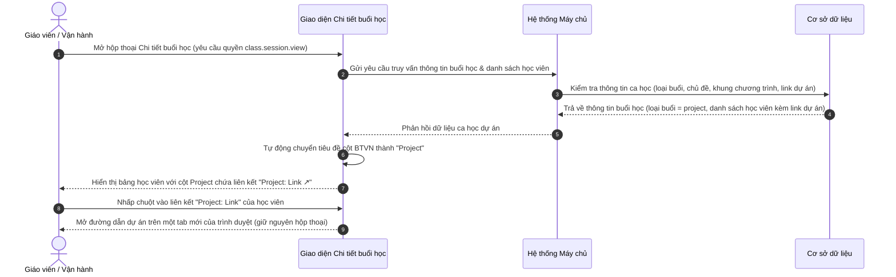

# US-CLS05-09: Chi tiết buổi học: Buổi học dự án (Mini Project) & Quản lý liên kết dự án học viên

> **Tham chiếu:** `BF-CLS-05` · `SR-CLS-005` · `ENTERPRISE_STANDARDS.md` · Giao diện Mẫu §4.3 (Hộp thoại chi tiết buổi học & Khung điều phối hoạt động giảng dạy)  
> **Đường dẫn màn hình & Trạng thái liên quan:**  
> - `Lịch học lớp (/app/calendar_class_schedule)` -> Nhấp vào ca học dự án trên bảng lịch -> Mở Hộp thoại Chi tiết buổi học  
> - `Danh sách lớp học (/app/classes)` -> Mở Chi tiết lớp học -> Lịch trình buổi học -> Nhấp chọn một ca học dự án  
> - **Tài liệu tham chiếu Confluence:** [Thiết kế giao diện buổi học - Buổi Mini Project (L4A5CQ)](https://rinoeduai.atlassian.net/wiki/x/L4A5CQ)

---

## 1. NHẬT KÝ THAY ĐỔI & BỐI CẢNH (CHANGELOG & CONTEXT)

### Lịch sử cập nhật tài liệu (Changelog)

| Ngày cập nhật | Nội dung cập nhật | Lý do cập nhật |
|---|---|---|
| 16/09/2026 | Khởi tạo tài liệu đặc tả nghiệp vụ cho Buổi học dự án (Mini Project): Quy tắc xác định ca học dự án, chuyển đổi cột Bài tập về nhà (BTVN) thành cột Project, quy cách mở tab mới khi nhấp liên kết dự án, tiêu chí nghiệm thu và các trường hợp góc cạnh | Chuẩn hóa trải nghiệm giảng dạy và đánh giá các ca học dự án; phân biệt rõ cấu trúc hiển thị giữa ca học thường, ca kiểm tra và ca dự án |

### Bối cảnh & Vấn đề nghiệp vụ (Context & Problem)
* **Bối cảnh:** Trong chương trình đào tạo của hệ thống (Tiếng Anh, Toán tư duy, STEM Robotics, Lập trình), sau mỗi chặng kiến thức hoặc cuối học phần luôn có các ca học dự án (Project / Mini Project). Tại các buổi học này, học sinh không làm bài tập về nhà thông thường mà trực tiếp hoàn thiện, thuyết trình hoặc nộp sản phẩm đồ án thực hành.
* **Vấn đề trên giao diện trước đây:**
  - *Không phân biệt được ca học dự án và ca thường:* Bảng danh sách học viên luôn cố định cột "BTVN", dẫn đến giáo viên và nhân viên học vụ không có nơi để truy cập vào sản phẩm dự án của từng học sinh.
  - *Trải nghiệm xem bài học sinh bị gián đoạn:* Không có liên kết trực tiếp mở bài dự án; nếu mở liên kết trong cùng một cửa sổ sẽ làm đóng hoặc tải lại hộp thoại chi tiết ca học, làm mất dữ liệu nhật ký hoặc điểm danh đang nhập dở.
  - *Khung chương trình (KCT) hiển thị sai loại học liệu:* Vẫn hiển thị học liệu ca thường thay vì hiển thị "Slide hướng dẫn dự án" và "Nhiệm vụ mở bài mini project".
* **Mục tiêu & Giá trị mang lại:**
  - Tự động nhận diện chính xác ca học là **Buổi học dự án (Project Session)** để điều chỉnh cấu trúc bảng phù hợp.
  - Chuyển đổi cột "BTVN" thành cột **"Project"** hiển thị liên kết `Project: Link` trực quan kèm biểu tượng liên kết ngoài.
  - Khi nhấp vào liên kết, hệ thống mở đường dẫn dự án trong một **tab mới của trình duyệt**, đảm bảo không ảnh hưởng đến phiên làm việc hiện tại của giáo viên.
  - Đồng bộ khu vực học liệu khung chương trình đào tạo sang các học liệu đặc thù của ca dự án.

### Hiểu người dùng & Tình huống sử dụng (User Needs & Use Cases)
* **Người dùng chính (Persona):** Giáo viên trực tiếp giảng dạy (`PERSONA-TEACHER`), Nhân sự học vụ / Chăm sóc học viên (`PERSONA-CSM`), Quản lý chi nhánh (`PERSONA-BRANCH-MANAGER`).
* **Nhu cầu thực tế (Needs):**
  - Giáo viên: Khi vào ca học dự án, cần mở nhanh bài làm của từng học sinh trên màn hình trình chiếu hoặc máy tính cá nhân bằng cách nhấp vào link dự án trên từng dòng học viên.
  - Nhân sự CSM: Muốn xem link sản phẩm dự án của học sinh để trích xuất gửi cho phụ huynh theo dõi thành quả học tập.
  - Quản lý cơ sở: Kiểm soát tiến độ hoàn thành đồ án của lớp và chất lượng giảng dạy buổi dự án.
* **Câu phát biểu nghiệp vụ:** **Là một** Giáo viên hoặc Nhân sự vận hành, **tôi muốn** giao diện ca học dự án hiển thị cột Project với liên kết mở tab mới cho từng học viên, **để** tôi có thể mở xem trực tiếp sản phẩm dự án của học sinh nhanh chóng mà không làm gián đoạn việc ghi nhận nhật ký và điểm danh lớp học.

---

## 2. LUỒNG XỬ LÝ CHÍNH (MAIN FLOW - HAPPY PATH)

---

## 3. CẤU TRÚC GIAO DIỆN & RÀNG BUỘC DỮ LIỆU (UI & DATA RULES)

### 3.1. Quy tắc Xác định Buổi học dự án (Project Session Identification)

Hệ thống tự động nhận diện và kích hoạt chế độ hiển thị ca học dự án khi thỏa mãn ít nhất một trong các điều kiện sau:

1. **Theo thuộc tính loại ca học:** Thuộc tính loại buổi học trong cơ sở dữ liệu có giá trị là `project` (hoặc cấu hình loại bài học là buổi dự án trong khung chương trình đào tạo).
2. **Theo tiêu đề hoặc chủ đề buổi học:** Tên buổi học hoặc chủ đề bài giảng có chứa các từ khóa định danh không phân biệt chữ hoa chữ thường: `Dự án`, `Dự án Mini`, `Project`, `Mini Project` (Ví dụ trong giao diện: `Dự án Mini: My Dream Eco-City Presentation`).
3. **Theo học liệu khung chương trình (KCT):** Ca học có gắn học liệu loại "Nhiệm vụ dự án" hoặc "Bài tập mini project thực hành" kèm đường dẫn dự án liên kết.

### 3.2. Bảng So sánh Cấu trúc Bảng giữa các Loại Ca học

| Đặc điểm | Ca học thường (Regular) | Ca học dự án (Project / Mini Project) | Ca kiểm tra (Evaluation / Test) |
|---|---|---|---|
| **Số lượng cột chính** | 4 cột | 4 cột | 4 hoặc 7 cột (tùy môn học) |
| **Cột thứ 3 của bảng** | BTVN | Project | Điểm kiểm tra định kỳ (Toán) hoặc Kỹ năng Nghe/Đọc/Viết/Nói (Tiếng Anh) |
| **Nội dung hiển thị cột 3** | Mã bài tập về nhà (Ví dụ: BT1 - 6/6) | Liên kết dạng: ↗ Project: Link | Điểm số theo kỹ năng hoặc nhãn điểm |
| **Tương tác khi nhấp chuột** | Mở liên kết bài tập về nhà | Mở đường dẫn dự án trong tab mới của trình duyệt | Mở hộp thoại chấm điểm (với kỹ năng Nói) hoặc xem chi tiết |
| **Tài liệu KCT bên phải** | Slide bài giảng & Bài tập về nhà | Slide hướng dẫn dự án & Project: Link mở bài mini project | Đề thi, bảng phân bổ thời lượng & hướng dẫn chấm điểm |

### 3.3. Cấu trúc Cột Project trên Bảng Danh sách Học viên

* **Tiêu đề cột:** Hiển thị chữ in hoa/thường chuẩn hóa: `Project` (căn giữa hoặc căn trái đồng bộ với bảng dữ liệu).
* **Định dạng liên kết:**
  - Nhãn hiển thị: `Project: Link` (hoặc tên dự án cụ thể nếu được cấu hình).
  - Biểu tượng: Biểu tượng mũi tên trỏ ra góc phải trên (`↗` - biểu tượng liên kết ngoài), đặt ở đầu hoặc cuối nhãn.
  - Màu sắc: Màu xanh dương liên kết nổi bật, có gạch chân khi rê chuột.
  - Thuộc tính điều hướng: Bắt buộc cấu hình thuộc tính mở trong cửa sổ/tab mới kèm cơ chế bảo mật an toàn để tránh can thiệp ngược lại cửa sổ gốc.
* **Quy tắc phân quyền:** Mọi nhân sự có quyền xem chi tiết ca học (`class.session.view`) đều có quyền nhấp mở liên kết dự án của học sinh.

---

## 4. KHỐI CHỨC NĂNG & TIÊU CHÍ NGHIỆM THU (ACCEPTANCE CRITERIA)

### AC-01 (Happy Path - Nhận diện và hiển thị cấu trúc bảng Buổi học dự án)
* **Giả sử:** Ca học được xác định là ca học dự án (tiêu đề: `Dự án Mini: My Dream Eco-City Presentation`, loại buổi `project`).
* **Khi:** Giáo viên hoặc nhân viên học vụ mở hộp thoại Chi tiết buổi học.
* **Thì:**
  1. Cột thứ 3 của bảng danh sách học viên hiển thị tiêu đề là `Project` (thay vì `BTVN`).
  2. Mỗi dòng học viên trong lớp đều hiển thị liên kết `Project: Link` màu xanh kèm biểu tượng liên kết ngoài.
  3. Bảng dữ liệu duy trì đầy đủ 4 cột: `Học viên`, `Điểm danh`, `Project`, `Nhận xét`.

### AC-02 (Happy Path - Nhấp mở liên kết dự án trong tab mới của trình duyệt)
* **Giả sử:** Bảng danh sách học viên của buổi học dự án đang hiển thị đầy đủ thông tin.
* **Khi:** Người dùng nhấp chuột trái vào liên kết `Project: Link` tại dòng của một học viên bất kỳ (Ví dụ: học viên "Nguyễn Hà Phương").
* **Thì:**
  1. Trình duyệt tự động mở đường dẫn dự án của học viên đó sang một tab mới hoàn toàn.
  2. Hộp thoại Chi tiết buổi học trên tab hiện tại vẫn giữ nguyên trạng thái mở, không bị tải lại dữ liệu.
  3. Mọi nội dung đang thao tác dở dang (nội dung nhật ký buổi học, ghi chú nhận xét cá nhân) không bị mất.

### AC-03 (Happy Path - Đồng bộ tài liệu và nhiệm vụ dự án tại khung Khung chương trình KCT)
* **Giả sử:** Người dùng đang xem chi tiết buổi học dự án.
* **Khi:** Người dùng quan sát phần "Tài liệu & nhiệm vụ học tập" tại cột phải khung chương trình đào tạo.
* **Thì:**
  1. Mục bài giảng hiển thị tài liệu: `Slide hướng dẫn dự án` kèm biểu tượng tài liệu đọc.
  2. Mục bài tập hiển thị tài liệu: `Project: Link mở bài mini project` kèm nhãn liên kết `Project: Link ↗`.
  3. Nhấp vào liên kết dự án tại khung KCT cũng mở ra tab mới trên trình duyệt.

### AC-04 (Alternate Path - Tự động chuyển đổi cấu trúc cột khi chuyển qua lại giữa các ca học)
* **Giả sử:** Người dùng đang mở xem Buổi 7 (là buổi học thường với cột `BTVN`).
* **Khi:** Người dùng nhấn nút `Buổi sau >` hoặc chọn Buổi 8 từ danh sách thả xuống (Buổi 8 là ca học dự án).
* **Thì:**
  1. Bảng danh sách học viên lập tức chuyển đổi tiêu đề cột từ `BTVN` thành `Project`.
  2. Các giá trị trong cột chuyển đổi từ mã bài tập về nhà sang liên kết `Project: Link`.
  3. Thời gian chuyển đổi giao diện mượt mà dưới 200 mili-giây, không gây chớp nháy toàn bộ khung nhìn.

### AC-05 (Exception Path - Xử lý hiển thị khi học viên chưa có liên kết bài làm dự án)
* **Giả sử:** Học viên trong lớp chưa được cấp đường dẫn bài làm hoặc chưa liên kết tài khoản đồ án trên hệ thống.
* **Khi:** Giao diện hiển thị danh sách học viên của buổi học dự án.
* **Thì:**
  1. Tại ô cột `Project` của học viên đó, hệ thống hiển thị dấu gạch ngang tĩnh `—` mờ ở dạng chỉ đọc.
  2. Không hiển thị liên kết bấm được, ngăn chặn việc người dùng nhấp vào dẫn đến trang rỗng hoặc trang báo lỗi không tìm thấy.

---

## 5. CÁC TRƯỜNG HỢP GÓC CẠNH (CORNER CASES)

- **[CASE-01] Học viên vắng mặt hoặc nghỉ phép trong buổi dự án:** Học viên có trạng thái điểm danh là "Vắng" hoặc "Nghỉ phép" thì cột Project vẫn hiển thị liên kết `Project: Link` bình thường để giáo viên hoặc trợ giảng có thể mở xem trước sản phẩm đồ án học viên đã chuẩn bị tại nhà.
- **[CASE-02] Học viên học thử (Trial) hoặc học ghép tham gia buổi dự án:** Nếu học viên học thử chưa có tài khoản đồ án cá nhân riêng trên hệ thống học liệu, ô Project hiển thị đường dẫn bài tập mẫu chung hoặc hiển thị dấu gạch ngang `—`; nếu đã được cấp tài khoản trải nghiệm thì hiển thị liên kết bình thường.
- **[CASE-03] Trình duyệt chặn mở cửa sổ mới (Pop-up Blocker):** Thẻ liên kết bắt buộc sử dụng thẻ neo điều hướng tự nhiên của trình duyệt kèm đích đến mở tab mới, không sử dụng hàm mở cửa sổ qua mã lệnh sự kiện để tránh bị cơ chế an ninh của trình duyệt nhận diện nhầm là cửa sổ quảng cáo bị chặn.
- **[CASE-04] Đường dẫn liên kết dự án thiếu giao thức hoặc không an toàn:** Hệ thống tự động kiểm tra và gắn tiền tố bảo mật `https://` trước khi mở đường dẫn, đồng thời áp dụng chính sách bảo vệ để trang mở mới không thể truy cập hoặc thao tác ngược lại phiên làm việc của giao diện quản lý.
- **[CASE-05] Mất kết nối mạng khi người dùng nhấp mở liên kết dự án:** Tab mới của trình duyệt sẽ hiển thị thông báo gián đoạn kết nối mạng từ trình duyệt; toàn bộ giao diện hộp thoại chi tiết buổi học tại tab gốc vẫn được bảo toàn nguyên trạng cùng các dữ liệu đang nhập liệu.
- **[CASE-06] Tiêu đề bài giảng dự án dài kết hợp nhiều nhãn phân loại:** Khi tên dự án dài (Ví dụ: `Dự án Mini: My Dream Eco-City Presentation for Sustainable Development`), tiêu đề tự động xuống dòng linh hoạt, các huy hiệu trạng thái tự động co giãn bám sát chữ cuối cùng mà không đè lấn lên biểu tượng bút ghi chép ở hàng dưới.
