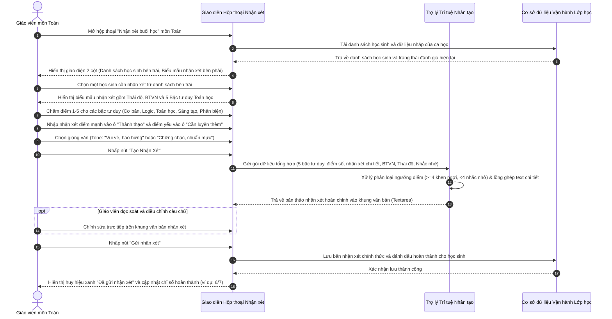

# US-CLS05-10: Update Nhận xét buổi học thường, môn toán: 5 Bậc tư duy chuẩn hóa & Cơ chế tái sử dụng dữ liệu cho Trợ lý Trí tuệ Nhân tạo

> **Tham chiếu nghiệp vụ:** `BF-CLS-05` · `SR-CLS-005` · `ENTERPRISE_STANDARDS.md` · Giao diện Mẫu §4.3 & §4.4 (Hộp thoại đánh giá nhận xét buổi học chi tiết)  
> **Đường dẫn màn hình liên quan:**  
> - `Lịch học lớp (/app/calendar_class_schedule)` -> Mở Chi tiết buổi học môn Toán -> Nhấp nút `[Nhận xét cả lớp]` hoặc nhấp vào ô nhận xét của từng học viên  
> - `Danh sách lớp học (/app/classes)` -> Chi tiết lớp học -> Danh sách buổi học -> Mở hộp thoại nhận xét buổi học  

---

## 1. NHẬT KÝ THAY ĐỔI & BỐI CẢNH (CHANGELOG & CONTEXT)

### Lịch sử cập nhật tài liệu (Changelog)

| Ngày cập nhật | Nội dung cập nhật | Lý do cập nhật |
|---|---|---|
| 16/09/2026 | Khởi tạo tài liệu đặc tả nâng cấp màn hình Nhận xét buổi học thường môn Toán: Chuyển đổi từ mô hình đánh giá đơn lẻ sang 5 Bậc tư duy Toán học chuẩn hóa; tinh gọn nhãn chọn (bỏ chữ "yêu cầu"); xóa dòng "Nội dung trọng tâm" thừa; tạm ẩn thẻ gợi ý; thiết lập cơ chế tái sử dụng dữ liệu đầu vào cho trợ lý trí tuệ nhân tạo (AI Gen Feedback) | Khắc phục hạn chế của bản cũ (nhận xét sơ sài, AI sinh văn bản chung chung); chuẩn hóa khung năng lực tư duy toán học theo chương trình đào tạo của viện giáo dục; nâng cao tính cá nhân hóa của bản nhận xét gửi phụ huynh |

### Bối cảnh & Vấn đề nghiệp vụ (Context & Problem)

* **Bối cảnh:** Trong chương trình Toán tư duy tại hệ thống trung tâm, mỗi buổi học không chỉ rèn luyện kỹ năng tính toán thuần túy mà hướng đến việc bồi dưỡng 5 năng lực tư duy toán học cốt lõi cho học sinh. Sau mỗi buổi học, giáo viên có trách nhiệm đánh giá mức độ tiếp thu, thái độ học tập và ghi nhận xét chi tiết gửi về cho phụ huynh để đồng hành tại nhà.
* **Hạn chế trên bản cũ (Legacy Version):**
  - *Mô hình đánh giá đơn lẻ, sơ sài:* Giao diện bản cũ chỉ có duy nhất một mục đánh giá chung mang tên "Giải quyết vấn đề & trình bày *", không phân định rõ học sinh mạnh hay yếu ở khía cạnh tư duy nào (tính toán số học, tưởng tượng hình học, suy luận logic, phản biện hay sáng tạo).
  - *Nhãn thang điểm dài và chiếm diện tích:* Sử dụng nhãn `3 - Chưa đạt yêu cầu`, `4 - Đạt yêu cầu` làm chật chội dòng hiển thị, khó đọc trên màn hình máy tính bảng.
  - *Ô nhận xét gộp chung:* Chỉ có 2 ô văn bản lớn gồm `✓ THÀNH THẠO VÀ ĐẠT YÊU CẦU VỀ DẠNG BÀI` và `▲ CẦN LUYỆN TẬP THÊM VỀ DẠNG BÀI`. Giáo viên thường chỉ nhập qua loa vài từ chung chung ("tính toán tốt", "cần cẩn thận hơn") mà không chỉ rõ dạng bài toán hay mạch tư duy cụ thể.
  - *Trợ lý trí tuệ nhân tạo (AI) sinh nhận xét rập khuôn:* Do dữ liệu đầu vào nghèo nàn (chỉ có điểm thái độ và 1 trường nhận xét gộp), công cụ sinh nhận xét tự động của hệ thống chỉ có thể tạo ra các câu văn mẫu chung chung, thiếu chiều sâu sư phạm và không phản ánh đúng năng lực cá nhân hóa của từng học sinh.
* **Mục tiêu & Giá trị mang lại của bản nâng cấp hiện tại:**
  - *Chuẩn hóa khung 5 Bậc tư duy Toán học:* Phân rã thành 5 nhóm năng lực cốt lõi:
    1. **Tư duy cơ bản:** Quan sát nhạy bén, mức độ tập trung và khả năng ghi nhớ kiến thức.
    2. **Tư duy logic:** Khả năng phân tích, tổng hợp vấn đề và liên hệ với thực tế đời sống.
    3. **Tư duy Toán học:** Số học và các phép tính, Hình học phẳng/không gian, Đo lường và Thống kê xác suất.
    4. **Tư duy sáng tạo:** Khả năng nghĩ khác, làm khác, tìm tòi hướng giải mới mẻ, linh hoạt.
    5. **Tư duy phản biện và giải quyết vấn đề:** Tự tin thể hiện ý kiến, kỹ năng thuyết trình, bảo vệ quan điểm và giải quyết bài toán hiệu quả.
  - *Tinh gọn giao diện & Tối ưu thao tác giáo viên:*
    - Rút gọn nhãn các ô chọn đánh giá thành 5 mức ngắn gọn: `1 - Yếu`, `2 - Cần cải thiện`, `3 - Chưa đạt`, `4 - Đạt`, `5 - Xuất sắc` (bỏ chữ "yêu cầu").
    - Xóa bỏ dòng "Nội dung trọng tâm" (tránh trùng lặp với phần mô tả định hướng của bài học).
    - Tạm ẩn các nút gợi ý (+ chip) để giao diện thoáng, tinh tế, khuyến khích giáo viên gõ nhận xét thực tế từ sự quan sát trên lớp thay vì bấm thẻ máy móc.
  - *Tái sử dụng dữ liệu bổ sung cho Trợ lý Trí tuệ Nhân tạo (AI Gen Feedback):*
    - Toàn bộ điểm số (1-5) và văn bản nhận xét điểm mạnh (`strength`), điểm cần rèn luyện (`weakness`) của cả 5 bậc tư duy được cung cấp trực tiếp làm dữ liệu ngữ cảnh cho trợ lý trí tuệ nhân tạo.
    - Hệ thống tự động phân loại: Tư duy đạt điểm cao ($\ge 4$) đưa vào mục **🏆 Thành tích nổi bật**, tư duy cần cải thiện ($< 4$) đưa vào mục **🌱 Mục tiêu cần cải thiện**, lồng ghép chính xác các ý nhận xét chi tiết của giáo viên theo 2 phong cách giọng văn: `Vui vẻ, hào hứng` (thân thiện, kèm biểu tượng cảm xúc) hoặc `Chững chạc, chuẩn mực` (chuẩn mực sư phạm).

### Hiểu người dùng & Tình huống sử dụng (User Needs & Use Cases)

* **Người dùng chính (Persona):** Giáo viên trực tiếp giảng dạy môn Toán (`PERSONA-TEACHER`), Nhân viên chăm sóc học viên (`PERSONA-CSM`), Quản lý cơ sở (`PERSONA-BRANCH-MANAGER`), Chuyên viên chuyên môn Toán học (`PERSONA-ACADEMIC`).
* **Nhu cầu thực tế (Needs):**
  - Giáo viên: Muốn đánh giá nhanh nhưng chính xác từng khía cạnh tư duy của học sinh, nhấn một nút để trợ lý trí tuệ nhân tạo tự động lắp ghép thành một bản nhận xét hoàn chỉnh, ấm áp và cá nhân hóa trước khi gửi đi.
  - Phụ huynh học sinh: Muốn biết rõ hôm nay con học toán tiếp thu như thế nào, con mạnh ở điểm nào (tính nhẩm nhanh, tưởng tượng hình học tốt hay sáng tạo cách giải mới) và cần rèn thêm điều gì để kèm cặp ở nhà.
  - Giáo vụ / CSM: Theo dõi được sự tiến bộ hoặc thụt lùi của học sinh theo từng nhóm tư duy qua từng buổi để kịp thời tư vấn phụ huynh lộ trình học tập phù hợp.
* **Câu phát biểu nghiệp vụ:** **Là một** Giáo viên môn Toán hoặc Nhân viên vận hành đào tạo, **tôi muốn** đánh giá học sinh theo 5 bậc tư duy toán học chuẩn hóa với giao diện tinh gọn, nhập liệu điểm mạnh/yếu rõ ràng và tái sử dụng dữ liệu đó để trợ lý trí tuệ nhân tạo sinh nhận xét tự động chuẩn xác, **để** nâng cao chất lượng báo cáo học tập, tăng tính gắn kết với phụ huynh và phản ánh trung thực sự tiến bộ của từng học sinh.

### Phạm vi kiểm soát (Feature Scope)

| Mã Yêu Cầu | Tên Yêu Cầu Chức Năng | Phân Loại Ưu Tiên | Mức Độ Rủi Ro | Ghi Chú |
|---|---|---|---|---|
| **REQ-M01** | Khung đánh giá Thái độ học tập & BTVN | Bắt buộc (Must) | Tiêu chuẩn (Standard) | Đánh giá thái độ 1-5 sao kèm nhãn tinh gọn; trạng thái BTVN trên ứng dụng và trong sách |
| **REQ-M02** | Khung 5 Bậc tư duy Toán học chuẩn hóa | Bắt buộc (Must) | Tiêu chuẩn (Standard) | 5 nhóm tư duy: Cơ bản, Logic, Toán học, Sáng tạo, Phản biện & GQVĐ |
| **REQ-M03** | Thang điểm 5 mức tinh gọn cho từng tư duy | Bắt buộc (Must) | Tiêu chuẩn (Standard) | `1 - Yếu`, `2 - Cần cải thiện`, `3 - Chưa đạt`, `4 - Đạt`, `5 - Xuất sắc` |
| **REQ-M04** | Khung nhận xét chi tiết Thành thạo & Cần luyện thêm | Bắt buộc (Must) | Tiêu chuẩn (Standard) | 2 ô nhập văn bản độc lập cho từng bậc tư duy: `Thành thạo` và `Cần luyện tập thêm` |
| **REQ-M05** | Tối giản giao diện (Ẩn chip gợi ý & Xóa nội dung trọng tâm) | Bắt buộc (Must) | Tiêu chuẩn (Standard) | Xóa dòng tiêu chí thừa; tạm ẩn các nút gợi ý bấm nhanh để giữ giao diện tinh gọn |
| **REQ-M06** | Tái sử dụng dữ liệu tư duy cho Trợ lý Trí tuệ Nhân tạo (AI Gen) | Bắt buộc (Must) | Tiêu chuẩn (Standard) | AI phân tích điểm số và lồng ghép nhận xét chi tiết của cả 5 tư duy vào bản thảo |
| **REQ-M07** | Tùy chọn giọng văn nhận xét AI (Tone) | Nên có (Should) | Tiêu chuẩn (Standard) | 2 lựa chọn: Vui vẻ, hào hứng (thân thiện) hoặc Chững chạc, chuẩn mực (nghiêm túc) |
| **REQ-M08** | Cơ chế lưu nháp độc lập & Gửi nhận xét từng học sinh | Bắt buộc (Must) | Tiêu chuẩn (Standard) | Chuyển qua lại giữa các học sinh không mất nháp; nút gửi cập nhật trạng thái tức thời |

### Quy tắc nghiệp vụ cốt lõi (Business Rules)

* **Trạng thái mặc định của các bậc tư duy:** Ban đầu toàn bộ 5 bậc tư duy đều ở trạng thái **trống (chưa chọn)** mức điểm nào. Giáo viên chỉ chọn mức điểm khi cần đánh giá học sinh ở tư duy tương ứng; nhấp lại vào mức điểm đang chọn sẽ hủy chọn (trở lại trạng thái trống).
* **Đánh giá điểm mạnh và điểm cần cải thiện:** Từng bậc tư duy có 2 ô nhập văn bản độc lập gồm ô `Thành thạo` (ghi nhận thế mạnh) và ô `Cần luyện tập thêm` (ghi nhận điểm cần rèn). Việc nhập nội dung là tùy chọn theo biểu hiện thực tế của học sinh trong buổi học.
* **Kiểm tra dữ liệu bắt buộc khi tạo nhận xét tự động:** Khi giáo viên nhấp nút `[Tạo Nhận Xét]`, hệ thống yêu cầu bắt buộc phải hoàn thành các mục có dấu hoa thị (*), gồm bài tập về nhà và toàn bộ 5 bậc tư duy toán học. Nếu thiếu dữ liệu tại mục nào, hệ thống lập tức hiển thị cảnh báo lỗi trực tiếp tại trường đó và chặn quá trình sinh nhận xét. Khi dữ liệu đã hợp lệ, trợ lý trí tuệ nhân tạo tổng hợp các thông tin đã nhập để tạo bản thảo hoàn chỉnh theo giọng văn đã chọn (`Vui vẻ, hào hứng` hoặc `Chững chạc, chuẩn mực`).
* **Chỉnh sửa và hoàn tất gửi nhận xét:** Giáo viên có thể chỉnh sửa trực tiếp câu chữ trong khung văn bản nhận xét trước khi gửi. Khi nhấp nút `[Gửi nhận xét]`, hệ thống lưu nội dung chính thức và hiển thị biểu tượng hoàn thành bên cạnh tên học sinh.

### Chỉ số hiệu quả đo lường (KPIs)

* **Thời gian hoàn tất nhận xét trung bình:** Giảm từ 3 phút/học sinh xuống dưới 45 giây/học sinh nhờ sự hỗ trợ của trợ lý trí tuệ nhân tạo tái sử dụng dữ liệu 5 bậc tư duy.
* **Tỷ lệ nhận xét có chiều sâu chuyên môn:** Đạt trên 85% bản nhận xét có đề cập chính xác ít nhất 2 nhóm năng lực tư duy toán học cụ thể của học sinh.
* **Mức độ hài lòng của phụ huynh:** Đạt trên 90% phản hồi tích cực về tính cụ thể, rõ ràng và tính cá nhân hóa của bản nhận xét môn Toán.

---

## 2. LUỒNG XỬ LÝ CHÍNH (MAIN FLOW - HAPPY PATH)



---

## 3. CẤU TRÚC GIAO DIỆN & TRƯỜNG THÔNG TIN (UI STRUCTURE & VALIDATION RULES)

### 3.1. Phân bố không gian và các khối hiển thị

Giao diện hộp thoại nhận xét buổi học môn Toán được thiết kế theo cấu trúc chia đôi màn hình (Split View):

```
+-------------------------------------------------------------------------------------------------------+
|  [✨] Nhận xét buổi học       Đã hoàn thành: 5 / 7       Tổng điểm đánh giá: 90 [★]               [X] |
+------------------------------------+------------------------------------------------------------------+
| HỌC SINH (7)                       | Nhận xét cho học viên: Oscar (HV-S15-4)      [✓ Đã hoàn thành]   |
|                                    +------------------------------------------------------------------+
| [HP] Oscar            [✓]          | [★] THÁI ĐỘ HỌC TẬP: 3 - Chưa đạt        ★ ★ ★ ☆ ☆               |
|      Nguyễn Hà Phương              +------------------------------------------------------------------+
|      HV-S15-4                      | [✏️] BÀI TẬP VỀ NHÀ:                                              |
|                                    |   - Trên ứng dụng: ( ) Hoàn thành  ( ) Một phần  ( ) Chưa làm    |
| [DN] Daniel                        |   - Trong sách:    ( ) Hoàn thành  ( ) Một phần  ( ) Chưa làm    |
|      Phạm Đình Nguyên              +------------------------------------------------------------------+
|      HV-S18-5                      | [⭐] ĐÁNH GIÁ 5 BẬC TƯ DUY TOÁN HỌC:                             |
|                                    |   1. 🧠 Tư duy cơ bản *             ( ) 1 ( ) 2 (*) 3 ( ) 4 ( ) 5 |
| [PD] Iris             [✓]          |      Mô tả định hướng năng lực quan sát, tập trung, ghi nhớ...   |
|      Phạm Dũng                     |      [ Khung Amber: Điểm mạnh Thành thạo | Cần luyện tập thêm ]  |
|                                    |   2. 🧩 Tư duy logic *              ( ) 1 ( ) 2 (*) 3 ( ) 4 ( ) 5 |
| [NA] Alex                          |   3. 🔢 Tư duy Toán học *           ( ) 1 ( ) 2 (*) 3 ( ) 4 ( ) 5 |
|      Nguyễn An                     |   4. 💡 Tư duy sáng tạo *           ( ) 1 ( ) 2 (*) 3 ( ) 4 ( ) 5 |
|                                    |   5. 🎯 Tư duy phản biện & GQVĐ *   ( ) 1 ( ) 2 (*) 3 ( ) 4 ( ) 5 |
|                                    +------------------------------------------------------------------+
|                                    | [Giọng văn: (•) Vui vẻ, hào hứng  ( ) Chuẩn mực]  [✨ Tạo Nhận Xét]|
|                                    | [ Khung văn bản xem trước nhận xét do AI sinh / Giáo viên sửa ]  |
|                                    | [ Gửi nhận xét ]                                                 |
+------------------------------------+------------------------------------------------------------------+
```

### 3.2. Bảng mô tả giao diện tĩnh (UI Structure Table)

| Vùng hiển thị | Tên thành phần | Loại thành phần | Mục đích và nội dung hiển thị | Hành vi tương tác |
|---|---|---|---|---|
| **Khung bên trái** | Danh sách học sinh | Cột danh sách có thanh cuộn | Hiển thị danh sách học viên trong lớp kèm mã số và huy hiệu trạng thái đã gửi nhận xét | Nhấp chọn học viên để chuyển đổi biểu mẫu nhận xét tương ứng bên phải |
| **Tiêu đề biểu mẫu** | Thông tin học viên hiện tại | Thẻ văn bản và huy hiệu | Hiển thị tên học viên in đậm màu thương hiệu, mã số học viên và huy hiệu xanh "Đã hoàn thành nhận xét" nếu đã gửi | Tự động cập nhật tức thời khi chuyển học viên |
| **Phần 1: Thái độ** | Đánh giá thái độ học tập | Cụm đánh giá 5 sao kèm nhãn | Hiển thị mức đánh giá thái độ (ví dụ: `3 - Chưa đạt`) và 5 ngôi sao màu hổ phách | Nhấp vào từng ngôi sao (1 đến 5) để thay đổi mức đánh giá |
| **Phần 2: Bài tập** | Tình hình Bài tập về nhà | Cụm nút chọn đơn 2 hàng | Đánh giá tình hình làm bài tập trên ứng dụng và trong sách bài tập (Hoàn thành, Một phần, Chưa làm, Không có) | Nhấp chọn từng trạng thái bài tập |
| **Phần 3: 5 Tư duy** | Đánh giá 5 Bậc tư duy Toán học | Khối danh sách 5 phân mục | Gồm 5 bậc tư duy chuẩn hóa, mỗi bậc có thanh chọn 5 mức điểm, dòng mô tả định hướng và khung nhập điểm mạnh/yếu | Nhấp chọn điểm số 1-5; gõ nhận xét vào ô `Thành thạo` và ô `Cần luyện thêm` |
| **Phần 4: Điều khiển AI** | Chọn giọng văn & Nút Tạo nhận xét | Thanh công cụ đa năng | Chọn giọng văn `Vui vẻ, hào hứng` hoặc `Chững chạc, chuẩn mực`; nút bấm `Tạo Nhận Xét` kèm thông báo số lần tạo lại | Nhấp chọn giọng văn; nhấp nút để trợ lý trí tuệ nhân tạo sinh bản thảo văn bản |
| **Phần 5: Xem trước** | Khung văn bản nhận xét & Nút gửi | Khung nhập văn bản nhiều dòng | Hiển thị toàn bộ bản thảo nhận xét hoàn chỉnh kết hợp từ dữ liệu 5 bậc tư duy và BTVN; nút bấm `Gửi nhận xét` | Cho phép giáo viên chỉnh sửa tùy ý; nhấp gửi để lưu chính thức vào hệ thống |

---

### 3.3. Bảng quy chuẩn và ràng buộc kiểm tra dữ liệu (Validation Rules)

| Trường thông tin | Kiểu dữ liệu | Bắt buộc | Nguồn dữ liệu | Quy tắc kiểm tra (Validation) | Quy cách hiển thị |
|---|---|---|---|---|---|
| **Thái độ học tập (attitude)** | Số nguyên (1-5) | Bắt buộc | Giáo viên chọn | Giá trị nguyên từ 1 đến 5; mặc định là mức 3 (`3 - Chưa đạt`) | Dãy 5 ngôi sao vàng; kèm nhãn chữ tương ứng |
| **BTVN trên ứng dụng (homeworkApp)** | Chuỗi ký tự danh mục | Bắt buộc khi tạo nhận xét AI (*) | Giáo viên chọn | Một trong các giá trị: `Hoàn thành`, `Hoàn thành 1 phần`, `Chưa làm`, `Không có`. Bắt buộc chọn trước khi bấm Tạo Nhận Xét | Nút chọn tròn có viền màu nhận diện; hiển thị cảnh báo viền đỏ và thông báo nếu chưa chọn khi bấm Tạo |
| **BTVN trong sách (homeworkBook)** | Chuỗi ký tự danh mục | Bắt buộc khi tạo nhận xét AI (*) | Giáo viên chọn | Một trong các giá trị: `Hoàn thành`, `Hoàn thành 1 phần`, `Chưa làm`, `Không có`. Bắt buộc chọn trước khi bấm Tạo Nhận Xét | Nút chọn tròn có viền màu nhận diện; hiển thị cảnh báo viền đỏ và thông báo nếu chưa chọn khi bấm Tạo |
| **Điểm Tư duy cơ bản (mathBasic)** | Số nguyên (1-5) | Bắt buộc khi tạo nhận xét AI (*) | Giáo viên chọn | Mặc định để trống (chưa chọn); nhận giá trị từ 1 đến 5 khi chọn; nhấp lại để hủy chọn. Bắt buộc chọn mức điểm trước khi bấm Tạo Nhận Xét | Nút chọn 5 mức tinh gọn; hiển thị cảnh báo viền đỏ và thông báo nếu chưa chọn khi bấm Tạo |
| **Điểm mạnh Tư duy cơ bản (mathBasicStrength)** | Chuỗi văn bản | Không | Giáo viên nhập | Tối đa 500 ký tự; mô tả điểm tốt về quan sát, tập trung, ghi nhớ | Ô nhập chữ đơn dòng, có chữ gợi ý mờ |
| **Điểm yếu Tư duy cơ bản (mathBasicWeakness)** | Chuỗi văn bản | Không | Giáo viên nhập | Tối đa 500 ký tự; mô tả điểm cần rèn về quan sát, tập trung | Ô nhập chữ đơn dòng, có chữ gợi ý mờ |
| **Điểm Tư duy logic (mathLogic)** | Số nguyên (1-5) | Bắt buộc khi tạo nhận xét AI (*) | Giáo viên chọn | Mặc định để trống (chưa chọn); nhận giá trị từ 1 đến 5 khi chọn; nhấp lại để hủy chọn. Bắt buộc chọn mức điểm trước khi bấm Tạo Nhận Xét | Nút chọn 5 mức tinh gọn; hiển thị cảnh báo viền đỏ và thông báo nếu chưa chọn khi bấm Tạo |
| **Điểm mạnh Tư duy logic (mathLogicStrength)** | Chuỗi văn bản | Không | Giáo viên nhập | Tối đa 500 ký tự; mô tả khả năng phân tích, xâu chuỗi giả thiết | Ô nhập chữ đơn dòng |
| **Điểm yếu Tư duy logic (mathLogicWeakness)** | Chuỗi văn bản | Không | Giáo viên nhập | Tối đa 500 ký tự; mô tả điểm còn lúng túng khi lập luận | Ô nhập chữ đơn dòng |
| **Điểm Tư duy Toán học (mathMath)** | Số nguyên (1-5) | Bắt buộc khi tạo nhận xét AI (*) | Giáo viên chọn | Mặc định để trống (chưa chọn); nhận giá trị từ 1 đến 5 khi chọn; nhấp lại để hủy chọn. Bắt buộc chọn mức điểm trước khi bấm Tạo Nhận Xét | Nút chọn 5 mức tinh gọn; hiển thị cảnh báo viền đỏ và thông báo nếu chưa chọn khi bấm Tạo |
| **Điểm mạnh Tư duy Toán học (mathMathStrength)** | Chuỗi văn bản | Không | Giáo viên nhập | Tối đa 500 ký tự; mô tả về số học, hình khối, đo lường, xác suất | Ô nhập chữ đơn dòng |
| **Điểm yếu Tư duy Toán học (mathMathWeakness)** | Chuỗi văn bản | Không | Giáo viên nhập | Tối đa 500 ký tự; mô tả điểm hay nhầm lẫn tính toán, hình học | Ô nhập chữ đơn dòng |
| **Điểm Tư duy sáng tạo (mathCreative)** | Số nguyên (1-5) | Bắt buộc khi tạo nhận xét AI (*) | Giáo viên chọn | Mặc định để trống (chưa chọn); nhận giá trị từ 1 đến 5 khi chọn; nhấp lại để hủy chọn. Bắt buộc chọn mức điểm trước khi bấm Tạo Nhận Xét | Nút chọn 5 mức tinh gọn; hiển thị cảnh báo viền đỏ và thông báo nếu chưa chọn khi bấm Tạo |
| **Điểm mạnh Tư duy sáng tạo (mathCreativeStrength)** | Chuỗi văn bản | Không | Giáo viên nhập | Tối đa 500 ký tự; mô tả cách giải độc đáo, nghĩ khác, làm khác | Ô nhập chữ đơn dòng |
| **Điểm yếu Tư duy sáng tạo (mathCreativeWeakness)** | Chuỗi văn bản | Không | Giáo viên nhập | Tối đa 500 ký tự; mô tả điểm còn rập khuôn theo bài mẫu | Ô nhập chữ đơn dòng |
| **Điểm Tư duy phản biện (mathCritical)** | Số nguyên (1-5) | Bắt buộc khi tạo nhận xét AI (*) | Giáo viên chọn | Mặc định để trống (chưa chọn); nhận giá trị từ 1 đến 5 khi chọn; nhấp lại để hủy chọn. Bắt buộc chọn mức điểm trước khi bấm Tạo Nhận Xét | Nút chọn 5 mức tinh gọn; hiển thị cảnh báo viền đỏ và thông báo nếu chưa chọn khi bấm Tạo |
| **Điểm mạnh Tư duy phản biện (mathCriticalStrength)** | Chuỗi văn bản | Không | Giáo viên nhập | Tối đa 500 ký tự; mô tả về thuyết trình, bảo vệ quan điểm, GQVĐ | Ô nhập chữ đơn dòng |
| **Điểm yếu Tư duy phản biện (mathCriticalWeakness)** | Chuỗi văn bản | Không | Giáo viên nhập | Tối đa 500 ký tự; mô tả điểm rụt rè, ngại chia sẻ ý kiến | Ô nhập chữ đơn dòng |
| **Giọng văn AI (tone)** | Chuỗi ký tự danh mục | Bắt buộc | Giáo viên chọn | `friendly` (Vui vẻ, hào hứng) hoặc `formal` (Chững chạc, chuẩn mực) | Cụm nút chọn đơn |
| **Nội dung nhận xét hoàn chỉnh (generatedFeedback)** | Chuỗi văn bản | Bắt buộc khi gửi | AI sinh / Giáo viên sửa | Tối thiểu 10 ký tự, tối đa 3.000 ký tự khi nhấn gửi | Khung văn bản nhiều dòng |

---

## 4. KHỐI CHỨC NĂNG & TIÊU CHÍ NGHIỆM THU (ACTIONS & ACCEPTANCE CRITERIA)

### Khối chức năng 1: Đánh Giá 5 Bậc Tư Duy Toán Học & Giao Diện Tinh Gọn

#### Action 1.1: Chấm điểm và nhập nhận xét chi tiết cho từng tư duy
* **Luồng kích hoạt:** Giáo viên xem từng bậc tư duy toán học, chọn mức điểm và nhập nội dung vào ô điểm mạnh hoặc điểm yếu.
* **Tiêu chí nghiệm thu:**
  - **AC-01 (Chấm điểm và nhập chi tiết cho từng bậc tư duy):**
    - **Giả sử:** Giáo viên mở biểu mẫu nhận xét học sinh Oscar môn Toán, mục "2. Tư duy logic" đang ở trạng thái trống.
    - **Khi:** Giáo viên chọn mức điểm `4 - Đạt`, nhập ô `Thành thạo` nội dung "phân tích đề bài nhanh, liên hệ thực tế tốt", và để trống ô `Cần luyện tập thêm`.
    - **Thì:** Mức điểm `4 - Đạt` được đánh dấu chọn; nội dung điểm mạnh được lưu tạm; giao diện hiển thị đúng 5 mức điểm và 2 ô nhập tương ứng.

---

### Khối chức năng 2: Tái Sử Dụng Dữ Liệu 5 Bậc Tư Duy Cho Trợ Lý Trí Tuệ Nhân Tạo (AI Gen Feedback)

#### Action 2.1: Nhấn nút Tạo nhận xét tự động
* **Luồng kích hoạt:** Giáo viên hoàn tất chấm điểm, nhập các ý chính cho học sinh, chọn giọng văn mong muốn và nhấn nút `[Tạo Nhận Xét]`.
* **Tiêu chí nghiệm thu:**
  - **AC-02 (AI sinh nhận xét tự động từ dữ liệu 5 bậc tư duy & BTVN):**
    - **Giả sử:** Học sinh được đánh giá: Tư duy cơ bản mức 4 (điểm mạnh: "quan sát nhanh nhạy"), Tư duy Toán học mức 3 (điểm yếu: "còn nhầm lẫn phép cộng có nhớ"), BTVN hoàn thành đầy đủ, chọn giọng văn `Vui vẻ, hào hứng`.
    - **Khi:** Giáo viên nhấp nút `[Tạo Nhận Xét]`.
    - **Thì:** Trợ lý trí tuệ nhân tạo sinh bản thảo nhận xét vào khung văn bản:
      + Phân đoạn `🏆 Thành tích nổi bật:` khen hoàn thành BTVN và ghi nhận thế mạnh Tư duy cơ bản (4/5) kèm "quan sát nhanh nhạy".
      + Phân đoạn `🌱 Mục tiêu cần cải thiện:` nhắc nhở Tư duy Toán học (3/5) kèm "còn nhầm lẫn phép cộng có nhớ".
      + Số lượt tạo lại tự động giảm đi 1 đơn vị.
  - **AC-03 (Chuyển đổi giọng văn Chững chạc, chuẩn mực):**
    - **Giả sử:** Với dữ liệu đánh giá trên, giáo viên đổi tùy chọn giọng văn sang `Chững chạc, chuẩn mực`.
    - **Khi:** Giáo viên nhấp nút `[Tạo Nhận Xét]`.
    - **Thì:** Bản thảo nhận xét được tạo lại với văn phong sư phạm chuẩn mực, xưng hô "Học viên", loại bỏ các biểu tượng cảm xúc.
  - **AC-04 (Kiểm tra và báo lỗi các trường có dấu sao bắt buộc khi bấm Tạo Nhận Xét):**
    - **Giả sử:** Biểu mẫu nhận xét của học sinh chưa được chọn đầy đủ bài tập về nhà hoặc còn bậc tư duy nào để trống mức điểm (chưa chọn).
    - **Khi:** Giáo viên nhấp nút `[Tạo Nhận Xét]`.
    - **Thì:** Hệ thống chặn quá trình sinh nhận xét, hiển thị thông báo nhắc nhở giáo viên hoàn thành các mục có dấu hoa thị (*), đồng thời hiển thị cảnh báo viền đỏ và dòng lỗi chi tiết tại đúng từng trường dữ liệu còn thiếu. Khi giáo viên chọn giá trị cho trường bị thiếu, cảnh báo lỗi tại trường đó tự động biến mất.

---

### Khối chức năng 3: Quản Lý Bản Nháp, Chuyển Đổi Học Sinh & Gửi Nhận Xét

#### Action 3.1: Chuyển đổi qua lại giữa các học sinh và Gửi nhận xét chính thức
* **Luồng kích hoạt:** Giáo viên đánh giá học sinh A, sau đó bấm chọn học sinh B, rồi quay lại học sinh A và nhấn gửi nhận xét.
* **Tiêu chí nghiệm thu:**
  - **AC-05 (Bảo toàn dữ liệu nháp khi chuyển đổi học sinh):**
    - **Giả sử:** Giáo viên vừa chấm điểm và tạo bản thảo nhận xét cho học sinh A (chưa nhấn gửi).
    - **Khi:** Giáo viên nhấp sang học sinh B ở danh sách bên trái, sau đó nhấp trở lại học sinh A.
    - **Thì:** Toàn bộ điểm số 5 bậc tư duy, nội dung các ô nhập tay và bản nhận xét đã sinh của học sinh A vẫn được giữ nguyên vẹn.
  - **AC-06 (Gửi nhận xét thành công và cập nhật tiến độ lớp):**
    - **Giả sử:** Khung nhận xét của học sinh đã có nội dung hợp lệ.
    - **Khi:** Giáo viên nhấp nút `[Gửi nhận xét]`.
    - **Thì:** Hệ thống lưu bản nhận xét chính thức, hiển thị thông báo thành công, gắn huy hiệu đã gửi và tăng chỉ số hoàn thành của lớp thêm 1.

---

## 5. CÁC TRƯỜNG HỢP GÓC CẠNH & LUỒNG NGOẠI LỆ (CORNER CASES & EXCEPTION FLOWS)

- **[CASE-01] Học sinh có tư duy đạt điểm cao ($\ge 4$) nhưng giáo viên không nhập chữ vào ô điểm mạnh:**
  - *Tình huống:* Giáo viên chấm Tư duy logic 5 sao nhưng để trống ô `Thành thạo và đạt yêu cầu`.
  - *Cách xử lý:* Trợ lý trí tuệ nhân tạo tự động lấy câu khen ngợi định chuẩn theo mô tả của tư duy logic ("Phân tích, tổng hợp vấn đề tốt và biết liên hệ thực tiễn nhanh nhạy (5/5) 🧩"), tuyệt đối không sinh ra câu rỗng hoặc cụm từ lỗi cú pháp.
- **[CASE-02] Học sinh có tư duy cần cải thiện ($< 4$) nhưng giáo viên không nhập chữ vào ô điểm yếu:**
  - *Tình huống:* Giáo viên chấm Tư duy sáng tạo 2 sao nhưng để trống ô `Cần luyện tập thêm`.
  - *Cách xử lý:* Trợ lý trí tuệ nhân tạo tự động sinh câu khuyến khích rèn luyện chuẩn theo mô tả tư duy ("Khuyến khích con tự tin thử nghiệm thêm nhiều cách làm mới mẻ (2/5) 🎯"), đảm bảo bản nhận xét luôn đủ ý sư phạm.
- **[CASE-03] Học sinh xuất sắc toàn diện cả 5 bậc tư duy đều đạt điểm cao ($\ge 4$):**
  - *Tình huống:* Cả 5 bậc tư duy của học sinh đều được chấm từ 4 đến 5 sao, không có tư duy nào dưới mức 4.
  - *Cách xử lý:* Tại phân đoạn `🌱 Mục tiêu cần cải thiện:`, hệ thống tự động chèn câu khích lệ duy trì phong độ: "- Tiếp tục phát huy các kỹ năng và tinh thần học tập hiện tại." thay vì để trống mục hoặc cố tình tìm lỗi của học sinh.
- **[CASE-04] Học sinh vắng mặt có phép hoặc nghỉ học không lý do trong buổi:**
  - *Tình huống:* Học sinh có trạng thái điểm danh là `Nghỉ học` hoặc `Có phép`.
  - *Cách xử lý:* Hệ thống gắn nhãn cảnh báo học sinh vắng mặt; vô hiệu hóa chức năng chấm điểm 5 bậc tư duy để tránh tạo dữ liệu ảo; điểm đánh giá không được cộng vào tổng điểm sao của lớp.
- **[CASE-05] Giáo viên nhấn nút "Tạo Nhận Xét" nhiều lần liên tiếp:**
  - *Tình huống:* Giáo viên muốn thử nghiệm các câu văn khác nhau nên bấm nút tạo nhận xét nhiều lần.
  - *Cách xử lý:* Hệ thống hiển thị bộ đếm số lần còn lại ("Bạn có thể tạo lại nhận xét thêm X lần"). Khi số lần về 0, nút tạo nhận xét hiển thị trạng thái mờ nhẹ; giáo viên vẫn toàn quyền chỉnh sửa thủ công câu chữ trong khung văn bản.
- **[CASE-06] Xóa sạch khung văn bản nhận xét rồi nhấn Gửi:**
  - *Tình huống:* Giáo viên xóa hết nội dung trong khung văn bản rồi bấm nút `Gửi nhận xét`.
  - *Cách xử lý:* Hệ thống chặn hành động gửi và hiển thị thông báo cảnh báo màu đỏ: "Nhận xét chưa được tạo hoặc chỉnh sửa!", không gửi bản ghi rỗng vào cơ sở dữ liệu.
- **[CASE-07] Tương thích ngược với các bản ghi nhận xét từ hệ thống cũ:**
  - *Tình huống:* Giáo viên mở lại một ca học cũ đã kết thúc từ tháng trước được lưu theo cấu trúc cũ (chỉ có trường `mathArithmetic` hoặc `evaluation`).
  - *Cách xử lý:* Giao diện tự động ánh xạ điểm số cũ sang trường `mathMath` và `mathCritical`, các trường tư duy còn lại để trống (chưa chọn), đảm bảo toàn bộ thông tin lịch sử hiển thị đầy đủ, không gây lỗi giao diện.
- **[CASE-08] Mất kết nối internet đột ngột khi nhấn Gửi nhận xét:**
  - *Tình huống:* Giáo viên nhấn nút gửi đúng lúc mạng internet tại trung tâm bị rớt.
  - *Cách xử lý:* Giao diện giữ nguyên trạng thái biểu mẫu và toàn bộ văn bản trong khung nhập, hiển thị thông báo lỗi "Mất kết nối mạng, vui lòng kiểm tra lại đường truyền". Khi mạng phục hồi, giáo viên bấm lại nút gửi mà không phải làm lại từ đầu.
- **[CASE-09] Nhập văn bản nhận xét vượt quá giới hạn độ dài:**
  - *Tình huống:* Giáo viên sao chép một đoạn phân tích dài trên 3.000 ký tự dán vào khung nhận xét.
  - *Cách xử lý:* Khung nhập cảnh báo giới hạn độ dài ký tự tối đa (3.000 ký tự), hỗ trợ tự động cắt gọn phần dư thừa và hướng dẫn giáo viên cô đọng lại ý kiến trước khi gửi.
- **[CASE-10] Ca học có học viên học thử (Trial) tham gia buổi Toán:**
  - *Tình huống:* Lớp học có học viên học thử buổi đầu tiên cần nhận xét chi tiết để tư vấn chốt phí.
  - *Cách xử lý:* Form nhận xét cho phép đánh giá đầy đủ 5 bậc tư duy như học sinh chính thức; trợ lý trí tuệ nhân tạo ưu tiên văn phong động viên, khích lệ tiềm năng toán học của học viên để hỗ trợ phòng tuyển sinh gửi thông tin cho phụ huynh.
- **[CASE-11] Bấm nút "Tạo Nhận Xét" khi chưa chọn đủ các mục có dấu hoa thị (*):**
  - *Tình huống:* Giáo viên chưa chọn trạng thái bài tập ứng dụng/sách hoặc còn bậc tư duy nào trong 5 bậc chưa chọn mức điểm (đang để trống) mà bấm nút `Tạo Nhận Xét`.
  - *Cách xử lý:* Giao diện lập tức phát hiện các trường thiếu dữ liệu, hiển thị biểu tượng cảnh báo lỗi màu đỏ kèm viền nổi bật tại từng trường tương ứng, xuất thông báo nhắc nhở và ngăn trợ lý trí tuệ nhân tạo kích hoạt, giúp giáo viên nắm bắt ngay vị trí cần bổ sung.

---

## 6. MA TRẬN PHÂN QUYỀN (PERMISSION MATRIX)

| Vai trò người dùng | Xem nhận xét | Đánh giá 5 bậc tư duy | Tạo nhận xét tự động (AI) | Chỉnh sửa văn bản | Gửi nhận xét chính thức |
|---|---|---|---|---|---|
| **Giáo viên phụ trách lớp** | Cho phép | Cho phép | Cho phép | Cho phép | Cho phép |
| **Giáo viên dạy thay** | Cho phép | Cho phép | Cho phép | Cho phép | Cho phép |
| **Nhân viên Chăm sóc (CSM)** | Cho phép | Chỉ đọc | Chỉ đọc | Chỉ đọc | Không được phép |
| **Quản lý chi nhánh (BM)** | Cho phép | Cho phép | Cho phép | Cho phép | Cho phép |
| **Học vụ / Đào tạo** | Cho phép | Chỉ đọc | Chỉ đọc | Chỉ đọc | Không được phép |

---

## 7. KẾT NỐI DỮ LIỆU DỊCH VỤ VÀ YÊU CẦU PHI CHỨC NĂNG (SERVICE DATA CONTRACT & NON-FUNCTIONAL REQUIREMENTS)

### 7.1. Yêu cầu phi chức năng (Non-functional Requirements)
* **Thời gian phản hồi:**
  - Chuyển đổi hiển thị giữa 2 học sinh bất kỳ trong danh sách diễn ra tức thì dưới 100ms từ bộ nhớ tạm giao diện.
  - Trợ lý trí tuệ nhân tạo tổng hợp dữ liệu 5 bậc tư duy và tạo bản thảo nhận xét phản hồi trong vòng dưới 1,5 giây.
* **Bảo mật và an toàn dữ liệu:**
  - Áp dụng nguyên tắc che số điện thoại phụ huynh và học sinh (dạng `091****111`) trên các bảng hiển thị nhằm chống sao chép dữ liệu trái phép.
  - Toàn bộ thao tác gửi nhận xét được lưu vết kiểm toán (Audit Trail) gồm mã giáo viên thực hiện, thời gian gửi và nội dung nhận xét.
* **Khả năng co giãn giao diện:**
  - Biểu mẫu tự động co giãn linh hoạt trên mọi kích thước màn hình làm việc (từ màn hình máy tính bàn lớn đến máy tính bảng iPad 10.2 inch).

### 7.2. Kết nối dữ liệu dịch vụ hệ thống (Service & Data Contract)
* **Luồng truy vấn danh sách nhận xét buổi học:** Gọi đến cơ sở dữ liệu điểm danh và nhận xét buổi học theo mã ca học (`sessionId`), trả về trạng thái đánh giá, điểm số 5 bậc tư duy, các trường điểm mạnh/yếu và bản nhận xét hoàn chỉnh của từng học sinh.
* **Luồng gửi nhận xét học sinh:** Gọi đến cơ sở dữ liệu học tập để cập nhật bản ghi nhận xét của học sinh (`studentId`) trong ca học (`sessionId`), bao gồm điểm thái độ, điểm 5 bậc tư duy, text chi tiết và nội dung nhận xét hoàn chỉnh.
* **Luồng gọi dịch vụ trí tuệ nhân tạo (AI Feedback Engine):** Truyền gói dữ liệu thông tin học sinh (Tên, Cấp độ bài học, Chủ đề bài học, Điểm 5 bậc tư duy, Text điểm mạnh/yếu, Trạng thái BTVN, Điểm thái độ, Nhắc nhở nề nếp, Giọng văn yêu cầu); dịch vụ trả về đoạn văn bản nhận xét được định dạng hoàn chỉnh.
