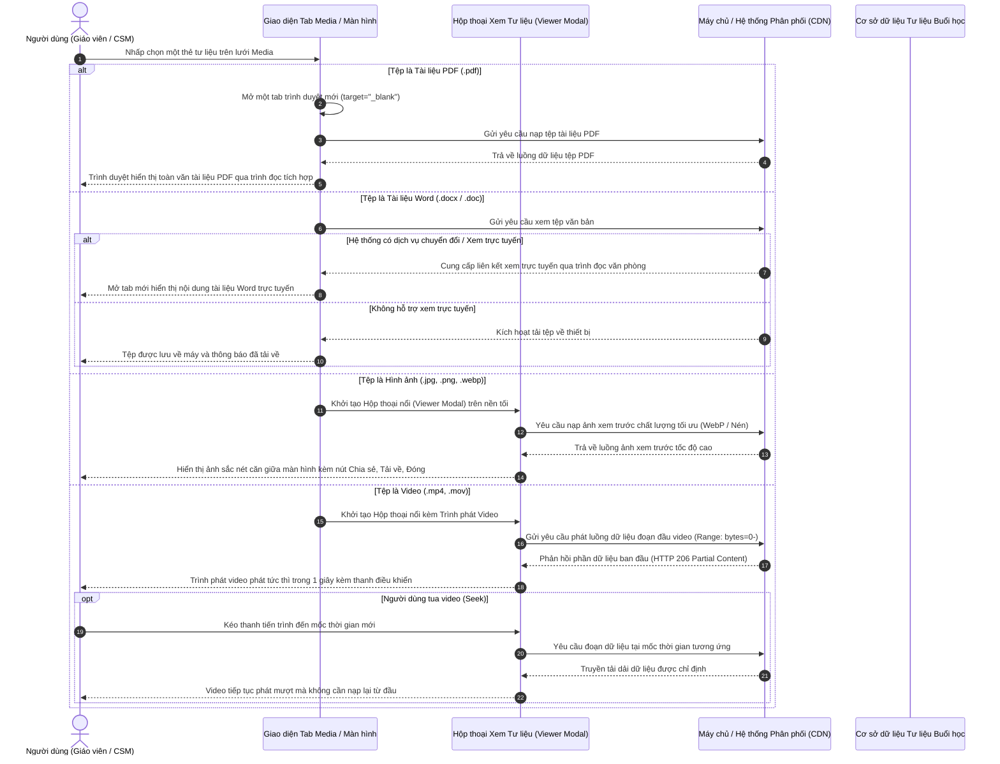

# US-CLS05-11: Cơ chế xem, phát tư liệu đa phương tiện & tài liệu (Media & Document Viewer Modal & Streaming)

> **Tham chiếu:** `BF-CLS-05` · `US-CLS05-07` · `US-CLS05-08` · `SR-CLS-005` · `ENTERPRISE_STANDARDS.md` · Giao diện Mẫu §4.3 (Hộp thoại nổi xem tư liệu & Cơ chế phát trực tuyến)  
> **Đường dẫn màn hình & Trạng thái liên quan:**  
> - `Lịch học lớp (/app/calendar_class_schedule)` -> Mở Chi tiết buổi học -> Thẻ tab `Media` -> Nhấp xem tệp phương tiện / tài liệu  
> - `Danh sách lớp học (/app/classes)` -> Mở Chi tiết lớp học -> Lịch trình buổi học -> Thẻ tab `Media`  
> - `Thành phần dùng chung toàn hệ thống (Shared Viewer)`: Bài tập về nhà, Khung chương trình (KCT), Hồ sơ học viên, Bài kiểm tra đánh giá tuyển sinh  

---

## 1. NHẬT KÝ THAY ĐỔI & BỐI CẢNH (CHANGELOG & CONTEXT)

### Lịch sử cập nhật tài liệu (Changelog)

| Ngày cập nhật | Phiên bản | Nội dung cập nhật | Lý do cập nhật |
|---|---|---|---|
| 24/09/2026 | v1.0.0 | Ban hành tài liệu đặc tả nghiệp vụ lần đầu cho cơ chế xem, phát tư liệu đa phương tiện (Ảnh, Video) và mở tài liệu văn bản | Chuẩn hóa trải nghiệm xem học liệu, phát luồng video/ảnh độ phân giải cao và chia sẻ liên kết an toàn theo tiêu chuẩn Enterprise |

### Bối cảnh & Vấn đề nghiệp vụ (Context & Problem)

* **Bối cảnh:** Trong quá trình vận hành giảng dạy, giáo viên và phụ huynh thường xuyên xem lại các sản phẩm học tập tại lớp bao gồm: hình ảnh chụp bài viết, video thuyết trình, tệp bài tập tài liệu dạng PDF hoặc văn bản Word. Trước đây, việc nhấn vào một tệp chỉ hỗ trợ tải về máy hoặc hiển thị thô sơ, chưa có một môi trường xem tập trung, liền mạch và chuyên nghiệp.
* **Vấn đề thực tế cần giải quyết:**
  1. **Tài liệu văn bản (PDF, DOC/DOCX):** Trình duyệt web có thể hiển thị tự nhiên tệp PDF nhưng không thể đọc trực tiếp các định dạng tài liệu văn phòng nhị phân như `.doc`, `.docx`. Nếu bắt buộc người dùng phải tải về mở bằng phần mềm ngoài sẽ làm đứt gãy luồng làm việc.
  2. **Tư liệu đa phương tiện (Ảnh & Video dung lượng lớn):** Các video quay lại hoạt động lớp học thường có dung lượng từ 30MB đến 100MB; hình ảnh chụp từ điện thoại thông minh hiện đại có độ phân giải cao từ 5MB đến 15MB. Nếu tải toàn bộ tệp rồi mới hiển thị sẽ gây thời gian chờ lâu, tốn dung lượng gói cước và gây giật lag trải nghiệm.
  3. **Cơ chế chia sẻ tư liệu:** Cần xác định chuẩn mực liên kết khi người dùng nhấn nút "Chia sẻ link" (sao chép liên kết nội bộ có kiểm tra quyền đăng nhập hay đường dẫn ký số công khai có thời hạn cho phụ huynh xem nhanh).
  4. **Tính tái sử dụng cao:** Hộp thoại xem tư liệu và cơ chế phát luồng này không chỉ dành riêng cho tab Media của buổi học mà còn phục vụ đồng nhất tại tất cả các phân hệ có đính kèm tệp trong toàn bộ nền tảng giáo dục.
* **Mục tiêu & Giá trị mang lại:**
  - **Với tệp tài liệu PDF:** Mở trực tiếp bằng trình duyệt trên tab mới (`target="_blank"`), tận dụng công cụ đọc tài liệu có sẵn của trình duyệt.
  - **Với tệp văn bản Word (DOC, DOCX):** Đề xuất giải pháp tích hợp công cụ đọc văn phòng trực tuyến của Microsoft / Google hoặc chuyển đổi ngầm sang bản xem trước PDF, có cơ chế dự phòng tải về tự động.
  - **Với Video & Ảnh:** Mở Hộp thoại nổi (Lightbox Viewer Modal) trên nền tối, hỗ trợ đầy đủ công cụ điều khiển phát, tải về, sao chép liên kết và gắn nhãn đối tượng.
  - **Về công nghệ truyền tải (Streaming):** Áp dụng phát luồng từng phần qua cơ chế truyền tải dải dữ liệu và điều chỉnh tốc độ bit thích ứng, kết hợp bộ nhớ đệm phân tán giúp phát video ngay trong 1 giây đầu tiên; áp dụng hiển thị ảnh mượt mà với nhiều tầng phân giải và định dạng nén hiện đại.
  - **Về chia sẻ:** Cung cấp định dạng liên kết ứng dụng nội bộ có kiểm tra bảo mật quyền hạn hoặc liên kết ký số bảo vệ có hạn sử dụng (TTL) 7 ngày.

### Hiểu người dùng & Tình huống sử dụng (User Needs & Use Cases)

* **Người dùng chính (Persona):** Giáo viên trực tiếp đứng lớp (`PERSONA-TEACHER`), Nhân viên chăm sóc học viên / Giáo vụ (`PERSONA-CSM`), Quản lý cơ sở (`PERSONA-BRANCH-MANAGER`), Phụ huynh và Học viên nhận liên kết chia sẻ.
* **Nhu cầu thực tế (Needs):**
  - **Giáo viên:** Mở xem nhanh clip học viên đọc bài phát âm ngay trong buổi học để chấm điểm mà không cần tải tệp nặng về máy tính.
  - **Nhân viên CSM:** Mở ảnh hoạt động lớp học để tải về hoặc sao chép nhanh liên kết gửi vào nhóm liên lạc phụ huynh để báo cáo tiến độ học tập.
  - **Phụ huynh:** Nhận được liên kết chia sẻ từ trung tâm, nhấp vào xem trực tiếp được video bài tập của con trên điện thoại mà không cần phải đăng nhập tài khoản nhân sự.
* **Câu phát biểu nghiệp vụ:** **Là một** Giáo viên hoặc Nhân viên vận hành, **tôi muốn** có một hộp thoại xem trực tiếp hình ảnh, video với tốc độ mở tức thì và khả năng xem tài liệu thuận tiện, **để** kiểm tra chất lượng giảng dạy, chia sẻ minh chứng học tập cho phụ huynh nhanh chóng và an toàn.

### Phạm vi kiểm soát & Ràng buộc nghiệp vụ toàn cục

* **Phạm vi chức năng (In-Scope - Tập trung khâu xem & phát):**
  - Cơ chế mở và xem tài liệu văn bản (`.pdf`, `.docx`, `.doc`).
  - Hộp thoại nổi xem ảnh (`Lightbox Modal`) và trình phát video tích hợp (`Video Player Modal`).
  - Cơ chế phát luồng trực tiếp (Streaming) video và nạp ảnh lũy tiến tối ưu khi xem.
  - Cơ chế sao chép liên kết chia sẻ (nội bộ vs ký số an toàn bên ngoài) và tải về tệp gốc.
  - Mô hình thành phần dùng chung (`MediaDocumentViewer`) trên toàn hệ thống.
* **Ngoài phạm vi (Out-of-Scope):**
  - Toàn bộ quy trình tải tệp lên (Upload), kiểm tra định dạng/dung lượng tệp khi tải lên (thuộc phạm vi đặc tả `US-CLS05-07`).
  - Các tiến trình xử lý ngầm trên máy chủ khi tệp được đẩy lên kho lưu trữ (chuyển mã video, sinh 3 tầng ảnh lúc tải lên). Tài liệu này giả định tệp đã tồn tại và sẵn sàng các đường dẫn dữ liệu phục vụ cho khâu xem.
* **Quy tắc phân định định dạng tệp:**
  - **Nhóm Hình ảnh (`image`):** `.jpg`, `.jpeg`, `.png`, `.webp`, `.gif` -> Mở trong Hộp thoại nổi xem ảnh.
  - **Nhóm Video (`video`):** `.mp4`, `.mov`, `.webm` -> Mở trong Hộp thoại nổi tích hợp trình phát video.
  - **Nhóm Tài liệu văn bản (`doc`):**
    - `.pdf`: Mặc định mở bằng trình duyệt web ở tab mới.
    - `.doc`, `.docx` (và `.xls`, `.xlsx`, `.ppt`, `.pptx`): Mở qua giải pháp đọc trực tuyến hoặc tải về tự động.
* **Ràng buộc nghiệp vụ toàn cục (Global Rules):**
  - **[RULE-VIEW-01] Xem trực quan không gián đoạn:** Khi mở hộp thoại xem ảnh/video, màn hình phía dưới được giữ nguyên trạng thái, thanh cuộn trang chính bị khóa tạm thời nhằm tập trung trải nghiệm vào nội dung phương tiện.
  - **[RULE-VIEW-02] Độc lập nguồn phát luồng:** Toàn bộ dữ liệu video/ảnh phải được truyền tải từ hệ thống máy chủ lưu trữ chuyên dụng thông qua giao thức truyền dữ liệu từng phần có bộ nhớ đệm tăng tốc.
  - **[RULE-VIEW-03] Bảo vệ liên kết chia sẻ:** Mọi liên kết chia sẻ ra bên ngoài phải được ký mã bảo mật và có thời hạn tự động vô hiệu hóa (mặc định 7 ngày) để tránh lộ lọt tư liệu nội bộ lâu dài.
  - **[RULE-VIEW-04] Tái sử dụng đồng nhất:** Cấu trúc hộp thoại, các phím tắt điều khiển và thanh công cụ hành động phải tuân thủ chuẩn thiết kế trực quan chung, đảm bảo khi tích hợp vào bất kỳ màn hình nào cũng mang lại trải nghiệm nhất quán.

---

## 2. LUỒNG XỬ LÝ CHÍNH (MAIN FLOW - HAPPY PATH)

---

## 3. GIAO DIỆN, QUY TẮC KIỂM SOÁT DỮ LIỆU & PHÂN QUYỀN (UI, VALIDATION RULES & PERMISSION GATING)

### 3.1. Cấu trúc các vùng giao diện & Ràng buộc Quyền hạn (Capability Gating)

Giao diện áp dụng cơ chế phân quyền theo năng lực động (Atomic Capabilities), không gán cứng theo vai trò tĩnh:

| Vùng Giao diện / Nút Thao Tác | Loại Hiển Thị | Mã Quyền Yêu Cầu (Required Capability) | Xử Lý Khi Không Đủ Quyền |
|---|---|---|---|
| **Xem thẻ và mở Hộp thoại tư liệu** | Thao tác nhấp chuột mở hộp thoại | `class.session_media.view` | Chặn thao tác, thông báo không có quyền xem |
| **Nút [Chia sẻ link]** | Nút trên thanh tiêu đề hộp thoại nổi | `class.session_media.share` | Ẩn nút chia sẻ hoặc hiển thị trạng thái vô hiệu hóa |
| **Nút [Tải về tệp]** | Nút trên thanh tiêu đề hộp thoại nổi | `class.session_media.download` | Ẩn nút tải về tệp gốc |
| **Huy hiệu thông tin đối tượng** | Nhãn chân hộp thoại / góc phương tiện | `class.session_media.view` | Hiển thị thông tin lớp / học viên được gắn |
| **Thanh điều khiển video** | Cụm nút Play, Âm lượng, Toàn màn hình | `class.session_media.view` | Mặc định cho phép người có quyền xem sử dụng |

### 3.2. Cấu trúc thành phần giao diện Hộp thoại Xem Tư liệu (Media Viewer Modal)

#### Bảng thành phần giao diện chính

| Thành phần giao diện | Vị trí hiển thị | Loại thành phần | Mô tả chi tiết & Quy chuẩn thiết kế trực quan |
|---|---|---|---|
| **Lớp nền che mờ (Backdrop)** | Toàn bộ màn hình phía sau | Lớp phủ làm tối | Nền đen mờ 85% có hiệu ứng làm mờ nhẹ hậu cảnh. Nhấp chuột vào vùng nền này hỗ trợ đóng nhanh hộp thoại |
| **Thanh tiêu đề (Header Bar)** | Cạnh trên cùng của hộp thoại | Khung ngang cố định | Chiều cao 64 điểm ảnh, nền đen bán trong suốt, chứa thông tin tệp và cụm nút hành động bên phải |
| **Huy hiệu loại tệp (Type Badge)** | Góc trái thanh tiêu đề | Nhãn chữ bo góc | Nền xám đen, chữ in hoa: `ẢNH`, `VIDEO` hoặc `TỆP` nổi bật |
| **Tiêu đề tên tệp** | Cạnh huy hiệu loại tệp | Dòng văn bản đơn dòng | Hiển thị tên tệp đầy đủ kèm đuôi tệp. Chữ màu trắng sáng, tự động thu gọn kèm dấu ba chấm nếu quá dài |
| **Nút [Chia sẻ link]** | Góc phải thanh tiêu đề | Nút bấm kèm biểu tượng chia sẻ | Nền kính mờ bo tròn nhẹ. Nhấp vào sẽ sao chép liên kết truy cập an toàn và hiển thị thông báo phản hồi |
| **Nút [Tải về tệp]** | Cạnh nút Chia sẻ | Nút bấm kèm biểu tượng tải xuống | Nền kính mờ bo tròn nhẹ. Nhấp vào kích hoạt tải trực tiếp tệp gốc về thiết bị |
| **Nút [X] (Đóng hộp thoại)** | Ngoài cùng bên phải thanh tiêu đề | Nút tròn đóng | Nền xám mờ, biểu tượng chữ X màu trắng. Hỗ trợ bấm phím tắt `Esc` để đóng |
| **Khung trung tâm hiển thị Ảnh** | Giữa màn hình hộp thoại | Khung hiển thị co giãn | Hiển thị hình ảnh kích thước lớn, tự động co giãn vừa vặn khung nhìn, giữ nguyên tỉ lệ gốc của bức ảnh |
| **Trình phát Video chuyên dụng** | Giữa màn hình hộp thoại | Khung phát video chuẩn hóa | Bao gồm khung hình phát video chất lượng cao và thanh điều khiển tích hợp ở chân video |
| **Thanh điều khiển Video** | Đáy khung phát video | Thanh công cụ đa phương tiện | Gồm: Nút Phát/Tạm dừng, hiển thị mốc thời gian (`0:00 / Thời lượng: 03:10`), thanh trượt tiến trình, nút âm lượng, nút toàn màn hình |
| **Huy hiệu đối tượng (Footer Badge)** | Góc dưới phải của tệp hiển thị | Nhãn nổi tròn | Hiển thị chấm tròn màu xanh lục kèm chữ `Dành cho cả lớp` hoặc danh sách ảnh đại diện học viên được gắn |
| **Nút điều hướng tệp trước / sau** | Hai bên mép trái và mép phải màn hình | Nút mũi tên bán trong suốt | Cho phép nhấp chuyển nhanh sang xem tệp liền kề trong danh sách (hỗ trợ phím mũi tên Trái / Phải) |

#### Bảng quy chuẩn trường dữ liệu của Hộp thoại Xem (Viewer Data Contract)

| Trường thông tin | Kiểu dữ liệu | Bắt buộc | Nguồn dữ liệu | Quy tắc kiểm tra (Validation) | Quy cách hiển thị |
|---|---|---|---|---|---|
| **Mã định danh tệp (id)** | Chuỗi ký tự | Bắt buộc | Cơ sở dữ liệu | Mã duy nhất của tệp trong hệ thống | Ẩn trên giao diện |
| **Tên tệp hiển thị (fileName)** | Chuỗi ký tự | Bắt buộc | Hệ thống lưu trữ | Tối đa 255 ký tự, chứa phần mở rộng hợp lệ | Hiển thị trên thanh tiêu đề |
| **Phân loại tệp (mediaType)** | Danh mục | Bắt buộc | Nhận diện hệ thống | Thuộc tập giá trị: `image`, `video`, `doc` | Nhãn in hoa: ẢNH / VIDEO / TỆP |
| **Đường dẫn xem trước (previewUrl)** | Chuỗi liên kết | Bắt buộc | Máy chủ phân phối | Đường dẫn truyền tải tối ưu hoặc luồng dữ liệu | Sử dụng làm nguồn nạp hiển thị |
| **Đường dẫn tệp gốc (originalUrl)** | Chuỗi liên kết | Bắt buộc | Máy chủ lưu trữ | Đường dẫn tệp gốc an toàn | Dùng cho hành động Tải về |
| **Thời lượng video (duration)** | Số giây | Tùy chọn | Trích xuất video | Giá trị số nguyên dương biểu thị tổng số giây | Định dạng hiển thị: `MM:SS` |
| **Đối tượng gắn thẻ (taggedScope)** | Danh mục/Danh sách | Bắt buộc | Cơ sở dữ liệu | Rỗng biểu thị cả lớp; có mã học viên biểu thị đích danh | Huy hiệu xanh lá hoặc ảnh đại diện |

---

## 4. KHỐI CHỨC NĂNG CHI TIẾT: ACTION & LUỒNG KÍCH HOẠT (ACTIONS & EVENTS)

### Khối chức năng 1: Cơ chế Mở và Xem Tài liệu Văn bản (Documents)

#### Action 1.1: Xem Tài liệu PDF trên tab Trình duyệt
* **Luồng kích hoạt:** Người dùng nhấp chuột vào thẻ tài liệu có đuôi `.pdf` trên danh sách hoặc nhấp biểu tượng xem mở rộng.
* **Tiêu chí nghiệm thu (Acceptance Criteria):**
  - **AC-1 (Happy Path - Mở tài liệu PDF trực tiếp bằng trình duyệt):**
    - **Giả sử:** Danh sách media có tệp tài liệu `Tai_Lieu_Song_Ngu_Unit2.pdf`.
    - **Khi:** Người dùng nhấp trực tiếp vào thẻ hoặc nhấp biểu tượng mũi tên mở rộng trên thẻ.
    - **Thì:** Trình duyệt tự động mở một tab mới hiển thị trọn vẹn tệp PDF thông qua trình đọc tích hợp có sẵn của trình duyệt, người dùng có thể cuộn đọc, phóng to, in hoặc lưu tệp.
  - **AC-2 (Alternate Path - Tải về tài liệu PDF):**
    - **Giả sử:** Người dùng đang di chuột trên thẻ tệp PDF.
    - **Khi:** Người dùng nhấp vào biểu tượng nút tròn [Tải về].
    - **Thì:** Trình duyệt tải ngay tệp PDF gốc về thư mục máy tính của người dùng và hiển thị thông báo "Đang tải về tệp: Tai_Lieu_Song_Ngu_Unit2.pdf".
  - **AC-3 (Exception Path - Đường dẫn tệp PDF bị lỗi hoặc không tồn tại):**
    - **Giả sử:** Tệp PDF đã bị xóa khỏi kho lưu trữ hoặc đường dẫn bị gián đoạn.
    - **Khi:** Người dùng nhấn mở tệp.
    - **Thì:** Tab mới mở ra hiển thị thông báo lỗi từ máy chủ: "Không tìm thấy tệp tài liệu hoặc tài liệu đã hết hạn truy cập".

#### Action 1.2: Xem Tài liệu Word (DOC, DOCX) & Đề xuất giải pháp
* **Luồng kích hoạt:** Người dùng nhấp chọn tệp tài liệu có định dạng `.docx` hoặc `.doc`.
* **Tiêu chí nghiệm thu:**
  - **AC-4 (Happy Path - Xem trước trực tuyến qua dịch vụ văn phòng):**
    - **Giả sử:** Hệ thống đã tích hợp cổng hiển thị văn bản trực tuyến và người dùng nhấn vào tệp `Bai_Tap_Ve_Nha_Buoi3.docx`.
    - **Khi:** Người dùng nhấp vào thẻ tệp để mở.
    - **Thì:** Hệ thống chuyển hướng mở một tab trình duyệt mới dẫn đến trình đọc trực tuyến, hiển thị toàn bộ nội dung văn bản Word nguyên vẹn mà không yêu cầu cài đặt phần mềm trên máy tính.
  - **AC-5 (Alternate Path - Cơ chế tự động tải về dự phòng):**
    - **Giả sử:** Thiết bị đang ở mạng nội bộ không thể truy cập dịch vụ xem văn bản trực tuyến bên ngoài.
    - **Khi:** Người dùng nhấp mở tệp Word.
    - **Thì:** Hệ thống tự động kích hoạt tải tệp về máy tính người dùng và hiển thị thông báo: "Tệp Word đã được tải về máy của bạn để mở bằng ứng dụng trên máy tính".

---

### Khối chức năng 2: Xem Hình ảnh trong Hộp thoại nổi (Image Viewer Modal)

#### Action 2.1: Mở Hộp thoại Xem Ảnh
* **Luồng kích hoạt:** Người dùng nhấp chuột vào một thẻ ảnh (ví dụ: `Goc_Hoc_Tap_ThienAn.jpg`) trên lưới tư liệu buổi học.
* **Tiêu chí nghiệm thu:**
  - **AC-6 (Happy Path - Hiển thị ảnh sắc nét trên nền tối):**
    - **Giả sử:** Lưới đang hiển thị thẻ ảnh `Goc_Hoc_Tap_ThienAn.jpg`.
    - **Khi:** Người dùng nhấp vào bức ảnh.
    - **Thì:** Hộp thoại nổi lập tức xuất hiện che mờ toàn màn hình; thanh tiêu đề hiển thị nhãn `ẢNH`, tên tệp `Goc_Hoc_Tap_ThienAn.jpg`, nút [Chia sẻ link], nút [Tải về tệp], nút đóng `[X]`; ảnh được căn giữa sắc nét, giữ nguyên tỉ lệ gốc, góc dưới phải hiển thị huy hiệu `Dành cho cả lớp`.
  - **AC-7 (Happy Path - Đóng hộp thoại xem ảnh):**
    - **Giả sử:** Hộp thoại xem ảnh đang mở.
    - **Khi:** Người dùng nhấp nút `[X]`, hoặc bấm phím `Esc` trên bàn phím, hoặc nhấp chuột vào vùng nền đen phía ngoài ảnh.
    - **Thì:** Hộp thoại nổi đóng lại nhẹ nhàng, giao diện quay trở lại đúng vị trí lưới thẻ Media trước đó.
  - **AC-8 (Alternate Path - Phóng to và thu nhỏ ảnh):**
    - **Giả sử:** Bức ảnh đang hiển thị trong hộp thoại nổi.
    - **Khi:** Người dùng lăn con trỏ chuột hoặc nhấp đúp chuột lên vùng ảnh.
    - **Thì:** Bức ảnh phóng to mượt mà cho phép người dùng kéo rê chuột để xem chi tiết từng góc ảnh; nhấp đúp lần nữa đưa ảnh về kích thước vừa vặn ban đầu.

---

### Khối chức năng 3: Phát Video trong Hộp thoại nổi (Video Player Modal & Streaming)

#### Action 3.1: Mở và Phát Video trực tiếp
* **Luồng kích hoạt:** Người dùng nhấp chuột vào một thẻ video (ví dụ: `Thao_Luan_Phien_Am_Lop.mp4`) trên lưới tư liệu buổi học.
* **Tiêu chí nghiệm thu:**
  - **AC-9 (Happy Path - Phát video tức thì và thanh điều khiển):**
    - **Giả sử:** Người dùng nhấp vào thẻ video `Thao_Luan_Phien_Am_Lop.mp4` thời lượng 03 phút 10 giây.
    - **Khi:** Hộp thoại mở ra.
    - **Thì:** Trình phát nạp ngay đoạn dữ liệu ban đầu và phát video trong vòng dưới 1 giây; thanh điều khiển ở đáy hiển thị nút Tạm dừng/Phát, mốc thời gian `0:00 / Thời lượng: 03:10`, thanh trượt tiến trình, âm lượng và nút toàn màn hình; góc dưới phải hiển thị huy hiệu `Dành cho cả lớp`.
  - **AC-10 (Happy Path - Tua video không bị giật lag):**
    - **Giả sử:** Video đang phát ở mốc 0:15.
    - **Khi:** Người dùng kéo thanh tiến trình hoặc nhấp trực tiếp vào mốc thời gian `02:00`.
    - **Thì:** Trình phát chỉ tải dữ liệu tại đoạn phút thứ 02:00 và tiếp tục phát ngay lập tức mà không phải chờ tải lại từ đầu video.
  - **AC-11 (Alternate Path - Bật chế độ xem toàn màn hình):**
    - **Giả sử:** Video đang phát trong hộp thoại nổi.
    - **Khi:** Người dùng nhấp vào biểu tượng Toàn màn hình ở góc phải thanh điều khiển (hoặc nhấn phím `F`).
    - **Thì:** Khung video mở rộng chiếm toàn bộ màn hình thiết bị; nhấn phím `Esc` hoặc bấm nút thu nhỏ sẽ quay về kích thước hộp thoại nổi.

---

### Khối chức năng 4: Cơ chế Chia sẻ và Tải về Tư liệu (Share & Download)

#### Action 4.1: Sao chép Liên kết Chia sẻ Tư liệu (Copy Link)
* **Luồng kích hoạt:** Người dùng nhấp nút [Chia sẻ link] trên thanh tiêu đề của hộp thoại nổi hoặc trên thẻ media.
* **Tiêu chí nghiệm thu:**
  - **AC-12 (Happy Path - Sao chép liên kết chia sẻ an toàn):**
    - **Giả sử:** Hộp thoại xem video `Thao_Luan_Phien_Am_Lop.mp4` đang mở.
    - **Khi:** Người dùng nhấp nút [Chia sẻ link].
    - **Thì:** Hệ thống tự động sao chép đường dẫn truy cập ký số có thời hạn an toàn vào bộ nhớ tạm của thiết bị và hiển thị thông báo phản hồi nhẹ: "Đã sao chép liên kết chia sẻ tệp Thao_Luan_Phien_Am_Lop.mp4!".
  - **AC-13 (Happy Path - Người nhận mở liên kết chia sẻ):**
    - **Giả sử:** Phụ huynh nhận được liên kết chia sẻ do trung tâm gửi qua tin nhắn.
    - **Khi:** Phụ huynh nhấp vào liên kết trên trình duyệt điện thoại hoặc máy tính.
    - **Thì:** Trang xem công khai mở ra hiển thị trực tiếp video hoặc hình ảnh với tốc độ truyền tải tối ưu, không yêu cầu phụ huynh phải đăng nhập tài khoản hệ thống Station.
  - **AC-14 (Exception Path - Liên kết chia sẻ đã hết hạn):**
    - **Giả sử:** Liên kết chia sẻ đã quá thời hạn 7 ngày kể từ khi tạo.
    - **Khi:** Người nhận truy cập liên kết.
    - **Thì:** Trình duyệt hiển thị thông báo lịch sự: "Liên kết xem tư liệu này đã hết hạn. Vui lòng liên hệ nhà trường để nhận liên kết mới".

#### Action 4.2: Tải Tệp gốc về Thiết bị
* **Luồng kích hoạt:** Người dùng nhấp nút [Tải về tệp] trên thanh tiêu đề của hộp thoại nổi.
* **Tiêu chí nghiệm thu:**
  - **AC-15 (Happy Path - Tải tệp chất lượng gốc):**
    - **Giả sử:** Người dùng đang xem video hoặc ảnh trong hộp thoại nổi và nhấp nút [Tải về tệp].
    - **Khi:** Lệnh tải được gửi đi.
    - **Thì:** Hệ thống cung cấp luồng tải tệp gốc giữ nguyên độ phân giải ban đầu về thiết bị người dùng và hiển thị thông báo "Đang tải về tệp...".

---

## 5. CÁC TRƯỜNG HỢP GÓC CẠNH & LUỒNG NGOẠI LỆ (CORNER CASES & EXCEPTION FLOWS)

* **[CASE-01] Mạng yếu hoặc gián đoạn kết nối khi đang phát video (Low Bandwidth):** Trình phát video tự động nhận diện tốc độ mạng suy giảm, chuyển sang độ phân giải thấp hơn (ví dụ từ 720p về 360p) để duy trì âm thanh và hình ảnh liên tục, tránh ngắt quãng luồng xem của người dùng.
* **[CASE-02] Tệp video bị hỏng mã hóa hoặc thiếu chỉ mục dữ liệu ban đầu:** Máy chủ không thể đọc được phân đoạn dữ liệu đầu; trình phát hiển thị thông báo: "Không thể phát video này do định dạng dữ liệu không tương thích. Vui lòng tải về máy để xem".
* **[CASE-03] Xem hình ảnh có kích thước cực lớn hoặc ảnh chụp toàn cảnh (Panorama):** Hộp thoại tự động căn chỉnh ảnh theo chiều dọc hoặc ngang để toàn bộ bức ảnh nằm trọn trong khung nhìn ban đầu; cho phép người dùng kéo con lăn chuột để xem các chi tiết theo ý muốn.
* **[CASE-04] Người dùng dùng phím điều hướng chuyển tệp ở tệp đầu tiên hoặc cuối cùng:** Khi người dùng đang xem tệp đầu tiên và bấm phím mũi tên Trái, hoặc tệp cuối cùng và bấm phím mũi tên Phải, nút điều hướng tương ứng sẽ tự động mờ đi (vô hiệu hóa) và không thực hiện chuyển tiếp.
* **[CASE-05] Truy cập liên kết chia sẻ nội bộ khi chưa đăng nhập:** Nếu người nhận nhấp vào liên kết điều hướng nội bộ (`Deep Link`) khi chưa có phiên làm việc, hệ thống chuyển hướng về màn hình đăng nhập, sau khi xác thực thành công sẽ tự động đưa người dùng đến đúng màn hình buổi học và mở sẵn hộp thoại xem tệp đó.
* **[CASE-06] Người dùng không có quyền truy cập buổi học khi nhấp liên kết chia sẻ nội bộ:** Hệ thống kiểm tra quyền hạn của tài khoản; nếu không có quyền xem lớp học đó, hiển thị màn hình thông báo: "Bạn không có quyền truy cập vào tư liệu của buổi học này".
* **[CASE-07] Tệp tài liệu Word chứa macro hoặc mã đặc biệt:** Trình đọc trực tuyến mở ở chế độ an toàn chỉ đọc (Read-only Preview), vô hiệu hóa toàn bộ mã kịch bản nhúng bên trong để bảo đảm an toàn hệ thống.
* **[CASE-08] Thiết bị di động chặn mở cửa sổ mới (Popup Blocker):** Khi người dùng nhấp xem tệp PDF trên trình duyệt di động bị chặn mở tab mới, hệ thống tự động hiển thị thanh thông báo nổi kèm nút: "Nhấp vào đây để mở tài liệu".
* **[CASE-09] Chia sẻ liên kết của tệp vừa mới bị xóa khỏi hệ thống:** Khi người dùng khác mở liên kết của tệp đã bị xóa, hệ thống hiển thị thông báo: "Tư liệu này đã được gỡ bỏ khỏi hệ thống".
* **[CASE-10] Người dùng bấm phím tắt khi đang gõ chữ trong ô tìm kiếm:** Khi hộp thoại xem tư liệu mở nhưng có bảng nhập liệu, các phím tắt bàn phím (`Space` tạm dừng, `Esc` đóng, mũi tên chuyển tệp) được cô lập phạm vi để tránh xung đột hành vi gõ văn bản.

---

## 6. KẾT NỐI DỮ LIỆU DỊCH VỤ VÀ YÊU CẦU PHI CHỨC NĂNG

### 6.1. Yêu cầu phi chức năng (Non-functional Requirements)

* **Thời gian khởi tạo và phản hồi:**
  - Hộp thoại xem ảnh mở lên tức thì dưới 150ms kể từ khi nhấp chuột.
  - Video bắt đầu phát khung hình đầu tiên trong vòng dưới 1.000ms đối với kết nối mạng thông thường (băng thông $\ge 5$ Mbps).
  - Thao tác đóng hộp thoại hoặc chuyển tệp phản hồi tức thì dưới 100ms.
* **Khả năng chịu tải và phân phối dữ liệu:**
  - Toàn bộ tư liệu hình ảnh và video tĩnh được phân phối qua mạng lưới máy chủ phân phối nội dung có bộ nhớ đệm tại biên, giảm tải 80% lưu lượng truy cập trực tiếp vào máy chủ dữ liệu gốc.
* **Tính tương thích đa nền tảng:**
  - Hộp thoại nổi và trình phát tương thích hoàn hảo trên các trình duyệt hiện đại (Chrome, Safari, Edge, Firefox) và tự động co giãn tối ưu trên cả màn hình máy tính để bàn, máy tính bảng và điện thoại di động.

### 6.2. Kết nối dữ liệu dịch vụ hệ thống (Service & Data Contract)

* **Luồng nạp thông tin chi tiết tư liệu:** Gọi đến cơ sở dữ liệu tư liệu buổi học theo mã tệp (`mediaId`), nhận gói dữ liệu chứa tên tệp, loại tệp, đường dẫn xem trước, đường dẫn tải về và danh sách học viên được gắn nhãn.
* **Luồng phát dữ liệu từng phần (Partial Streaming):** Sử dụng cơ chế phân đoạn dữ liệu qua tiêu chuẩn dải byte (`Accept-Ranges: bytes`), cho phép máy chủ trả về mã trạng thái phản hồi từng phần `HTTP 206` cho mỗi đoạn dữ liệu người dùng yêu cầu.
* **Luồng tạo liên kết chia sẻ bảo vệ:** Gọi đến dịch vụ tạo khóa truy cập có thời hạn, tạo chuỗi ký số chứa mã định danh tệp, thời điểm hết hạn và chữ ký xác thực.

### 6.3. Kiến trúc Truyền tải & Hiển thị tại Khâu Xem (Viewing & Streaming Architecture)

#### A. Cơ chế Phát luồng Video Trực tuyến (Video Streaming Mechanism)
1. **Truyền tải từng phần (HTTP 206 Partial Content / Range Requests):**
   - Trình phát video gửi yêu cầu lấy dữ liệu theo từng dải byte (`Range: bytes=0-`). Máy chủ lưu trữ phản hồi phân đoạn dữ liệu ban đầu kèm tiêu đề dải dữ liệu, giúp video bắt đầu phát ngay lập tức trong vòng dưới 1 giây mà không cần chờ nạp toàn bộ tệp lớn về máy.
   - Khi người dùng tua nhanh (Seek) đến bất kỳ thời điểm nào trên thanh tiến trình, trình phát gửi yêu cầu dải dữ liệu tương ứng tại mốc thời gian đó (`Range: bytes=X-Y`), giúp việc tua video diễn ra mượt mà và không bị gián đoạn.
2. **Phát luồng thích ứng theo băng thông (Adaptive Bitrate Streaming):**
   - Hỗ trợ phát qua giao thức phân đoạn luồng thích ứng (HLS). Trình phát tự động giám sát tốc độ đường truyền mạng của thiết bị để linh hoạt chuyển đổi giữa các mức chất lượng (360p, 720p, 1080p), đảm bảo âm thanh và hình ảnh liên tục, không bị xoay tròn dừng hình khi mạng yếu.

#### B. Cơ chế Tối ưu Hiển thị Hình ảnh tại Khâu Xem (Image Rendering & Progressive Loading)
1. **Nạp ảnh xem trước tối ưu (Optimized Preview Rendering):**
   - Hộp thoại nổi khi mở ra sẽ gọi trực tiếp đường dẫn ảnh xem trước đã được tối ưu hiển thị (định dạng WebP/AVIF độ phân giải cao). Dữ liệu được nạp trực tiếp từ bộ đệm mạng phân phối (CDN), đảm bảo ảnh sắc nét hiển thị trong vòng dưới 150ms.
2. **Khung mờ đại diện chống giật giao diện (BlurHash / LQIP Rendering):**
   - Trong khoảng 10 – 30ms đầu khi tệp ảnh xem trước đang được truyền tải qua mạng, giao diện vẽ ngay khung màu mờ đại diện từ chuỗi ký tự nhận dạng có sẵn. Nhờ đó, người dùng không thấy khung đen hay hiện tượng giật nảy bố cục màn hình.
3. **Phân tách nguồn tải về chất lượng gốc (Full-Resolution Download Source):**
   - Nút hành động [Tải về tệp] trỏ trực tiếp đến đường dẫn tệp gốc nguyên bản lưu trữ an toàn, đảm bảo chất lượng cao nhất cho người dùng khi lưu trữ offline.

#### C. Quy chuẩn Phân loại Liên kết Chia sẻ (Shareable Link Classification)
Hệ thống cung cấp chuẩn hóa 2 loại liên kết khi người dùng nhấn nút [Chia sẻ link]:
1. **Loại 1: Liên kết Ứng dụng Nội bộ (Station Deep Link):**
   - *Cấu trúc:* `https://station.rinoedu.vn/app/classes/{classId}/sessions/{sessionId}?tab=media&viewMediaId={mediaId}`
   - *Mục đích:* Dành cho giáo viên, quản lý cơ sở, nhân viên chăm sóc học viên chia sẻ công việc với nhau. Yêu cầu đăng nhập và có quyền xem buổi học tương ứng (`class.session_media.view`).
2. **Loại 2: Liên kết Ký số An toàn dành cho Người xem Ngoài (Pre-signed Secure Viewer Link):**
   - *Cấu trúc:* `https://share.rinoedu.vn/v/{token}?expires={timestamp}&signature={sig}`
   - *Mục đích:* Dành cho phụ huynh, học viên xem trực tiếp video/ảnh bài học mà không cần tài khoản hệ thống.
   - *Quy chuẩn an toàn:* Có thời hạn sử dụng tối đa 7 ngày, chỉ cho phép xem trực tiếp trên trang xem độc lập, có cơ chế thu hồi liên kết khi cần.

#### D. Thiết kế Thành phần Dùng chung Toàn hệ thống (Reusable Shared Component Model)
Hộp thoại `MediaDocumentViewer` được đóng gói thành một thành phần dùng chung độc lập, nhận vào các thuộc tính cấu hình mở:
* Danh sách phần tử hiển thị (`items: ViewerMediaItem[]`)
* Vị trí phần tử khởi tạo (`initialIndex: number`)
* Cờ cho phép tải về (`canDownload: boolean`)
* Cờ cho phép chia sẻ liên kết (`canShare: boolean`)
* Cờ hiển thị nhãn học viên (`showStudentTags: boolean`)
Nhờ đó, thành phần này được áp dụng trực tiếp cho:
* Màn hình nộp bài tập về nhà của học sinh.
* Màn hình duyệt giáo án, slide bài giảng theo Khung chương trình (KCT).
* Kho minh chứng năng lực học tập định kỳ (Portfolio học viên).
* Hồ sơ nhân sự và chứng chỉ bằng cấp của giáo viên.
