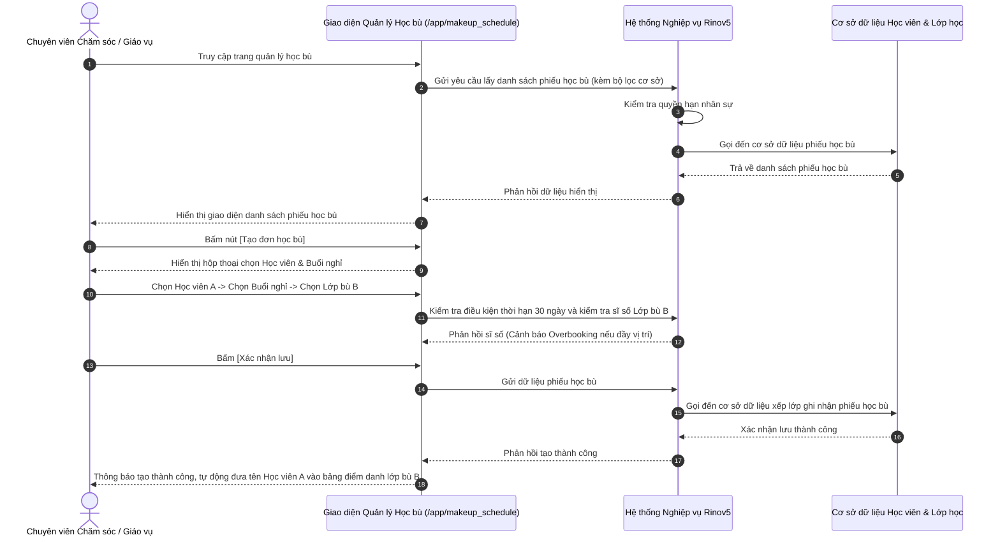

# US-CLS06-06: Màn hình Đăng ký & Quản lý Học bù

> **Tham chiếu:** BF-CLS-06 · SR-CSM-001 · Giao diện Mẫu §4.2 (Danh sách)
> **Đường dẫn màn hình & Trạng thái liên quan:**
> - `/app/makeup_schedule` -> Trạng thái phiếu: `cho_duyet`, `da_xep_lich`, `hoan_tat`, `da_vang`, `tu_choi`, `het_han`

---

## 1. NHẬT KÝ THAY ĐỔI & BỐI CẢNH (CHANGELOG & CONTEXT)

### Lịch sử cập nhật tài liệu (Changelog)

| Ngày cập nhật | Nội dung cập nhật | Lý do cập nhật |
|---|---|---|
| 31/07/2026 | Khởi tạo tài liệu đặc tả màn hình Đăng ký & Quản lý Học bù | Chuyển đổi từ quy trình làm việc thủ công (nhắn nhóm/ticket) lên giao diện Rinov5 theo yêu cầu nghiệp vụ |

### Bối cảnh & Vấn đề nghiệp vụ (Context & Problem)
* **Bối cảnh:** Trước đây, khi học viên xin nghỉ học buổi chính thức và có nhu cầu học bù, nhân viên chăm sóc và giáo viên phải trao đổi thủ công qua tin nhắn nhóm hoặc lập ticket hỗ trợ. Quy trình này dẫn đến thiếu minh bạch trong việc theo dõi định mức học bù, theo dõi sĩ số lớp bù và đồng bộ kết quả điểm danh.
* **Vấn đề hiện tại:** 
  1. Chưa có công cụ quản lý tập trung danh sách phiếu học bù, khiến việc dò tìm lớp cùng trình độ để ghép học bù mất nhiều thời gian.
  2. Chưa tự động kiểm soát được giới hạn số lần học bù, dẫn đến tình trạng học viên đăng ký học bù nhiều lần cho cùng một buổi nghỉ.
  3. Thiếu cơ chế cảnh báo khi lớp học bù bị quá sĩ số tối đa (Overbooking).
* **Mục tiêu & Giá trị mang lại:** 
  - Số hóa 100% quy trình đăng ký, xếp lịch và phê duyệt học bù trên hệ thống.
  - Phân định rõ 2 kịch bản học bù: 
    - **Trường hợp 1 (Hủy lớp do trung tâm):** Tạo một buổi học bù riêng cho cả lớp, học viên tham gia bị trừ 1 buổi định mức như buổi học thường.
    - **Trường hợp 2 (Học bù ghép cá nhân):** Nhét học viên nghỉ lẻ vào một lớp chính khác cùng trình độ. Không tính phí/không trừ thêm định mức học viên, quản lý như học viên học thử (Guest/Trial) trong danh sách điểm danh.
  - Kiểm soát nghiêm ngặt thời hạn đăng ký học bù trong vòng 30 ngày và tối đa 1 lần bù cho mỗi buổi nghỉ.

### Hiểu người dùng & Tình huống sử dụng (User Needs & Use Cases)
* **Người dùng chính (Persona):** Chuyên viên Chăm sóc học viên (PERSONA-CSM), Giáo vụ cơ sở, Giáo viên (PERSONA-TEACHER).
* **Khó khăn lớn nhất (Pain-points):** Mất thời gian kiểm tra thủ công xem lớp khác cùng trình độ còn vị trí trống không; dễ quên kiểm tra việc học viên đã từng học bù cho buổi nghỉ đó chưa.
* **Nhu cầu thực tế (Needs):** Muốn thấy danh sách buổi nghỉ của học viên, chọn nhanh lớp bù phù hợp cùng trình độ, tạo phiếu và theo dõi trạng thái điểm danh buổi học bù tự động.
* **Câu phát biểu nghiệp vụ:** **Là một** Chuyên viên Chăm sóc học viên / Giáo vụ, **tôi muốn** tạo đơn và xếp lịch học bù cho học viên trên màn hình quản lý tập trung, **để** đảm bảo quyền lợi học tập của học viên mà không làm xáo trộn sĩ số và doanh thu của trung tâm.

### Phạm vi kiểm soát (Scope)
* **Phạm vi hiển thị:** Quản lý toàn bộ danh sách phiếu học bù của học viên tại cơ sở, cho phép tạo đơn mới, xếp buổi bù, phê duyệt đơn nháp và xem chi tiết điểm danh.
* **Ràng buộc nghiệp vụ toàn cục (Global Rules):**
  - **[RULE-MAKEUP-01] Giới hạn lần học bù:** Mỗi buổi học sinh nghỉ ở lớp chính chỉ được phép đăng ký học bù ghép tối đa **1 lần**. Nếu học viên vắng mặt tại buổi học bù đã xếp (No-show), phiếu chuyển sang trạng thái `Đã vắng` và học viên mất quyền đăng ký bù lại cho buổi nghỉ đó.
  - **[RULE-MAKEUP-02] Thời hạn học bù:** Thời hạn đăng ký và tham gia học bù tối đa là **30 ngày** kể từ ngày diễn ra buổi nghỉ chính thức. Quá 30 ngày, hệ thống tự động chuyển phiếu sang trạng thái `Quá hạn`.
  - **[RULE-MAKEUP-03] Quy tắc trừ định mức & Học phí:** 
    - Đối với buổi học chính bị nghỉ: Học viên bị trừ 1 buổi học theo đúng quy tắc gói học.
    - Đối với buổi học bù ghép (Trường hợp 2): **Không tính phí, không trừ thêm định mức** của học viên.
    - Đối với buổi học bù mở riêng do trung tâm hủy lớp (Trường hợp 1): Học viên tham gia sẽ bị trừ 1 buổi định mức (thay cho buổi hủy chưa trừ).
  - **[RULE-MAKEUP-04] Luồng Phê duyệt:** 
    - Nếu Đơn học bù do **Giáo viên** tạo: Đơn ở trạng thái `Chờ duyệt` (tạo nháp), cần Quản lý chi nhánh hoặc Chuyên viên Chăm sóc phê duyệt trước khi có hiệu lực.
    - Nếu Đơn học bù do **Chuyên viên Chăm sóc / Giáo vụ** tạo: Đơn được tự động chuyển sang trạng thái `Đã xếp lịch` (không cần duyệt 2 cấp).
  - **[RULE-MAKEUP-05] Kiểm soát Sĩ số & Cảnh báo Overbooking:** Khi xếp học bù ghép vào một lớp chính khác, hệ thống sẽ kiểm tra sĩ số của buổi học đó. Nếu số lượng (Học viên chính thức + Học viên học bù + Học viên học thử) vượt quá Sĩ số tối đa (Max Capacity), hệ thống hiển thị ô cảnh báo quá sĩ số nhưng vẫn cho phép Chuyên viên Chăm sóc / Quản lý duyệt chèn thêm nếu cần thiết.
  - **[RULE-MAKEUP-06] Hiển thị điểm danh:** Học viên học bù ghép được hiển thị trong bảng điểm danh của Giáo viên lớp bù với thẻ nhãn `Học bù`. Kết quả điểm danh buổi học đó sẽ tự động đồng bộ trạng thái về phiếu học bù.
  - **[GLOBAL-METRIC-01] Số lượng bản ghi mặc định:** Hiển thị mặc định 20 bản ghi phiếu học bù trên một trang (cho phép chọn 20, 50, 100).

---

## 2. LUỒNG XỬ LÝ CHÍNH (MAIN FLOW - HAPPY PATH)

*Mô tả luồng người dùng tạo đơn học bù ghép và đồng bộ điểm danh tự động:*

---

## 3. GIAO DIỆN & TRẠNG THÁI TĨNH (DATA & UI STATE)

### 3.1. Thiết kế trực quan (Figma)
* **Hình ảnh & Bản vẽ thiết kế:** Tham chiếu cấu trúc màn hình danh sách chuẩn §4.2 và hộp thoại biểu mẫu §4.4 trong tài liệu Thiết kế Giao diện.

### 3.2. Cấu trúc các vùng giao diện
Màn hình tuân thủ bố cục chuẩn: Thanh công cụ bộ lọc → Thẻ trạng thái nhanh (Status Tiles) → Bảng danh sách phiếu học bù → Bộ phân trang bên dưới.

#### A. Thanh công cụ & Bộ lọc nhanh
| Thành phần | Loại hiển thị | Giá trị mặc định | Logic xử lý / Điều kiện hiển thị | Mobile Responsive |
|------------|---------------|------------------|----------------------------------|-------------------|
| Bộ lọc Cơ sở | Ô chọn danh sách thả xuống | Cơ sở hiện tại | Lọc danh sách phiếu học bù theo chi nhánh | Thu gọn thành ô chọn nhỏ trên di động |
| Bộ lọc Loại học bù | Ô chọn danh sách thả xuống | Tất cả | Cho phép chọn: `Học bù ghép lớp` hoặc `Lớp bù riêng` | Thu gọn thành ô chọn nhỏ trên di động |
| Ô tìm kiếm nhanh | Ô nhập chữ | Trống | Tìm theo Tên học viên, Mã học viên, Tên lớp gốc | Giữ nguyên độ dài đầy đủ |
| Nút Tạo đơn học bù | Nút màu nhấn | - | Bấm để mở hộp thoại Tạo đơn học bù | Chuyển thành nút dấu cộng (+) |

#### B. Khối lọc nhanh theo trạng thái (Status Tiles)
| Thẻ Trạng thái | Nhóm màu hiển thị | Điều kiện lọc | Diễn giải | Mobile Responsive |
|----------------|-------------------|----------------|-----------|-------------------|
| Tất cả | Mặc định | Bỏ lọc trạng thái | Hiển thị tổng số phiếu học bù | Cuộn ngang hiển thị |
| Chờ duyệt | Màu cảnh báo | Trạng thái = `cho_duyet` | Đơn do Giáo viên tạo nháp, chờ duyệt | Cuộn ngang hiển thị |
| Đã xếp lịch | Màu thông tin | Trạng thái = `da_xep_lich` | Đã chọn buổi học bù ghép thành công | Cuộn ngang hiển thị |
| Hoàn tất | Màu tích cực | Trạng thái = `hoan_tat` | Học viên đã đi học bù và được điểm danh | Cuộn ngang hiển thị |
| Đã vắng | Màu lỗi | Trạng thái = `da_vang` | Học viên vắng mặt buổi bù (Mất lượt) | Cuộn ngang hiển thị |
| Từ chối | Màu lỗi | Trạng thái = `tu_choi` | Đơn bị Quản lý từ chối | Cuộn ngang hiển thị |
| Quá hạn | Màu trung tính | Trạng thái = `het_han` | Quá 30 ngày kể từ buổi nghỉ chính | Cuộn ngang hiển thị |

#### C. Bảng dữ liệu danh sách chính
| Cột thông tin | Kiểu hiển thị | Nguồn dữ liệu | Quy tắc thị giác & Trạng thái (Visual Mapping) | Mobile Responsive |
|---------------|---------------|----------------|------------------------------------------------|-------------------|
| **Mã phiếu & Học viên** | Chữ đậm + mã mờ | Mã phiếu & Tên học viên | Hiển thị tên học viên kèm mã phiếu học bù | Giữ nguyên thông tin trên di động |
| **Lớp chính & Buổi nghỉ** | Văn bản thường | Thông tin lớp gốc | Hiển thị tên lớp chính và ngày/giờ buổi nghỉ | Thu gọn thông tin hiển thị |
| **Lớp bù & Buổi học bù** | Văn bản chính | Thông tin lớp ghép | Hiển thị tên lớp bù, phòng học và ngày học bù | Ẩn chi tiết phòng học |
| **Loại học bù** | Nhãn màu mờ | Trường loại bù | Phân biệt: `Ghép lớp` hoặc `Lớp bù riêng` | Ẩn hoàn toàn trên di động |
| **Trạng thái phiếu** | Nhãn màu (Badge) | Trường trạng thái | Áp dụng màu chuẩn trạng thái hệ thống | Thu gọn thành biểu tượng tròn |
| **Hành động dòng** | Nút biểu tượng | Hệ thống | Nút [Xem chi tiết], [Duyệt], [Hủy đơn] | Luôn hiện nút biểu tượng bên phải |

### 3.3. Các trạng thái giao diện mặc định
1. **Trạng thái đang tải (Loading state):** Hiển thị bảng chờ tải dữ liệu giả lập (Skeleton) chuẩn của hệ thống.
2. **Trạng thái chưa có dữ liệu (Empty state):** Hiển thị biểu tượng mờ kèm thông điệp "Chưa có phiếu học bù nào trong khoảng thời gian này".
3. **Trạng thái lỗi tải dữ liệu (Error state):** Hiển thị hộp thông báo lỗi kết nối và nút [Tải lại trang].

### 3.4. Ma trận phân quyền (Permission Matrix)

| Vai trò người dùng | Xem danh sách (View) | Lọc & Tìm kiếm | Xuất dữ liệu (Export) | Xem chi tiết (Detail) | Tạo mới / Sửa / Xóa |
|---|:---:|:---:|:---:|:---:|:---:|
| **Quản trị viên (Admin / Owner)** | ✅ | ✅ | ✅ | ✅ | ✅ |
| **Quản lý cơ sở (Branch Manager)** | ✅ | ✅ | ✅ | ✅ | ✅ |
| **Nhân viên CSKH (CSM)** | ✅ | ✅ | ❌ | ✅ | ✅ |
| **Nhân viên tư vấn (Sale)** | ❌ | ❌ | ❌ | ❌ | ❌ |
| **Giáo viên (Teacher)** | ✅ | ✅ | ❌ | ✅ | ❌ |

---

## 4. KHỐI CHỨC NĂNG CHI TIẾT: ACTION & LUỒNG KÍCH HOẠT (ACTIONS & EVENTS)

### Khối chức năng 1: Tạo và Xếp lịch Học bù ghép

#### Action 1.1: Mở và điền biểu mẫu [Tạo đơn học bù]
* **Luồng kích hoạt (Event/Flow):** Người dùng bấm nút [Tạo đơn học bù]. Giao diện hiển thị hộp thoại biểu mẫu gồm 3 bước: Chọn học viên -> Chọn buổi nghỉ trong 30 ngày gần nhất -> Chọn lớp bù cùng trình độ.
* **Quy tắc kiểm soát & Kiểm tra dữ liệu (Validation & Rules):**
  - Chỉ hiển thị các buổi nghỉ chính thức chưa từng tạo phiếu học bù thành công.
  - Chặn không cho chọn buổi nghỉ đã quá 30 ngày kể từ ngày nghỉ.
  - Khi chọn Lớp bù, hệ thống tự động kiểm tra số lượng học viên hiện tại của buổi bù đó với Sĩ số tối đa (Max Capacity).
* **Tiêu chí nghiệm thu (Acceptance Criteria):**
  - **AC-1 (Happy Path - Tạo đơn thành công do CS thực hiện):**
    - **Giả sử:** Chuyên viên Chăm sóc đang mở hộp thoại tạo đơn học bù cho Học viên B (có buổi nghỉ ngày 10/10).
    - **Khi:** Người dùng chọn Lớp bù C (ngày 15/10) còn trống vị trí và bấm nút [Lưu phiếu].
    - **Thì:** Giao diện hiển thị thông báo "Tạo phiếu học bù thành công", phiếu chuyển ngay sang trạng thái `Đã xếp lịch`, tên Học viên B xuất hiện trong danh sách điểm danh lớp C ngày 15/10.
  - **AC-2 (Alternate Path - Cảnh báo Overbooking khi đầy sĩ số):**
    - **Giả sử:** Lớp bù C đã có 15/15 học viên (đủ sĩ số tối đa).
    - **Khi:** Người dùng chọn Lớp bù C để ghép học viên.
    - **Thì:** Giao diện hiển thị ô cảnh báo màu vàng "Lớp đã đạt sĩ số tối đa (15/15). Bạn có chắc chắn muốn chèn thêm?", nếu người dùng bấm nút [Tiếp tục chèn] thì hệ thống vẫn cho phép lưu phiếu.
  - **AC-3 (Alternate Path - Chặn buổi nghỉ quá 30 ngày):**
    - **Giả sử:** Học viên có buổi nghỉ từ ngày 01/05 (đã qua 40 ngày).
    - **Khi:** Người dùng tìm kiếm buổi nghỉ của học viên này trong hộp thoại.
    - **Thì:** Danh sách không hiển thị buổi nghỉ ngày 01/05 và giao diện hiển thị thông báo "Buổi nghỉ đã quá thời hạn 30 ngày quy định học bù".

#### Action 1.2: Phê duyệt đơn học bù do Giáo viên tạo nháp
* **Luồng kích hoạt (Event/Flow):** Khi Giáo viên tạo đơn học bù, phiếu ở trạng thái `Chờ duyệt`. Chuyên viên Chăm sóc / Quản lý mở xem chi tiết phiếu và bấm nút [Duyệt đơn].
* **Tiêu chí nghiệm thu (Acceptance Criteria):**
  - **AC-1 (Happy Path - Duyệt đơn nháp thành công):**
    - **Giả sử:** Đơn học bù của Học viên D đang ở trạng thái `Chờ duyệt`.
    - **Khi:** Quản lý chi nhánh bấm nút [Duyệt đơn].
    - **Thì:** Hệ thống chuyển phiếu sang trạng thái `Đã xếp lịch` và đồng bộ học viên D vào bảng điểm danh của buổi học bù.
  - **AC-2 (Alternate Path - Từ chối đơn nháp):**
    - **Giả sử:** Đơn học bù của Học viên D đang ở trạng thái `Chờ duyệt`.
    - **Khi:** Quản lý chi nhánh bấm nút [Từ chối] và nhập lý do "Lớp bù không phù hợp trình độ".
    - **Thì:** Phiếu chuyển sang trạng thái `Từ chối`, hệ thống ghi nhận lý do từ chối và không thêm học viên vào danh sách điểm danh.

---

### Khối chức năng 2: Hủy phiếu Học bù

#### Action 2.1: Hủy phiếu học bù đã xếp
* **Luồng kích hoạt (Event/Flow):** Người dùng bấm nút biểu tượng Hủy phiếu trên một dòng phiếu học bù ở trạng thái `Chờ duyệt` hoặc `Đã xếp lịch`.
* **Quy tắc kiểm soát & Kiểm tra dữ liệu (Validation & Rules):**
  - Bắt buộc đi qua hộp thoại xác nhận hủy (Confirm Dialog) theo quy định chuẩn giao diện `[DS-P4]`.
  - Không cho phép hủy các phiếu đã ở trạng thái `Hoàn tất` hoặc `Đã vắng`.
* **Tiêu chí nghiệm thu (Acceptance Criteria):**
  - **AC-1 (Happy Path - Hủy phiếu thành công):**
    - **Giả sử:** Phiếu học bù của Học viên E đang ở trạng thái `Đã xếp lịch` (buổi bù chưa diễn ra).
    - **Khi:** Chuyên viên Chăm sóc bấm nút [Hủy phiếu] và bấm nút [Xác nhận] trên hộp thoại.
    - **Thì:** Phiếu chuyển sang trạng thái `Từ chối`, gỡ tên Học viên E khỏi danh sách điểm danh lớp bù và hoàn lại quyền tạo đơn học bù mới cho học viên.

---

## 5. CÁC TRƯỜNG HỢP GÓC CẠNH & LUỒNG NGOẠI LỆ (CORNER CASES & EXCEPTION FLOWS)

- **[CASE-01] Học viên vắng mặt tại buổi học bù (Exception Flow - No Show):**
  - *Tình huống:* Học viên đã được xếp lịch học bù nhưng đến ngày học không tham gia và Giáo viên điểm danh `Vắng mặt`.
  - *Cách xử lý:* Hệ thống tự động chuyển trạng thái phiếu học bù sang `Đã vắng`. Đơn này bị đánh dấu là đã sử dụng xong 1 lượt học bù, hệ thống chặn không cho tạo phiếu học bù thứ 2 cho buổi nghỉ gốc đó.
- **[CASE-02] Buổi học bù bị hủy bởi trung tâm (Exception Flow - Make-up Class Cancelled):**
  - *Tình huống:* Lớp học được chọn làm buổi bù đột ngột bị hủy do sự cố thời tiết hoặc giáo viên nghỉ ốm.
  - *Cách xử lý:* Hệ thống chuyển toàn bộ phiếu học bù ghép trong buổi đó về trạng thái `Chờ duyệt` (tạo nháp lại), gửi thông báo cảnh báo cho Chuyên viên Chăm sóc để chọn lớp bù khác cho học viên mà không bị tính quá thời hạn 30 ngày.
- **[CASE-03] Trùng lịch học chính của học viên (Exception Flow - Schedule Conflict):**
  - *Tình huống:* Người dùng vô tình chọn lớp bù có khung giờ trùng với một buổi học chính khác của học viên.
  - *Cách xử lý:* Hệ thống thực hiện kiểm tra trùng lịch và hiển thị cảnh báo đỏ: "Học viên đã có lịch học lớp vào cùng khung giờ này. Vui lòng chọn buổi học khác."
- **[CASE-04] Mất kết nối mạng khi đang gửi tạo phiếu (Exception Flow - Network Loss):**
  - *Tình huống:* Đang lưu phiếu học bù thì đường truyền internet bị đứt.
  - *Cách xử lý:* Giao diện hiển thị thông báo lỗi kết nối, giữ nguyên thông tin đã nhập trên hộp thoại biểu mẫu để người dùng không bị mất dữ liệu và bấm thử lại khi có mạng.
- **[CASE-05] Thao tác đồng thời trên cùng một vị trí cuối của lớp bù (Exception Flow - Race Condition):**
  - *Tình huống:* Hai nhân viên chăm sóc cùng mở chọn 1 vị trí cuối cùng của lớp bù tại cùng một thời điểm.
  - *Cách xử lý:* Người gửi yêu cầu lưu sau sẽ nhận được cảnh báo: "Lớp bù vừa được đăng ký đủ sĩ số. Hệ thống sẽ kích hoạt cảnh báo Overbooking, bạn có muốn tiếp tục chèn thêm không?".
