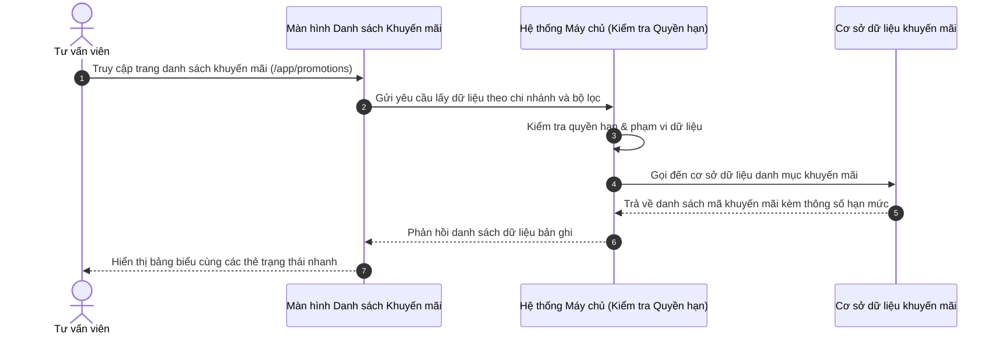

# US-COM-01-04: Quản lý Danh sách Mã Khuyến mãi & Suất Ưu đãi

> **Tham chiếu:** BF-COM-01 · SR-SALE-002 · Giao diện Mẫu §4.2 (Danh sách)  
> **Đường dẫn màn hình & Trạng thái liên quan:**  
> - `/app/promotions` -> Trạng thái: `[Tất cả, Đang áp dụng, Mã chung, Mã riêng, Tạm dừng / Hết hạn]`

---

## 1. NHẬT KÝ THAY ĐỔI & BỐI CẢNH (CHANGELOG & CONTEXT)

### Lịch sử cập nhật tài liệu (Changelog)

| Ngày cập nhật | Nội dung cập nhật | Lý do cập nhật |
|---|---|---|
| 26/08/2026 | Khởi tạo tài liệu đặc tả màn hình Quản lý Khuyến mãi theo chuẩn thiết kế trực quan mới | Chuẩn hóa danh mục 16 mã khuyến mãi, phân tách rõ Mã chung và Mã riêng |

### Bối cảnh & Vấn đề nghiệp vụ (Context & Problem)
* **Bối cảnh:** Thuộc phân hệ Sản phẩm & Thương mại (`CAP-COM` / `BF-COM-01`), màn hình này cung cấp danh mục tập trung tất cả các chính sách chiết khấu, mã giảm giá, voucher và suất ưu đãi áp dụng cho việc bán khóa học và gói combo tại trung tâm.
* **Vấn đề hiện tại:** Trước đây dữ liệu mã khuyến mãi chỉ hiển thị ở dạng bảng thô sơ cũ, thiếu thông tin trực quan về tiến độ sử dụng, điều kiện giá trị đơn hàng tối thiểu và chi nhánh áp dụng, khiến nhân viên tư vấn dễ áp dụng sai mã hoặc nhầm lẫn giữa mã dùng chung và mã riêng cho từng đối tượng.
* **Mục tiêu & Giá trị mang lại:** Tái cấu trúc giao diện theo chuẩn trực quan mới, phân định rõ ràng giữa **Mã chung** (áp dụng cho toàn bộ khách hàng theo số lượt dùng tối đa) và **Mã riêng** (phát hành theo số lượng voucher cụ thể cho cán bộ nhân viên hoặc trường hợp đặc biệt), đồng thời hiển thị chi tiết điều kiện áp dụng và phạm vi cơ sở.

### Hiểu người dùng & Tình huống sử dụng (User Needs & Use Cases)
* **Người dùng chính (Persona):** Tư vấn viên tuyển sinh (Sales), Quản lý chi nhánh (Branch Manager), Nhân viên Marketing.
* **Nhu cầu thực tế (Needs):** Tra cứu nhanh chóng mã giảm giá hợp lệ, kiểm tra hạn mức còn lại, sao chép mã đưa vào đơn hàng và kiểm tra điều kiện áp dụng chi tiết.
* **Câu phát biểu nghiệp vụ:** **Là một** Tư vấn viên, **tôi muốn** xem danh sách mã khuyến mãi được phân loại rõ ràng theo Mã chung / Mã riêng kèm số lượng và hạn dùng, **để** kịp thời tư vấn mức chiết khấu phù hợp và gia tăng tỷ lệ chốt đơn cho phụ huynh.

### Phạm vi kiểm soát (Scope)
* **Phạm vi hiển thị:** Toàn bộ danh mục mã giảm giá, voucher ưu đãi học phí và chính sách chiết khấu hiện hành trong hệ thống.
* **Ràng buộc nghiệp vụ toàn cục (Global Rules):**
  - **[RULE-PROM-01] Phân loại rõ ràng Mã chung và Mã riêng:** Mã chung có số lượt dùng tổng thể (ví dụ 1.000 lượt, 9.999 lượt); Mã riêng được phát hành theo số lượng phôi mã hữu hạn (ví dụ 1 mã, 2 mã, 499 mã).
  - **[RULE-PROM-02] Đếm thẻ trạng thái linh hoạt:** Số đếm trên các thẻ trạng thái (Tất cả, Đang áp dụng, Mã chung, Mã riêng, Tạm dừng / Hết hạn) phải tự động cập nhật theo từ khóa tìm kiếm và bộ lọc đang chọn.
  - **[RULE-PROM-03] Số lượng bản ghi mặc định:** Mặc định hiển thị 20 bản ghi/trang, cho phép lựa chọn 20, 50, 100 bản ghi.

---

## 2. LUỒNG XỬ LÝ CHÍNH (MAIN FLOW - HAPPY PATH)

---

## 3. GIAO DIỆN & TRẠNG THÁI TĨNH (DATA & UI STATE)

### 3.1. Thiết kế trực quan
* **Vị trí màn hình:** Thuộc phân hệ Sản phẩm & Chương trình — Quản lý Khuyến mãi.

### 3.2. Cấu trúc các vùng giao diện

#### A. Thanh công cụ & Bộ lọc nhanh
| Thành phần | Loại hiển thị | Giá trị mặc định | Logic xử lý / Điều kiện hiển thị | Mobile Responsive |
|---|---|---|---|---|
| Ô tìm kiếm nhanh | Ô nhập chữ | Trống | Tìm kiếm tức thì theo Mã khuyến mãi, Tên chương trình, Mô tả | Đầy đủ |
| Nút Bộ lọc nâng cao | Nút biểu tượng | 0 bộ lọc | Mở bảng trượt lọc theo Chi nhánh, Loại mã, Hình thức giảm | Giữ nguyên |
| Nút Tạo mã khuyến mãi | Nút màu nhấn | - | Mở hộp thoại tạo mới mã khuyến mãi hoặc voucher | Chuyển thành nút cộng |

#### B. Khối lọc nhanh theo trạng thái (Status Tiles)
| Thẻ Trạng thái | Nhóm màu hiển thị | Điều kiện lọc | Diễn giải | Mobile Responsive |
|---|---|---|---|---|
| Tất cả | Mặc định | Bỏ lọc trạng thái | Toàn bộ danh mục khuyến mãi | Cuộn ngang |
| Đang áp dụng | Màu xanh lá | Trạng thái = "Đang áp dụng" | Các mã ưu đãi còn hiệu lực | Cuộn ngang |
| Mã chung | Màu xanh dương | Loại mã = "Mã chung" | Mã giảm giá dùng chung toàn hệ thống | Cuộn ngang |
| Mã riêng | Màu tím | Loại mã = "Mã riêng" | Mã voucher phát hành giới hạn cá nhân | Cuộn ngang |
| Tạm dừng / Hết hạn | Màu xám | Trạng thái = "Tạm dừng" hoặc "Hết hạn" | Các mã đã dừng hoặc quá hạn áp dụng | Cuộn ngang |

#### C. Bảng dữ liệu danh sách chính
| Cột thông tin | Kiểu hiển thị | Nguồn dữ liệu | Quy tắc thị giác & Trạng thái | Mobile Responsive |
|---|---|---|---|---|
| **Mã & Tên khuyến mãi** | Chữ đậm + Mã mono + Nút chép | Thực thể Khuyến mãi | Mã in đậm font đơn cách kèm nút sao chép nhanh, Tên và Mô tả mờ bên dưới | Giữ nguyên |
| **Phân loại** | Nhãn màu | Trường Loại mã | Mã chung hiển thị nhãn xanh dương, Mã riêng hiển thị nhãn tím | Giữ nguyên |
| **Mức chiết khấu** | Chữ đậm nổi bật | Trường Giá trị giảm | Hiển thị số tiền giảm trực tiếp hoặc tỷ lệ phần trăm giảm giá | Giữ nguyên |
| **Hạn mức / Đã dùng** | Chữ kèm thanh tiến độ | Trường Lượt dùng / Số lượng | Hiển thị số lượng phát hành hoặc tổng lượt dùng tối đa kèm số đã dùng | Thu gọn |
| **Phạm vi & Cơ sở** | Chữ vừa | Trường Chi nhánh | Toàn hệ thống hoặc tên chi nhánh cụ thể | Thu gọn |
| **Thời hạn** | Chữ vừa | Trường Hạn dùng | Từ ngày bắt đầu đến ngày kết thúc hoặc nhãn Không giới hạn | Thu gọn |
| **Trạng thái** | Nhãn màu chuẩn | Trường Trạng thái | Màu chuẩn thiết kế theo trạng thái Đang áp dụng, Tạm dừng, Hết hạn | Thu gọn dạng chấm |
| **Hành động** | Nút biểu tượng | Hệ thống | Biểu tượng mắt xem chi tiết nhanh và biểu tượng sao chép mã | Luôn hiện |

### 3.3. Các trạng thái giao diện mặc định
1. **Trạng thái đang tải (Loading state):** Hiển thị hiệu ứng bộ khung chờ tải dữ liệu (Skeleton).
2. **Trạng thái chưa có dữ liệu (Empty state):** Hiển thị minh họa trống kèm thông điệp "Không tìm thấy mã khuyến mãi nào".
3. **Trạng thái lỗi tải dữ liệu (Error state):** Hiển thị thông báo lỗi kết nối máy chủ và nút tải lại dữ liệu.

---

## 4. KHỐI CHỨC NĂNG CHI TIẾT: ACTION & LUỒNG KÍCH HOẠT (ACTIONS & EVENTS)

### Khối chức năng 1: Lọc và Tìm kiếm nhanh

#### Action 1.1: Nhập từ khóa tìm kiếm
* **Luồng kích hoạt:** Khi người dùng nhập ký tự vào ô tìm kiếm nhanh, hệ thống tự động lọc danh sách mã theo từ khóa sau 300ms.
* **Tiêu chí nghiệm thu (Acceptance Criteria):**
  - **AC-1 (Happy Path - Tìm theo mã):**
    - **Giả sử:** Danh sách có mã khuyến mãi `CB0500K12TH`.
    - **Khi:** Người dùng nhập "CB0500" vào ô tìm kiếm.
    - **Thì:** Bảng chỉ hiển thị dòng bản ghi của mã `CB0500K12TH`.
  - **AC-2 (Happy Path - Tìm theo tên chương trình):**
    - **Giả sử:** Danh sách có chương trình "Ngày vàng Tháng 8".
    - **Khi:** Người dùng nhập "Ngày vàng" vào ô tìm kiếm.
    - **Thì:** Bảng tự động lọc ra các mã thuộc chiến dịch Ngày vàng Tháng 8.
  - **AC-3 (Alternate Path - Không tìm thấy kết quả):**
    - **Giả sử:** Danh sách mã đang hiển thị.
    - **Khi:** Người dùng nhập từ khóa "VOUCHER999" không tồn tại.
    - **Thì:** Giao diện hiển thị trạng thái bảng trống (Empty State).

#### Action 1.2: Chọn Thẻ Trạng thái nhanh
* **Luồng kích hoạt:** Khi người dùng nhấp chọn vào thẻ trạng thái (ví dụ "Mã chung" hoặc "Mã riêng"), bảng dữ liệu lập tức lọc theo điều kiện tương ứng.
* **Tiêu chí nghiệm thu:**
  - **AC-1 (Happy Path - Lọc Mã chung):**
    - **Giả sử:** Danh sách tổng hợp đang hiển thị cả Mã chung và Mã riêng.
    - **Khi:** Người dùng nhấp chọn thẻ "Mã chung".
    - **Thì:** Bảng chỉ hiển thị các dòng mã dùng chung toàn hệ thống.

---

### Khối chức năng 2: Thao tác trên Dòng dữ liệu

#### Action 2.1: Nhấp nút Sao chép mã
* **Luồng kích hoạt:** Người dùng nhấp vào biểu tượng sao chép bên cạnh mã khuyến mãi.
* **Tiêu chí nghiệm thu:**
  - **AC-1 (Happy Path - Sao chép thành công):**
    - **Giả sử:** Dòng mã `CSCBNVLINHDAMTA` đang hiển thị trên bảng.
    - **Khi:** Người dùng nhấp vào biểu tượng sao chép.
    - **Thì:** Mã được lưu vào bộ nhớ tạm và hệ thống hiển thị thông báo thành công "Đã sao chép mã CSCBNVLINHDAMTA".

#### Action 2.2: Xem Hộp thoại Chi tiết Khuyến mãi
* **Luồng kích hoạt:** Người dùng nhấp vào nút biểu tượng mắt hoặc nhấp đúp vào dòng bản ghi.
* **Tiêu chí nghiệm thu:**
  - **AC-1 (Happy Path - Mở xem chi tiết):**
    - **Giả sử:** Người dùng đang ở màn hình danh sách khuyến mãi.
    - **Khi:** Người dùng nhấp vào biểu tượng mắt trên dòng mã `STATIONTRAGOP36THANG`.
    - **Thì:** Hệ thống mở hộp thoại hiển thị toàn bộ thông số chi tiết: Mức chiết khấu, Điều kiện áp dụng, Hạn mức sử dụng, và Danh sách khóa học áp dụng.

---

## 5. CÁC TRƯỜNG HỢP GÓC CẠNH (CORNER CASES)

- **[CASE-01] Mã khuyến mãi đạt tối đa hạn mức sử dụng:**
  - *Tình huống:* Một mã chung có số lượt dùng là 1.000 lượt và số lượng đã dùng đạt đúng 1.000 lượt.
  - *Cách xử lý:* Hệ thống tự động chuyển trạng thái hiển thị sang nhãn "Hết lượt dùng" (màu xám) và cảnh báo khi nhân viên cố gắng gắn vào đơn hàng.
- **[CASE-02] Mã khuyến mãi hết thời hạn áp dụng:**
  - *Tình huống:* Mã ưu đãi có ngày kết thúc là hôm qua và hôm nay người dùng truy cập.
  - *Cách xử lý:* Hệ thống tự động cập nhật trạng thái hiển thị sang "Hết hạn" và hỗ trợ lọc riêng trong nhóm Hết hạn.
- **[CASE-03] Tìm kiếm kết hợp với bộ lọc nâng cao không có kết quả:**
  - *Tình huống:* Người dùng đang chọn lọc Chi nhánh Linh Đàm nhưng lại gõ tìm kiếm mã của cơ sở Smart City.
  - *Cách xử lý:* Hệ thống hiển thị giao diện bảng trống kèm nút "Xóa tất cả bộ lọc" để người dùng dễ dàng khôi phục.
- **[CASE-04] Người dùng sao chép mã trên thiết bị không hỗ trợ bộ nhớ tạm:**
  - *Tình huống:* Trình duyệt của người dùng bị chặn quyền truy cập bộ nhớ tạm.
  - *Cách xử lý:* Hệ thống hiển thị ô bôi đen mã tự động để người dùng thực hiện phím tắt sao chép thủ công kèm thông báo hướng dẫn.
- **[CASE-05] Mất kết nối mạng khi đang tải danh mục khuyến mãi:**
  - *Tình huống:* Người dùng chuyển trang hoặc thay đổi bộ lọc khi đường truyền internet bị ngắt.
  - *Cách xử lý:* Hiển thị khung cảnh báo lỗi kết nối kèm nút bấm "Thử lại" mà không làm mất bộ lọc và từ khóa đang tìm kiếm.
