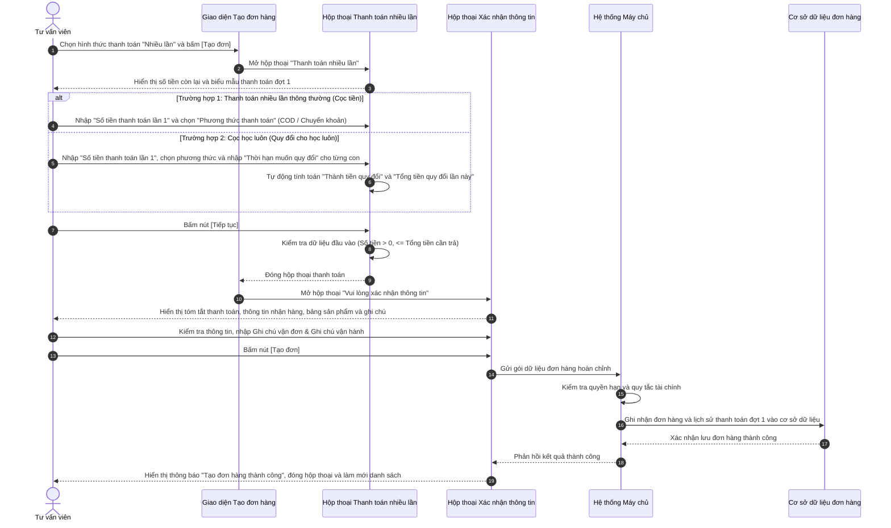

# US-COM-02-02: Các hộp thoại Thanh toán và Xác nhận đơn hàng

> **Tham chiếu:** `BF-COM-02` · `SR-SALE-002` · Giao diện Mẫu §4.4 (Biểu mẫu / Hộp thoại)  
> **Đường dẫn màn hình & Trạng thái liên quan:**  
> - `/app/crm_my_leads` hoặc `/app/orders` (Kích hoạt từ Biểu mẫu Lên đơn hàng) -> Trạng thái phát sinh: `Đang xử lý` / `Đơn nháp (Chờ thu phí)` / `Đã cọc`  
> - **Phiên bản hệ thống:** `v2026.08.27.01.prod`

---

## 1. NHẬT KÝ THAY ĐỔI & BỐI CẢNH (CHANGELOG & CONTEXT)

### Lịch sử cập nhật tài liệu (Changelog)

| Ngày cập nhật | Nội dung cập nhật | Lý do cập nhật |
|---|---|---|
| 27/08/2026 | Khởi tạo tài liệu đặc tả bộ 2 hộp thoại nghiệp vụ khi tạo đơn hàng: Hộp thoại "Thanh toán nhiều lần" (bao gồm cơ chế Cọc học luôn / Quy đổi buổi học) và Hộp thoại "Xác nhận thông tin đơn hàng" | Chuẩn hóa quy trình chốt đơn linh hoạt, hỗ trợ thu tiền từng phần và mở sớm buổi học cho học viên theo giao diện thực tế |

### Bối cảnh & Vấn đề nghiệp vụ (Context & Problem)
* **Bối cảnh:** Thuộc năng lực Quản lý Đơn hàng & Thương mại (`CAP-COM`), chức năng này cung cấp các hộp thoại xử lý thanh toán từng đợt và xác nhận chi tiết đơn hàng trước khi ghi nhận chính thức vào hệ thống.
* **Vấn đề hiện tại:** Khi tư vấn bán các gói học phí giá trị cao, phụ huynh thường không thanh toán 100% ngay từ đầu mà chọn phương án đặt cọc một phần hoặc thanh toán nhiều đợt. Ngoài ra, phụ huynh có nhu cầu cho con được vào học ngay trong thời gian chờ thanh toán nốt phần tiền còn lại ("Cọc học luôn"). Nếu thiếu các hộp thoại kiểm soát số tiền thanh toán đợt 1, phương thức thu tiền và bảng quy đổi buổi học tương ứng với số tiền cọc, tư vấn viên sẽ gặp khó khăn trong việc chốt đơn và dễ phát sinh sai sót về số buổi được kích hoạt tạm thời.
* **Mục tiêu & Giá trị mang lại:** Xây dựng quy trình xác nhận tạo đơn hàng 2 bước trực quan thông qua 2 hộp thoại liên kết:
  1. **Hộp thoại "Thanh toán nhiều lần":** Thu thập số tiền thanh toán đợt đầu, lựa chọn phương thức thanh toán (`COD` hoặc `Chuyển khoản`) và hỗ trợ bảng quy đổi hạn học/buổi học thử tương ứng nếu áp dụng hình thức "Cọc học luôn".
  2. **Hộp thoại "Vui lòng xác nhận thông tin":** Hiển thị toàn bộ thông tin thanh toán, địa chỉ nhận hàng, bảng chi tiết sản phẩm theo từng con, tổng tiền, sản phẩm quà tặng khuyến mại và các ghi chú gửi bộ phận vận đơn / bộ phận vận hành trước khi lưu chính thức.

### Hiểu người dùng & Tình huống sử dụng (User Needs & Use Cases)
* **Người dùng chính (Persona):** Tư vấn viên tuyển sinh (Sales), Nhân viên chăm sóc khách hàng (CSM), Quản lý chi nhánh (Branch Manager).
* **Nhu cầu thực tế (Needs):**
  - Cần chia nhỏ đợt thanh toán khi phụ huynh chưa sẵn sàng trả 100% tiền đơn hàng.
  - Cần nhập và kiểm tra ngay số buổi học được quy đổi tạm ứng cho con học ngay sau khi phụ huynh cọc tiền.
  - Cần xem lại đầy đủ thông tin giao nhận và ghi chú vận hành trước khi tạo đơn để tránh sai lệch thông tin gửi giáo trình hay quà tặng.
* **Câu phát biểu nghiệp vụ:** **Là một** Tư vấn viên tuyển sinh, **tôi muốn** nhập số tiền thanh toán đợt 1, thiết lập số buổi quy đổi cho con học luôn và xác nhận lại đầy đủ thông tin đơn hàng trên hộp thoại, **để** hệ thống khởi tạo đơn hàng chính xác và mở khóa số buổi học tương ứng cho học viên.

### Phạm vi kiểm soát (Scope)
* **Phạm vi đầu vào:** Toàn bộ các trường dữ liệu và thao tác trên 2 hộp thoại liên tiếp khi bấm `Tạo đơn` với hình thức thanh toán nhiều lần.
* **Ràng buộc nghiệp vụ toàn cục (Global Rules):**
  - **[RULE-ORD-01] Ràng buộc số tiền thanh toán lần 1:** Số tiền thanh toán lần 1 bắt buộc phải lớn hơn `0` và không được vượt quá "Tổng số tiền cần thanh toán" của đơn hàng.
  - **[RULE-ORD-02] Cơ chế mở khóa hạn học tự động:** Hệ thống thông báo rõ: *"Hoàn tất thanh toán đơn hàng sẽ tự động mở khóa toàn bộ hạn học, bao gồm hạn học gốc và cả ưu đãi, khuyến mại"*. Khi chỉ mới thanh toán đợt 1 hoặc cọc tiền, học viên chỉ được mở số buổi đã quy đổi hoặc tạm khóa cho đến khi thu đủ 100%.
  - **[RULE-ORD-03] Kiểm tra gói tương ứng để quy đổi (Cọc học luôn):** Khi kích hoạt cơ chế quy đổi buổi học, nếu sản phẩm trong đơn hàng không có gói học 1 buổi định danh tương ứng trong danh mục cấu hình, hệ thống cảnh báo chữ đỏ: *"Không có gói 1 buổi tương ứng để quy đổi."* và không cho phép quy đổi vượt hạn mức gói.
  - **[RULE-ORD-04] Đồng bộ thông tin giao nhận:** Hộp thoại xác nhận tự động điền sẵn thông tin người nhận, số điện thoại, địa chỉ chi tiết từ hồ sơ phụ huynh/học viên, cho phép tư vấn viên chỉnh sửa nhanh trước khi chốt đơn.

---

## 2. LUỒNG XỬ LÝ CHÍNH (MAIN FLOW - HAPPY PATH)



---

## 3. GIAO DIỆN & CẤU TRÚC BIỂU MẪU (DATA & UI STATE)

### 3.1. Hộp thoại 1: "THANH TOÁN NHIỀU LẦN"

#### A. Cấu trúc các trường thông tin & Ràng buộc kiểm tra (Validation Rules)

| Tên trường thông tin | Kiểu hiển thị | Bắt buộc | Nguồn dữ liệu | Định dạng & Giới hạn | Diễn giải quy tắc kiểm duyệt dữ liệu |
|---|---|:---:|---|---|---|
| **Số tiền còn lại cần thanh toán** | Nhãn văn bản số tiền | **Có (*)** | Hệ thống tự tính | Số tiền kèm đơn vị `(đ)`, định dạng phân cách hàng nghìn | Hiển thị tổng giá trị cần thanh toán của đơn hàng sau khi trừ giảm giá |
| **Thông điệp hướng dẫn mở khóa** | Khung thông báo màu xanh | Không | Nội dung cố định | Văn bản | *"Hoàn tất thanh toán đơn hàng sẽ tự động mở khóa toàn bộ hạn học, bao gồm hạn học gốc và cả ưu đãi, khuyến mại"* |
| **Số tiền thanh toán lần 1\*** | Ô nhập số | **Có (*)** | Người dùng nhập | Chữ số, lớn hơn `0` và nhỏ hơn hoặc bằng tổng tiền | Bắt buộc nhập. Hiển thị cảnh báo chữ đỏ *"Nhập số tiền thanh toán lần 1 là bắt buộc"* nếu bỏ trống |
| **Phương thức thanh toán** | Ô chọn thả xuống | **Có (*)** | Danh mục hệ thống | Gồm 2 giá trị: `COD`, `BANK` | Phương thức thu tiền đợt 1 (Thu tiền tận nơi hoặc Chuyển khoản ngân hàng) |
| **Gói học thử (Bảng quy đổi)** | Cột bảng danh sách | Không | Dữ liệu sản phẩm trong đơn | Tên gói sản phẩm | Hiển thị tên gói học của con. Kèm cảnh báo đỏ *"Không có gói 1 buổi tương ứng để quy đổi."* nếu không cấu hình gói lẻ |
| **Tên con (Bảng quy đổi)** | Cột bảng danh sách | Không | Hồ sơ con đã chọn | Văn bản tên con | Tên tài khoản con được hưởng gói học |
| **Thời hạn (Bảng quy đổi)** | Cột bảng danh sách | Không | Gói sản phẩm | Số buổi / Số tháng kèm đơn vị | Thời hạn tổng của gói học (ví dụ: `120 (Buổi)`) |
| **Thời hạn đã quy đổi** | Cột bảng danh sách | Không | Dữ liệu lịch sử | Số buổi kèm đơn vị | Mặc định là `0 (Buổi)` đối với đơn mua mới |
| **Nhập thời hạn muốn quy đổi** | Ô nhập số trong bảng | Không | Người dùng nhập | Số nguyên dương, $\le$ Tổng thời hạn gói | Số lượng buổi học muốn kích hoạt mở trước cho học viên học ngay |
| **Thành tiền (Bảng quy đổi)** | Cột bảng danh sách | Không | Hệ thống tự tính | Số tiền kèm đơn vị `(đ)` | Giá trị tiền tương ứng với số buổi quy đổi |
| **Tổng tiền quy đổi lần này** | Dòng tổng kết dưới bảng | Không | Hệ thống tự tính | Số tiền định dạng `(đ)` | Tổng giá trị tiền của toàn bộ các buổi học quy đổi đợt này |

#### B. Nút hành động trên Hộp thoại 1
| Tên nút | Kiểu hiển thị | Logic xử lý nghiệp vụ | Mã Quyền Yêu Cầu (Required Capability) |
|---|---|---|---|
| **Hủy** | Nút màu đỏ / viền đỏ | Đóng hộp thoại thanh toán, quay trở lại biểu mẫu tạo đơn hàng, không lưu thông tin thanh toán đợt 1 | `commerce.order.create` |
| **Tiếp tục** | Nút màu xanh lá | Kiểm tra tính hợp lệ của Số tiền thanh toán lần 1 $\rightarrow$ Lưu tạm thông tin đợt 1 $\rightarrow$ Đóng hộp thoại 1 $\rightarrow$ Mở Hộp thoại 2 Xác nhận thông tin | `commerce.order.create` |

---

### 3.2. Hộp thoại 2: "VUI LÒNG XÁC NHẬN THÔNG TIN (CHÚ Ý THỜI HẠN, SẢN PHẨM, GIÁ TIỀN, ...)"

#### A. Cấu trúc các trường thông tin & Ràng buộc kiểm tra (Validation Rules)

| Tên trường thông tin | Kiểu hiển thị | Bắt buộc | Nguồn dữ liệu | Định dạng & Giới hạn | Diễn giải quy tắc kiểm duyệt dữ liệu |
|---|---|:---:|---|---|---|
| **Hình thức thanh toán** | Nhãn văn bản | Không | Dữ liệu từ bước trước | Giá trị: `NHIỀU LẦN` hoặc `MỘT LẦN` | Hiển thị hình thức thanh toán đã lựa chọn |
| **Tổng số tiền cần thanh toán** | Nhãn văn bản số tiền | Không | Hệ thống tự tính | Số tiền kèm đơn vị `(đ)` | Tổng giá trị đơn hàng thực tế cần thanh toán |
| **Phương thức thanh toán** | Nhãn văn bản | Không | Dữ liệu từ bước trước | Giá trị: `COD` hoặc `BANK` | Phương thức thực hiện thanh toán đợt này |
| **Số tiền thanh toán lần này** | Nhãn số tiền màu xanh lá | Không | Dữ liệu từ bước trước | Số tiền kèm đơn vị `(đ)` | Số tiền thực thu đợt này (đã nhập từ Hộp thoại 1) |
| **Tên người nhận** | Ô nhập chữ | **Có (*)** | Người dùng nhập / Tự điền | Chữ và số, tối đa 100 ký tự | Họ tên hoặc số điện thoại định danh người nhận hàng |
| **Mã vùng điện thoại** | Ô chọn thả xuống | **Có (*)** | Danh mục quốc gia | Mặc định: `Việt Nam (+84)` | Mã quốc gia cho số điện thoại nhận hàng |
| **Số điện thoại nhận hàng** | Ô nhập số | **Có (*)** | Người dùng nhập / Tự điền | 10-11 chữ số | Số điện thoại liên hệ trực tiếp khi giao hàng |
| **Tỉnh / T.P** | Ô chọn thả xuống | **Có (*)** | Danh mục địa giới | Tên Tỉnh / Thành phố | Tỉnh/Thành tiếp nhận đơn hàng |
| **Quận / Huyện** | Ô chọn thả xuống | **Có (*)** | Danh mục địa giới theo Tỉnh | Tên Quận / Huyện | Quận/Huyện tiếp nhận đơn hàng |
| **Phường / Xã** | Ô chọn thả xuống | **Có (*)** | Danh mục địa giới theo Huyện | Tên Phường / Xã | Phường/Xã tiếp nhận đơn hàng |
| **Địa chỉ chi tiết** | Ô nhập chữ | **Có (*)** | Người dùng nhập / Tự điền | Tối đa 255 ký tự | Số nhà, ngõ, tên đường cụ thể |
| **Bảng danh sách sản phẩm** | Bảng 8 cột chi tiết | Không | Dữ liệu từ đơn hàng | Số thứ tự, Tên sản phẩm, Số gói, Đơn giá, Khuyến mãi, Thành tiền, Tài khoản con, Thời hạn | Hiển thị danh mục toàn bộ sản phẩm và gói học đã thêm vào đơn |
| **Tổng tiền sản phẩm** | Nhãn số tiền | Không | Hệ thống tự tính | Số tiền `(đ)` | Tổng nguyên giá của toàn bộ sản phẩm trong đơn |
| **Tổng tiền được giảm** | Nhãn số tiền | Không | Hệ thống tự tính | Số tiền `(đ)` | Tổng tiền giảm trừ từ mã khuyến mại hoặc chiết khấu |
| **Tổng thành tiền** | Nhãn số tiền | Không | Hệ thống tự tính | Số tiền `(đ)` | Tổng giá trị thực thu của toàn bộ đơn hàng |
| **SẢN PHẨM KHUYẾN MẠI TẶNG KÈM** | Khung hiển thị danh sách | Không | Hệ thống tự tính | Danh sách vật phẩm hoặc thông báo | Hiển thị quà tặng kèm hoặc thông báo *"Đơn hàng không áp dụng khuyến mại tặng sản phẩm"* |
| **Note cho vận đơn** | Ô nhập văn bản nhiều dòng | Không | Người dùng nhập | Văn bản, tối đa 500 ký tự | Lời dặn gửi đối tác vận chuyển giao nhận giáo trình / quà tặng |
| **Note cho vận hành** | Ô nhập văn bản nhiều dòng | Không | Người dùng nhập | Văn bản, tối đa 500 ký tự | Lưu ý nghiệp vụ gửi bộ phận giáo vụ xếp lớp / chăm sóc học viên |

#### B. Nút hành động trên Hộp thoại 2
| Tên nút | Kiểu hiển thị | Logic xử lý nghiệp vụ | Mã Quyền Yêu Cầu (Required Capability) |
|---|---|---|---|
| **Hủy** | Nút màu đỏ / viền đỏ | Đóng hộp thoại xác nhận thông tin, giữ nguyên trạng thái đơn hàng nháp | `commerce.order.create` |
| **Tạo đơn** | Nút màu xanh lá nổi bật | Kiểm tra dữ liệu giao nhận $\rightarrow$ Ghi nhận tạo đơn hàng chính thức vào cơ sở dữ liệu $\rightarrow$ Hiển thị thông báo thành công $\rightarrow$ Đóng toàn bộ hộp thoại | `commerce.order.create` |

---

## 4. TIÊU CHÍ NGHIỆM THU (ACCEPTANCE CRITERIA - BDD GHERKIN)

```gherkin
Scenario: Chuyển tiếp thành công khi nhập hợp lệ thông tin thanh toán nhiều lần (Happy Path Trường hợp 1)
  Given Tư vấn viên đang ở biểu mẫu Tạo đơn hàng với hình thức thanh toán "Nhiều lần"
    And hộp thoại "THANH TOÁN NHIỀU LẦN" đang mở với tổng số tiền cần thanh toán là 10.000.000 (đ)
  When Tư vấn viên nhập "Số tiền thanh toán lần 1" là 2.000.000 (đ)
    And chọn phương thức thanh toán là "COD"
    And bấm nút [TIẾP TỤC]
  Then Hệ thống xác thực số tiền thanh toán đợt 1 hợp lệ
    And đóng hộp thoại thanh toán và tự động mở hộp thoại "VUI LÒNG XÁC NHẬN THÔNG TIN"
    And hiển thị chính xác "Hình thức thanh toán: NHIỀU LẦN", "Phương thức thanh toán: COD" và "Số tiền thanh toán lần này: 2.000.000 (đ)".

Scenario: Chặn tiếp tục khi để trống số tiền thanh toán lần 1 (Validation Error)
  Given Hộp thoại "THANH TOÁN NHIỀU LẦN" đang mở
  When Tư vấn viên để trống ô "Số tiền thanh toán lần 1"
    And bấm nút [TIẾP TỤC]
  Then Hệ thống cảnh báo viền đỏ tại ô nhập liệu
    And hiển thị dòng thông báo lỗi chữ đỏ "Nhập số tiền thanh toán lần 1 là bắt buộc"
    And không chuyển sang hộp thoại xác nhận.

Scenario: Quy đổi hạn học cho con học ngay khi cọc tiền (Happy Path Trường hợp 2)
  Given Hộp thoại "THANH TOÁN NHIỀU LẦN" đang mở với gói học "STATION 03" thời hạn 120 buổi cho học viên "Vuongtesst002"
  When Tư vấn viên nhập "Số tiền thanh toán lần 1" là 5.000.000 (đ)
    And nhập "Thời hạn muốn quy đổi" là 10 buổi
  Then Hệ thống tự động tính "Thành tiền quy đổi" tương ứng và cập nhật "Tổng tiền quy đổi lần này"
    And cho phép bấm nút [TIẾP TỤC] để chuyển sang hộp thoại xác nhận với thông tin số buổi tạm mở.

Scenario: Xác nhận tạo đơn hàng chính thức thành công từ Hộp thoại 2 (Happy Path Hoàn tất)
  Given Hộp thoại "VUI LÒNG XÁC NHẬN THÔNG TIN" đang hiển thị đầy đủ thông tin sản phẩm và địa chỉ nhận hàng
  When Tư vấn viên nhập ghi chú vận đơn "Giao hàng giờ hành chính"
    And nhập ghi chú vận hành "Xếp lớp thứ 7 chủ nhật"
    And bấm nút [TẠO ĐƠN]
  Then Hệ thống gửi yêu cầu lưu đơn hàng xuống cơ sở dữ liệu
    And ghi nhận giao dịch thu tiền đợt 1 tương ứng
    And hiển thị thông báo "Tạo đơn hàng thành công!"
    And đóng hộp thoại xác nhận và chuyển hướng về danh sách quản lý.
```

---

## 5. CÁC TRƯỜNG HỢP GÓC CẠNH & LUỒNG NGOẠI LỆ (CORNER CASES & EXCEPTION FLOWS)

- **[CASE-01] Gói sản phẩm không hỗ trợ quy đổi gói lẻ 1 buổi:**
  - *Tình huống:* Sản phẩm trong đơn là gói combo hoặc chương trình đặc thù chưa được định nghĩa giá trị quy đổi theo từng buổi lẻ trong danh mục hệ thống.
  - *Cách xử lý:* Hệ thống hiển thị dòng chữ cảnh báo đỏ dưới tên gói: *"Không có gói 1 buổi tương ứng để quy đổi."*, vô hiệu hóa ô nhập thời hạn quy đổi của dòng đó hoặc đặt giá trị mặc định là 0 buổi để tránh sai lệch doanh thu.
- **[CASE-02] Số tiền thanh toán lần 1 vượt quá tổng giá trị đơn hàng hoặc bằng 0:**
  - *Tình huống:* Tư vấn viên nhập số tiền thanh toán lần 1 lớn hơn tổng số tiền cần thanh toán (ví dụ nhập 15.000.000 đ trong khi đơn chỉ có 10.000.000 đ) hoặc nhập số tiền âm / bằng 0.
  - *Cách xử lý:* Hệ thống lập tức hiển thị thông báo lỗi: *"Số tiền thanh toán lần 1 phải lớn hơn 0 và không vượt quá tổng số tiền cần thanh toán"*, khóa thao tác nút [TIẾP TỤC].
- **[CASE-03] Thay đổi thông tin nhận hàng khác với địa chỉ mặc định của học viên:**
  - *Tình huống:* Phụ huynh yêu cầu giao giáo trình / tài liệu học tập đến địa chỉ cơ quan thay vì địa chỉ nhà riêng đã lưu trong hồ sơ.
  - *Cách xử lý:* Cho phép tư vấn viên chọn lại Tỉnh/Thành phố, Quận/Huyện, Phường/Xã và gõ lại Số nhà / Tên đường trực tiếp tại Hộp thoại 2. Dữ liệu này chỉ lưu vào thông tin giao nhận của đơn hàng hiện tại mà không làm thay đổi địa chỉ thường trú gốc trong hồ sơ khách hàng.
- **[CASE-04] Hủy bỏ thao tác tại Hộp thoại Xác nhận (Quay lui an toàn):**
  - *Tình huống:* Tại Hộp thoại 2, tư vấn viên phát hiện thiếu sản phẩm hoặc phụ huynh đổi ý muốn thay đổi phương thức thanh toán và bấm [HỦY].
  - *Cách xử lý:* Đóng Hộp thoại 2 và bảo lưu nguyên vẹn toàn bộ danh sách sản phẩm, tài khoản con và các thiết lập trên biểu mẫu tạo đơn hàng ban đầu, cho phép người dùng tiếp tục chỉnh sửa mà không bị mất dữ liệu đã cấu hình.
