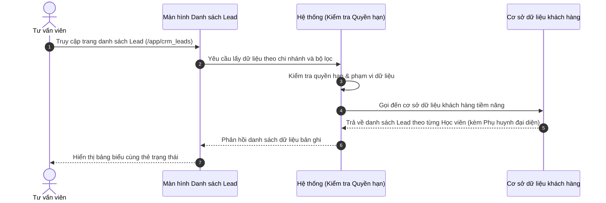

# US-CRM-01-01: Quản lý Danh sách Lead (Khách hàng tiềm năng)

> **Tham chiếu:** BF-CRM-01 · SR-SALE-001 · Giao diện Mẫu §4.2 (Danh sách)
> **Đường dẫn màn hình & Trạng thái liên quan:**
> - `/app/crm_my_leads` (Lead của tôi) -> Trạng thái tác nghiệp: `[Tất cả, ⏰ Cần gọi hôm nay, ⚠️ Quá hạn, Đang tư vấn, Lịch trải nghiệm, Chờ chốt deal, Đã chuyển đổi, Thất bại / Tạm dừng]`
> - `/app/crm_leads` (Quản lý Lead) -> Trạng thái phễu & điều phối: `[Tất cả, 👤 Chưa phân bổ, Mới tiếp nhận, Đang tư vấn, Đánh giá & Trải nghiệm, Chờ chốt deal, Đã chuyển đổi, Thất bại / Lưu kho]`

---

## 1. NHẬT KÝ THAY ĐỔI & BỐI CẢNH (CHANGELOG & CONTEXT)

### Lịch sử cập nhật tài liệu (Changelog)

| Ngày cập nhật | Nội dung cập nhật | Lý do cập nhật |
|---|---|---|
| 12/09/2026 | Bổ sung hệ thống Bộ lọc nâng cao toàn diện (13 nhóm tiêu chí) gồm 2 Trụ cột: Phân bổ & Địa bàn (Vùng/Miền, Tỉnh/TP, Quận/Huyện, Cơ sở, Sales, Team) và Làm sạch Data (Tình trạng liên hệ, SLA, Phân khúc tài chính, Khối tuổi, Mới/Quay lại). Đồng thời hỗ trợ chọn Kho dữ liệu (T, M, CC, G) linh hoạt. | Tối ưu điều phối dữ liệu và sàng lọc dữ liệu chất lượng cao cho phễu bán hàng |
| 07/09/2026 | Chuẩn hóa hệ thống Trạng thái cho 2 màn hình Lead của tôi và Quản lý Lead. Màn Lead của tôi dùng dải thẻ trạng thái hướng tác nghiệp (Cần gọi hôm nay, Quá hạn, Đang tư vấn, Trải nghiệm, Chờ chốt deal, Đã chuyển đổi, Thất bại); Màn Quản lý Lead dùng dải thẻ phễu điều phối (Chưa phân bổ, Mới tiếp nhận, Đang tư vấn, Trải nghiệm, Chờ chốt deal, Chuyển đổi, Thất bại). Loại bỏ thanh chip lọc phụ để tối ưu diện tích bảng. | Nâng cao hiệu suất tác nghiệp cho Tư vấn viên và khả năng giám sát phân bổ của Quản lý |
| 26/08/2026 | Bỏ thẻ "Thất bại" trên dải Tab lọc trạng thái chính (chỉ giữ các trạng thái đang xử lý/tiến trình), chuyển bộ lọc "Thất bại" và trạng thái đầy đủ vào Bảng lọc nâng cao (Filter Sheet) | Tối ưu không gian tác nghiệp và tập trung vào các Lead đang trong quy trình tư vấn thực tế |
| 25/08/2026 | Bỏ cột Địa chỉ & Email, đưa cột Phụ huynh lên trước Tuổi & Trình độ, bổ sung cột Lịch sử chăm sóc, chuẩn hóa cột Người phụ trách (ngày bắt đầu + số ngày) và hiển thị cột Đơn hàng ở cuối cùng | Tối ưu bảng dữ liệu theo dõi tác nghiệp chăm sóc và nâng cao trải nghiệm người dùng |
| 13/08/2026 | Gom các trạng thái phụ về Trạng thái vòng đời Lead chuẩn: Thêm "Đánh giá & Trải nghiệm", chuẩn hóa "Tiềm năng" | Chuẩn hóa bộ trạng thái chính theo đúng bản chất pipeline tuyển sinh |
| 12/08/2026 | Cập nhật tài liệu đặc tả danh sách Lead theo chuẩn 1 Lead = 1 Học viên tiềm năng | Chuẩn hóa mô hình dữ liệu: Lead theo từng học viên, Phụ huynh làm người đại diện liên hệ |

### Bối cảnh & Vấn đề nghiệp vụ (Context & Problem)
* **Bối cảnh:** Thuộc phân hệ Quản lý Tuyển sinh & Thương mại (`CAP-ADM` / `BF-CRM-01`), màn hình này cung cấp danh bạ khách hàng tiềm năng tập trung cho đội ngũ Tư vấn viên (Sales) và Quản lý chi nhánh.
* **Vấn đề hiện tại:** Mỗi học viên có độ tuổi, trình độ và môn học quan tâm riêng biệt. Nếu gộp chung các con vào 1 bản ghi của Phụ huynh, Tư vấn viên không thể theo dõi chính xác tiến trình chăm sóc và tỷ lệ chuyển đổi cho từng học viên.
* **Mục tiêu & Giá trị mang lại:** Chuẩn hóa **1 Lead = 1 Học viên tiềm năng**. Phụ huynh/Gia đình đóng vai trò người đại diện liên hệ và bảo trợ tài chính. Một phụ huynh có 3 con sẽ tạo 3 bản ghi Lead độc lập (dùng chung thông tin liên hệ phụ huynh), giúp quản lý pipeline chính xác 100% theo học viên và dễ dàng tư vấn combo gia đình.

### Hiểu người dùng & Tình huống sử dụng (User Needs & Use Cases)
* **Người dùng chính (Persona):** Tư vấn viên tuyển sinh (Sales) và Quản lý chi nhánh (Branch Manager).
* **Khó khăn lớn nhất (Pain-points):** Khó theo dõi tiến trình tư vấn riêng biệt khi 1 phụ huynh gửi nhiều con học các chương trình khác nhau (ví dụ: 1 bé học Tiếng Anh Kids, 1 bé luyện thi IELTS).
* **Nhu cầu thực tế (Needs):** Muốn hiển thị rõ Tên Học viên làm chủ thể của Lead trên từng dòng bảng, kèm theo nhãn thông tin Phụ huynh đại diện (SĐT, Email, Địa chỉ) và chỉ báo các con cùng gia đình.
* **Câu phát biểu nghiệp vụ:** **Là một** Tư vấn viên tuyển sinh, **tôi muốn** xem danh sách Lead theo từng Học viên tiềm năng kèm thông tin Phụ huynh đại diện, **để** theo dõi chính xác tiến trình tư vấn từng bé và nâng cao tỷ lệ chốt đơn hàng.

### Phạm vi kiểm soát (Scope)
* **Phạm vi hiển thị:** Thực thể Khách hàng tiềm năng (Học viên làm chủ thể dòng) và thông tin Phụ huynh đại diện bảo trợ.
* **Ràng buộc nghiệp vụ toàn cục (Global Rules):**
  - **[RULE-CRM-01-01] Che số điện thoại chống copy:** Trên bảng danh sách chính, số điện thoại phụ huynh bắt buộc phải được che ẩn ở giữa dạng `091****111` để tránh nhân viên copy hàng loạt. Chỉ hiển thị số điện thoại đầy đủ ở màn hình Chi tiết khi người dùng có quyền mở xem chi tiết.
  - **[RULE-CRM-01-02] Mô hình 1 Lead = 1 Học viên:** Mỗi dòng bản ghi Lead đại diện cho duy nhất 1 Học viên tiềm năng. Phụ huynh có 3 con sẽ phát sinh 3 bản ghi Lead khác nhau (dùng chung mã Phụ huynh / SĐT đại diện).
  - **[RULE-CRM-01-03] Đếm thẻ trạng thái linh hoạt:** Thẻ trạng thái đi theo bộ lọc đang áp dụng trên màn hình để đảm bảo số liệu đếm luôn khớp với số bản ghi hiển thị.
  - **[GLOBAL-METRIC-01] Số lượng bản ghi mặc định:** Mặc định hiển thị 20 bản ghi/trang, cho phép chọn các tùy chọn 20, 50, 100.

---

## 2. LUỒNG XỬ LÝ CHÍNH (MAIN FLOW - HAPPY PATH)

---

## 3. GIAO DIỆN & TRẠNG THÁI TĨNH (DATA & UI STATE)

### 3.1. Thiết kế trực quan (Figma)
* **Vị trí thiết kế:** Thuộc nhóm CRM & Thương mại — Màn hình Danh sách Lead.

### 3.2. Cấu trúc các vùng giao diện
Màn hình danh sách tuân thủ bố cục chuẩn gồm: Thanh công cụ bộ lọc → Thẻ trạng thái nhanh (Status Tiles) → Bảng danh sách chính → Bộ phân trang ở dưới cùng.

#### A. Thanh công cụ & Bộ lọc nhanh
| Thành phần | Loại hiển thị | Giá trị mặc định | Logic xử lý / Điều kiện hiển thị | Mobile Responsive |
|------------|---------------|------------------|----------------------------------|-------------------|
| Ô chọn Kho dữ liệu | Ô chọn danh sách | Tất cả kho | Lọc theo kho dữ liệu tiếp nhận (Kho T, Kho M, Kho CC, Kho G) | Thu gọn |
| Ô chọn Chi nhánh | Ô chọn danh sách | Chi nhánh hiện tại | Lọc dữ liệu theo cơ sở phụ trách | Thu gọn |
| Bộ lọc Nguồn Lead | Ô chọn danh sách | Tất cả nguồn | Lọc theo nguồn (Facebook, Hotline, Event, Referral) | Thu gọn vào bảng nổi |
| Ô tìm kiếm nhanh | Ô nhập chữ | Trống | Tìm theo Tên Học viên, Tên Phụ huynh, SĐT, Mã Lead | Đầy đủ |
| Nút Bộ lọc nâng cao | Nút biểu tượng kèm số lượng | Ẩn bảng | Mở bảng điều khiển bộ lọc 13 nhóm tiêu chí ghim cạnh phải | Thu gọn |
| Nút Tạo mới Lead | Nút màu nhấn | - | Mở hộp thoại Khởi tạo Lead mới cho Học viên | Chuyển thành nút cộng |

#### B. Khối lọc nhanh theo trạng thái (Status Tiles)

##### B.1. Màn hình Lead của tôi (/app/crm_my_leads - Hướng tác nghiệp cho Tư vấn viên)
| Thẻ Trạng thái | Nhóm màu hiển thị | Điều kiện lọc | Diễn giải | Mobile Responsive |
|----------------|-------------------|----------------|-----------|-------------------|
| Tất cả | Mặc định | Bỏ lọc trạng thái | Toàn bộ Lead do tư vấn viên đăng nhập phụ trách | Cuộn ngang |
| Cần gọi hôm nay | Màu vàng cam | Mới chưa gọi hoặc có hẹn gọi lại hôm nay hoặc xong test | Khách hàng cần gọi điện trao đổi ngay trong ngày | Cuộn ngang |
| Quá hạn | Màu đỏ | Mới quá hạn phản hồi hoặc trễ lịch hẹn | Các khách hàng bị quá hạn cam kết xử lý | Cuộn ngang |
| Đang tư vấn | Màu vàng cam | Trạng thái = "Đang tư vấn" | Đang trong tiến trình liên hệ và tư vấn lộ trình học | Cuộn ngang |
| Lịch trải nghiệm | Màu tím | Trạng thái = "Hẹn trải nghiệm" | Học viên đã có lịch kiểm tra năng lực hoặc học thử | Cuộn ngang |
| Chờ chốt deal | Màu xanh dương | Trạng thái = "Chờ chốt deal" | Học viên đang giữ chỗ 24h, chờ chuyển khoản học phí | Cuộn ngang |
| Đã chuyển đổi | Màu xanh ngọc | Trạng thái = "Đã chuyển đổi" | Học viên đã hoàn tất thủ tục thanh toán nhập học | Cuộn ngang |
| Thất bại / Tạm dừng | Màu đỏ | Trạng thái = "Thất bại" | Khách hàng tạm dừng nhu cầu hoặc chưa phù hợp | Cuộn ngang |

##### B.2. Màn hình Quản lý Lead (/app/crm_leads - Hướng phễu & điều phối cho Quản lý)
| Thẻ Trạng thái | Nhóm màu hiển thị | Điều kiện lọc | Diễn giải | Mobile Responsive |
|----------------|-------------------|----------------|-----------|-------------------|
| Tất cả | Mặc định | Bỏ lọc trạng thái | Toàn bộ khách hàng tiềm năng trong cơ sở | Cuộn ngang |
| Chưa phân bổ | Màu vàng cam | Chưa gán người phụ trách | Khách hàng mới đổ về cần phân bổ cho tư vấn viên | Cuộn ngang |
| Mới tiếp nhận | Màu xanh dương | Trạng thái = "Mới tiếp nhận" | Khách hàng mới đã giao nhưng tư vấn viên chưa gọi | Cuộn ngang |
| Đang tư vấn | Màu vàng cam | Trạng thái = "Đang tư vấn" | Khách hàng đang được tư vấn viên chăm sóc tích cực | Cuộn ngang |
| Đánh giá & Trải nghiệm | Màu tím | Trạng thái = "Hẹn trải nghiệm" | Khách hàng trong giai đoạn làm kiểm tra hoặc học thử | Cuộn ngang |
| Chờ chốt deal | Màu xanh dương | Trạng thái = "Chờ chốt deal" | Cơ hội bán hàng đang báo giá, giữ chỗ chờ nộp phí | Cuộn ngang |
| Đã chuyển đổi | Màu xanh ngọc | Trạng thái = "Đã chuyển đổi" | Khách hàng mua khóa học thành công | Cuộn ngang |
| Thất bại / Lưu kho | Màu đỏ | Trạng thái = "Thất bại" | Khách hàng không thành công, lưu kho nuôi dưỡng lại | Cuộn ngang |

#### C. Bảng dữ liệu danh sách chính
| Cột thông tin | Kiểu hiển thị | Nguồn dữ liệu | Quy tắc thị giác & Trạng thái | Mobile Responsive |
|---------------|---------------|----------------|--------------------------------|-------------------|
| **Lead** | Chữ đậm + Chữ vừa | Thực thể Học viên & Phụ huynh | Dòng 1: Tên học viên in đậm và Nguồn; Dòng 2: Tên Phụ huynh, SĐT che dạng `091****111` kèm nút Sao chép | Giữ nguyên |
| **Khóa học & Nhóm SP** | Chữ vừa + Chữ mờ | Thực thể Chương trình | Khóa học quan tâm dòng 1, Nhóm sản phẩm dòng 2 | Thu gọn |
| **Tuổi & Trình độ** | 2 dòng chữ | Thực thể Học viên | Dòng 1: Tuổi và năm sinh; Dòng 2: Trình độ ban đầu khi tạo test | Giữ nguyên |
| **Đánh giá & Trải nghiệm** | Chữ vừa + Liên kết | Thực thể Test / Học thử | Thông tin lịch test/học thử, kết quả đánh giá và liên kết phiếu chi tiết | Thu gọn |
| **Lịch sử chăm sóc** | Chữ vừa + Hộp thoại nổi | Lịch sử tương tác Lead | Tiến trình CS (Chưa CS / Chăm sóc lần N), lịch hẹn gọi lại, nội dung và phản hồi | Thu gọn |
| **Trạng thái** | Nhãn màu | Trường trạng thái | Màu chuẩn theo từng trạng thái vòng đời | Thu gọn dạng chấm |
| **Người phụ trách** | 2 dòng chữ | Trường nhân viên | Dòng 1: Tên tư vấn viên; Dòng 2: Ngày bắt đầu phụ trách và đếm số ngày (Ví dụ: `10/08 - 15 ngày`) | Ẩn trên di động |
| **Đơn hàng** | Gói học + Mã đơn hàng | Trường Đơn hàng đăng ký | Gói học, doanh thu dự kiến, mã đơn hàng và lần thanh toán nổi bật (đặt ở cuối cùng) | Thu gọn |
| **Hành động** | Nút biểu tượng | Hệ thống | Biểu tượng mắt xem chi tiết nhanh khi rê chuột | Luôn hiện |

#### D. Bảng điều khiển bộ lọc nâng cao ghim cạnh phải (FilterGroupAsidePanel)

Bảng lọc nâng cao hỗ trợ 13 nhóm tiêu chí chuyên sâu, chia thành 2 trụ cột nghiệp vụ cốt lõi:

* **Trụ cột 1: Phân bổ & Địa bàn (Geographical & Capacity Allocation):**
  1. *Vùng / Miền:* Miền Bắc, Miền Trung, Miền Nam (nhận diện theo Tỉnh/Cơ sở).
  2. *Tỉnh / Thành phố:* Hà Nội, TP. Hồ Chí Minh, Đà Nẵng, Hải Phòng, Cần Thơ, Bình Dương, Đồng Nai, Khác.
  3. *Quận / Huyện / Địa bàn:* Hoàng Mai, Cầu Giấy, Hà Đông, Thanh Xuân, Nam Từ Liêm, Quận 1, Quận 3, Quận 7, Bình Thạnh, Thủ Đức...
  4. *Cơ sở đào tạo:* Danh sách cơ sở thuộc hệ thống (RinoEdu Linh Đàm, Nguyễn Tuân, Smart City...).
  5. *Người phụ trách:* Nhân sự phụ trách hoặc Chưa phân bổ (chỉ hiển thị ở màn Quản lý Lead).
  6. *Team kinh doanh:* Team 01 (Hà Nội), Team 02 (Hồ Chí Minh), Ban Giám đốc Sales (chỉ hiển thị ở màn Quản lý Lead).

* **Trụ cột 2: Làm sạch Data & Chất lượng (Data Hygiene & Quality Triage):**
  7. *Làm sạch Data & Liên hệ:* Chưa gọi điện, Đã kết nối, Không nghe máy/Thuê bao, Hẹn gọi lại, Số sai/Rác/Spam.
  8. *Cam kết hạn xử lý & Nhắc việc:* Trong hạn, Quá hạn cam kết, Cần gọi hôm nay.
  9. *Phân khúc Phụ huynh:* VIP cao cấp, Khá giả, Tiêu chuẩn.
  10. *Khối học viên & Độ tuổi:* Mẫu giáo / Kindy (3-5 tuổi), Tiểu học (6-10 tuổi), THCS (11-14 tuổi), THPT (15-18 tuổi).
  11. *Loại hồ sơ khách hàng:* Khách hàng mới tinh, Khách hàng quay lại (tái tiếp cận).
  12. *Nguồn tiếp nhận:* Facebook Ads, Hotline/Tổng đài, Sự kiện / Workshop, Giới thiệu (Referral), Website / Biểu mẫu.
  13. *Khóa học quan tâm:* SuperKids, Kindy, Flyers, Starters, Movers, IELTS, Toán Tư Duy.

### 3.3. Các trạng thái giao diện mặc định
1. **Trạng thái đang tải (Loading state):** Hiển thị hiệu ứng chờ tải dữ liệu giả lập (Skeleton).
2. **Trạng thái chưa có dữ liệu (Trống - Empty state):** Hiển thị hình ảnh minh họa mờ kèm thông điệp "Chưa có dữ liệu Lead học viên".
3. **Trạng thái lỗi tải dữ liệu (Error state):** Hiển thị cảnh báo kết nối hệ thống và nút tải lại trang.

### 3.4. Bảng năng lực nguyên tử & Phân quyền động (Atomic Capability Gating)

| Mã Quyền (Atomic Key) | Tên Quyền Hạn | Diễn Giải Nghiệp Vụ |
|---|---|---|
| `crm.lead.view` | Xem danh sách Lead | Quyền truy cập màn hình danh sách Lead cá nhân hoặc toàn chi nhánh |
| `crm.lead.filter` | Sử dụng bộ lọc nâng cao | Quyền tra cứu và sử dụng 13 nhóm tiêu chí phân bổ & làm sạch data |
| `crm.lead.view_masked_phone` | Xem số điện thoại che | Quyền xem danh sách với số điện thoại dạng bảo mật `091****111` |
| `crm.lead.view_full_phone` | Xem số điện thoại đầy đủ | Quyền mở hộp thoại chi tiết để xem và liên hệ số điện thoại đầy đủ |
| `crm.lead.create` | Khởi tạo Lead mới | Quyền nhập hồ sơ khách hàng tiềm năng thủ công vào hệ thống |
| `crm.lead.assign` | Phân bổ Lead | Quyền điều phối và gán người phụ trách hoặc chuyển cơ sở đào tạo |

---

## 4. KHỐI CHỨC NĂNG CHI TIẾT: ACTION & LUỒNG KÍCH HOẠT (ACTIONS & EVENTS)

### Khối chức năng 1: Lọc và Tìm kiếm nhanh

#### Action 1.1: Nhập từ khóa tìm kiếm
* **Luồng kích hoạt:** Khi người dùng nhập từ khóa vào ô tìm kiếm nhanh, hệ thống tự động lọc danh sách theo từ khóa.
* **Tiêu chí nghiệm thu (Acceptance Criteria):**
  - **AC-1 (Happy Path - Tìm thấy Học viên):**
    - **Giả sử:** Danh sách Lead đang có Học viên tên "Bé An".
    - **Khi:** Người dùng nhập "Bé An" vào ô tìm kiếm.
    - **Thì:** Bảng chỉ hiển thị dòng bản ghi Lead của Học viên "Bé An".
  - **AC-2 (Happy Path - Tìm theo tên Phụ huynh đại diện):**
    - **Giả sử:** Phụ huynh "Nguyễn Thu Hà" có 2 con là "Bé An" và "Bé Bình".
    - **Khi:** Người dùng nhập "Thu Hà" vào ô tìm kiếm.
    - **Thì:** Bảng tự động lọc hiển thị cả 2 bản ghi Lead độc lập tương ứng với "Bé An" và "Bé Bình".
  - **AC-3 (Alternate Path - Không tìm thấy):**
    - **Giả sử:** Đang hiển thị danh sách Lead.
    - **Khi:** Nhập từ khóa "XYZ999" không có trong dữ liệu.
    - **Thì:** Bảng hiển thị khung trống thông báo không tìm thấy kết quả.

### Khối chức năng 2: Bộ lọc nâng cao đa chiều (Phân bổ & Làm sạch data)

#### Action 2.1: Lọc kết hợp địa bàn và tình trạng liên hệ
* **Luồng kích hoạt:** Người dùng mở bảng lọc nâng cao ghim cạnh phải và chọn các tiêu chí phân bổ địa bàn và làm sạch dữ liệu.
* **Tiêu chí nghiệm thu (Acceptance Criteria):**
  - **AC-4 (Happy Path - Lọc làm sạch số rác và spam):**
    - **Giả sử:** Bảng danh sách đang hiển thị dữ liệu hỗn hợp gồm cả số rác/spam và số có nhu cầu thật.
    - **Khi:** Người dùng mở bảng lọc nâng cao, tại nhóm "Làm sạch Data & Liên hệ" chọn tiêu chí "Số sai / Rác / Spam".
    - **Thì:** Bảng lập tức chỉ hiển thị các hồ sơ có ghi chú số sai, số rác hoặc spam để người dùng xử lý dọn dẹp kho dữ liệu.
  - **AC-5 (Happy Path - Lọc phân bổ theo quận huyện và chi nhánh):**
    - **Giả sử:** Quản lý đang ở màn hình Quản lý Lead cần phân bổ data cho cơ sở Hà Đông.
    - **Khi:** Người dùng chọn nhóm "Quận / Huyện / Địa bàn" là "Hà Đông" và nhóm "Người phụ trách" là "Chưa phân bổ".
    - **Thì:** Bảng hiển thị chính xác các Lead chưa có nhân sự phụ trách thuộc địa bàn Hà Đông, đồng thời các thẻ trạng thái đếm lại số lượng tương ứng.
  - **AC-6 (Happy Path - Đặt lại toàn bộ bộ lọc):**
    - **Giả sử:** Đang áp dụng nhiều tiêu chí lọc nâng cao và dải thẻ trạng thái đang hiển thị số lượng tương ứng.
    - **Khi:** Người dùng nhấn nút "Đặt lại" trên bảng lọc nâng cao.
    - **Thì:** Tất cả các nhóm tiêu chí được hoàn nguyên về trạng thái ban đầu và bảng tải lại toàn bộ danh sách khách hàng tiềm năng.

---

## 5. CÁC TRƯỜNG HỢP GÓC CẠNH (CORNER CASES)

- **[CASE-01] Phụ huynh chưa cập nhật đầy đủ thông tin học viên:**
  - *Tình huống:* Lead mới tạo qua Hotline chỉ có thông tin Phụ huynh, chưa ghi nhận tên con.
  - *Cách xử lý:* Hệ thống hiển thị Tên Học viên tạm dạng "Học viên 1 (Con của [Tên Phụ huynh])" và gắn thẻ nhắc bổ sung tên con.
- **[CASE-02] Phụ huynh đăng ký thêm 1 con mới (Lead thứ 2 cùng gia đình):**
  - *Tình huống:* Phụ huynh đã có 1 con học tại trung tâm, gọi điện đăng ký thêm bé thứ 2.
  - *Cách xử lý:* Hệ thống tự động liên kết với hồ sơ Phụ huynh hiện có, kế thừa thông tin liên hệ và tạo 1 Lead mới độc lập cho bé thứ 2.
- **[CASE-03] Không đủ quyền xem số điện thoại đầy đủ:**
  - *Tình huống:* Người dùng không thuộc phân quyền tư vấn mở xem chi tiết.
  - *Cách xử lý:* Màn hình chi tiết vẫn giữ nguyên dạng che số `091****111` và ẩn nút sao chép SĐT.
- **[CASE-04] Áp dụng đồng thời nhiều bộ lọc dẫn đến không có dữ liệu phù hợp:**
  - *Tình huống:* Người dùng chọn cùng lúc nhiều tiêu chí quá hẹp (ví dụ: Miền Nam, Quận 1 nhưng lại chọn Cơ sở Linh Đàm ở Hà Nội).
  - *Cách xử lý:* Hệ thống hiển thị trạng thái bảng trống kèm thông báo gợi ý nới lỏng bộ lọc hoặc nhấn nút đặt lại bộ lọc.
- **[CASE-05] Thay đổi kho dữ liệu khi đang áp dụng bộ lọc nâng cao:**
  - *Tình huống:* Người dùng đang lọc theo Quận Cầu Giấy và chuyển đổi từ Kho T sang Kho M.
  - *Cách xử lý:* Hệ thống giữ nguyên các tiêu chí lọc nâng cao đang chọn, cập nhật lại số lượng đếm trên từng thẻ trạng thái của Kho M và tải danh sách dòng thỏa mãn đồng thời cả 2 điều kiện.

