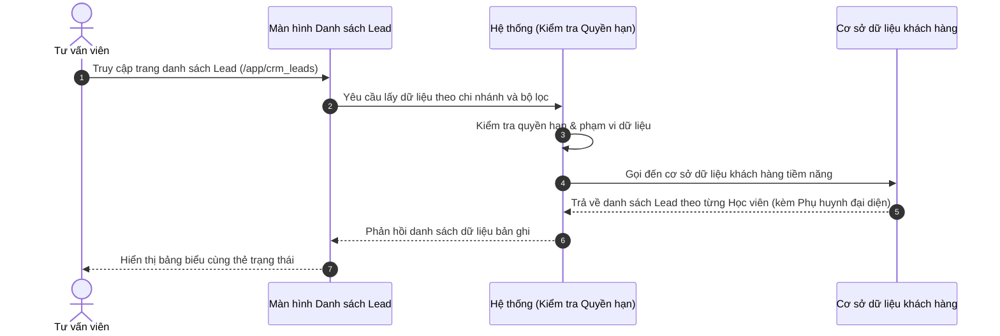

# US-CRM-01-01: Quản lý Danh sách Lead (Khách hàng tiềm năng)

> **Tham chiếu:** BF-CRM-01 · SR-SALE-001 · Giao diện Mẫu §4.2 (Danh sách)
> **Đường dẫn màn hình & Trạng thái liên quan:**
> - `/app/crm_leads` -> Trạng thái: `[Tất cả, Chưa tiếp cận, Đang chăm sóc, Đánh giá & Trải nghiệm, Tiềm năng, Chuyển đổi, Thất bại]`

---

## 1. NHẬT KÝ THAY ĐỔI & BỐI CẢNH (CHANGELOG & CONTEXT)

### Lịch sử cập nhật tài liệu (Changelog)

| Ngày cập nhật | Nội dung cập nhật | Lý do cập nhật |
|---|---|---|
| 13/08/2026 | Gom các trạng thái phụ về Trạng thái vòng đời Lead chuẩn: Thêm "Đánh giá & Trải nghiệm", chuẩn hóa "Tiềm năng" | Chuẩn hóa bộ trạng thái chính theo đúng bản chất pipeline tuyển sinh |
| 12/08/2026 | Cập nhật tài liệu đặc tả danh sách Lead theo chuẩn 1 Lead = 1 Học viên tiềm năng | Chuẩn hóa mô hình dữ liệu: Lead theo từng học viên, Phụ huynh làm người đại diện liên hệ |

### Bối cảnh & Vấn đề nghiệp vụ (Context & Problem)
* **Bối cảnh:** Thuộc phân hệ Quản lý Tuyển sinh & Thương mại (`CAP-ADM` / `BF-CRM-01`), màn hình này cung cấp danh bạ khách hàng tiềm năng tập trung cho đội ngũ Tư vấn viên (Sales) và Quản lý chi nhánh.
* **Vấn đề hiện tại:** Mỗi học viên có độ tuổi, trình độ và môn học quan tâm riêng biệt. Nếu gộp chung các con vào 1 bản ghi của Phụ huynh, Tư vấn viên không thể theo dõi chính xác tiến trình chăm sóc và tỷ lệ chuyển đổi cho từng học viên.
* **Mục tiêu & Giá trị mang lại:** Chuẩn hóa **1 Lead = 1 Học viên tiềm năng**. Phụ huynh/Gia đình đóng vai trò người đại diện liên hệ và bảo trợ tài chính. Một phụ huynh có 3 con sẽ tạo 3 bản ghi Lead độc lập (dùng chung thông tin liên hệ phụ huynh), giúp quản lý pipeline chính xác 100% theo học viên và dễ dàng tư vấn combo gia đình.

### Hiểu người dùng & Tình huống sử dụng (User Needs & Use Cases)
* **Người dùng chính (Persona):** Tư vấn viên tuyển sinh (Sales) và Quản lý chi nhánh (Branch Manager).
* **Khó khăn lớn nhất (Pain-points):** Khó theo dõi tiến trình tư vấn riêng biệt khi 1 phụ huynh gửi nhiều con học các chương trình khác nhau (ví dụ: 1 bé học Tiếng Anh Kids, 1 bé luyện thi IELTS).
* **Nhu cầu thực tế (Needs):** Muốn hiển thị rõ Tên Học viên làm chủ thể của Lead trên từng dòng bảng, kèm theo nhãn thông tin Phụ huynh đại diện (SĐT, Email, Địa chỉ) và chỉ báo các con cùng gia đình.
* **Câu phát biểu nghiệp vụ:** **Là một** Tư vấn viên tuyển sinh, **tôi muốn** xem danh sách Lead theo từng Học viên tiềm năng kèm thông tin Phụ huynh đại diện, **để** theo dõi chính xác tiến trình tư vấn từng bé và nâng cao tỷ lệ chốt đơn hàng.

### Phạm vi kiểm soát (Scope)
* **Phạm vi hiển thị:** Thực thể Khách hàng tiềm năng (Học viên làm chủ thể dòng) và thông tin Phụ huynh đại diện bảo trợ.
* **Ràng buộc nghiệp vụ toàn cục (Global Rules):**
  - **[RULE-CRM-01-01] Che số điện thoại chống copy:** Trên bảng danh sách chính, số điện thoại phụ huynh bắt buộc phải được che ẩn ở giữa dạng `091****111` để tránh nhân viên copy hàng loạt. Chỉ hiển thị số điện thoại đầy đủ ở màn hình Chi tiết khi người dùng có quyền mở xem chi tiết.
  - **[RULE-CRM-01-02] Mô hình 1 Lead = 1 Học viên:** Mỗi dòng bản ghi Lead đại diện cho duy nhất 1 Học viên tiềm năng. Phụ huynh có 3 con sẽ phát sinh 3 bản ghi Lead khác nhau (dùng chung mã Phụ huynh / SĐT đại diện).
  - **[RULE-CRM-01-03] Đếm thẻ trạng thái linh hoạt:** Thẻ trạng thái đi theo bộ lọc đang áp dụng trên màn hình để đảm bảo số liệu đếm luôn khớp với số bản ghi hiển thị.
  - **[GLOBAL-METRIC-01] Số lượng bản ghi mặc định:** Mặc định hiển thị 20 bản ghi/trang, cho phép chọn các tùy chọn 20, 50, 100.

---

## 2. LUỒNG XỬ LÝ CHÍNH (MAIN FLOW - HAPPY PATH)

---

## 3. GIAO DIỆN & TRẠNG THÁI TĨNH (DATA & UI STATE)

### 3.1. Thiết kế trực quan (Figma)
* **Vị trí thiết kế:** Thuộc nhóm CRM & Thương mại — Màn hình Danh sách Lead.

### 3.2. Cấu trúc các vùng giao diện
Màn hình danh sách tuân thủ bố cục chuẩn gồm: Thanh công cụ bộ lọc → Thẻ trạng thái nhanh (Status Tiles) → Bảng danh sách chính → Bộ phân trang ở dưới cùng.

#### A. Thanh công cụ & Bộ lọc nhanh
| Thành phần | Loại hiển thị | Giá trị mặc định | Logic xử lý / Điều kiện hiển thị | Mobile Responsive |
|------------|---------------|------------------|----------------------------------|-------------------|
| Ô chọn Chi nhánh | Ô chọn danh sách | Chi nhánh hiện tại | Lọc dữ liệu theo cơ sở phụ trách | Thu gọn |
| Bộ lọc Nguồn Lead | Ô chọn danh sách | Tất cả nguồn | Lọc theo nguồn (Facebook, Hotline, Event, Referral) | Thu gọn vào bảng nổi |
| Ô tìm kiếm nhanh | Ô nhập chữ | Trống | Tìm theo Tên Học viên, Tên Phụ huynh, SĐT, Mã Lead | Đầy đủ |
| Nút Tạo mới Lead | Nút màu nhấn | - | Mở hộp thoại Khởi tạo Lead mới cho Học viên | Chuyển thành nút cộng |

#### B. Khối lọc nhanh theo trạng thái (Status Tiles)
| Thẻ Trạng thái | Nhóm màu hiển thị | Điều kiện lọc | Diễn giải | Mobile Responsive |
|----------------|-------------------|----------------|-----------|-------------------|
| Tất cả | Mặc định | Bỏ lọc trạng thái | Tổng số Lead (Học viên) | Cuộn ngang |
| Chưa tiếp cận | Màu xanh dương | Trạng thái = "Chưa tiếp cận" | Lead học viên mới đổ về chưa gọi | Cuộn ngang |
| Đang chăm sóc | Màu vàng cam | Trạng thái = "Đang chăm sóc" | Đang tư vấn chương trình cho học viên | Cuộn ngang |
| Đánh giá & Trải nghiệm | Màu tím | Trạng thái = "Đánh giá & Trải nghiệm" | Học viên trong giai đoạn làm test đầu vào hoặc học thử | Cuộn ngang |
| Tiềm năng | Màu xanh lá | Trạng thái = "Tiềm năng" | Học viên đã chốt báo giá, giữ chỗ 24h hoặc hẹn nộp tiền | Cuộn ngang |
| Chuyển đổi | Màu xanh ngọc | Trạng thái = "Chuyển đổi" | Học viên đã mua khóa học chính thức | Cuộn ngang |
| Thất bại | Màu đỏ | Trạng thái = "Thất bại" | Học viên/Gia đình từ chối nhập học | Cuộn ngang |

#### C. Bảng dữ liệu danh sách chính
| Cột thông tin | Kiểu hiển thị | Nguồn dữ liệu | Quy tắc thị giác & Trạng thái | Mobile Responsive |
|---------------|---------------|----------------|--------------------------------|-------------------|
| **Học viên (Lead)** | Chữ đậm + Mã mờ | Thực thể Học viên | Tên Học viên + Độ tuổi đậm, Mã Lead mờ, Môn học quan tâm bên dưới | Giữ nguyên |
| **Phụ huynh đại diện** | Chữ đậm + Thẻ quan hệ | Thực thể Phụ huynh | Tên Phụ huynh đậm + Badge (Mẹ/Bố/Người bảo hộ) | Giữ nguyên |
| **Số điện thoại & Địa chỉ** | Văn bản che số | Trường SĐT & Địa chỉ | Dạng che trung tâm `091****111` kèm nút Sao chép & Địa chỉ mờ bên dưới | Giữ nguyên |
| **Nhóm Gia đình** | Nhãn danh sách con | Trường Liên kết Gia đình | Hiển thị nhãn ghi nhận các học viên cùng Phụ huynh (VD: "Có 2 anh chị em") | Thu gọn |
| **Nguồn Lead** | Văn bản thường | Trường nguồn | Tên kênh tiếp thị | Ẩn trên di động |
| **Trạng thái** | Nhãn màu | Trường trạng thái | Màu chuẩn theo từng trạng thái | Thu gọn dạng chấm |
| **Đơn hàng** | Gói học + Mã đơn nháp | Trường Đơn hàng nháp | Hiển thị Tên gói học dự kiến, mã đơn nháp và lần thanh toán | Thu gọn |
| **Người phụ trách** | Văn bản thường | Trường nhân viên | Tên chuyên viên tư vấn | Ẩn trên di động |
| **Hành động** | Nút biểu tượng | Hệ thống | Biểu tượng mắt xem chi tiết, bút sửa | Luôn hiện |

### 3.3. Các trạng thái giao diện mặc định
1. **Trạng thái đang tải (Loading state):** Hiển thị hiệu ứng chờ tải dữ liệu giả lập (Skeleton).
2. **Trạng thái chưa có dữ liệu (Trống - Empty state):** Hiển thị hình ảnh minh họa mờ kèm thông điệp "Chưa có dữ liệu Lead học viên".
3. **Trạng thái lỗi tải dữ liệu (Error state):** Hiển thị cảnh báo kết nối hệ thống và nút tải lại trang.

### 3.4. Ma trận phân quyền (Permission Matrix)

| Vai trò người dùng | Xem danh sách | Lọc & Tìm kiếm | Xem chi tiết (Số đầy đủ) | Tạo mới Lead |
|---|:---:|:---:|:---:|:---:|
| **Quản trị viên (Admin)** | ✅ | ✅ | ✅ | ✅ |
| **Quản lý chi nhánh (Manager)** | ✅ | ✅ | ✅ | ✅ |
| **Tư vấn viên (Sales)** | ✅ | ✅ | ✅ | ✅ |
| **Giáo viên (Teacher)** | ❌ | ❌ | ❌ | ❌ |

---

## 4. KHỐI CHỨC NĂNG CHI TIẾT: ACTION & LUỒNG KÍCH HOẠT (ACTIONS & EVENTS)

### Khối chức năng 1: Lọc và Tìm kiếm nhanh

#### Action 1.1: Nhập từ khóa tìm kiếm
* **Luồng kích hoạt:** Khi người dùng nhập từ khóa vào ô tìm kiếm nhanh, hệ thống tự động lọc danh sách theo từ khóa.
* **Tiêu chí nghiệm thu (Acceptance Criteria):**
  - **AC-1 (Happy Path - Tìm thấy Học viên):**
    - **Giả sử:** Danh sách Lead đang có Học viên tên "Bé An".
    - **Khi:** Người dùng nhập "Bé An" vào ô tìm kiếm.
    - **Thì:** Bảng chỉ hiển thị dòng bản ghi Lead của Học viên "Bé An".
  - **AC-2 (Happy Path - Tìm theo tên Phụ huynh đại diện):**
    - **Giả sử:** Phụ huynh "Nguyễn Thu Hà" có 2 con là "Bé An" và "Bé Bình".
    - **Khi:** Người dùng nhập "Thu Hà" vào ô tìm kiếm.
    - **Thì:** Bảng tự động lọc hiển thị cả 2 bản ghi Lead độc lập tương ứng với "Bé An" và "Bé Bình".
  - **AC-3 (Alternate Path - Không tìm thấy):**
    - **Giả sử:** Đang hiển thị danh sách Lead.
    - **Khi:** Nhập từ khóa "XYZ999" không có trong dữ liệu.
    - **Thì:** Bảng hiển thị khung trống thông báo không tìm thấy kết quả.

---

## 5. CÁC TRƯỜNG HỢP GÓC CẠNH (CORNER CASES)

- **[CASE-01] Phụ huynh chưa cập nhật đầy đủ thông tin học viên:**
  - *Tình huống:* Lead mới tạo qua Hotline chỉ có thông tin Phụ huynh, chưa ghi nhận tên con.
  - *Cách xử lý:* Hệ thống hiển thị Tên Học viên tạm dạng "Học viên 1 (Con của [Tên Phụ huynh])" và gắn thẻ nhắc bổ sung tên con.
- **[CASE-02] Phụ huynh đăng ký thêm 1 con mới (Lead thứ 2 cùng gia đình):**
  - *Tình huống:* Phụ huynh đã có 1 con học tại trung tâm, gọi điện đăng ký thêm bé thứ 2.
  - *Cách xử lý:* Hệ thống tự động liên kết với hồ sơ Phụ huynh hiện có, kế thừa thông tin liên hệ và tạo 1 Lead mới độc lập cho bé thứ 2.
- **[CASE-03] Không đủ quyền xem số điện thoại đầy đủ:**
  - *Tình huống:* Người dùng không thuộc phân quyền tư vấn mở xem chi tiết.
  - *Cách xử lý:* Màn hình chi tiết vẫn giữ nguyên dạng che số `091****111` và ẩn nút sao chép SĐT.

