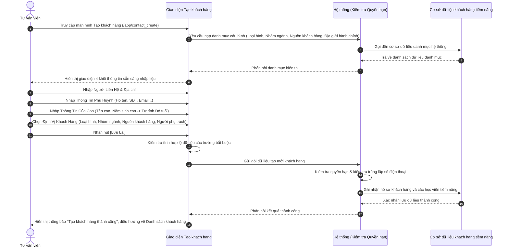

# US-CRM-01-02: Biểu mẫu Tạo khách hàng

> **Tham chiếu:** `BF-CRM-01` · `SR-SALE-001` · Giao diện Mẫu §4.4 (Biểu mẫu / Hộp thoại)  
> **Đường dẫn màn hình & Trạng thái liên quan:**  
> - `/app/contact_create` (hoặc Nút "Tạo mới" từ `/app/crm_leads`, `/app/contact_directory`) -> Trạng thái phát sinh: `Chưa tiếp cận` / `Đang chăm sóc`  
> - **Phiên bản hệ thống:** `v2026.08.07.01.prod`

---

## 1. NHẬT KÝ THAY ĐỔI & BỐI CẢNH (CHANGELOG & CONTEXT)

### Lịch sử cập nhật tài liệu (Changelog)

| Ngày cập nhật | Nội dung cập nhật | Lý do cập nhật |
|---|---|---|
| 25/08/2026 | Khởi tạo tài liệu đặc tả Biểu mẫu Tạo khách hàng theo giao diện chuẩn v2026.08.07.01.prod gồm 4 khối: Người Liên Hệ, Thông Tin Phụ Huynh, Thông Tin Của Con, Định Vị Khách Hàng | Chuẩn hóa nghiệp vụ nhập liệu đầu vào khách hàng tiềm năng cho đội ngũ tư vấn tuyển sinh và tiếp thị |

### Bối cảnh & Vấn đề nghiệp vụ (Context & Problem)
* **Bối cảnh:** Thuộc năng lực Tuyển sinh & Thương mại (`CAP-ADM`), chức năng này cung cấp biểu mẫu nhập liệu tập trung khi phát sinh khách hàng mới từ các kênh (Hotline, Đăng ký trực tiếp tại quầy cơ sở, Giới thiệu, Tiếp thị số, Sự kiện tuyển sinh).
* **Vấn đề hiện tại:** Khi tiếp nhận thông tin từ phụ huynh, tư vấn viên cần thu thập đồng thời thông tin người liên hệ đại diện, thông tin phụ huynh bảo trợ tài chính, thông tin từng con (độ tuổi, học lực, khóa học quan tâm) và thông tin định vị phân loại khách hàng để chuyển giao đúng bộ phận chăm sóc. Nếu thiếu biểu mẫu có cấu trúc phân khối rõ ràng, dữ liệu nhập sẽ bị phân mảnh hoặc thiếu sót thông tin quan trọng.
* **Mục tiêu & Giá trị mang lại:** Xây dựng màn hình **"Tạo khách hàng"** tối ưu bố cục 4 khối thông tin độc lập nhưng liên kết chặt chẽ:
  1. **Người Liên Hệ:** Ghi nhận đối tượng liên hệ ban đầu (Con, Bố, Mẹ, Khác) và địa chỉ cư trú hành chính.
  2. **Thông Tin Phụ Huynh:** Ghi nhận hồ sơ phụ huynh đại diện, hỗ trợ bổ sung nhiều phụ huynh (`Thêm phụ huynh`).
  3. **Thông Tin Của Con:** Ghi nhận học viên tiềm năng, hỗ trợ khai báo nhiều con trong cùng gia đình (`Thêm con`).
  4. **Định Vị Khách Hàng:** Phân loại loại hình, nhóm ngành, nguồn tiếp cận và phân bổ nhân sự phụ trách.

### Hiểu người dùng & Tình huống sử dụng (User Needs & Use Cases)
* **Người dùng chính (Persona):** Tư vấn viên tuyển sinh (Sales), Nhân viên tiếp thị (Marketing), Quản lý chi nhánh (Branch Manager).
* **Khó khăn lớn nhất (Pain-points):** Nhập liệu chậm, dễ sót trường bắt buộc (như năm sinh con, loại hình, nhóm ngành), hoặc không thể thêm cùng lúc nhiều con khi phụ huynh muốn tư vấn combo gia đình.
* **Nhu cầu thực tế (Needs):** Biểu mẫu trực quan, tự động tính toán độ tuổi theo năm sinh, danh mục thả xuống chuẩn hóa cho loại hình / nhóm ngành / nguồn khách hàng, và khả năng mở rộng thêm con / thêm phụ huynh chỉ bằng 1 thao tác nhấn nút.
* **Câu phát biểu nghiệp vụ:** **Là một** Tư vấn viên tuyển sinh, **tôi muốn** nhập đầy đủ thông tin người liên hệ, phụ huynh, các con và định vị phân loại khách hàng trên một biểu mẫu duy nhất, **để** hệ thống khởi tạo hồ sơ khách hàng tiềm năng chính xác và phân bổ cho nhân sự chăm sóc.

### Phạm vi kiểm soát (Scope)
* **Phạm vi đầu vào:** Toàn bộ các trường dữ liệu trên màn hình "Tạo khách hàng" thuộc 4 khối chức năng.
* **Ràng buộc nghiệp vụ toàn cục (Global Rules):**
  - **[RULE-CUST-01] Ràng buộc trường bắt buộc:** Bắt buộc nhập đầy đủ 4 trường cốt lõi có đánh dấu sao đỏ: `Tên con *`, `Năm sinh của con *`, `Loại hình *`, `Nhóm ngành *`.
  - **[RULE-CUST-02] Tính duy nhất của Số điện thoại:** Hệ thống kiểm tra cảnh báo trùng lặp nếu Số điện thoại liên hệ hoặc Số điện thoại phụ huynh đã tồn tại trong cơ sở dữ liệu và đang thuộc quyền chăm sóc của tư vấn viên khác.
  - **[RULE-CUST-03] Mô hình Gia đình Đa học viên (1 Phụ huynh - Nhiều Con):** Cho phép bấm nút `Thêm con` để mở thêm khối thông tin học viên thứ 2, thứ 3... Khi lưu, hệ thống tự động sinh các bản ghi khách hàng tiềm năng độc lập cho từng học viên và dùng chung thông tin phụ huynh / người liên hệ đại diện.
  - **[RULE-CUST-04] Tự động tính Độ tuổi của con:** Trường "Độ tuổi của con" được hệ thống tự động tính toán dựa trên "Năm sinh của con" so với năm hiện tại (Ví dụ: Năm hiện tại 2026 - Năm sinh 2018 = 8 tuổi).
  - **[RULE-CUST-05] Mặc định Đơn vị kinh doanh ban đầu:** "Số đơn hàng đã mua" và "Tổng giá trị đơn hàng đã mua" mặc định là `0`, không cho phép nhập tay khi tạo mới khách hàng tiềm năng.

---

## 2. LUỒNG XỬ LÝ CHÍNH (MAIN FLOW - HAPPY PATH)

---

## 3. GIAO DIỆN & CẤU TRÚC BIỂU MẪU (DATA & UI STATE)

### 3.1. Thiết kế trực quan (Figma & Giao diện Thực tế)
* **Vị trí thiết kế:** Nhóm màn hình CRM Tuyển sinh — Màn hình Tạo khách hàng (`v2026.08.07.01.prod`).
* **Bố cục tổng quan:** Giao diện dạng trang đầy đủ chia làm 4 thẻ khối thông tin chính được bố trí cân đối theo hàng và cột.

### 3.2. Cấu trúc các trường nhập liệu & Ràng buộc kiểm tra (Validation Rules)

#### A. Khối 1: Người Liên Hệ
| Tên trường thông tin | Kiểu hiển thị | Bắt buộc | Nguồn dữ liệu | Định dạng & Giới hạn | Diễn giải quy tắc kiểm duyệt dữ liệu |
|---|---|:---:|---|---|---|
| **Tên người liên hệ** | Ô nhập chữ | Không | Người dùng nhập | Chữ, tối đa 100 ký tự | Tên người trực tiếp gọi điện hoặc trao đổi ban đầu |
| **SĐT liên hệ** | Ô nhập chữ / số | Không | Người dùng nhập | Chữ số, 10-11 ký tự | Số điện thoại dùng để liên lạc nhanh |
| **Đối tượng liên hệ** | Nhóm nút chọn 1 | Không | Danh mục chọn 1 | 4 tùy chọn: `Con`, `Bố`, `Mẹ`, `Khác` | Mối quan hệ của người liên hệ với học sinh |
| **Tỉnh** | Ô chọn thả xuống | Không | Danh mục hành chính | Danh sách Tỉnh/Thành phố | Chọn Tỉnh/Thành phố nơi cư trú |
| **Quận/Huyện** | Ô chọn thả xuống | Không | Danh mục hành chính | Danh sách Quận/Huyện theo Tỉnh | Lọc động theo Tỉnh đã chọn |
| **Phường/Xã** | Ô chọn thả xuống | Không | Danh mục hành chính | Danh sách Phường/Xã theo Huyện | Lọc động theo Quận/Huyện đã chọn |
| **Địa chỉ chi tiết(số nhà, đường, thôn...)** | Ô nhập chữ | Không | Người dùng nhập | Chữ, tối đa 255 ký tự | Số nhà, ngõ, tên đường, thôn xóm |

#### B. Khối 2: Thông Tin Phụ Huynh
| Tên trường thông tin | Kiểu hiển thị | Bắt buộc | Nguồn dữ liệu | Định dạng & Giới hạn | Diễn giải quy tắc kiểm duyệt dữ liệu |
|---|---|:---:|---|---|---|
| **Họ và tên** | Ô nhập chữ | Không | Người dùng nhập | Chữ, tối đa 100 ký tự | Họ và tên đầy đủ của phụ huynh đại diện |
| **Email** | Ô nhập chữ | Không | Người dùng nhập | Định dạng email tiêu chuẩn | Địa chỉ thư điện tử nhận thông báo học tập |
| **Phụ huynh** | Nhóm nút chọn 1 | Không | Danh mục chọn 1 | 3 tùy chọn: `Bố`, `Mẹ`, `Khác` | Vai trò bảo trợ của phụ huynh |
| **SĐT** | Ô nhập chữ / số | Không | Người dùng nhập | Chữ số, 10-11 ký tự | Số điện thoại chính của phụ huynh |
| **Số điện thoại phụ** | Ô nhập chữ / số | Không | Người dùng nhập | Chữ số, 10-11 ký tự | Số điện thoại phụ (số bàn / số người thân khác) |

#### C. Khối 3: Thông Tin Của Con
| Tên trường thông tin | Kiểu hiển thị | Bắt buộc | Nguồn dữ liệu | Định dạng & Giới hạn | Diễn giải quy tắc kiểm duyệt dữ liệu |
|---|---|:---:|---|---|---|
| **Tên con \*** | Ô nhập chữ | **Có (*)** | Người dùng nhập | Chữ, 2-100 ký tự | Tên của học viên tiềm năng. Báo lỗi nếu bỏ trống |
| **Năm sinh của con \*** | Ô chọn thả xuống | **Có (*)** | Danh mục năm sinh | Danh sách năm: `2026`, `2025`, `2024`, `2023`, `2022`, `2021`... | Năm sinh học sinh. Báo lỗi nếu chưa chọn |
| **Độ tuổi của con** | Ô hiển thị / nhập | Không | Hệ thống tự tính | Số nguyên dương (Tuổi) | Tự động tính = Năm hiện tại trừ đi Năm sinh |
| **Học lực** | Ô nhập chữ / chọn | Không | Người dùng nhập | Chữ, tối đa 50 ký tự | Học lực hiện tại (Giỏi, Khá, Trung bình, Yếu...) |
| **SĐT (nếu có)** | Ô nhập chữ / số | Không | Người dùng nhập | Chữ số, 10-11 ký tự | Số điện thoại riêng của học sinh (nếu có) |
| **Khoá học đăng ký** | Ô chọn thả xuống | Không | Danh mục khóa học | Danh sách khóa học của trung tâm | Chương trình học phụ huynh đang quan tâm |
| **Tài khoản vuihoc** | Ô nhập chữ | Không | Người dùng nhập | Chữ/số, tối đa 50 ký tự | Tên đăng nhập hoặc mã tài khoản học trực tuyến |

#### D. Khối 4: Định Vị Khách Hàng
| Tên trường thông tin | Kiểu hiển thị | Bắt buộc | Nguồn dữ liệu | Định dạng & Giới hạn | Diễn giải quy tắc kiểm duyệt dữ liệu |
|---|---|:---:|---|---|---|
| **Loại hình \*** | Ô chọn thả xuống | **Có (*)** | Danh mục hệ thống | Danh sách chọn 1: `Tự học`, `Gia sư`, `Gia hạn - Upsale`, `IELTS X`, `Station`, `RINO DIGI`, `Backup` | Phân loại mô hình đào tạo. Báo lỗi nếu bỏ trống |
| **Nhóm ngành \*** | Ô chọn thả xuống | **Có (*)** | Danh mục hệ thống | Danh sách chọn 1: `Tiểu học`, `THPT`, `THCS` | Cấp học hoặc khối ngành đào tạo. Báo lỗi nếu bỏ trống |
| **Nguồn khách hàng** | Ô chọn nhiều ô kiểm | Không | Danh mục tiếp thị | Danh sách chọn nhiều: `App Digital Teacher`, `Web Rinoedu`, `Station_Sale`, `VNEschool`, `Web Hellomath`, `Web Tutor`, `DUO Tiểu học`, `Đại Lý`, `Tienganh new`, `Tiểu học New`, `Cấp 2`, `Tienganh` | Kênh tiếp thị / nguồn gốc thông tin khách hàng |
| **Người phụ trách** | Ô chọn thả xuống | Không | Danh mục nhân sự | Danh sách nhân viên tư vấn | Nhân viên Sales chịu trách nhiệm chăm sóc |
| **Số đơn hàng đã mua** | Ô nhập số bị khóa | Không | Hệ thống khởi tạo | Số nguyên, mặc định `0` | Khởi tạo bằng 0 khi tạo mới khách hàng |
| **Tổng giá trị đơn hàng đã mua** | Ô nhập số bị khóa | Không | Hệ thống khởi tạo | Số tiền, mặc định `0` | Khởi tạo bằng 0 khi tạo mới khách hàng |
| **Mã khách hàng** | Ô nhập chữ | Không | Hệ thống / Tự nhập | Mã chữ/số, tối đa 30 ký tự | Mã định danh khách hàng (tự sinh hoặc tùy chỉnh) |
| **Nhóm sản phẩm** | Ô chọn thả xuống | Không | Danh mục sản phẩm | Danh mục nhóm sản phẩm | Nhóm sản phẩm dự kiến tư vấn |
| **Mã** | Ô nhập chữ | Không | Người dùng nhập | Chữ/số, tối đa 30 ký tự | Mã theo dõi phụ hoặc mã chiến dịch liên kết |
| **Nhân viên marketing** | Ô chọn thả xuống | Không | Danh mục nhân sự | Danh sách nhân viên tiếp thị | Nhân viên tiếp thị mang lead về |

### 3.3. Danh sách nút hành động trên biểu mẫu

| Tên nút hành động | Vị trí hiển thị | Kiểu hiển thị | Logic xử lý nghiệp vụ | Mã Quyền Yêu Cầu (Capability) |
|---|---|---|---|---|
| **Lưu Lại** | Góc phải thanh tiêu đề trên | Nút màu xanh lá | Kiểm tra toàn bộ trường bắt buộc $\rightarrow$ Gửi tạo mới khách hàng $\rightarrow$ Điều hướng về Danh sách khách hàng | `admissions.customer.create` |
| **Huỷ Bỏ** | Góc phải thanh tiêu đề trên | Nút màu hồng đậm | Hiển thị cảnh báo xác nhận $\rightarrow$ Hủy bỏ nhập liệu $\rightarrow$ Điều hướng quay lại màn hình trước | `admissions.customer.view` |
| **Thêm phụ huynh** | Dưới cùng Khối Thông Tin Phụ Huynh | Nút màu xanh lá | Mở thêm 1 cụm nhập thông tin phụ huynh thứ 2 (ví dụ: thêm thông tin cả Bố và Mẹ) | `admissions.customer.create` |
| **Thêm con** | Dưới cùng Khối Thông Tin Của Con | Nút màu xanh lá | Mở thêm 1 cụm nhập thông tin học viên thứ 2 (hỗ trợ combo gia đình nhiều con) | `admissions.customer.create` |

### 3.4. Phân quyền năng lực (Capability Gating)

| Năng lực nguyên tử (Atomic Capability) | Ý nghĩa nghiệp vụ | Hành động cho phép trên giao diện |
|---|---|---|
| `admissions.customer.view` | Quyền truy cập và xem thông tin khách hàng | Mở giao diện Tạo khách hàng, xem các trường danh mục |
| `admissions.customer.create` | Quyền khởi tạo hồ sơ khách hàng mới | Điền biểu mẫu, nhấn nút Thêm con, Thêm phụ huynh, nhấn Lưu Lại |
| `admissions.customer.assign` | Quyền phân bổ nhân sự phụ trách | Chọn và thay đổi trường "Người phụ trách" và "Nhân viên marketing" |

---

## 4. KHỐI CHỨC NĂNG CHI TIẾT: ACTION & LUỒNG KÍCH HOẠT (ACTIONS & EVENTS)

### Khối chức năng 1: Tương tác nhập liệu và Tính toán tự động

#### Action 1.1: Chọn Năm sinh của con
* **Luồng kích hoạt:** Người dùng chọn một năm sinh từ danh sách thả xuống (ví dụ: `2018`).
* **Tiêu chí nghiệm thu (Acceptance Criteria):**
  - **AC-1 (Happy Path - Tự động tính độ tuổi):**
    - **Giả sử:** Màn hình Tạo khách hàng đang mở và năm hiện tại của hệ thống là `2026`.
    - **Khi:** Người dùng chọn trường "Năm sinh của con *" giá trị `2018`.
    - **Thì:** Ô "Độ tuổi của con" tự động điền giá trị `8` tuổi mà không cần người dùng nhập tay.
  - **AC-2 (Happy Path - Năm sinh trùng năm hiện tại):**
    - **Giả sử:** Năm hiện tại là `2026`.
    - **Khi:** Người dùng chọn năm sinh `2026`.
    - **Thì:** Ô "Độ tuổi của con" tự động điền `0` tuổi (dưới 1 tuổi).
  - **AC-3 (Alternate Path - Thay đổi lại năm sinh):**
    - **Giả sử:** Ô năm sinh đang là `2018` (8 tuổi).
    - **Khi:** Người dùng đổi chọn thành `2015`.
    - **Thì:** Ô "Độ tuổi của con" ngay lập tức cập nhật lại thành `11` tuổi.

#### Action 1.2: Bấm nút [Thêm con]
* **Luồng kích hoạt:** Người dùng bấm nút `Thêm con` ở dưới cùng Khối 3 để khai báo thêm bé thứ 2 trong cùng gia đình.
* **Tiêu chí nghiệm thu (Acceptance Criteria):**
  - **AC-1 (Happy Path - Bổ sung cụm nhập thông tin con thứ 2):**
    - **Giả sử:** Người dùng đang nhập thông tin cho bé thứ 1.
    - **Khi:** Người dùng click nút [Thêm con].
    - **Thì:** Khối Thông Tin Của Con tự động mở rộng thêm một cụm trường mới "Thông Tin Của Con (Bé 2)" với đầy đủ các ô nhập: Tên con *, Năm sinh *, Học lực, Khóa học đăng ký...
  - **AC-2 (Happy Path - Xóa cụm con vừa thêm):**
    - **Giả sử:** Đang có 2 cụm thông tin con.
    - **Khi:** Người dùng click nút biểu tượng thùng rác tại cụm con thứ 2.
    - **Thì:** Cụm con thứ 2 được gỡ bỏ khỏi giao diện và dữ liệu nhập tương ứng bị xóa.

#### Action 1.3: Bấm nút [Thêm phụ huynh]
* **Luồng kích hoạt:** Người dùng bấm nút `Thêm phụ huynh` ở dưới cùng Khối 2 để khai báo thêm thông tin của cả Bố và Mẹ.
* **Tiêu chí nghiệm thu (Acceptance Criteria):**
  - **AC-1 (Happy Path - Bổ sung cụm phụ huynh thứ 2):**
    - **Giả sử:** Đang có thông tin phụ huynh 1 (Mẹ).
    - **Khi:** Người dùng click nút [Thêm phụ huynh].
    - **Thì:** Khối Thông Tin Phụ Huynh mở rộng thêm cụm "Thông Tin Phụ Huynh 2" để nhập thêm thông tin của Bố (Họ tên, SĐT, Email).

#### Action 1.4: Bấm nút [Lưu Lại]
* **Luồng kích hoạt:** Người dùng click nút `Lưu Lại` trên thanh tiêu đề trên.
* **Tiêu chí nghiệm thu (Acceptance Criteria):**
  - **AC-1 (Happy Path - Lưu thành công):**
    - **Giả sử:** Người dùng đã điền đầy đủ các trường bắt buộc gồm Tên con *, Năm sinh con *, Loại hình *, Nhóm ngành *.
    - **Khi:** Người dùng click nút [Lưu Lại].
    - **Thì:** Hệ thống lưu dữ liệu khách hàng thành công, hiển thị thông báo "Tạo khách hàng thành công" và chuyển hướng về trang danh sách khách hàng.
  - **AC-2 (Alternate Path - Thiếu trường bắt buộc):**
    - **Giả sử:** Người dùng chưa nhập trường "Tên con *" hoặc chưa chọn "Loại hình *".
    - **Khi:** Người dùng click nút [Lưu Lại].
    - **Thì:** Hệ thống hiển thị viền đỏ cảnh báo tại các trường còn thiếu, hiển thị thông báo "Vui lòng điền đầy đủ các trường thông tin bắt buộc (*)" và chặn không gửi lưu lên máy chủ.

#### Action 1.5: Bấm nút [Huỷ Bỏ]
* **Luồng kích hoạt:** Người dùng click nút `Huỷ Bỏ` trên thanh tiêu đề trên.
* **Tiêu chí nghiệm thu (Acceptance Criteria):**
  - **AC-1 (Happy Path - Xác nhận hủy bỏ khi có thay đổi):**
    - **Giả sử:** Người dùng đã nhập một số thông tin trên biểu mẫu.
    - **Khi:** Người dùng click nút [Huỷ Bỏ].
    - **Thì:** Hệ thống hiển thị hộp thoại xác nhận: "Bạn có những thay đổi chưa được lưu. Bạn có chắc chắn muốn hủy bỏ?". Nếu chọn Xác nhận, biểu mẫu đóng lại và điều hướng về trang trước.
  - **AC-2 (Happy Path - Hủy bỏ khi biểu mẫu còn trống):**
    - **Giả sử:** Người dùng vừa mở trang và chưa nhập bất kỳ dữ liệu nào.
    - **Khi:** Người dùng click nút [Huỷ Bỏ].
    - **Thì:** Hệ thống điều hướng ngay về trang trước mà không cần hiển thị hộp thoại xác nhận.

---

## 5. CÁC TRƯỜNG HỢP GÓC CẠNH (CORNER CASES)

- **[CASE-01] Trùng số điện thoại với khách hàng đang được chăm sóc (Duplicate Phone Warning):**
  - *Tình huống:* Tư vấn viên nhập SĐT liên hệ hoặc SĐT phụ huynh trùng với một khách hàng đang có người phụ trách trên hệ thống.
  - *Cách xử lý:* Hệ thống hiển thị thông báo cảnh báo: "Số điện thoại này đã tồn tại trong hệ thống (đang được phụ trách bởi [Tên nhân viên]). Vui lòng kiểm tra lại trước khi lưu."
- **[CASE-02] Khởi tạo cùng lúc nhiều con trong 1 gia đình (Multiple Children Batch Creation):**
  - *Tình huống:* Phụ huynh đăng ký cho 2 bé học 2 chương trình khác nhau (ví dụ: Bé 1 học Tiểu học - Tiếng Anh Kids, Bé 2 học THCS - Gia sư).
  - *Cách xử lý:* Khi bấm [Lưu Lại], hệ thống tự động khởi tạo 2 bản ghi khách hàng tiềm năng độc lập cho 2 bé, cùng liên kết với hồ sơ người liên hệ / phụ huynh đại diện chung.
- **[CASE-03] Chọn nhiều nguồn khách hàng cùng lúc (Multi-source Assignment):**
  - *Tình huống:* Khách hàng biết đến trung tâm qua nhiều kênh (ví dụ: vừa qua `Web Rinoedu`, vừa qua `Station_Sale` và `Đại Lý`).
  - *Cách xử lý:* Hệ thống lưu danh sách các nguồn đã chọn vào mảng thông tin tiếp thị của hồ sơ để phục vụ báo cáo đa kênh.
- **[CASE-04] Mất kết nối mạng khi đang bấm Lưu Lại (Network Interruption Exception):**
  - *Tình huống:* Người dùng nhấn [Lưu Lại] đúng thời điểm mất kết nối internet.
  - *Cách xử lý:* Giữ nguyên toàn bộ dữ liệu đã nhập trên 4 khối thông tin, hiển thị thông báo lỗi kết nối và cho phép người dùng nhấn gửi lại khi đường truyền phục hồi.
- **[CASE-05] Không chọn người phụ trách khi tạo mới (Unassigned Lead):**
  - *Tình huống:* Nhân viên nhập liệu để trống trường "Người phụ trách".
  - *Cách xử lý:* Hồ sơ được lưu ở trạng thái `Chưa tiếp cận` và tự động đưa vào Kho khách hàng chung (Shared Pool) để quản lý cơ sở phân bổ sau.
- **[CASE-06] Người dùng nhập năm sinh trong tương lai (Invalid Birth Year):**
  - *Tình huống:* Người dùng chọn nhầm năm sinh lớn hơn năm hiện tại (ví dụ: chọn năm tương lai xa).
  - *Cách xử lý:* Danh mục năm sinh bị giới hạn tối đa đến năm hiện tại, chặn không cho chọn năm không hợp lệ.
