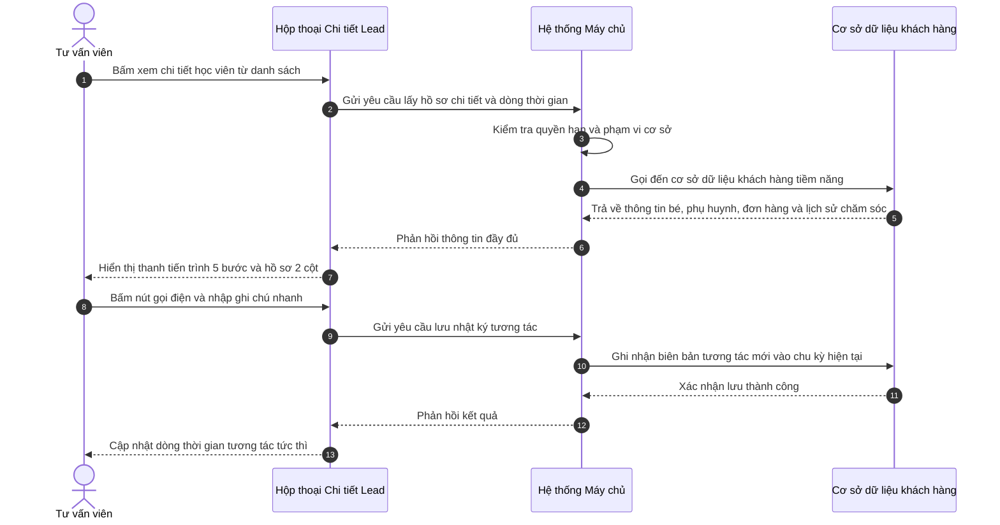

# US-CRM-01-03: Màn hình Chi tiết Khách hàng tiềm năng (Lead Detail & Handoff)

> **Tham chiếu:** `BF-CRM-01` · `SR-SALE-001` · Giao diện Mẫu §4.3 (Chi tiết)  
> **Đường dẫn màn hình & Trạng thái liên quan:**  
> - `/app/crm_leads` (Hộp thoại chi tiết Lead) -> Trạng thái: `[Mới tiếp nhận, Đang tư vấn, Hẹn trải nghiệm, Chờ chốt deal, Đã chuyển đổi, Thất bại / Lưu kho]`  

---

## 1. NHẬT KÝ THAY ĐỔI & BỐI CẢNH (CHANGELOG & CONTEXT)

### Lịch sử cập nhật tài liệu (Changelog)

| Ngày cập nhật | Nội dung cập nhật | Lý do cập nhật |
|---|---|---|
| 09/09/2026 | Khởi tạo tài liệu đặc tả màn hình Chi tiết Lead, bổ sung quy trình Stepper 5 bước, chuẩn hóa danh mục Điểm rơi (Drop-off Taxonomy), cơ chế bàn giao vận hành khi chốt đơn và tái kích hoạt sau 6 tháng không hoạt động | Chuẩn hóa nghiệp vụ chăm sóc khách hàng tiềm năng và liên thông dữ liệu học vụ |

### Bối cảnh & Vấn đề nghiệp vụ (Context & Problem)
* **Bối cảnh:** Thuộc phân hệ Tuyển sinh & Thương mại (`CAP-ADM`), màn hình Chi tiết Lead cung cấp không gian tương tác một cửa cho Tư vấn viên (Sales) thực hiện gọi điện, tư vấn, đặt lịch đánh giá năng lực, lên đơn hàng và theo dõi dòng thời gian tương tác của từng học viên tiềm năng.
* **Vấn đề hiện tại:** Bản cũ sử dụng hộp thoại thông tin thô, ghi chú tự do viết tắt không thể đo lường tỷ lệ rớt phễu, chưa phân định rõ ranh giới bàn giao giữa Sales và Vận hành lớp học, đồng thời thiếu cơ chế mở chu kỳ bán mới khi học viên cũ ngừng học sau 6 tháng.
* **Mục tiêu & Giá trị mang lại:**
  1. Trực quan hóa quy trình chuyển đổi 5 chặng bằng thanh tiến trình trực quan.
  2. Đo lường chính xác "điểm rơi" bằng danh mục lý do rớt chuẩn hóa theo từng chặng.
  3. Bàn giao dứt điểm cho Vận hành khi chốt đơn, giải phóng áp lực chăm sóc cho Sales.
  4. Hỗ trợ kích hoạt chu kỳ bán mới cho học viên không hoạt động trên 180 ngày mà vẫn bảo toàn lịch sử cũ.

### Hiểu người dùng & Tình huống sử dụng (User Needs & Use Cases)
* **Người dùng chính (Persona):** Tư vấn viên tuyển sinh (`PERSONA-SALE`) và Quản lý chi nhánh (`PERSONA-BRANCH_MANAGER`).
* **Nhu cầu thực tế (Needs):** Xem số điện thoại đầy đủ để bấm gọi điện ngay (Click-to-Call), ghi nhận nhanh biên bản trao đổi, biết chính xác lý do khách từ chối để hệ thống nuôi dưỡng tự động.
* **Câu phát biểu nghiệp vụ:** **Là một** Tư vấn viên tuyển sinh, **tôi muốn** xem hồ sơ chi tiết, bấm gọi điện trực tiếp, cập nhật tiến trình và ghi nhận nguyên nhân từ chối chuẩn hóa, **để** nâng cao tỷ lệ chuyển đổi và hỗ trợ phân tích điểm rò rỉ của phễu bán hàng.

---

## 2. LUỒNG XỬ LÝ CHÍNH (MAIN FLOW - HAPPY PATH)

---

## 3. GIAO DIỆN & CẤU TRÚC CHI TIẾT (UI & DATA STATE)

### 3.1. Cấu trúc các vùng giao diện & Ràng buộc Quyền hạn (Capability Gating)

| Vùng Giao diện / Nút Thao Tác | Loại Hiển Thị | Mã Quyền Yêu Cầu (Required Capability) | Xử Lý Khi Không Đủ Quyền |
| :--- | :--- | :--- | :--- |
| **Xem Chi tiết Hồ sơ Lead** | Bảng tóm tắt & Thông tin | `crm.lead.view_detail` | Chặn xem chi tiết, thông báo lỗi quyền hạn |
| **Xem Số điện thoại Đầy đủ** | Chữ kèm nút gọi | `crm.lead.view_phone_full` | Hiển thị dạng che số `090****123`, ẩn nút gọi |
| **Ghi nhận Tương tác Nhanh** | Form nhập liệu nhanh | `crm.lead.log_interaction` | Vô hiệu hóa nút lưu nhật ký |
| **Thao tác Báo rớt / Lưu kho** | Nút hành động & Hộp thoại | `crm.lead.mark_drop` | Ẩn nút báo rớt |
| **Chuyển Chặng Quy trình** | Thanh tiến trình Stepper | `crm.lead.advance_stage` | Chặn nhấp chuyển chặng trên thanh tiến trình |
| **Kích hoạt Chu kỳ Bán mới** | Nút màu nhấn | `crm.lead.reactivate` | Ẩn nút kích hoạt chu kỳ mới |

### 3.2. Cấu trúc các khối thông tin
1. **Khối 1: Thanh tiến trình Chuyển đổi 5 bước (Pipeline Stepper):**
   - Chặng 1: Mới tiếp nhận (Lead mới đổ về, chưa liên hệ).
   - Chặng 2: Đang tư vấn (Đã liên hệ, đang giới thiệu khóa học).
   - Chặng 3: Hẹn trải nghiệm (Đã có lịch kiểm tra năng lực hoặc học thử).
   - Chặng 4: Chờ chốt deal (Đã có kết quả, đang giữ chỗ hoặc gửi báo giá).
   - Chặng 5: Đã chuyển đổi (Đã thanh toán học phí hoặc đặt cọc) HOẶC Thất bại / Lưu kho (nếu báo rớt).
2. **Khối 2: Cột trái - Hồ sơ Thực thể & Chu kỳ Bán:**
   - Bộ chuyển đổi Chu kỳ bán (Ví dụ: `Chu kỳ 1 (08/2026)` / `Chu kỳ 2 (03/2027)`).
   - Thông tin Học viên: Họ tên bé, tuổi, năm sinh, trường học, môn quan tâm, trình độ hiện tại.
   - Thông tin Phụ huynh: Họ tên người đại diện, mối quan hệ, số điện thoại đầy đủ, thư điện tử, địa chỉ, liên kết anh chị em cùng gia đình.
   - Nguồn tiếp nhận & Phân bổ: Kênh quảng cáo, tư vấn viên phụ trách, cơ sở.
3. **Khối 3: Cột phải - Form Tác nghiệp Nhanh (Quick Care Logger):**
   - Lựa chọn kênh tiếp cận: Cuộc gọi, Zalo, Trực tiếp.
   - Kết quả tiếp cận: Nghe máy quan tâm, Bận hẹn gọi lại, Không nghe máy, Sai số, Từ chối.
   - Ô nhập nội dung trao đổi.
   - Ô chọn ngày giờ hẹn chăm sóc tiếp theo.
4. **Khối 4: Hệ thống Tab Dòng thời gian & Liên thông Vận hành:**
   - Tab 1: Dòng thời gian tương tác (Vertical Timeline hiển thị từng lần trao đổi).
   - Tab 2: Lịch kiểm tra & Học thử (Lịch thi, kết quả đánh giá, lớp học thử).
   - Tab 3: Cơ hội & Đơn hàng (Gói học dự kiến, đơn hàng đăng ký, tiến độ nộp phí).
   - Tab 4: Bàn giao Vận hành (Mã học viên chính thức, lớp học đang theo học, sĩ số, ngày học, cảnh báo không hoạt động trên 180 ngày).

---

## 4. KHỐI CHỨC NĂNG CHI TIẾT: ACTION & LUỒNG KÍCH HOẠT (ACTIONS & EVENTS)

### Khối chức năng 1: Ghi nhận Tương tác và Cập nhật Lịch hẹn

#### Action 1.1: Lưu nhật ký cuộc gọi
* **Luồng kích hoạt:** Tư vấn viên chọn kết quả cuộc gọi, nhập nội dung trao đổi và bấm "Lưu nhật ký".
* **Tiêu chí nghiệm thu (Acceptance Criteria):**
  - **AC-1 (Happy Path - Lưu thành công):**
    - **Giả sử:** Hộp thoại Chi tiết Lead đang mở và tư vấn viên có quyền ghi nhận tương tác.
    - **Khi:** Người dùng chọn kênh "Cuộc gọi", kết quả "Nghe máy quan tâm", nhập nội dung "Phụ huynh đồng ý cho bé test năng lực chiều Thứ 7" và bấm Lưu.
    - **Thì:** Hệ thống lưu biên bản mới vào cơ sở dữ liệu khách hàng tiềm năng, hiển thị ngay trên đầu dòng thời gian và làm mới số lần chăm sóc.
  - **AC-2 (Validation Path - Thiếu nội dung ghi chú):**
    - **Giả sử:** Tư vấn viên đang ở form ghi nhận tương tác.
    - **Khi:** Người dùng để trống ô nội dung ghi chú và bấm Lưu nhật ký.
    - **Thì:** Hệ thống hiển thị cảnh báo yêu cầu nhập tóm tắt trao đổi trước khi lưu.

### Khối chức năng 2: Báo rớt và Xác định Điểm rơi Chuẩn hóa

#### Action 2.1: Đánh dấu Thất bại / Báo rớt Lead
* **Luồng kích hoạt:** Tư vấn viên bấm nút "Báo rớt", chọn chặng rơi và lý do từ danh mục chuẩn hóa.
* **Tiêu chí nghiệm thu (Acceptance Criteria):**
  - **AC-3 (Happy Path - Báo rớt thành công):**
    - **Giả sử:** Lead đang ở chặng "Đang tư vấn".
    - **Khi:** Người dùng bấm "Báo rớt", chọn chặng rơi "Đang tư vấn", chọn lý do "Nhà quá xa cơ sở không tiện đưa đón", nhập ghi chú và bấm Xác nhận.
    - **Thì:** Trạng thái Lead chuyển thành "Thất bại", thanh tiến trình hiển thị điểm rơi tại chặng 2, và hệ thống chuyển Lead vào kho nuôi dưỡng sau 90 ngày.

### Khối chức năng 3: Bàn giao Vận hành và Tái kích hoạt sau 6 tháng

#### Action 3.1: Kích hoạt Chu kỳ Bán mới cho Học viên không hoạt động
* **Luồng kích hoạt:** Khi học viên đã hoàn thành khóa hoặc nghỉ học trên 180 ngày, tư vấn viên bấm nút "Kích hoạt Chu kỳ Bán mới".
* **Tiêu chí nghiệm thu (Acceptance Criteria):**
  - **AC-4 (Happy Path - Mở chu kỳ mới):**
    - **Giả sử:** Học viên đã kết thúc khóa học và không có hoạt động trong 185 ngày.
    - **Khi:** Tư vấn viên bấm nút "Kích hoạt Chu kỳ Bán mới".
    - **Thì:** Hệ thống tạo chu kỳ bán thứ 2, giữ nguyên toàn bộ lịch sử học vụ và tương tác của chu kỳ 1, và chuyển trạng thái chu kỳ mới về "Mới tiếp nhận".

---

## 5. CÁC TRƯỜNG HỢP GÓC CẠNH (CORNER CASES)

- **[CASE-01] Lead có nhiều con cùng gia đình:**
  - *Tình huống:* Phụ huynh có 2 con đang cùng là Lead trong hệ thống.
  - *Cách xử lý:* Giao diện hiển thị danh sách thẻ liên kết anh chị em ở cột trái, cho phép tư vấn viên nhấp chuyển đổi nhanh giữa các con mà không cần đóng hộp thoại.
- **[CASE-02] Không đủ quyền xem số điện thoại đầy đủ:**
  - *Tình huống:* Nhân sự không có quyền xem thông tin liên hệ đầy đủ mở xem chi tiết.
  - *Cách xử lý:* Số điện thoại hiển thị dạng che ẩn `090****574`, đồng thời ẩn nút Gọi điện và nút Sao chép.
- **[CASE-03] Chốt đơn thành công chuyển giao sang Vận hành:**
  - *Tình huống:* Lead hoàn tất thanh toán 100% học phí hoặc đặt cọc.
  - *Cách xử lý:* Hệ thống tự động chuyển trạng thái sang "Đã chuyển đổi", hiển thị thẻ tóm tắt lớp học đã bàn giao, và khóa quyền chỉnh sửa chu kỳ bán của Sales.
- **[CASE-04] Báo rớt do khách không nghe máy nhiều lần:**
  - *Tình huống:* Tư vấn viên ghi nhận 3 lần gọi không nghe máy liên tiếp trong 3 ngày.
  - *Cách xử lý:* Hệ thống tự động gợi ý chọn lý do rơi "Không nghe máy quá 3 lần" và đề xuất kích hoạt kịch bản nhắn tin tự động chăm sóc lại.
- **[CASE-05] Tái kích hoạt học viên cũ khi phụ huynh chủ động gọi lại:**
  - *Tình huống:* Học viên đã nghỉ học 8 tháng, phụ huynh gọi lại đăng ký khóa học mới.
  - *Cách xử lý:* Hệ thống nhận diện số điện thoại phụ huynh, mở hồ sơ hiện có kèm cảnh báo nghỉ học quá 180 ngày và cho phép bấm kích hoạt Chu kỳ Bán mới ngay tại màn hình.
