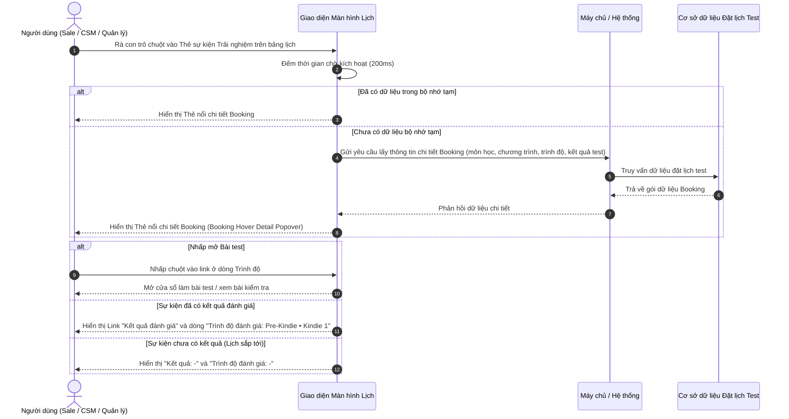

# US-ENR-01-05: Thẻ nổi chi tiết khi di chuột vào sự kiện Booking trải nghiệm (Booking Hover Detail Popover)

> **Tham chiếu:** BF-ENR-01 · SR-CSM-001 · Giao diện Mẫu §4.3 (Hộp thoại chi tiết & Thẻ thông tin nổi xem nhanh)
> **Đường dẫn màn hình & Trạng thái liên quan:**
> - `Lịch học (/app/calendar_class_schedule)` -> Thẻ nổi kích hoạt khi di chuột
> - `Lịch của tôi (/app/my_schedule)` -> Thẻ nổi kích hoạt khi di chuột
> - `Quản lý Đặt lịch (/app/booking_test)` -> Thẻ nổi kích hoạt khi di chuột

---

## 1. NHẬT KÝ THAY ĐỔI & BỐI CẢNH (CHANGELOG & CONTEXT)

### Lịch sử cập nhật tài liệu (Changelog)

| Ngày cập nhật | Nội dung cập nhật | Lý do cập nhật |
|---|---|---|
| 27/07/2026 | Biên tập tài liệu đặc tả thẻ nổi xem nhanh chi tiết sự kiện Đặt lịch trải nghiệm / Booking Test | Chuẩn hóa đặc tả giao diện xem nhanh booking theo các giai đoạn tiến trình |
| 27/07/2026 | Bổ sung Trình độ môn học gắn link bài test và 4 trạng thái tiến trình | Cập nhật theo phản hồi giao diện |
| 27/07/2026 | Tinh chỉnh giao diện: Đổi nhãn 'PHỤ TRÁCH:', căn phải tên Người phụ trách, nhãn 'Kết quả:', bổ sung dòng Chương trình, tách dòng Trình độ đăng ký và bổ sung dòng Trình độ đánh giá ở cuối | Cập nhật theo phản hồi giao diện thực tế mới |

### Bối cảnh & Vấn đề nghiệp vụ (Context & Problem)
* **Bối cảnh:** Trong các màn hình lịch tổng quan, các ca đặt lịch đánh giá năng lực / học thử (Booking trải nghiệm) hiển thị dạng khối thẻ màu xanh lục nhạt. Thẻ gốc chỉ có không gian chứa thông tin rút gọn (Tên học sinh, Trình độ, Người phụ trách, Khung giờ).
* **Vấn đề hiện tại:** Tư vấn viên (Sale), Nhân viên CSKH/Giáo vụ (CSM) và Quản lý chi nhánh cần kiểm tra nhanh thông tin liên hệ phụ huynh, địa điểm trung tâm, giáo viên phụ trách, môn học, chương trình đang chọn, trình độ đăng ký và kết quả trình độ đánh giá sau khi test.
* **Mục tiêu & Giá trị mang lại:** Cung cấp thẻ nổi chi tiết xem nhanh ngay khi rà chuột (Booking Hover Detail Popover) lên sự kiện trải nghiệm. Giúp nhân sự nắm bắt 100% hồ sơ học sinh tiềm năng, mở nhanh bài test từ dòng Trình độ đăng ký, kiểm tra chương trình học và xem kết quả trình độ đánh giá (kèm trình độ phụ) ở cuối thẻ.

### Hiểu người dùng & Tình huống sử dụng (User Needs & Use Cases)
* **Người dùng chính (Persona):** Nhân viên Tư vấn (PERSONA-SALE), Nhân viên CSKH/Giáo vụ (PERSONA-CSM), Quản lý chi nhánh (PERSONA-BRANCH-MANAGER).
* **Khó khăn lớn nhất (Pain-points):** Phải nhấp mở từng cửa sổ chi tiết booking để xem trình độ đánh giá thực tế của học sinh sau ca học thử.
* **Nhu cầu thực tế (Needs):** Rà chuột vào thẻ trải nghiệm là thấy ngay: Tên học sinh, Thông tin gia đình & SĐT phụ huynh, Môn học & Chương trình đang chọn (`Tiếng Anh - Chương trình Station`), Dòng Trình độ đăng ký (gắn link bài test), Địa điểm gọn gàng, Đội ngũ phụ trách căn phải, Link Kết quả đánh giá và Dòng Trình độ đánh giá ở cuối (bao gồm trình độ chính và trình độ phụ).
* **Câu phát biểu nghiệp vụ:** **Là một** Tư vấn viên hoặc Nhân viên vận hành trung tâm, **tôi muốn** xem nhanh thẻ nổi chi tiết khi di chuột vào sự kiện trải nghiệm, **để** kiểm tra môn học - chương trình, mở bài test từ Trình độ đăng ký và xem Trình độ đánh giá chi tiết ở cuối thẻ mà không cần mở hộp thoại lớn.

### Phạm vi kiểm soát (Scope)
* **Phạm vi hiển thị:** Thẻ thông tin nổi (Popover Card) xem nhanh sự kiện Đặt lịch trải nghiệm / Booking test trên tất cả màn hình lịch.
* **Ràng buộc nghiệp vụ toàn cục (Global Rules):**
  - **[RULE-BOOKING-01] Nguồn dữ liệu hợp nhất:** Dữ liệu hiển thị trên thẻ nổi được đồng bộ trực tiếp từ cơ sở dữ liệu đặt lịch đánh giá (Booking Test DB) và tự động cập nhật theo trạng thái thời thực.
  - **[RULE-BOOKING-02] Độ trễ kích hoạt (Hover Intent):** Thẻ nổi chỉ xuất hiện sau khi con trỏ chuột dừng trên thẻ trải nghiệm từ 200ms đến 300ms, tránh hiện tượng nhấp nháy giao diện khi lướt chuột qua lưới lịch.
  - **[RULE-BOOKING-03] Định vị thông minh (Smart Positioning):** Thẻ nổi tự động tính toán không gian màn hình để đặt vị trí sao cho không bị tràn ra ngoài viền quan sát.
  - **[RULE-BOOKING-04] Duy trì trạng thái tương tác:** Cho phép người dùng di chuyển con trỏ chuột vào bên trong thẻ nổi để xem thông tin hoặc nhấp mở chi tiết đầy đủ.
  - **[RULE-BOOKING-05] Che số điện thoại bảo mật (Security Masking):** Trên thẻ lịch gốc hiển thị SĐT che ẩn dạng `091****111`. Khi rà chuột mở Thẻ nổi chi tiết, người dùng có thẩm quyền mới được xem đầy đủ số điện thoại phụ huynh.
  - **[RULE-BOOKING-06] Chống trùng lặp tên Cơ sở / Địa điểm (Branch Deduplication):** Nếu tên phòng thi đã bao gồm tên cơ sở (ví dụ `RinoEdu Smart City - Phòng IELTS`), giao diện chỉ hiển thị tên địa điểm một lần duy nhất `RinoEdu Smart City - Phòng IELTS`, tuyệt đối không lặp lại dấu chấm nối `• RinoEdu Smart City`.
  - **[RULE-BOOKING-07] Tách riêng Dòng Môn học - Chương trình và Dòng Trình độ đăng ký:**
    - Dòng Môn học hiển thị: `[Môn học] - [Chương trình đang chọn]` (Ví dụ `Tiếng Anh - Chương trình Station`).
    - Dòng Trình độ đăng ký đặt ở ngay bên dưới với icon Huy hiệu, hiển thị nhãn `Trình độ: [Pre-Starters (<=6) / Starters / Mover / Flyers / IELTS Foundation]` gắn link bài test.
  - **[RULE-BOOKING-08] Khối Kết quả & Trình độ đánh giá ở cuối thẻ:**
    - Dòng 1: `Kết quả:` hiển thị đường dẫn `Kết quả đánh giá` (nếu đã có kết quả) hoặc `-` (nếu chưa có kết quả).
    - Dòng 2: `Trình độ đánh giá:` hiển thị tổng hợp `[Trình độ chính] • [Trình độ phụ]` (ví dụ `Pre-Kindie • Kindie 1` hoặc `Level 1A • Sub-level A1`), nếu chưa test hiển thị `-`.
  - **[GLOBAL-METRIC-01] Định mức thời gian phản hồi:** Dữ liệu thẻ nổi hiển thị tức thì trong dưới 150ms từ bộ nhớ tạm (cache) hoặc không quá 300ms từ máy chủ hệ thống.

---

## 2. LUỒNG XỬ LÝ CHÍNH (MAIN FLOW - HAPPY PATH)

*Mô tả luồng tương tác khi người dùng di chuột xem nhanh, mở link bài test từ Trình độ và xem Kết quả & Trình độ đánh giá ở cuối thẻ.*

---

## 3. GIAO DIỆN & TRẠNG THÁI TĨNH (DATA & UI STATE)

### 3.1. Thiết kế trực quan (Figma)
* **Link thiết kế Các Giai đoạn Booking Trải nghiệm:** `https://www.figma.com/design/frct7JUaJQBN2uOSyfMqcL/Rinoedu?node-id=1542-8312`

### 3.2. Cấu trúc các vùng giao diện & Bảng mô tả chi tiết

Bố cục Thẻ nổi chi tiết Booking trải nghiệm gồm 7 khối thông tin xếp chồng theo chiều dọc từ trên xuống dưới.

| Thành phần giao diện | Loại hiển thị | Dữ liệu & Quy tắc | Diễn giải quy tắc | Co giãn giao diện (Mobile) |
|---|---|---|---|---|
| Dải đầu thẻ (Header Strip) | Thanh tiêu đề màu nhạt | Khung giờ (`09:30 - 10:00` / `10:00 - 10:30`) + Icon đồng hồ + Nhãn `Trải nghiệm` | Màu nền dải đầu thẻ viền xanh lá nhạt. Nhãn `Trải nghiệm` ở góc phải có nền màu cam nhạt, chữ màu cam nâu nổi bật. | Co giãn theo chiều rộng thẻ nổi |
| Khối Tên học sinh & Phụ huynh | Tiêu đề đậm + Dòng phụ kèm Badge | Tên học sinh (`Nguyễn Minh Khang` / `Quynh Chi` / `Bùi Hà My`) + Text `PH: Gia đình [Tên PH] ([SĐT])` + Badge Trạng thái | Tên học sinh viết chữ đậm cỡ lớn. Thông tin phụ huynh và SĐT hiển thị chữ xám phụ. Ở góc phải dòng tên có Badge trạng thái theo 4 giai đoạn tiến trình. | Tự động xuống dòng nếu tên học sinh dài |
| Khối Môn học & Chương trình | Dòng thông tin | Icon Sách + Môn học (`Tiếng Anh` / `Toán tư duy`) + Dấu gạch nối `-` + Tên Chương trình chọn (`Chương trình Station` / `Chương trình Toán tư duy` / `Chương trình Station Grammar`) | **Ràng buộc:** Hiển thị rõ tên môn học và tên chương trình đào tạo đang lựa chọn cho học sinh. | Hiển thị rõ tên môn học và tên chương trình |
| Khối Trình độ đăng ký (Gắn Link Test) | Dòng thông tin chứa Hyperlink | Icon Huy hiệu + Text `Trình độ: ` + Tên Trình độ chứa link test (`Pre-Starters (<=6)` / `Starters` / `Mover` / `Flyers` / `IELTS Foundation`) | **Ràng buộc:** Tên **Trình độ** hiển thị màu xanh lá dạng đường dẫn nhấp được. Khi người dùng nhấp vào tên Trình độ, hệ thống mở trực tiếp bài test năng lực tương ứng. | Hiển thị rõ nhãn trình độ và link test |
| Khối Địa điểm (Chống lặp tên cơ sở) | Dòng thông tin kèm biểu tượng | Icon Vị trí + Tên phòng/Cơ sở (`RinoEdu Nguyễn Tuân - Phòng Lab 1`) | Hiển thị địa điểm phòng thi. Nếu tên phòng đã chứa tên cơ sở, chỉ hiển thị tên địa điểm một lần duy nhất, tránh lặp lại tên chi nhánh. | Tự động thu gọn text nếu thiếu không gian |
| Khối Phụ trách | Dòng thông tin nhân sự | Tiêu đề nhóm `PHỤ TRÁCH:` + Dòng Phụ trách (`Phụ trách:` bên trái, `Avatar + Tên Người phụ trách` căn bên phải) | **Ràng buộc:** Tên Người phụ trách được hiển thị căn lề bên phải dòng. Chỉ hiển thị tên cá nhân (ví dụ `Robert L.`), không hiển thị tên phòng thi/bộ phận. | Hiển thị tên cá nhân phụ trách căn phải |
| Khối Kết quả & Trình độ đánh giá (Ở cuối thẻ) | Khối thông tin 2 dòng bên dưới | Dòng 1: `Kết quả:` (Link `Kết quả đánh giá` hoặc `-`). Dòng 2: `Trình độ đánh giá:` (`[Trình độ chính] • [Trình độ phụ]` hoặc `-`) | **Ràng buộc:** Nằm ở cuối thẻ. Dòng Trình độ đánh giá hiển thị kết quả xếp lớp thực tế sau khi giáo viên làm bài test. Nếu chưa test hiển thị `-`. | Hiển thị rõ ràng 2 dòng ở cuối thẻ |
| Thanh chân thẻ (Footer Tip) | Thanh hướng dẫn màu xám | Icon Thông tin ở đầu dòng + Text `Nhấp vào thẻ để mở chi tiết & thao tác` | Thanh chỉ dẫn giúp người dùng biết thẻ có thể tương tác nhấp chuột để mở màn hình chi tiết booking đầy đủ. Icon Info được đưa lên trước văn bản. | Luôn ghim ở đáy thẻ nổi |

### 3.3. Đặc tả 4 Giai đoạn Tiến trình Booking (4-Stage Details)

1. **Stage 1: Giai đoạn `Đã đặt lịch test` (Booked Stage):**
   - **Đặc điểm giao diện:** Badge trạng thái ở góc phải phần tên học sinh hiển thị `Đã đặt lịch test`. Dòng Kết quả và Trình độ đánh giá hiển thị `-` (trống).
   - **Thẻ lịch gốc:** Hiển thị thẻ màu xanh nhạt với dòng trạng thái dưới cùng `trạng thái: đã book test`.
2. **Stage 2: Giai đoạn `Đã check-in` (Checked-in Stage):**
   - **Đặc điểm giao diện:** Badge trạng thái hiển thị `Đã check-in` màu xanh lá tươi. Dòng Kết quả và Trình độ đánh giá hiển thị `-` (trống).
   - **Thẻ lịch gốc:** Hiển thị thẻ màu xanh nhạt với dòng trạng thái `trạng thái: đã check-in`.
3. **Stage 3: Giai đoạn `Đang test` (Testing Stage):**
   - **Đặc điểm giao diện:** Badge trạng thái hiển thị `Đang test` màu vàng/cam nhạt. Dòng Kết quả và Trình độ đánh giá hiển thị `-` (trống).
   - **Thẻ lịch gốc:** Hiển thị thẻ màu xanh nhạt với dòng trạng thái `trạng thái: đang test`.
4. **Stage 4: Giai đoạn `Hoàn tất` (Completed Stage):**
   - **Đặc điểm giao diện:** Badge trạng thái hiển thị `Hoàn tất` màu xanh dương nhạt. Dòng Kết quả hiển thị đường dẫn `Kết quả đánh giá`, dòng Trình độ đánh giá hiển thị `Pre-Kindie • Kindie 1` (hoặc `Level 1A • Sub-level A1`).
   - **Thẻ lịch gốc:** Dải màu đầu thẻ chuyển màu vàng/cam nhạt (`10:00 - 10:30` `Trải nghiệm`), dòng trạng thái dưới cùng `trạng thái: hoàn tất`.

### 3.4. Ma trận phân quyền (Permission Matrix)

| Vai trò người dùng | Xem thẻ nổi Booking | Nhấp Trình độ mở Bài test | Xem Link Kết quả & Trình độ đánh giá | Nhấp mở Hộp thoại chi tiết |
|---|:---:|:---:|:---:|:---:|
| **Quản trị viên (Admin)** | ✅ | ✅ | ✅ | ✅ |
| **Quản lý chi nhánh (Branch Manager)** | ✅ | ✅ | ✅ | ✅ |
| **Nhân viên Tư vấn (Sale)** | ✅ | ✅ | ✅ | ✅ |
| **Giáo vụ / CSKH (CSM)** | ✅ | ✅ | ✅ | ✅ |
| **Giáo viên (Teacher)** | ✅ | ✅ | ✅ | ✅ |

---

## 4. KHỐI CHỨC NĂNG CHI TIẾT: ACTION & LUỒNG KÍCH HOẠT (ACTIONS & EVENTS)

### Khối chức năng 1: Hiển thị Thẻ nổi khi di chuột

#### Action 1.1: Xem Môn học - Chương trình, Trình độ và Trình độ đánh giá
* **Luồng kích hoạt (Event/Flow):** 
  - Giao diện hiển thị tách biệt dòng Môn học - Chương trình (`Tiếng Anh - Chương trình Station`) và dòng Trình độ đăng ký (`Trình độ: Pre-Starters (<=6)`).
  - Với sự kiện chưa làm bài/chưa có kết quả test, dòng `Kết quả:` và `Trình độ đánh giá:` hiển thị dấu gạch ngang `-` (trống).
  - Khi booking đã hoàn tất bài test, hiển thị đường dẫn `Kết quả đánh giá` và hiển thị cụm trình độ đánh giá `[Trình độ chính] • [Trình độ phụ]`.
* **Tiêu chí nghiệm thu (Acceptance Criteria):**
  - **AC-1 (Happy Path - Hiển thị tách biệt Môn học - Chương trình và Trình độ):**
    - **Giả sử:** Booking của học sinh `Nguyễn Minh Khang`.
    - **Khi:** Thẻ nổi hiển thị.
    - **Thì:** Dòng 1 ghi `Tiếng Anh - Chương trình Station`, Dòng 2 ghi `Trình độ: Pre-Starters (<=6)` (gắn link bài test).
  - **AC-2 (Happy Path - Sự kiện đã hoàn tất hiển thị Trình độ đánh giá):**
    - **Giả sử:** Booking của học sinh `Đinh Hoàng Nam` đã hoàn tất test.
    - **Khi:** Thẻ nổi hiển thị.
    - **Thì:** Dòng `Trình độ đánh giá:` ở cuối thẻ hiển thị kết quả xếp lớp dạng `Pre-Kindie • Kindie 1`.
  - **AC-3 (Happy Path - Sự kiện chưa test hiển thị trống -):**
    - **Giả sử:** Booking của học sinh `Nguyễn Minh Khang` chưa test (lịch sắp tới).
    - **Khi:** Thẻ nổi hiển thị.
    - **Thì:** Cả hai dòng `Kết quả:` và `Trình độ đánh giá:` ở cuối thẻ đều hiển thị dấu gạch ngang `-` (trống).

---

### Khối chức năng 2: Nhấp chuột mở chi tiết đầy đủ (Click to Open Detail)

#### Action 2.1: Nhấp chuột vào vị trí trống trên Thẻ nổi chi tiết Booking
* **Luồng kích hoạt (Event/Flow):** Khi người dùng nhấp chuột trái vào bất kỳ vị trí nào khác trên Thẻ nổi chi tiết, hệ thống tự động mở Hộp thoại chi tiết Booking đầy đủ (Booking Detail Modal).

---

## 5. CÁC TRƯỜNG HỢP GÓC CẠNH (CORNER CASES)

* **5.1. Thẻ trải nghiệm nằm sát mép trên hoặc mép phải màn hình:** Thẻ nổi tự động đảo hướng hiển thị xuống phía dưới hoặc sang bên trái để đảm bảo toàn bộ nội dung nằm gọn trong màn hình quan sát.
* **5.2. Thao tác trên thiết bị màn hình cảm ứng (Mobile/Tablet):** Thao tác rà chuột (hover) không tồn tại trên màn hình cảm ứng, hệ thống tự động chuyển đổi: Chạm 1 lần vào thẻ trải nghiệm để mở Thẻ nổi chi tiết, chạm lần thứ 2 để mở Hộp thoại chi tiết booking.
* **5.3. Booking chưa được gán Trình độ đăng ký:** Dòng trình độ hiển thị `Trình độ: Chưa gán trình độ`. Cụm `Chưa gán trình độ` hiển thị chữ màu xám và không chứa liên kết nhấp chuột.
* **5.4. Thẻ lịch thu hẹp chiều rộng trên lưới lịch:** Khi chiều rộng khối thẻ bị thu hẹp dưới 160px, dải thời gian hiển thị rút gọn duy nhất giờ bắt đầu (ví dụ `09:30`), nhãn `Trải nghiệm` tự động ẩn để tránh vỡ bố cục dòng.
* **5.5. Học sinh chưa có Trình độ phụ:** Trường hợp kết quả đánh giá chỉ ghi nhận Trình độ chính (ví dụ `Level 1A`), dòng `Trình độ đánh giá:` hiển thị gọn gàng `Level 1A` mà không xuất hiện dấu chấm nối thừa.
