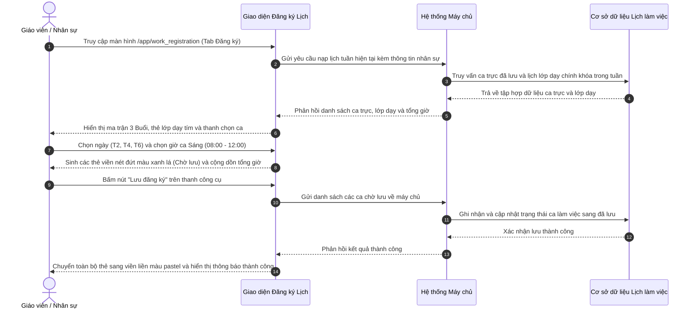

# US-HR-02-05: Màn hình Đăng ký Lịch - Đặc tả Chi tiết Thay đổi & Hướng dẫn Nâng cấp Giao diện Chuẩn hóa

> **Tham chiếu:** `BF-HR-02` · `PERSONA-TEACHER` · `PERSONA-STAFF` · `PERSONA-BRANCH-MANAGER`  
> **Đường dẫn màn hình & Trạng thái liên quan:**  
> - `/app/work_registration` (Tab Đăng ký) -> Trạng thái ca làm việc: `Chờ lưu`, `Đã lưu`, `Lớp dạy` | Trạng thái tuần: `Chưa đăng ký`, `Bản nháp`, `Đã lưu đăng ký`

---

## 1. NHẬT KÝ THAY ĐỔI & BỐI CẢNH (CHANGELOG & CONTEXT)

### Lịch sử cập nhật tài liệu (Changelog)

| Ngày cập nhật | Nội dung cập nhật | Lý do cập nhật |
|---|---|---|
| 01/10/2026 | Phát hành tài liệu đặc tả thay đổi và hướng dẫn nâng cấp màn hình Đăng ký lịch (/app/work_registration, Tab Đăng ký) | Chốt thiết kế bản demo mới: Chuyển đổi toàn diện từ giao diện hiện tại (lưới 30 phút dàn trải) sang bản demo mới chuẩn hóa (chọn ca theo lô, phân nhóm theo buổi làm việc, hiển thị lớp dạy chính khóa và tối ưu luồng thao tác cho đội ngũ phát triển). |

### Bối cảnh & Mục tiêu nâng cấp hệ thống (Context & Objectives)
* **Bối cảnh:** Màn hình Đăng ký lịch là nơi Giáo viên, Trợ giảng và Nhân viên vận hành chủ động đăng ký quỹ thời gian rảnh và ca trực khả dụng hàng tuần.
* **Vấn đề trên giao diện hiện tại (Ảnh 1):**
  1. *Thao tác thủ công, tốn nhiều lần nhấp chuột:* Thời gian bị xé nhỏ thành các dòng 30 phút (hơn 30 dòng từ 08:00 đến 22:00). Muốn đăng ký ca 4 tiếng (08:00 - 12:00), nhân sự phải bấm chọn 8 ô rỗng riêng lẻ, rất dễ nhầm lẫn và tốn thời gian.
  2. *Thiếu tầm nhìn về lịch lớp dạy chính khóa:* Giao diện cũ không hiển thị lịch lớp dạy thực tế đã được giáo vụ phân công. Nhân sự dễ bị "mù thông tin", vô tình đăng ký ca trực trùng vào khung giờ mình đang đứng lớp giảng dạy.
  3. *Bố cục hàng dọc dài lê thê và khó kiểm soát quota:* Cuộn dọc nhiều, không có chỉ số tổng kết thời lượng từng ngày trên đầu cột, cũng như không có số lượng ca làm việc theo từng buổi.
  4. *Nút hành động chính chìm sâu dưới chân trang:* Nút "Cập nhật đăng ký" nằm ở thanh chân trang đáy màn hình, dễ bị khuất khỏi tầm nhìn.
* **Mục tiêu của Bản Demo mới (Bản chốt thiết kế - Ảnh 2):**
  - Cung cấp bộ công cụ chọn ca nhanh theo lô: Chọn các thứ trong tuần + chọn giờ ca Sáng/Chiều/Tối để áp dụng đồng loạt.
  - Gom các dòng thời gian thành 3 Buổi làm việc tinh gọn: Buổi Sáng (08:00 - 12:00), Buổi Chiều (13:00 - 17:30), Buổi Tối (17:30 - 22:00).
  - Tích hợp trực quan Lớp dạy chính khóa (thẻ màu xanh tím có mã lớp, icon sách và bảng nổi thông tin) hiển thị song song với Ca trực rảnh.
  - Đưa nút "Lưu đăng ký" và tổng thời lượng lên thanh công cụ phía trên.
  - Lược bỏ hoàn toàn thanh chân trang dưới cùng, giúp giao diện thoáng đãng và không bị che khuất.

### Danh mục chức năng & Mức độ ưu tiên (Feature Scope)

| Mã Chức Năng | Tên Chức Năng Cần Lập Trình | Mức Ưu Tiên | Phân Loại Rủi Ro | Ghi Chú Kỹ Thuật |
|---|---|---|---|---|
| **FEAT-WR-01** | Bộ công cụ chọn ca nhanh theo lô (Batch Time Range Picker) | Must | Standard | Dòng 1 chọn ngày, Dòng 2 chọn ca theo 3 buổi |
| **FEAT-WR-02** | Ma trận lịch tuần phân nhóm theo 3 Buổi làm việc | Must | Standard | Buổi Sáng, Buổi Chiều, Buổi Tối kèm số liệu thống kê |
| **FEAT-WR-03** | Thẻ Lớp dạy chính khóa (chỉ đọc, có bảng nổi chi tiết) | Must | Standard | Tích hợp dữ liệu xếp lớp, ngăn chặn sửa/xóa |
| **FEAT-WR-04** | Thẻ Ca trực rảnh cá nhân (hỗ trợ xóa nhanh bằng nút x) | Must | Standard | Phân biệt ca Chờ lưu (nét đứt) và ca Đã lưu |
| **FEAT-WR-05** | Nút hành động cấp cao "+ Yêu cầu điều chỉnh" | Should | Standard | Mở hộp thoại xin đổi ca / nghỉ đột xuất |
| **FEAT-WR-06** | Bảng nổi Cảnh báo vi phạm định mức thời gian tuần | Should | Standard | Kiểm tra giờ tối thiểu, tối đa và giờ cao điểm |

### Chỉ số Đo lường Hiệu quả (KPI Target)
* **Baseline (Hiện trạng giao diện cũ):** Nhân sự mất trung bình 3.5 phút và 24 lần nhấp chuột để đăng ký lịch tuần; tỷ lệ trùng giờ lớp dạy là 8.2%.
* **Target (Mục tiêu giao diện mới):** Giảm thời gian đăng ký lịch tuần xuống dưới 45 giây; giảm số lần nhấp chuột xuống dưới 5 lần; tỷ lệ trùng lịch lớp dạy đưa về 0%.
* **Phương pháp đo lường:** Đo lường thời gian từ lúc mở màn hình đến khi bấm nút "Lưu đăng ký" thành công và tỷ lệ gửi yêu cầu điều chỉnh lịch do trùng giờ.

### Quy tắc nghiệp vụ cốt lõi (Business Rules)
1. **[RULE-WR-01] Nguyên tắc bảo vệ lớp dạy chính khóa:** Lịch lớp dạy được đồng bộ tự động từ hệ thống xếp lớp và hiển thị ở trạng thái chỉ đọc (Read-only). Người dùng không thể xóa hoặc sửa lịch lớp dạy từ màn hình này.
2. **[RULE-WR-02] Nguyên tắc phân tách trạng thái ca làm việc:** Thẻ ca trực rảnh mới chọn hiển thị đường viền nét đứt màu xanh lá (`Chờ lưu`). Chỉ khi bấm nút `Lưu đăng ký`, ca mới chuyển sang trạng thái `Đã lưu` chính thức.
3. **[RULE-WR-03] Nguyên tắc tính toán tổng thời lượng thời gian thực:** Chỉ số `Tổng khung giờ` trên thanh công cụ và tổng số giờ trên từng cột Thứ phải tự động tính toán lại ngay lập tức khi người dùng chọn thêm hoặc xóa bỏ ca trực.
4. **[RULE-WR-04] Nguyên tắc khấu trừ xung đột lịch dạy:** Khi ca đăng ký mới trùng một phần vào khung giờ lớp dạy chính khóa, hệ thống tự động khấu trừ phần giờ trùng và chỉ tạo ca trực cho khoảng thời gian còn trống.
5. **[RULE-WR-05] Nguyên tắc khóa lịch quá hạn:** Sau thời điểm chốt lịch tuần (23:59 Chủ nhật), ma trận lịch chuyển sang trạng thái chỉ đọc, nút Lưu đăng ký bị vô hiệu hóa, mọi thay đổi phải thông qua nút `+ Yêu cầu điều chỉnh`.

---

## 2. LUỒNG XỬ LÝ CHÍNH (MAIN FLOW - HAPPY PATH)

---

## 3. GIAO DIỆN, PHÂN QUYỀN & RÀNG BUỘC KIỂM TRA DỮ LIỆU (UI, PERMISSIONS & VALIDATIONS)

### 3.1. Cấu trúc các vùng giao diện & Phân quyền (Capability Gating)

Màn hình áp dụng cơ chế kiểm soát hiển thị theo **Mã Quyền Động (Atomic Permissions)**:

| Vùng Giao diện / Nút Thao Tác | Loại Hiển Thị | Mã Quyền Yêu Cầu (Required Capability) | Xử Lý Khi Không Đủ Quyền |
| :--- | :--- | :--- | :--- |
| **Truy cập Màn hình `/app/work_registration`** | Toàn bộ giao diện | `hr.work_registration.view` | Chặn truy cập, chuyển hướng về trang báo lỗi không có quyền |
| **Bộ chọn ca nhanh theo lô (Batch Picker)** | Khối công cụ trên cùng | `hr.work_registration.create` | Vô hiệu hóa vùng chọn ca hoặc chỉ hiển thị chỉ đọc |
| **Nút Lưu đăng ký** | Nút bấm chính trên thanh công cụ | `hr.work_registration.submit` | Ẩn hoặc vô hiệu hóa nút Lưu đăng ký |
| **Nút xóa ca trực (x) trên thẻ lịch** | Biểu tượng xóa trên thẻ | `hr.work_registration.delete` | Ẩn biểu tượng nút xóa trên các thẻ ca trực |
| **Nút + Yêu cầu điều chỉnh** | Nút bấm góc trên bên phải | `hr.work_registration.adjust_request` | Ẩn nút gửi yêu cầu điều chỉnh lịch |
| **Xem bảng kiểm tra Cảnh báo vi phạm** | Nút biểu tượng và bảng nổi | `hr.work_registration.view_warning` | Ẩn nút cảnh báo vi phạm |

### 3.2. Cấu trúc Bảng Ma trận Lịch tuần (Phân nhóm theo 3 Buổi làm việc)

| Hạng mục cấu trúc | Kiểu hiển thị | Nguồn dữ liệu | Quy tắc thị giác (Visual Mapping) |
|---|---|---|---|
| **Cột Header Thứ** | Tên thứ + Tổng số giờ trong ngày | Dữ liệu ca làm việc | Hiển thị tên thứ kèm tổng giờ: `Thứ 2 (7h)`; ngày hiện tại đổ màu nhấn nổi bật |
| **Thanh Buổi Sáng (08:00 - 12:00)** | Khối tiêu đề buổi nền vàng cam nhạt | Dữ liệu cấu hình ca | Hiển thị khung giờ chuẩn và thống kê `Tổng ca tuần: X buổi (Y giờ Z phút)` |
| **Thanh Buổi Chiều (13:00 - 17:30)** | Khối tiêu đề buổi nền xanh biển nhạt | Dữ liệu cấu hình ca | Hiển thị khung giờ chuẩn và thống kê `Tổng ca tuần: X buổi (Y giờ Z phút)` |
| **Thanh Buổi Tối (17:30 - 22:00)** | Khối tiêu đề buổi nền tím nhạt | Dữ liệu cấu hình ca | Hiển thị khung giờ chuẩn và thống kê `Tổng ca tuần: X buổi (Y giờ Z phút)` |
| **Thẻ Lớp dạy chính khóa** | Thẻ màu xanh tím đậm có icon sách | Dữ liệu xếp lớp | Viền màu tím đậm, hiển thị mã lớp, giờ học, icon `(i)` xem bảng nổi chi tiết; khóa chỉ đọc |
| **Thẻ Ca trực rảnh cá nhân** | Thẻ màu pastel bo góc theo buổi | Dữ liệu đăng ký ca | Hiển thị khung giờ, nhãn `Trực ca` và icon `x` xóa nhanh ở góc trên bên phải |
| **Thẻ Ca trực chờ lưu** | Thẻ có viền nét đứt màu xanh lá | Dữ liệu tạm tại giao diện | Viền nét đứt màu xanh lá (`border-dashed`), tự động chuyển sang viền liền khi lưu |
| **Ô không có lịch làm việc** | Dấu gạch ngang `—` ở tâm ô | Mặc định khi trống | Hiển thị dấu gạch ngang mờ tinh gọn, không hiển thị nút bấm rỗng |

### 3.3. Bảng mô tả chi tiết các thành phần giao diện tĩnh (UI Structure Table)

| Thành phần giao diện | Loại control | Giá trị mặc định / Giới hạn | Mô tả chi tiết & Trạng thái co giãn di động | Điều chỉnh |
|---|---|---|---|---|
| **Thanh phân hệ (Sub-tabs)** | Nhóm nút phân đoạn | `Đăng ký` (Tab 1) | Gồm 3 tab: Đăng ký, Lịch làm việc, Lịch trực test. Co giãn linh hoạt trên thiết bị di động. | Đổi tên từ "Lịch của tôi" thành "Đăng ký". |
| **Nút Yêu cầu điều chỉnh** | Nút bấm viền (Outline button) | Kích hoạt | Nằm ở góc trên bên phải thanh tiêu đề trang; nhấp mở hộp thoại xin đổi ca hoặc điều chỉnh sau chốt lịch. | Bổ sung mới hoàn toàn ở bản demo mới. |
| **Thanh chú giải phân định (Legend)** | Khối nhãn trực quan | Luôn hiển thị | Nằm cạnh nút cảnh báo: ô nét đứt xanh lá (Chờ lưu), khối tím icon sách (Lớp dạy). Tự động ẩn trên màn hình di động hẹp. | Bổ sung mới để hướng dẫn người dùng nhận diện loại thẻ. |
| **Nút Cảnh báo** | Nút bấm biểu tượng cảnh báo | Nhãn số cảnh báo động | Nền trong suốt viền cam, icon tam giác cảnh báo; nhấp mở bảng nổi danh sách vi phạm định mức giờ. | Chuẩn hóa màu sắc cảnh báo theo bộ nhận diện. |
| **Cụm chọn ngày trong tuần** | Nhóm nút bấm chọn nhanh | Mặc định chưa chọn ngày nào | Dòng 1 bộ chọn ca: Gồm các nút độc lập `T2`, `T3`, `T4`, `T5`, `T6`, `T7`, `CN` và nút `Cả tuần`. | Thay thế thao tác tích checkbox từng cột thứ ở bản cũ. |
| **Chỉ số Tổng khung giờ** | Nhãn văn bản kèm biểu tượng đồng hồ | `0 giờ` (tính động) | Nằm ở bên phải Dòng 1; hiển thị tổng thời lượng tuần định dạng `X giờ Y phút`. | Đưa từ thanh chân trang lên thanh công cụ phía trên. |
| **Ô chọn giờ Ca Sáng** | Cặp ô chọn thả xuống | `08:00` – `12:00` | Bước nhảy 30 phút trong khoảng 08:00 đến 12:00. Bấm vào chữ "Sáng" để bật/tắt cả ca sáng. | Bổ sung mới để đăng ký nhanh cả ca làm việc. |
| **Ô chọn giờ Ca Chiều** | Cặp ô chọn thả xuống | Để trống (`Chọn`) | Bước nhảy 30 phút trong khoảng 13:00 đến 17:30. Bấm vào chữ "Chiều" để bật/tắt ca chiều. | Bổ sung mới. |
| **Ô chọn giờ Ca Tối** | Cặp ô chọn thả xuống | Để trống (`Chọn`) | Bước nhảy 30 phút trong khoảng 17:30 đến 22:00. Bấm vào chữ "Tối" để bật/tắt ca tối. | Bổ sung mới. |
| **Nút Thêm khung giờ** | Nút liên kết văn bản có icon cộng | Kích hoạt | Nhấp để mở thêm một dòng chọn khung giờ tự do ngoài 3 ca làm việc chuẩn. | Bổ sung mới cho các ca trực đặc thù. |
| **Nút Lưu đăng ký** | Nút bấm chính (Primary) | Vô hiệu hóa nếu không có ca mới | Nút màu xanh nổi bật; nhấp để gửi toàn bộ các ca chờ lưu về hệ thống máy chủ. | Đưa từ chân trang lên thanh công cụ trên cùng. |
| **Cột Header Thứ** | Hàng tiêu đề bảng ma trận | Thứ 2 đến Chủ nhật | Hiển thị tên thứ kèm tổng số giờ làm việc trong ngày (VD: `Thứ 2 (7h)`). | Bổ sung chỉ số tổng giờ trực tiếp trên đầu mỗi thứ. |
| **Thanh tiêu đề Buổi làm việc** | Hàng phân nhóm bảng (Section bar) | 3 buổi (Sáng, Chiều, Tối) | Nền màu phân biệt (vàng cam nhạt cho Sáng, xanh nhạt cho Chiều, tím nhạt cho Tối); thống kê tổng ca/giờ tuần. | Bổ sung cấu trúc phân nhóm buổi thay cho 32 dòng giờ dàn trải. |
| **Thẻ Lớp dạy (Class card)** | Thẻ thông tin cố định (Read-only) | Dữ liệu từ nghiệp vụ xếp lớp | Viền xanh tím, icon sách, khung giờ học, icon thông tin `(i)`, mã lớp học. Khóa hoàn toàn, không có nút xóa. | Bổ sung hiển thị lịch dạy chính khóa chống trùng lịch. |
| **Thẻ Ca trực rảnh (Shift card)** | Thẻ thông tin tương tác | Trạng thái Chờ lưu hoặc Đã lưu | Nền màu theo buổi; hiển thị khung giờ, nhãn ca (`Trực ca`), nút `x` xóa nhanh ở góc trên bên phải thẻ. | Bổ sung mới dạng thẻ trực quan thay cho nút bấm rỗng 30 phút. |
| **Ô trống không có lịch** | Ô hiển thị mặc định | Dấu gạch ngang `—` | Hiển thị dấu gạch ngang mờ ở giữa ô, không có tương tác thừa. | Chuẩn hóa hiển thị ô trống tinh gọn. |

### 3.4. Ràng buộc kiểm tra dữ liệu (Validation Rules)
1. **Ràng buộc giờ bắt đầu và kết thúc ca:** Giờ kết thúc bắt buộc phải lớn hơn giờ bắt đầu tối thiểu 30 phút. Nếu người dùng chọn giờ kết thúc nhỏ hơn hoặc bằng giờ bắt đầu, hệ thống tự động điều chỉnh giờ kết thúc về mốc liền kề hợp lệ.
2. **Ràng buộc định dạng khung giờ ca chuẩn:**
   - Ca Sáng: Thuộc khoảng `08:00` đến `12:00`.
   - Ca Chiều: Thuộc khoảng `13:00` đến `17:30`.
   - Ca Tối: Thuộc khoảng `17:30` đến `22:00`.
3. **Ràng buộc không được trùng giờ ca:** Hai ca trực trong cùng một buổi không được phép có khoảng thời gian chồng lấn lên nhau. Hệ thống tự động gộp các ca liền kề thành một ca liên tục.

---

## 4. KHỐI CHỨC NĂNG CHI TIẾT: ACTION & LUỒNG KÍCH HOẠT (ACTIONS & EVENTS)

### Khối chức năng 1: Đăng ký hàng loạt theo ngày và ca làm việc (Batch Shift Registration)

#### Action 1.1: Chọn ngày và chọn khung giờ ca làm việc
* **Luồng kích hoạt:** Người dùng nhấp chọn một hoặc nhiều ngày trong tuần (hoặc bấm `Cả tuần`), sau đó chọn giờ bắt đầu và kết thúc tại ca Sáng, Chiều hoặc Tối.
* **Tiêu chí nghiệm thu (Acceptance Criteria):**
  - **AC-1 (Happy Path - Chọn ngày và chọn ca):**
    - *Giả sử* người dùng đang ở tab Đăng ký của màn hình Đăng ký lịch,
    - *Khi* người dùng nhấp chọn các nút `T2`, `T4`, `T6` và chọn ca Sáng từ `08:00` đến `12:00`,
    - *Thì* các nút ngày chuyển sang trạng thái được chọn màu xanh, khung giờ ca Sáng được kích hoạt, và các thẻ ca trực xuất hiện tức thì trên lưới ma trận tại Thứ 2, Thứ 4, Thứ 6 với đường viền nét đứt màu xanh lá thể hiện trạng thái `Chờ lưu`.
  - **AC-2 (Happy Path - Tính toán cộng dồn thời gian thời gian thực):**
    - *Giả sử* người dùng đã chọn xong các ca làm việc tại Dòng 2 của bộ chọn ca,
    - *Khi* có bất kỳ thay đổi nào về ngày hoặc khung giờ ca,
    - *Thì* nhãn `Tổng khung giờ` tự động tính toán lại ngay lập tức và hiển thị thêm huy hiệu màu xanh lá `✨ Mới chọn: +X giờ Y phút` để người dùng nắm rõ thời lượng gia tăng trước khi lưu.
  - **AC-3 (Alternate Path - Bỏ chọn nhanh cả tuần):**
    - *Giả sử* toàn bộ 7 ngày trong tuần đang được chọn ở Dòng 1,
    - *Khi* người dùng nhấp vào nút `Cả tuần` (đang hiển thị nhãn `Bỏ chọn`),
    - *Thì* hệ thống bỏ chọn toàn bộ 7 ngày, các ô giờ đặt lại về trạng thái ban đầu và ẩn các thẻ chờ lưu trên bảng ma trận.

---

### Khối chức năng 2: Lưu và gửi dữ liệu đăng ký tuần (Submit Work Registration)

#### Action 2.1: Bấm nút Lưu đăng ký trên thanh công cụ
* **Luồng kích hoạt:** Người dùng nhấp chuột vào nút `Lưu đăng ký` (màu xanh primary) trên thanh công cụ phía trên.
* **Tiêu chí nghiệm thu (Acceptance Criteria):**
  - **AC-1 (Happy Path - Lưu đăng ký thành công):**
    - *Giả sử* trên ma trận lịch có ít nhất một ca làm việc ở trạng thái `Chờ lưu` (viền nét đứt màu xanh lá),
    - *Khi* người dùng bấm nút `Lưu đăng ký`,
    - *Thì* hệ thống gửi yêu cầu cập nhật đến cơ sở dữ liệu lịch làm việc, chuyển đổi toàn bộ các thẻ viền nét đứt sang viền liền màu pastel thể hiện trạng thái `Đã lưu`, hiển thị thông báo thành công và đặt lại bộ chọn ca về trạng thái sẵn sàng mới.
  - **AC-2 (Exception Path - Chặn lưu khi không có ca thay đổi):**
    - *Giả sử* người dùng chưa chọn bất kỳ ca làm việc mới nào và không có ca nào ở trạng thái chờ lưu,
    - *Khi* người dùng quan sát nút `Lưu đăng ký`,
    - *Thì* nút này ở trạng thái vô hiệu hóa (disabled) để ngăn chặn việc gửi yêu cầu rỗng đến hệ thống máy chủ.

---

### Khối chức năng 3: Xóa ca làm việc đơn lẻ và Bảo vệ lớp dạy

#### Action 3.1: Nhấp nút xóa (x) trên thẻ ca trực đơn lẻ
* **Luồng kích hoạt:** Người dùng nhấp chuột vào biểu tượng `x` ở góc trên bên phải của một thẻ ca trực rảnh.
* **Tiêu chí nghiệm thu (Acceptance Criteria):**
  - **AC-1 (Happy Path - Xóa ca trực đơn lẻ):**
    - *Giả sử* trên ô lịch có một thẻ ca trực rảnh (trạng thái Chờ lưu hoặc Đã lưu),
    - *Khi* người dùng nhấp vào biểu tượng `x` trên thẻ đó,
    - *Thì* thẻ ca trực biến mất ngay lập tức khỏi ô lịch, tổng khung giờ tuần tự động trừ đi thời lượng của ca đó và cập nhật lại số giờ hiển thị.
  - **AC-2 (Happy Path - Bảo vệ thẻ Lớp dạy chính khóa):**
    - *Giả sử* trên ô lịch có một thẻ Lớp dạy màu tím (ví dụ: `CLS-IELTS-031`),
    - *Khi* người dùng quan sát hoặc rê chuột vào thẻ này,
    - *Thì* thẻ hoàn toàn không có biểu tượng `x`, con trỏ chuột không đổi sang dạng click xóa, bảo vệ tuyệt đối lịch giảng dạy đã được phân công.

---

### Khối chức năng 4: Tương tác chi tiết và Xử lý xung đột

#### Action 4.1: Rê chuột xem chi tiết lớp học chính khóa (Hover Card)
* **Luồng kích hoạt:** Người dùng di chuyển chuột vào biểu tượng thông tin `(i)` hoặc mã lớp học trên thẻ Lớp dạy.
* **Tiêu chí nghiệm thu (Acceptance Criteria):**
  - **AC-1 (Happy Path - Hiển thị bảng nổi thông tin lớp học):**
    - *Giả sử* người dùng đang xem một thẻ lớp dạy tại Thứ 2 buổi sáng,
    - *Khi* người dùng rê chuột vào biểu tượng `(i)` cạnh mã lớp `CLS-IELTS-031`,
    - *Thì* hệ thống hiển thị bảng nổi popover chứa đầy đủ: Tên môn học, cấp độ đào tạo, phòng học tại cơ sở, sĩ số học viên và khung giờ giảng dạy chính thức.

#### Action 4.2: Tự động xử lý xung đột khi đăng ký trùng giờ lớp dạy
* **Luồng kích hoạt:** Người dùng chọn ca sáng `08:00 - 12:00` tại một ngày đã có lớp dạy từ `08:00 - 10:00`.
* **Tiêu chí nghiệm thu (Acceptance Criteria):**
  - **AC-1 (Happy Path - Tự động khấu trừ giờ trùng):**
    - *Giả sử* ngày Thứ 2 đã có lớp học chính khóa từ `08:00 - 10:00`,
    - *Khi* người dùng áp dụng ca Sáng `08:00 - 12:00` cho Thứ 2,
    - *Thì* hệ thống tự động phát hiện xung đột thời gian, giữ nguyên thẻ Lớp dạy `08:00 - 10:00`, và chỉ tạo thẻ ca trực mới cho khoảng thời gian còn trống từ `10:00 - 12:00`, không cho phép 2 ca đè lên nhau.

---

### Khối chức năng 5: Cảnh báo vi phạm định mức và Gửi yêu cầu điều chỉnh

#### Action 5.1: Mở xem bảng kiểm tra Cảnh báo
* **Luồng kích hoạt:** Người dùng nhấp chuột vào nút `Cảnh báo` viền cam ở góc trên bên phải thanh tab.
* **Tiêu chí nghiệm thu (Acceptance Criteria):**
  - **AC-1 (Happy Path - Hiển thị chi tiết các vi phạm lịch):**
    - *Giả sử* tổng số giờ tuần của nhân viên đang là 14 giờ (dưới định mức tối thiểu 20 giờ/tuần của trung tâm),
    - *Khi* người dùng nhấp vào nút `Cảnh báo`,
    - *Thì* hệ thống mở bảng nổi hiển thị danh sách các mục chưa đạt: dòng cảnh báo màu vàng cam `Chưa đạt định mức tối thiểu: 14h / 20h` và gợi ý đăng ký bổ sung ca trực.

#### Action 5.2: Gửi yêu cầu điều chỉnh lịch làm việc
* **Luồng kích hoạt:** Người dùng nhấp chuột vào nút `+ Yêu cầu điều chỉnh` tại góc trên bên phải màn hình.
* **Tiêu chí nghiệm thu (Acceptance Criteria):**
  - **AC-1 (Happy Path - Mở biểu mẫu yêu cầu điều chỉnh):**
    - *Giả sử* lịch tuần đã được quản lý cơ sở chốt khóa hoặc đã quá hạn tự đăng ký,
    - *Khi* người dùng nhấp vào `+ Yêu cầu điều chỉnh`,
    - *Thì* hệ thống mở hộp thoại biểu mẫu cho phép chọn loại điều chỉnh (Xin nghỉ ca / Đổi ca với đồng nghiệp / Đăng ký bổ sung), chọn ca làm việc mục tiêu và nhập lý do giải trình.
  - **AC-2 (Happy Path - Gửi yêu cầu thành công):**
    - *Giả sử* người dùng đã điền đầy đủ loại yêu cầu và lý do hợp lệ,
    - *Khi* người dùng bấm "Gửi yêu cầu",
    - *Thì* hệ thống gửi yêu cầu đến cơ sở dữ liệu phê duyệt của Quản lý cơ sở, hiển thị thông báo đã gửi thành công và đóng hộp thoại.

---

## 5. CÁC TRƯỜNG HỢP GÓC CẠNH & LUỒNG NGOẠI LỆ (CORNER CASES & EXCEPTION FLOWS)

- **[CASE-01] Ca đăng ký mới chồng lấn một phần vào lịch lớp dạy đã được phân công:**
  - *Tình huống:* Người dùng chọn ca Sáng `08:00 - 12:00` nhưng đã có lớp học từ `08:00 - 10:00`.
  - *Cách xử lý:* Hệ thống tự động cắt ca đăng ký thành `10:00 - 12:00` và gắn nhãn ca trực cho khoảng thời gian còn trống, tuyệt đối không tạo ca đè lên giờ dạy lớp.
- **[CASE-02] Xóa ca khi trong buổi có cả ca trực tự chọn và lịch lớp dạy chính khóa:**
  - *Tình huống:* Người dùng bấm nút `x` trên ca trực rảnh trong một buổi vừa có ca trực vừa có lớp dạy.
  - *Cách xử lý:* Hệ thống chỉ xóa đúng thẻ ca trực rảnh đó. Thẻ lớp dạy chính khóa do giáo vụ xếp lịch được bảo toàn nguyên vẹn 100%.
- **[CASE-03] Nhân sự trực kiêm nhiệm tại hai cơ sở khác nhau trong cùng một ngày:**
  - *Tình huống:* Nhân sự được phân công ca trực sáng tại Chi nhánh Nguyễn Tuân và ca trực chiều tại Chi nhánh Cầu Giấy.
  - *Cách xử lý:* Hệ thống hiển thị rõ nhãn cơ sở thu nhỏ trên thẻ ca trực để nhân sự không bị nhầm lẫn địa điểm di chuyển.
- **[CASE-04] Người dùng chỉnh sửa ca làm việc sau thời hạn chốt đăng ký tuần của trung tâm:**
  - *Tình huống:* Nhân sự truy cập màn hình sau 23:59 Chủ nhật hàng tuần khi tuần làm việc đã bị chốt khóa.
  - *Cách xử lý:* Ma trận lịch chuyển sang trạng thái chỉ đọc (Read-only), nút Lưu đăng ký bị vô hiệu hóa. Người dùng chỉ có thể gửi đề xuất thay đổi thông qua nút `+ Yêu cầu điều chỉnh`.
- **[CASE-05] Mất kết nối mạng khi đang thực hiện lưu đăng ký lịch tuần (Exception Flow):**
  - *Tình huống:* Đường truyền mạng bị gián đoạn đúng thời điểm người dùng bấm "Lưu đăng ký".
  - *Cách xử lý:* Hệ thống giữ nguyên toàn bộ các thẻ ca ở trạng thái `Chờ lưu` trên giao diện, hiển thị thông báo lỗi kết nối và nút "Thử lại", tuyệt đối không làm mất các khung giờ người dùng vừa thiết lập.
- **[CASE-06] Người dùng thao tác xóa nhầm ca trực và thực hiện hoàn tác:**
  - *Tình huống:* Người dùng bấm nhầm nút `x` xóa một ca trực quan trọng.
  - *Cách xử lý:* Hệ thống hiển thị thanh thông báo hoàn tác (Undo) ở góc dưới màn hình trong vòng 5 giây; nếu người dùng bấm "Hoàn tác", ca trực được khôi phục nguyên vẹn ngay lập tức.

---

## 6. YÊU CẦU PHI CHỨC NĂNG & GIAO THỨC KẾT NỐI

### 6.1. Yêu cầu Phi chức năng (Non-Functional Requirements)
- **Tốc độ phản hồi giao diện:** Thao tác chọn ca, bật tắt ca Sáng/Chiều/Tối hoặc tính toán cộng dồn thời gian phải phản hồi dưới 100 mili-giây trên máy người dùng.
- **Tính thích ứng giao diện (Responsive):** Ma trận 3 buổi làm việc hiển thị vừa vặn trên màn hình máy tính có độ phân giải từ 1366x768 trở lên mà không cần cuộn dọc; trên thiết bị di động có độ rộng hẹp, các nút chọn thứ tự động co giãn và ma trận cho phép cuộn ngang mềm mại.
- **Độ tin cậy dữ liệu:** Đảm bảo tính toàn vẹn 100% khi lưu ca trực; không để xảy ra tình trạng mất mát dữ liệu ca nháp khi người dùng thao tác chuyển đổi giữa các ngày trong cùng một phiên làm việc.

### 6.2. Giao thức Kết nối & Dữ liệu Trao đổi
- Giao diện gọi đến cơ sở dữ liệu lịch làm việc và cơ sở dữ liệu xếp lớp để tải dữ liệu lịch tuần của nhân sự theo các tham số: mã nhân viên, ngày bắt đầu tuần, ngày kết thúc tuần và mã cơ sở.
- Gói dữ liệu phản hồi gồm: danh sách ca trực cá nhân (mã ca, ngày, giờ bắt đầu, giờ kết thúc, trạng thái ca, nhãn ca) và danh sách lớp học chính khóa (mã lớp, tên môn, cấp độ, phòng học, giờ học, sĩ số).
- Khi người dùng bấm "Lưu đăng ký", giao diện gửi gói dữ liệu cập nhật danh sách ca trực về máy chủ để ghi nhận vào cơ sở dữ liệu, sau đó nhận phản hồi xác nhận thành công mà không cần tải lại toàn bộ trang.
