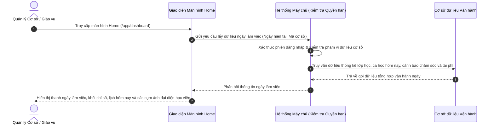

# US-OPS-01-01: Màn hình Home Ngày làm việc (Workday Operations Cockpit)

> **Tham chiếu:** `BF-OPS-01` · `SR-PERSONA-BRANCH_MANAGER`  
> **Đường dẫn màn hình & Trạng thái liên quan:**  
> - `/app/dashboard` -> Trạng thái: `Hoạt động bình thường`

---

## 1. NHẬT KÝ THAY ĐỔI & BỐI CẢNH (CHANGELOG & CONTEXT)

### Lịch sử cập nhật tài liệu (Changelog)

| Ngày cập nhật | Nội dung cập nhật | Lý do cập nhật |
|---|---|---|
| 08/10/2026 | Khởi tạo tài liệu đặc tả màn hình Home theo định hướng Ngày làm việc | Chuẩn hóa bảng điều khiển vận hành cơ sở hằng ngày |

### Bối cảnh & Vấn đề nghiệp vụ (Context & Problem)
* **Bối cảnh:** Nhân sự phụ trách cơ sở (Quản lý cơ sở, Giáo vụ, Chuyên viên chăm sóc) bắt đầu ngày làm việc cần một điểm chạm tập trung để nắm bắt toàn bộ nhịp điệu vận hành trong ngày, phát hiện các điểm nghẽn học viên và điều phối ca học kịp thời.
* **Vấn đề hiện tại:** Trước đây hệ thống chưa có màn hình tổng hợp tác nghiệp ngày làm việc, người dùng phải chuyển qua lại giữa nhiều phân hệ (Lịch học, Danh sách lớp, Chăm sóc học viên, Tái phí, Đơn nghỉ phép) gây phân tán thời gian và dễ bỏ sót các ca học hoặc học viên cần can thiệp khẩn cấp.
* **Mục tiêu & Giá trị mang lại:** Cung cấp màn hình Bàn làm việc số (Workday Cockpit) tổng hợp: Thống kê lớp học trọng yếu, Lịch các buổi học diễn ra hôm nay (kèm ca test và học thử), Cụm hiển thị ảnh đại diện học viên cần chăm sóc và tái phí để xem nhanh, Danh sách lớp học quản lý và Bảng công việc cần xử lý trong ngày. Ở mỗi phần đều có khả năng mở xem nhanh chi tiết hoặc chuyển tới trang chuyên sâu.

### Hiểu người dùng & Tình huống sử dụng (User Needs & Use Cases)
* **Người dùng chính (Persona):** `PERSONA-BRANCH_MANAGER`, `PERSONA-TEACHER`, `PERSONA-CSM`
* **Nhu cầu thực tế (Needs):** Muốn mở hệ thống đầu ngày là thấy ngay việc cần làm, các ca học sắp diễn ra tại cơ sở, các bạn học sinh vắng hoặc sắp hết phí mà không bị quá tải thông tin dạng bảng dài.
* **Câu phát biểu nghiệp vụ:** **Là một** Quản lý cơ sở hoặc Giáo vụ, **tôi muốn** có một màn hình tổng quan ngày làm việc tích hợp thống kê lớp học, lịch buổi học hôm nay và danh sách học viên trọng điểm dạng ảnh đại diện, **để** chủ động điều phối vận hành và can thiệp kịp thời các phát sinh trong ngày.

### Phạm vi kiểm soát (Scope)
* **Phạm vi hiển thị:** Màn hình Home tại đường dẫn `/app/dashboard`, tích hợp dữ liệu từ cơ sở dữ liệu lớp học, cơ sở dữ liệu lịch học, cơ sở dữ liệu cảnh báo chăm sóc và tái phí, cùng danh sách công việc trong ngày.

---

## 2. LUỒNG XỬ LÝ CHÍNH (MAIN FLOW - HAPPY PATH)

---

## 3. GIAO DIỆN & KIỂM SOÁT QUYỀN HẠN (UI & CAPABILITY GATING)

### 3.1. Cấu trúc các vùng giao diện & Ràng buộc Quyền hạn (Capability Gating)

Màn hình áp dụng cơ chế kiểm soát hiển thị theo Mã Quyền Động (Atomic Permissions):

| Vùng Giao diện / Nút Thao Tác | Loại Hiển Thị | Mã Quyền Yêu Cầu (Required Capability) | Xử Lý Khi Không Đủ Quyền |
| :--- | :--- | :--- | :--- |
| **Truy cập Màn hình `/app/dashboard`** | Toàn bộ giao diện | `ops.workday.view` | Chặn truy cập, hiển thị màn hình từ chối quyền truy cập |
| **Bộ chọn Cơ sở & Bộ chọn Ngày** | Thanh công cụ ngày làm việc | `ops.workday.switch_scope` | Cố định cơ sở theo phạm vi tài khoản |
| **Khối Thống kê Lớp học trên cùng** | Khối thẻ chỉ số | `class.record.view` | Ẩn thẻ chỉ số hoặc hiển thị gạch ngang |
| **Khối Lịch Buổi học Hôm nay** | Bảng thẻ ca học theo khung giờ | `calendar.schedule.view` | Ẩn danh sách ca học |
| **Khối Học viên Cần Chăm sóc (Ảnh đại diện)** | Cụm ảnh đại diện có nhãn cảnh báo | `care.alert.view` | Ẩn khối chăm sóc học viên |
| **Khối Học viên Cần Tái phí (Ảnh đại diện)** | Cụm ảnh đại diện có nhãn tài chính | `renewal.alert.view` | Ẩn khối tái phí học viên |
| **Khối Lớp học Quản lý** | Bảng danh sách lớp tóm tắt | `class.record.view` | Ẩn danh sách lớp quản lý |
| **Mở Hộp thoại / Khung trượt Chi tiết** | Hộp thoại nổi xem nhanh | `ops.detail.view` | Không kích hoạt mở hộp thoại |

---

## 4. KHỐI CHỨC NĂNG CHI TIẾT: ACTION & LUỒNG KÍCH HOẠT (ACTIONS & EVENTS)

### Khối chức năng 1: Điều hướng Ngày làm việc và Cơ sở

#### Action 1.1: Chọn Ngày làm việc
* **Luồng kích hoạt:** Người dùng bấm vào nút chuyển ngày (Hôm nay, Ngày mai, Hôm qua hoặc mở lịch chọn ngày), hệ thống nạp lại thông tin theo ngày được chọn.
* **Tiêu chí nghiệm thu (Acceptance Criteria):**
  - **AC-1 (Happy Path - Chuyển ngày thành công):**
    - **Giả sử:** Người dùng đang ở màn hình Home của ngày hiện tại.
    - **Khi:** Người dùng nhấn nút chuyển sang ngày kế tiếp.
    - **Thì:** Giao diện cập nhật tiêu đề ngày làm việc và gọi đến cơ sở dữ liệu lịch học để hiển thị danh sách ca học thuộc ngày mới.

### Khối chức năng 2: Theo dõi Lịch Buổi học Hôm nay

#### Action 2.1: Lọc ca học theo khung thời gian
* **Luồng kích hoạt:** Người dùng chọn tab lọc ca học (Tất cả ca, Ca sáng, Ca chiều, Ca tối, Lịch test và học thử).
* **Tiêu chí nghiệm thu:**
  - **AC-1 (Happy Path - Lọc ca học theo buổi):**
    - **Giả sử:** Danh sách lịch hôm nay có các ca học sáng, chiều và tối.
    - **Khi:** Người dùng nhấn chọn tab "Ca tối".
    - **Thì:** Giao diện chỉ hiển thị các ca học bắt đầu từ mười tám giờ trở đi.

#### Action 2.2: Mở xem nhanh chi tiết ca học
* **Luồng kích hoạt:** Người dùng nhấn vào nút xem chi tiết trên thẻ ca học.
* **Tiêu chí nghiệm thu:**
  - **AC-1 (Happy Path - Mở hộp thoại chi tiết ca học):**
    - **Giả sử:** Thẻ ca học đang hiển thị trên màn hình.
    - **Khi:** Người dùng nhấn vào nút xem chi tiết của thẻ ca học.
    - **Thì:** Hệ thống mở hộp thoại nổi hiển thị thông tin phòng học, giáo viên chính, giáo viên dạy thay, danh sách học viên điểm danh và giáo trình bài học.

### Khối chức năng 3: Tác nghiệp Học viên Cần Chăm sóc (Hiển thị Ảnh đại diện)

#### Action 3.1: Rê chuột xem thẻ thông tin nhanh học viên chăm sóc
* **Luồng kích hoạt:** Người dùng di chuyển chuột lên ảnh đại diện của một học viên trong cụm học viên cần chăm sóc.
* **Tiêu chí nghiệm thu:**
  - **AC-1 (Happy Path - Hiển thị thẻ tóm tắt):**
    - **Giả sử:** Khối học viên cần chăm sóc đang hiển thị các ảnh đại diện học viên có nhãn cảnh báo.
    - **Khi:** Người dùng rê chuột vào ảnh đại diện của một học viên.
    - **Thì:** Hệ thống bung thẻ thông tin nổi hiển thị tên học viên, lớp học, lý do cảnh báo, số điện thoại phụ huynh đã che và nút thực hiện cuộc gọi.

#### Action 3.2: Nhấp ảnh đại diện mở hồ sơ chi tiết học viên
* **Luồng kích hoạt:** Người dùng nhấn chuột vào ảnh đại diện học viên.
* **Tiêu chí nghiệm thu:**
  - **AC-1 (Happy Path - Mở khung trượt hồ sơ học viên):**
    - **Giả sử:** Người dùng đang xem cụm ảnh đại diện học viên cần chăm sóc.
    - **Khi:** Người dùng nhấn chuột vào một ảnh đại diện học viên.
    - **Thì:** Hệ thống mở khung trượt hiển thị toàn bộ lịch sử chăm sóc và nhật ký trao đổi của học viên đó.

### Khối chức năng 4: Tác nghiệp Học viên Cần Tái phí (Hiển thị Ảnh đại diện)

#### Action 4.1: Rê chuột xem thẻ thông tin nhanh học viên tái phí
* **Luồng kích hoạt:** Người dùng di chuyển chuột lên ảnh đại diện trong cụm học viên cần tái phí.
* **Tiêu chí nghiệm thu:**
  - **AC-1 (Happy Path - Hiển thị thẻ tóm tắt tái phí):**
    - **Giả sử:** Khối học viên cần tái phí đang hiển thị các ảnh đại diện học viên sắp hết buổi học.
    - **Khi:** Người dùng rê chuột vào một ảnh đại diện.
    - **Thì:** Hệ thống bung thẻ thông tin nổi hiển thị tên học viên, số buổi còn lại, ngày dự kiến hết hạn và gói học liên quan.

#### Action 4.2: Nhấp ảnh đại diện mở chi tiết tái phí
* **Luồng kích hoạt:** Người dùng nhấn chuột vào ảnh đại diện học viên cần tái phí.
* **Tiêu chí nghiệm thu:**
  - **AC-1 (Happy Path - Mở khung trượt thông tin tái phí):**
    - **Giả sử:** Ảnh đại diện học viên cần tái phí đang hiển thị.
    - **Khi:** Người dùng nhấn vào ảnh đại diện học viên.
    - **Thì:** Hệ thống mở khung trượt chi tiết hiển thị quá trình tư vấn tái phí và đơn hàng liên kết.

### Khối chức năng 5: Theo dõi Lớp học Quản lý

#### Action 5.1: Mở chi tiết lớp học quản lý
* **Luồng kích hoạt:** Người dùng nhấn vào thẻ lớp học hoặc nút xem chi tiết lớp.
* **Tiêu chí nghiệm thu:**
  - **AC-1 (Happy Path - Mở hộp thoại thông tin lớp):**
    - **Giả sử:** Danh sách lớp học quản lý đang hiển thị trên màn hình.
    - **Khi:** Người dùng nhấn vào một thẻ lớp học.
    - **Thì:** Hệ thống mở hộp thoại nổi chi tiết thông tin lớp học, tiến độ đào tạo và danh sách giảng viên phụ trách.

---

## 5. CÁC TRƯỜNG HỢP GÓC CẠNH & LUỒNG NGOẠI LỆ (CORNER CASES & EXCEPTION FLOWS)

- **[CASE-01] Cơ sở không có ca học nào trong ngày được chọn:**
  - *Tình huống:* Ngày được chọn rơi vào ngày nghỉ lễ hoặc cơ sở tạm đóng cửa bảo trì.
  - *Cách xử lý:* Khối lịch buổi học hôm nay hiển thị giao diện trạng thái trống kèm thông điệp "Hôm nay không có ca học nào diễn ra tại cơ sở" và nút chuyển sang ngày làm việc kế tiếp.
- **[CASE-02] Không có học viên nào phát sinh cảnh báo chăm sóc hoặc tái phí:**
  - *Tình huống:* Tất cả học viên đều có chuyên cần tốt và còn nhiều buổi học.
  - *Cách xử lý:* Cụm ảnh đại diện hiển thị thông báo tích cực "Tất cả học viên đều duy trì trạng thái tốt, không có cảnh báo tồn đọng".
- **[CASE-03] Mất kết nối mạng khi đang tải bảng điều khiển ngày làm việc:**
  - *Tình huống:* Đường truyền mạng bị ngắt quãng trong quá trình gọi đến cơ sở dữ liệu vận hành.
  - *Cách xử lý:* Giao diện hiển thị khối báo lỗi kèm nút bấm thử lại để tải lại dữ liệu mà không làm mất trạng thái cơ sở đã chọn.
- **[CASE-04] Người dùng không có quyền truy cập vào phân hệ chăm sóc hoặc tái phí:**
  - *Tình huống:* Tài khoản giáo viên bộ môn truy cập màn hình Home nhưng không được phân quyền xem cảnh báo tài chính tái phí.
  - *Cách xử lý:* Hệ thống tự động ẩn khối ảnh đại diện tái phí và tự động co giãn các khối giao diện còn lại để đảm bảo tính thẩm mỹ của trang.
