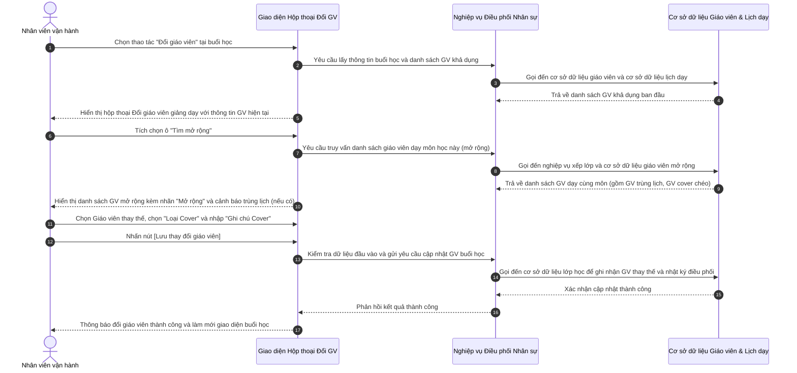

# US-OPS03-07: Hộp thoại điều phối nhân sự giảng dạy (Đổi giáo viên giảng dạy)

> **Tham chiếu:** BF-CLS-02 · SR-OPERATOR-001 · Giao diện Mẫu §4.4 (Biểu mẫu / Hộp thoại biểu mẫu)
> **Đường dẫn màn hình & Trạng thái liên quan:**
> - `Màn hình Chi tiết Lớp học -> Tab Buổi học -> Thao tác Đổi giáo viên` -> Trạng thái buổi học: `Sắp diễn ra`, `Đang diễn ra`

---

## 1. NHẬT KÝ THAY ĐỔI & BỐI CẢNH (CHANGELOG & CONTEXT)

### Lịch sử cập nhật tài liệu (Changelog)

| Ngày cập nhật | Nội dung cập nhật | Lý do cập nhật |
|---|---|---|
| 04/08/2026 | Biên tập nghiệp vụ Đổi giáo viên giảng dạy: chuyển đổi tùy chọn "Dạy Cover" thành tùy chọn "Tìm mở rộng", bổ sung nhãn "Mở rộng" đối với các giáo viên thuộc danh sách mở rộng và thêm ghi chú giải thích cơ chế tìm kiếm | Chuẩn hóa nghiệp vụ điều phối nhân sự, giúp người dùng dễ dàng tìm kiếm giáo viên thay thế khi phát sinh đột xuất |

### Bối cảnh & Vấn đề nghiệp vụ (Context & Problem)
* **Bối cảnh:** Trong quá trình vận hành trung tâm, lớp học đến giờ giảng dạy nhưng giáo viên chính phát sinh sự cố đột xuất (ốm đau, bận việc khẩn cấp) hoặc cần thay thế người dạy cho buổi học. Nhân sự vận hành cần thao tác nhanh trên giao diện để tìm và chọn giáo viên thay thế phù hợp.
* **Vấn đề hiện tại:** Trước đây, tùy chọn tìm kiếm giáo viên dạy thay chỉ hiển thị danh sách giáo viên khả dụng cơ bản hoặc gắn nhãn dạy cover chưa làm rõ phạm vi tìm kiếm. Khi số lượng giáo viên trong ca học hạn chế, nhân sự vận hành khó xác định giáo viên nào dạy cùng môn nhưng đang có lịch trùng hoặc giáo viên cover chéo để linh hoạt điều phối.
* **Mục tiêu & Giá trị mang lại:** Chuyển đổi cơ chế tìm kiếm sang tính năng **"Tìm mở rộng"**. Khi tích chọn **Tìm mở rộng**, hệ thống tự động quét toàn bộ giáo viên dạy môn học này (bao gồm cả giáo viên đang có lịch trùng ca, giáo viên dạy cover chéo...), đồng thời gắn nhãn **"Mở rộng"** trực quan giúp nhân sự vận hành nhanh chóng chọn người thay thế, giảm thiểu rủi ro lớp học bị hủy.

### Hiểu người dùng & Tình huống sử dụng (User Needs & Use Cases)
* **Người dùng chính (Persona):** Quản lý cơ sở, Nhân viên vận hành trung tâm (PERSONA-OPERATOR)
* **Khó khăn lớn nhất (Pain-points):** Khó tìm giáo viên dạy thay trong các tình huống phát sinh khẩn cấp; không phân biệt được giáo viên khả dụng bình thường và giáo viên cần điều phối mở rộng (có lịch trùng hoặc dạy cover).
* **Nhu cầu thực tế (Needs):** Mong muốn có nút bật tìm kiếm mở rộng kèm dòng ghi chú rõ ràng về phạm vi tìm kiếm, có nhãn phân biệt giáo viên mở rộng để chủ động liên hệ thỏa thuận ca dạy.
* **Câu phát biểu nghiệp vụ:** **Là một** Quản lý cơ sở hoặc Nhân viên vận hành trung tâm, **tôi muốn** mở hộp thoại Đổi giáo viên giảng dạy và bật tùy chọn Tìm mở rộng, **để** hệ thống hiển thị toàn bộ danh sách giáo viên dạy môn này (kèm nhãn Mở rộng và cảnh báo lịch trùng nếu có) giúp tôi chọn giáo viên thay thế phù hợp cho buổi học.

### Phạm vi kiểm soát (Scope)
* **Phạm vi đầu vào:** Buổi học được chọn từ danh sách buổi học của lớp, thông tin giáo viên hiện tại, danh sách giáo viên khả dụng và danh sách giáo viên mở rộng.
* **Ràng buộc nghiệp vụ toàn cục (Global Rules):**
  > [!IMPORTANT]
  > **Lưu ý di trú:**
  > Kế thừa toàn bộ ràng buộc nghiệp vụ từ hệ thống cũ đối với việc phân công giáo viên và lưu lịch sử thay đổi nhân sự giảng dạy.
  - **[RULE-TEACHER-01] Ràng buộc chọn giáo viên thay thế:** Giáo viên thay thế được chọn phải khác với giáo viên hiện tại của buổi học.
  - **[RULE-TEACHER-02] Cơ chế tìm mở rộng:** Khi tích chọn ô "Tìm mở rộng", hệ thống quét danh sách giáo viên giảng dạy môn học này (bao gồm cả giáo viên đang có lịch trùng ca, giáo viên dạy cover chéo). Các giáo viên thuộc danh sách mở rộng phải hiển thị kèm nhãn "Mở rộng" để người dùng nhận biết.
  - **[RULE-TEACHER-03] Ràng buộc Loại Cover:** Nếu người dùng chọn giáo viên từ danh sách mở rộng hoặc thay đổi giáo viên khác với giáo viên phân công ban đầu, trường "Loại Cover" là bắt buộc phải chọn.

---

## 2. LUỒNG XỬ LÝ CHÍNH (MAIN FLOW - HAPPY PATH)

*Mô tả luồng đi của người dùng từ khi mở hộp thoại đổi giáo viên, sử dụng tính năng tìm mở rộng, chọn giáo viên thay thế và lưu thành công.*

---

## 3. GIAO DIỆN & TRẠNG THÁI TĨNH (DATA & UI STATE)

### 3.1. Thiết kế trực quan (Figma)
* **Link/Hình ảnh Figma:** Tham chiếu hình ảnh thiết kế hộp thoại Đổi giáo viên giảng dạy trong tài liệu thiết kế giao diện Station.

### 3.2. Cấu trúc các trường nhập liệu & Quy tắc kiểm tra (Validation Rules)
*Bố cục biểu mẫu: Hộp thoại nổi (Modal)*

| Tên trường thông tin | Kiểu hiển thị | Bắt buộc | Nguồn dữ liệu | Định dạng & Độ dài (Min/Max) | Ràng buộc Duy nhất (Unique) | Diễn giải quy tắc kiểm duyệt dữ liệu |
|---|---|---|---|---|---|---|
| Thông tin buổi học & Giờ dạy | Chữ cố định (Read-only) | Có | Hệ thống tự điền | Định dạng ngày `DD/MM/YYYY (HH:mm - HH:mm)` | Không | Hiển thị thời gian diễn ra buổi học ở phần trên cùng hộp thoại. |
| Chương trình học | Chữ cố định (Read-only) | Có | Hệ thống tự điền | Văn bản ngắn | Không | Hiển thị tên môn học / chương trình của lớp. |
| Giáo viên hiện tại | Khối thông tin (Read-only) | Có | Hệ thống tự điền | Tên giáo viên | Không | Hiển thị họ tên giáo viên đang được phân công dạy buổi học này. |
| Ô chọn Tìm mở rộng | Ô tích chọn (Checkbox) | Không | Người dùng chọn | Bật / Tắt | Không | Khi bật, mở rộng truy vấn tìm toàn bộ GV dạy môn học này (gồm GV trùng lịch, GV Cover chéo). Đi kèm dòng ghi chú hướng dẫn bên dưới. |
| Chọn Giáo viên giảng dạy thay thế | Ô chọn kèm danh sách thả xuống (Search Select) | Có | Gọi đến cơ sở dữ liệu giáo viên | Tên + Mã GV | Không | Hiển thị danh sách giáo viên khả dụng hoặc danh sách mở rộng. Mỗi giáo viên mở rộng hiển thị nhãn "Mở rộng" màu xanh và cảnh báo trùng lịch nếu có. |
| Loại Cover | Ô chọn thả xuống (Dropdown Select) | Có | Danh mục hệ thống | Danh mục chọn 1 giá trị | Không | Bao gồm các lựa chọn: `Cover 1A - Báo trước ngày học`, `Cover 1B - Báo trong ngày học, trước 17h30`, `Cover 2 - Báo 30 phút trước giờ học`, `COVER3A - Add GV cover khi lớp đã diễn ra (sau mốc ST) - GV không vào lớp`, `COVER3B - Add GV cover khi lớp đã diễn ra (sau mốc ST) - GV vào lớp dạy 5-10 phút thì bị lỗi KT`. |
| Ghi chú Cover | Ô nhập văn bản nhiều dòng (Textarea) | Không | Người dùng nhập | Văn bản, tối đa 500 ký tự | Không | Nhập lý do thay thế hoặc ghi chú nội bộ điều phối. |

### 3.3. Nút hành động biểu mẫu
| Tên nút | Kiểu hiển thị | Logic xử lý nghiệp vụ | Điều kiện hiển thị | Mobile Responsive |
|---------|---------------|-----------------------|---------------------|-------------------|
| Hủy | Nút viền nhạt | Đóng hộp thoại, không lưu thông tin thay đổi. | Luôn hiển thị | Hiển thị đầy đủ |
| Lưu thay đổi giáo viên | Nút màu nhấn | Kiểm tra thông tin bắt buộc → Gửi dữ liệu cập nhật giáo viên thay thế → Đóng hộp thoại → Tải lại danh sách buổi học. | Luôn hiển thị | Hiển thị đầy đủ |

### 3.4. Ma trận phân quyền (Permission Matrix)

| Vai trò người dùng | Mở hộp thoại Đổi giáo viên | Bật Tìm mở rộng | Chọn GV & Thực hiện Lưu |
|---|:---:|:---:|:---:|
| **Quản trị viên (Admin)** | ✅ | ✅ | ✅ |
| **Quản lý cơ sở (Branch Manager)** | ✅ | ✅ | ✅ |
| **Nhân viên vận hành (Operator / CSM)** | ✅ | ✅ | ✅ |
| **Giáo viên (Teacher)** | ❌ | ❌ | ❌ |

---

## 4. KHỐI CHỨC NĂNG CHI TIẾT: ACTION & LUỒNG KÍCH HOẠT (ACTIONS & EVENTS)

### Khối chức năng 1: Tương tác và Lưu đổi Giáo viên giảng dạy

#### Action 1.1: Tích chọn ô "Tìm mở rộng"
* **Luồng kích hoạt (Event/Flow):** Người dùng tích chọn ô "Tìm mở rộng". Giao diện gửi yêu cầu truy vấn danh sách giáo viên dạy môn học này rộng hơn phạm vi mặc định.
* **Quy tắc kiểm soát & Kiểm tra dữ liệu (Validation & Rules):**
  - Hệ thống tải danh sách giáo viên dạy môn học này (bao gồm cả giáo viên đang có lịch trùng ca, giáo viên dạy cover chéo).
  - Gắn nhãn **"Mở rộng"** rõ ràng bên cạnh mã giáo viên đối với các nhân sự thuộc danh sách mở rộng.
  - Hiển thị dòng ghi chú hướng dẫn: *"Hệ thống sẽ tìm các GV dạy môn học này (Bao gồm cả GV đang có lịch trùng, GV Cover chéo...)"*.
* **Tiêu chí nghiệm thu (Acceptance Criteria):**
  - **AC-1 (Happy Path - Kích hoạt Tìm mở rộng thành công):**
    - **Giả sử:** Hộp thoại Đổi giáo viên giảng dạy đang mở và ô "Tìm mở rộng" chưa được tích chọn.
    - **Khi:** Người dùng tích chọn vào ô "Tìm mở rộng".
    - **Thì:** Danh sách chọn giáo viên cập nhật bổ sung các giáo viên dạy môn này (kèm nhãn "Mở rộng" nổi bật), đồng thời hiển thị dòng ghi chú hướng dẫn ngay bên dưới nhãn chọn.
  - **AC-2 (Happy Path - Bỏ tích chọn Tìm mở rộng):**
    - **Giả sử:** Ô "Tìm mở rộng" đang được tích chọn.
    - **Khi:** Người dùng bỏ tích chọn ô "Tìm mở rộng".
    - **Thì:** Danh sách chọn giáo viên thu gọn về danh sách giáo viên khả dụng cơ bản, các giáo viên thuộc danh sách mở rộng không còn hiển thị.

#### Action 1.2: Bấm nút [Lưu thay đổi giáo viên]
* **Luồng kích hoạt (Event/Flow):** Người dùng bấm nút [Lưu thay đổi giáo viên] sau khi đã chọn giáo viên thay thế và loại cover.
* **Quy tắc kiểm soát & Kiểm tra dữ liệu (Validation & Rules):**
  - Chặn không cho lưu nếu trường "Chọn Giáo viên giảng dạy thay thế" hoặc "Loại Cover" chưa được chọn.
* **Tiêu chí nghiệm thu (Acceptance Criteria):**
  - **AC-1 (Happy Path - Lưu đổi giáo viên thành công):**
    - **Giả sử:** Người dùng đã chọn Giáo viên thay thế hợp lệ và chọn Loại Cover.
    - **Khi:** Người dùng click nút [Lưu thay đổi giáo viên].
    - **Thì:** Giao diện đóng hộp thoại, hiển thị thông báo thành công "Lưu thay đổi giáo viên thành công", làm mới danh sách buổi học để cập nhật tên giáo viên mới.
  - **AC-2 (Alternate Path - Lỗi bỏ trống Loại Cover):**
    - **Giả sử:** Người dùng đã chọn Giáo viên thay thế nhưng chưa chọn "Loại Cover".
    - **Khi:** Người dùng click nút [Lưu thay đổi giáo viên].
    - **Thì:** Trường Loại Cover hiển thị viền đỏ và dòng cảnh báo "Vui lòng chọn Loại Cover!", chặn không cho gửi lưu.

#### Action 1.3: Bấm nút [Hủy]
* **Luồng kích hoạt (Event/Flow):** Người dùng bấm nút [Hủy] hoặc phím Esc.
* **Tiêu chí nghiệm thu (Acceptance Criteria):**
  - **AC-1 (Happy Path - Hủy bỏ thao tác thành công):**
    - **Giả sử:** Hộp thoại đang mở và người dùng không muốn tiếp tục đổi giáo viên.
    - **Khi:** Người dùng click nút [Hủy].
    - **Thì:** Hộp thoại đóng lại ngay lập tức, giữ nguyên giáo viên ban đầu của buổi học.

---

## 5. CÁC TRƯỜNG HỢP GÓC CẠNH (CORNER CASES)

- **[CASE-01] Giáo viên mở rộng trùng lịch dạy ca học khác (Exception Flow - Schedule Conflict):**
  - *Tình huống:* Giáo viên trong danh sách mở rộng đang có ca dạy khác trùng khung giờ với buổi học hiện tại.
  - *Cách xử lý:* Hệ thống hiển thị dòng cảnh báo màu cam dưới tên giáo viên trong danh sách thả xuống (ví dụ: `⚠️ Trùng lịch dạy lớp IELTS-A2 (18:00 - 19:30)`). Người dùng vẫn có thể chọn nếu có phương án điều phối chéo, nhưng hệ thống ghi nhận cảnh báo vào nhật ký điều phối.
- **[CASE-02] Không tìm thấy giáo viên nào trong danh sách mở rộng (Exception Flow - No Available Expanded Teacher):**
  - *Tình huống:* Khi bật "Tìm mở rộng", hệ thống truy vấn nhưng không có giáo viên nào dạy môn học này khả dụng.
  - *Cách xử lý:* Danh sách thả xuống hiển thị khung thông báo chìm: *"Không tìm thấy giáo viên phù hợp"*.
- **[CASE-03] Mất kết nối mạng khi nhấn Lưu (Exception Flow - Network Loss):**
  - *Tình huống:* Người dùng nhấn [Lưu thay đổi giáo viên] đúng lúc mất kết nối internet.
  - *Cách xử lý:* Hiển thị thông báo lỗi kết nối, giữ nguyên dữ liệu đã nhập trên hộp thoại để người dùng thử lại sau khi mạng ổn định.
- **[CASE-04] Chọn lại giáo viên ban đầu của buổi học (Exception Flow - Reset to Primary Teacher):**
  - *Tình huống:* Người dùng chọn lại chính tên giáo viên ban đầu của buổi học.
  - *Cách xử lý:* Hệ thống tự động xóa thông tin giáo viên thay thế và loại cover, đưa buổi học trở về phân công ban đầu.
- **[CASE-05] Đóng hộp thoại khi đã thay đổi thông tin chưa lưu (Exception Flow - Unsaved Confirmation):**
  - *Tình huống:* Người dùng đã chọn giáo viên thay thế mới nhưng nhấn phím Esc hoặc click ra ngoài.
  - *Cách xử lý:* Đóng hộp thoại và không áp dụng các thay đổi chưa lưu.
