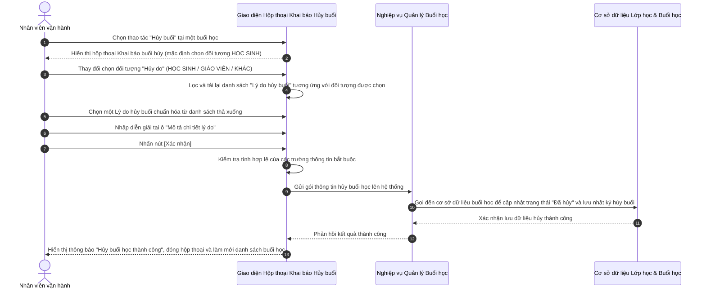

# US-OPS03-10: Hộp thoại khai báo hủy buổi học lẻ

> **Tham chiếu:** BF-CLS-02 · SR-OPERATOR-001 · Giao diện Mẫu §4.4 (Biểu mẫu / Hộp thoại biểu mẫu)
> **Đường dẫn màn hình & Trạng thái liên quan:**
> - `Màn hình Chi tiết Lớp học -> Tab Buổi học -> Thao tác Hủy buổi` -> Trạng thái buổi học: `Sắp diễn ra`, `Đang diễn ra`

---

## 1. NHẬT KÝ THAY ĐỔI & BỐI CẢNH (CHANGELOG & CONTEXT)

### Lịch sử cập nhật tài liệu (Changelog)

| Ngày cập nhật | Nội dung cập nhật | Lý do cập nhật |
|---|---|---|
| 04/08/2026 | Biên tập nghiệp vụ Khai báo hủy buổi học lẻ: phân loại chi tiết lý do hủy theo từng đối tượng hủy (Học sinh, Giáo viên, Khác), bổ sung tiêu chí kiểm duyệt và các trường hợp góc cạnh | Chuẩn hóa quy trình ghi nhận hủy buổi học, hỗ trợ theo dõi nguyên nhân hủy ca và đối soát công nợ / quy đổi buổi bù |

### Bối cảnh & Vấn đề nghiệp vụ (Context & Problem)
* **Bối cảnh:** Trong quá trình triển khai lớp học, có những buổi học phải hủy đột xuất hoặc báo hủy trước do các lý do xuất phát từ phía học sinh, giáo viên hoặc sự cố khách quan của trung tâm. Nhân sự vận hành cần ghi nhận chính xác đối tượng gây ra việc hủy buổi và lý do chi tiết.
* **Vấn đề hiện tại:** Nếu không phân loại rõ đối tượng hủy và danh mục lý do hủy, hệ thống khó đối soát việc hoàn trả quota học phí cho học sinh, tính lương/phạt đối với giáo viên nghỉ không báo trước, hoặc thống kê nguyên nhân sự cố kỹ thuật để cải thiện chất lượng dịch vụ.
* **Mục tiêu & Giá trị mang lại:** Xây dựng biểu mẫu **"Khai báo buổi hủy"** phân nhánh danh mục lý do hủy động theo từng đối tượng chọn (Học sinh, Giáo viên, Khác). Giúp ghi nhận dữ liệu chính xác, minh bạch nhật ký hủy ca và làm căn cứ xử lý hệ quả nghiệp vụ (tự động khôi phục quota, mở đăng ký học bù hoặc ghi nhận lỗi vận hành).

### Hiểu người dùng & Tình huống sử dụng (User Needs & Use Cases)
* **Người dùng chính (Persona):** Quản lý cơ sở, Nhân viên vận hành trung tâm, Nhân viên CSKH (PERSONA-OPERATOR)
* **Khó khăn lớn nhất (Pain-points):** Nhập lý do hủy không đồng nhất, khó phân biệt lỗi do học sinh nghỉ hay do giáo viên nghỉ gấp, dẫn đến tranh chấp khi tính tiền học hoặc sắp xếp lịch bù.
* **Nhu cầu thực tế (Needs):** Mong muốn khi chọn đối tượng hủy (Học sinh / Giáo viên / Khác) thì danh sách lý do hủy tự động thay đổi tương ứng với các tùy chọn chuẩn hóa và yêu cầu bắt buộc nhập mô tả chi tiết.
* **Câu phát biểu nghiệp vụ:** **Là một** Nhân viên vận hành trung tâm hoặc Quản lý cơ sở, **tôi muốn** mở hộp thoại Khai báo buổi hủy và chọn đúng đối tượng hủy kèm lý do chuẩn hóa, **để** hệ thống lưu trữ nhật ký hủy buổi phục vụ đối soát và xử lý quyền lợi học tập cho các bên.

### Phạm vi kiểm soát (Scope)
* **Phạm vi đầu vào:** Buổi học được chọn hủy từ danh sách buổi học, đối tượng gây hủy buổi, danh mục lý do hủy tương ứng và văn bản mô tả chi tiết.
* **Ràng buộc nghiệp vụ toàn cục (Global Rules):**
  > [!IMPORTANT]
  > **Lưu ý di trú:**
  > Kế thừa toàn bộ quy tắc phân loại đối tượng hủy và danh mục lý do hủy từ hệ thống vận hành cũ.
  - **[RULE-CANCEL-01] Phân nhánh lý do theo đối tượng hủy:** Danh sách lý do hủy phải phụ thuộc trực tiếp vào đối tượng hủy được chọn ở trường "Hủy do".
  - **[RULE-CANCEL-02] Danh mục lý do do Học sinh (HỌC SINH):** Bao gồm: `Cancel 10 phút`, `Cancel 20 phút`, `Học sinh nghỉ đột xuất`, `Học sinh gặp sự cố kỹ thuật trong giờ (trước ST+15/30)`, `Học sinh gặp sự cố kỹ thuật trong giờ (sau ST+15/30)`.
  - **[RULE-CANCEL-03] Danh mục lý do do Giáo viên (GIÁO VIÊN):** Bao gồm: `Hủy 1A - Báo trước ngày học`, `Hủy 1B - Báo trong ngày học, trước 17h30`, `Hủy 2 - Báo trước 30 phút trước giờ học`, `Hủy 3A - Giáo viên không vào lớp`, `Hủy 3B - Giáo viên vào lớp nhưng xin nghỉ đột xuất`, `Giáo viên gặp sự cố kỹ thuật trong giờ (trước ST+15/30)`, `Giáo viên gặp sự cố kỹ thuật trong giờ (sau ST+15/30)`.
  - **[RULE-CANCEL-04] Lý do do sự cố khách quan (KHÁC):** Tự động gán lý do cố định `Hủy do các sự cố khách quan khác` (mất điện, sự cố đường truyền hệ thống toàn cơ sở, thiên tai).
  - **[RULE-CANCEL-05] Ràng buộc mô tả chi tiết:** Trường "Mô tả chi tiết lý do" là bắt buộc phải nhập đối với tất cả đối tượng hủy.

---

## 2. LUỒNG XỬ LÝ CHÍNH (MAIN FLOW - HAPPY PATH)

*Mô tả luồng đi của người dùng từ khi mở hộp thoại hủy buổi, chọn đối tượng, chọn lý do phù hợp, nhập mô tả chi tiết và xác nhận hủy thành công.*

---

## 3. GIAO DIỆN & TRẠNG THÁI TĨNH (DATA & UI STATE)

### 3.1. Thiết kế trực quan (Figma)
* **Link/Hình ảnh Figma:** Tham chiếu thiết kế hộp thoại Khai báo buổi hủy trong bộ thiết kế giao diện Station.

### 3.2. Cấu trúc các trường nhập liệu & Quy tắc kiểm tra (Validation Rules)
*Bố cục biểu mẫu: Hộp thoại nổi (Modal)*

| Tên trường thông tin | Kiểu hiển thị | Bắt buộc | Nguồn dữ liệu | Định dạng & Độ dài (Min/Max) | Ràng buộc Duy nhất (Unique) | Diễn giải quy tắc kiểm duyệt dữ liệu |
|---|---|---|---|---|---|---|
| Hủy do | Ô chọn thả xuống (Dropdown Select) | Có | Danh mục hệ thống | Danh mục chọn 1: `HỌC SINH`, `GIÁO VIÊN`, `KHÁC` | Không | Xác định đối tượng chính gây ra việc hủy buổi học. Mặc định chọn `HỌC SINH`. |
| Lý do hủy buổi | Ô chọn thả xuống hoặc Ô nhập bị khóa (Dropdown / Disabled Input) | Có | Danh mục hệ thống theo đối tượng | Chọn 1 giá trị danh mục phù hợp | Không | Thay đổi động theo đối tượng chọn ở ô "Hủy do". Nếu chọn "KHÁC", ô này bị khóa và hiển thị chuỗi cố định `Hủy do các sự cố khách quan khác`. |
| Mô tả chi tiết lý do | Ô nhập văn bản nhiều dòng (Textarea) | Có | Người dùng nhập | Văn bản, 5 - 500 ký tự | Không | Nhập lý do cụ thể, mã ticket hỗ trợ hoặc chi tiết sự cố. Báo lỗi nếu bỏ trống. |

### 3.3. Nút hành động biểu mẫu
| Tên nút | Kiểu hiển thị | Logic xử lý nghiệp vụ | Điều kiện hiển thị | Mobile Responsive |
|---------|---------------|-----------------------|---------------------|-------------------|
| Đóng | Nút viền nhạt | Đóng hộp thoại hủy buổi, không thay đổi trạng thái buổi học. | Luôn hiển thị | Hiển thị đầy đủ |
| Xác nhận | Nút màu nhấn | Kiểm tra các trường bắt buộc → Gửi yêu cầu hủy buổi học → Đóng hộp thoại → Cập nhật nhãn trạng thái buổi học thành Đã hủy. | Luôn hiển thị | Hiển thị đầy đủ |

### 3.4. Ma trận phân quyền (Permission Matrix)

| Vai trò người dùng | Mở hộp thoại Hủy buổi | Chọn đối tượng & Lý do hủy | Nhấn Xác nhận hủy |
|---|:---:|:---:|:---:|
| **Quản trị viên (Admin)** | ✅ | ✅ | ✅ |
| **Quản lý cơ sở (Branch Manager)** | ✅ | ✅ | ✅ |
| **Nhân viên vận hành (Operator / CSM)** | ✅ | ✅ | ✅ |
| **Giáo viên (Teacher)** | ❌ | ❌ | ❌ |

---

## 4. KHỐI CHỨC NĂNG CHI TIẾT: ACTION & LUỒNG KÍCH HOẠT (ACTIONS & EVENTS)

### Khối chức năng 1: Tương tác và Khai báo Hủy buổi học

#### Action 1.1: Thay đổi trường "Hủy do"
* **Luồng kích hoạt (Event/Flow):** Người dùng thay đổi giá trị tại ô "Hủy do" từ `HỌC SINH` sang `GIÁO VIÊN` hoặc `KHÁC`.
* **Quy tắc kiểm soát & Kiểm tra dữ liệu (Validation & Rules):**
  - Khi chọn `HỌC SINH`: Danh sách "Lý do hủy buổi" cập nhật gồm 5 lý do thuộc nhóm Học sinh (`Cancel 10 phút`, `Cancel 20 phút`, `Học sinh nghỉ đột xuất`, `Học sinh gặp sự cố kỹ thuật trong giờ (trước ST+15/30)`, `Học sinh gặp sự cố kỹ thuật trong giờ (sau ST+15/30)`).
  - Khi chọn `GIÁO VIÊN`: Danh sách "Lý do hủy buổi" cập nhật gồm 7 lý do thuộc nhóm Giáo viên (`Hủy 1A - Báo trước ngày học`, `Hủy 1B - Báo trong ngày học, trước 17h30`, `Hủy 2 - Báo trước 30 phút trước giờ học`, `Hủy 3A - Giáo viên không vào lớp`, `Hủy 3B - Giáo viên vào lớp nhưng xin nghỉ đột xuất`, `Giáo viên gặp sự cố kỹ thuật trong giờ (trước ST+15/30)`, `Giáo viên gặp sự cố kỹ thuật trong giờ (sau ST+15/30)`).
  - Khi chọn `KHÁC`: Ô "Lý do hủy buổi" chuyển sang dạng ô nhập bị khóa hiển thị văn bản cố định `Hủy do các sự cố khách quan khác`.
* **Tiêu chí nghiệm thu (Acceptance Criteria):**
  - **AC-1 (Happy Path - Chuyển sang đối tượng GIÁO VIÊN):**
    - **Giả sử:** Hộp thoại Khai báo buổi hủy đang mở với đối tượng mặc định là `HỌC SINH`.
    - **Khi:** Người dùng chọn lại ô "Hủy do" thành `GIÁO VIÊN`.
    - **Thì:** Ô "Lý do hủy buổi" lập tức làm mới và hiển thị đúng 7 tùy chọn lý do do Giáo viên nghỉ.
  - **AC-2 (Happy Path - Chuyển sang đối tượng KHÁC):**
    - **Giả sử:** Người dùng chọn ô "Hủy do" thành `KHÁC`.
    - **Khi:** Thao tác chọn hoàn tất.
    - **Thì:** Ô "Lý do hủy buổi" mờ đi và tự động điền nội dung "Hủy do các sự cố khách quan khác".

#### Action 1.2: Bấm nút [Xác nhận]
* **Luồng kích hoạt (Event/Flow):** Người dùng bấm nút [Xác nhận] để hoàn thành khai báo hủy buổi.
* **Quy tắc kiểm soát & Kiểm tra dữ liệu (Validation & Rules):**
  - Chặn không cho gửi lưu nếu chưa chọn "Lý do hủy buổi" (với đối tượng Học sinh / Giáo viên) hoặc bỏ trống ô "Mô tả chi tiết lý do".
* **Tiêu chí nghiệm thu (Acceptance Criteria):**
  - **AC-1 (Happy Path - Xác nhận hủy buổi thành công):**
    - **Giả sử:** Người dùng đã chọn đối tượng hủy, chọn lý do hủy hợp lệ và đã nhập nội dung tại ô Mô tả chi tiết lý do.
    - **Khi:** Người dùng click nút [Xác nhận].
    - **Thì:** Giao diện đóng hộp thoại, hiển thị thông báo thành công "Hủy buổi học thành công", trạng thái buổi học cập nhật thành "Đã hủy".
  - **AC-2 (Alternate Path - Lỗi bỏ trống Mô tả chi tiết lý do):**
    - **Giả sử:** Ô "Mô tả chi tiết lý do" đang để trống.
    - **Khi:** Người dùng click nút [Xác nhận].
    - **Thì:** Ô nhập mô tả hiển thị viền đỏ và dòng chữ cảnh báo "Vui lòng nhập mô tả chi tiết lý do hủy buổi!", hệ thống chặn không thực hiện lưu.

#### Action 1.3: Bấm nút [Đóng]
* **Luồng kích hoạt (Event/Flow):** Người dùng bấm nút [Đóng] hoặc nút dấu x ở góc trên.
* **Tiêu chí nghiệm thu (Acceptance Criteria):**
  - **AC-1 (Happy Path - Đóng hộp thoại hủy buổi thành công):**
    - **Giả sử:** Hộp thoại đang mở và người dùng đổi ý không muốn hủy buổi học.
    - **Khi:** Người dùng click nút [Đóng].
    - **Thì:** Hộp thoại đóng lại ngay lập tức, không làm thay đổi trạng thái buổi học.

---

## 5. CÁC TRƯỜNG HỢP GÓC CẠNH (CORNER CASES)

- **[CASE-01] Hủy buổi học đã hoàn thành (Exception Flow - Completed Session Cancel Attempt):**
  - *Tình huống:* Người dùng cố tình tìm cách mở hộp thoại hủy đối với một buổi học đã diễn ra xong và đã ghi nhận điểm danh.
  - *Cách xử lý:* Nút "Hủy buổi" bị ẩn hoặc mờ đi ở danh sách buổi học; nếu có lệnh gửi lên, máy chủ từ chối và trả về cảnh báo: "Không thể hủy buổi học đã hoàn thành điểm danh".
- **[CASE-02] Báo hủy sự cố kỹ thuật sát giờ học (Exception Flow - Late Technical Issue Cancel):**
  - *Tình huống:* Giáo viên hoặc học sinh gặp sự cố mạng ngay tại thời điểm bắt đầu buổi học.
  - *Cách xử lý:* Người dùng chọn lý do `Giáo viên gặp sự cố kỹ thuật trong giờ (trước ST+15/30)` hoặc `Học sinh gặp sự cố kỹ thuật trong giờ (trước ST+15/30)`, hệ thống đánh dấu cờ sự cố để bộ phận kỹ thuật kiểm tra nhật ký kết nối.
- **[CASE-03] Mất kết nối mạng khi bấm Xác nhận (Exception Flow - Network Loss):**
  - *Tình huống:* Người dùng bấm nút [Xác nhận] đúng thời điểm đường truyền internet ngắt kết nối.
  - *Cách xử lý:* Hiển thị thông báo lỗi mạng, giữ nguyên toàn bộ thông tin đối tượng, lý do và mô tả đã nhập để người dùng gửi lại khi có mạng.
- **[CASE-04] Nhập văn bản mô tả quá ngắn hoặc chứa ký tự trắng (Exception Flow - Blank Description Validation):**
  - *Tình huống:* Người dùng gõ vài dấu cách hoặc gõ 1-2 ký tự sơ sài trong ô "Mô tả chi tiết lý do".
  - *Cách xử lý:* Giao diện kiểm tra độ dài văn bản thực tế sau khi cắt bỏ khoảng trắng, báo lỗi: "Vui lòng nhập mô tả lý do tối thiểu 5 ký tự".
- **[CASE-05] Hủy buổi thuộc lớp học đã đóng (Exception Flow - Closed Class Session Cancel):**
  - *Tình huống:* Lớp học đã chuyển sang trạng thái Kết thúc nhưng nhân viên vận hành mở lại buổi học cũ để thao tác hủy.
  - *Cách xử lý:* Hệ thống hiển thị hộp thoại cảnh báo: "Lớp học đã kết thúc. Bạn cần quyền Quản lý cơ sở để thực hiện thay đổi dữ liệu lớp đã đóng."
