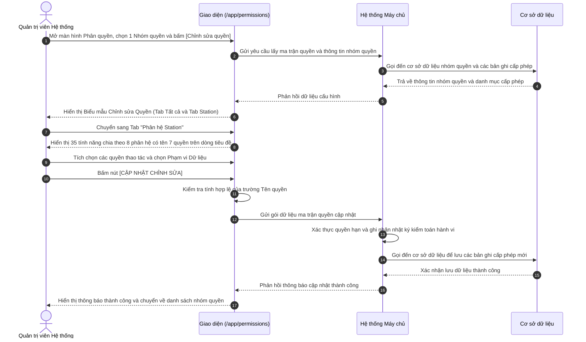

# US-SYS-04-04: Cấu hình Phân quyền Vai trò (Ma trận Quyền & Phạm vi Dữ liệu)

> **Tham chiếu:** `BF-SYS-04` · `SR-SYSTEM_ADMIN-001` · Giao diện Mẫu §4.4 (Biểu mẫu / Hộp thoại cấu hình)  
> **Đường dẫn màn hình & Trạng thái liên quan:**  
> - `/app/permissions` $\rightarrow$ Danh sách Nhóm quyền $\rightarrow$ Nhấp nút "Chỉnh sửa quyền" $\rightarrow$ Biểu mẫu Chỉnh sửa Nhóm quyền  
> - **Phiên bản hệ thống:** `v2026.09.04.01.station`

---

## 1. NHẬT KÝ THAY ĐỔI & BỐI CẢNH (CHANGELOG & CONTEXT)

### Lịch sử cập nhật tài liệu (Changelog)

| Ngày cập nhật | Nội dung cập nhật | Lý do cập nhật |
|---|---|---|
| 04/09/2026 | Biên tập nâng cấp toàn diện cơ chế ma trận quyền: Tách Tab Station và Tab Tất cả, bổ sung cột Phạm vi Dữ liệu (Data Scope), chuẩn hóa bảng 35 tính năng Station | Nâng cấp từ phân quyền chức năng cũ sang mô hình quản trị dữ liệu cơ sở kết hợp quyền thao tác và biên giới dữ liệu |
| 04/09/2026 | Tối ưu giao diện Tab Phân hệ Station: Dòng tiêu đề hiển thị tên 7 quyền trên từng phân hệ, khóa cứng phạm vi "Bản thân", cụm công cụ nằm cùng hàng tab | Tối ưu trải nghiệm nhận diện cột khi cuộn trang dài, đồng bộ ngôn ngữ và tối ưu diện tích dọc |
| 04/09/2026 | Bổ sung tính năng Quản lý học viên (`students`) và chuẩn hóa cấu trúc duy nhất 1 cụm Cha - Con cho `work_registration` (Đăng ký lịch) | Khắc phục thiếu sót màn hình cốt lõi P0 và loại bỏ các nhóm cha ảo trên Confluence |
| 04/09/2026 | Tích hợp đặc tả dạng bảng cho 2 hộp thoại nổi: Danh sách nhân sự được gán quyền và Nhật ký cập nhật hành vi kèm nút khôi phục ma trận quyền | Hoàn thiện công cụ kiểm toán an ninh và truy vết phân quyền nhân sự |

### Bối cảnh & Vấn đề nghiệp vụ (Context & Problem)
* **Bối cảnh:** Trong hệ thống quản trị trường học Rinov5, quản trị viên hệ thống cần thiết lập quyền thao tác (Truy cập, Thêm, Sửa, Xóa, Xuất dữ liệu, Xem tất cả) kết hợp phạm vi dữ liệu (Bản thân, Cùng nhóm, Toàn cơ sở, Toàn chuỗi) cho từng nhóm quyền nhân sự tác nghiệp tại cơ sở Station.
* **Vấn đề hiện tại:** Cơ chế phân quyền cũ chỉ phân định hành động bấm nút, không kiểm soát được nhân sự can thiệp dữ liệu của cơ sở nào; giao diện cũ dài và dễ nhầm lẫn cột checkbox khi cuộn; thiếu công cụ xem ai đang mang nhóm quyền và thiếu lịch sử truy vết thay đổi để khôi phục khi có sự cố.
* **Mục tiêu & Giá trị mang lại:** Cung cấp biểu mẫu cấu hình phân quyền trực quan, kiểm soát chính xác thẩm quyền và biên giới dữ liệu, hỗ trợ xem nhanh danh sách nhân sự được cấp quyền và khôi phục cấu hình lịch sử an toàn.

### Hiểu người dùng & Tình huống sử dụng (User Needs & Use Cases)
* **Người dùng chính (Persona):** Quản trị viên Hệ thống (`PERSONA-SYSTEM_ADMIN`), Giám đốc Cơ sở (`PERSONA-BRANCH_MANAGER`).
* **Nhu cầu thực tế (Needs):** Mong muốn cấu hình phân quyền nhanh chóng, nhận biết rõ tên quyền ở từng dòng phân hệ khi cuộn trang, không bị rối mắt bởi các viền màu thừa thãi.
* **Câu phát biểu nghiệp vụ:** **Là một** Quản trị viên Hệ thống, **tôi muốn** cấu hình chi tiết ma trận quyền và phạm vi dữ liệu cho nhóm quyền tại Tab Station, **để** kiểm soát chính xác thẩm quyền thao tác và biên giới dữ liệu mà nhân sự cơ sở được phép xử lý.

### Phạm vi kiểm soát (Scope & Classification)

| Tiêu chí đánh giá | Nội dung đối soát thực tế | Điểm số (0 / 1) |
|---|---|:---:|
| **Tiêu chí A: Phạm vi ảnh hưởng hệ thống** | Tác động đến cơ chế kiểm soát truy cập và dữ liệu trên toàn bộ 35 màn hình của Station | 1 |
| **Tiêu chí B: Tác động tài chính** | Ảnh hưởng đến việc bảo mật và kiểm soát truy cập dữ liệu doanh thu, học phí và đơn hàng | 1 |
| **Tiêu chí C1: Loại thay đổi nghiệp vụ** | Bổ sung cơ chế ma trận dữ liệu phân tầng 4 cấp độ kết hợp phân quyền thao tác | 1 |
| **Tiêu chí C2: Độ mới nghiệp vụ** | Đã định hình rõ ma trận thao tác và 4 cấp độ dữ liệu trên giao diện | 0 |
| **Tiêu chí D: Phụ thuộc bên ngoài** | Sử dụng cơ chế máy chủ nội bộ, không liên kết dịch vụ đối tác ngoài | 0 |

* **Tổng điểm đánh giá:** 3/5 điểm $\rightarrow$ 🔴 **Risk** (Yêu cầu Giám đốc Dự án và Trưởng nhóm Kỹ thuật phê duyệt trước khi phát hành).

### Bảng Danh mục Chức năng (Feature Scope Matrix)

| Mã Yêu Cầu | Tên Chức Năng | Mức Độ Ưu Tiên | Phân Loại Rủi Ro | Ghi Chú Nghiệp Vụ |
|---|---|:---:|:---:|---|
| **FEAT-01** | Cấu hình thông tin nhóm quyền (Tên quyền, Mô tả, Topic chỉ đọc) | Bắt buộc (Must) | 🟢 Standard | Cố định phân loại Topic không cho phép sửa đổi |
| **FEAT-02** | Tab "Tất cả" bảo toàn 73 tính năng CRM phẳng cũ | Bắt buộc (Must) | 🟢 Standard | Giữ nguyên 100% cách hiển thị và logic cũ |
| **FEAT-03** | Tab "Phân hệ Station" chia 8 phân hệ và 35 tính năng | Bắt buộc (Must) | 🔴 Risk | Cấu trúc phân nhóm thu gọn/mở rộng trực quan |
| **FEAT-04** | Dòng tiêu đề phân hệ hiển thị trực tiếp 7 tên quyền khi cuộn | Bắt buộc (Must) | 🟢 Standard | Nhận diện cột thao tác tức thì khi cuộn trang dài |
| **FEAT-05** | Cột Phạm vi Dữ liệu 4 cấp độ linh hoạt | Bắt buộc (Must) | 🔴 Risk | Bản thân, Cùng nhóm, Toàn cơ sở, Toàn chuỗi |
| **FEAT-06** | Khóa cứng phạm vi "Bản thân" cho các tính năng cá nhân | Bắt buộc (Must) | 🟢 Standard | Áp dụng cho 3 màn hình tác nghiệp cá nhân |
| **FEAT-07** | Liên kết phân cấp quyền Cha - Con tại Đăng ký lịch | Bắt buộc (Must) | 🟢 Standard | Bật con tự bật cha; Tắt cha tự tắt toàn bộ con |
| **FEAT-08** | Hộp thoại xem danh sách nhân sự đang được gán quyền | Nên có (Should) | 🟢 Standard | Kiểm toán nhân sự mang vai trò trực tiếp |
| **FEAT-09** | Hộp thoại xem lịch sử thay đổi hành vi & Khôi phục phiên bản | Nên có (Should) | 🔴 Risk | Khôi phục ma trận quyền từ snapshot lịch sử |

### Quy tắc Nghiệp vụ Toàn cục (Business Rules)
Hệ thống tuân thủ nghiêm ngặt các quy tắc nghiệp vụ sau:
1. Quyền Truy cập là điều kiện tiên quyết cho toàn bộ thao tác còn lại.
2. Tự động bật quyền Truy cập khi người dùng tích bất kỳ quyền thao tác nào.
3. Trường Topic được cố định chỉ đọc để bảo toàn cấu trúc phân loại.
4. Tab Tất cả bảo tồn 100% giao diện CRM cũ, Tab Station cung cấp ma trận dữ liệu phân tầng.

---

## 2. LUỒNG XỬ LÝ CHÍNH (MAIN FLOW - HAPPY PATH)

---

## 3. GIAO DIỆN & CẤU TRÚC BIỂU MẪU (DATA & UI STATE)

### 3.1. Bảng So sánh Kiến trúc Giao diện Tab Tất cả vs Tab Phân hệ Station

| Tiêu chí so sánh | Tab 1: "Tất cả" (Hệ thống CRM Core) | Tab 2: "Phân hệ Station" (Trường học / Cơ sở) |
|---|---|---|
| **Mục đích phục vụ** | Quản trị phân quyền chức năng phân hệ CRM cũ | Quản trị phân quyền thao tác và biên giới dữ liệu Station |
| **Quy mô tính năng** | 73 tính năng | 35 tính năng chuẩn hóa |
| **Bố cục danh sách** | Danh sách phẳng trải dài, không phân nhóm | Phân chia thành 8 khối phân hệ có thể thu gọn/mở rộng |
| **Dòng tiêu đề phân hệ** | Không có dòng phân hệ | Dòng tiêu đề hiển thị tên 7 cột quyền cố định khi cuộn |
| **Cột Phạm vi Dữ liệu** | Không có cột Phạm vi Dữ liệu | Có cột Phạm vi Dữ liệu (4 cấp độ hoặc khóa cứng Bản thân) |
| **Công cụ trên hàng tab** | Không hiển thị công cụ trợ giúp | 4 nút: Nhân sự được gán, Log cập nhật, Mở tất cả, Thu gọn tất cả |

### 3.2. Bảng Mô tả Chi tiết Toàn bộ 35 Tính năng Phân hệ Station

| STT | Nhóm Phân hệ | Cấp bậc | Tên Tính năng | Mã Tính năng | Đường dẫn Màn hình | Thao tác Hỗ trợ | Phạm vi Dữ liệu | Mô tả Chi tiết Nghiệp vụ & Ý nghĩa Thẩm quyền |
|:---:|---|:---:|---|---|---|---|---|---|
| 1 | LỊCH BIỂU | Cấp 1 | Lịch của tôi | `my_schedule` | `/app/my_schedule` | Truy cập, Sửa | 🔒 Bản thân (Cố định) | Xem và điều chỉnh lịch làm việc, ca dạy cá nhân của tài khoản đăng nhập |
| 2 | LỊCH BIỂU | Cấp 1 | Lịch học trung tâm | `calendar_class_schedule` | `/app/calendar_class_schedule` | Truy cập, Thêm, Sửa, Export, Xem tất cả | 4 cấp độ linh hoạt | Quản lý, điều phối và theo dõi lịch học của các lớp theo phòng học, ca học tại cơ sở |
| 3 | LỊCH BIỂU | Cấp 1 | Lịch học digi | `digi_schedule` | `/app/digi_schedule` | Truy cập, Thêm, Sửa, Export | 4 cấp độ linh hoạt | Quản lý lịch học các lớp kỹ thuật số và học trực tuyến trong hệ sinh thái đào tạo |
| 4 | LỊCH BIỂU | Cấp 1 | Lịch test | `calendar_event_schedule` | `/app/calendar_event_schedule` | Truy cập, Thêm, Sửa, Export, Xem tất cả | 4 cấp độ linh hoạt | Quản lý lịch tổ chức kiểm tra trình độ đầu vào, đánh giá năng lực học sinh tại cơ sở |
| 5 | LỊCH BIỂU | Cấp 1 (Cha) | Đăng ký lịch | `work_registration` | `/app/work_registration` | Truy cập, Thêm, Sửa, Xóa, Export | 4 cấp độ linh hoạt | Trung tâm điều phối lịch rảnh, ca làm việc và ngày nghỉ của toàn thể đội ngũ nhân sự |
| 6 | LỊCH BIỂU | └── Cấp 2 | Lịch rảnh của tôi | `work_registration_mine` | `/app/work_registration_mine` | Truy cập, Thêm, Sửa | 🔒 Bản thân (Cố định) | Nhân sự tự khai báo các khung giờ rảnh hàng tuần để bộ phận vận hành bố trí ca làm |
| 7 | LỊCH BIỂU | └── Cấp 2 | Bảng ca tổng hợp (Master Roster) | `work_registration_roster` | `/app/work_registration_roster` | Truy cập, Sửa, Export | 4 cấp độ linh hoạt | Bảng ca tổng quan điều phối lịch làm việc của tất cả nhân sự cơ sở theo tuần/tháng |
| 8 | LỊCH BIỂU | └── Cấp 2 | Lịch rảnh nhân sự | `work_registration_staff` | `/app/work_registration_staff` | Truy cập, Sửa, Export | 4 cấp độ linh hoạt | Theo dõi, tổng hợp và phê duyệt danh sách lịch rảnh đăng ký của giáo viên và nhân viên |
| 9 | LỊCH BIỂU | └── Cấp 2 | Tổng quan cơ sở | `work_registration_center` | `/app/work_registration_center` | Truy cập, Export | 4 cấp độ linh hoạt | Báo cáo tổng thể tình trạng đáp ứng nhân sự và độ phủ ca làm việc tại từng cơ sở |
| 10 | LỊCH BIỂU | └── Cấp 2 | Cấu hình ngày lễ / nghỉ lễ | `work_registration_holidays` | `/app/work_registration_holidays` | Truy cập, Thêm, Sửa, Xóa | 4 cấp độ linh hoạt | Thiết lập lịch nghỉ lễ, tạm dừng hoạt động cơ sở để phục vụ tính công và xếp lịch học |
| 11 | LỊCH BIỂU | Cấp 1 | Quản lý sự kiện | `event_management_new` | `/app/event_management_new` | Truy cập, Thêm, Sửa, Xóa, Export | 4 cấp độ linh hoạt | Khởi tạo, phê duyệt và tổ chức các sự kiện tuyển sinh, hội thảo, ngoại khóa của trường |
| 12 | CRM & THƯƠNG MẠI | Cấp 1 | Lead của tôi | `crm_my_leads` | `/app/crm_my_leads` | Truy cập, Thêm, Sửa, Export | 🔒 Bản thân (Cố định) | Quản lý danh sách khách hàng tiềm năng được phân bổ riêng cho tài khoản đăng nhập |
| 13 | CRM & THƯƠNG MẠI | Cấp 1 | Quản lý Lead | `crm_leads` | `/app/crm_leads` | Truy cập, Thêm, Sửa, Xóa, Export, Xem tất cả | 4 cấp độ linh hoạt | Trung tâm tiếp nhận, sàng lọc, phân bổ và theo dõi tiến trình chăm sóc khách hàng toàn diện |
| 14 | CRM & THƯƠNG MẠI | Cấp 1 | Quản lý đơn hàng | `orders` | `/app/orders` | Truy cập, Thêm, Sửa, Xóa, Export, Xem tất cả | 4 cấp độ linh hoạt | Quản lý danh sách đơn hàng khóa học, học cụ; theo dõi trạng thái thanh toán và bàn giao |
| 15 | CRM & THƯƠNG MẠI | Cấp 1 | Thanh toán | `payment_receipts` | `/app/payment_receipts` | Truy cập, Thêm, Sửa, Export, Xem tất cả | 4 cấp độ linh hoạt | Quản lý phiếu thu học phí, hóa đơn giao dịch, xác nhận chuyển khoản và tiền mặt |
| 16 | SẢN PHẨM & CHƯƠNG TRÌNH | Cấp 1 | Quản lý sản phẩm | `products` | `/app/products` | Truy cập, Thêm, Sửa, Xóa, Export | 4 cấp độ linh hoạt | Quản lý danh mục khóa học đào tạo, gói combo và tài liệu học tập được mở bán |
| 17 | SẢN PHẨM & CHƯƠNG TRÌNH | Cấp 1 | Quản lý Chiến dịch | `campaigns` | `/app/campaigns` | Truy cập, Thêm, Sửa, Xóa, Export | 4 cấp độ linh hoạt | Thiết lập và theo dõi các chiến dịch truyền thông tuyển sinh, thu hút học viên mới |
| 18 | SẢN PHẨM & CHƯƠNG TRÌNH | Cấp 1 | Quản lý Khuyến mãi | `promotions` | `/app/promotions` | Truy cập, Thêm, Sửa, Xóa, Export | 4 cấp độ linh hoạt | Thiết lập mã giảm giá, voucher và các chính sách ưu đãi học phí theo từng đợt |
| 19 | TUYỂN SINH & XẾP LỚP | Cấp 1 | Kiểm tra/Trải nghiệm | `booking_test` | `/app/booking_test` | Truy cập, Thêm, Sửa, Xóa, Export, Xem tất cả | 4 cấp độ linh hoạt | Quản lý đăng ký thi thử, buổi học trải nghiệm, chấm điểm bài kiểm tra đầu vào học sinh |
| 20 | TUYỂN SINH & XẾP LỚP | Cấp 1 | Lớp học thử | `trial_class` | `/app/trial_class` | Truy cập, Thêm, Sửa, Export | 4 cấp độ linh hoạt | Quản lý việc sắp xếp học viên tham gia học thử thực tế tại các lớp đang vận hành |
| 21 | TUYỂN SINH & XẾP LỚP | Cấp 1 | Xếp lớp học viên | `class_placement` | `/app/class_placement` | Truy cập, Sửa, Export | 4 cấp độ linh hoạt | Điều phối và xếp học sinh vào danh sách lớp chính thức sau khi test hoặc đóng học phí |
| 22 | VẬN HÀNH & CHĂM SÓC | Cấp 1 | Quản lý Lớp học | `classes` | `/app/classes` | Truy cập, Thêm, Sửa, Xóa, Export, Xem tất cả | 4 cấp độ linh hoạt | Quản lý thông tin lớp, sĩ số, phòng học, giáo viên phụ trách và tiến độ bài giảng |
| 23 | VẬN HÀNH & CHĂM SÓC | Cấp 1 | Quản lý học viên | `students` | `/app/students` | Truy cập, Thêm, Sửa, Xóa, Export, Xem tất cả | 4 cấp độ linh hoạt | Hồ sơ học sinh 360 độ: thông tin cá nhân, phụ huynh, quá trình học tập và chuyên cần |
| 24 | VẬN HÀNH & CHĂM SÓC | Cấp 1 | Bảo lưu & Nghỉ phép | `leave_reserve` | `/app/leave_reserve` | Truy cập, Thêm, Sửa, Export | 4 cấp độ linh hoạt | Tiếp nhận và xử lý đơn xin nghỉ học có phép, bảo lưu thời gian học và học phí học sinh |
| 25 | VẬN HÀNH & CHĂM SÓC | Cấp 1 | Học bù học viên | `makeup_class` | `/app/makeup_class` | Truy cập, Thêm, Sửa, Export | 4 cấp độ linh hoạt | Sắp xếp và điều phối lịch học bù cho học viên nghỉ phép vào các lớp tương đương |
| 26 | VẬN HÀNH & CHĂM SÓC | Cấp 1 | Chăm sóc học viên | `student_operations_alert` | `/app/student_operations_alert` | Truy cập, Thêm, Sửa, Export, Xem tất cả | 4 cấp độ linh hoạt | Tiếp nhận cảnh báo chuyên cần, học lực sút giảm để nhân viên can thiệp chăm sóc |
| 27 | VẬN HÀNH & CHĂM SÓC | Cấp 1 | Tái phí học viên | `renewal` | `/app/renewal` | Truy cập, Sửa, Export, Xem tất cả | 4 cấp độ linh hoạt | Theo dõi hạn học phí, cảnh báo sắp hết buổi và điều phối quy trình tái đăng ký khóa |
| 28 | TICKET & CHẤT LƯỢNG | Cấp 1 | Quản lý Ticket & Chất lượng | `support_tickets` | `/app/support_tickets` | Truy cập, Thêm, Sửa, Xóa, Export | 4 cấp độ linh hoạt | Tiếp nhận, xử lý khiếu nại, hỗ trợ kỹ thuật và phản ánh chất lượng dịch vụ đào tạo |
| 29 | ĐỘI NGŨ & ĐIỀU HÀNH | Cấp 1 | Executive Dashboard | `dashboard` | `/app/dashboard` | Truy cập, Export | 4 cấp độ linh hoạt | Bảng điều khiển quản trị hiển thị KPI tuyển sinh, doanh thu, sĩ số và tỷ lệ lấp đầy cơ sở |
| 30 | ĐỘI NGŨ & ĐIỀU HÀNH | Cấp 1 | Phân công Giảng dạy | `teacher_assignment` | `/app/teacher_assignment` | Truy cập, Sửa, Export | 4 cấp độ linh hoạt | Điều phối, gán giáo viên chính, giáo viên trợ giảng cho từng lớp học và ca học cụ thể |
| 31 | ĐỘI NGŨ & ĐIỀU HÀNH | Cấp 1 | Hồ sơ Nhân sự | `hr_employees` | `/app/hr_employees` | Truy cập, Thêm, Sửa, Xóa, Export | 4 cấp độ linh hoạt | Quản lý hồ sơ nhân viên, giáo viên, hợp đồng lao động, chức danh và cơ sở công tác |
| 32 | ĐỘI NGŨ & ĐIỀU HÀNH | Cấp 1 | Duyệt Dạy thay & Lương ca | `substitute_payroll` | `/app/substitute_payroll` | Truy cập, Sửa, Export | 4 cấp độ linh hoạt | Phê duyệt các ca dạy thay, dạy cover đột xuất và tính toán chi phí thù lao theo ca |
| 33 | ĐỘI NGŨ & ĐIỀU HÀNH | Cấp 1 | Báo cáo Vận hành | `reports` | `/app/reports` | Truy cập, Export | 4 cấp độ linh hoạt | Trích xuất các báo cáo chuyên sâu về hiệu suất vận hành cơ sở và tình hình học tập |
| 34 | CẤU HÌNH HỆ THỐNG | Cấp 1 | Danh mục chăm sóc | `care_conditions_config` | `/app/care_conditions_config` | Truy cập, Thêm, Sửa, Xóa | 4 cấp độ linh hoạt | Thiết lập tiêu chí và điều kiện tự động kích hoạt cảnh báo chăm sóc học sinh |
| 35 | CẤU HÌNH HỆ THỐNG | Cấp 1 | Nhóm quyền | `permissions` | `/app/permissions` | Truy cập, Thêm, Sửa, Xóa | 4 cấp độ linh hoạt | Quản trị vai trò, nhóm quyền, ma trận thao tác và phạm vi dữ liệu phân hệ Station và CRM |

### 3.3. Bảng Cấu trúc các Trường Thông tin Biểu mẫu

| Tên trường thông tin | Kiểu hiển thị | Bắt buộc | Nguồn dữ liệu | Định dạng & Giới hạn | Diễn giải quy tắc kiểm duyệt dữ liệu |
|---|---|:---:|---|---|---|
| **Tên quyền** | Ô nhập chữ | **Có (*)** | Người dùng nhập | Văn bản, 2-150 ký tự | Báo lỗi nếu để trống hoặc chỉ chứa khoảng trắng |
| **Topic / Phân loại** | Ô xám chỉ đọc | Không | Dữ liệu gốc nhóm | Văn bản tĩnh | Cố định chỉ đọc, không cho phép chỉnh sửa khi cập nhật |
| **Mô tả quyền** | Khung văn bản nhiều dòng | Không | Người dùng nhập | Tối đa 500 ký tự | Tùy chọn diễn giải mục đích và chức năng nhóm quyền |

### 3.4. Bảng Danh sách Nút Hành động & Công cụ trên Biểu mẫu

| Tên nút hành động | Vị trí hiển thị | Kiểu hiển thị | Logic xử lý nghiệp vụ | Mã Quyền Yêu Cầu |
|---|---|---|---|---|
| **CẬP NHẬT CHỈNH SỬA** | Dưới cùng biểu mẫu | Nút màu nhấn | Kiểm tra tên quyền $\rightarrow$ Gửi lưu ma trận $\rightarrow$ Đóng biểu mẫu $\rightarrow$ Làm mới danh sách | `sys.role.edit` |
| **HỦY BỎ** | Dưới cùng biểu mẫu | Nút viền nhạt | Hiển thị cảnh báo xác nhận $\rightarrow$ Đóng biểu mẫu $\rightarrow$ Giữ nguyên trạng thái cũ | `sys.role.view` |
| **Nhân sự được gán** | Góc phải hàng tab Station | Nút biểu tượng kèm số đếm | Mở Hộp thoại nổi xem danh sách nhân viên đang mang nhóm quyền | `sys.role.view` |
| **Log cập nhật** | Góc phải hàng tab Station | Nút biểu tượng lịch sử | Mở Hộp thoại nổi xem timeline thay đổi hành vi và nút khôi phục | `sys.role.edit` |
| **Mở tất cả** | Góc phải hàng tab Station | Nút chữ liên kết | Mở rộng toàn bộ 8 khối phân hệ của Station | `sys.role.view` |
| **Thu gọn tất cả** | Góc phải hàng tab Station | Nút chữ liên kết | Thu gọn toàn bộ 8 khối phân hệ, chỉ hiển thị dòng tiêu đề | `sys.role.view` |

### 3.5. Bảng Cấu trúc Hộp thoại nổi Nhân sự được gán quyền

| Tên trường thông tin | Kiểu hiển thị | Diễn giải nội dung hiển thị | Nguồn dữ liệu |
|---|---|---|---|
| **Ảnh đại diện & Họ tên** | Ảnh đại diện + Tên in đậm | Họ và tên đầy đủ của nhân sự | Dữ liệu nhân sự |
| **Mã nhân viên** | Văn bản xám nhạt | Mã số định danh của nhân viên | Dữ liệu nhân sự |
| **Phòng ban / Bộ phận** | Văn bản thường | Phòng ban làm việc (Ví dụ: Phòng Tuyển sinh) | Cơ cấu tổ chức |
| **Chức danh chuyên môn** | Văn bản thường | Chức danh đảm nhiệm (Ví dụ: Tư vấn viên) | Cơ cấu tổ chức |
| **Cơ sở công tác** | Nhãn trạng thái | Cơ sở trường học nhân viên đang làm việc | Danh mục cơ sở |

### 3.6. Bảng Cấu trúc Hộp thoại nổi Nhật ký Cập nhật Hành vi & Khôi phục Phiên bản

| Thành phần thông tin | Kiểu hiển thị | Quy cách thể hiện dữ liệu | Thao tác tương tác |
|---|---|---|---|
| **Dấu mốc thời gian** | Văn bản thường | Định dạng ngày giờ: `DD/MM/YYYY HH:mm` | Không tương tác |
| **Người thực hiện** | Tên in đậm | Họ tên nhân sự quản trị đã lưu thay đổi | Không tương tác |
| **Chi tiết hành vi** | Danh sách phân biệt | Quyền thêm mới (`+`, màu xanh lá); Quyền gỡ bỏ (`-`, màu đỏ) | Không tương tác |
| **Huy hiệu phiên bản** | Nhãn màu nổi bật | "Hiện tại" đối với phiên bản đang kích hoạt áp dụng | Không tương tác |
| **Khôi phục phiên bản** | Nút viền nhấn | Bấm nút sẽ hoàn trả ma trận quyền về trạng thái thời điểm đó | Nhấp nút để khôi phục |

---

## 4. KHỐI CHỨC NĂNG CHI TIẾT & TIÊU CHÍ NGHIỆM THU (ACTIONS & ACCEPTANCE CRITERIA)

### Action 4.1: Chỉnh sửa thông tin cơ bản & Topic chỉ đọc
* **Tiêu chí nghiệm thu (Acceptance Criteria):**
  - **AC-01 (Happy Path - Topic chỉ đọc):**
    - **Giả sử:** Quản trị viên mở biểu mẫu chỉnh sửa của một nhóm quyền thuộc Topic "Sale Tự học".
    - **Khi:** Người dùng quan sát trường "Topic / Phân loại".
    - **Thì:** Trường hiển thị ô xám chỉ đọc mang giá trị "Sale Tự học", không cho phép bấm chọn hoặc thay đổi sang Topic khác.

### Action 4.2: Bật tắt quyền thao tác và tự động kích hoạt quyền liên đới
* **Tiêu chí nghiệm thu (Acceptance Criteria):**
  - **AC-02 (Happy Path - Kích hoạt quyền liên đới):**
    - **Giả sử:** Tính năng "Quản lý đơn hàng" đang tắt toàn bộ các quyền thao tác.
    - **Khi:** Người dùng tích chọn hộp kiểm quyền "Thêm" hoặc "Sửa".
    - **Thì:** Hộp kiểm quyền "Truy cập" tự động được tích chọn bật theo; đồng thời ô chọn Phạm vi Dữ liệu được mở khóa cho phép chọn cấp độ.

### Action 4.3: Chuyển đổi giữa Tab Tất cả và Tab Phân hệ Station
* **Tiêu chí nghiệm thu (Acceptance Criteria):**
  - **AC-03 (Happy Path - Tab Tất cả phẳng CRM):**
    - **Giả sử:** Người dùng đang ở Tab "Tất cả" (tab mặc định khi mở biểu mẫu).
    - **Khi:** Người dùng quan sát bảng danh mục quyền và thanh công cụ.
    - **Thì:** Bảng hiển thị 73 tính năng phẳng không thu gọn, không có cột Phạm vi Dữ liệu, không hiển thị cụm nút công cụ ở góc phải hàng tab.

### Action 4.4: Cuộn trang tại Tab Phân hệ Station với thanh tiêu đề cố định
* **Tiêu chí nghiệm thu (Acceptance Criteria):**
  - **AC-04 (Happy Path - Dòng tiêu đề hiển thị 7 quyền):**
    - **Giả sử:** Người dùng chuyển sang Tab "Phân hệ Station" và cuộn trang xuống phân hệ bất kỳ (ví dụ: VẬN HÀNH & CHĂM SÓC).
    - **Khi:** Người dùng quan sát thanh tiêu đề của phân hệ đó.
    - **Thì:** Thanh tiêu đề cố định ở đầu khung cuộn hiển thị đầy đủ tên 7 cột quyền (Truy cập, Thêm, Sửa, Xóa, Download/Upload, Xem tất cả, Phạm vi Dữ liệu), giúp người dùng nhận diện chính xác từng cột checkbox bên dưới.

### Action 4.5: Phân cấp quyền Cha - Con trong phân hệ Đăng ký lịch
* **Tiêu chí nghiệm thu (Acceptance Criteria):**
  - **AC-05 (Happy Path - Liên kết quyền Cha Con):**
    - **Giả sử:** Màn hình cha "Đăng ký lịch" đang tắt quyền Truy cập.
    - **Khi:** Người dùng tích chọn quyền Truy cập tại màn con "Lịch rảnh của tôi".
    - **Thì:** Quyền Truy cập của màn cha "Đăng ký lịch" tự động được bật theo. Ngược lại, nếu người dùng bỏ tích quyền Truy cập của "Đăng ký lịch", toàn bộ quyền của 5 màn con trực thuộc tự động tắt.

### Action 4.6: Khóa cứng phạm vi "Bản thân" cho tính năng cá nhân
* **Tiêu chí nghiệm thu (Acceptance Criteria):**
  - **AC-06 (Happy Path - Phạm vi Bản thân cố định):**
    - **Giả sử:** Người dùng quan sát cột Phạm vi Dữ liệu tại các tính năng "Lịch của tôi", "Lịch rảnh của tôi", hoặc "Lead của tôi".
    - **Khi:** Quyền Truy cập tại các dòng này được bật.
    - **Thì:** Ô phạm vi hiển thị duy nhất chữ "Bản thân" dạng văn bản tĩnh nền trong suốt, không mở danh sách chọn thả xuống, không có viền màu highlight và không có nhãn phụ.

### Action 4.7: Mở hộp thoại xem danh sách nhân sự được gán quyền
* **Tiêu chí nghiệm thu (Acceptance Criteria):**
  - **AC-07 (Happy Path - Xem nhân sự được gán):**
    - **Giả sử:** Người dùng đang ở Tab "Phân hệ Station".
    - **Khi:** Người dùng bấm nút "Nhân sự được gán" trên góc phải hàng tab.
    - **Thì:** Hộp thoại nổi mở ra hiển thị đúng danh sách nhân viên đang áp dụng nhóm quyền này kèm họ tên, mã nhân viên, phòng ban và chức danh.

### Action 4.8: Mở hộp thoại lịch sử hành vi và khôi phục ma trận quyền
* **Tiêu chí nghiệm thu (Acceptance Criteria):**
  - **AC-08 (Happy Path - Khôi phục phiên bản lịch sử):**
    - **Giả sử:** Người dùng bấm nút "Log cập nhật" trên góc phải hàng tab và chọn một phiên bản cũ trong lịch sử.
    - **Khi:** Người dùng bấm nút "Khôi phục phiên bản" tại phiên bản đó.
    - **Thì:** Hệ thống tự động đổ lại toàn bộ trạng thái ma trận quyền về đúng thời điểm đã chọn, đóng hộp thoại nổi và hiển thị thông báo khôi phục thành công.

---

## 5. CÁC TRƯỜNG HỢP GÓC CẠNH (CORNER CASES) & LUỒNG NGOẠI LỆ (EXCEPTION FLOWS)

- **[CASE-01] Mất kết nối mạng khi đang gửi lưu cập nhật (Exception Flow - Network Interruption):**
  - *Tình huống:* Người dùng nhấn [CẬP NHẬT CHỈNH SỬA] đúng thời điểm đường truyền internet bị gián đoạn.
  - *Cách xử lý:* Hệ thống hiển thị thông báo lỗi kết nối máy chủ, giữ nguyên toàn bộ trạng thái ma trận quyền đã chỉnh sửa trên màn hình để người dùng gửi lại khi mạng ổn định.
- **[CASE-02] Bỏ trống trường bắt buộc Tên quyền (Validation Error - Missing Role Name):**
  - *Tình huống:* Người dùng xóa sạch ký tự trong ô "Tên quyền" rồi bấm cập nhật.
  - *Cách xử lý:* Hệ thống hiển thị viền đỏ cảnh báo tại ô Tên quyền kèm thông báo "Tên nhóm quyền không được để trống!", chặn không gửi yêu cầu lưu lên máy chủ.
- **[CASE-03] Không có nhân sự nào được gán vào nhóm quyền (Empty State - No Assigned Users):**
  - *Tình huống:* Người dùng bấm nút "Nhân sự được gán" tại một nhóm quyền mới tạo chưa gán cho ai.
  - *Cách xử lý:* Hộp thoại nổi hiển thị thông báo trạng thái trống: "Chưa có nhân sự nào được phân quyền nhóm này." kèm hình ảnh biểu trưng.
- **[CASE-04] Khôi phục phiên bản lịch sử nhưng nhóm quyền đã bị khóa (Exception Flow - Locked Role Conflict):**
  - *Tình huống:* Người dùng mở hộp thoại lịch sử và chọn khôi phục phiên bản khi nhóm quyền đang bị khóa bởi phiên làm việc khác.
  - *Cách xử lý:* Hệ thống từ chối thao tác, thông báo "Nhóm quyền đang được cập nhật bởi quản trị viên khác. Vui lòng thử lại sau!".
- **[CASE-05] Đóng biểu mẫu khi có thay đổi ma trận quyền chưa lưu (Exception Flow - Unsaved Changes Confirmation):**
  - *Tình huống:* Người dùng đã tích chọn thay đổi nhiều quyền nhưng bấm nút [HỦY BỎ] hoặc chuyển trang.
  - *Cách xử lý:* Hệ thống hiển thị hộp thoại cảnh báo: "Bạn có những thay đổi chưa lưu. Bạn có chắc chắn muốn hủy bỏ?". Nếu người dùng chọn Đồng ý, đóng biểu mẫu và hủy bỏ thay đổi.

---

## 6. QUY TẮC KIỂM SOÁT DỮ LIỆU & RÀNG BUỘC BIỂU MẪU (VALIDATION RULES)

| Tên trường / Thao tác | Điều kiện kích hoạt | Cơ chế kiểm tra | Hành vi khi vi phạm | Thông điệp cảnh báo |
|---|---|---|---|---|
| **Tên quyền** | Khi nhấn Lưu | Độ dài từ 2 đến 150 ký tự, không rỗng | Viền đỏ ô nhập liệu, chặn gửi lưu | "Tên nhóm quyền không được để trống!" |
| **Quyền Thao tác con** | Khi tích chọn Thêm/Sửa/Xóa/Export/Xem tất cả | Kiểm tra trạng thái quyền Truy cập | Tự động kích hoạt quyền Truy cập | Tự động bật không cảnh báo |
| **Hủy quyền Truy cập** | Khi bỏ chọn quyền Truy cập | Tắt toàn bộ quyền con và khóa Data Scope | Đưa các ô chọn về trạng thái vô hiệu | Tự động tắt các quyền liên đới |
| **Phân cấp Cha - Con** | Khi thao tác tại màn con Đăng ký lịch | Bật con tự bật cha; Tắt cha tự tắt con | Đồng bộ trạng thái hộp kiểm theo cây | Tự động đồng bộ theo cây quan hệ |
| **Phạm vi Dữ liệu Cá nhân** | Khi bật tính năng cá nhân | Khóa cứng phạm vi "Bản thân" | Chặn không mở menu lựa chọn | Hiển thị chữ tĩnh, nền trong suốt |

---

## 7. MA TRẬN PHÂN QUYỀN VAI TRÒ (PERMISSION MATRIX)

| Vai trò người dùng | Xem danh sách quyền | Mở biểu mẫu Chỉnh sửa | Thay đổi ma trận quyền & Scope | Xem nhân sự & Khôi phục phiên bản |
|---|:---:|:---:|:---:|:---:|
| **Quản trị viên Hệ thống (System Admin)** | ✅ | ✅ | ✅ | ✅ |
| **Giám đốc Cơ sở (Branch Manager)** | ✅ | ❌ | ❌ | ❌ |
| **Nhân viên Vận hành / Giáo vụ (CSM)** | ❌ | ❌ | ❌ | ❌ |
| **Giáo viên giảng dạy (Teacher)** | ❌ | ❌ | ❌ | ❌ |

---

## 8. YÊU CẦU PHI CHỨC NĂNG (NON-FUNCTIONAL REQUIREMENTS)

| Hạng mục yêu cầu | Tiêu chuẩn cam kết | Phương pháp kiểm chứng |
|---|---|---|
| **Thời gian phản hồi giao diện** | $\le 300$ ms khi chuyển đổi giữa Tab Tất cả và Tab Station | Đo kiểm hiệu năng giao diện |
| **Thời gian xử lý lưu dữ liệu** | $\le 1.5$ giây cho gói cập nhật 35 tính năng và 7 cột quyền | Ghi nhận thời gian hoàn tất tác vụ lưu |
| **Tính toàn vẹn kiểm toán (Audit Trail)** | 100% các thao tác thêm/gỡ quyền được ghi nhận chính xác vào nhật ký hành vi | Đối soát bảng dữ liệu kiểm toán hệ thống |
| **Bảo mật phân quyền dữ liệu** | Chặn 100% các truy vấn vượt quá phạm vi dữ liệu đã thiết lập | Kiểm thử thâm nhập và rà soát an ninh |

---

## 9. KẾT NỐI MÁY CHỦ & HỢP ĐỒNG DỮ LIỆU (DATA CONTRACT)

| Trường dữ liệu | Kiểu dữ liệu | Bắt buộc | Diễn giải nghiệp vụ |
|---|---|:---:|---|
| `role_id` | Chuỗi định danh | Có | Mã định danh duy nhất của nhóm quyền cần cập nhật |
| `name` | Chuỗi ký tự | Có | Tên nhóm quyền mới sau chỉnh sửa |
| `description` | Chuỗi ký tự | Không | Diễn giải chi tiết mục đích nhóm quyền |
| `permissions` | Danh sách đối tượng | Có | Mảng chứa trạng thái 7 quyền thao tác của 35 tính năng |
| `data_scopes` | Danh sách đối tượng | Có | Mảng chứa cấp độ phạm vi dữ liệu áp dụng cho từng tính năng |
| `updated_by` | Chuỗi định danh | Có | Mã định danh của quản trị viên thực hiện thao tác lưu |
