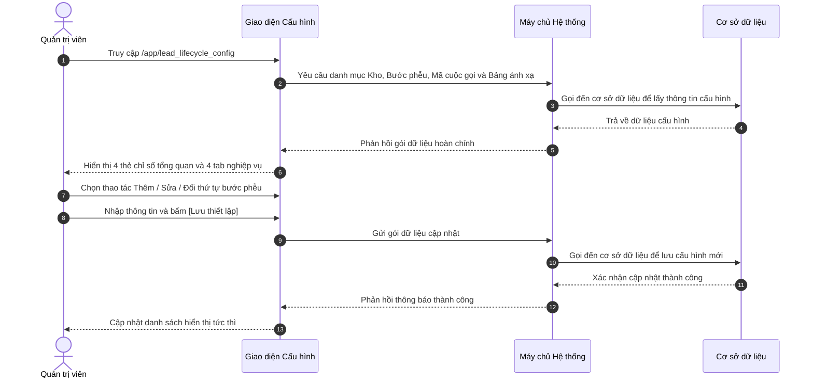

# US-SYS-04-05: Cấu hình Phễu & Kho Lead (Vòng đời Tuyển sinh & Quản trị Kho Dữ liệu)

> **Tham chiếu:** `BF-SYS-04` · `SR-SYSTEM_ADMIN-001` · Giao diện Mẫu §4.2 (Màn hình Danh sách & Cấu hình Phễu)  
> **Đường dẫn màn hình & Trạng thái liên quan:**  
> - `/app/lead_lifecycle_config` $\rightarrow$ Nhóm Cấu hình Hệ thống $\rightarrow$ Cấu hình Phễu & Kho Lead  
> - **Phiên bản hệ thống:** `v2026.09.09.01.station`

---

## 1. NHẬT KÝ THAY ĐỔI & BỐI CẢNH (CHANGELOG & CONTEXT)

### Lịch sử cập nhật tài liệu (Changelog)

| Ngày cập nhật | Nội dung cập nhật | Lý do cập nhật |
|---|---|---|
| 09/09/2026 | Khởi tạo đặc tả màn hình Cấu hình Phễu & Kho Lead: Chuẩn hóa 4 phân hệ (Phễu Vòng đời, Kho Dữ liệu, Mã Cuộc gọi, Ma trận Di chuyển 32 mã cũ) | Tái cấu trúc mô hình Kho và Mối quan hệ cũ sang kiến trúc đa tầng chuẩn hóa Rinov5 |

### Bối cảnh & Vấn đề nghiệp vụ (Context & Problem)
* **Bối cảnh:** Trước đây, hệ thống cũ quản lý dữ liệu tuyển sinh dựa trên khái niệm các "Kho" (`Kho T`, `Kho C`, `Kho M`) kết hợp với chuỗi 32 mã "Mối quan hệ" trải dài từ giai đoạn T0 đến T4.
* **Vấn đề hiện tại:**
  - Mô hình cũ nhồi nhét 5 thực thể độc lập (Kho dữ liệu thô, Kết quả một cuộc gọi, Phễu tuyển sinh, Hình thức thanh toán, Vận chuyển bưu phẩm) vào duy nhất một danh sách thả xuống.
  - Các kết quả cuộc gọi ngắn hạn như "Không nghe máy", "Hẹn gọi lại", "Số sai" bị gán đè làm biến mất nhu cầu tiềm năng thực sự của phụ huynh.
  - Thiếu quy tắc thu hồi dữ liệu tự động khi nhân viên không gọi xử lý trong hạn mức thời gian cho phép.
* **Mục tiêu & Giá trị mang lại:**
  - Thiết lập màn hình quản trị trung tâm cho phép cấu hình linh hoạt các Kho dữ liệu tiếp nhận kết hợp thuật toán phân bổ tròn đều.
  - Chuẩn hóa các bước phễu tuyển sinh phi tuyến tính có trạng thái kết thúc thất bại toàn cục.
  - Tách bạch mã cuộc gọi tức thời vào nhật ký liên hệ và bảo toàn 100% dữ liệu lịch sử qua bảng ánh xạ chuyển đổi 32 mã cũ.

### Hiểu người dùng & Tình huống sử dụng (User Needs & Use Cases)
* **Người dùng chính (Persona):** Quản trị viên Hệ thống (`PERSONA-SYSTEM_ADMIN`), Giám đốc Tuyển sinh (`PERSONA-BRANCH_MANAGER`).
* **Nhu cầu thực tế (Needs):** Muốn dễ dàng điều chỉnh thứ tự các bước phễu, tùy biến hạn mức thời gian xử lý của từng kho và theo dõi lộ trình di chuyển dữ liệu cũ.
* **Câu phát biểu nghiệp vụ:** **Là một** Quản trị viên Hệ thống, **tôi muốn** cấu hình chi tiết danh mục Kho dữ liệu, các bước Phễu tuyển sinh và mã kết quả cuộc gọi, **để** chuẩn hóa toàn diện quy trình tiếp nhận và chăm sóc khách hàng tiềm năng trên toàn hệ thống.

---

## 2. QUY TRÌNH NGHIỆP VỤ & LUỒNG DỮ LIỆU (WORKFLOW & FLOWCHART)

---

## 3. GIAO DIỆN & CẤU TRÚC BIỂU MẪU (DATA & UI STATE)

### 3.1. Bảng Chỉ số Tổng quan (Metric Tiles)

| Tên trường / Thành phần | Kiểu hiển thị | Nguồn dữ liệu | Quy tắc thị giác & Hành vi | Khả năng co giãn trên di động |
|---|---|---|---|---|
| **Kho dữ liệu (Pools)** | Thẻ số liệu | Danh sách Kho | Hiển thị tổng số kho dữ liệu thiết lập | Hiển thị 2 cột |
| **Bước Phễu Tuyển sinh** | Thẻ số liệu | Danh sách Bước phễu | Hiển thị số lượng bước phễu đang kích hoạt | Hiển thị 2 cột |
| **Chuyển đổi / Kết thúc** | Thẻ số liệu | Bước phễu hoàn tất | Hiển thị số lượng bước Thành công và Thất bại | Hiển thị 2 cột |
| **Mã Hệ Thống Cũ** | Thẻ số liệu | Bảng ánh xạ cũ | Hiển thị tiến độ quy hoạch 32 trên 32 mã legacy | Hiển thị 2 cột |

### 3.2. Bảng Danh sách Trạng thái Phễu Tuyển sinh (Tab 1)

| Tên trường / Thành phần | Kiểu hiển thị | Nguồn dữ liệu | Quy tắc thị giác & Hành vi | Khả năng co giãn trên di động |
|---|---|---|---|---|
| **Thứ tự bước** | Nút bấm mũi tên | Cấu hình thứ tự | Cho phép bấm lên hoặc xuống để thay đổi vị trí bước | Giữ nguyên |
| **Trạng thái & Mã code** | Chữ kèm viên màu | Danh mục bước | Dòng 1: Tên bước kèm chấm màu; Dòng 2: Mã viết tắt | Giữ nguyên |
| **Nhóm giai đoạn** | Nhãn văn bản | Giai đoạn phễu | Phân biệt Tiếp cận tư vấn hoặc Kết thúc vòng đời | Thu gọn |
| **Phân loại trạng thái** | Thẻ trạng thái | Thuộc tính bước | Màu xanh dương đang làm, xanh lá thành công, xám thất bại | Thu gọn |
| **Hạn mức thời gian** | Số giờ kèm biểu tượng | Hạn ngạch xử lý | Hiển thị số giờ quy định để tư vấn viên hoàn thành bước | Ẩn trên di động |
| **Hành động & Mô tả** | Khối văn bản 2 dòng | Hướng dẫn tư vấn | Dòng 1: Hành động gợi ý; Dòng 2: Diễn giải tiêu chí bước | Ẩn trên di động |
| **Thao tác** | Cụm nút biểu tượng | Hệ thống | Nút bút chì để sửa; nút thùng rác để xóa nếu không phải cốt lõi | Cố định mép phải |

---

## 4. KHỐI CHỨC NĂNG CHI TIẾT: ACTIONS & SỰ KIỆN

### Action 4.1: Thay đổi thứ tự hiển thị bước phễu
* **Tiêu chí nghiệm thu (Acceptance Criteria):**
  - **AC-01 (Happy Path - Đổi vị trí bước phễu):**
    - **Giả sử:** Quản trị viên đang xem danh sách bước phễu tại Tab Phễu Vòng đời.
    - **Khi:** Quản trị viên bấm vào nút mũi tên Lên tại dòng bước thứ 3 ("Hẹn Kiểm tra / Trải nghiệm").
    - **Thì:** Bước này được hoán đổi vị trí với bước thứ 2, số thứ tự tự động cập nhật lại từ 1 đến hết và hiển thị thông báo đã cập nhật thứ tự.

### Action 4.2: Thêm mới hoặc chỉnh sửa cấu hình Kho Dữ liệu
* **Tiêu chí nghiệm thu (Acceptance Criteria):**
  - **AC-02 (Happy Path - Cập nhật Kho dữ liệu):**
    - **Giả sử:** Quản trị viên mở Tab Kho Dữ liệu & Tiếp nhận và bấm nút Sửa tại thẻ "Kho Tuyển sinh & Telesale".
    - **Khi:** Quản trị viên điều chỉnh hạn mức thời gian gọi lần đầu thành 12 giờ và bấm nút [Lưu thiết lập].
    - **Thì:** Hộp thoại đóng lại, thẻ Kho hiển thị ngay hạn mức mới là 12 giờ và hệ thống gửi dữ liệu lưu về máy chủ.

### Action 4.3: Tìm kiếm và lọc mã cũ trong Bản đồ di chuyển dữ liệu
* **Tiêu chí nghiệm thu (Acceptance Criteria):**
  - **AC-03 (Happy Path - Lọc mã legacy theo giai đoạn):**
    - **Giả sử:** Quản trị viên đang xem Tab Bản đồ Di chuyển 32 Mã Cũ.
    - **Khi:** Quản trị viên chọn mục "T3 · Chốt đơn & Giao vận" trên hộp chọn giai đoạn cũ.
    - **Thì:** Bảng chỉ hiển thị đúng các mã thuộc giai đoạn T3 (gồm Bank, COD, Chờ giao hàng, Đã gửi đơn vị vận chuyển, Đang giao hàng, Giao thành công, Chờ duyệt hoàn).

---

## 5. CÁC TRƯỜNG HỢP GÓC CẠNH (CORNER CASES) & LUỒNG NGOẠI LỆ

- **[CASE-01] Xóa trạng thái phễu cốt lõi của hệ thống (Exception Flow - Core Stage Protected):**
  - *Tình huống:* Người dùng cố gắng xóa bước "Mới tiếp nhận" hoặc "Đã chuyển đổi thành công".
  - *Cách xử lý:* Hệ thống ẩn nút xóa thùng rác và hiển thị biểu tượng ổ khóa, ngăn chặn tuyệt đối việc xóa các bước nền tảng.
- **[CASE-02] Hồ sơ Lead bị quá hạn xử lý trong Kho (Exception Flow - SLA Recirculation Timeout):**
  - *Tình huống:* Một hồ sơ khách hàng mới tiếp nhận trong Kho T nhưng sau 48 giờ tư vấn viên không phát sinh bất kỳ cuộc gọi nào.
  - *Cách xử lý:* Hệ thống kích hoạt quy trình tự động thu hồi hồ sơ về Kho Tái khai thác và trừ điểm đánh giá hiệu suất của nhân sự phụ trách.
- **[CASE-03] Trùng lặp số điện thoại giữa nhiều Kho dữ liệu (Exception Flow - Cross-Pool Deduplication):**
  - *Tình huống:* Phụ huynh đã có số điện thoại trong Kho Chăm sóc Khách hàng nhưng tiếp tục điền form quảng cáo ở Kho Marketing.
  - *Cách xử lý:* Hệ thống tự động nhận diện trùng lặp, liên kết hoạt động mới vào hồ sơ phụ huynh sẵn có và gửi thông báo cho chuyên viên đang chăm sóc thay vì tạo mới lead rác.
