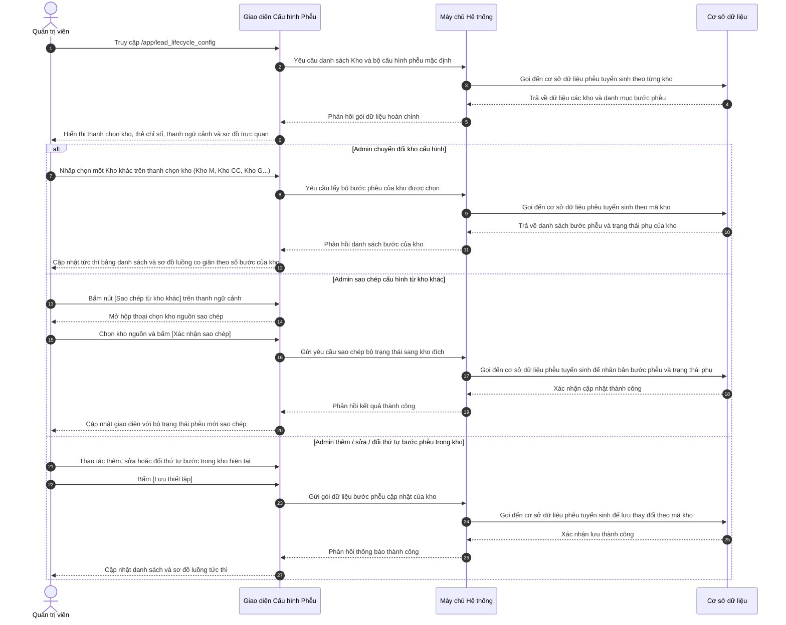

# US-SYS-04-05: Cấu hình Phễu & Kho Lead (Vòng đời Tuyển sinh & Quản trị Kho Dữ liệu)

> **Tham chiếu:** `BF-SYS-04` · `SR-SYSTEM_ADMIN-001` · Giao diện Mẫu §4.2 (Màn hình Danh sách & Cấu hình Phễu)  
> **Đường dẫn màn hình & Trạng thái liên quan:**  
> - `/app/lead_lifecycle_config` $\rightarrow$ Nhóm Cấu hình Hệ thống $\rightarrow$ Cấu hình Phễu & Kho Lead  
> - **Phiên bản hệ thống:** `v2026.09.12.01.station`

---

## 1. NHẬT KÝ THAY ĐỔI & BỐI CẢNH (CHANGELOG & CONTEXT)

### Lịch sử cập nhật tài liệu (Changelog)

| Ngày cập nhật | Nội dung cập nhật | Lý do cập nhật |
|---|---|---|
| 09/09/2026 | Khởi tạo đặc tả màn hình Cấu hình Phễu & Kho Lead: Chuẩn hóa 4 phân hệ (Phễu Vòng đời, Kho Dữ liệu, Mã Cuộc gọi, Ma trận Di chuyển 32 mã cũ) | Tái cấu trúc mô hình Kho và Mối quan hệ cũ sang kiến trúc đa tầng chuẩn hóa Rinov5 |
| 12/09/2026 | Nâng cấp kiến trúc đa phễu theo từng Kho dữ liệu (Multi-pool Pipeline Customization): Cho phép mỗi kho tùy biến độc lập bộ bước phễu và danh mục trạng thái phụ; bổ sung thanh chọn kho nhanh, thanh ngữ cảnh kho, chức năng sao chép cấu hình phễu mẫu giữa các kho và sơ đồ trực quan co giãn theo số bước | Đáp ứng yêu cầu nghiệp vụ thực tế khi mỗi kênh tiếp nhận (Telesale, Marketing, Chăm sóc học viên, Sự kiện) có chu trình chuyển đổi và số bước chăm sóc khác nhau |

### Bối cảnh & Vấn đề nghiệp vụ (Context & Problem)
* **Bối cảnh:** Trước đây, hệ thống cũ quản lý dữ liệu tuyển sinh dựa trên khái niệm các "Kho" (`Kho T`, `Kho C`, `Kho M`) kết hợp với chuỗi 32 mã "Mối quan hệ" trải dài từ giai đoạn T0 đến T4. Tuy nhiên, quy trình xử lý của mỗi nhóm dữ liệu lại có đặc thù rất khác biệt:
  - `Kho Tuyển sinh (Kho T)`: Đi theo chu trình kinh điển 6 bước từ Mới tiếp nhận $\rightarrow$ Đang tư vấn $\rightarrow$ Hẹn Test $\rightarrow$ Kết quả Test $\rightarrow$ Chờ chốt $\rightarrow$ Đã chuyển đổi.
  - `Kho Marketing (Kho M)`: Tập trung vào thẩm định chất lượng lead số 5 bước từ Lead mới $\rightarrow$ Đã xác thực $\rightarrow$ Tư vấn chuyên sâu $\rightarrow$ Thuyết phục đăng ký $\rightarrow$ Đăng ký thành công.
  - `Kho Chăm sóc Học viên (Kho CC)`: Phục vụ tái đăng ký học kỳ mới với chu trình ngắn gọn 4 bước từ Điểm chạm học kỳ $\rightarrow$ Phỏng vấn phụ huynh $\rightarrow$ Đề xuất lộ trình nâng cao $\rightarrow$ Tái đăng ký thành công.
  - `Kho Sự kiện & Đối tác (Kho G)`: Tiếp nhận từ hội thảo, đối tác với 5 bước từ Đăng ký hội thảo $\rightarrow$ Check-in sự kiện $\rightarrow$ Tư vấn sau hội thảo $\rightarrow$ Trải nghiệm thực tế $\rightarrow$ Nhập học chính thức.
* **Vấn đề hiện tại:**
  - Nếu áp đặt một bộ trạng thái cố định cho mọi kho dữ liệu, nhân viên vận hành tại các kho có chu trình ngắn gọn (như Chăm sóc học viên hoặc Sự kiện) buộc phải đi qua các bước thừa thãi không phù hợp với thực tế.
  - Mô hình cũ nhồi nhét kết quả cuộc gọi ngắn hạn ("Không nghe máy", "Hẹn gọi lại", "Số sai") làm biến mất nhu cầu tiềm năng thực sự của khách hàng.
  - Thiếu tính năng sao chép bộ trạng thái mẫu giữa các kho, khiến quản trị viên mất nhiều thao tác cấu hình thủ công lặp đi lặp lại khi mở thêm kho mới.
* **Mục tiêu & Giá trị mang lại:**
  - Thiết lập cơ chế cấu hình bộ trạng thái phễu độc lập theo từng Kho dữ liệu (Per-pool Customization).
  - Cung cấp thanh chọn kho nhanh và thanh ngữ cảnh trực quan, cho phép chuyển đổi tức thì giữa các kho để tinh chỉnh từng bước phễu và trạng thái phụ.
  - Hỗ trợ công cụ sao chép cấu hình phễu từ kho mẫu sang kho mục tiêu chỉ với một thao tác.
  - Tự động đồng bộ bộ bước phễu tương ứng trên màn hình chi tiết khách hàng tiềm năng dựa vào kho dữ liệu mà khách hàng trực thuộc.

### Hiểu người dùng & Tình huống sử dụng (User Needs & Use Cases)
* **Người dùng chính (Persona):** Quản trị viên Hệ thống (`PERSONA-SYSTEM_ADMIN`), Giám đốc Vận hành Tuyển sinh (`PERSONA-BRANCH_MANAGER`).
* **Nhu cầu thực tế (Needs):** Muốn tùy biến số lượng bước phễu, tên gọi, mã bước và danh mục trạng thái phụ phù hợp với chiến lược xử lý dữ liệu của từng kho; muốn sao chép nhanh cấu hình từ kho chuẩn sang kho mới; muốn sơ đồ trực quan thích ứng linh hoạt theo số bước của từng kho mà không vỡ bố cục.
* **Câu phát biểu nghiệp vụ:** **Là một** Quản trị viên Hệ thống, **tôi muốn** tùy biến độc lập bộ trạng thái phễu tuyển sinh cho từng Kho dữ liệu và sao chép cấu hình mẫu giữa các kho, **để** tối ưu hóa quy trình tư vấn theo từng nguồn khách hàng và nâng cao tỷ lệ chuyển đổi tuyển sinh trên toàn hệ thống.

---

## 2. QUY TRÌNH NGHIỆP VỤ & LUỒNG DỮ LIỆU (WORKFLOW & FLOWCHART)

---

## 3. GIAO DIỆN & CẤU TRÚC BIỂU MẪU (DATA & UI STATE)

### 3.1. Bảng Chỉ số Tổng quan (Metric Tiles)

| Tên trường / Thành phần | Kiểu hiển thị | Nguồn dữ liệu | Quy tắc thị giác & Hành vi | Khả năng co giãn trên di động |
|---|---|---|---|---|
| **Kho dữ liệu (Pools)** | Thẻ số liệu | Danh sách Kho | Hiển thị tổng số kho dữ liệu đang kích hoạt kèm nhãn quản lý kho | Hiển thị 2 cột |
| **Bước Phễu của Kho** | Thẻ số liệu | Danh sách Bước phễu theo kho | Hiển thị số lượng bước phễu đang áp dụng cho kho đang chọn | Hiển thị 2 cột |
| **Trạng thái Thành công / Rớt** | Thẻ số liệu | Cấu hình bước phễu | Hiển thị số lượng bước Thành công và bước Thất bại toàn cục | Hiển thị 2 cột |
| **Bản đồ 32 Mã Cũ** | Thẻ số liệu | Bảng ánh xạ cũ | Hiển thị tiến độ quy hoạch 32 trên 32 mã quan hệ cũ sang hệ thống mới | Hiển thị 2 cột |

### 3.2. Thanh Điều hướng Chọn Kho & Thanh Công cụ Thao tác (Top Pool Selector & Toolbar)

| Tên trường / Thành phần | Kiểu hiển thị | Nguồn dữ liệu | Quy tắc thị giác & Hành vi | Khả năng co giãn trên di động |
|---|---|---|---|---|
| **Thẻ chuyển đổi Kho nhanh** | Thanh tab dạng viên thuốc | Danh sách Kho dữ liệu | Mỗi thẻ gồm biểu tượng kênh, tên kho và mã viết tắt; nhấp vào để chuyển đổi tức thì kho đang cấu hình | Cho phép cuộn ngang |
| **Nút Quản lý Kho Dữ liệu** | Nút viền hồng kèm số lượng | Danh sách Kho | Mở danh sách quản lý các kho dữ liệu hiện có trong hệ thống | Thu gọn thành biểu tượng |
| **Chuyển chế độ xem** | Cụm nút chuyển đổi 2 chế độ | Hành động giao diện | Chuyển đổi giữa Chế độ Sơ đồ quy trình trực quan và Chế độ Danh sách chi tiết | Thu gọn thành biểu tượng |
| **Nút Sao chép từ kho khác** | Nút bấm kèm biểu tượng | Hành động giao diện | Mở hộp thoại cho phép nhân bản toàn bộ bước phễu từ kho khác sang kho hiện tại | Thu gọn thành chữ ngắn |
| **Nút Khôi phục kho này** | Nút bấm biểu tượng xoay | Dữ liệu mặc định | Khôi phục bộ bước phễu của kho hiện tại về thiết lập mặc định của hệ thống | Giữ nguyên |

### 3.3. Bảng Danh sách Trạng thái Phễu Tuyển sinh theo Kho (Tab 1)

| Tên trường / Thành phần | Kiểu hiển thị | Nguồn dữ liệu | Quy tắc thị giác & Hành vi | Khả năng co giãn trên di động |
|---|---|---|---|---|
| **Thứ tự bước** | Nút bấm mũi tên lên / xuống | Cấu hình thứ tự của kho | Cho phép bấm lên hoặc xuống để hoán đổi vị trí hiển thị bước phễu trong kho | Giữ nguyên |
| **Trạng thái & Mã bước** | Chữ kèm chấm màu | Danh mục bước của kho | Dòng 1: Tên bước phễu kèm chấm màu nhận diện; Dòng 2: Mã viết tắt (ví dụ: T0, M1, CC2) | Giữ nguyên |
| **Nhóm giai đoạn** | Nhãn văn bản | Giai đoạn của kho | Nhóm giai đoạn theo quy trình (Tiếp nhận, Đang xử lý, Chờ duyệt, Hoàn tất) | Thu gọn |
| **Trạng thái phụ (Sub-statuses)** | Huy hiệu bấm được | Danh mục trạng thái phụ | Hiển thị số lượng trạng thái phụ kèm biểu tượng danh sách; bấm vào để mở hộp thoại quản lý | Giữ nguyên |
| **Hạn mức xử lý** | Số giờ kèm biểu tượng | Hạn mức bước | Hiển thị số giờ quy định để hoàn thành bước phễu này | Ẩn trên di động |
| **Thao tác dòng** | Cụm nút biểu tượng | Hệ thống | Nút bút chì để sửa; nút thùng rác để xóa bước nếu không phải bước cốt lõi | Cố định mép phải |

### 3.4. Hộp thoại Sao chép Cấu hình Bộ Trạng thái giữa các Kho (Copy Stages Dialog)

| Tên trường / Thành phần | Kiểu hiển thị | Nguồn dữ liệu | Quy tắc thị giác & Hành vi | Khả năng co giãn trên di động |
|---|---|---|---|---|
| **Thông tin kho đích** | Khối thông tin | Kho đang chọn | Hiển thị tên và mã kho sẽ được ghi đè cấu hình mới | Toàn chiều rộng |
| **Lựa chọn Kho nguồn** | Danh sách chọn thả xuống | Danh sách các kho khác | Cho phép chọn một kho dữ liệu khác làm mẫu sao chép; không hiển thị kho hiện tại | Toàn chiều rộng |
| **Xem trước số lượng bước** | Khối tóm tắt thông tin | Kho nguồn được chọn | Hiển thị số lượng bước phễu và số trạng thái phụ sẽ được sao chép sang kho đích | Toàn chiều rộng |
| **Cảnh báo ghi đè dữ liệu** | Hộp thông báo màu vàng | Cảnh báo hệ thống | Lưu ý người dùng thao tác sao chép sẽ thay thế toàn bộ danh sách bước phễu hiện tại của kho đích | Toàn chiều rộng |
| **Nút Xác nhận sao chép** | Nút bấm màu nhấn chính | Hành động xác nhận | Thực hiện nhân bản bộ bước phễu, tạo mã định danh mới và đóng hộp thoại | Toàn chiều rộng |

### 3.5. Hộp thoại Quản lý Trạng thái Phụ (Sub-statuses Management Dialog)

| Tên trường / Thành phần | Kiểu hiển thị | Nguồn dữ liệu | Quy tắc thị giác & Hành vi | Khả năng co giãn trên di động |
|---|---|---|---|---|
| **Tiêu đề bước phễu & Kho** | Khối tiêu đề thông tin | Bước phễu đang chọn | Hiển thị tên bước phễu, mã bước và kho dữ liệu đang áp dụng | Toàn chiều rộng |
| **Ô nhập tên trạng thái phụ** | Ô nhập văn bản | Người dùng nhập | Nơi nhập tên trạng thái chi tiết mới (ví dụ: Đã gửi lộ trình, Hẹn gọi lại sau) | Toàn chiều rộng |
| **Nút Thêm trạng thái** | Nút bấm kèm biểu tượng cộng | Hành động thêm mới | Thêm trạng thái phụ mới vào danh sách của bước phễu này | Toàn chiều rộng |
| **Danh sách trạng thái phụ hiện có** | Danh sách các dòng | Cấu hình bước | Hiển thị tên trạng thái phụ, công tắc kích hoạt và nút xóa thùng rác | Cuộn dọc nếu nhiều |
| **Thao tác đóng hộp thoại** | Nút bấm Hoàn tất | Hành động giao diện | Lưu các thay đổi về trạng thái phụ và đóng hộp thoại | Toàn chiều rộng |

---

## 4. KHỐI CHỨC NĂNG CHI TIẾT: ACTIONS & SỰ KIỆN

### Action 4.1: Chuyển đổi kho để tùy biến bộ trạng thái độc lập
* **Tiêu chí nghiệm thu (Acceptance Criteria):**
  - **AC-01 (Happy Path - Chuyển đổi kho dữ liệu):**
    - **Giả sử:** Quản trị viên đang ở màn hình Cấu hình Phễu & Kho Lead và đang xem kho mặc định "Kho Tuyển sinh & Telesale" với 6 bước phễu.
    - **Khi:** Quản trị viên nhấp chuột vào thẻ "Kho Chăm sóc Học viên (CC)" trên thanh chọn kho nhanh phía trên.
    - **Thì:** Giao diện lập tức chuyển đổi ngữ cảnh, hiển thị đúng 4 bước phễu đặc thù của Kho Chăm sóc (từ CC0 đến CC3), cập nhật sơ đồ trực quan co giãn về 4 cột tương ứng và thanh ngữ cảnh hiển thị tên cùng mã định danh Kho Chăm sóc Học viên.

### Action 4.2: Sao chép cấu hình bộ trạng thái từ kho khác
* **Tiêu chí nghiệm thu (Acceptance Criteria):**
  - **AC-02 (Happy Path - Sao chép cấu hình phễu mẫu):**
    - **Giả sử:** Quản trị viên đang ở ngữ cảnh cấu hình của một kho dữ liệu mới tạo hoặc muốn đồng bộ lại cấu hình.
    - **Khi:** Quản trị viên bấm nút [Sao chép từ kho khác] trên thanh ngữ cảnh, chọn kho nguồn là "Kho Marketing (M)" và bấm nút [Xác nhận sao chép].
    - **Thì:** Hệ thống nhân bản toàn bộ 5 bước phễu của Kho Marketing sang kho hiện tại kèm theo đầy đủ các trạng thái phụ, tự động tạo mới mã định danh nội bộ để không bị xung đột dữ liệu, hiển thị thông báo thành công và cập nhật lại bảng hiển thị tức thì.

### Action 4.3: Quản lý danh mục trạng thái phụ theo từng bước phễu của kho
* **Tiêu chí nghiệm thu (Acceptance Criteria):**
  - **AC-03 (Happy Path - Thêm trạng thái phụ mới cho bước phễu):**
    - **Giả sử:** Quản trị viên đang mở bảng danh sách bước phễu của Kho Tuyển sinh và bấm vào huy hiệu "4 trạng thái" tại dòng bước "Đang tư vấn chuyên sâu".
    - **Khi:** Hộp thoại quản lý trạng thái phụ mở ra, Quản trị viên nhập tên "Phụ huynh xin bảo lưu lịch test" vào ô nhập và bấm nút [Thêm].
    - **Thì:** Trạng thái phụ mới được thêm vào danh sách, huy hiệu số lượng trên bảng danh sách chính cập nhật thành "5 trạng thái" và dữ liệu được lưu vào cơ sở dữ liệu phễu tuyển sinh.

### Action 4.4: Thay đổi thứ tự hiển thị bước phễu trong kho
* **Tiêu chí nghiệm thu (Acceptance Criteria):**
  - **AC-04 (Happy Path - Đổi vị trí bước phễu trong kho):**
    - **Giả sử:** Quản trị viên đang xem danh sách bước phễu tại Tab Phễu Vòng đời của một kho dữ liệu.
    - **Khi:** Quản trị viên bấm vào nút mũi tên Lên tại dòng bước thứ 3.
    - **Thì:** Bước này được hoán đổi vị trí với bước thứ 2, số thứ tự tự động cập nhật lại từ 1 đến hết và hệ thống thông báo đã cập nhật thứ tự thành công.

### Action 4.5: Tìm kiếm và lọc mã cũ trong Bản đồ di chuyển dữ liệu
* **Tiêu chí nghiệm thu (Acceptance Criteria):**
  - **AC-05 (Happy Path - Lọc mã legacy theo giai đoạn):**
    - **Giả sử:** Quản trị viên đang xem Tab Bản đồ Di chuyển 32 Mã Cũ.
    - **Khi:** Quản trị viên chọn mục "T3 · Chốt đơn & Giao vận" trên hộp chọn giai đoạn cũ.
    - **Thì:** Bảng chỉ hiển thị đúng các mã thuộc giai đoạn T3 (gồm Bank, COD, Chờ giao hàng, Đã gửi đơn vị vận chuyển, Đang giao hàng, Giao thành công, Chờ duyệt hoàn).

---

## 5. CÁC TRƯỜNG HỢP GÓC CẠNH (CORNER CASES) & LUỒNG NGOẠI LỆ

- **[CASE-01] Xóa trạng thái phễu cốt lõi của hệ thống (Exception Flow - Core Stage Protected):**
  - *Tình huống:* Người dùng cố gắng xóa bước phễu đầu tiên ("Mới tiếp nhận") hoặc bước phễu cuối cùng ("Đã chuyển đổi thành công") trong bất kỳ kho nào.
  - *Cách xử lý:* Hệ thống khóa nút xóa và hiển thị biểu tượng ổ khóa, ngăn chặn tuyệt đối việc xóa các bước nền tảng để bảo đảm tính toàn vẹn của dữ liệu tuyển sinh.
- **[CASE-02] Ngăn chặn sao chép cấu hình từ chính kho hiện tại (Exception Flow - Same Source and Target Pool):**
  - *Tình huống:* Người dùng mở hộp thoại Sao chép từ kho khác và tìm kiếm kho nguồn.
  - *Cách xử lý:* Danh sách chọn kho nguồn tự động loại trừ kho đang được chọn cấu hình, đảm bảo người dùng chỉ có thể chọn một kho khác làm mẫu sao chép.
- **[CASE-03] Xác nhận cảnh báo ghi đè khi sao chép cấu hình (Exception Flow - Overwrite Warning on Clone):**
  - *Tình huống:* Kho đích hiện tại đã có sẵn các bước phễu được tùy biến trước đó.
  - *Cách xử lý:* Hộp thoại sao chép hiển thị khối cảnh báo màu vàng rõ ràng rằng toàn bộ các bước phễu cũ của kho đích sẽ được thay thế bằng bộ bước phễu từ kho nguồn, yêu cầu người dùng xác nhận chủ động trước khi tiến hành ghi đè.
- **[CASE-04] Tự động co giãn sơ đồ trực quan theo số lượng bước phễu (Responsive Flow - Dynamic Diagram Grid):**
  - *Tình huống:* Quản trị viên chuyển đổi qua lại giữa các kho có số bước khác nhau (Kho CC có 4 bước, Kho M có 5 bước, Kho T có 6 bước).
  - *Cách xử lý:* Giao diện sơ đồ trực quan tự động tính toán lại số cột hiển thị theo tỷ lệ lưới tương ứng, đảm bảo các thẻ bước phễu, đường nối mũi tên và khối kết thúc thất bại toàn cục luôn căn chỉnh hoàn hảo, không bị tràn hay co rúm giao diện.
- **[CASE-05] Đồng bộ phễu dọc trên màn hình chi tiết khách hàng tiềm năng theo kho (Sync Flow - Lead Detail Vertical Pipeline):**
  - *Tình huống:* Nhân viên tư vấn mở màn hình chi tiết của một khách hàng tiềm năng trực thuộc Kho Marketing hoặc Kho Chăm sóc.
  - *Cách xử lý:* Giao diện chi tiết tự động truy xuất cấu hình bước phễu của đúng kho đó để hiển thị trên thanh phễu dọc, đồng thời hiển thị huy hiệu tên kho bên cạnh trạng thái và nạp đúng danh mục trạng thái phụ để nhân viên lựa chọn thao tác nhanh.
- **[CASE-06] Hồ sơ khách hàng tiềm năng bị quá hạn xử lý trong Kho (Exception Flow - SLA Recirculation Timeout):**
  - *Tình huống:* Một hồ sơ khách hàng mới tiếp nhận trong kho nhưng sau thời hạn hạn mức quy định của kho đó mà nhân sự không phát sinh bất kỳ cuộc gọi nào.
  - *Cách xử lý:* Hệ thống kích hoạt quy trình tự động thu hồi hồ sơ về kho chung để tái phân bổ và ghi nhận cảnh báo nhắc nhở hiệu suất.

