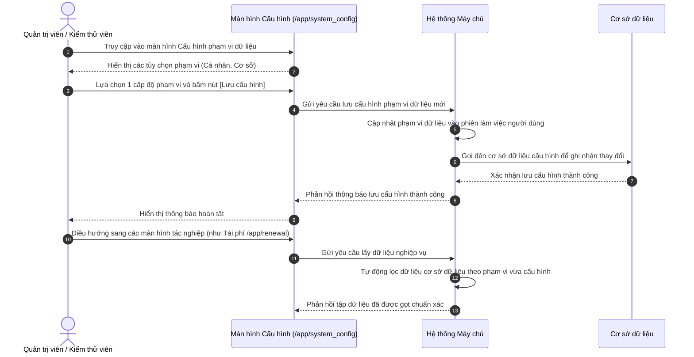

# US-SYS-04-06: Thiết lập Phân quyền Phạm vi Dữ liệu cho Người dùng

> **Tham chiếu:** `BF-SYS-04` · `SR-SYSTEM_ADMIN-001` · Giao diện Mẫu §4.4 (Biểu mẫu / Hộp thoại cấu hình)  
> **Đường dẫn màn hình & Trạng thái liên quan:**  
> - `/app/system_config` $\rightarrow$ Màn hình Cấu hình Phạm vi Dữ liệu Hệ thống  
> - `/app/permissions` $\rightarrow$ Quản trị Nhóm quyền và Cột Phạm vi Dữ liệu  
> - **Phiên bản hệ thống:** `v2026.09.15.01.station`

---

## 1. NHẬT KÝ THAY ĐỔI & BỐI CẢNH (CHANGELOG & CONTEXT)

### Lịch sử cập nhật tài liệu (Changelog)

| Ngày cập nhật | Nội dung cập nhật | Lý do cập nhật |
|---|---|---|
| 15/09/2026 | Khởi tạo tài liệu nền tảng về cơ chế Phân định Phạm vi Dữ liệu (Data Scope) và Cấu hình hệ thống | Tách bạch giữa quyền thao tác chức năng và biên giới phạm vi dữ liệu kiểm soát ngầm |
| 15/09/2026 | Bổ sung màn hình Cấu hình hệ thống làm bàn điều khiển thử nghiệm phạm vi cho môi trường kiểm thử | Cung cấp công cụ chuyển đổi vai trò linh hoạt cho đội ngũ phát triển và kiểm thử |

### Bối cảnh & Vấn đề nghiệp vụ (Context & Problem)
* **Bối cảnh:** Trong hệ thống quản lý trường học và trung tâm đào tạo, phân quyền người dùng gồm hai lớp độc lập: Lớp thẩm quyền thao tác (được làm gì: xem, thêm, sửa, xóa, xuất dữ liệu) và Lớp biên giới dữ liệu (được thao tác trên những dữ liệu nào: dữ liệu của chính mình, dữ liệu của cơ sở mình công tác, hay toàn bộ chuỗi cơ sở).
* **Vấn đề hiện tại:** Trước đây hệ thống chủ yếu kiểm soát theo hành động nút bấm, chưa phân tách biên giới phạm vi dữ liệu rõ ràng. Dữ liệu tải về giao diện thường là danh sách phẳng, cần người dùng tự tay chọn bộ lọc thủ công, dẫn đến nguy cơ nhân sự tiếp cận dữ liệu ngoài thẩm quyền và gây quá tải xử lý.
* **Mục tiêu & Giá trị mang lại:** Thiết lập chuẩn hóa 3 cấp độ phạm vi dữ liệu (Cá nhân, Cơ sở, Toàn chuỗi). Cung cấp màn hình Cấu hình hệ thống (`/app/system_config`) để điều phối phạm vi dữ liệu ngầm cho các phân hệ tác nghiệp, đảm bảo dữ liệu máy chủ trả về được gọt đúng biên giới phân quyền ngay từ đầu.

### Hiểu người dùng & Tình huống sử dụng (User Needs & Use Cases)
* **Người dùng chính (Persona):** Quản trị viên Hệ thống (`PERSONA-SYSTEM_ADMIN`), Giám đốc Vận hành, Kiểm thử viên.
* **Nhu cầu thực tế (Needs):** Mong muốn kiểm soát chặt chẽ biên giới dữ liệu của từng nhóm vai trò; trên môi trường phát triển cần công cụ chuyển đổi nhanh giữa các cấp độ phạm vi để kiểm chứng việc hiển thị dữ liệu mà không phải thay đổi cấu hình phức tạp.
* **Câu phát biểu nghiệp vụ:** **Là một** Quản trị viên Hệ thống, **tôi muốn** thiết lập và cấu hình phạm vi dữ liệu cho các tài khoản người dùng, **để** đảm bảo mỗi nhân sự chỉ xem và xử lý đúng phạm vi dữ liệu được giao quyền.

### Phạm vi kiểm soát (Scope & Classification)

| Tiêu chí đánh giá | Nội dung đối soát thực tế | Điểm số (0 / 1) |
|---|---|:---:|
| **Tiêu chí A: Phạm vi ảnh hưởng hệ thống** | Tác động đến cơ chế lọc dữ liệu ngầm của toàn bộ các phân hệ Station | 1 |
| **Tiêu chí B: Tác động tài chính** | Ảnh hưởng đến việc bảo mật dữ liệu doanh thu, học phí và khách hàng | 1 |
| **Tiêu chí C1: Loại thay đổi nghiệp vụ** | Bổ sung lớp kiến trúc phân định phạm vi dữ liệu vào hệ thống phân quyền | 1 |
| **Tiêu chí C2: Độ mới nghiệp vụ** | Đã định hình rõ ma trận phân tầng 3 cấp độ dữ liệu | 0 |
| **Tiêu chí D: Liên kết dịch vụ ngoài** | Vận hành nội bộ, không phụ thuộc dịch vụ đối tác ngoài | 0 |

* **Tổng điểm đánh giá:** 3/5 điểm $\rightarrow$ 🔴 **Risk** (Yêu cầu Quản lý Dự án và Trưởng nhóm Kỹ thuật phê duyệt).

### Bảng Danh mục Chức năng (Feature Scope Matrix)

| Mã Yêu Cầu | Tên Chức Năng | Mức Độ Ưu Tiên | Phân Loại Rủi Ro | Ghi Chú Nghiệp Vụ |
|---|---|:---:|:---:|---|
| **FEAT-01** | Cấu hình Phạm vi Dữ liệu Cấp độ Cá nhân (`personal`) | Bắt buộc (Must) | 🔴 Risk | Giới hạn dữ liệu theo bản thân người phụ trách |
| **FEAT-02** | Cấu hình Phạm vi Dữ liệu Cấp độ Cơ sở (`branch`) | Bắt buộc (Must) | 🔴 Risk | Giới hạn dữ liệu theo cơ sở công tác |
| **FEAT-03** | Cấu hình Phạm vi Dữ liệu Cấp độ Toàn chuỗi (`all`) | Bắt buộc (Must) | 🔴 Risk | Không giới hạn cơ sở, xem toàn bộ dữ liệu |
| **FEAT-04** | Màn hình Cấu hình hệ thống phục vụ thử nghiệm (`/app/system_config`) | Bắt buộc (Must) | 🟢 Standard | Cho phép chọn nhanh phạm vi và lưu cấu hình |
| **FEAT-05** | Đồng bộ phạm vi ngầm vào phiên làm việc của người dùng | Bắt buộc (Must) | 🟢 Standard | Máy chủ tự động áp dụng phạm vi khi truy vấn |
| **FEAT-06** | Ẩn hoàn toàn thông tin cấu hình phạm vi trên màn hình nghiệp vụ | Bắt buộc (Must) | 🟢 Standard | Đảm bảo giao diện tác nghiệp gọn gàng và tự nhiên |

### Quy tắc Nghiệp vụ Toàn cục (Business Rules)
1. **Ưu tiên phạm vi hẹp:** Trong trường hợp người dùng mang nhiều vai trò, hệ thống áp dụng phạm vi theo đúng vai trò đang kích hoạt của phiên làm việc.
2. **Lọc ngầm tuyệt đối:** Việc gọt dữ liệu theo phạm vi phải diễn ra tại máy chủ khi truy vấn cơ sở dữ liệu, không gửi toàn bộ dữ liệu xuống giao diện rồi mới lọc.
3. **Thống nhất thẻ chỉ số:** Tất cả các bảng biểu, thẻ thống kê số lượng và danh sách xuất dữ liệu đều phải tuân thủ nghiêm ngặt phạm vi dữ liệu được gán.
4. **Không phô bày nhãn cấu hình:** Không hiển thị các thanh biểu ngữ hay nhãn thông báo phạm vi trên các màn hình nghiệp vụ thông thường.

---

## 2. LUỒNG XỬ LÝ CHÍNH (MAIN FLOW - HAPPY PATH)

---

## 3. GIAO DIỆN & CẤU TRÚC BIỂU MẪU (UI & CONFIGURATION)

### 3.1. Cấu trúc Ma trận Phân cấp Phạm vi Dữ liệu

| Cấp độ | Mã Định Danh | Tên Hiển Thị | Diễn Giải Nghiệp Vụ | Điều Kiện Lọc Trong Cơ Sở Dữ Liệu |
|:---:|---|---|---|---|
| **1** | `personal` | **Cá nhân** | Chỉ xem và thao tác trên những bản ghi do chính người dùng phụ trách hoặc giảng dạy | Bản ghi có mã người phụ trách trùng với mã tài khoản đăng nhập |
| **2** | `branch` | **Cơ sở** | Xem và thao tác toàn bộ bản ghi phát sinh tại cơ sở mà người dùng đang công tác | Bản ghi có mã cơ sở trùng với mã cơ sở công tác của người dùng |
| **3** | `all` | **Toàn chuỗi** | Xem và thao tác toàn bộ bản ghi trên toàn hệ thống không phân biệt cơ sở | Không áp dụng điều kiện giới hạn cơ sở hay người phụ trách |

### 3.2. Cấu trúc Màn hình Cấu hình Hệ thống (`/app/system_config`)

| Thành phần Giao diện | Kiểu Hiển Thị | Tùy Chọn / Giá Trị | Hành Động Kích Hoạt |
|---|---|---|---|
| **Tiêu đề trang** | Tiêu đề lớn | "Cấu hình phạm vi dữ liệu" | Hiển thị mô tả mục đích thiết lập |
| **Tùy chọn Cá nhân** | Thẻ lựa chọn duy nhất | Nhãn "Cá nhân", diễn giải chi tiết | Nhấp để chọn phạm vi cá nhân |
| **Tùy chọn Cơ sở** | Thẻ lựa chọn duy nhất | Nhãn "Cơ sở", diễn giải chi tiết | Nhấp để chọn phạm vi cơ sở |
| **Nút [Lưu cấu hình]** | Nút hành động nổi bật | Nhãn "Lưu cấu hình" | Gửi lệnh cập nhật cấu hình phạm vi |

---

## 4. KHỐI CHỨC NĂNG CHI TIẾT: ACTION & TIÊU CHÍ NGHIỆM THU (ACTIONS & ACCEPTANCE CRITERIA)

### Khối chức năng 1: Thiết lập và Lưu trữ Phạm vi Dữ liệu

#### Action 1.1: Chọn và lưu phạm vi dữ liệu Cá nhân
* **Luồng kích hoạt:** Người dùng chọn tùy chọn Cá nhân trên màn hình Cấu hình hệ thống và bấm Lưu.
* **Tiêu chí nghiệm thu:**
  - **AC-1 (Happy Path - Lưu cấu hình thành công):**
    - **Giả sử:** Người dùng đang ở màn hình Cấu hình hệ thống (`/app/system_config`).
    - **Khi:** Người dùng nhấp chọn ô "Cá nhân" và bấm nút [Lưu cấu hình].
    - **Thì:** Giao diện hiển thị thông báo "Đã lưu cấu hình phạm vi dữ liệu thành công" và hệ thống ghi nhận phạm vi mới cho tài khoản.
  - **AC-2 (Alternate Path - Kiểm chứng gọt dữ liệu trên màn hình tác nghiệp):**
    - **Giả sử:** Người dùng vừa lưu phạm vi Cá nhân thành công.
    - **Khi:** Người dùng truy cập màn hình Tái phí (`/app/renewal`) hoặc Danh sách học viên.
    - **Thì:** Dữ liệu chỉ hiển thị các bản ghi thuộc quyền phụ trách cá nhân của người dùng, không xuất hiện các bản ghi của người khác.

#### Action 1.2: Chọn và lưu phạm vi dữ liệu Cơ sở
* **Luồng kích hoạt:** Người dùng chọn tùy chọn Cơ sở trên màn hình Cấu hình hệ thống và bấm Lưu.
* **Tiêu chí nghiệm thu:**
  - **AC-3 (Happy Path - Mở rộng dữ liệu toàn cơ sở):**
    - **Giả sử:** Người dùng đang ở màn hình Cấu hình hệ thống (`/app/system_config`).
    - **Khi:** Người dùng chọn ô "Cơ sở" và bấm nút [Lưu cấu hình].
    - **Thì:** Hệ thống lưu cấu hình thành công và cập nhật phiên làm việc sang phạm vi cơ sở.
  - **AC-4 (Happy Path - Dữ liệu mở rộng chuẩn xác):**
    - **Giả sử:** Cấu hình phạm vi Cơ sở đã được kích hoạt.
    - **Khi:** Người dùng chuyển sang màn hình Tái phí học viên (`/app/renewal`).
    - **Thì:** Bảng danh sách mở rộng hiển thị toàn bộ học viên thuộc cơ sở công tác của người dùng và các thẻ số liệu đếm tăng lên tương ứng.

---

## 5. CÁC TRƯỜNG HỢP GÓC CẠNH (CORNER CASES)

- **Trường hợp 1 (Tài khoản thuộc nhiều cơ sở):** Khi nhân viên được phân công làm việc tại nhiều cơ sở, hệ thống cung cấp thêm ô chọn cơ sở làm việc hiện tại và áp dụng phạm vi Cơ sở cho đúng cơ sở đang chọn.
- **Trường hợp 2 (Thay đổi phạm vi khi nhiều tab đang mở):** Khi người dùng đổi phạm vi ở tab cấu hình, các tab tác nghiệp khác khi tải lại dữ liệu sẽ tự động đồng bộ theo phạm vi mới nhất.
- **Trường hợp 3 (Tài khoản không được cấu hình phạm vi):** Nếu tài khoản mới tạo chưa được thiết lập phạm vi cụ thể, hệ thống tự động gán phạm vi mặc định an toàn nhất là phạm vi Cá nhân.
- **Trường hợp 4 (Người dùng cố tình can thiệp tham số lọc):** Khi người dùng sửa đổi tham số trên đường dẫn để cố xem dữ liệu cơ sở khác, máy chủ tự động chặn và chỉ trả về dữ liệu đúng phạm vi được cấp phép.
- **Trường hợp 5 (Nhân sự không có dữ liệu cá nhân nào):** Với phạm vi Cá nhân, nếu nhân sự chưa được phân công bản ghi nào, hệ thống hiển thị màn hình danh sách trống kèm chỉ dẫn phù hợp.

---

## 6. LUỒNG NGOẠI LỆ & XỬ LÝ SỰ CỐ (EXCEPTION FLOW)

- **Ngoại lệ 1 (Lỗi kết nối khi lưu cấu hình):** Khi bấm nút Lưu cấu hình nhưng máy chủ mất kết nối quá thời gian quy định, giao diện hiển thị thông báo lỗi và giữ nguyên trạng thái lựa chọn để người dùng thử lại.
- **Ngoại lệ 2 (Hết phiên đăng nhập khi đang cấu hình):** Nếu phiên đăng nhập hết hạn, hệ thống yêu cầu đăng nhập lại trước khi lưu cấu hình phạm vi.
- **Ngoại lệ 3 (Tài khoản không có quyền thay đổi cấu hình):** Nếu người dùng không có quyền quản trị cấu hình, hệ thống ẩn nút Lưu cấu hình và vô hiệu hóa các ô lựa chọn.

---

## 7. QUY TẮC KIỂM SOÁT & RÀNG BUỘC DỮ LIỆU (VALIDATION RULES)

- **Ràng buộc 1 (Lựa chọn đơn nhất):** Tại một thời điểm, phiên làm việc chỉ được kích hoạt đúng 1 cấp độ phạm vi dữ liệu duy nhất.
- **Ràng buộc 2 (Bảo toàn dữ liệu phiên):** Cấu hình phạm vi được lưu giữ ổn định trong suốt phiên làm việc cho đến khi người dùng chủ động thay đổi hoặc đăng xuất.
- **Ràng buộc 3 (Tính hợp lệ của cơ sở công tác):** Tài khoản cấu hình phạm vi Cơ sở bắt buộc phải có thông tin cơ sở công tác hợp lệ trong hồ sơ nhân sự.

---

## 8. YÊU CẦU PHI CHỨC NĂNG (NON-FUNCTIONAL REQUIREMENTS)

- **Hiệu năng áp dụng phạm vi:** Thời gian máy chủ xử lý điều kiện lọc phạm vi và phản hồi dữ liệu không vượt quá 500 mili-giây.
- **Bảo mật tuyệt đối:** Nghiêm cấm gửi dữ liệu nằm ngoài phạm vi xuống giao diện người dùng dưới mọi hình thức.
- **Khả năng mở rộng:** Cấu trúc phạm vi được thiết kế đồng nhất để có thể áp dụng ngay cho các phân hệ khác (Tuyển sinh, Đơn hàng, Lịch biểu, Điểm danh).

---

## 9. KẾT NỐI MÁY CHỦ & DỮ LIỆU PHẢN HỒI (SERVER SPECIFICATION)

- **Yêu cầu lưu cấu hình phạm vi:** Giao diện gửi gói tin chứa mã phạm vi được chọn (`personal` hoặc `branch`) cùng mã phiên đăng nhập.
- **Xử lý tại máy chủ:** Máy chủ xác thực tính hợp lệ của tài khoản, cập nhật trạng thái phiên và gọi đến cơ sở dữ liệu cấu hình để lưu vết.
- **Dữ liệu phản hồi:** Máy chủ phản hồi trạng thái xác nhận lưu thành công kèm mã phạm vi đang có hiệu lực.
