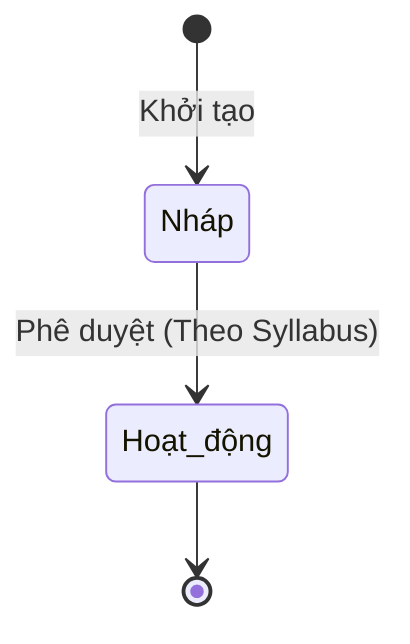

# BF-ACD-04: Thành phần bài học

> **Capability:** CAP-ACD (Năng lực Học thuật & Đào tạo)
> **Giai đoạn:** 3 - Hồ sơ & Sản phẩm
> **Nhóm chức năng:** Chương trình đào tạo
> **Mã màn hình:** `lesson_components`

---

## 1. Mô tả tổng quan

Phân hệ quản lý chi tiết các thành phần cấu thành một bài học cụ thể (Topic). Nó giúp chia nhỏ một bài học 90 phút thành các hoạt động nhỏ hơn (Ví dụ: Khởi động, Giảng bài, Thực hành, Kiểm tra nhanh) và đính kèm học liệu tương ứng vào từng hoạt động đó.

## 2. Đối tượng sử dụng (Vai trò)

- **Chuyên viên Học thuật:** Xây dựng, biên soạn chi tiết các hoạt động trong một bài học.
- **Giám đốc Học thuật:** Phê duyệt hoặc kiểm tra cấu trúc giảng dạy.

## 3. Ranh giới Nghiệp vụ (Scope)

### Có bao gồm (In Scope)
- Tạo các Hoạt động (Activity) bên trong một Chủ đề Bài học (Topic).
- Định lượng thời gian dự kiến cho từng hoạt động (Ví dụ: Khởi động 10 phút, Thực hành 30 phút).
- Đính kèm tài liệu, liên kết, hoặc bài tập vào từng hoạt động.

### Không bao gồm (Out of Scope)
- Tạo Khung chương trình (Syllabus) → Đã xử lý tại `BF-ACD-03`.
- Đánh giá trên lớp thực tế → Xử lý tại `BF-CLS-05`.
- Chấm bài tập về nhà của học viên → Xử lý tại `BF-CLS-05`.

## 4. Mô hình Dữ liệu Nghiệp vụ (Data Entities)

| Tên Thực thể | Trường định danh | Thuộc tính quan trọng | Ràng buộc quan hệ | Diễn giải |
|--------------|------------------|-----------------------|-------------------|----------|
| Hoạt động Bài học | Mã hoạt động | Tên, Loại (Lý thuyết, Thực hành), Thời lượng | Trỏ về Mã Bài học (Topic) | Từng đoạn nhỏ trong một buổi học. |
| Học liệu đính kèm | Mã học liệu | Tên, URL file, Loại file | Trỏ về Mã Hoạt động | File tài liệu, video, bài test. |

### 4.1. Vòng đời Trạng thái (Status Lifecycle)

*Sơ đồ dưới đây xác định tất cả trạng thái hợp lệ và các phép chuyển đổi được phép.*

*(Lưu ý: Thành phần bài học kế thừa vòng đời trạng thái của Khung chương trình chứa nó)*

**Quy tắc chuyển đổi:**

| Từ trạng thái | Sang trạng thái | Điều kiện bắt buộc | Vai trò được phép |
|---------------|-----------------|---------------------|-------------------|
| Nháp | Hoạt động | Syllabus chứa nó được Xuất bản | Hệ thống tự động |

### 4.2. Ví dụ Dữ liệu mẫu

*Giúp AI và Lập trình viên tạo dữ liệu kiểm thử chính xác.*

| Tình huống | Dữ liệu đầu vào | Kết quả mong đợi |
|------------|-----------------|-------------------|
| Tạo Hoạt động | Tên: "Warm-up Games", Thời lượng: 15p, Bài học: Bài 1 | Lưu thành công vào Bài 1. |
| Đính kèm file | File: "game_rules.pdf", Hoạt động: Warm-up Games | File được gắn thành công. |
| Vượt tổng thời lượng | Hoạt động 1: 60p, Hoạt động 2: 40p (Tổng 100p) > Chuẩn 90p | Cảnh báo thời lượng vượt chuẩn, nhưng vẫn cho lưu. |

## 5. Quy tắc Nghiệp vụ Tổng thể (Business Rules)

1. **[RULE-ACD-04-01] Quản lý Thời lượng:** Tổng thời lượng (phút) của tất cả Hoạt động trong một Bài học không nên vượt quá cấu hình Thời lượng mặc định của Lớp (quy định tại Thiết lập học thuật).

## 6. Danh sách Yêu cầu Người dùng (User Stories)

| Mã Yêu cầu | Tên Yêu cầu (Loại màn hình) | Đường dẫn truy cập | Trạng thái |
|------------|-----------------------------|--------------------|------------|
| US-ACD-04-01 | Quản lý danh sách Hoạt động (Danh sách) | Nằm trong chi tiết Syllabus | Đang soạn thảo |
| US-ACD-04-02 | Thêm/Sửa/Xóa Hoạt động và File (Biểu mẫu/Bảng nổi) | Nằm trong chi tiết Syllabus | Đang soạn thảo |

---

## 7. Chỉ dẫn cho AI Agent & Lập trình viên (Business Architecture)

- Tuân thủ chặt chẽ cấu trúc thực thể ở mục 4. Phải đảm bảo tính toàn vẹn dữ liệu nghiệp vụ (dữ liệu bảng con phải trỏ đúng mã có thật của bảng cha).
- Mọi trạng thái liệt kê trong sơ đồ 4.1 phải được ánh xạ đầy đủ vào hệ thống.
- Giao diện và luồng xử lý phải tuân thủ bảng chuyển đổi trạng thái (chỉ hiển thị các hành động hợp lệ theo từng trạng thái và phân quyền).

### ⛔ Hàng rào An toàn (Guardrails)
- **KHÔNG** thêm trường dữ liệu hoặc thực thể ngoài danh sách quy định ở mục 4.
- **KHÔNG** thay đổi cấu trúc quan hệ thực thể mà chưa được phê duyệt từ Product Owner.
- **KHÔNG** tạo trạng thái nghiệp vụ mới ngoài sơ đồ ở mục 4.1. Mọi sự thay đổi vòng đời phải được cập nhật vào tài liệu này trước.

