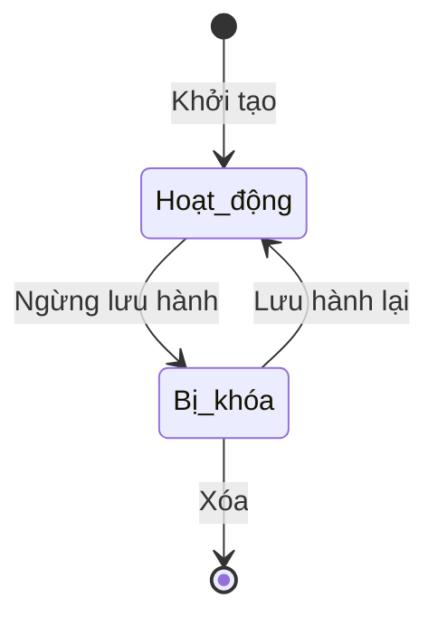

# BF-ACD-06: Giáo trình

> **Capability:** CAP-ACD (Năng lực Học thuật & Đào tạo)
> **Giai đoạn:** 3 - Hồ sơ & Sản phẩm
> **Nhóm chức năng:** Chương trình đào tạo
> **Mã màn hình:** `curriculum`

---

## 1. Mô tả tổng quan

Phân hệ quản lý danh mục Giáo trình giảng dạy (sách giáo khoa, sách bài tập, học liệu in ấn hoặc điện tử) được sử dụng thống nhất trên toàn hệ thống. Phân hệ này là nền tảng để gắn sách vào từng Cấp độ học hoặc bán kèm cho học viên trong các Gói sản phẩm.

## 2. Đối tượng sử dụng (Vai trò)

- **Giám đốc Học thuật:** Phê duyệt danh mục sách sử dụng trong trung tâm.
- **Thủ thư / Quản lý kho:** Quản lý số lượng tồn kho (nếu có tích hợp kho).

## 3. Ranh giới Nghiệp vụ (Scope)

### Có bao gồm (In Scope)
- Tạo mới và quản lý thông tin Giáo trình (Tên, Tác giả, Nhà xuất bản, Loại bìa).
- Gắn file số (Ebook) nếu có bản quyền sử dụng nội bộ.
- Định nghĩa mối liên kết giữa Giáo trình và các Chương trình đào tạo.

### Không bao gồm (Out of Scope)
- Bán giáo trình lấy tiền → Thuộc `CAP-COM` (Thương mại). Phân hệ này chỉ quản lý danh mục Gốc.
- Quản lý vật lý xuất nhập kho → Nếu phức tạp, sẽ có hệ thống Inventory riêng, không thuộc Học thuật.

## 4. Mô hình Dữ liệu Nghiệp vụ (Data Entities)

| Tên Thực thể | Trường định danh | Thuộc tính quan trọng | Ràng buộc quan hệ | Diễn giải |
|--------------|------------------|-----------------------|-------------------|----------|
| Giáo trình | Mã giáo trình | Tên sách, Tác giả, Loại (In ấn/Số), Trạng thái | Độc lập | Sản phẩm cốt lõi. |

### 4.1. Vòng đời Trạng thái (Status Lifecycle)

*Sơ đồ dưới đây xác định tất cả trạng thái hợp lệ và các phép chuyển đổi được phép.*

**Quy tắc chuyển đổi:**

| Từ trạng thái | Sang trạng thái | Điều kiện bắt buộc | Vai trò được phép |
|---------------|-----------------|---------------------|-------------------|
| Tạo mới | Hoạt động | Cần có Tên và Tác giả/NXB | Giám đốc Học thuật |
| Hoạt động | Bị khóa | Không cần điều kiện | Giám đốc Học thuật |
| Bị khóa | Xóa | Không bị dính với bất kỳ Lớp học hay Đơn hàng nào | Giám đốc Học thuật |

### 4.2. Ví dụ Dữ liệu mẫu

*Giúp AI và Lập trình viên tạo dữ liệu kiểm thử chính xác.*

| Tình huống | Dữ liệu đầu vào | Kết quả mong đợi |
|------------|-----------------|-------------------|
| Tạo sách | Tên: "IELTS Cambridge 15", Loại: In ấn, Trạng thái: Hoạt động | Lưu thành công. |
| Xóa sách lỗi | Sách "Toán lớp 1" đã được mua trong 10 Đơn hàng -> Nhấn Xóa | Báo lỗi: "Giáo trình đã phát sinh giao dịch, chỉ được phép Khóa". |

## 5. Quy tắc Nghiệp vụ Tổng thể (Business Rules)

1. **[RULE-ACD-06-01] Ràng buộc Tham chiếu:** Giáo trình là dữ liệu tham chiếu (Master Data) của Học thuật. Khi sửa tên giáo trình, nó sẽ cập nhật tên hiển thị ở mọi Lớp học đang sử dụng.

## 6. Danh sách Yêu cầu Người dùng (User Stories)

| Mã Yêu cầu | Tên Yêu cầu (Loại màn hình) | Đường dẫn truy cập | Trạng thái |
|------------|-----------------------------|--------------------|------------|
| US-ACD-06-01 | Quản lý danh mục Giáo trình (Danh sách) | /app/curriculum | Đang soạn thảo |
| US-ACD-06-02 | Tạo/Cập nhật Giáo trình (Biểu mẫu) | Không có | Đang soạn thảo |

---

## 7. Chỉ dẫn cho AI Agent & Lập trình viên (Business Architecture)

- Tuân thủ chặt chẽ cấu trúc thực thể ở mục 4. Phải đảm bảo tính toàn vẹn dữ liệu nghiệp vụ (dữ liệu bảng con phải trỏ đúng mã có thật của bảng cha).
- Mọi trạng thái liệt kê trong sơ đồ 4.1 phải được ánh xạ đầy đủ vào hệ thống.
- Giao diện và luồng xử lý phải tuân thủ bảng chuyển đổi trạng thái (chỉ hiển thị các hành động hợp lệ theo từng trạng thái và phân quyền).

### ⛔ Hàng rào An toàn (Guardrails)
- **KHÔNG** thêm trường dữ liệu hoặc thực thể ngoài danh sách quy định ở mục 4.
- **KHÔNG** thay đổi cấu trúc quan hệ thực thể mà chưa được phê duyệt từ Product Owner.
- **KHÔNG** tạo trạng thái nghiệp vụ mới ngoài sơ đồ ở mục 4.1. Mọi sự thay đổi vòng đời phải được cập nhật vào tài liệu này trước.

