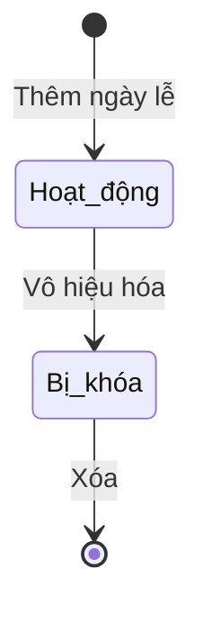

# BF-ACD-07: Thiết lập học thuật

> **Capability:** CAP-ACD (Năng lực Học thuật & Đào tạo)
> **Giai đoạn:** 1 - Thiết lập
> **Nhóm chức năng:** Thiết lập chung
> **Mã màn hình:** `academic_settings`

---

## 1. Mô tả tổng quan

Phân hệ quản lý các cấu hình nền tảng dành riêng cho khối Học thuật (VD: thời lượng lớp học mặc định, sĩ số tối đa, danh sách các ngày nghỉ lễ được áp dụng cho việc xếp lịch). Những tham số này là "luật chơi" cơ bản để hệ thống Vận hành (`CAP-OPS`) sinh ra lịch học chính xác.

## 2. Đối tượng sử dụng (Vai trò)

- **Giám đốc Học thuật:** Quyết định các tham số tiêu chuẩn của trung tâm.
- **Quản trị hệ thống:** Cấu hình thông số kỹ thuật.

## 3. Ranh giới Nghiệp vụ (Scope)

### Có bao gồm (In Scope)
- Cấu hình các Tham số Lớp học mặc định (Sĩ số tối đa, Thời lượng buổi học).
- Cấu hình Danh mục Lịch nghỉ lễ (Holidays) dùng cho toàn trung tâm.

### Không bao gồm (Out of Scope)
- Cấu hình giờ mở cửa chi nhánh → Thuộc `BF-ORG-01` (CAP-HR).
- Xử lý đổi lịch/học bù cho Lớp do trúng ngày lễ → Thuộc `BF-OPS-03` (CAP-OPS).

## 4. Mô hình Dữ liệu Nghiệp vụ (Data Entities)

| Tên Thực thể | Trường định danh | Thuộc tính quan trọng | Ràng buộc quan hệ | Diễn giải |
|--------------|------------------|-----------------------|-------------------|----------|
| Tham số Lớp học | Mã tham số | Tên tham số, Giá trị mặc định | Độc lập | Ví dụ: `DEFAULT_SESSION_DURATION` = 90 |
| Lịch nghỉ lễ | Mã ngày lễ | Tên ngày lễ, Ngày bắt đầu, Ngày kết thúc | Độc lập | Dữ liệu dùng để né lịch khi auto-schedule. |

### 4.1. Vòng đời Trạng thái (Status Lifecycle)

*Sơ đồ dưới đây xác định tất cả trạng thái hợp lệ và các phép chuyển đổi được phép.*

**Quy tắc chuyển đổi:**

| Từ trạng thái | Sang trạng thái | Điều kiện bắt buộc | Vai trò được phép |
|---------------|-----------------|---------------------|-------------------|
| Hoạt động | Bị khóa | Không giới hạn | Giám đốc Học thuật |

### 4.2. Ví dụ Dữ liệu mẫu

*Giúp AI và Lập trình viên tạo dữ liệu kiểm thử chính xác.*

| Tình huống | Dữ liệu đầu vào | Kết quả mong đợi |
|------------|-----------------|-------------------|
| Sửa tham số | `MAX_STUDENTS_PER_CLASS` = 15 | Lớp học tạo mới sau này sẽ lấy max = 15. Lớp cũ không đổi. |
| Thêm nghỉ lễ | Lễ Quốc khánh, Từ 01/09 đến 02/09 | Lưu thành công. Hệ thống OPS sẽ né ngày này khi xếp lịch. |

## 5. Quy tắc Nghiệp vụ Tổng thể (Business Rules)

1. **[RULE-ACD-07-01] Áp dụng tương lai:** Các thay đổi về tham số lớp học (Sĩ số, Thời lượng) chỉ áp dụng cho các Lớp học được khởi tạo SAU thời điểm cập nhật. Không áp dụng hồi tố (retroactive) cho các lớp đang chạy.
2. **[RULE-ACD-07-02] Nghỉ lễ:** Khi một Ngày nghỉ lễ được thêm mới, hệ thống Vận hành (`CAP-OPS`) sẽ quét các lịch học tương lai bị trùng và gợi ý dời lịch.

## 6. Danh sách Yêu cầu Người dùng (User Stories)

| Mã Yêu cầu | Tên Yêu cầu (Loại màn hình) | Đường dẫn truy cập | Trạng thái |
|------------|-----------------------------|--------------------|------------|
| US-ACD-07-01 | Thiết lập Tham số Lớp học (Biểu mẫu) | /app/academic_settings | Đã có US |
| US-ACD-07-02 | Thiết lập Lịch nghỉ lễ Học thuật (Danh sách) | /app/academic_settings | Đã có US |

---

## 7. Chỉ dẫn cho AI Agent & Lập trình viên (Business Architecture)

- Tuân thủ chặt chẽ cấu trúc thực thể ở mục 4. Phải đảm bảo tính toàn vẹn dữ liệu nghiệp vụ (dữ liệu bảng con phải trỏ đúng mã có thật của bảng cha).
- Mọi trạng thái liệt kê trong sơ đồ 4.1 phải được ánh xạ đầy đủ vào hệ thống.
- Giao diện và luồng xử lý phải tuân thủ bảng chuyển đổi trạng thái (chỉ hiển thị các hành động hợp lệ theo từng trạng thái và phân quyền).

### ⛔ Hàng rào An toàn (Guardrails)
- **KHÔNG** thêm trường dữ liệu hoặc thực thể ngoài danh sách quy định ở mục 4.
- **KHÔNG** thay đổi cấu trúc quan hệ thực thể mà chưa được phê duyệt từ Product Owner.
- **KHÔNG** tạo trạng thái nghiệp vụ mới ngoài sơ đồ ở mục 4.1. Mọi sự thay đổi vòng đời phải được cập nhật vào tài liệu này trước.

