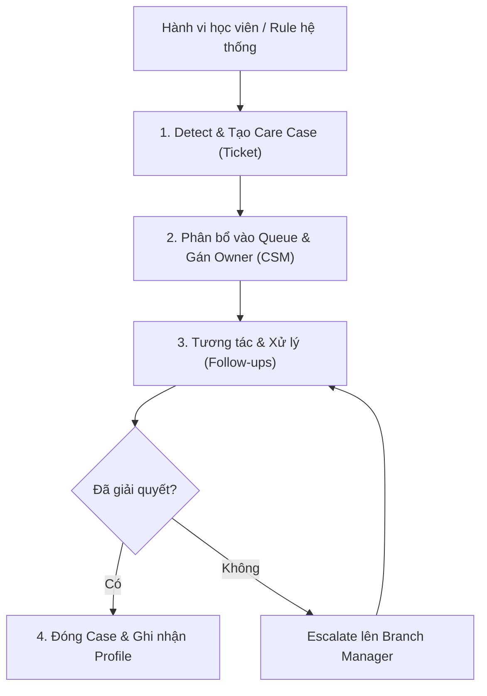

# BF-CARE-01: Chăm sóc học viên (Student Care)

> **Capability:** CAP-CARE
> **Giai đoạn:** 7 — Chăm sóc khách hàng
> **Nhóm sidebar:** Chăm sóc
> **Menu ID:** `student_care_new`, `care_schedule`, `today_care`, `new_student_care`, `at_risk_care`, `overdue_care`, `special_care`, `care_event`, `care_rule_engine`

---

## 1. Mô tả nghiệp vụ

Đây là business function quản lý vòng đời chăm sóc học viên (ngoại trừ quá trình tái phí/renewal). Nó quản lý các queue chăm sóc, rule phát sinh case chăm sóc tự động hoặc thủ công dựa trên vòng đời học viên (học viên mới, at-risk, overdue, chăm sóc đặc biệt) nhằm mục tiêu duy trì mức độ hài lòng, giải quyết khiếu nại và giảm thiểu rủi ro nghỉ học (retention).

## 2. Đối tượng sử dụng (Actors)

- CSM (Chuyên viên chăm sóc học viên)
- Branch Manager
- Care Admin
- Teacher (Ghi nhận thông tin at-risk)

## 3. Phạm vi (Scope)

### Trong phạm vi (In Scope)

- Thiết lập rule engine để tự động detect và tạo care case (vd: vắng mặt nhiều, điểm kém, vừa mới nhập học).
- Phân bổ và quản lý các queue chăm sóc (Today Care, New Student, At-Risk, Overdue, Special).
- Theo dõi và xử lý vòng đời một ticket chăm sóc (Tạo -> Assign -> Tương tác -> Giải quyết/Escalate -> Đóng).
- Ghi nhận lịch sử tương tác chăm sóc vào Master Profile.

### Ngoài phạm vi (Out of Scope)

- Quy trình theo dõi, tư vấn và xử lý Tái phí/Gia hạn (thuộc `BF-CARE-02`).
- Chăm sóc Lead chưa chuyển đổi (thuộc `BF-CRM-01`, `BF-CRM-02`).

## 4. Nghiệp vụ liên quan

- **Upstream:** `BF-OPS-03`, `BF-CLS-05` (Class Delivery Lifecycle) - Hành vi vắng mặt hoặc điểm kém từ lớp học là trigger tạo ra At-Risk care case.
- **Upstream:** `BF-ENR-03` (Enrollment Conversion Management) - Học viên vừa đăng ký thành công sẽ trigger quy trình New Student Care.
- **Downstream:** `BF-CARE-02` (Tái phí) - Chăm sóc tốt là tiền đề để chuyển đổi tái phí.

## 5. User Stories

**Danh sách US đề xuất (Proposed):**
- [ ] US-CARE-01: Thiết lập và quản lý Care Rule Engine.
- [ ] US-CARE-02: Quản lý Queue chăm sóc (Today, New Student, At-Risk, Special).
- [ ] US-CARE-03: Xử lý và ghi nhận chi tiết tương tác một Care Ticket.
- [ ] US-CARE-04: Báo cáo hiệu suất và cảnh báo (Escalation) các case chưa xử lý (Overdue Care).

## 6. Luồng vận hành tổng thể (End-to-End Flow)

## 7. Quy tắc nghiệp vụ (Business Rules)

1. Care Case tự động phát sinh không thể bị xóa, chỉ có thể được xử lý và đánh dấu là "Resolved" hoặc "Escalated".
2. Hệ thống phải đảm bảo việc tự động gán (Auto-assign) case cho CSM phụ trách lớp hoặc chi nhánh tương ứng.
3. Mọi tương tác trong Care Case phải được đồng bộ vào lịch sử tương tác chung của Master Profile (để Sales và Teachers cùng nắm được tình hình).

## 8. Dữ liệu chính (Key Data)

| Entity | Mô tả |
|--------|-------|
| Care Rule | Bộ quy tắc sinh logic tự động (If X happens, create Care Case Y). |
| Care Case (Ticket) | Phiếu ghi nhận vấn đề cần chăm sóc của học viên (có trạng thái, độ ưu tiên, owner). |
| Care Interaction | Nhật ký các lần liên hệ (Call, Zalo, Meeting) để xử lý Care Case. |

## 9. Ghi chú triển khai

- **Registry mapping:** `care.student_care_and_retention_management`
- **Backend:** `missing` (Hệ thống ticket/care case hiện tại cần bổ sung API).
- **Frontend:** Các màn hình quản lý Queue (`student_care_new`, `care_schedule`) hiện mới chỉ nằm ở menu.
- **Gaps:** Cần tách bạch rõ ràng giữa CRM Interaction (cho Lead) và Care Interaction (cho Student).
