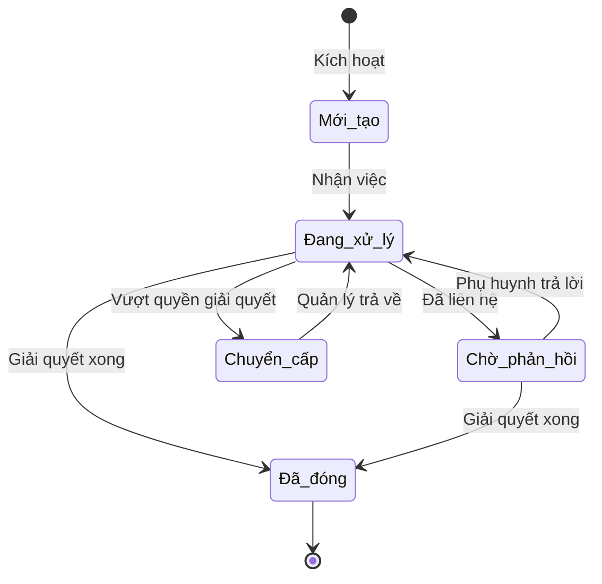

# BF-CARE-01: Chăm sóc & Xử lý khiếu nại

> **Capability:** CAP-CARE (Năng lực Chăm sóc Học viên)
> **Giai đoạn:** 2 - Vận hành
> **Nhóm chức năng:** Chăm sóc
> **Mã màn hình:** `student_care_new`, `care_schedule`

---

## 1. Mô tả tổng quan

Phân hệ quản lý vòng đời chăm sóc học viên (ngoại trừ quá trình tái phí). Nó quản lý các danh sách công việc (queue), quy tắc phát sinh phiếu chăm sóc (Ticket) tự động hoặc thủ công dựa trên hành vi học viên (vắng mặt nhiều, điểm kém, vừa mới nhập học) nhằm mục tiêu duy trì mức độ hài lòng, giải quyết khiếu nại và giảm thiểu rủi ro nghỉ học.

## 2. Đối tượng sử dụng (Vai trò)

- **Chuyên viên Chăm sóc Học viên:** Người trực tiếp liên hệ, ghi nhận phản hồi và xử lý khiếu nại.
- **Quản lý Chi nhánh:** Theo dõi tiến độ xử lý khiếu nại và can thiệp khi cần thiết.
- **Giáo viên:** Báo cáo các học viên có nguy cơ (at-risk) trên lớp để tạo phiếu chăm sóc.

## 3. Ranh giới Nghiệp vụ (Scope)

### Có bao gồm (In Scope)
- Thiết lập bộ quy tắc tự động sinh phiếu chăm sóc (Ví dụ: vắng mặt 3 buổi liên tiếp).
- Phân bổ và quản lý phiếu chăm sóc theo loại (Học viên mới, Cảnh báo học tập, Khiếu nại).
- Theo dõi vòng đời của một phiếu chăm sóc (Tạo → Giao việc → Xử lý → Đóng).
- Ghi nhận lịch sử tương tác vào hồ sơ học viên.

### Không bao gồm (Out of Scope)
- Quy trình theo dõi và xử lý Tái phí/Gia hạn → Xử lý tại `BF-CARE-02`.
- Chăm sóc khách hàng tiềm năng chưa đóng tiền → Thuộc CRM (`CAP-ADM`).

## 4. Mô hình Dữ liệu Nghiệp vụ (Data Entities)

| Tên Thực thể | Trường định danh | Thuộc tính quan trọng | Ràng buộc quan hệ | Diễn giải |
|--------------|------------------|-----------------------|-------------------|----------|
| Quy tắc Chăm sóc | Mã quy tắc | Tên, Điều kiện kích hoạt, Hành động | Độc lập | Bộ quy tắc sinh phiếu tự động. |
| Phiếu Chăm sóc | Mã phiếu | Loại phiếu, Trạng thái, Người phụ trách | Trỏ về Mã Học viên | Vé ghi nhận yêu cầu chăm sóc. |
| Nhật ký Tương tác | Mã nhật ký | Kênh (Gọi/Tin nhắn), Nội dung, Thời gian | Trỏ về Mã Phiếu | Lịch sử làm việc với phụ huynh. |

### 4.1. Vòng đời Trạng thái (Status Lifecycle)

*Sơ đồ dưới đây xác định tất cả trạng thái hợp lệ và các phép chuyển đổi được phép đối với Phiếu Chăm sóc.*

**Quy tắc chuyển đổi:**

| Từ trạng thái | Sang trạng thái | Điều kiện bắt buộc | Vai trò được phép |
|---------------|-----------------|---------------------|-------------------|
| Mới tạo | Đang xử lý | Nhân viên nhận xử lý phiếu | Chuyên viên Chăm sóc |
| Đang xử lý | Chuyển cấp | Cần cấp quản lý quyết định (ví dụ: bồi thường) | Chuyên viên Chăm sóc |
| Bất kỳ | Đã đóng | Ghi chú lý do đóng phiếu rõ ràng | Chuyên viên / Quản lý |

### 4.2. Ví dụ Dữ liệu mẫu

*Giúp AI và Lập trình viên tạo dữ liệu kiểm thử chính xác.*

| Tình huống | Dữ liệu đầu vào | Kết quả mong đợi |
|------------|-----------------|-------------------|
| Hệ thống tạo phiếu tự động | Học viên A vắng mặt buổi thứ 3 liên tiếp | Phiếu loại "Cảnh báo vắng mặt" được tạo, trạng thái "Mới tạo". |
| Cập nhật nhật ký | Phụ huynh báo "Cháu bị ốm", qua cuộc gọi lúc 10h | Phiếu chuyển sang "Đã đóng", nhật ký ghi nhận nội dung. |
| Giao việc trống | Chọn Nhân viên = (trống) khi giao phiếu | Cảnh báo: "Phải chọn nhân viên phụ trách". |

## 5. Quy tắc Nghiệp vụ Tổng thể (Business Rules)

1. **[RULE-CARE-01-01] Tính bất biến của hệ thống:** Phiếu chăm sóc do hệ thống tự động sinh ra KHÔNG THỂ bị xóa bằng tay, chỉ có thể được xử lý và đánh dấu là "Đã đóng" hoặc "Chuyển cấp".
2. **[RULE-CARE-01-02] Tự động giao việc:** Hệ thống tự động gán phiếu chăm sóc cho nhân viên đang phụ trách quản lý Lớp học hoặc Chi nhánh tương ứng.

## 6. Danh sách Yêu cầu Người dùng (User Stories)

| Mã Yêu cầu | Tên Yêu cầu (Loại màn hình) | Đường dẫn truy cập | Trạng thái |
|------------|-----------------------------|--------------------|------------|
| US-CARE-01-01 | Quản lý danh sách Phiếu chăm sóc (Danh sách) | /app/today_care | Đang soạn thảo |
| US-CARE-01-02 | Chi tiết & Xử lý Phiếu chăm sóc (Bảng nổi) | Không có | Đang soạn thảo |
| US-CARE-01-03 | Thiết lập Quy tắc chăm sóc tự động (Biểu mẫu) | /app/care_rule_engine | Đang soạn thảo |

---

## 7. Chỉ dẫn cho AI Agent & Lập trình viên (Business Architecture)

- Tuân thủ chặt chẽ cấu trúc thực thể ở mục 4. Phải đảm bảo tính toàn vẹn dữ liệu nghiệp vụ (dữ liệu bảng con phải trỏ đúng mã có thật của bảng cha).
- Mọi trạng thái liệt kê trong sơ đồ 4.1 phải được ánh xạ đầy đủ vào hệ thống.
- Giao diện và luồng xử lý phải tuân thủ bảng chuyển đổi trạng thái (chỉ hiển thị các hành động hợp lệ theo từng trạng thái và phân quyền).

### ⛔ Hàng rào An toàn (Guardrails)
- **KHÔNG** thêm trường dữ liệu hoặc thực thể ngoài danh sách quy định ở mục 4.
- **KHÔNG** thay đổi cấu trúc quan hệ thực thể mà chưa được phê duyệt từ Product Owner.
- **KHÔNG** tạo trạng thái nghiệp vụ mới ngoài sơ đồ ở mục 4.1. Mọi sự thay đổi vòng đời phải được cập nhật vào tài liệu này trước.

