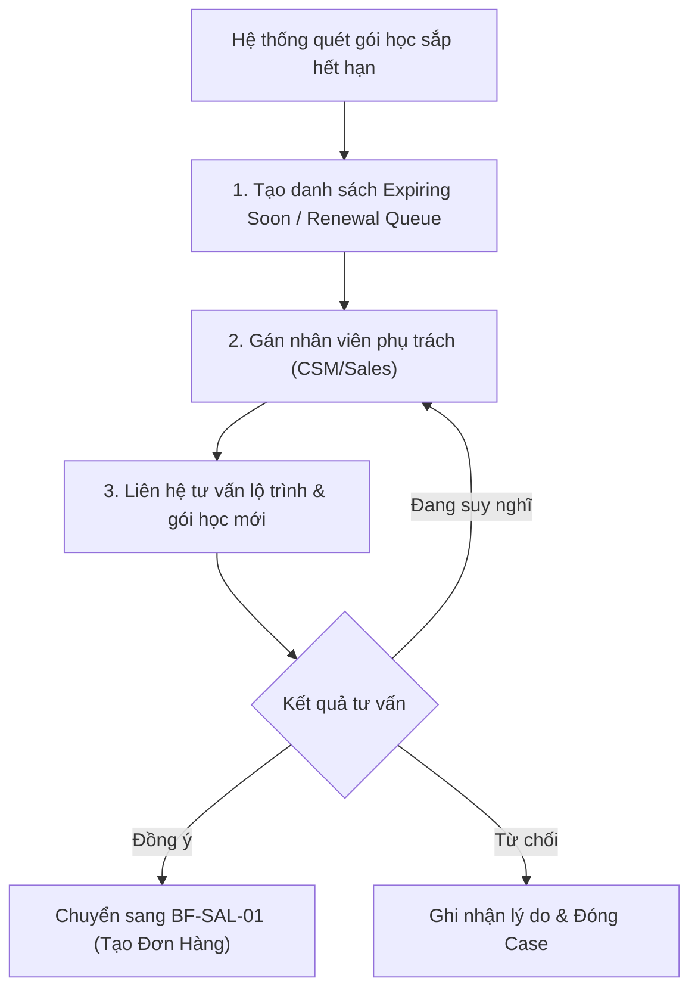

# BF-CARE-02: Chăm sóc tái phí (Renewal & Retention)

> **Capability:** CAP-CARE
> **Giai đoạn:** 7 — Chăm sóc khách hàng
> **Nhóm sidebar:** Chăm sóc
> **Menu ID:** `renewal`, `expiring_soon_care`

---

## 1. Mô tả nghiệp vụ

Đây là business function chuyên biệt quản lý quy trình tái phí (renewal) và giữ chân học viên (retention campaign). Nghiệp vụ này theo dõi các học viên sắp hết hạn thẻ học hoặc số buổi học, tự động đưa vào danh sách cần chăm sóc tái phí, quản lý việc tư vấn, đề xuất gói học tiếp theo và theo dõi tỷ lệ chuyển đổi tái phí thành công.

## 2. Đối tượng sử dụng (Actors)

- CSM (Chuyên viên chăm sóc khách hàng / tư vấn tái phí)
- Branch Manager
- Sales (Nhận bàn giao chốt deal nếu cần)

## 3. Phạm vi (Scope)

### Trong phạm vi (In Scope)

- Tự động nhận diện học viên sắp hết hạn (Expiring Soon) dựa trên số buổi còn lại hoặc thời hạn của gói học hiện tại.
- Quản lý danh sách (Queue) học viên cần chăm sóc tái phí.
- Ghi nhận lịch sử tương tác, lý do từ chối tái phí (nếu có) hoặc nguyện vọng học tiếp.
- Đề xuất lộ trình/gói học tiếp theo cho học viên.
- Phối hợp với nghiệp vụ Bán hàng (Order) để đóng quy trình tái phí.

### Ngoài phạm vi (Out of Scope)

- Quá trình chốt đơn hàng và thanh toán gói học mới (thuộc `BF-SAL-01`).
- Các nghiệp vụ chăm sóc phàn nàn, học viên nghỉ học nhiều, hoặc xin bảo lưu (thuộc `BF-CARE-01`).

## 4. Nghiệp vụ liên quan

- **Upstream:** `BF-OPS-03` (Vòng đời buổi học) - Cập nhật số buổi đã học để trigger cảnh báo sắp hết hạn.
- **Upstream:** `BF-CARE-01` (Student Care) - Mức độ hài lòng từ các tương tác chăm sóc trước đó ảnh hưởng trực tiếp đến tỷ lệ tái phí.
- **Downstream:** `BF-SAL-01` (Đơn hàng) - Khi học viên đồng ý gia hạn, quy trình chuyển sang chốt đơn và thanh toán.

## 5. User Stories

**Danh sách US đề xuất (Proposed):**
- [ ] US-CARE-05: Cấu hình điều kiện cảnh báo sắp hết hạn (ví dụ: còn dưới 5 buổi hoặc 15 ngày).
- [ ] US-CARE-06: Quản lý danh sách học viên Expiring Soon và Renewal Queue.
- [ ] US-CARE-07: Ghi nhận tương tác tư vấn tái phí và đánh giá tỷ lệ chuyển đổi thành công.

## 6. Luồng vận hành tổng thể (End-to-End Flow)

## 7. Quy tắc nghiệp vụ (Business Rules)

1. Học viên sẽ được đưa vào danh sách Expiring Soon theo ngưỡng cài đặt của hệ thống (ví dụ: còn ≤ 10% tổng số buổi hoặc ≤ 1 tháng).
2. Khi học viên có đơn hàng mới (Paid) được ghi nhận trong `BF-SAL-01`, trạng thái Renewal của họ phải được hệ thống tự động đánh dấu là "Thành công" và loại khỏi Queue hiện tại.
3. Nếu học viên học hết buổi nhưng không gia hạn, hồ sơ sẽ chuyển trạng thái Inactive/Alumni sau một khoảng thời gian chờ quy định (Grace period).

## 8. Dữ liệu chính (Key Data)

| Entity | Mô tả |
|--------|-------|
| Renewal Queue | Danh sách các học viên thỏa mãn điều kiện sắp hết hạn, cần theo dõi tái phí. |
| Renewal Interaction | Các lượt tương tác (gọi điện, nhắn tin, tư vấn tại cơ sở) cụ thể cho mục đích tái phí. |
| Churn Reason | Lý do học viên không tiếp tục gia hạn khóa học (dùng cho báo cáo). |

## 9. Ghi chú triển khai

- **Registry mapping:** `care.student_care_and_retention_management` (phân hệ phụ trách Renewal).
- **Backend:** `missing` (Quy tắc tự động tính toán buổi còn lại và sinh danh sách Renewal cần được làm rõ).
- **Frontend:** Các màn hình `renewal` và `expiring_soon_care` hiện chưa được định nghĩa chi tiết trong mã nguồn.
- **Gaps:** Cần phối hợp với Team Data/Backend để định nghĩa rõ "Ngưỡng cảnh báo hết hạn" sẽ do Backend quét định kỳ (Cronjob) hay tính toán realtime.
